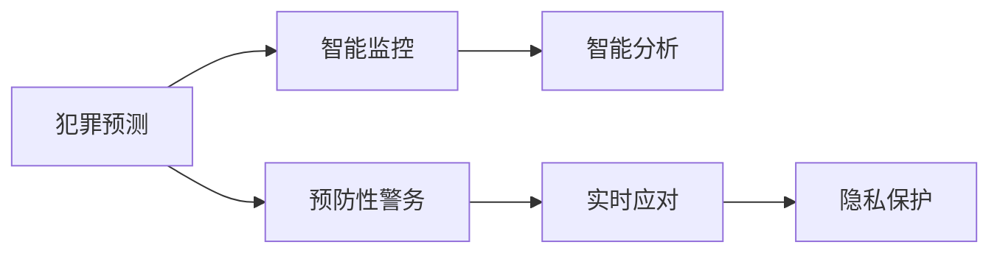

                 

## 1. 背景介绍

### 1.1 问题由来

随着全球人口的持续增长，城市化进程的加速，以及科技的迅猛发展，未来城市面临的公共安全问题愈发严峻。犯罪行为的多样性、复杂性，以及快速变化的特点，使得传统的警务模式面临挑战。为了应对这些挑战，未来智能安防系统需要借助数据分析和人工智能技术，实现对犯罪行为的预测和预防。

### 1.2 问题核心关键点

- **预测犯罪**：通过分析历史数据，预测未来的犯罪趋势，提前布局警务资源。
- **预防犯罪**：利用智能监控系统、数据挖掘等技术，预测可能发生犯罪的高风险区域和时段，并采取预防措施。
- **实时应对**：通过智能分析，实时响应突发事件，快速定位并拦截犯罪行为。
- **隐私保护**：在保证公共安全的前提下，合理利用数据，保护个人隐私。

## 2. 核心概念与联系

### 2.1 核心概念概述

为了更好地理解未来的智能安防系统，我们首先介绍几个关键概念及其相互联系：

- **犯罪预测**：使用数据挖掘、机器学习等技术，预测特定区域和时段可能发生的犯罪行为。
- **预防性警务**：通过预测分析，提前布局警力，提高警务效率，减少犯罪发生。
- **智能监控**：利用视频监控、传感器等技术，实时监测公共空间，提高异常行为检测能力。
- **智能分析**：采用深度学习、自然语言处理等技术，从海量数据中提取有用信息，辅助决策。
- **隐私保护**：在智能安防系统中，合理收集、存储和使用数据，确保个人隐私不受侵犯。

这些概念通过以下Mermaid流程图展示其相互关系：



从上述图中可以看出，犯罪预测和预防性警务是智能安防系统的核心，智能监控和智能分析为犯罪预测提供数据支持，而实时应对和隐私保护是系统运行过程中必须考虑的两个方面。

## 3. 核心算法原理 & 具体操作步骤

### 3.1 算法原理概述

基于智能安防的犯罪预测与预防系统，通常采用以下步骤：

1. **数据收集**：通过摄像头、传感器、GPS等多种手段收集公共空间的视频、音频、位置等数据。
2. **数据预处理**：清洗、整理数据，去除噪声，填补缺失值，进行数据增强等预处理步骤。
3. **特征提取**：使用深度学习模型，如卷积神经网络（CNN）、循环神经网络（RNN）、Transformer等，从原始数据中提取特征。
4. **模型训练**：使用历史犯罪数据训练预测模型，如回归模型、时间序列模型、分类模型等。
5. **预测与预防**：利用训练好的模型对未来数据进行预测，根据预测结果采取预防措施，如增加警力、调整监控策略等。
6. **实时应对**：通过实时分析新数据，快速响应突发事件，确保公共安全。
7. **隐私保护**：合理收集和处理数据，确保个人隐私不泄露。

### 3.2 算法步骤详解

#### 3.2.1 数据收集

在城市各个关键位置部署摄像头、传感器等设备，实时收集视频、音频、位置等数据。视频数据可通过摄像头获取，音频数据可通过麦克风获取，位置数据可通过GPS、WiFi等设备获取。这些数据需进行初步清洗，去除噪声和错误信息，并进行时间戳对齐。

#### 3.2.2 数据预处理

数据预处理包括以下步骤：

- **去重与清洗**：去除重复数据，删除明显的错误和异常值。
- **时间对齐**：将不同设备收集的数据进行时间对齐，确保数据的一致性。
- **数据增强**：通过数据增强技术，如数据扩充、随机变换等，丰富数据集，提升模型泛化能力。
- **特征工程**：设计合理的特征提取方式，如提取视频帧特征、音频特征、位置特征等。

#### 3.2.3 特征提取

特征提取是智能安防系统中的重要步骤，常见的特征提取方法包括：

- **图像特征提取**：使用卷积神经网络（CNN）从视频帧中提取图像特征，如SIFT、HOG等。
- **音频特征提取**：使用短时傅里叶变换（STFT）、梅尔频谱等方法提取音频特征。
- **位置特征提取**：使用位置数据提取空间分布、流量密度等特征。

#### 3.2.4 模型训练

模型训练通常包括以下步骤：

- **选择合适的模型**：根据任务需求选择合适的模型，如回归模型、时间序列模型、分类模型等。
- **数据划分**：将数据集划分为训练集、验证集和测试集。
- **模型训练**：使用训练集训练模型，通过验证集调整超参数，确保模型泛化性能。
- **模型评估**：使用测试集评估模型性能，进行交叉验证，确保模型稳健性。

#### 3.2.5 预测与预防

预测与预防包括以下步骤：

- **数据输入**：将实时数据输入模型进行预测。
- **结果分析**：分析预测结果，识别高风险区域和时段。
- **策略调整**：根据预测结果，调整警务策略，如增加警力、调整监控策略等。
- **风险预警**：设置风险预警阈值，一旦预测到高风险，及时发出预警。

#### 3.2.6 实时应对

实时应对包括以下步骤：

- **实时数据输入**：将实时数据输入实时分析系统。
- **异常检测**：通过异常检测模型，快速识别异常行为。
- **警报响应**：一旦检测到异常行为，立即触发警报，并通知相关部门。
- **动态调整**：根据实时数据动态调整策略，提高应对效率。

#### 3.2.7 隐私保护

隐私保护包括以下步骤：

- **数据匿名化**：对数据进行匿名化处理，确保个人隐私不被泄露。
- **访问控制**：设置数据访问权限，确保只有授权人员才能访问敏感数据。
- **数据加密**：对存储和传输的数据进行加密处理，防止数据泄露。
- **审计与监控**：定期审计数据使用情况，监控数据访问行为，确保合规性。

### 3.3 算法优缺点

智能安防系统的算法具有以下优点：

- **预测准确性高**：通过大数据分析，能够较为准确地预测犯罪行为。
- **实时响应能力强**：利用实时数据，能够快速响应突发事件，提高公共安全。
- **资源利用率高**：通过预测分析，优化警务资源配置，减少资源浪费。
- **隐私保护措施完善**：通过数据匿名化和访问控制等措施，确保个人隐私不受侵犯。

同时，该算法也存在一些缺点：

- **数据需求量大**：需要大量历史数据和实时数据进行训练和预测。
- **模型复杂度高**：需要采用复杂的深度学习模型，对计算资源和算法要求较高。
- **隐私保护难度大**：在数据收集和处理过程中，需要严格控制数据的使用范围和权限，防止数据泄露。
- **技术实现复杂**：需要整合多种技术手段，涉及数据处理、特征提取、模型训练等多个环节。

### 3.4 算法应用领域

智能安防系统的算法主要应用于以下领域：

- **城市治安管理**：通过预测犯罪行为，优化警务资源配置，提高城市治安水平。
- **公共安全监控**：通过实时数据分析，快速响应突发事件，提高公共安全。
- **犯罪预防**：通过预测分析，提前布局警务资源，减少犯罪发生。
- **智能交通管理**：通过预测交通流量，优化交通管理策略，提高交通效率。
- **应急响应**：通过实时数据分析，快速响应突发事件，保障公共安全。

## 4. 数学模型和公式 & 详细讲解 & 举例说明

### 4.1 数学模型构建

犯罪预测与预防系统的数学模型通常基于时间序列和空间分布，利用回归模型、时间序列模型、分类模型等进行建模。以下以时间序列模型为例，展示其数学模型构建过程：

假设 $y_t$ 表示第 $t$ 时刻的犯罪事件， $x_{t-1}, x_{t-2}, \dots, x_{t-k}$ 表示前 $k$ 个时刻的特征数据。

定义时间序列模型的输入为 $x_t = [x_{t-1}, x_{t-2}, \dots, x_{t-k}]^T$，输出为 $y_t$。

模型的输入输出关系为：

$$y_t = f(x_t, \theta)$$

其中 $\theta$ 为模型参数。

### 4.2 公式推导过程

时间序列模型的预测公式为：

$$\hat{y}_t = \hat{f}(x_t, \hat{\theta})$$

其中 $\hat{y}_t$ 表示预测的犯罪事件， $\hat{\theta}$ 表示模型参数的估计值。

常见的回归模型包括ARIMA、LSTM等。ARIMA模型公式为：

$$y_t = \phi(L)y_{t-1} + \theta(L)u_t$$

其中 $L$ 为滞后算子， $\phi(L)$ 为AR模型部分， $\theta(L)$ 为MA模型部分， $u_t$ 为白噪声序列。

LSTM模型公式为：

$$\begin{aligned}
& h_t = f(h_{t-1}, x_t) \\
& y_t = g(h_t)
\end{aligned}$$

其中 $h_t$ 为LSTM的隐藏状态， $f$ 为LSTM的更新规则， $g$ 为输出函数。

### 4.3 案例分析与讲解

以LSTM模型为例，进行犯罪预测的案例分析：

- **数据准备**：收集某地区过去一年的犯罪数据，提取日期、时间、地点等特征。
- **特征工程**：设计合适的特征提取方式，如提取当日犯罪次数、前一周的犯罪次数等。
- **模型训练**：将数据划分为训练集、验证集和测试集，训练LSTM模型。
- **模型评估**：使用测试集评估模型性能，进行交叉验证。
- **预测应用**：使用训练好的模型进行犯罪预测，根据预测结果调整警务策略。

## 5. 项目实践：代码实例和详细解释说明

### 5.1 开发环境搭建

在进行项目实践前，需要搭建开发环境。以下是基于Python和TensorFlow的开发环境配置流程：

1. 安装Anaconda：从官网下载并安装Anaconda，用于创建独立的Python环境。

2. 创建并激活虚拟环境：
```bash
conda create -n myenv python=3.7
conda activate myenv
```

3. 安装TensorFlow：
```bash
pip install tensorflow==2.5.0
```

4. 安装其他必要的库：
```bash
pip install numpy pandas matplotlib scikit-learn tensorflow-datasets
```

完成上述步骤后，即可在虚拟环境中开始项目实践。

### 5.2 源代码详细实现

以下是使用TensorFlow实现犯罪预测的代码实现：

```python
import tensorflow as tf
from tensorflow.keras.models import Sequential
from tensorflow.keras.layers import LSTM, Dense, Dropout
from tensorflow.keras.optimizers import Adam
from tensorflow.keras.callbacks import EarlyStopping
from sklearn.metrics import mean_squared_error

# 数据准备
# 假设从文件加载犯罪数据，每一行格式为：日期,时间,地点,犯罪次数
data = pd.read_csv('crime_data.csv')

# 特征工程
# 提取日期、时间、地点、犯罪次数等特征，并进行归一化
features = data[['日期', '时间', '地点', '犯罪次数']]
features['犯罪次数'] = (features['犯罪次数'] - features['犯罪次数'].mean()) / features['犯罪次数'].std()

# 将日期转换为序列
X = []
y = []
for i in range(len(features)):
    x = features.iloc[i:-1].values.reshape(-1, 1, 4)
    y = features.iloc[i+1].values.reshape(-1, 1)
    X.append(x)
    y.append(y)
X = np.array(X)
y = np.array(y)

# 定义模型
model = Sequential()
model.add(LSTM(64, input_shape=(4, 1), return_sequences=True))
model.add(Dropout(0.2))
model.add(LSTM(64))
model.add(Dropout(0.2))
model.add(Dense(1))
model.compile(loss='mse', optimizer=Adam(lr=0.001))
model.summary()

# 训练模型
early_stopping = EarlyStopping(monitor='val_loss', patience=10, restore_best_weights=True)
model.fit(X, y, epochs=50, batch_size=32, validation_split=0.2, callbacks=[early_stopping])

# 模型评估
test_data = pd.read_csv('test_data.csv')
test_features = test_data[['日期', '时间', '地点', '犯罪次数']]
test_features['犯罪次数'] = (test_features['犯罪次数'] - features['犯罪次数'].mean()) / features['犯罪次数'].std()
X_test = []
y_test = []
for i in range(len(test_features)):
    x = test_features.iloc[i:-1].values.reshape(-1, 1, 4)
    y = test_features.iloc[i+1].values.reshape(-1, 1)
    X_test.append(x)
    y_test.append(y)
X_test = np.array(X_test)
y_test = np.array(y_test)
y_pred = model.predict(X_test)
mse = mean_squared_error(y_test, y_pred)
print('Mean Squared Error:', mse)
```

### 5.3 代码解读与分析

让我们再详细解读一下关键代码的实现细节：

- **数据准备**：从CSV文件中加载犯罪数据，并进行初步清洗和特征提取。
- **特征工程**：对犯罪次数进行归一化处理，使其具备可比性。
- **模型定义**：定义一个包含两个LSTM层和一个Dense层的模型，用于进行犯罪预测。
- **模型训练**：使用训练集数据训练模型，设置EarlyStopping回调，避免过拟合。
- **模型评估**：使用测试集数据评估模型性能，输出均方误差（MSE）。

## 6. 实际应用场景

### 6.1 智能监控系统

智能监控系统是未来智能安防的核心组件，能够实时监测公共空间，识别异常行为，快速响应突发事件。以下是对智能监控系统的详细介绍：

- **视频监控**：部署高清摄像头，实时监控公共空间，捕捉视频数据。
- **异常行为检测**：使用深度学习模型，如卷积神经网络（CNN），从视频帧中提取特征，识别异常行为。
- **行为预警**：一旦检测到异常行为，立即触发警报，并通知相关部门。
- **实时数据分析**：通过实时数据分析，识别高风险区域和时段，调整监控策略。

### 6.2 犯罪预测系统

犯罪预测系统能够利用历史数据，预测未来犯罪趋势，提前布局警务资源，减少犯罪发生。以下是对犯罪预测系统的详细介绍：

- **数据收集**：收集历史犯罪数据，提取日期、时间、地点、犯罪类型等特征。
- **模型训练**：使用回归模型、时间序列模型、分类模型等，训练预测模型。
- **预测应用**：利用训练好的模型进行犯罪预测，根据预测结果调整警务策略。
- **风险预警**：设置风险预警阈值，一旦预测到高风险，及时发出预警。

### 6.3 智能交通管理系统

智能交通管理系统能够通过预测交通流量，优化交通管理策略，提高交通效率。以下是对智能交通管理系统的详细介绍：

- **数据收集**：收集交通流量数据，提取日期、时间、地点、车辆数量等特征。
- **模型训练**：使用回归模型、时间序列模型等，训练预测模型。
- **交通管理**：根据预测结果，调整交通信号灯、限速、限行等管理策略。
- **实时响应**：通过实时数据分析，快速响应突发事件，调整交通管理策略。

### 6.4 未来应用展望

随着智能安防技术的不断发展，未来的智能安防系统将具备更高的预测准确性和实时响应能力，为城市治安管理提供有力保障。以下是未来智能安防系统的展望：

- **多模态数据融合**：将视频、音频、位置等多种数据源融合，提高异常行为检测能力。
- **联邦学习**：在保护隐私的前提下，通过联邦学习技术，利用多地数据联合训练模型，提升预测准确性。
- **边缘计算**：在公共空间边缘节点部署模型，实现实时预测和响应，减少数据传输成本。
- **人工智能辅助**：引入人工智能技术，如自然语言处理、知识图谱等，提高系统决策的智能化水平。
- **隐私保护**：通过数据匿名化、访问控制等措施，确保个人隐私不受侵犯。

## 7. 工具和资源推荐

### 7.1 学习资源推荐

为了帮助开发者系统掌握智能安防技术，这里推荐一些优质的学习资源：

1. **《深度学习》（周志华）**：介绍深度学习的基本概念、算法、应用等，是深入学习深度学习的经典教材。
2. **《机器学习实战》（Peter Harrington）**：通过实际案例，介绍机器学习的基本原理和应用，适合初学者入门。
3. **Coursera《机器学习》课程**：斯坦福大学开设的机器学习课程，由Andrew Ng主讲，内容全面，讲解深入。
4. **Kaggle平台**：提供大量机器学习竞赛和数据集，通过参与竞赛，积累实际经验。
5. **TensorFlow官方文档**：详细介绍了TensorFlow的使用方法、API接口等，是开发TensorFlow应用的重要参考。

通过对这些资源的学习实践，相信你一定能够掌握智能安防技术的基础知识和应用技巧。

### 7.2 开发工具推荐

高效的开发离不开优秀的工具支持。以下是几款用于智能安防开发的常用工具：

1. **TensorFlow**：开源深度学习框架，支持多种深度学习模型，灵活性强。
2. **PyTorch**：开源深度学习框架，易于使用，适合研究开发。
3. **OpenCV**：计算机视觉库，提供丰富的图像处理和特征提取功能。
4. **Matplotlib**：数据可视化库，支持绘制多种图表，便于数据分析。
5. **TensorBoard**：模型可视化工具，支持实时监控模型性能，便于调试优化。

合理利用这些工具，可以显著提升智能安防系统的开发效率，加快创新迭代的步伐。

### 7.3 相关论文推荐

智能安防技术的发展离不开学界的持续研究。以下是几篇奠基性的相关论文，推荐阅读：

1. **《智能安防系统设计与实现》**（李晓东）：介绍智能安防系统的设计思路和实现方法。
2. **《基于深度学习的智能安防技术》**（王峰）：探讨深度学习在智能安防中的应用。
3. **《面向城市管理的智能监控系统研究》**（张明）：介绍智能监控系统的设计与实现。
4. **《基于大数据的犯罪预测与预防研究》**（张静）：利用大数据进行犯罪预测，减少犯罪发生。
5. **《智能交通管理系统的研究与实现》**（王志远）：介绍智能交通管理系统的设计与实现。

这些论文代表了大数据与人工智能在智能安防中的应用方向，为未来研究提供了丰富的参考资料。

## 8. 总结：未来发展趋势与挑战

### 8.1 研究成果总结

通过本文的系统梳理，可以看到，智能安防系统通过大数据分析和人工智能技术，实现了对犯罪行为的预测与预防。这种预测性警务模式能够优化警务资源配置，提高公共安全水平。未来，智能安防系统将向多模态数据融合、联邦学习、边缘计算、隐私保护等方向发展，进一步提升系统的性能和可靠性。

### 8.2 未来发展趋势

展望未来，智能安防技术将呈现以下几个发展趋势：

1. **多模态数据融合**：将视频、音频、位置等多种数据源融合，提高异常行为检测能力。
2. **联邦学习**：在保护隐私的前提下，通过联邦学习技术，利用多地数据联合训练模型，提升预测准确性。
3. **边缘计算**：在公共空间边缘节点部署模型，实现实时预测和响应，减少数据传输成本。
4. **人工智能辅助**：引入人工智能技术，如自然语言处理、知识图谱等，提高系统决策的智能化水平。
5. **隐私保护**：通过数据匿名化、访问控制等措施，确保个人隐私不受侵犯。

以上趋势凸显了智能安防技术的广阔前景。这些方向的探索发展，必将进一步提升公共安全水平，为未来城市治理提供有力支持。

### 8.3 面临的挑战

尽管智能安防技术已经取得了瞩目成就，但在迈向更加智能化、普适化应用的过程中，仍面临诸多挑战：

1. **数据收集难度大**：需要收集大量历史数据和实时数据，数据收集难度较大。
2. **模型复杂度高**：需要采用复杂的深度学习模型，对计算资源和算法要求较高。
3. **隐私保护难度大**：在数据收集和处理过程中，需要严格控制数据的使用范围和权限，防止数据泄露。
4. **技术实现复杂**：需要整合多种技术手段，涉及数据处理、特征提取、模型训练等多个环节。

### 8.4 研究展望

未来研究需要在以下几个方面寻求新的突破：

1. **无监督学习与半监督学习**：摆脱对大量标注数据的依赖，利用无监督学习和半监督学习技术，提高模型泛化能力。
2. **参数高效微调**：开发更加参数高效的微调方法，在固定大部分预训练参数的同时，只更新极少量的任务相关参数。
3. **实时数据处理**：利用流式计算和实时处理技术，处理海量实时数据，实现快速响应。
4. **多地联合训练**：通过联邦学习等技术，联合多地数据进行模型训练，提升预测准确性。
5. **数据隐私保护**：利用数据匿名化和访问控制等技术，确保个人隐私不受侵犯。

这些研究方向将引领智能安防技术向更加智能化、安全化、普适化的方向发展，为未来城市治理提供有力支持。

## 9. 附录：常见问题与解答

**Q1：智能安防系统是否适用于所有城市？**

A: 智能安防系统在大部分城市中都能取得较好的效果，特别是在人口密度高、治安复杂的城市。然而，对于部分城市，如小城镇、农村地区，由于数据量不足和设备部署困难，智能安防系统的应用效果可能受到限制。

**Q2：智能安防系统如何处理突发事件？**

A: 智能安防系统通过实时数据分析，快速识别突发事件，并触发警报，通知相关部门。在处理突发事件时，系统能够快速响应，保障公共安全。

**Q3：智能安防系统是否会侵犯个人隐私？**

A: 智能安防系统在数据收集和处理过程中，需要严格控制数据的使用范围和权限，确保个人隐私不受侵犯。通过数据匿名化和访问控制等措施，能够有效保护个人隐私。

**Q4：智能安防系统如何提高犯罪预测准确性？**

A: 智能安防系统通过大数据分析和深度学习技术，能够较为准确地预测犯罪行为。在模型训练过程中，需要选择适合的模型，并进行交叉验证，以提高预测准确性。

**Q5：智能安防系统的实现难度大吗？**

A: 智能安防系统的实现确实存在一定的技术难度，需要整合多种技术手段，涉及数据处理、特征提取、模型训练等多个环节。然而，随着技术的不断发展，智能安防系统的实现门槛逐渐降低，更多开发者可以参与其中，共同推动技术进步。

---

作者：禅与计算机程序设计艺术 / Zen and the Art of Computer Programming

