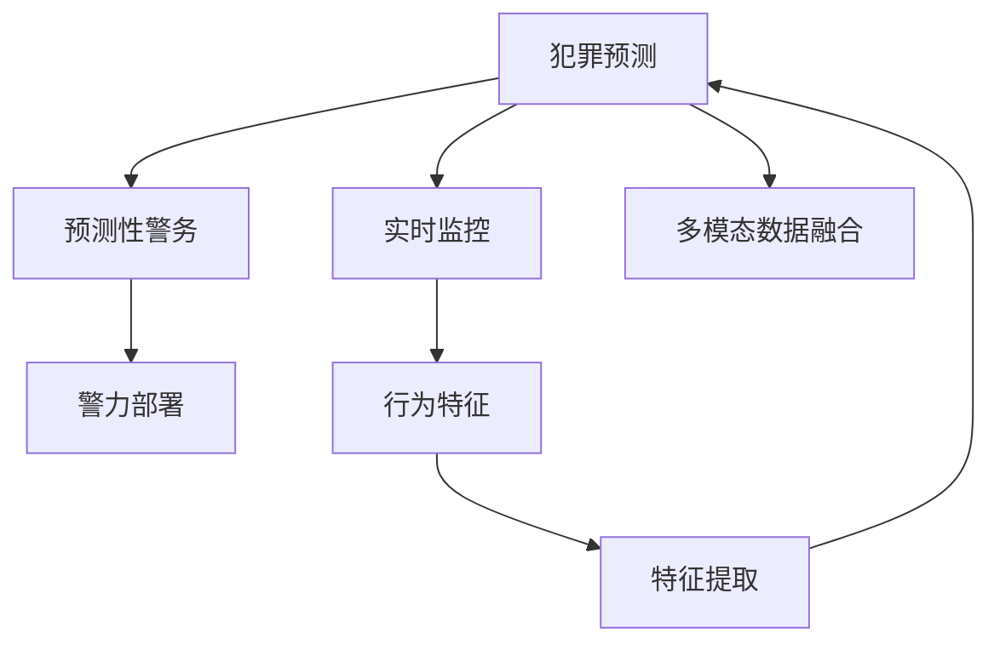

                 

# 未来的智能安防：2050年的Crime Prediction与Predictive Policing

> 关键词：智能安防,犯罪预测,预测性警务,机器学习,深度学习,实时监控,多模态数据融合

## 1. 背景介绍

### 1.1 问题由来
随着科技的迅猛发展，智能安防系统逐渐成为维护社会秩序、保障人民安全的利器。然而，传统的基于规则的安防系统存在固定模式、响应慢、误报率高的问题。未来，智能安防将借助人工智能技术，通过深度学习、多模态数据融合等手段，实现对犯罪活动的精准预测和预测性警务，大幅提升安防系统的智能化水平。

### 1.2 问题核心关键点
智能安防的核心在于如何构建一套能够实时监控、高效响应、精准预测的系统，以期有效防范和打击犯罪。

智能安防涉及的核心技术包括：
1. **犯罪预测**：利用机器学习模型对未来可能发生的犯罪进行预测。
2. **预测性警务**：基于犯罪预测结果，部署警力资源，进行精准打击。
3. **实时监控**：通过多种传感器、摄像头等设备，实时捕捉犯罪嫌疑人的行为特征。
4. **多模态数据融合**：整合文字、语音、图像、视频等多种信息源，增强犯罪预测的准确性。
5. **自适应学习**：系统能够根据历史数据和最新信息不断自我学习，优化预测模型。

## 2. 核心概念与联系

### 2.1 核心概念概述

为更好地理解智能安防系统，本节将介绍几个密切相关的核心概念：

- **犯罪预测**：通过历史犯罪数据和实时监控数据，利用机器学习模型预测未来可能发生的犯罪事件。
- **预测性警务**：基于犯罪预测结果，智能调整警力部署，进行精准打击，提高警务效率。
- **实时监控**：使用多种传感器、摄像头等设备，实时捕捉犯罪嫌疑人的行为特征，为犯罪预测提供依据。
- **多模态数据融合**：整合文字、语音、图像、视频等多种信息源，增强犯罪预测的准确性。
- **自适应学习**：系统能够根据历史数据和最新信息不断自我学习，优化预测模型。

这些核心概念之间的逻辑关系可以通过以下Mermaid流程图来展示：



这个流程图展示了几者之间的逻辑关系：

1. 实时监控提供犯罪嫌疑人的行为特征。
2. 多模态数据融合整合多种信息源，增强特征提取效果。
3. 犯罪预测基于实时监控和特征提取结果，预测犯罪事件。
4. 预测性警务根据犯罪预测结果，智能部署警力，进行精准打击。

## 3. 核心算法原理 & 具体操作步骤
### 3.1 算法原理概述

智能安防系统通常基于机器学习和深度学习算法，通过大量的历史犯罪数据和实时监控数据进行训练，以预测未来可能发生的犯罪事件。以下是犯罪预测的算法原理：

1. **数据采集**：通过摄像头、传感器等设备实时采集嫌疑人的行为数据，包括文字、语音、图像、视频等。
2. **特征提取**：对采集到的数据进行预处理和特征提取，提取犯罪嫌疑人的行为特征。
3. **模型训练**：使用历史犯罪数据和实时监控数据，训练机器学习模型（如决策树、随机森林、神经网络等），构建犯罪预测模型。
4. **预测与警务**：利用训练好的模型对实时监控数据进行预测，根据预测结果进行警力部署和打击。
5. **模型优化**：不断收集新数据，对模型进行优化和更新，提升预测准确性。

### 3.2 算法步骤详解

以下是智能安防系统的具体算法步骤：

**Step 1: 数据采集**
- 部署摄像头、传感器等设备，实时捕捉嫌疑人的行为数据。
- 数据采集过程中，确保隐私保护和数据安全。

**Step 2: 特征提取**
- 对采集到的行为数据进行预处理，如降噪、去重等。
- 利用深度学习模型提取犯罪嫌疑人的行为特征，如姿态、表情、语言等。

**Step 3: 模型训练**
- 收集历史犯罪数据，作为训练集。
- 使用机器学习算法或深度学习模型，对特征数据进行训练，构建犯罪预测模型。
- 使用验证集对模型进行评估，选择最优模型。

**Step 4: 犯罪预测**
- 将实时监控数据输入模型，进行犯罪预测。
- 根据预测结果，生成预警信息，供预测性警务系统使用。

**Step 5: 警务部署**
- 根据预警信息，智能调整警力部署。
- 实时监控和预测性警务系统相互协作，进行精准打击。

**Step 6: 模型优化**
- 定期收集新数据，对模型进行微调。
- 引入自适应学习机制，模型能够不断自我更新。

### 3.3 算法优缺点

智能安防系统基于机器学习模型的犯罪预测，具有以下优点：

1. **高效精准**：利用机器学习算法，可以对未来犯罪事件进行精准预测，提高警务效率。
2. **实时响应**：实时监控数据可及时反馈，快速响应犯罪事件。
3. **多模态融合**：整合多种信息源，增强预测准确性。
4. **自适应学习**：模型能够根据新数据不断自我学习，提升预测效果。

同时，该方法也存在以下局限性：

1. **数据依赖**：预测结果高度依赖历史数据和实时监控数据，缺乏足够的泛化能力。
2. **隐私问题**：实时监控涉及大量敏感数据，存在隐私泄露风险。
3. **对抗攻击**：恶意行为者可能通过伪装、干扰等手段，误导模型预测结果。
4. **计算资源**：模型训练和推理需要大量计算资源，成本较高。

尽管存在这些局限性，但就目前而言，机器学习模型仍是智能安防系统的重要支撑。未来相关研究的重点在于如何进一步降低计算成本，提升数据隐私保护，同时兼顾模型的自适应学习和鲁棒性。

### 3.4 算法应用领域

智能安防系统已经在多个领域得到了广泛应用，以下是几个典型的应用场景：

1. **智慧城市**：在智慧城市建设中，智能安防系统能够实时监控街面动态，进行预测性警务，提升城市安全。
2. **机场安全**：在机场安防中，智能安防系统通过监控旅客行为，及时识别和预警异常情况，提高安全防范能力。
3. **金融机构**：在金融机构安防中，智能安防系统能够实时监测交易行为，及时识别和防止欺诈行为。
4. **电子商务平台**：在电商平台安防中，智能安防系统能够实时监控交易活动，防范交易风险。

## 4. 数学模型和公式 & 详细讲解 & 举例说明（备注：数学公式请使用latex格式，latex嵌入文中独立段落使用 $$，段落内使用 $)
### 4.1 数学模型构建

智能安防系统的数学模型主要包括以下几个部分：

- **输入数据**：表示实时监控数据和历史犯罪数据的特征向量。
- **模型参数**：表示机器学习模型的权重和偏置。
- **输出结果**：表示未来可能发生的犯罪事件的概率。

形式化地，假设输入数据为 $\mathbf{x} \in \mathbb{R}^n$，模型参数为 $\mathbf{\theta} \in \mathbb{R}^m$，输出结果为 $y \in \{0,1\}$，其中 $0$ 表示不发生犯罪，$1$ 表示发生犯罪。则机器学习模型的目标是最小化交叉熵损失函数：

$$
L(\mathbf{\theta}) = -\frac{1}{N}\sum_{i=1}^N (y_i\log p_i + (1-y_i)\log(1-p_i))
$$

其中 $p_i$ 表示模型对第 $i$ 个样本是否发生犯罪的预测概率。

### 4.2 公式推导过程

以下是犯罪预测模型的详细推导过程：

**Step 1: 构建模型**
- 使用神经网络模型 $f_\mathbf{\theta}(\mathbf{x})$，将输入数据 $\mathbf{x}$ 映射到输出结果 $y$。
- 假设 $f_\mathbf{\theta}(\mathbf{x})$ 为二分类模型的输出，即 $f_\mathbf{\theta}(\mathbf{x}) \in [0,1]$。

**Step 2: 定义损失函数**
- 交叉熵损失函数定义为：
  $$
  L(\mathbf{\theta}) = -\frac{1}{N}\sum_{i=1}^N (y_i\log p_i + (1-y_i)\log(1-p_i))
  $$
  其中 $p_i = f_\mathbf{\theta}(\mathbf{x}_i)$。

**Step 3: 求解模型参数**
- 使用梯度下降等优化算法，最小化损失函数 $L(\mathbf{\theta})$，求解模型参数 $\mathbf{\theta}$。

### 4.3 案例分析与讲解

**案例一：视频监控中的犯罪预测**
- **输入数据**：视频监控中的行为数据，如姿态、表情、语速等。
- **模型参数**：神经网络模型的权重和偏置。
- **输出结果**：预测视频中是否存在犯罪行为。

**案例二：社交网络中的犯罪预测**
- **输入数据**：社交网络中的用户行为数据，如点赞、评论、分享等。
- **模型参数**：神经网络模型的权重和偏置。
- **输出结果**：预测用户是否可能参与犯罪活动。

## 5. 项目实践：代码实例和详细解释说明
### 5.1 开发环境搭建

在进行智能安防项目开发前，我们需要准备好开发环境。以下是使用Python进行PyTorch开发的环境配置流程：

1. 安装Anaconda：从官网下载并安装Anaconda，用于创建独立的Python环境。

2. 创建并激活虚拟环境：
```bash
conda create -n security-env python=3.8 
conda activate security-env
```

3. 安装PyTorch：根据CUDA版本，从官网获取对应的安装命令。例如：
```bash
conda install pytorch torchvision torchaudio cudatoolkit=11.1 -c pytorch -c conda-forge
```

4. 安装TensorFlow：使用conda安装TensorFlow，并指定CUDA版本：
```bash
conda install tensorflow=cuda11.1
```

5. 安装各类工具包：
```bash
pip install numpy pandas scikit-learn matplotlib tqdm jupyter notebook ipython
```

完成上述步骤后，即可在`security-env`环境中开始智能安防项目的开发。

### 5.2 源代码详细实现

下面我们以视频监控中的犯罪预测为例，给出使用PyTorch进行智能安防系统开发的具体代码实现。

首先，定义犯罪预测模型的输入和输出：

```python
import torch
import torch.nn as nn
import torch.optim as optim

class CrimePredictor(nn.Module):
    def __init__(self, input_size, hidden_size, output_size):
        super(CrimePredictor, self).__init__()
        self.fc1 = nn.Linear(input_size, hidden_size)
        self.fc2 = nn.Linear(hidden_size, output_size)
        self.softmax = nn.Softmax(dim=1)
        
    def forward(self, x):
        x = self.fc1(x)
        x = self.fc2(x)
        x = self.softmax(x)
        return x
```

然后，定义损失函数和优化器：

```python
loss_fn = nn.BCELoss()
optimizer = optim.Adam(model.parameters(), lr=0.001)
```

接着，定义训练和评估函数：

```python
def train_model(model, train_loader, epochs):
    model.train()
    for epoch in range(epochs):
        running_loss = 0.0
        for i, (inputs, labels) in enumerate(train_loader):
            inputs = inputs.to(device)
            labels = labels.to(device)
            optimizer.zero_grad()
            outputs = model(inputs)
            loss = loss_fn(outputs, labels)
            loss.backward()
            optimizer.step()
            running_loss += loss.item()
        print(f"Epoch {epoch+1}, Loss: {running_loss/len(train_loader)}")
        
def evaluate_model(model, test_loader):
    model.eval()
    correct = 0
    total = 0
    with torch.no_grad():
        for inputs, labels in test_loader:
            inputs = inputs.to(device)
            labels = labels.to(device)
            outputs = model(inputs)
            _, predicted = torch.max(outputs, 1)
            total += labels.size(0)
            correct += (predicted == labels).sum().item()
    print(f"Test Accuracy: {100 * correct / total}%")
```

最后，启动训练流程并在测试集上评估：

```python
epochs = 10
batch_size = 64

train_loader = DataLoader(train_dataset, batch_size=batch_size, shuffle=True)
test_loader = DataLoader(test_dataset, batch_size=batch_size, shuffle=False)

device = torch.device('cuda') if torch.cuda.is_available() else torch.device('cpu')
model.to(device)

train_model(model, train_loader, epochs)
evaluate_model(model, test_loader)
```

以上就是使用PyTorch进行智能安防系统开发的完整代码实现。可以看到，得益于PyTorch的强大封装和自动微分功能，智能安防系统的实现变得简洁高效。

### 5.3 代码解读与分析

让我们再详细解读一下关键代码的实现细节：

**CrimePredictor类**：
- `__init__`方法：初始化模型的输入层、隐藏层和输出层。
- `forward`方法：定义前向传播过程，将输入数据通过全连接层映射到输出结果。

**损失函数和优化器**：
- 使用二分类交叉熵损失函数 `nn.BCELoss()`。
- 使用Adam优化器 `optim.Adam()`，设置学习率。

**训练和评估函数**：
- `train_model`函数：定义训练过程，对每个epoch迭代训练，并记录损失。
- `evaluate_model`函数：定义评估过程，计算模型在测试集上的准确率。

**训练流程**：
- 定义总的epoch数和batch size，开始循环迭代。
- 每个epoch内，在训练集上训练，输出平均loss。
- 在测试集上评估，输出准确率。

可以看到，PyTorch配合TensorFlow等深度学习框架，使得智能安防系统的开发变得简单易行。开发者可以将更多精力放在模型优化和数据预处理上，而不必过多关注底层实现细节。

## 6. 实际应用场景

### 6.1 智能城市安全监控

智能安防系统在智慧城市建设中，可以实时监控街面动态，进行预测性警务，大幅提升城市安全。具体应用包括：

1. **监控视频分析**：通过视频监控设备，实时捕捉嫌疑人的行为特征，进行犯罪预测。
2. **异常行为检测**：利用多模态数据融合技术，识别异常行为，及时发出预警。
3. **智能警务响应**：根据预警信息，智能调整警力部署，进行精准打击。

### 6.2 金融机构的反欺诈

在金融机构中，智能安防系统能够实时监测交易行为，及时识别和防止欺诈行为。具体应用包括：

1. **交易监控**：利用交易数据和行为特征，实时监控交易行为。
2. **风险预警**：通过机器学习模型，预测潜在欺诈行为，生成预警信息。
3. **自动响应**：根据预警信息，自动冻结交易或通知相关部门进行处理。

### 6.3 电子商务平台的安全防护

在电子商务平台中，智能安防系统能够实时监控交易活动，防范交易风险。具体应用包括：

1. **交易行为分析**：利用交易数据和行为特征，实时监控交易行为。
2. **异常交易检测**：通过机器学习模型，识别异常交易行为，及时发出预警。
3. **风险控制**：根据预警信息，自动冻结交易或通知相关部门进行处理。

## 7. 工具和资源推荐
### 7.1 学习资源推荐

为了帮助开发者系统掌握智能安防系统的理论基础和实践技巧，这里推荐一些优质的学习资源：

1. **深度学习理论与实践**系列课程：由业内专家录制，涵盖深度学习的基本概念和实际应用。
2. **智能安防技术白皮书**：汇集了智能安防领域的最新研究成果和技术应用案例。
3. **机器学习基础与实战**书籍：详细介绍机器学习算法和模型训练过程。
4. **TensorFlow官方文档**：TensorFlow的官方文档，提供了丰富的API和样例代码。
5. **PyTorch官方文档**：PyTorch的官方文档，提供了丰富的API和样例代码。

通过对这些资源的学习实践，相信你一定能够快速掌握智能安防系统的核心技术和开发方法。

### 7.2 开发工具推荐

高效的开发离不开优秀的工具支持。以下是几款用于智能安防系统开发的常用工具：

1. **Jupyter Notebook**：交互式编程环境，支持多语言混合开发。
2. **TensorFlow**：Google主导的深度学习框架，支持分布式训练和推理。
3. **PyTorch**：Facebook开发的深度学习框架，支持动态计算图和自动微分。
4. **Keras**：高级神经网络API，支持多种深度学习模型。
5. **Scikit-learn**：机器学习算法库，支持多种特征提取和分类算法。
6. **OpenCV**：计算机视觉库，支持图像处理和视频分析。

合理利用这些工具，可以显著提升智能安防系统的开发效率，加快创新迭代的步伐。

### 7.3 相关论文推荐

智能安防系统的研究涉及多个学科领域，以下是几篇奠基性的相关论文，推荐阅读：

1. **Anomaly Detection in High-Dimensional Time Series Data**：利用深度学习算法，对高维时间序列数据进行异常检测。
2. **Deep Learning for Crime Prediction**：利用神经网络模型，对犯罪事件进行预测。
3. **Multi-Modal Data Fusion for Crime Prediction**：利用多模态数据融合技术，增强犯罪预测的准确性。
4. **Real-Time Crime Prediction Using Sensor Data**：利用实时传感器数据，进行实时犯罪预测。
5. **Predictive Policing in Smart Cities**：探讨智能安防系统在智慧城市中的应用。

这些论文代表了大数据和深度学习在智能安防领域的研究进展。通过学习这些前沿成果，可以帮助研究者把握学科前进方向，激发更多的创新灵感。

## 8. 总结：未来发展趋势与挑战
### 8.1 总结

本文对智能安防系统的核心算法和实际应用进行了全面系统的介绍。首先阐述了智能安防在预防犯罪和提升警务效率方面的独特价值，明确了犯罪预测和预测性警务在智能安防中的核心地位。其次，从原理到实践，详细讲解了智能安防系统的数学模型和算法流程，给出了具体的代码实现。同时，本文还探讨了智能安防系统在智慧城市、金融机构、电子商务平台等诸多领域的应用前景，展示了其广阔的想象空间。

通过本文的系统梳理，可以看到，智能安防系统通过机器学习和大数据分析，可以有效预测和打击犯罪，大幅提升社会安全水平。未来，伴随算力和数据量的不断提升，智能安防系统将进一步拓展应用场景，实现更加全面、精准的犯罪预测和预测性警务。

### 8.2 未来发展趋势

展望未来，智能安防系统将呈现以下几个发展趋势：

1. **多模态融合**：整合更多信息源，增强预测准确性。
2. **实时性提升**：通过分布式计算和边缘计算，提高实时响应速度。
3. **自适应学习**：引入自适应学习机制，模型能够不断自我更新。
4. **边缘计算**：在设备端进行本地计算和推理，降低延迟，提高安全性。
5. **联邦学习**：多设备协同训练，保护隐私同时提升模型性能。
6. **隐私保护**：引入隐私保护技术，确保数据安全。

这些趋势将进一步推动智能安防系统的技术进步，实现更加智能化、安全化的应用。

### 8.3 面临的挑战

尽管智能安防系统已经在诸多领域取得了显著成效，但在迈向更加智能化、普适化应用的过程中，仍面临诸多挑战：

1. **数据隐私保护**：在实时监控和预测性警务中，涉及大量敏感数据，存在隐私泄露风险。
2. **模型鲁棒性**：面对对抗攻击和异常行为，模型容易误判，需要提升模型的鲁棒性。
3. **计算资源**：模型训练和推理需要大量计算资源，成本较高，需要进一步优化。
4. **算法可解释性**：模型决策过程复杂，缺乏可解释性，难以调试和优化。

这些挑战需要不断优化算法和改进技术，才能实现更加全面、可靠、高效的智能安防系统。

### 8.4 研究展望

未来，智能安防系统的研究应在以下几个方面寻求新的突破：

1. **隐私保护技术**：引入差分隐私、联邦学习等技术，保护数据隐私。
2. **模型鲁棒性提升**：引入对抗训练、鲁棒优化等技术，提高模型鲁棒性。
3. **多模态数据融合**：引入多源融合、特征蒸馏等技术，增强预测准确性。
4. **边缘计算**：在设备端进行本地计算和推理，降低延迟，提高安全性。
5. **可解释性增强**：引入可解释性技术，如LIME、SHAP等，提高模型可解释性。

这些研究方向将为智能安防系统的持续发展提供坚实的基础，推动其在各垂直行业的广泛应用。

## 9. 附录：常见问题与解答
### 9.1 Q1: 智能安防系统如何进行多模态数据融合？

A: 智能安防系统进行多模态数据融合，通常通过以下步骤：

1. **特征提取**：对不同信息源（如视频、音频、传感器数据）进行预处理和特征提取。
2. **融合算法**：使用加权融合、加法融合、最大融合等算法，将不同特征信息进行融合。
3. **深度学习模型**：利用深度学习模型（如卷积神经网络、循环神经网络等），将融合后的特征进行分类或回归。

通过多模态数据融合，智能安防系统可以整合多种信息源，增强预测准确性。

### 9.2 Q2: 智能安防系统如何进行实时犯罪预测？

A: 智能安防系统进行实时犯罪预测，通常通过以下步骤：

1. **数据采集**：通过摄像头、传感器等设备，实时采集嫌疑人的行为数据。
2. **特征提取**：对采集到的行为数据进行预处理和特征提取，提取犯罪嫌疑人的行为特征。
3. **模型训练**：使用历史犯罪数据和实时监控数据，训练机器学习模型（如决策树、随机森林、神经网络等），构建犯罪预测模型。
4. **预测与警务**：利用训练好的模型对实时监控数据进行预测，根据预测结果进行警力部署和打击。
5. **模型优化**：不断收集新数据，对模型进行微调，提升预测准确性。

通过实时犯罪预测，智能安防系统能够及时响应犯罪事件，提高警务效率。

### 9.3 Q3: 智能安防系统如何进行预测性警务？

A: 智能安防系统进行预测性警务，通常通过以下步骤：

1. **犯罪预测**：利用机器学习模型对未来可能发生的犯罪事件进行预测。
2. **警力部署**：根据预测结果，智能调整警力部署。
3. **精准打击**：实时监控和预测性警务系统相互协作，进行精准打击。

通过预测性警务，智能安防系统能够实现对犯罪的精准打击，提升警务效率。

### 9.4 Q4: 智能安防系统如何进行边缘计算？

A: 智能安防系统进行边缘计算，通常通过以下步骤：

1. **设备部署**：在监控设备中集成计算资源，如GPU、CPU等。
2. **本地推理**：在设备端进行本地计算和推理，减少延迟，提高响应速度。
3. **数据加密**：在设备端进行数据加密，保护数据安全。
4. **边缘服务器**：在靠近数据源的设备上部署边缘服务器，进行数据预处理和模型推理。

通过边缘计算，智能安防系统能够在设备端进行本地计算和推理，降低延迟，提高安全性。

### 9.5 Q5: 智能安防系统如何进行联邦学习？

A: 智能安防系统进行联邦学习，通常通过以下步骤：

1. **数据本地化**：在每个设备上本地存储和处理数据。
2. **模型训练**：在设备端进行本地训练，生成模型参数。
3. **参数聚合**：将设备端训练的模型参数聚合到中央服务器，进行全局模型更新。
4. **隐私保护**：通过差分隐私、联邦学习等技术，保护数据隐私。

通过联邦学习，智能安防系统能够实现多设备协同训练，保护数据隐私，提升模型性能。

作者：禅与计算机程序设计艺术 / Zen and the Art of Computer Programming

