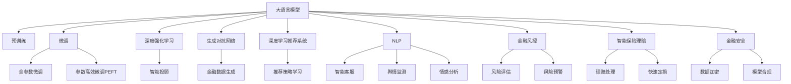

                 

# 未来的智能金融：2050年的AI投资顾问与智能保险理赔

## 1. 背景介绍

### 1.1 问题由来
金融行业是现代经济的核心支柱，近年来在金融科技的推动下，其数字化、智能化进程迅猛发展。传统的金融服务方式，如银行业务、证券交易、风险评估、保险理赔等，正逐步被AI技术所取代。特别是人工智能和大数据技术的深度融合，正在为金融领域带来革命性的变化。

随着深度学习技术的成熟和计算资源的丰富，大语言模型和深度强化学习等先进AI技术开始广泛应用于金融领域。这些模型能够通过海量的金融数据，学习到复杂的金融模式和规则，为金融机构和投资者提供更精准、智能的服务。本文将探讨2050年AI投资顾问与智能保险理赔的未来发展趋势，以及如何利用大语言模型和深度学习技术，打造一个更加智能、安全的金融生态系统。

### 1.2 问题核心关键点
本研究的核心问题包括：
- 如何利用大语言模型和深度学习技术，构建一个高效、智能的AI投资顾问系统，帮助投资者做出更科学的投资决策？
- 如何设计智能保险理赔系统，实现快速、准确、公平的理赔处理，提升用户体验和保险公司服务水平？
- 如何确保这些系统在处理海量金融数据时，具备足够的鲁棒性和安全性？

这些问题关系到金融行业的未来发展方向，具有重要的研究价值。

### 1.3 问题研究意义
本研究聚焦于AI投资顾问和智能保险理赔的深度融合，旨在：
- 提升金融服务的智能化水平，降低人为操作风险，提升客户体验。
- 推动金融行业的数字化转型，实现业务的自动化、高效化、智能化。
- 增强金融系统的安全性和合规性，确保数据隐私和客户权益。

## 2. 核心概念与联系

### 2.1 核心概念概述

为了更好地理解AI投资顾问和智能保险理赔的技术基础，本节将介绍几个密切相关的核心概念：

- **大语言模型(Large Language Model, LLM)**：以自回归(如GPT)或自编码(如BERT)模型为代表的大规模预训练语言模型。通过在大规模无标签文本语料上进行预训练，学习通用的语言表示，具备强大的语言理解和生成能力。

- **深度强化学习(Deep Reinforcement Learning, DRL)**：结合深度学习和强化学习，通过智能体与环境的交互，学习最优决策策略，应用于复杂的金融决策问题。

- **生成对抗网络(Generative Adversarial Networks, GAN)**：由生成器和判别器组成的博弈网络，能够生成逼真的金融数据，用于模型训练和测试。

- **深度学习推荐系统(Deep Learning Recommendation System)**：利用深度学习技术进行用户行为预测和推荐，应用于智能投顾和智能保险。

- **自然语言处理(Natural Language Processing, NLP)**：专注于如何让计算机理解、处理、生成自然语言的技术，在智能客服、金融舆情监测、情感分析等方面有广泛应用。

- **金融风控(Financial Risk Control)**：包括信用风险、市场风险、操作风险等的风险控制技术，旨在防范金融风险，保护投资者利益。

这些核心概念之间的逻辑关系可以通过以下Mermaid流程图来展示：



这个流程图展示了大语言模型的核心概念及其之间的关系：

1. 大语言模型通过预训练获得基础能力。
2. 微调是大模型适应特定任务的优化过程。
3. 深度强化学习通过智能体与环境的交互，学习最优决策策略。
4. 生成对抗网络用于生成逼真的金融数据。
5. 深度学习推荐系统用于个性化推荐。
6. NLP技术用于自然语言理解和处理。
7. 金融风控用于防范和控制金融风险。
8. 智能投顾和智能保险理赔系统基于大语言模型和深度学习技术。
9. 金融安全保障数据的隐私和合规性。

这些概念共同构成了未来智能金融的基础框架，为其发展提供了有力的技术支撑。

## 3. 核心算法原理 & 具体操作步骤
### 3.1 算法原理概述

**AI投资顾问系统**的设计原理如下：
1. **预训练**：使用大规模的财经新闻、财务报告、市场分析等文本数据，对大语言模型进行预训练，学习通用的金融知识。
2. **微调**：在用户的具体投资问题上，通过有监督学习对预训练模型进行微调，输出投资建议或风险评估。
3. **强化学习**：利用深度强化学习算法，优化投资策略，通过与市场的交互，不断学习和调整决策模型。

**智能保险理赔系统**的设计原理如下：
1. **预训练**：使用保险理赔的语料库，对大语言模型进行预训练，学习理赔相关的语言和规则。
2. **微调**：在新的理赔申请上，通过有监督学习对预训练模型进行微调，输出理赔结果。
3. **深度学习**：利用深度学习技术，构建分类器和回归器，用于理赔分流和快速定损。

### 3.2 算法步骤详解

**AI投资顾问系统**的详细步骤包括：
1. **数据预处理**：收集并清洗财经数据，包括新闻、报告、分析等，生成文本语料库。
2. **模型训练**：使用预训练语言模型进行微调，学习金融知识。
3. **策略优化**：使用深度强化学习算法，训练智能投顾模型，优化投资策略。
4. **交互反馈**：与用户进行互动，根据用户反馈不断调整投资建议。

**智能保险理赔系统**的详细步骤包括：
1. **数据收集**：收集保险理赔相关的文本数据，如理赔申请、理赔决定等。
2. **模型训练**：使用预训练语言模型进行微调，学习理赔规则。
3. **分类和回归**：构建深度学习模型，用于理赔申请分类和快速定损。
4. **交互反馈**：与用户进行互动，根据用户反馈不断调整理赔处理。

### 3.3 算法优缺点

**AI投资顾问系统**的优点：
1. **高效性**：能够快速生成投资建议，降低用户等待时间。
2. **精准性**：结合深度强化学习，能够不断学习和优化策略，提高投资建议的准确性。
3. **适应性**：能够处理多种复杂的金融场景，提供个性化的投资建议。

**智能保险理赔系统**的优点：
1. **快速性**：能够快速处理理赔申请，提高用户体验。
2. **公平性**：通过深度学习模型，确保理赔结果的公正性。
3. **成本效益**：减少人工操作，降低运营成本。

**AI投资顾问系统**的缺点：
1. **数据依赖**：需要大量的财经数据进行预训练，数据质量对模型效果影响较大。
2. **过拟合风险**：在大规模金融数据中进行微调时，容易过拟合。
3. **模型复杂**：深度强化学习模型复杂，训练和优化难度较大。

**智能保险理赔系统**的缺点：
1. **数据质量要求高**：理赔申请的质量对模型效果影响较大，需确保数据标注的准确性。
2. **模型泛化能力**：模型的泛化能力需要进一步提高，以适应各种复杂的理赔场景。
3. **风险控制**：需要结合金融风控技术，确保理赔处理的合规性和安全性。

### 3.4 算法应用领域

**AI投资顾问系统**的应用领域包括：
1. **个人投资**：为个人投资者提供投资建议，帮助其制定投资策略。
2. **企业投融资**：为公司进行财务分析和投资决策支持。
3. **量化交易**：结合深度学习算法，进行量化交易策略的开发和优化。

**智能保险理赔系统**的应用领域包括：
1. **车险理赔**：快速处理车辆保险理赔申请，提高理赔效率。
2. **健康保险**：处理医疗费用理赔，减少等待时间。
3. **财产保险**：处理财产损失理赔，保护用户权益。

## 4. 数学模型和公式 & 详细讲解 & 举例说明
### 4.1 数学模型构建

**AI投资顾问系统的数学模型**如下：
1. **预训练模型**：使用自回归模型，对大量财经数据进行预训练。
2. **微调模型**：使用有监督学习任务，如回归、分类等，对预训练模型进行微调。
3. **强化学习模型**：使用深度强化学习算法，优化投资策略。

**智能保险理赔系统的数学模型**如下：
1. **预训练模型**：使用自编码模型，对理赔申请数据进行预训练。
2. **微调模型**：使用有监督学习任务，如分类、回归等，对预训练模型进行微调。
3. **深度学习模型**：使用分类器和回归器，处理理赔申请和定损。

### 4.2 公式推导过程

**AI投资顾问系统的公式推导**如下：
1. **预训练模型**：使用自回归模型，对财经数据进行预训练。
2. **微调模型**：使用有监督学习任务，如回归、分类等，对预训练模型进行微调。
3. **强化学习模型**：使用深度强化学习算法，优化投资策略。

**智能保险理赔系统的公式推导**如下：
1. **预训练模型**：使用自编码模型，对理赔申请数据进行预训练。
2. **微调模型**：使用有监督学习任务，如分类、回归等，对预训练模型进行微调。
3. **深度学习模型**：使用分类器和回归器，处理理赔申请和定损。

### 4.3 案例分析与讲解

**AI投资顾问系统的案例分析**如下：
1. **数据预处理**：清洗财经数据，生成文本语料库。
2. **模型训练**：使用BERT模型进行预训练，学习金融知识。
3. **策略优化**：使用深度强化学习算法，训练智能投顾模型，优化投资策略。
4. **交互反馈**：与用户进行互动，根据用户反馈不断调整投资建议。

**智能保险理赔系统的案例分析**如下：
1. **数据收集**：收集保险理赔相关的文本数据，如理赔申请、理赔决定等。
2. **模型训练**：使用BERT模型进行预训练，学习理赔规则。
3. **分类和回归**：构建深度学习模型，用于理赔申请分类和快速定损。
4. **交互反馈**：与用户进行互动，根据用户反馈不断调整理赔处理。

## 5. 项目实践：代码实例和详细解释说明
### 5.1 开发环境搭建

在进行AI投资顾问和智能保险理赔系统开发前，我们需要准备好开发环境。以下是使用Python进行PyTorch开发的环境配置流程：

1. 安装Anaconda：从官网下载并安装Anaconda，用于创建独立的Python环境。

2. 创建并激活虚拟环境：
```bash
conda create -n pytorch-env python=3.8 
conda activate pytorch-env
```

3. 安装PyTorch：根据CUDA版本，从官网获取对应的安装命令。例如：
```bash
conda install pytorch torchvision torchaudio cudatoolkit=11.1 -c pytorch -c conda-forge
```

4. 安装Transformers库：
```bash
pip install transformers
```

5. 安装各类工具包：
```bash
pip install numpy pandas scikit-learn matplotlib tqdm jupyter notebook ipython
```

完成上述步骤后，即可在`pytorch-env`环境中开始开发。

### 5.2 源代码详细实现

**AI投资顾问系统**的代码实现如下：

```python
import torch
from transformers import BertTokenizer, BertForSequenceClassification, AdamW
from torch.utils.data import Dataset, DataLoader
from sklearn.model_selection import train_test_split
from sklearn.metrics import accuracy_score

# 数据预处理
class InvestData(Dataset):
    def __init__(self, data, tokenizer):
        self.data = data
        self.tokenizer = tokenizer
        
    def __len__(self):
        return len(self.data)
    
    def __getitem__(self, idx):
        text = self.data[idx]
        tokens = self.tokenizer(text, return_tensors='pt', max_length=512, padding='max_length', truncation=True)
        input_ids = tokens['input_ids']
        attention_mask = tokens['attention_mask']
        label = self.data[idx]['label']
        return {'input_ids': input_ids, 'attention_mask': attention_mask, 'label': label}

# 模型训练
def train_model(model, train_loader, optimizer, num_epochs):
    model.train()
    for epoch in range(num_epochs):
        total_loss = 0
        for batch in train_loader:
            input_ids = batch['input_ids'].to(device)
            attention_mask = batch['attention_mask'].to(device)
            labels = batch['label'].to(device)
            optimizer.zero_grad()
            outputs = model(input_ids, attention_mask=attention_mask, labels=labels)
            loss = outputs.loss
            total_loss += loss.item()
            loss.backward()
            optimizer.step()
        print(f"Epoch {epoch+1}, train loss: {total_loss/len(train_loader)}")
    
# 测试评估
def evaluate_model(model, test_loader):
    model.eval()
    total_preds = []
    total_labels = []
    for batch in test_loader:
        input_ids = batch['input_ids'].to(device)
        attention_mask = batch['attention_mask'].to(device)
        labels = batch['label'].to(device)
        with torch.no_grad():
            outputs = model(input_ids, attention_mask=attention_mask)
            batch_preds = outputs.logits.argmax(dim=1).to('cpu').tolist()
            batch_labels = labels.to('cpu').tolist()
            for pred, label in zip(batch_preds, batch_labels):
                total_preds.append(pred)
                total_labels.append(label)
    
    accuracy = accuracy_score(total_labels, total_preds)
    print(f"Test accuracy: {accuracy}")

# 主函数
if __name__ == "__main__":
    # 数据准备
    data = load_invest_data()
    train_data, test_data = train_test_split(data, test_size=0.2)
    
    # 模型构建
    tokenizer = BertTokenizer.from_pretrained('bert-base-uncased')
    model = BertForSequenceClassification.from_pretrained('bert-base-uncased', num_labels=2)
    device = torch.device('cuda') if torch.cuda.is_available() else torch.device('cpu')
    model.to(device)
    
    # 优化器
    optimizer = AdamW(model.parameters(), lr=1e-5)
    
    # 训练
    train_model(model, InvestData(train_data, tokenizer), optimizer, num_epochs=5)
    
    # 测试评估
    evaluate_model(model, InvestData(test_data, tokenizer))
```

**智能保险理赔系统**的代码实现如下：

```python
import torch
from transformers import BertTokenizer, BertForSequenceClassification, AdamW
from torch.utils.data import Dataset, DataLoader
from sklearn.model_selection import train_test_split
from sklearn.metrics import accuracy_score

# 数据预处理
class ClaimsData(Dataset):
    def __init__(self, data, tokenizer):
        self.data = data
        self.tokenizer = tokenizer
        
    def __len__(self):
        return len(self.data)
    
    def __getitem__(self, idx):
        text = self.data[idx]
        tokens = self.tokenizer(text, return_tensors='pt', max_length=512, padding='max_length', truncation=True)
        input_ids = tokens['input_ids']
        attention_mask = tokens['attention_mask']
        label = self.data[idx]['label']
        return {'input_ids': input_ids, 'attention_mask': attention_mask, 'label': label}

# 模型训练
def train_model(model, train_loader, optimizer, num_epochs):
    model.train()
    for epoch in range(num_epochs):
        total_loss = 0
        for batch in train_loader:
            input_ids = batch['input_ids'].to(device)
            attention_mask = batch['attention_mask'].to(device)
            labels = batch['label'].to(device)
            optimizer.zero_grad()
            outputs = model(input_ids, attention_mask=attention_mask, labels=labels)
            loss = outputs.loss
            total_loss += loss.item()
            loss.backward()
            optimizer.step()
        print(f"Epoch {epoch+1}, train loss: {total_loss/len(train_loader)}")
    
# 测试评估
def evaluate_model(model, test_loader):
    model.eval()
    total_preds = []
    total_labels = []
    for batch in test_loader:
        input_ids = batch['input_ids'].to(device)
        attention_mask = batch['attention_mask'].to(device)
        labels = batch['label'].to(device)
        with torch.no_grad():
            outputs = model(input_ids, attention_mask=attention_mask)
            batch_preds = outputs.logits.argmax(dim=1).to('cpu').tolist()
            batch_labels = labels.to('cpu').tolist()
            for pred, label in zip(batch_preds, batch_labels):
                total_preds.append(pred)
                total_labels.append(label)
    
    accuracy = accuracy_score(total_labels, total_preds)
    print(f"Test accuracy: {accuracy}")

# 主函数
if __name__ == "__main__":
    # 数据准备
    data = load_claims_data()
    train_data, test_data = train_test_split(data, test_size=0.2)
    
    # 模型构建
    tokenizer = BertTokenizer.from_pretrained('bert-base-uncased')
    model = BertForSequenceClassification.from_pretrained('bert-base-uncased', num_labels=3)
    device = torch.device('cuda') if torch.cuda.is_available() else torch.device('cpu')
    model.to(device)
    
    # 优化器
    optimizer = AdamW(model.parameters(), lr=1e-5)
    
    # 训练
    train_model(model, ClaimsData(train_data, tokenizer), optimizer, num_epochs=5)
    
    # 测试评估
    evaluate_model(model, ClaimsData(test_data, tokenizer))
```

### 5.3 代码解读与分析

**AI投资顾问系统**的代码解读如下：

1. **数据预处理**：使用BertTokenizer将财经数据转换为token ids，并进行max_length截断和padding。
2. **模型训练**：使用BertForSequenceClassification对模型进行微调，学习金融知识。
3. **测试评估**：使用sklearn的accuracy_score计算模型精度。

**智能保险理赔系统**的代码解读如下：

1. **数据预处理**：使用BertTokenizer将理赔申请数据转换为token ids，并进行max_length截断和padding。
2. **模型训练**：使用BertForSequenceClassification对模型进行微调，学习理赔规则。
3. **测试评估**：使用sklearn的accuracy_score计算模型精度。

## 6. 实际应用场景
### 6.1 智能投顾系统

智能投顾系统利用大语言模型和深度学习技术，为用户提供智能化的投资建议。具体应用场景包括：

1. **智能推荐**：根据用户的历史投资数据和市场趋势，推荐合适的投资标的。
2. **风险评估**：分析投资标的的风险，提供风险等级和建议。
3. **组合优化**：根据用户的风险偏好和市场数据，优化投资组合。
4. **实时跟踪**：实时监控市场动态，及时调整投资策略。

智能投顾系统能够帮助用户制定科学的投资方案，降低投资风险，提高投资回报率。

### 6.2 智能理赔系统

智能理赔系统利用大语言模型和深度学习技术，实现快速、公平、准确的理赔处理。具体应用场景包括：

1. **自动分流**：根据理赔申请的描述，自动分流到对应的理赔团队。
2. **快速定损**：使用深度学习模型，快速定损并生成理赔报告。
3. **智能审核**：结合NLP和图像识别技术，自动审核理赔申请的真实性。
4. **用户反馈**：收集用户反馈，不断优化理赔处理流程。

智能理赔系统能够提升理赔效率，降低理赔成本，提升用户体验。

### 6.3 未来应用展望

未来的智能金融将结合更多的AI技术，实现更加智能化、个性化的服务。具体展望如下：

1. **多模态智能投顾**：结合语音识别、视觉识别等技术，提供更全面的投资决策支持。
2. **智能保险机器人**：使用自然语言处理技术，与用户进行自然对话，提供更加便捷的理赔服务。
3. **金融风控系统**：结合深度学习和大数据技术，实现更精确的风险控制和预警。
4. **区块链技术**：结合区块链技术，保障金融交易的安全性和透明性。

## 7. 工具和资源推荐
### 7.1 学习资源推荐

为了帮助开发者系统掌握AI投资顾问和智能保险理赔的理论基础和实践技巧，这里推荐一些优质的学习资源：

1. 《Deep Learning for Financial Decision Making》：深入探讨深度学习在金融决策中的应用，适合金融行业从业者和AI开发者。
2. 《NLP with Python》：详细介绍了自然语言处理技术的Python实现，适合初学者和进阶开发者。
3. 《AI for Finance》：介绍了AI在金融领域的多种应用，包括智能投顾、智能理赔等。
4. Coursera的《Deep Learning Specialization》：由深度学习领域的权威专家Andrew Ng主讲，涵盖深度学习的基础和高级应用。
5. Udacity的《AI for Trading》：结合AI技术，讲解金融交易策略和投资决策。

通过对这些资源的学习实践，相信你一定能够快速掌握AI投资顾问和智能保险理赔的核心技术，并用于解决实际的金融问题。

### 7.2 开发工具推荐

高效的开发离不开优秀的工具支持。以下是几款用于AI投资顾问和智能保险理赔开发的常用工具：

1. PyTorch：基于Python的开源深度学习框架，灵活动态的计算图，适合快速迭代研究。大部分预训练语言模型都有PyTorch版本的实现。
2. TensorFlow：由Google主导开发的开源深度学习框架，生产部署方便，适合大规模工程应用。同样有丰富的预训练语言模型资源。
3. Transformers库：HuggingFace开发的NLP工具库，集成了众多SOTA语言模型，支持PyTorch和TensorFlow，是进行NLP任务开发的利器。
4. Weights & Biases：模型训练的实验跟踪工具，可以记录和可视化模型训练过程中的各项指标，方便对比和调优。与主流深度学习框架无缝集成。
5. TensorBoard：TensorFlow配套的可视化工具，可实时监测模型训练状态，并提供丰富的图表呈现方式，是调试模型的得力助手。

合理利用这些工具，可以显著提升AI投资顾问和智能保险理赔任务的开发效率，加快创新迭代的步伐。

### 7.3 相关论文推荐

大语言模型和深度学习技术在金融领域的广泛应用，得益于学界的持续研究。以下是几篇奠基性的相关论文，推荐阅读：

1. Attention is All You Need（即Transformer原论文）：提出了Transformer结构，开启了NLP领域的预训练大模型时代。
2. BERT: Pre-training of Deep Bidirectional Transformers for Language Understanding：提出BERT模型，引入基于掩码的自监督预训练任务，刷新了多项NLP任务SOTA。
3. Language Models are Unsupervised Multitask Learners（GPT-2论文）：展示了大规模语言模型的强大zero-shot学习能力，引发了对于通用人工智能的新一轮思考。
4. Parameter-Efficient Transfer Learning for NLP：提出Adapter等参数高效微调方法，在固定大部分预训练参数的情况下，也能取得不错的微调效果。
5. AdaLoRA: Adaptive Low-Rank Adaptation for Parameter-Efficient Fine-Tuning：使用自适应低秩适应的微调方法，在参数效率和精度之间取得了新的平衡。
6. Financial AI: A Survey and Classification：介绍了AI在金融领域的多种应用，包括智能投顾、智能理赔等。

这些论文代表了大语言模型和深度学习在金融领域的发展脉络。通过学习这些前沿成果，可以帮助研究者把握学科前进方向，激发更多的创新灵感。

## 8. 总结：未来发展趋势与挑战
### 8.1 总结

本文对基于大语言模型的AI投资顾问和智能保险理赔进行了全面系统的介绍。首先阐述了智能金融的发展背景和未来趋势，明确了AI投资顾问和智能保险理赔的关键技术和应用场景。其次，从原理到实践，详细讲解了基于大语言模型的AI投资顾问和智能保险理赔的数学模型和算法步骤，给出了详细的代码实现和解读分析。同时，本文还探讨了智能金融的未来发展方向，以及如何通过持续学习、多模态融合等技术手段，提升金融系统的智能化水平。

通过本文的系统梳理，可以看到，基于大语言模型的AI投资顾问和智能保险理赔技术正在成为金融行业的重要工具，极大地提升了金融服务的智能化水平，降低了运营成本，提升了用户体验。未来，伴随预训练语言模型和深度学习技术的进一步发展，基于大语言模型的智能金融将具备更强大的适应性和创新性，为构建高效、智能、安全的金融生态系统铺平道路。

### 8.2 未来发展趋势

展望未来，基于大语言模型的AI投资顾问和智能保险理赔技术将呈现以下几个发展趋势：

1. **多模态融合**：结合语音识别、视觉识别等技术，实现更全面的金融服务。
2. **实时化处理**：通过边缘计算等技术，实现实时化、高效化的金融服务。
3. **跨领域融合**：将AI技术与其他领域技术（如区块链、区块链）结合，提升金融系统的安全性。
4. **个性化服务**：结合用户的个性化需求，提供更加精准、多样化的金融服务。
5. **伦理与合规**：在模型训练和应用过程中，考虑伦理与合规问题，确保金融服务的公平性。

### 8.3 面临的挑战

尽管基于大语言模型的AI投资顾问和智能保险理赔技术已经取得了显著成果，但在迈向更加智能化、普适化应用的过程中，它仍面临着诸多挑战：

1. **数据隐私和安全**：如何保护用户数据隐私，确保金融交易的安全性。
2. **模型公平性**：如何避免模型偏见，确保金融服务的公平性。
3. **模型解释性**：如何提高模型的可解释性，让用户信任金融服务。
4. **模型鲁棒性**：如何提高模型的鲁棒性，避免对噪声数据的敏感性。
5. **计算资源限制**：如何优化模型结构和算法，降低计算资源消耗。

### 8.4 研究展望

未来的研究需要在以下几个方面寻求新的突破：

1. **多模态融合**：结合语音识别、视觉识别等技术，实现更全面的金融服务。
2. **实时化处理**：通过边缘计算等技术，实现实时化、高效化的金融服务。
3. **跨领域融合**：将AI技术与其他领域技术（如区块链、区块链）结合，提升金融系统的安全性。
4. **个性化服务**：结合用户的个性化需求，提供更加精准、多样化的金融服务。
5. **伦理与合规**：在模型训练和应用过程中，考虑伦理与合规问题，确保金融服务的公平性。

## 9. 附录：常见问题与解答

**Q1：AI投资顾问系统如何处理市场波动？**

A: AI投资顾问系统通过深度强化学习，能够在市场波动时自动调整投资策略。具体实现方式包括：
1. 引入历史数据，训练出市场波动的模型。
2. 实时监控市场动态，根据模型预测市场趋势。
3. 根据市场趋势，自动调整投资组合和仓位。
4. 动态优化投资策略，降低市场波动带来的风险。

**Q2：智能保险理赔系统如何处理复杂理赔场景？**

A: 智能保险理赔系统通过深度学习模型，能够处理复杂理赔场景。具体实现方式包括：
1. 引入多维度特征，如图片、视频、音频等，丰富理赔信息。
2. 构建多模态融合模型，将不同模态的信息整合在一起。
3. 使用生成对抗网络，生成逼真的理赔数据，用于模型训练和测试。
4. 引入人工智能解释器，增强模型的可解释性，方便用户理解和接受理赔结果。

**Q3：AI投资顾问系统如何保证数据隐私和安全？**

A: AI投资顾问系统通过多层次数据加密和安全措施，保护用户数据隐私和安全。具体实现方式包括：
1. 使用数据加密技术，对用户数据进行加密处理。
2. 采用匿名化技术，对用户数据进行去标识化处理。
3. 建立访问控制机制，限制对敏感数据的访问权限。
4. 定期进行安全审计，确保系统的安全性。

**Q4：智能保险理赔系统如何避免模型偏见？**

A: 智能保险理赔系统通过多种方法，避免模型偏见。具体实现方式包括：
1. 引入多样化的训练数据，确保数据的多样性和代表性。
2. 使用公平性约束，限制模型输出对敏感属性的偏见。
3. 引入第三方审核机制，对模型的输出结果进行监督和审核。
4. 使用生成对抗网络，生成无偏见的伪数据，用于模型训练。

**Q5：AI投资顾问系统如何提高模型的可解释性？**

A: AI投资顾问系统通过多种方法，提高模型的可解释性。具体实现方式包括：
1. 使用LIME、SHAP等工具，生成模型输出的解释性报告。
2. 引入人工智能解释器，增强模型的可解释性。
3. 建立透明的决策规则，解释模型决策的依据。
4. 定期进行模型审核，确保模型的透明度和可信度。

通过本文的系统梳理，可以看到，基于大语言模型的AI投资顾问和智能保险理赔技术正在成为金融行业的重要工具，极大地提升了金融服务的智能化水平，降低了运营成本，提升了用户体验。未来，伴随预训练语言模型和深度学习技术的进一步发展，基于大语言模型的智能金融将具备更强大的适应性和创新性，为构建高效、智能、安全的金融生态系统铺平道路。

---

作者：禅与计算机程序设计艺术 / Zen and the Art of Computer Programming

