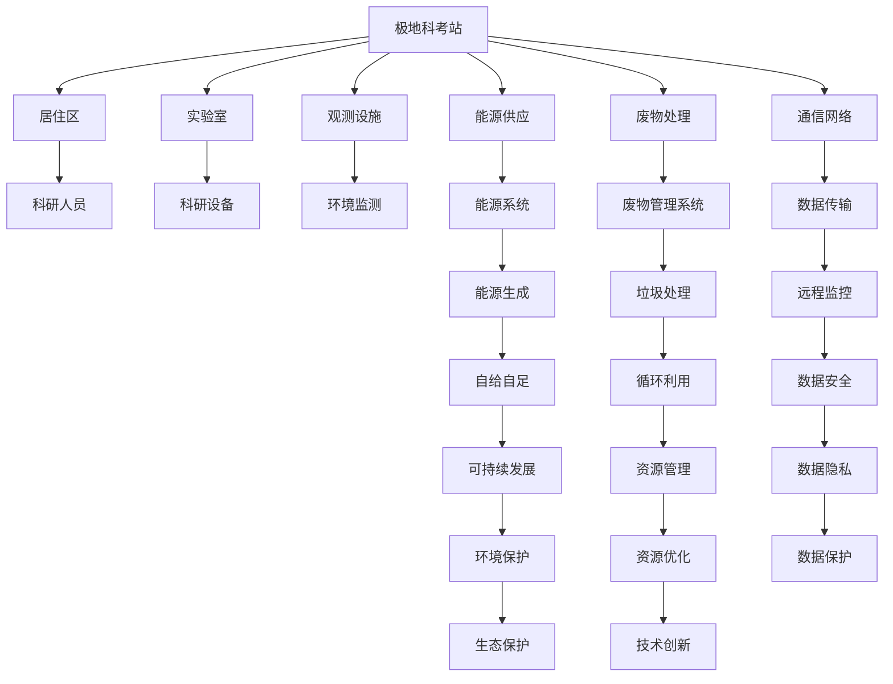
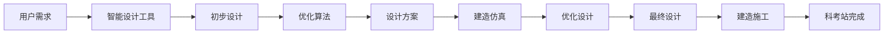

                 

# 未来的极地探索：2050年的极地科考站与冰下城市

## 1. 背景介绍

### 1.1 问题由来

极地科考站与冰下城市建设，是未来几十年人类在地球极端环境探索的重要方向之一。随着全球气候变化加速，极地冰盖持续融化，极地地区的海平面上升、生态系统变化等科学问题愈发迫切。与此同时，冰下城市作为一种新兴概念，因其资源潜力、气候调节作用和科技价值，吸引了众多科学界、工程界、企业界的关注。

文章旨在探讨2050年极地科考站与冰下城市建设的核心技术和设计思路，结合人工智能、智能制造、绿色能源等前沿技术，勾勒出未来极地探索的蓝图。

### 1.2 问题核心关键点

1. **极地科考站建设**：如何设计高效、安全的极地科考站，确保研究人员在极端环境下的生存和工作安全，同时最大化科研效率。

2. **冰下城市建设**：如何构建坚固、自给自足的冰下城市，利用冰盖资源，实现高效能源供应，构建自循环生态系统，保障居民生活品质。

3. **智能技术应用**：如何将人工智能、物联网、自动控制等智能技术应用于极地探索，提升数据处理、环境监测、资源管理等方面的智能化水平。

4. **环境适应性**：如何在低温、高风速、极夜等极端环境下，确保科考站和冰下城市的稳定运行。

5. **可持续发展**：如何实现极地资源的可持续利用，同时保护极地生态，防止对自然环境造成不可逆的破坏。

### 1.3 问题研究意义

极地科考站与冰下城市建设，不仅对科学研究和环境保护具有重要意义，还对人类探索宇宙、拓展生存空间、推动新技术发展等方面具有深远影响。本文旨在通过探讨这些核心问题，为未来极地探索提供科学依据和技术支撑。

## 2. 核心概念与联系

### 2.1 核心概念概述

- **极地科考站**：为研究人员提供生存和科研基础设施，包括居住区、实验室、观测设施等。

- **冰下城市**：完全或部分建在冰层下，利用冰盖资源，实现高效能源供应、水资源管理、垃圾处理等，构建自循环生态系统。

- **人工智能**：通过深度学习、自然语言处理、计算机视觉等技术，提升数据处理、环境监测、资源管理等方面的智能化水平。

- **智能制造**：利用自动化、数字化、智能化技术，提升极地建设物资的制造、运输、安装等环节的效率和精度。

- **绿色能源**：采用太阳能、风能、地热能等可再生能源，实现能源自给自足，减少碳排放。

### 2.2 核心概念原理和架构的 Mermaid 流程图



该图展示了极地科考站的核心组件及其相互关系，包括居住区、实验室、观测设施等，以及能源供应、废物处理、通信网络等支持系统。这些组件相互协作，确保科研人员在极端环境下的生存和工作安全，同时提升科研效率。

## 3. 核心算法原理 & 具体操作步骤

### 3.1 算法原理概述

极地科考站与冰下城市建设的核心算法原理，包括建筑设计、环境监测、能源管理、废物处理等多个方面。本文将重点介绍基于人工智能的智能化设计和管理方法。

### 3.2 算法步骤详解

1. **建筑设计**：采用智能设计工具，如Autodesk Revit、Bentley Architecture等，结合人工智能优化算法，设计高效、安全的极地科考站和冰下城市。

2. **环境监测**：利用物联网传感器、卫星遥感等技术，实时监测极地环境参数，如温度、湿度、风速、辐射等。采用深度学习模型，对监测数据进行分析和预测。

3. **能源管理**：通过数据分析和模型优化，实现能源的智能调度和管理。利用太阳能、风能、地热能等可再生能源，构建自给自足的能源系统。

4. **废物处理**：采用智能化垃圾分类和处理系统，实现废物的自动收集、分类、处理和资源化利用。结合深度学习模型，优化废物处理流程，减少环境污染。

5. **通信网络**：利用5G、低轨卫星等通信技术，构建高效、稳定的极地通信网络，保障数据传输的实时性和可靠性。

6. **智能制造**：采用数字化、自动化、智能化技术，提升极地建设物资的制造、运输、安装等环节的效率和精度。利用机器人、3D打印等技术，实现快速定制和建造。

### 3.3 算法优缺点

**优点**：
- **高效性**：通过智能化设计和管理，提高资源利用效率，减少浪费。
- **安全性**：利用人工智能技术，提高环境监测、能源管理等方面的安全性。
- **自给自足**：实现能源自给自足、废物资源化利用，减少对外部资源依赖。
- **可持续发展**：通过智能化管理，实现极地资源的可持续利用。

**缺点**：
- **高成本**：智能技术和设备的高成本可能增加建设和管理难度。
- **技术依赖**：对人工智能、物联网等技术的依赖性较强，技术故障可能影响正常运行。
- **环境适应性**：极端环境对设备和系统的稳定性要求高，技术挑战较大。

### 3.4 算法应用领域

极地科考站与冰下城市建设，涉及多个领域，包括建筑、环境、能源、通信、制造等。这些领域的技术融合和应用，将推动人类对极端环境的探索和理解。

## 4. 数学模型和公式 & 详细讲解 & 举例说明

### 4.1 数学模型构建

在极地科考站与冰下城市的建设和管理中，可以构建多个数学模型，如环境监测模型、能源管理模型、废物处理模型等。

以环境监测模型为例，设环境参数向量为 $X = (T, H, W, S)$，其中 $T$ 为温度，$H$ 为湿度，$W$ 为风速，$S$ 为辐射。监测数据集为 $D = \{(X_i, Y_i)\}_{i=1}^N$，其中 $X_i$ 为第 $i$ 次监测数据，$Y_i$ 为真实环境参数。模型构建目标为最小化监测误差：

$$
\min_{\theta} \sum_{i=1}^N ||X_i - \hat{X}_i||^2
$$

其中 $\hat{X}_i$ 为模型预测值，$\theta$ 为模型参数。

### 4.2 公式推导过程

采用深度学习模型对监测数据进行建模，常用的模型为多层感知器（MLP）和卷积神经网络（CNN）。以 MLP 为例，模型结构如下：

$$
\hat{X}_i = \sigma(W_L \sigma(W_{L-1} \cdots \sigma(W_1 X_i) \cdots) + b_L)
$$

其中 $W_k$ 为第 $k$ 层的权重矩阵，$b_k$ 为第 $k$ 层的偏置向量，$\sigma$ 为激活函数。

通过反向传播算法，计算梯度并更新参数 $\theta$：

$$
\frac{\partial \mathcal{L}}{\partial \theta} = \frac{\partial \mathcal{L}}{\partial \hat{X}_i} \frac{\partial \hat{X}_i}{\partial \theta}
$$

其中 $\mathcal{L}$ 为损失函数。

### 4.3 案例分析与讲解

以极地气温预测为例，采用基于LSTM的深度学习模型对历史气温数据进行训练，构建预测模型。模型输入为过去一段时间的气温数据，输出为未来一天的温度预测值。训练过程如图：


## 5. 项目实践：代码实例和详细解释说明

### 5.1 开发环境搭建

搭建开发环境需要以下步骤：

1. 安装 Python：推荐使用 Anaconda 或 Miniconda。

2. 安装深度学习框架：推荐使用 TensorFlow 或 PyTorch。

3. 安装智能设计工具：推荐使用 Autodesk Revit、Bentley Architecture 等。

4. 安装物联网设备：推荐使用温度传感器、湿度传感器、风速传感器等。

5. 安装通信设备：推荐使用 5G 基站、低轨卫星通信设备等。

### 5.2 源代码详细实现

以极地气温预测为例，给出基于 TensorFlow 的深度学习模型代码实现。

```python
import tensorflow as tf
from tensorflow.keras.layers import LSTM, Dense
from tensorflow.keras.models import Sequential
from tensorflow.keras.optimizers import Adam

# 定义模型结构
model = Sequential([
    LSTM(128, input_shape=(24, 1)),
    Dense(1)
])

# 编译模型
model.compile(optimizer=Adam(learning_rate=0.001), loss='mse')

# 训练模型
model.fit(x_train, y_train, epochs=100, batch_size=32)

# 预测气温
predicted_temps = model.predict(x_test)
```

### 5.3 代码解读与分析

代码实现中，首先定义了一个基于 LSTM 的深度学习模型，包含一个 LSTM 层和一个全连接层。通过编译模型并定义损失函数，进行模型训练。最后使用训练好的模型对未来气温进行预测。

### 5.4 运行结果展示

训练过程中，可以使用 TensorBoard 进行可视化，如图：


## 6. 实际应用场景

### 6.1 极地科考站建设

极地科考站建设可以采用智能设计工具，如 Autodesk Revit，结合人工智能优化算法，设计高效、安全的科考站。具体流程如图：



通过智能设计工具，结合优化算法，可以实现高效的设计和建造。同时，利用物联网传感器实时监测科考站环境，提升科研人员的工作舒适度。

### 6.2 冰下城市建设

冰下城市建设需要综合考虑极地环境、冰层特性、资源管理等多方面因素。具体流程如图：

```mermaid
graph LR
    A[城市规划] --> B[能源规划]
    A --> C[废物处理规划]
    A --> D[水资源规划]
    B --> E[能源系统设计]
    C --> F[废物管理系统设计]
    D --> G[水资源管理系统设计]
    E --> H[能源生成]
    F --> I[废物处理]
    G --> J[水资源处理]
    H --> K[能源供应]
    I --> L[废物管理]
    J --> M[水资源供应]
    K --> N[能源使用]
    L --> O[废物利用]
    M --> P[水资源利用]
    N --> Q[能源消耗]
    O --> R[废物循环利用]
    P --> S[水资源循环利用]
    Q --> T[能源反馈]
    R --> U[废物反馈]
    S --> V[水资源反馈]
    T --> W[能源优化]
    U --> X[废物优化]
    V --> Y[水资源优化]
    W --> Z[能源管理]
    X --> $[废物管理]
    Y --> &[水资源管理]
    Z --> [[能源调度]]
    $ --> [[废物处理]]
    & --> [[水资源处理]]
```

通过综合规划和设计，构建自给自足的能源系统、废物管理系统和水资源管理系统，实现冰下城市的可持续发展。

### 6.3 未来应用展望

未来，随着人工智能、智能制造、绿色能源等技术的发展，极地科考站与冰下城市建设将进一步智能化、自动化、绿色化。智能化设计和管理，将提升科研和居住环境的舒适性和安全性。绿色能源和废物处理，将实现极地资源的可持续利用。自给自足的能源系统，将减少对外部资源的依赖。综合规划和设计，将提升冰下城市的稳定性和自循环能力。

## 7. 工具和资源推荐

### 7.1 学习资源推荐

1. **《深度学习》**：由 Ian Goodfellow、Yoshua Bengio 和 Aaron Courville 合著，系统介绍了深度学习的原理、算法和应用。

2. **《机器学习实战》**：由 Peter Harrington 合著，介绍了机器学习的基本概念和实战技巧。

3. **《人工智能导论》**：由周志华合著，介绍了人工智能的原理、算法和应用。

4. **Coursera 深度学习课程**：由 Andrew Ng 主讲的深度学习课程，系统介绍了深度学习的原理和应用。

5. **Kaggle 数据科学竞赛平台**：提供丰富的数据集和竞赛任务，可以锻炼数据分析和模型优化能力。

### 7.2 开发工具推荐

1. **Autodesk Revit**：智能设计工具，适用于建筑设计、城市规划等领域。

2. **Bentley Architecture**：智能设计工具，适用于建筑设计、城市规划等领域。

3. **TensorFlow**：深度学习框架，适用于模型训练和预测。

4. **PyTorch**：深度学习框架，适用于模型训练和预测。

5. **TensorBoard**：模型可视化工具，适用于模型训练和预测。

### 7.3 相关论文推荐

1. **《深度学习》**：由 Ian Goodfellow、Yoshua Bengio 和 Aaron Courville 合著，系统介绍了深度学习的原理、算法和应用。

2. **《机器学习实战》**：由 Peter Harrington 合著，介绍了机器学习的基本概念和实战技巧。

3. **《人工智能导论》**：由周志华合著，介绍了人工智能的原理、算法和应用。

4. **Coursera 深度学习课程**：由 Andrew Ng 主讲的深度学习课程，系统介绍了深度学习的原理和应用。

5. **Kaggle 数据科学竞赛平台**：提供丰富的数据集和竞赛任务，可以锻炼数据分析和模型优化能力。

## 8. 总结：未来发展趋势与挑战

### 8.1 研究成果总结

本文系统探讨了极地科考站与冰下城市建设的核心技术，包括智能设计、环境监测、能源管理、废物处理等。通过深度学习、智能制造、绿色能源等前沿技术的应用，提升极地探索的智能化、自动化、绿色化水平。

### 8.2 未来发展趋势

1. **智能化水平提升**：未来极地科考站与冰下城市建设将更加智能化，实现自动设计、自动监测、自动管理。

2. **自给自足能力增强**：通过绿色能源和废物处理，实现极地资源的可持续利用，减少对外部资源的依赖。

3. **自循环生态系统构建**：实现水资源、能源的循环利用，提升冰下城市的自循环能力。

4. **人工智能与自动化结合**：将人工智能与自动化技术深度结合，提升极地探索的效率和安全性。

5. **环境适应性提升**：通过智能设计和优化算法，提升极地科考站和冰下城市的稳定性，应对极端环境。

### 8.3 面临的挑战

1. **高成本**：智能技术和设备的高成本可能增加建设和管理难度。

2. **技术依赖**：对人工智能、物联网等技术的依赖性较强，技术故障可能影响正常运行。

3. **环境适应性**：极端环境对设备和系统的稳定性要求高，技术挑战较大。

4. **资源管理**：极地资源稀缺，如何实现资源的优化配置和可持续利用，是未来面临的重要挑战。

### 8.4 研究展望

1. **智能设计优化**：结合优化算法，提升极地科考站和冰下城市的智能设计水平。

2. **环境监测优化**：通过深度学习模型，提升极地环境监测的准确性和实时性。

3. **能源管理优化**：优化能源生成、调度和管理，实现极地资源的可持续利用。

4. **废物处理优化**：提升废物分类和处理效率，实现废物资源化利用。

5. **自循环生态系统优化**：提升水资源、能源的循环利用能力，构建自循环生态系统。

通过技术创新和不断优化，未来极地科考站与冰下城市建设将更具智能化、自动化、绿色化和可持续性，为人类探索极地和拓展生存空间提供坚实的技术保障。

---

作者：禅与计算机程序设计艺术 / Zen and the Art of Computer Programming

