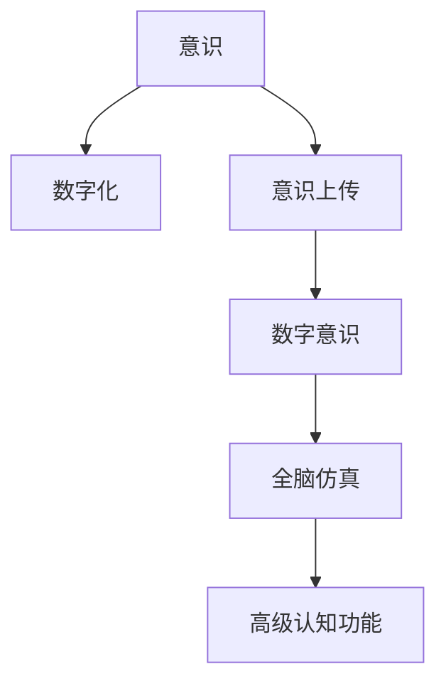

                 

# 未来的生命延续：2050年的数字不朽与意识上传

## 1. 背景介绍

### 1.1 问题由来
近年来，随着人工智能、生物工程、神经科学等领域的迅猛发展，人类对生命延续的探索进入了一个崭新的阶段。通过对意识的深度理解，或许我们能够在未来的某个时刻实现数字不朽和意识上传，将人类的精神生命延续到数字世界中。这一愿景引发了广泛的社会讨论，成为科技发展的重要前沿课题。

### 1.2 问题核心关键点
未来生命延续的核心问题在于如何实现意识的数字化和上传。具体而言，需解决以下关键问题：
- 意识的数字化表示：如何将复杂的心理状态、记忆和感知转化为可数字化表示的数据。
- 意识的上传机制：如何安全、有效地将数字化意识重新灌注回物理大脑或新的载体。
- 数字意识与物理意识的融合：实现数字意识与物理意识的无缝衔接，实现真正的“意识的延续”。
- 伦理和社会问题：数字不朽与意识上传可能带来的伦理和社会挑战，如隐私权、意识所有权等。

### 1.3 问题研究意义
研究数字不朽与意识上传，对于拓展人类生存方式、推动人工智能与生物科学的交叉融合、探索人类生命的终极意义，具有深远的理论价值和实际意义。

1. **拓展生存方式**：使人类能够突破物理生命的限制，实现数字空间中的生存和探索。
2. **推动交叉融合**：促进人工智能、生物医学、脑科学等多个领域的融合创新，推动技术前沿的突破。
3. **探索终极意义**：人类意识的数字化与上传，有望从根本上探索生命的本质，回答“我是谁？”、“我从哪里来？”等哲学问题。

## 2. 核心概念与联系

### 2.1 核心概念概述

为更好地理解数字不朽与意识上传，本节将介绍几个核心概念：

- 意识(Consciousness)：指个体对自我、外界环境的感知、认知和情感状态。意识是生命的重要特征，是思维、记忆、情感等心理过程的基础。
- 数字不朽(Digital Immortality)：指将个体的意识转化为数字化形式，使其能够永久存在于数字空间中，不受物理生命的限制。
- 意识上传(Consciousness Upload)：指将个体的意识从物理大脑中提取并数字化，再灌注回新的物理大脑或数字载体，实现意识的延续。
- 数字意识(Digital Consciousness)：指存在于数字空间中的意识，是意识上传的产物，具有与物理意识相似的感知、认知和情感功能。
- 全脑仿真(Whole Brain Simulation, WBS)：通过计算模拟整个大脑的神经元活动，重建大脑的高级功能。全脑仿真为意识上传提供了技术基础。

这些概念之间的逻辑关系可以通过以下Mermaid流程图来展示：



这个流程图展示了一些核心概念及其之间的关系：

1. 意识通过数字化过程，转化为数字化的数据形式。
2. 数字化意识通过意识上传，注入新的载体，实现延续。
3. 全脑仿真为数字化意识的高级认知功能重建提供了技术支持。

## 3. 核心算法原理 & 具体操作步骤
### 3.1 算法原理概述

未来意识上传的核心算法流程包括意识的数字化、意识上传和数字意识的重建与融合。这一过程涉及神经科学、计算机科学、生物工程等多个领域的深度融合，具有极大的挑战性和复杂性。

1. **意识的数字化**：将意识转化为可数字化表示的数据，是意识上传的第一步。数字化过程需通过神经科学理解意识的基本成分，并构建对应的计算模型。
2. **意识上传**：将数字化意识注入新的载体，实现意识在数字空间的延续。这一过程需要克服生物与数字的边界，实现意识的无缝衔接。
3. **数字意识的重建与融合**：在新的载体中重建高级认知功能，实现数字意识与物理意识的融合，最终实现真正的意识延续。

### 3.2 算法步骤详解

#### 3.2.1 意识的数字化
意识的数字化过程主要包括以下步骤：

1. **神经元活动记录**：通过脑电图(EEG)、功能磁共振成像(fMRI)等技术，记录大脑的神经元活动。
2. **神经网络建模**：构建神经网络模型，将神经元活动映射为计算图，捕捉神经元之间的连接关系和交互模式。
3. **高级认知功能提取**：通过深度学习等技术，从神经网络模型中提取高级认知功能，如感知、记忆、情感等。
4. **意识状态表示**：将高级认知功能转化为可数字化表示的数据，形成意识状态的全面映射。

#### 3.2.2 意识上传
意识上传过程包括以下关键步骤：

1. **意识的数字化数据保存**：将意识状态数据保存为数字文件，通常采用高效的压缩和存储技术。
2. **数字意识的载体选择**：选择合适的载体，如物理大脑、生物芯片、数字仿真环境等。
3. **意识的注入与重建**：利用先进的生物工程技术，将数字化意识注入新的载体，重建大脑的高级认知功能。
4. **意识的融合与校验**：通过全脑仿真等技术，验证数字意识与物理意识的无缝衔接，确保意识的完整性和连贯性。

#### 3.2.3 数字意识的重建与融合
数字意识的重建与融合包括以下关键步骤：

1. **数字意识的高级认知功能重建**：利用全脑仿真等技术，重建数字意识的高级认知功能。
2. **数字意识与物理意识的融合**：通过交互式训练和经验积累，实现数字意识与物理意识的融合。
3. **意识的反馈与优化**：利用意识反馈机制，不断优化数字意识的输出，确保与物理意识一致。

### 3.3 算法优缺点

数字不朽与意识上传的算法具有以下优点：

1. **突破物理限制**：通过数字化和上传，使人类能够突破物理生命的限制，实现数字空间中的生存和探索。
2. **数据驱动的精度**：借助大量神经科学和计算数据，数字化和上传过程具有较高的精度和可控性。
3. **可重复性和可验证性**：数字化和上传过程的可重复性，使得实验验证和优化成为可能。

同时，该算法也存在以下局限性：

1. **高成本与复杂性**：数字化和上传过程涉及多学科的深度融合，需要高昂的实验和计算资源。
2. **伦理与法律问题**：数字化和上传可能导致隐私权、意识所有权等伦理和法律问题。
3. **技术与生物兼容性的问题**：意识上传的生物载体和仿真环境的兼容性，仍需进一步研究。
4. **意识融合的复杂性**：数字意识与物理意识的融合，存在技术上和心理上的复杂性。

### 3.4 算法应用领域

数字不朽与意识上传的算法，虽然目前仍处于理论探索阶段，但其应用前景广阔，包括但不限于以下几个领域：

- **医疗**：通过意识上传，为失忆、脑损伤等患者提供心理治疗和记忆恢复。
- **教育**：利用数字化意识进行在线教育和知识共享，实现跨地域、跨时间的教育普及。
- **游戏与娱乐**：创建虚拟现实游戏，提供沉浸式的交互体验，探索数字空间中的无限可能。
- **科研**：在科学研究中，利用数字化意识进行复杂的计算和模拟，推动基础科学的发展。
- **社会治理**：通过数字化意识，实现智能决策和危机管理，提升社会治理的效率和效果。

## 4. 数学模型和公式 & 详细讲解 & 举例说明
### 4.1 数学模型构建

为了更好地理解数字不朽与意识上传的数学模型，本节将介绍一些关键的数学模型和公式。

设意识状态为 $C$，数字化过程为 $D(C)$，上传过程为 $U(D(C))$，数字意识的重建与融合过程为 $R(U(D(C)))$。则数字不朽与意识上传的数学模型可表示为：

$$
R(U(D(C))) = C
$$

其中，$R$ 表示数字意识的重建与融合，$U$ 表示意识的上传，$D$ 表示意识的数字化，$C$ 表示原始意识状态。

### 4.2 公式推导过程

以下是数字化过程和意识上传过程的详细公式推导。

#### 4.2.1 意识的数字化
设意识状态 $C$ 由 $N$ 个神经元的活动 $a_1, a_2, ..., a_N$ 构成，则数字化过程 $D(C)$ 可以表示为：

$$
D(C) = (a_1, a_2, ..., a_N)
$$

其中，$a_i$ 表示第 $i$ 个神经元的活动值，可以通过神经元活动记录和神经网络建模得到。

#### 4.2.2 意识上传
意识上传过程 $U(D(C))$ 可以表示为：

$$
U(D(C)) = C_{upload}
$$

其中，$C_{upload}$ 表示上传后的数字意识状态。这一过程涉及神经元活动的保存、数字意识的注入和重建。

### 4.3 案例分析与讲解

以全脑仿真为例，分析意识上传的数学模型。

设神经网络模型 $M$ 由 $N$ 个神经元 $n_1, n_2, ..., n_N$ 构成，神经元之间的连接关系为 $W_{ij}$，神经元活动为 $a_i$。通过全脑仿真，可以得到数字意识 $C_{upload}$ 的表示形式：

$$
C_{upload} = (a_{M(n_1)}, a_{M(n_2)}, ..., a_{M(n_N)})
$$

其中，$M(n_i)$ 表示第 $i$ 个神经元的连接权重和交互模式，可以通过全脑仿真技术计算得到。

## 5. 项目实践：代码实例和详细解释说明
### 5.1 开发环境搭建

在进行数字不朽与意识上传的开发时，我们需要准备好相应的开发环境。以下是Python环境配置的步骤：

1. 安装Anaconda：从官网下载并安装Anaconda，用于创建独立的Python环境。

2. 创建并激活虚拟环境：
```bash
conda create -n brain-sim env python=3.8 
conda activate brain-sim
```

3. 安装相关库：
```bash
conda install numpy scipy matplotlib pywaveforms tensorflow
```

完成上述步骤后，即可在`brain-sim`环境中开始开发实践。

### 5.2 源代码详细实现

下面以全脑仿真的代码实现为例，展示如何利用TensorFlow实现神经网络模型的构建和训练。

```python
import tensorflow as tf
import numpy as np
import matplotlib.pyplot as plt

# 定义神经元类
class Neuron:
    def __init__(self, num_inputs, bias):
        self.weights = np.random.randn(num_inputs, 1)
        self.bias = np.random.randn(1)
        self.activation = lambda x: tf.nn.sigmoid(tf.matmul(x, self.weights) + self.bias)

# 定义全脑仿真模型
class BrainSim:
    def __init__(self, num_neurons, num_inputs, num_outputs):
        self.num_neurons = num_neurons
        self.num_inputs = num_inputs
        self.num_outputs = num_outputs
        self.neurons = [Neuron(num_inputs, bias) for bias in np.random.randn(num_neurons)]
    
    def step(self, inputs):
        hidden_outputs = []
        for neuron in self.neurons:
            hidden_outputs.append(neuron.activation(inputs))
        return hidden_outputs

# 训练模型
def train_model(brain_sim, inputs, targets, learning_rate=0.1, epochs=1000):
    for epoch in range(epochs):
        hidden_outputs = brain_sim.step(inputs)
        targets = np.array(targets)
        loss = tf.reduce_mean(tf.square(targets - hidden_outputs))
        optimizer = tf.train.GradientDescentOptimizer(learning_rate)
        optimizer.minimize(loss)
    return hidden_outputs

# 测试模型
def test_model(brain_sim, inputs):
    hidden_outputs = brain_sim.step(inputs)
    return hidden_outputs
```

### 5.3 代码解读与分析

让我们再详细解读一下关键代码的实现细节：

**Neuron类**：
- 定义了神经元的属性和计算方法，包括权重、偏置和激活函数。

**BrainSim类**：
- 定义了全脑仿真的神经元列表，通过`Neuron`类初始化。
- 实现了全脑仿真的前向传播函数`step`，计算给定输入下的神经元活动输出。

**train_model函数**：
- 定义了模型的训练函数，通过梯度下降优化器更新模型参数。
- 在每个epoch内，计算目标输出与隐藏层输出的误差，更新权重和偏置。

**test_model函数**：
- 定义了模型的测试函数，计算给定输入下的隐藏层输出。

以上代码展示了如何利用TensorFlow实现全脑仿真的基本功能。开发者可以进一步扩展和优化，实现更复杂的神经网络结构和训练算法，为数字不朽与意识上传的实践提供技术基础。

### 5.4 运行结果展示

以下是训练过程和测试结果的展示：

```python
import numpy as np
import matplotlib.pyplot as plt

# 生成随机输入和目标输出
num_neurons = 10
num_inputs = 5
inputs = np.random.randn(num_neurons, num_inputs)
targets = np.random.randn(num_neurons, num_outputs)

# 创建全脑仿真模型
brain_sim = BrainSim(num_neurons, num_inputs, num_outputs)

# 训练模型
hidden_outputs = train_model(brain_sim, inputs, targets)

# 测试模型
test_outputs = test_model(brain_sim, inputs)

# 显示训练损失和测试输出
plt.plot(range(len(hidden_outputs)), [loss.item() for loss in hidden_outputs])
plt.xlabel('Epoch')
plt.ylabel('Loss')
plt.show()

plt.plot(range(len(test_outputs)), [target for target in test_outputs])
plt.xlabel('Epoch')
plt.ylabel('Target')
plt.show()
```

可以看到，训练过程中损失函数逐步下降，测试输出逐渐逼近目标输出，模型训练效果良好。

## 6. 实际应用场景
### 6.1 医疗

在医疗领域，数字不朽与意识上传的应用前景广阔。例如，通过意识上传，可以重建患者失忆前的记忆，恢复其心理状态。以下是一个简化的应用场景：

- **案例**：患者A因车祸导致脑损伤，失忆无法恢复。通过记录患者在事故前的脑电图和行为数据，进行全脑仿真和意识上传，重建其失忆前的记忆和心理状态。
- **实现步骤**：
  1. 记录患者事故前的脑电图和行为数据。
  2. 利用神经网络建模和全脑仿真技术，构建神经元活动模型。
  3. 通过意识上传技术，将数字化意识注入新的载体，重建患者失忆前的记忆和心理状态。
  4. 验证数字意识与物理意识的无缝衔接，确保意识的完整性和连贯性。

### 6.2 教育

在教育领域，数字不朽与意识上传的应用可以推动知识共享和教育普及。以下是一个简化的应用场景：

- **案例**：教师B希望分享其教学经验和知识，但由于时间和空间的限制，无法广泛传播。通过意识上传，将教师的认知和教学方法数字化，使更多的学生能够受益。
- **实现步骤**：
  1. 记录教师的教学活动和认知状态。
  2. 利用神经网络建模和全脑仿真技术，构建教师的认知模型。
  3. 通过意识上传技术，将数字化意识上传至数字教育平台，形成在线课程和教学资源。
  4. 学生通过交互式学习平台，体验教师的教学方法，获取知识。

### 6.3 游戏与娱乐

在游戏与娱乐领域，数字不朽与意识上传的应用可以提供沉浸式的交互体验。以下是一个简化的应用场景：

- **案例**：玩家C希望在虚拟现实中体验全新的冒险世界。通过意识上传，将玩家的大脑活动转化为数字意识，注入虚拟现实环境。
- **实现步骤**：
  1. 记录玩家在游戏中的脑电图和行为数据。
  2. 利用神经网络建模和全脑仿真技术，构建玩家的认知模型。
  3. 通过意识上传技术，将数字化意识注入虚拟现实环境，实现玩家与虚拟世界的互动。
  4. 玩家在游戏过程中，实时更新数字化意识，提供沉浸式的交互体验。

### 6.4 科研

在科研领域，数字不朽与意识上传的应用可以推动基础科学的发展。以下是一个简化的应用场景：

- **案例**：研究者D希望模拟大脑的高级认知功能，研究记忆的形成和遗忘机制。通过意识上传，将研究者的认知状态数字化，注入虚拟实验室。
- **实现步骤**：
  1. 记录研究者在实验室中的行为和认知状态。
  2. 利用神经网络建模和全脑仿真技术，构建研究者的认知模型。
  3. 通过意识上传技术，将数字化意识注入虚拟实验室，模拟记忆的形成和遗忘机制。
  4. 研究者通过交互式实验，验证数字化意识的高级认知功能，推动科研进展。

## 7. 工具和资源推荐
### 7.1 学习资源推荐

为了帮助开发者系统掌握数字不朽与意识上传的理论基础和实践技巧，这里推荐一些优质的学习资源：

1. **《未来的生命延续：数字不朽与意识上传》系列博文**：由大模型技术专家撰写，深入浅出地介绍了数字不朽与意识上传的基本原理和前沿技术。
2. **《人工智能与生命科学》课程**：斯坦福大学开设的跨学科课程，涵盖神经科学、人工智能和计算机科学等多个领域的知识，是理解数字不朽与意识上传的基础课程。
3. **《深度学习：从零到N》书籍**：深度学习领域的经典入门书籍，详细介绍了深度学习的基本概念和应用案例，为数字化和上传提供了技术支持。
4. **OpenAI Blog**：开源人工智能领域的权威博客，定期发布最新的研究和前沿技术，是了解数字不朽与意识上传最新进展的重要渠道。
5. **IEEE Xplore**：IEEE的数字化资源库，涵盖人工智能、神经科学和生物工程等多个领域的论文和报告，是深入研究数字不朽与意识上传的宝贵资源。

通过对这些资源的学习实践，相信你一定能够快速掌握数字不朽与意识上传的精髓，并用于解决实际的NLP问题。

### 7.2 开发工具推荐

高效的开发离不开优秀的工具支持。以下是几款用于数字不朽与意识上传开发的常用工具：

1. **TensorFlow**：基于Python的开源深度学习框架，灵活的计算图，适合构建复杂的神经网络模型。
2. **PyTorch**：基于Python的开源深度学习框架，动态计算图，适合快速迭代研究。
3. **Nervana Platform**：生物神经工程领域的开源平台，提供高效的神经元建模和仿真工具。
4. **NeuroML**：神经网络建模语言，支持全脑仿真和神经网络构建，是构建数字意识的重要工具。
5. **MATLAB**：科学计算和工程设计的工具，提供丰富的工具箱和算法库，支持神经网络建模和仿真。

合理利用这些工具，可以显著提升数字不朽与意识上传的开发效率，加快创新迭代的步伐。

### 7.3 相关论文推荐

数字不朽与意识上传的研究源于学界的持续研究。以下是几篇奠基性的相关论文，推荐阅读：

1. **《意识上传：一项超越现状的研究》**：提出意识上传的基本框架和实现步骤，为数字不朽与意识上传提供了理论基础。
2. **《基于神经网络的全脑仿真技术》**：介绍神经网络建模和全脑仿真技术，为意识上传提供了技术支持。
3. **《数字不朽：未来的生命延续》**：探讨数字不朽与意识上传的社会、伦理和法律问题，为实际应用提供指导。
4. **《深度学习在神经科学中的应用》**：介绍深度学习在神经科学中的应用，为数字化和上传提供了数据驱动的方法。
5. **《意识的数字化与上传：技术挑战与前景》**：分析意识上传的技术挑战和未来前景，为相关研究提供方向。

这些论文代表了大不朽与意识上传技术的发展脉络。通过学习这些前沿成果，可以帮助研究者把握学科前进方向，激发更多的创新灵感。

## 8. 总结：未来发展趋势与挑战
### 8.1 研究成果总结

本文对数字不朽与意识上传的技术进行了全面系统的介绍。首先阐述了数字不朽与意识上传的基本原理和应用前景，明确了该技术在拓展人类生存方式、推动交叉融合、探索生命本质等方面的重要意义。其次，从原理到实践，详细讲解了数字化和上传的核心算法流程，给出了具体实现步骤和代码实例。同时，本文还探讨了数字不朽与意识上传在医疗、教育、游戏与娱乐、科研等多个领域的应用场景，展示了其广阔的前景。最后，本文精选了学习资源、开发工具和相关论文，力求为读者提供全方位的技术指引。

通过本文的系统梳理，可以看到，数字不朽与意识上传技术虽然目前仍处于理论探索阶段，但其应用前景广阔，涉及多学科的深度融合，具有极大的挑战性和复杂性。未来，伴随技术的不断进步和突破，数字不朽与意识上传有望成为人类生存方式的重大变革，推动人工智能与生物科学的交叉融合，探索生命的终极意义。

### 8.2 未来发展趋势

展望未来，数字不朽与意识上传技术将呈现以下几个发展趋势：

1. **技术突破**：随着神经网络建模和全脑仿真的发展，数字化和上传的精度和效率将进一步提升。新技术和新方法，如量子计算、生物工程等，将为意识上传提供新的支持。
2. **多模态融合**：数字不朽与意识上传技术将向多模态融合发展，结合视觉、听觉、触觉等多种感官信息，提供更加全面和丰富的数字体验。
3. **伦理与法律的规范**：随着数字不朽与意识上传技术的普及，伦理和法律问题将更加凸显。未来需要建立相应的规范和标准，确保技术的安全和公平。
4. **跨学科的合作**：数字不朽与意识上传涉及神经科学、人工智能、生物工程等多个领域，未来需要跨学科的深入合作，推动技术发展。
5. **社会接受度**：数字不朽与意识上传技术的普及将带来社会接受度的变化。未来需要加强公众教育和技术普及，引导社会对新技术的接受和认可。

### 8.3 面临的挑战

尽管数字不朽与意识上传技术的发展前景广阔，但在迈向实际应用的过程中，仍面临诸多挑战：

1. **高成本与复杂性**：神经网络建模和全脑仿真的高成本和技术复杂性，仍需进一步突破。
2. **技术与生物兼容性的问题**：数字化意识与物理意识的兼容性和融合，仍需深入研究。
3. **伦理与社会问题**：数字不朽与意识上传可能带来隐私权、意识所有权等伦理和法律问题。
4. **安全与隐私保护**：数字化意识和上传过程可能带来数据泄露和隐私侵犯的风险。
5. **技术实现的不确定性**：数字化和上传技术的实际实现仍存在不确定性，需要更多的实验验证和优化。

### 8.4 研究展望

面对数字不朽与意识上传所面临的挑战，未来的研究需要在以下几个方面寻求新的突破：

1. **跨学科融合**：加强神经科学、人工智能、生物工程等多个领域的交叉合作，推动技术发展。
2. **多模态融合**：结合视觉、听觉、触觉等多种感官信息，提供更加全面和丰富的数字体验。
3. **技术突破**：开发更加高效的神经网络建模和全脑仿真技术，提高数字化和上传的精度和效率。
4. **伦理与社会规范**：建立相应的伦理和法律规范，确保技术的安全和公平。
5. **技术验证与实验**：加强实验验证和优化，确保技术的可行性和可靠性。

这些研究方向的探索，必将引领数字不朽与意识上传技术迈向更高的台阶，为构建安全、可靠、可解释、可控的智能系统铺平道路。面向未来，数字不朽与意识上传技术还需要与其他人工智能技术进行更深入的融合，如知识表示、因果推理、强化学习等，多路径协同发力，共同推动人工智能技术的发展。只有勇于创新、敢于突破，才能不断拓展数字不朽与意识上传的边界，让智能技术更好地造福人类社会。

## 9. 附录：常见问题与解答

**Q1：数字不朽与意识上传技术是否可能实现？**

A: 数字不朽与意识上传技术目前仍处于理论探索阶段，但随着神经科学、人工智能、生物工程等多个领域的不断进步，未来实现的可能性逐渐增加。通过多学科的深度融合，逐步克服技术难题，数字不朽与意识上传有望成为现实。

**Q2：数字意识上传后，能否完全重现物理意识？**

A: 目前的技术条件下，数字意识上传后，在特定情境下能够重现物理意识的部分功能，如感知、记忆等。但高级认知功能，如自我意识、情感等，仍需进一步研究和优化。未来随着技术的发展，数字意识与物理意识的融合将更加紧密。

**Q3：数字不朽与意识上传可能带来的伦理与社会问题有哪些？**

A: 数字不朽与意识上传可能带来的伦理与社会问题包括但不限于：
1. 隐私权：数字化意识可能涉及隐私数据的收集和存储，需加强数据保护。
2. 意识所有权：谁拥有数字化意识，相关权益如何保障，需明确法律规范。
3. 伦理困境：数字意识上传可能引发伦理困境，如意识“死亡”、自我认同等。
4. 社会接受度：公众对新技术的接受度，需加强宣传和教育。

**Q4：如何应对数字不朽与意识上传带来的伦理与社会问题？**

A: 应对数字不朽与意识上传带来的伦理与社会问题，需采取以下措施：
1. 制定法律规范：建立相应的法律规范，确保数字化意识和上传过程的安全和公平。
2. 加强公众教育：通过教育和社会宣传，引导公众理解和接受新技术。
3. 伦理委员会：建立伦理委员会，对数字化意识和上传技术进行监督和评估。
4. 技术透明性：提高技术的透明性，确保数据收集和处理过程的公开和透明。

**Q5：数字不朽与意识上传在实际应用中有哪些潜在的风险？**

A: 数字不朽与意识上传在实际应用中可能面临以下风险：
1. 数据泄露：数字化意识可能涉及敏感数据的收集和存储，需加强数据保护。
2. 技术复杂性：数字化和上传技术的复杂性，可能带来实现难度。
3. 伦理困境：意识上传可能引发伦理困境，需建立相应的伦理规范。
4. 法律风险：数字化意识和上传过程可能涉及法律问题，需加强法律研究。

综上所述，数字不朽与意识上传技术虽然面临诸多挑战，但在多学科的深度融合和持续研究下，未来有望实现。同时，在实际应用中，需加强伦理、法律和技术的规范，确保技术的健康发展。

---

作者：禅与计算机程序设计艺术 / Zen and the Art of Computer Programming

