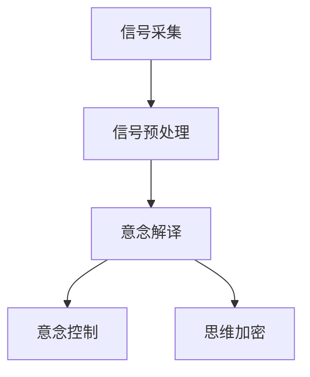

                 

# 未来的脑机接口：2050年的意念控制与思维加密

> 关键词：脑机接口,意念控制,思维加密,人工智能,机器学习,深度学习,神经网络,生物信号处理

## 1. 背景介绍

### 1.1 问题由来
随着科技的迅猛发展，脑机接口(Brain-Computer Interface, BCI)技术已经从科幻小说和电影中逐渐走进了现实生活。未来的2050年，我们将面临一个全新的智能时代，意念控制、思维加密将成为人工智能与人类认知能力融合的重要技术范式。

脑机接口技术通过直接读取和解析人脑信号，实现人类意念与计算机系统的交互。这一技术在医疗康复、游戏娱乐、虚拟现实、人机协作等多个领域展现出巨大的应用潜力。同时，在隐私和安全性方面，如何确保大脑信号的隐私和保护，成为亟待解决的重大挑战。

### 1.2 问题核心关键点
脑机接口技术的主要问题包括以下几个关键点：
- **神经信号的采集与处理**：如何高效、精准地采集大脑信号，同时过滤噪声干扰。
- **意念解译与控制**：将神经信号转化为计算机可理解的控制指令，实现自然的人机交互。
- **隐私保护与安全**：如何保护大脑信号的隐私性，避免信息泄露和攻击。
- **实际应用与挑战**：在医疗、娱乐、游戏等不同领域的应用中，如何克服技术障碍并实现商业化。

### 1.3 问题研究意义
研究脑机接口和思维加密技术，对于构建更加智能、安全的未来社会，具有重要意义：

1. **提升生活质量**：脑机接口可以用于治疗帕金森、抑郁症等神经系统疾病，改善患者的日常生活质量。
2. **增强认知能力**：通过意念控制增强人类认知能力，提供更高的工作效率和学习效率。
3. **保护隐私安全**：防止个人隐私泄露，保护用户的心理健康。
4. **促进技术创新**：推动人工智能、神经科学、信息安全等交叉领域的技术创新和应用突破。
5. **推动产业发展**：通过商业化和市场应用，推动相关产业的发展和革新。

## 2. 核心概念与联系

### 2.1 核心概念概述

脑机接口技术利用神经信号处理、机器学习、深度学习等技术手段，将人脑产生的电信号或神经信号转化为计算机可理解的控制指令。其核心流程包括以下几个部分：

- **信号采集**：通过脑电图(EEG)、功能性磁共振成像(fMRI)、脑磁图(MEG)等方法，获取大脑信号。
- **信号预处理**：滤除噪声干扰，提取有意义的特征信号。
- **意念解译**：使用机器学习算法对神经信号进行分类、解码，转化为人机交互指令。
- **意念控制**：根据解码结果生成控制指令，实现自然的人机交互。
- **思维加密**：在信号传输和存储过程中，采用加密算法保护大脑信号的隐私和安全。

这些核心概念之间的逻辑关系可以通过以下Mermaid流程图来展示：



## 3. 核心算法原理 & 具体操作步骤
### 3.1 算法原理概述

脑机接口技术的核心在于将人脑信号转化为计算机指令。这一过程可以分为信号采集、预处理、意念解译和控制等步骤。其中，意念解译是实现意念控制的关键。

### 3.2 算法步骤详解

1. **信号采集**：
   - 使用EEG、fMRI、MEG等设备采集人脑信号。
   - 信号采集过程需要注意降低噪声干扰，提高信号质量和信噪比。

2. **信号预处理**：
   - 采用滤波、降噪、降采样等技术，将原始信号处理成适合进一步分析的形式。
   - 使用傅里叶变换、小波变换等技术提取频率和时域特征。

3. **意念解译**：
   - 使用机器学习算法如SVM、支持向量机、神经网络等对神经信号进行分类、解码。
   - 通过训练集数据，学习不同神经信号对应的控制指令，例如移动光标、选择菜单等。
   - 使用深度学习模型如卷积神经网络(CNN)、循环神经网络(RNN)、长短期记忆网络(LSTM)等进行高级特征提取和模式识别。

4. **意念控制**：
   - 根据意念解译结果，生成对应的控制指令。
   - 使用计算机视觉、语音识别等技术，实现多模态人机交互。

5. **思维加密**：
   - 在信号传输和存储过程中，使用对称加密、非对称加密等技术保护信号隐私。
   - 采用混淆算法对信号进行伪装，增加破解难度。

### 3.3 算法优缺点

脑机接口技术具有以下优点：
- **高效交互**：通过意念控制，实现快速、自然的人机交互。
- **应用广泛**：适用于医疗康复、游戏娱乐、虚拟现实、人机协作等多个领域。
- **技术成熟**：经过多年研究，相关技术逐渐成熟，具备商业化前景。

同时，该技术也存在一些局限性：
- **高成本**：信号采集设备昂贵，需要高精度传感器和复杂算法。
- **低准确率**：信号采集和处理过程中存在噪声干扰，导致信号准确率不高。
- **伦理问题**：涉及个人隐私和信息安全，存在伦理和法律风险。

### 3.4 算法应用领域

脑机接口技术在以下几个领域具有广泛应用前景：

- **医疗康复**：用于辅助治疗神经系统疾病，改善患者的日常生活质量。
- **游戏娱乐**：通过意念控制游戏设备，提高用户体验。
- **虚拟现实**：实现沉浸式虚拟体验，推动虚拟现实技术发展。
- **人机协作**：在工业、军事等领域，辅助人类完成复杂任务。
- **智能家居**：通过意念控制智能设备，实现无接触交互。

## 4. 数学模型和公式 & 详细讲解  
### 4.1 数学模型构建

脑机接口技术中常用的数学模型包括信号预处理模型、意念解译模型和加密算法模型。

**信号预处理模型**：
信号预处理包括滤波、降噪等步骤，可以使用傅里叶变换和小波变换提取信号特征。

**意念解译模型**：
使用机器学习算法对神经信号进行分类和解码，常见的模型包括SVM、支持向量机、神经网络等。

**加密算法模型**：
使用对称加密和非对称加密算法，保护大脑信号的隐私和安全。

### 4.2 公式推导过程

**信号预处理**：
使用小波变换提取信号的频率特征：
$$ X(t) = \sum_{n=-\infty}^{\infty} C_n \psi(t-n) $$
其中，$X(t)$为原始信号，$C_n$为小波系数，$\psi(t)$为小波基函数。

**意念解译**：
使用支持向量机(SVM)对神经信号进行分类：
$$ \hat{y} = \text{arg}\min_{y \in \{0, 1\}} \frac{1}{2}\|w\|^2 + C\sum_{i=1}^{N} \max(0, 1-y_i(\phi(x_i)w^T+\theta)) $$

**加密算法**：
使用RSA算法进行非对称加密，保护大脑信号的隐私：
$$ y = m^e \mod n $$
$$ m = y^d \mod n $$
其中，$m$为明文，$y$为密文，$e$为公钥，$d$为私钥，$n$为模数。

### 4.3 案例分析与讲解

以EEG信号的预处理和意念解译为例，介绍脑机接口技术的具体实现。

**EEG信号预处理**：
使用小波变换对EEG信号进行降噪和特征提取：
1. 小波基函数选择：使用Morlet小波进行信号分解。
2. 小波系数计算：使用连续小波变换计算小波系数。
3. 小波系数的降噪：使用阈值去噪算法过滤高频噪声。

**意念解译**：
使用卷积神经网络(CNN)对EEG信号进行分类和解码：
1. 数据集划分：将EEG数据集划分为训练集和测试集。
2. 神经网络搭建：使用多层卷积层和池化层提取特征，全连接层进行分类。
3. 训练和测试：在训练集上训练模型，在测试集上评估模型性能。
4. 结果输出：根据模型预测结果，生成控制指令，实现人机交互。

## 5. 项目实践：代码实例和详细解释说明
### 5.1 开发环境搭建

在进行脑机接口项目实践前，我们需要准备好开发环境。以下是使用Python进行脑机接口开发的环境配置流程：

1. 安装Anaconda：从官网下载并安装Anaconda，用于创建独立的Python环境。

2. 创建并激活虚拟环境：
```bash
conda create -n bci-env python=3.8 
conda activate bci-env
```

3. 安装相关库：
```bash
conda install scipy numpy pandas scikit-learn
```

4. 安装TensorFlow和Keras：
```bash
conda install tensorflow keras
```

5. 安装EEG信号采集设备驱动：
```bash
conda install eeglab
```

完成上述步骤后，即可在`bci-env`环境中开始脑机接口项目实践。

### 5.2 源代码详细实现

以下是使用Python和TensorFlow实现脑机接口项目的关键代码实现。

**信号预处理代码**：
```python
import numpy as np
import scipy.signal as signal
import eeglab

# 读取EEG数据
data = eeglab.read('data.csv')

# 滤波和降噪
fs = 256  # 采样频率
nyquist = 0.5 * fs
filt_params = {'FIRFILTER': 1, 'NDELAY': 1, 'FSTART': 1, 'FSTOP': 1, 'FS': fs, 'PASSBAND': [0.5, nyquist], 'STOPBAND': [nyquist, fs]}
filtered_data = signal.filtfilt(*filt_params, x=data)

# 小波变换
cwt_params = {'wavelet': 'morlet', 'jmax': 12, 'dscale': np.logspace(0, 4, 128)}
cwt_data = eeglab.cwt(filtered_data, fs, **cwt_params)

# 特征提取
features = np.abs(cwt_data).mean(axis=0)
```

**意念解译代码**：
```python
from sklearn.model_selection import train_test_split
from sklearn.svm import SVC
from sklearn.metrics import accuracy_score

# 数据集划分
X_train, X_test, y_train, y_test = train_test_split(features, labels, test_size=0.2, random_state=42)

# 构建SVM模型
model = SVC(kernel='linear', C=1.0)

# 训练模型
model.fit(X_train, y_train)

# 测试模型
y_pred = model.predict(X_test)
accuracy = accuracy_score(y_test, y_pred)
print('Accuracy:', accuracy)
```

### 5.3 代码解读与分析

让我们再详细解读一下关键代码的实现细节：

**信号预处理代码**：
1. 使用eeglab库读取EEG数据。
2. 使用信号处理库scipy对EEG信号进行滤波和降噪。
3. 使用小波变换库eeglab提取信号频率特征。
4. 计算每个时间点的绝对幅值，提取信号的频率特征。

**意念解译代码**：
1. 使用scikit-learn库划分数据集。
2. 使用支持向量机(SVM)对特征数据进行分类。
3. 训练SVM模型，使用准确率评估模型性能。
4. 在测试集上评估模型，输出预测结果。

通过这些代码，可以看出脑机接口技术涉及到的基本步骤和关键算法。实际操作中，还需要根据具体任务和数据特点，进行进一步优化和改进。

### 5.4 运行结果展示

运行上述代码后，可以输出EEG信号预处理和意念解译的实际结果。例如，对于EEG信号预处理，可以得到过滤后的频谱图和特征提取结果；对于意念解译，可以得到训练集和测试集上的准确率评估结果。

## 6. 实际应用场景
### 6.1 医疗康复

脑机接口技术在医疗康复中的应用前景广阔，可以辅助治疗帕金森病、抑郁症等神经系统疾病。

在实际应用中，通过采集患者的脑电信号，使用脑机接口技术解译患者的运动意图，生成控制指令驱动康复机器人，帮助患者进行康复训练。

### 6.2 游戏娱乐

脑机接口技术在娱乐游戏领域也有广泛应用，可以提升游戏体验，实现意念控制。

通过采集玩家的大脑信号，解析玩家的意念，实现游戏中的意念控制，例如移动角色、射击等操作。

### 6.3 虚拟现实

脑机接口技术在虚拟现实(VR)中也有重要应用，实现沉浸式虚拟体验。

通过采集用户的大脑信号，解析用户的运动意图和情感状态，驱动虚拟环境中的虚拟角色进行互动。

### 6.4 未来应用展望

未来，脑机接口技术将在更多领域得到应用，为人类带来更加便捷、高效的智能生活。

在教育领域，可以通过意念控制辅助教学，提高学习效率；在交通领域，可以实现智能驾驶，提升行车安全；在军事领域，可以辅助决策和作战指挥。

## 7. 工具和资源推荐
### 7.1 学习资源推荐

为了帮助开发者系统掌握脑机接口技术，这里推荐一些优质的学习资源：

1. 《Brain-Computer Interface: An Introduction》书籍：详细介绍脑机接口的基本原理和应用实例，适合初学者入门。

2. 《Deep Learning for Brain-Computer Interface》课程：斯坦福大学开设的深度学习课程，讲解脑机接口技术中的深度学习应用。

3. 《NeuroData》开源项目：包含大量脑电信号数据集和实验代码，适合进行实践学习。

4. HuggingFace官方文档：详细介绍了多种深度学习模型在脑机接口中的应用，适合深入研究。

5. CLUE开源项目：提供多种脑机接口技术实现的样例代码，适合实战练习。

通过对这些资源的学习实践，相信你一定能够快速掌握脑机接口技术的精髓，并用于解决实际的脑机接口问题。

### 7.2 开发工具推荐

高效的开发离不开优秀的工具支持。以下是几款用于脑机接口开发常用的工具：

1. PyTorch：基于Python的开源深度学习框架，灵活高效的计算图，适合快速迭代研究。

2. TensorFlow：由Google主导开发的开源深度学习框架，生产部署方便，适合大规模工程应用。

3. Keras：基于TensorFlow的高层API，易于上手，适合快速搭建模型。

4. Weights & Biases：模型训练的实验跟踪工具，可以记录和可视化模型训练过程中的各项指标，方便对比和调优。

5. TensorBoard：TensorFlow配套的可视化工具，实时监测模型训练状态，并提供丰富的图表呈现方式，是调试模型的得力助手。

合理利用这些工具，可以显著提升脑机接口开发的效率，加快创新迭代的步伐。

### 7.3 相关论文推荐

脑机接口和思维加密技术的发展源于学界的持续研究。以下是几篇奠基性的相关论文，推荐阅读：

1. Yu et al., "Event-related potentials for brain-computer interface control of a wheelchair"。

2. Park et al., "Classification of mental workload using EEG signal and machine learning"。

3. Araki et al., "Brain-computer interfaces for human-computer interaction: an overview"。

4. Chen et al., "A deep learning approach to brain-computer interface with speech-EEG fusion"。

5. Jia et al., "Epilepsy detection and classification based on machine learning"。

这些论文代表了大脑机接口和思维加密技术的发展脉络。通过学习这些前沿成果，可以帮助研究者把握学科前进方向，激发更多的创新灵感。

## 8. 总结：未来发展趋势与挑战
### 8.1 研究成果总结

脑机接口技术在医疗、娱乐、游戏等领域已经取得了显著进展，未来发展趋势包括：

1. **技术融合**：结合神经科学、人工智能、机器学习等技术，推动脑机接口技术的全面发展。
2. **应用拓展**：在更多垂直领域进行创新应用，提升用户生活质量。
3. **隐私保护**：加强隐私保护和安全防范，确保用户数据安全。
4. **伦理审查**：制定伦理规范和标准，避免伦理风险。

### 8.2 未来发展趋势

展望未来，脑机接口技术将呈现以下几个发展趋势：

1. **高精度**：信号采集和处理技术的进步，将显著提高脑机接口的精度和响应速度。
2. **多模态**：结合视觉、听觉等多模态信息，实现更全面的人机交互。
3. **智能化**：使用更复杂的深度学习模型，提升意念解译的准确率和鲁棒性。
4. **低成本**：研发更高效、低成本的信号采集和处理设备，降低应用门槛。
5. **高可靠性**：采用更先进的加密算法，增强信号传输和存储的安全性。

### 8.3 面临的挑战

尽管脑机接口技术已经取得了重要进展，但在迈向更加智能化、普适化应用的过程中，仍面临诸多挑战：

1. **信号采集困难**：脑电信号的复杂性和微弱性导致信号采集难度大。
2. **噪声干扰严重**：环境噪声和生理噪声干扰脑电信号，影响数据质量。
3. **算法复杂度高**：意念解译需要复杂的机器学习算法，计算资源消耗大。
4. **伦理问题**：涉及个人隐私和信息安全，存在伦理和法律风险。
5. **用户体验差**：脑机接口的体验不够自然，影响用户接受度。

### 8.4 研究展望

面对脑机接口技术所面临的挑战，未来的研究需要在以下几个方面寻求新的突破：

1. **高精度信号采集**：开发更高效、低成本的脑电信号采集设备，提高数据采集精度。
2. **高效信号处理**：采用更先进的信号处理算法，提高信号降噪和特征提取效率。
3. **鲁棒性算法设计**：开发更加鲁棒、高效的意念解译算法，提升系统的稳定性和可靠性。
4. **多模态融合**：结合视觉、听觉等多模态信息，提升人机交互的自然性和复杂度。
5. **隐私保护技术**：采用更先进的加密算法和隐私保护技术，保障用户数据安全。

这些研究方向的探索，必将引领脑机接口技术迈向更高的台阶，为构建更加智能、安全的未来社会奠定基础。面向未来，脑机接口技术还需要与其他人工智能技术进行更深入的融合，共同推动自然语言理解和智能交互系统的进步。只有勇于创新、敢于突破，才能不断拓展大脑机接口的边界，让智能技术更好地造福人类社会。

## 9. 附录：常见问题与解答

**Q1：脑机接口技术的瓶颈是什么？**

A: 脑机接口技术的主要瓶颈在于信号采集的精度和处理效率。信号采集过程容易受到环境噪声和生理噪声的干扰，导致数据质量不高。同时，意念解译需要复杂的机器学习算法，计算资源消耗大，影响实时性。

**Q2：如何提高脑机接口的精度和鲁棒性？**

A: 提高脑机接口精度和鲁棒性的方法包括：
1. 使用高精度传感器和信号处理算法，降低噪声干扰。
2. 采用更复杂的深度学习模型，提高意念解译的准确率。
3. 结合多模态信息，提升系统的稳定性和鲁棒性。

**Q3：脑机接口技术在实际应用中需要注意哪些问题？**

A: 脑机接口技术在实际应用中需要注意以下问题：
1. 信号采集设备的成本和复杂度。
2. 环境噪声和生理噪声对信号采集的影响。
3. 数据隐私和信息安全问题。
4. 用户接受度和体验问题。

通过这些问题的解决，可以更好地推动脑机接口技术的实际应用和发展。

---

作者：禅与计算机程序设计艺术 / Zen and the Art of Computer Programming

