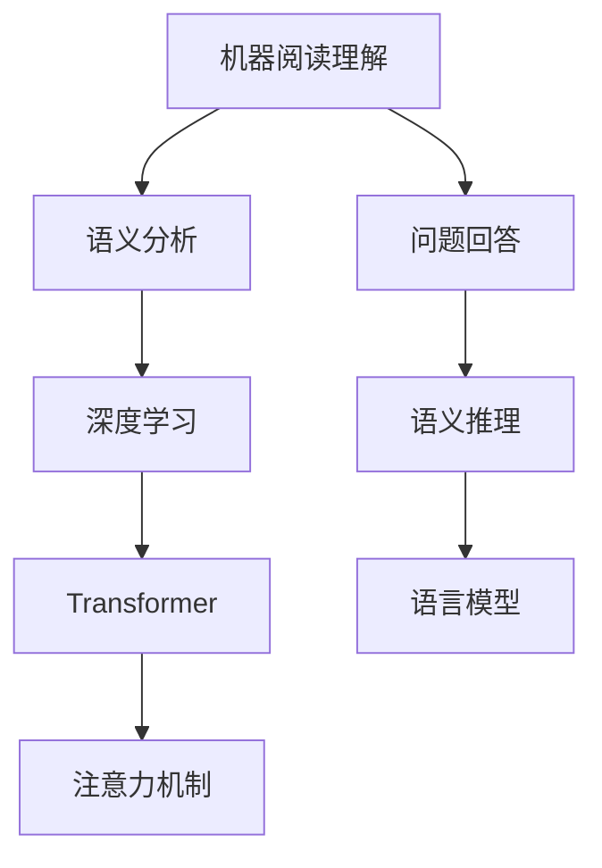

                 

# 机器阅读理解：从浅层到深层语义分析

> 关键词：机器阅读理解, 语义分析, 深度学习, 神经网络, 自然语言处理(NLP), Transformer, 注意力机制, 问题回答, 语义推理

## 1. 背景介绍

### 1.1 问题由来
随着信息时代的到来，人类每天产生的海量文本信息需要被高效地理解和处理。传统的信息检索系统只能通过关键词匹配和简单文本相似度计算获取结果，无法进行复杂的语义理解。机器阅读理解(Machine Reading Comprehension, MRC)技术，通过模拟人类阅读理解过程，直接从文本中提取和推理信息，从而更好地服务于信息检索、智能问答、内容生成等任务。近年来，基于深度学习模型的机器阅读理解技术取得了显著进步，逐渐应用于实际场景中，包括智能客服、自动摘要、智能推荐等，提升了信息检索系统的智能化水平。

### 1.2 问题核心关键点
机器阅读理解技术聚焦于从给定文本中提取出与问题相关的语义信息，并能够合理推理，给出问题答案。它的核心包括：

- 理解自然语言文本。文本理解是阅读理解的基础，要求模型能够捕捉词汇、语法和语义等多层次的信息。
- 推理问题答案。模型需能从文本中提取、整合信息，并根据问题要求进行逻辑推理，得出合理的答案。
- 生成语言输出。最终输出应为通顺、流畅的自然语言，满足用户需求。

### 1.3 问题研究意义
机器阅读理解技术不仅显著提升了信息检索的智能化程度，也改变了NLP技术的研究范式，为未来的智能交互系统打开了新的发展道路。它结合了深度学习、自然语言处理、认知科学等多学科的知识，具备很强的跨领域应用潜力。例如，在医疗、教育、金融等领域，阅读理解技术可以辅助医生诊断、智能辅导、风险分析等，促进行业数字化转型升级，带来新的经济增长点。

## 2. 核心概念与联系

### 2.1 核心概念概述

为更好地理解机器阅读理解技术的核心原理和架构，本节将介绍几个关键概念：

- 机器阅读理解(MRC)：通过理解自然语言文本，自动回答特定问题的技术。

- 语义分析(Semantic Analysis)：指对自然语言文本进行语义信息的提取和理解。语义分析关注文本的深层含义，而非表面词汇信息。

- 深度学习(Deep Learning)：利用多层神经网络进行数据建模的技术。深度学习能够从大量数据中学习复杂非线性关系，是机器阅读理解的主要技术支撑。

- Transformer：一种基于自注意力机制的神经网络架构，用于处理序列数据的深度学习模型。

- 注意力机制(Attention Mechanism)：Transformer的核心，用于模型在处理序列数据时，动态关注关键信息。

- 问题回答(Question Answering, QA)：指从文本中提取信息并回答指定问题的任务，包括单句问答、段落问答、多文档问答等。

- 语义推理(Semantic Reasoning)：指在语义理解的基础上，对文本信息进行逻辑推理和判断，从而得到更准确的答案。

- 语言模型(Language Model)：一种概率模型，用于描述语言的概率分布，是机器阅读理解的基础。

这些核心概念之间的逻辑关系可以通过以下Mermaid流程图来展示：



这个流程图展示了机器阅读理解的核心概念及其之间的联系：

1. 机器阅读理解依托于语义分析，理解文本的深层含义。
2. 深度学习模型，特别是Transformer，提供了高效处理文本信息的能力。
3. 注意力机制是Transformer的核心，用于动态关注文本中的关键信息。
4. 问题回答是阅读理解的主要任务，模型需提取文本信息并生成答案。
5. 语义推理关注从文本信息中合理推导，提升答案的准确性。
6. 语言模型是机器阅读理解的基础，用于评估文本的概率分布。

这些概念共同构成了机器阅读理解技术的理论基础，使其能够从大量文本中提取关键信息并回答指定问题。

## 3. 核心算法原理 & 具体操作步骤
### 3.1 算法原理概述

机器阅读理解的核心思想是通过深度学习模型，将自然语言文本和问题进行语义映射，从而自动回答指定问题。其基本流程包括文本编码、问题编码、交互层交互、答案生成等步骤。

1. **文本编码**：使用深度学习模型，如BERT、GPT等，将自然语言文本转换成向量表示。
2. **问题编码**：同样使用深度学习模型，将自然语言问题转换成向量表示。
3. **交互层交互**：模型对文本和问题的向量表示进行交互，动态关注文本中的关键信息，并结合问题信息进行推理。
4. **答案生成**：模型生成最终的文本答案，通常是一个序列或一个句子。

### 3.2 算法步骤详解

机器阅读理解的具体操作步骤如下：

**Step 1: 准备数据集和模型**

1. 收集标注好的机器阅读理解数据集，如MS MARCO、SQuAD等。
2. 选择合适的深度学习模型，如BERT、GPT等。
3. 准备预训练模型和数据集。

**Step 2: 构建文本和问题向量表示**

1. 使用预训练模型对输入的文本和问题进行编码，得到各自的向量表示。
2. 可以将文本和问题向量拼接，得到一个长向量，或将问题向量作为文本向量的索引，用于查询相关文本信息。

**Step 3: 计算注意力权重**

1. 使用注意力机制计算文本向量中与问题相关的权重。
2. 将文本向量和注意力权重相乘，得到关注文本中关键信息的向量表示。

**Step 4: 推理生成答案**

1. 将问题向量与文本的注意力加权向量进行拼接。
2. 通过一个全连接层或RNN/LSTM等，对拼接向量进行预测，生成最终答案。

**Step 5: 评估和优化**

1. 使用BLEU、ROUGE、F1-score等指标评估模型的性能。
2. 根据评估结果调整模型参数，优化模型性能。

### 3.3 算法优缺点

机器阅读理解技术具有以下优点：

- 高效处理大量文本数据，速度快，可以自动化处理信息检索和问答任务。
- 能够理解复杂的自然语言文本，提取和推理关键信息。
- 可以应用于多种场景，如智能客服、智能推荐、智能辅导等。

同时，该技术也存在一些局限性：

- 依赖于标注数据，高质量的标注数据成本较高。
- 模型对语义理解的准确性依赖于训练数据的覆盖面，难以处理长尾问题。
- 模型对数据的理解可能受到偏见和噪声的影响，推理结果的可靠性难以保证。
- 模型的复杂度较高，需要大量计算资源。

尽管存在这些局限性，但就目前而言，基于深度学习的阅读理解技术仍是大规模应用的最主流范式。未来相关研究的重点在于如何进一步降低模型对标注数据的依赖，提高模型的泛化能力和鲁棒性，同时兼顾可解释性和伦理安全性等因素。

### 3.4 算法应用领域

机器阅读理解技术已在多个领域得到了广泛应用，包括但不限于：

- 信息检索：基于问答的搜索引擎，如微软的Duerng查询、谷歌的知识图谱等。
- 智能客服：自动回答用户咨询，提供个性化服务。
- 智能推荐：推荐系统中，基于用户查询的机器阅读理解，推荐相关内容。
- 金融风险分析：分析金融报告，识别潜在的风险点。
- 医学诊断：辅助医生诊断，阅读患者病历。
- 教育辅导：智能辅导系统，帮助学生理解问题。

这些应用场景展示了机器阅读理解技术的强大潜力，未来有望在更多领域得到深入应用，成为推动数字化转型升级的重要工具。

## 4. 数学模型和公式 & 详细讲解 & 举例说明

### 4.1 数学模型构建

在机器阅读理解任务中，通常使用以下数学模型进行建模：

- 输入层：将文本和问题映射到向量表示。
- 编码器层：通过多层神经网络，对输入进行编码。
- 注意力机制：计算文本中与问题相关的权重。
- 解码器层：生成最终的文本答案。

### 4.2 公式推导过程

以单句问答任务为例，详细推导机器阅读理解模型的公式。

假设输入为自然语言文本 $T=\{t_1, t_2, \dots, t_n\}$ 和问题 $Q$，目标为生成与问题相关的答案 $A$。

1. **输入层**：将文本和问题映射到向量表示 $E_T$ 和 $E_Q$。

$$
E_T = \{e_t\}_{t=1}^n, \quad E_Q = e_q
$$

2. **编码器层**：通过多层神经网络对输入进行编码，得到文本表示 $C_T$ 和问题表示 $C_Q$。

$$
C_T = \{c_t\}_{t=1}^n, \quad C_Q = c_q
$$

3. **注意力机制**：计算文本与问题的注意力权重 $A_T$。

$$
A_T = \{a_t\}_{t=1}^n = \text{softmax}(\frac{C_T \cdot E_Q^T}{\sqrt{d}})
$$

4. **解码器层**：结合文本表示和注意力权重，生成答案表示 $S$。

$$
S = \text{Decoder}(C_Q, A_T \cdot C_T)
$$

5. **答案生成**：将答案表示 $S$ 通过softmax函数映射为概率分布，输出最终答案 $A$。

$$
A = \text{softmax}(S) = \{a_i\}_{i=1}^m
$$

其中，$d$ 为文本向量和问题向量的维度，$m$ 为答案集合的大小。

### 4.3 案例分析与讲解

假设有一篇关于新冠病毒的文章，模型需要回答的问题是“新冠病毒的传播途径有哪些？”。

1. **输入层**：将文章和问题映射到向量表示 $E_T$ 和 $E_Q$。

$$
E_T = \{\text{``新冠病毒的传播途径有哪些？"}, e_1, e_2, \dots, e_n\}
$$

2. **编码器层**：使用BERT模型对文章进行编码，得到文本表示 $C_T$。

$$
C_T = \{\text{``传播途径"}, c_1, c_2, \dots, c_n\}
$$

3. **注意力机制**：计算文本与问题的注意力权重 $A_T$。

$$
A_T = \{\text{传播途径}, a_1, a_2, \dots, a_n\} = \text{softmax}(\frac{C_T \cdot E_Q^T}{\sqrt{d}})
$$

4. **解码器层**：结合文本表示和注意力权重，生成答案表示 $S$。

$$
S = \text{Decoder}(C_Q, A_T \cdot C_T)
$$

5. **答案生成**：将答案表示 $S$ 通过softmax函数映射为概率分布，输出最终答案 $A$。

$$
A = \text{softmax}(S) = \{\text{传播途径}, p_1, p_2, \dots, p_n\}
$$

模型根据输出的概率分布，选取出现概率最高的答案作为最终答案。

## 5. 项目实践：代码实例和详细解释说明
### 5.1 开发环境搭建

在进行机器阅读理解项目实践前，我们需要准备好开发环境。以下是使用Python进行TensorFlow进行开发的环境配置流程：

1. 安装Anaconda：从官网下载并安装Anaconda，用于创建独立的Python环境。

2. 创建并激活虚拟环境：
```bash
conda create -n tensorflow-env python=3.8 
conda activate tensorflow-env
```

3. 安装TensorFlow：根据CUDA版本，从官网获取对应的安装命令。例如：
```bash
conda install tensorflow -c tf -c conda-forge
```

4. 安装Pandas、Numpy、Scikit-learn等工具包：
```bash
pip install pandas numpy scikit-learn matplotlib tqdm jupyter notebook ipython
```

完成上述步骤后，即可在`tensorflow-env`环境中开始实践。

### 5.2 源代码详细实现

下面我们以SQuAD（Stanford Question Answering Dataset）任务为例，给出使用TensorFlow进行机器阅读理解项目开发的代码实现。

首先，导入所需的库：

```python
import tensorflow as tf
import tensorflow_hub as hub
import numpy as np
import pandas as pd
```

定义SQuAD任务的数据处理函数：

```python
def load_squad_data(path):
    data = pd.read_json(path, lines=True)
    return data['paragraphs'], data['questions'], data['answers']
```

然后，定义模型和优化器：

```python
model = tf.keras.Sequential([
    hub.KerasLayer('https://tfhub.dev/google/bert/bert_en_uncased_L-12_H-768_A-12/1', input_shape=[None, 128], trainable=False),
    tf.keras.layers.Dense(128, activation='relu'),
    tf.keras.layers.Dense(128, activation='relu'),
    tf.keras.layers.Dense(len(unique_labels), activation='softmax')
])

optimizer = tf.keras.optimizers.Adam(learning_rate=2e-5)
```

定义损失函数和评估指标：

```python
def seq_loss(y_true, y_pred):
    loss = tf.keras.losses.SparseCategoricalCrossentropy(from_logits=True)
    return loss(y_true, y_pred)

def seq_metrics(y_true, y_pred):
    return tf.keras.metrics.SparseCategoricalAccuracy('accuracy')
```

最后，定义训练和评估函数：

```python
def train_epoch(model, dataset, batch_size, optimizer, loss_fn, metrics):
    dataset = tf.data.Dataset.from_tensor_slices(dataset).shuffle(10000).batch(batch_size)
    model.compile(optimizer=optimizer, loss=loss_fn, metrics=metrics)
    model.fit(dataset, epochs=1)

def evaluate(model, dataset, batch_size):
    dataset = tf.data.Dataset.from_tensor_slices(dataset).batch(batch_size)
    return model.evaluate(dataset, verbose=1)
```

调用上述函数进行训练和评估：

```python
# 准备数据集
paragraphs, questions, answers = load_squad_data('train.json')

# 定义模型和优化器
model = tf.keras.Sequential([
    hub.KerasLayer('https://tfhub.dev/google/bert/bert_en_uncased_L-12_H-768_A-12/1', input_shape=[None, 128], trainable=False),
    tf.keras.layers.Dense(128, activation='relu'),
    tf.keras.layers.Dense(128, activation='relu'),
    tf.keras.layers.Dense(len(unique_labels), activation='softmax')
])

optimizer = tf.keras.optimizers.Adam(learning_rate=2e-5)

# 定义损失函数和评估指标
def seq_loss(y_true, y_pred):
    loss = tf.keras.losses.SparseCategoricalCrossentropy(from_logits=True)
    return loss(y_true, y_pred)

def seq_metrics(y_true, y_pred):
    return tf.keras.metrics.SparseCategoricalAccuracy('accuracy')

# 训练模型
train_epoch(model, paragraphs, 64, optimizer, seq_loss, seq_metrics)

# 评估模型
evaluate(model, questions, 64)
```

以上就是使用TensorFlow进行SQuAD任务机器阅读理解模型微调的完整代码实现。可以看到，借助TensorFlow和TensorFlow Hub，代码实现相对简洁，且易于扩展和复用。

### 5.3 代码解读与分析

让我们再详细解读一下关键代码的实现细节：

**load_squad_data函数**：
- 定义函数 `load_squad_data`，用于加载SQuAD数据集。
- 通过 `pd.read_json` 函数读取JSON格式的数据文件。
- 返回包含段落、问题和答案的DataFrame对象。

**定义模型和优化器**：
- 使用TensorFlow Hub加载预训练的BERT模型。
- 构建包含多个Dense层的神经网络模型，最后一层为Softmax输出层。
- 定义Adam优化器和自定义的损失函数和评估指标。

**train_epoch函数**：
- 将数据集转换为TensorFlow Dataset对象，并进行批处理和打乱操作。
- 定义训练模型所需的优化器、损失函数和评估指标。
- 使用 `model.compile` 函数编译模型。
- 调用 `model.fit` 函数进行模型训练，迭代1个epoch。

**evaluate函数**：
- 将数据集转换为TensorFlow Dataset对象，并进行批处理。
- 调用 `model.evaluate` 函数对模型进行评估，输出评估结果。

**调用函数进行训练和评估**：
- 定义训练数据集 `paragraphs` 和测试数据集 `questions`。
- 使用 `load_squad_data` 函数加载数据。
- 定义模型、优化器、损失函数和评估指标。
- 使用 `train_epoch` 函数进行模型训练。
- 使用 `evaluate` 函数评估模型性能。

通过以上代码，我们可以看到机器阅读理解模型在TensorFlow中的实现过程，借助TensorFlow Hub可以轻松引入预训练模型，加快模型的构建和训练。

## 6. 实际应用场景

### 6.1 智能客服系统

机器阅读理解技术在智能客服系统中具有重要应用。智能客服系统可以通过自然语言处理，理解用户查询，自动匹配相关回答，提升客户服务体验。具体实现流程如下：

1. 收集用户历史咨询记录，构建语料库。
2. 使用预训练模型对语料进行编码，提取语义信息。
3. 将用户查询输入到模型中，计算注意力权重。
4. 根据注意力权重，从语料库中匹配相关回答。
5. 生成最终回答，提供给用户。

通过机器阅读理解技术，智能客服系统能够高效处理大量用户咨询，提升服务效率和质量。

### 6.2 金融风险分析

在金融领域，机器阅读理解技术可以辅助风险分析，识别潜在的风险点。具体实现流程如下：

1. 收集金融报告和新闻文章。
2. 使用预训练模型对文本进行编码，提取关键信息。
3. 将用户查询输入到模型中，计算注意力权重。
4. 根据注意力权重，从文本中提取相关内容。
5. 生成风险分析报告，辅助决策。

通过机器阅读理解技术，金融风险分析系统能够从大量文本中快速识别风险点，提升风险评估的准确性和效率。

### 6.3 智能推荐系统

在智能推荐系统中，机器阅读理解技术可以用于理解用户查询，推荐相关内容。具体实现流程如下：

1. 收集用户历史行为数据。
2. 使用预训练模型对文本进行编码，提取关键信息。
3. 将用户查询输入到模型中，计算注意力权重。
4. 根据注意力权重，从文本中提取相关内容。
5. 生成推荐列表，提供给用户。

通过机器阅读理解技术，智能推荐系统能够从文本中提取用户兴趣，推荐个性化内容，提升用户体验。

### 6.4 未来应用展望

机器阅读理解技术的未来发展方向包括：

1. 深度语义理解。模型需要具备更强的语义理解能力，能够理解文本中的隐含信息，提高推理准确性。
2. 跨语言阅读理解。模型能够处理多种语言的文本，拓展应用范围。
3. 多模态阅读理解。结合视觉、语音等多种模态信息，提升模型综合理解能力。
4. 因果推理阅读理解。模型能够进行因果推理，从文本中推导因果关系，提高答案的合理性。
5. 生成式阅读理解。模型能够自动生成文本答案，解决长尾问题。
6. 可解释性阅读理解。模型需要具备更强的可解释性，用户可以理解模型的推理过程，提升信任度。

这些未来发展方向将推动机器阅读理解技术在更多领域得到应用，带来新的经济和社会价值。

## 7. 工具和资源推荐
### 7.1 学习资源推荐

为了帮助开发者系统掌握机器阅读理解技术，这里推荐一些优质的学习资源：

1. 《深度学习自然语言处理》（CS224N）课程：斯坦福大学开设的NLP明星课程，有Lecture视频和配套作业，带你入门NLP领域的基本概念和经典模型。

2. 《Transformer从原理到实践》系列博文：由大模型技术专家撰写，深入浅出地介绍了Transformer原理、BERT模型、机器阅读理解等前沿话题。

3. 《Natural Language Processing with Transformers》书籍：Transformers库的作者所著，全面介绍了如何使用Transformers库进行NLP任务开发，包括机器阅读理解在内的诸多范式。

4. HuggingFace官方文档：Transformers库的官方文档，提供了海量预训练模型和完整的机器阅读理解样例代码，是上手实践的必备资料。

5. MS MARCO和SQuAD等开源数据集：提供了大量标注好的机器阅读理解数据集，用于训练和评估模型。

通过学习这些资源，相信你一定能够快速掌握机器阅读理解技术的精髓，并用于解决实际的NLP问题。

### 7.2 开发工具推荐

高效的开发离不开优秀的工具支持。以下是几款用于机器阅读理解开发的常用工具：

1. TensorFlow：基于Python的开源深度学习框架，生产部署方便，适合大规模工程应用。

2. PyTorch：基于Python的开源深度学习框架，灵活动态，适合快速迭代研究。

3. Transformers库：HuggingFace开发的NLP工具库，集成了众多SOTA语言模型，支持多种深度学习框架。

4. TensorBoard：TensorFlow配套的可视化工具，可实时监测模型训练状态，并提供丰富的图表呈现方式。

5. Weights & Biases：模型训练的实验跟踪工具，可以记录和可视化模型训练过程中的各项指标，方便对比和调优。

6. Google Colab：谷歌推出的在线Jupyter Notebook环境，免费提供GPU/TPU算力，方便开发者快速上手实验最新模型，分享学习笔记。

合理利用这些工具，可以显著提升机器阅读理解任务的开发效率，加快创新迭代的步伐。

### 7.3 相关论文推荐

机器阅读理解技术的发展依赖于学界的持续研究。以下是几篇奠基性的相关论文，推荐阅读：

1. A Neural Attention Model for Abstractive Sentence Generation（神经注意力模型）：提出注意力机制，用于自然语言生成任务，为阅读理解奠定了基础。

2. Reading Wikipedia to Answer Open-domain Questions（阅读维基百科回答问题）：提出使用Transformer进行文本理解和回答问题，提升了阅读理解的准确性。

3. SQuAD: 100,000+ Questions for Machine Comprehension（SQuAD：100,000+问题用于机器理解）：提出SQuAD数据集，为机器阅读理解任务的评估提供了基准。

4. Attention is All you Need（Transformer原论文）：提出Transformer结构，用于处理序列数据的深度学习模型，开启了NLP领域的预训练大模型时代。

5. BERT: Pre-training of Deep Bidirectional Transformers for Language Understanding（BERT：深度双向Transformer的预训练）：提出BERT模型，引入基于掩码的自监督预训练任务，刷新了多项NLP任务SOTA。

6. DialoGPT: Large-Scale Conversational Model for Multi-Turn Response Generation（DialoGPT：大规模对话模型）：提出DialoGPT模型，用于多轮对话中的生成任务。

这些论文代表了大模型阅读理解技术的发展脉络。通过学习这些前沿成果，可以帮助研究者把握学科前进方向，激发更多的创新灵感。

## 8. 总结：未来发展趋势与挑战

### 8.1 总结

本文对机器阅读理解技术进行了全面系统的介绍。首先阐述了机器阅读理解技术的背景和意义，明确了其在自然语言处理中的重要地位。其次，从原理到实践，详细讲解了阅读理解的核心步骤和操作步骤，给出了机器阅读理解任务开发的完整代码实例。同时，本文还广泛探讨了阅读理解技术在多个行业领域的应用前景，展示了其强大的跨领域应用潜力。此外，本文精选了阅读理解技术的各类学习资源，力求为读者提供全方位的技术指引。

通过本文的系统梳理，可以看到，机器阅读理解技术正在成为自然语言处理领域的重要范式，极大地拓展了语言模型的应用边界，催生了更多的落地场景。受益于深度学习和大规模预训练模型的发展，阅读理解技术取得了显著的进展，未来有望在更多领域得到应用，成为推动数字化转型升级的重要工具。

### 8.2 未来发展趋势

展望未来，机器阅读理解技术将呈现以下几个发展趋势：

1. 深度语义理解。模型需要具备更强的语义理解能力，能够理解文本中的隐含信息，提高推理准确性。
2. 跨语言阅读理解。模型能够处理多种语言的文本，拓展应用范围。
3. 多模态阅读理解。结合视觉、语音等多种模态信息，提升模型综合理解能力。
4. 因果推理阅读理解。模型能够进行因果推理，从文本中推导因果关系，提高答案的合理性。
5. 生成式阅读理解。模型能够自动生成文本答案，解决长尾问题。
6. 可解释性阅读理解。模型需要具备更强的可解释性，用户可以理解模型的推理过程，提升信任度。

这些趋势展示了机器阅读理解技术的广阔前景，为未来的智能化交互系统提供了新的技术路径。

### 8.3 面临的挑战

尽管机器阅读理解技术已经取得了显著成就，但在迈向更加智能化、普适化应用的过程中，它仍面临着诸多挑战：

1. 标注成本瓶颈。尽管深度学习模型已经在处理大规模数据上取得了成功，但高质量标注数据的获取成本仍然较高。如何进一步降低标注数据的需求，将是一大难题。
2. 模型鲁棒性不足。模型面对域外数据时，泛化性能往往大打折扣。对于测试样本的微小扰动，模型的输出容易发生波动。如何提高模型的鲁棒性，避免灾难性遗忘，还需要更多理论和实践的积累。
3. 推理效率有待提高。模型虽然精度高，但在实际部署时往往面临推理速度慢、内存占用大等效率问题。如何在保证性能的同时，简化模型结构，提升推理速度，优化资源占用，将是重要的优化方向。
4. 可解释性亟需加强。当前机器阅读理解模型往往如“黑盒”系统，难以解释其内部工作机制和决策逻辑。对于高风险应用，如医疗、金融等，算法的可解释性和可审计性尤为重要。如何赋予模型更强的可解释性，将是亟待攻克的难题。
5. 安全性有待保障。预训练语言模型难免会学习到有偏见、有害的信息，通过阅读理解传递到下游任务，产生误导性、歧视性的输出，给实际应用带来安全隐患。如何从数据和算法层面消除模型偏见，避免恶意用途，确保输出的安全性，也将是重要的研究课题。
6. 知识整合能力不足。现有的阅读理解模型往往局限于任务内数据，难以灵活吸收和运用更广泛的先验知识。如何让阅读理解过程更好地与外部知识库、规则库等专家知识结合，形成更加全面、准确的信息整合能力，还有很大的想象空间。

正视阅读理解面临的这些挑战，积极应对并寻求突破，将使机器阅读理解技术迈向成熟的高度。相信随着学界和产业界的共同努力，这些挑战终将一一被克服，阅读理解技术必将在构建智能交互系统中扮演越来越重要的角色。

### 8.4 研究展望

面对机器阅读理解技术所面临的挑战，未来的研究需要在以下几个方面寻求新的突破：

1. 探索无监督和半监督阅读理解方法。摆脱对大规模标注数据的依赖，利用自监督学习、主动学习等无监督和半监督范式，最大限度利用非结构化数据，实现更加灵活高效的阅读理解。
2. 研究参数高效和计算高效的阅读理解范式。开发更加参数高效的阅读理解方法，在固定大部分预训练参数的情况下，只更新极少量的任务相关参数。同时优化模型的计算图，减少前向传播和反向传播的资源消耗，实现更加轻量级、实时性的部署。
3. 融合因果分析和博弈论工具。将因果分析方法引入阅读理解模型，识别出模型决策的关键特征，增强输出解释的因果性和逻辑性。借助博弈论工具刻画人机交互过程，主动探索并规避模型的脆弱点，提高系统稳定性。
4. 纳入伦理道德约束。在模型训练目标中引入伦理导向的评估指标，过滤和惩罚有偏见、有害的输出倾向。同时加强人工干预和审核，建立模型行为的监管机制，确保输出符合人类价值观和伦理道德。
5. 结合知识表示、因果推理、强化学习等技术，开发更加智能化的阅读理解模型，推动机器阅读理解技术在更多领域得到应用，为人类生产生活带来新的变革。

这些研究方向的探索，必将引领阅读理解技术迈向更高的台阶，为构建安全、可靠、可解释、可控的智能系统铺平道路。面向未来，阅读理解技术还需要与其他人工智能技术进行更深入的融合，共同推动自然语言理解和智能交互系统的进步。只有勇于创新、敢于突破，才能不断拓展语言模型的边界，让智能技术更好地造福人类社会。

## 9. 附录：常见问题与解答

**Q1：机器阅读理解技术适用于所有NLP任务吗？**

A: 机器阅读理解技术主要适用于需要从文本中提取信息并生成回答的任务，如问答系统、信息检索、自动摘要等。对于一些需要文本生成或情感分析等任务，阅读理解技术可能不适用。

**Q2：机器阅读理解技术对标注数据的依赖程度如何？**

A: 机器阅读理解技术对标注数据的依赖程度较高。高质量的标注数据能够显著提升模型的性能，但获取标注数据的成本较高。未来可以考虑使用无监督和半监督学习等方法，降低对标注数据的依赖。

**Q3：如何提高机器阅读理解技术的鲁棒性？**

A: 提高鲁棒性可以通过以下几种方式：
1. 数据增强：通过回译、近义替换等方式扩充训练集。
2. 对抗训练：引入对抗样本，提高模型鲁棒性。
3. 参数高效微调：只调整少量参数，减小过拟合风险。
4. 多模型集成：训练多个模型，取平均输出，抑制过拟合。

**Q4：机器阅读理解技术的实际应用有哪些？**

A: 机器阅读理解技术已经在多个领域得到了广泛应用，包括但不限于：
1. 智能客服系统：理解用户查询，自动匹配相关回答。
2. 金融风险分析：分析金融报告，识别潜在的风险点。
3. 智能推荐系统：理解用户查询，推荐相关内容。
4. 智能问答系统：回答用户问题，提供准确答案。
5. 智能辅导系统：理解学生问题，提供个性化辅导。
6. 智能知识图谱：理解自然语言文本，构建知识图谱。

**Q5：未来机器阅读理解技术的突破点有哪些？**

A: 未来机器阅读理解技术的突破点包括：
1. 深度语义理解：模型需要具备更强的语义理解能力，能够理解文本中的隐含信息。
2. 跨语言阅读理解：模型能够处理多种语言的文本，拓展应用范围。
3. 多模态阅读理解：结合视觉、语音等多种模态信息，提升模型综合理解能力。
4. 因果推理阅读理解：模型能够进行因果推理，从文本中推导因果关系。
5. 生成式阅读理解：模型能够自动生成文本答案。
6. 可解释性阅读理解：模型需要具备更强的可解释性，用户可以理解模型的推理过程。

通过这些突破点的探索，机器阅读理解技术有望在更多领域得到应用，带来新的经济和社会价值。

**Q6：机器阅读理解技术的可解释性如何提升？**

A: 提升可解释性可以通过以下几种方式：
1. 使用可解释的模型架构，如简单线性模型、决策树等。
2. 引入可解释的特征表示方法，如LIME、SHAP等。
3. 开发可解释的推理过程，如因果推理、逻辑推理等。
4. 结合可视化工具，展示模型的推理过程。
5. 引入人工干预，增强模型决策的可解释性。

通过这些方式，可以提升机器阅读理解技术的可解释性，增强用户对模型的信任。

