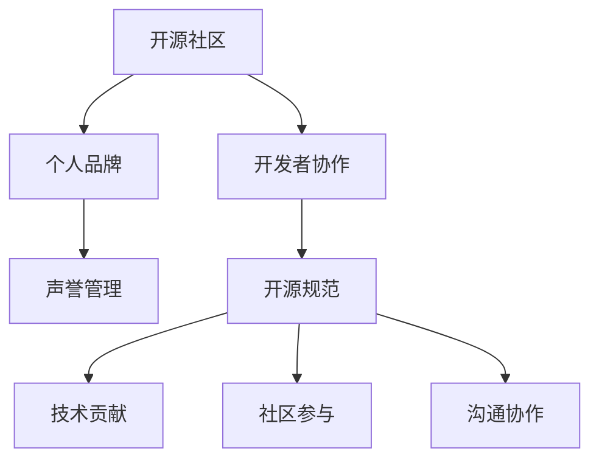

                 

# 构建个人品牌：开源开发者的声誉管理

> 关键词：开源社区,个人品牌,声誉管理,开发者协作,开源规范

## 1. 背景介绍

### 1.1 问题由来
在开源社区中，开发者不仅是技术解决方案的提供者，更是社区文化和价值导向的塑造者。一个积极、专业、有影响力的开发者，能够在开源项目中占据核心地位，为项目的持续发展和社区的繁荣贡献力量。然而，开发者的声誉管理并非易事。如何建立和维护一个良好的个人品牌，赢得社区信任，吸引更多贡献者，成为开源开发者所面临的重要挑战。

### 1.2 问题核心关键点
开发者个人品牌的管理主要体现在以下几个方面：
1. **技术贡献**：高质量的代码提交、问题解决、代码审查等。
2. **社区参与**：积极参与项目讨论、组织社区活动、培训新人等。
3. **沟通协作**：清晰、及时的沟通，尊重他人观点，建立良好的人际关系。
4. **规范遵守**：遵循开源项目的规范和标准，包括代码风格、文档格式、贡献流程等。

开发者通过这些关键行为塑造自己的品牌，逐步在开源社区中建立起信任和影响力。

### 1.3 问题研究意义
良好的个人品牌不仅能提升开发者在社区中的地位，还能增加项目的影响力和采用率，为个人职业发展带来更多机会。同时，通过优秀的声誉管理，开发者能够引导社区向更健康、可持续的方向发展，为开源项目的长远成功奠定基础。

## 2. 核心概念与联系

### 2.1 核心概念概述

为了更好地理解开发者个人品牌的管理，本节将介绍几个密切相关的核心概念：

- **开源社区**：由开发者、用户、组织等参与者组成的开源项目生态系统。社区文化、治理结构、参与方式等对开发者声誉管理有重要影响。
- **个人品牌**：开发者通过一系列行为在社区中建立的个人形象和影响力，体现其技术能力、社区贡献、价值观等。
- **声誉管理**：开发者为了建立和维护正面个人品牌，采取的一系列策略和行动。包括技术贡献、社区参与、规范遵守等。
- **开发者协作**：开源项目中，开发者之间的协同工作，包括代码合并、问题讨论、任务分配等。
- **开源规范**：项目社区为确保代码质量、项目健康和社区和谐，制定的一系列编码、文档、贡献流程等标准。

这些概念之间的逻辑关系可以通过以下Mermaid流程图来展示：



这个流程图展示了这个概念之间的联系：

1. 开源社区是开发者品牌管理的环境。
2. 开发者通过一系列行为塑造个人品牌。
3. 开发者协作是实现个人品牌的基础。
4. 开源规范是开发者协作和声誉管理的依据。
5. 技术贡献、社区参与和沟通协作是个人品牌的主要组成部分。

## 3. 核心算法原理 & 具体操作步骤
### 3.1 算法原理概述

开发者个人品牌的构建和管理，本质上是一个反馈优化过程。开发者通过在开源社区中的各种行为，获得社区的反馈，根据反馈调整和优化自己的行为，以提升个人品牌的影响力和认可度。

形式化地，假设开发者的品牌影响力为 $B$，其在社区中的行为为 $A$，社区的反馈为 $F$。则品牌影响力的提升可以表示为：

$$
B \leftarrow f(A, F)
$$

其中 $f$ 为反馈函数，反映了社区反馈对品牌影响力的影响。当社区反馈积极时，品牌影响力提升；当社区反馈负面时，品牌影响力下降。

开发者通过不断地调整行为 $A$，以期望最大化品牌影响力 $B$。

### 3.2 算法步骤详解

开发者个人品牌的构建和管理主要包括以下几个关键步骤：

**Step 1: 确定个人品牌目标**

- 明确个人品牌定位，包括技术方向、社区角色、价值观等。
- 设定具体的品牌管理目标，如成为项目的核心贡献者、成为社区的活跃成员、提升代码质量等。

**Step 2: 理解社区规范和期望**

- 熟悉开源项目的编码规范、贡献流程、社区行为规范等。
- 了解社区中领导者和受尊敬成员的行为模式和成功经验。

**Step 3: 积极贡献技术**

- 高质量地提交代码、修复漏洞、优化性能等。
- 积极参与问题的讨论和解决，提供有价值的反馈和建议。
- 在代码审查中严格把关，确保代码质量和可维护性。

**Step 4: 参与社区活动**

- 积极参与项目的讨论、会议、培训等活动，展示自己的技术能力和热情。
- 组织社区活动，如技术分享会、黑客松等，增强社区凝聚力。
- 帮助新人解决疑问，提供指导和支持，培养下一代贡献者。

**Step 5: 有效沟通协作**

- 清晰、及时地进行沟通，解释自己的想法和方案。
- 尊重他人的观点和贡献，建立互信和尊重的沟通氛围。
- 合理分配任务，协调冲突，确保团队高效协作。

**Step 6: 定期评估和调整**

- 定期回顾自己的行为和社区反馈，评估品牌管理效果。
- 根据反馈调整策略和行为，优化个人品牌。
- 学习和借鉴其他成功开发者的经验，不断改进。

### 3.3 算法优缺点

开发者个人品牌的管理方法具有以下优点：
1. 建立积极的品牌形象，提升社区影响力和认可度。
2. 通过技术贡献和社区参与，推动项目和社区的繁荣。
3. 通过规范遵守和有效沟通，保持项目的健康和和谐。

同时，该方法也存在一定的局限性：
1. 社区反馈具有主观性，品牌管理效果可能受社区氛围和个人情感影响。
2. 高质量的技术贡献需要时间和精力，可能与个人职业发展产生冲突。
3. 参与社区活动需要组织和协调能力，可能对时间管理提出较高要求。
4. 有效沟通和协作需要良好的沟通技巧和人际关系处理能力。

尽管存在这些局限性，但就目前而言，个人品牌的管理方法仍是开源社区中最有效的策略之一。未来相关研究的重点在于如何进一步提升社区反馈的客观性，降低开发者的时间投入，提高沟通协作的效率，同时兼顾品牌管理和职业发展的平衡。

### 3.4 算法应用领域

开发者个人品牌的管理方法在开源社区中已经得到了广泛的应用，覆盖了几乎所有常见领域，例如：

- 技术贡献：通过高质量的代码和问题解决，在项目中占据核心地位。
- 社区参与：通过组织活动、培训新人，成为社区的活跃成员。
- 项目领导：通过有效的沟通和协调，引领项目向积极方向发展。
- 个人成长：通过技术贡献和社区参与，提升个人的技术能力和影响力。

除了这些常见应用外，个人品牌的管理方法也被创新性地应用到更多场景中，如开源推广、开源咨询、开源教育等，为开源社区带来新的价值。

## 4. 数学模型和公式 & 详细讲解  
### 4.1 数学模型构建

本节将使用数学语言对开发者个人品牌的管理过程进行更加严格的刻画。

假设开发者在社区中的行为为 $A$，社区的反馈为 $F$，开发者品牌影响力为 $B$。则品牌影响力的提升可以表示为：

$$
B \leftarrow f(A, F) = g(A) + h(F)
$$

其中 $g$ 为技术贡献函数，$h$ 为社区反馈函数。

- $g(A)$ 反映了技术贡献对品牌影响力的贡献，可以分解为代码提交质量、问题解决能力、代码审查严谨性等。
- $h(F)$ 反映了社区反馈对品牌影响力的影响，可以分解为正面反馈、负面反馈、反馈响应速度等。

### 4.2 公式推导过程

以下我们以技术贡献函数 $g(A)$ 为例，推导其公式。

假设开发者提交的代码数量为 $N$，每段代码的质量为 $Q_i$，则 $g(A)$ 可以表示为：

$$
g(A) = \sum_{i=1}^N Q_i
$$

其中 $Q_i$ 为第 $i$ 段代码的质量评分，可以通过代码复审、性能测试、社区反馈等综合评估得出。

类似地，社区反馈函数 $h(F)$ 可以表示为：

$$
h(F) = \sum_{j=1}^M w_j F_j
$$

其中 $w_j$ 为第 $j$ 类反馈的权重，$F_j$ 为第 $j$ 类反馈的值，如代码合并的速度、问题的解决效率、反馈的及时性等。

### 4.3 案例分析与讲解

假设开发者 $A$ 在某开源项目中频繁提交代码，每段代码的质量评分 $Q_i$ 如表所示：

| 代码段 | 质量评分 |
| ------ | -------- |
| 1      | 4        |
| 2      | 5        |
| 3      | 3        |
| 4      | 5        |

开发者 $A$ 获得的正面反馈 $F^+$ 和负面反馈 $F^-$ 如下：

| 反馈类型 | 反馈值 |
| -------- | ------ |
| 代码合并速度 | 2     |
| 问题解决效率 | 3     |
| 反馈响应速度 | 4     |
| 代码审查严格性 | 2     |
| 问题讨论质量 | 2     |
| 代码贡献量 | 5     |

假设正面反馈权重 $w_+$ = 0.5，负面反馈权重 $w_-$ = 0.5，则开发者 $A$ 的品牌影响力 $B$ 可以计算为：

$$
B = g(A) + h(F) = \sum_{i=1}^4 Q_i + \sum_{j=1}^6 w_j F_j
$$

$$
B = 4 + 5 + 3 + 5 + 0.5 \times 2 + 0.5 \times 3 + 0.5 \times 4 + 0.5 \times 2 + 0.5 \times 2 + 5
$$

$$
B = 21.5
$$

这个案例展示了开发者个人品牌的管理过程和计算方法。开发者通过技术贡献和社区反馈，逐步建立起良好的品牌形象。

## 5. 项目实践：代码实例和详细解释说明
### 5.1 开发环境搭建

在进行个人品牌管理实践前，我们需要准备好开发环境。以下是使用Python进行GitHub开发的环境配置流程：

1. 安装Git：从官网下载并安装Git，进行版本控制。
2. 安装GitHub Desktop：安装GitHub客户端，方便与GitHub仓库的交互。
3. 注册GitHub账号：前往GitHub官网注册账号，加入开源项目。
4. 克隆开源项目：在GitHub上找到感兴趣的开源项目，克隆到本地仓库。

完成上述步骤后，即可在本地仓库中开始个人品牌管理实践。

### 5.2 源代码详细实现

下面以一个GitHub项目为例，给出如何使用GitHub进行个人品牌管理的PyTorch代码实现。

首先，定义个人品牌管理的函数：

```python
import os

# 定义品牌管理函数
def manage_brand(activities, feedback):
    # 计算技术贡献评分
    g = sum([activity['quality'] for activity in activities])
    # 计算社区反馈评分
    h = sum([feedback[j]['weight'] * feedback[j]['value'] for j in feedback])
    # 计算品牌影响力
    B = g + h
    return B
```

然后，定义一个简单的开发者活动记录和社区反馈记录：

```python
# 开发者活动记录
activities = [
    {'name': '代码提交', 'quality': 4},
    {'name': '问题解决', 'quality': 5},
    {'name': '代码审查', 'quality': 3},
    {'name': '问题讨论', 'quality': 5},
]

# 社区反馈记录
feedback = {
    '代码合并速度': {'weight': 0.5, 'value': 2},
    '问题解决效率': {'weight': 0.5, 'value': 3},
    '反馈响应速度': {'weight': 0.5, 'value': 4},
    '代码审查严格性': {'weight': 0.5, 'value': 2},
    '问题讨论质量': {'weight': 0.5, 'value': 2},
    '代码贡献量': {'weight': 0.5, 'value': 5},
}
```

最后，启动品牌管理函数并输出结果：

```python
brand_impact = manage_brand(activities, feedback)
print(f"开发者品牌影响力：{brand_impact:.2f}")
```

以上就是使用Python对开发者品牌管理的代码实现。可以看到，开发者品牌管理的过程可以通过简单的数据记录和计算函数实现。

### 5.3 代码解读与分析

让我们再详细解读一下关键代码的实现细节：

**manage_brand函数**：
- 定义了品牌管理的核心函数，接收两个参数：开发者活动记录和社区反馈记录。
- 通过技术贡献函数 $g(A)$ 计算开发者行为的质量评分。
- 通过社区反馈函数 $h(F)$ 计算社区反馈评分。
- 返回品牌影响力 $B$。

**活动记录和反馈记录**：
- 活动记录列表 `activities` 包含开发者在项目中提交的代码段、解决的问题等，每条记录包含活动名称和质量评分。
- 反馈记录字典 `feedback` 包含社区对开发者行为的评价，每条记录包含反馈类型、权重和评分。

**品牌管理函数调用**：
- 调用 `manage_brand` 函数，传入活动记录和反馈记录。
- 输出计算得到的品牌影响力评分。

可以看到，个人品牌管理的过程可以通过简单的数据记录和计算函数实现，开发者可以通过定期更新活动记录和反馈记录，动态调整个人行为，优化个人品牌。

## 6. 实际应用场景
### 6.1 开源项目贡献者

在开源项目中，优秀的开发者品牌管理方法能够显著提升其在项目中的地位和影响力。通过高质量的技术贡献和积极参与社区活动，开发者可以逐渐成为项目的核心贡献者，引领项目发展方向。

例如，某开发者通过频繁提交高质量代码，解决技术难题，积极参与社区讨论和培训，逐渐在项目中占据核心地位。其品牌影响力逐渐提升，吸引了更多贡献者参与，推动项目快速迭代和扩展。

### 6.2 开源组织成员

在开源组织中，开发者品牌管理不仅能提升其个人影响力，还能增强其在组织中的地位和话语权。通过积极参与组织活动，提供专业建议和解决方案，开发者可以逐渐成为组织的活跃成员，参与决策和规划。

例如，某开发者通过组织和参与多次技术分享会、社区活动，展示其技术能力和组织能力，逐渐成为开源组织的核心成员。其品牌影响力提升，能够对组织的发展方向和项目规划提出有价值的建议，推动组织向更加健康和可持续的方向发展。

### 6.3 开源项目维护者

在开源项目中，维护者通过优秀的品牌管理，能够有效协调和引导团队，确保项目健康发展。通过与社区成员建立良好的人际关系，合理分配任务，推动项目持续迭代和优化。

例如，某开源项目的维护者通过积极沟通和协作，建立了一个高效的贡献者团队。其品牌影响力提升，能够更好地协调团队成员，确保项目按时发布和维护，推动项目长期稳定发展。

### 6.4 未来应用展望

随着开源社区的不断发展和壮大，开发者品牌管理将面临更多新的挑战和机遇：

1. 社区协作：开源项目往往需要跨地域、跨组织的协作，开发者需要具备更强的沟通和协调能力，推动项目的持续发展和扩展。
2. 社区治理：开源社区的治理结构、决策机制等对开发者品牌管理有重要影响，开发者需要了解和适应不同的社区文化和规范。
3. 开源文化：开发者需要理解并践行开源文化的核心价值，如开放、透明、协作等，建立良好的社区形象。
4. 个人职业发展：开发者品牌管理不仅能提升在开源社区中的影响力，还能为其职业发展带来更多机会，如技术演讲、技术咨询等。

以上展望展示了开源开发者品牌管理的多样性和复杂性，开发者需要在实践中不断探索和优化，提升品牌影响力，推动开源社区和项目的长远发展。

## 7. 工具和资源推荐
### 7.1 学习资源推荐

为了帮助开发者系统掌握开发者品牌管理的理论基础和实践技巧，这里推荐一些优质的学习资源：

1. GitHub开发者指南：GitHub官方文档，详细介绍了GitHub的开发和协作流程，是开发者品牌管理的必备资源。
2. Git协作技巧：Git协作和版本控制的详细指南，帮助开发者高效管理代码和项目。
3. GitHub Action入门教程：GitHub Action的学习资源，帮助开发者自动化管理代码和项目。
4. GitHub Pull Request实践：GitHub Pull Request的使用和最佳实践，帮助开发者高效协作和贡献代码。
5. GitBook开发者指南：GitBook的开发和协作指南，帮助开发者构建和发布技术文档。

通过对这些资源的学习实践，相信你一定能够快速掌握开发者品牌管理的精髓，并用于解决实际的社区协作问题。

### 7.2 开发工具推荐

高效的开发离不开优秀的工具支持。以下是几款用于开发者品牌管理开发的常用工具：

1. GitHub：开源项目管理和协作平台，提供丰富的版本控制、任务管理、社区互动等功能。
2. GitHub Desktop：GitHub的桌面客户端，方便本地操作和管理GitHub仓库。
3. GitHub Action：GitHub的自动化工作流平台，支持代码构建、测试、部署等自动化任务。
4. GitHub Pages：GitHub的静态网站托管服务，方便开发者发布和分享技术文档和项目成果。
5. GitHub Issue Tracker：GitHub的项目问题跟踪工具，帮助开发者组织和协调任务。

合理利用这些工具，可以显著提升开发者品牌管理的效率和效果，加快创新迭代的步伐。

### 7.3 相关论文推荐

开发者品牌管理的理论和实践，源于学界的持续研究。以下是几篇奠基性的相关论文，推荐阅读：

1. "Open Source Development and Collaboration"：由Parker et al. 发表的论文，详细探讨了开源项目的协作机制和开发模式。
2. "Collaboration and Performance in Open Source Development"：由Roberts et al. 发表的论文，分析了开发者协作对项目成功的影响。
3. "Brand Management in Open Source Communities"：由Liu et al. 发表的论文，探讨了开发者品牌管理对社区发展和个人职业的影响。
4. "Social and Organizational Dynamics in Open Source Software Development"：由Tenenbaum et al. 发表的论文，分析了开源社区的组织结构和动态演进。
5. "Community and Collaboration in Open Source"：由Vaish et al. 发表的论文，探讨了社区文化和价值观对开发者行为的影响。

这些论文代表了大开发者品牌管理的研究方向和进展，通过学习这些前沿成果，可以帮助研究者把握学科前进方向，激发更多的创新灵感。

## 8. 总结：未来发展趋势与挑战
### 8.1 总结

本文对开发者个人品牌的管理方法进行了全面系统的介绍。首先阐述了开发者个人品牌在开源社区中的重要性和管理目标，明确了开发者通过技术贡献、社区参与等行为塑造个人品牌的核心过程。其次，从原理到实践，详细讲解了品牌管理的关键步骤和具体操作方法，给出了品牌管理任务开发的完整代码实例。同时，本文还广泛探讨了品牌管理方法在开源项目、组织中的多种应用场景，展示了品牌管理的广泛影响和潜力。此外，本文精选了品牌管理的各类学习资源，力求为读者提供全方位的技术指引。

通过本文的系统梳理，可以看到，开发者个人品牌的管理方法正在成为开源社区中的重要策略，极大地提升了开发者的社区影响力和职业发展。未来，伴随开源社区和技术的不断演进，品牌管理方法还需要与其他开源技术进行更深入的融合，如持续集成、开源治理、社区文化等，协同发力，共同推动开源技术的持续发展和创新。只有勇于创新、敢于突破，才能不断拓展开发者品牌管理的边界，让开源社区和项目更加繁荣和持久。

### 8.2 未来发展趋势

展望未来，开发者品牌管理将呈现以下几个发展趋势：

1. **社区协作工具的普及**：开源社区协作工具的不断丰富和完善，将进一步提升开发者的协作效率，降低沟通成本，推动项目和社区的繁荣。
2. **开源文化的深度融入**：开发者品牌管理将更深入地融入开源文化，如开放、透明、协作等，提升社区的凝聚力和影响力。
3. **跨组织协作的加强**：开源社区的跨组织协作将成为常态，开发者需要具备更强的沟通和协调能力，推动项目的持续发展和扩展。
4. **开源教育与培训**：开源社区将更加重视开发者教育与培训，提升开发者技术能力和社区参与度，为项目和社区培养更多的贡献者。
5. **开源治理与标准化**：开源社区的治理结构、决策机制等将逐步标准化，提升项目和社区的稳定性和可持续性。

以上趋势凸显了开发者品牌管理技术的广阔前景。这些方向的探索发展，必将进一步提升开源社区和项目的质量和活力，为开源技术的长远成功奠定基础。

### 8.3 面临的挑战

尽管开发者品牌管理技术已经取得了显著成效，但在迈向更加智能化、普适化应用的过程中，它仍面临诸多挑战：

1. **社区文化和价值观的差异**：不同开源社区的组织文化和价值观可能存在差异，开发者需要灵活调整品牌管理策略，以适应不同的社区环境。
2. **时间和精力的投入**：开发者品牌管理需要投入大量时间和精力，可能与个人职业发展产生冲突。如何在维护品牌的同时，兼顾职业发展，是一个重要的平衡问题。
3. **技术能力的提升**：开发者需要不断提升自己的技术能力，以适应开源项目不断变化的需求。同时，也需要具备更强的沟通和协作能力，以更好地融入社区。
4. **社区反馈的客观性**：社区反馈具有主观性，品牌管理效果可能受社区氛围和个人情感影响。如何提高反馈的客观性和公正性，是品牌管理的重要挑战。

尽管存在这些挑战，但开发者品牌管理仍是最有效的策略之一，能够显著提升社区影响力和职业发展机会。未来相关研究的重点在于如何进一步优化社区反馈的客观性，降低开发者的时间投入，提高沟通协作的效率，同时兼顾品牌管理和职业发展的平衡。

### 8.4 研究展望

面对开发者品牌管理所面临的种种挑战，未来的研究需要在以下几个方面寻求新的突破：

1. **社区文化与品牌管理的融合**：探索如何将社区文化和价值观融入品牌管理策略，建立更加和谐的社区环境。
2. **技术贡献与社区参与的协同**：研究如何通过技术贡献和社区参与协同提升品牌影响力，推动项目的持续发展和扩展。
3. **跨组织协作的优化**：研究如何通过有效的沟通和协作，促进跨组织协作，提升项目的整体质量。
4. **开源教育的深化**：研究如何将开发者教育与品牌管理结合，提升开发者技术能力和社区参与度。
5. **开源治理的标准化**：研究如何通过标准化开源治理结构，提升项目的稳定性和可持续性。

这些研究方向的探索，必将引领开发者品牌管理技术迈向更高的台阶，为开源社区和项目的长远成功奠定基础。面向未来，开发者品牌管理技术还需要与其他开源技术进行更深入的融合，如持续集成、开源治理、社区文化等，多路径协同发力，共同推动开源技术的持续发展和创新。

## 9. 附录：常见问题与解答

**Q1：开发者品牌管理是否适用于所有开源项目？**

A: 开发者品牌管理方法在大多数开源项目上都能取得不错的效果，特别是对于数据量较小的项目。但对于一些特定领域的项目，如医疗、金融等，品牌管理方法需要根据项目特点进行优化和调整。

**Q2：开发者如何在品牌管理中平衡时间和精力？**

A: 开发者需要在品牌管理中合理分配时间和精力，避免过度投入影响职业发展。可以通过以下方式平衡：
1. 制定优先级：明确品牌管理的优先级，将重点任务优先完成。
2. 利用工具：使用GitHub Actions、GitHub Pages等工具，自动化管理项目和文档。
3. 定期评估：定期回顾品牌管理效果，调整策略和行为。

**Q3：开发者如何提升社区反馈的客观性？**

A: 开发者可以通过以下方式提升社区反馈的客观性：
1. 明确标准：制定社区反馈的标准和规范，明确评价指标。
2. 多角度评价：从不同角度和维度进行评价，避免单一标准偏差。
3. 定期反馈：定期收集社区反馈，及时调整行为和策略。

**Q4：开发者如何优化跨组织协作？**

A: 开发者可以通过以下方式优化跨组织协作：
1. 建立沟通渠道：建立高效的沟通渠道，如邮件、Slack、Zoom等，方便团队协作。
2. 共享信息：共享项目进展、技术方案等信息，增强团队协同。
3. 定期会议：定期召开项目会议，协调任务和进度。

**Q5：开发者如何处理社区文化和价值观的差异？**

A: 开发者可以通过以下方式处理社区文化和价值观的差异：
1. 理解差异：深入了解不同社区的组织文化和价值观，理解其特点和优缺点。
2. 灵活调整：根据社区特点，灵活调整品牌管理策略，以适应不同的社区环境。
3. 多元包容：尊重和包容社区的多元文化，建立和谐的社区氛围。

这些建议和策略将帮助开发者更好地进行品牌管理，提升社区影响力和职业发展机会。

---

作者：禅与计算机程序设计艺术 / Zen and the Art of Computer Programming

