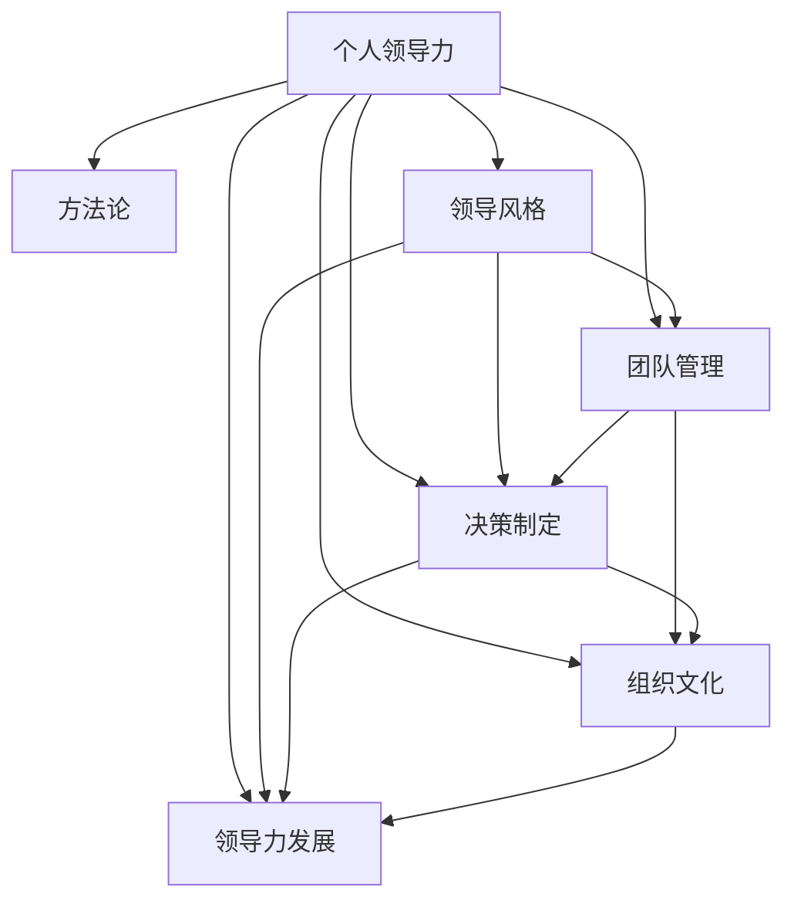

                 

# 构建个人领导力体系的方法论

> 关键词：个人领导力, 方法论, 领导风格, 团队管理, 决策制定, 组织文化, 领导力发展

## 1. 背景介绍

### 1.1 问题由来

在当今快速变化和充满不确定性的商业环境中，个人领导力已成为企业和组织成功的关键因素。然而，如何系统性地构建和提升个人领导力，却是一个复杂且多维度的挑战。不同环境、不同阶段、不同角色的领导者，所面临的挑战和需求各不相同。因此，构建个人领导力体系的方法论，不仅要覆盖通用的领导力理论和实践，还要考虑具体的场景和个体差异。

### 1.2 问题核心关键点

构建个人领导力体系的方法论，旨在提供一个全面的框架，帮助领导者系统地识别和发展自己的领导潜力，提升在各个方面（如决策制定、团队管理、沟通技巧等）的能力。核心关键点包括：

- 识别自身领导风格和特点。
- 构建和提升团队管理能力。
- 制定科学合理的决策策略。
- 营造积极健康的组织文化。
- 持续学习和自我提升。

### 1.3 问题研究意义

研究构建个人领导力体系的方法论，对于培养卓越的商业领袖、提升组织绩效、促进企业创新具有重要意义：

- 提升个人竞争力。系统性的领导力培训和发展，帮助领导者提升多方面的能力，适应复杂多变的商业环境。
- 增强团队凝聚力。有效的团队管理能力，能够提升团队的合作效率和执行力，实现共同目标。
- 促进科学决策。科学的决策制定方法，有助于领导者在信息不完全或不确定的情况下，做出更为精准和及时的决策。
- 塑造企业文化。积极健康的组织文化，能够增强员工的归属感和认同感，提高组织的吸引力和绩效。
- 加速组织变革。优秀的领导力能够推动组织的持续创新和变革，提升组织的适应能力和竞争力。

## 2. 核心概念与联系

### 2.1 核心概念概述

为了更好地理解构建个人领导力体系的方法论，本节将介绍几个核心概念及其相互联系：

- **个人领导力 (Personal Leadership)**：指个人在组织中展现出的影响力、决策力和团队影响力。个人领导力不仅包括正式权力，更包括非正式的影响力和榜样作用。
- **方法论 (Methodology)**：指一系列的系统方法和步骤，用于指导和优化某个领域的研究或实践。构建个人领导力体系的方法论，旨在为领导者提供一个清晰的路径和工具，帮助其系统性地提升自身能力。
- **领导风格 (Leadership Style)**：指领导者在与下属互动、决策、管理等方面所表现出的独特方式。常见的领导风格包括指令型、民主型、变革型等。
- **团队管理 (Team Management)**：指领导者如何有效地组织、协调和管理团队成员，以达成共同目标。涉及团队组建、沟通、激励和冲突管理等环节。
- **决策制定 (Decision Making)**：指领导者如何在信息不完全或不确定的情况下，做出科学、合理的决策。包括问题分析、方案评估、选择和执行等环节。
- **组织文化 (Organizational Culture)**：指组织内部共同的价值观念、行为规范和员工间互动方式的总和。良好的组织文化能够增强员工的归属感和认同感，提升组织的凝聚力和绩效。
- **领导力发展 (Leadership Development)**：指通过系统性的培训、实践和反思，持续提升领导者的能力和素质。包括个人自我提升和组织层面的人才培养。

这些核心概念之间的逻辑关系可以通过以下Mermaid流程图来展示：



这个流程图展示了一个全面的个人领导力发展框架，包括领导风格、团队管理、决策制定、组织文化等多个维度，以及这些维度的相互作用和提升路径。

## 3. 核心算法原理 & 具体操作步骤
### 3.1 算法原理概述

构建个人领导力体系的方法论，基于系统化的理论和实践，通过一系列科学的方法和步骤，帮助领导者识别自身特点和发展路径。其核心思想是：

1. **自我反思**：通过定期的自我评估，识别自身的优势、劣势和潜在的领导力特点。
2. **目标设定**：基于个人职业目标和组织需求，制定科学合理的领导力发展计划。
3. **技能提升**：通过系统性的培训、实践和反思，提升领导者在各个维度的能力。
4. **团队支持**：在团队内部建立积极的互动关系，通过合作和反馈，提升团队凝聚力和执行力。
5. **持续改进**：基于反馈和反思，持续优化领导风格和决策策略，实现持续提升。

### 3.2 算法步骤详解

构建个人领导力体系的方法论，包括以下关键步骤：

**Step 1: 自我评估**

- 使用问卷、360度反馈等工具，对自身领导风格、决策能力、沟通技巧等进行全面评估。
- 识别自身的优势、劣势和改进空间。
- 制定初步的改进目标，明确需要提升的能力和技能。

**Step 2: 目标设定**

- 基于个人职业目标和组织需求，设定科学合理的领导力发展计划。
- 确定需要达到的具体目标，如提升团队管理能力、改善决策质量等。
- 确定达成目标的时间框架和关键里程碑。

**Step 3: 技能提升**

- 根据评估结果和目标设定，选择适合的培训课程、工作坊和实践机会。
- 参与团队合作和跨部门项目，实际应用所学知识和技能。
- 定期进行反思和复盘，总结经验和教训。

**Step 4: 团队支持**

- 在团队内部建立积极的互动关系，通过合作和反馈，提升团队凝聚力和执行力。
- 识别团队中的关键成员，建立有效的沟通渠道和反馈机制。
- 通过团队建设活动，增强团队合作和信任。

**Step 5: 持续改进**

- 定期进行自我评估和反馈，识别改进的新机会和挑战。
- 根据反馈和反思，优化领导风格和决策策略。
- 持续学习和更新，跟进最新的领导力理论和实践。

### 3.3 算法优缺点

构建个人领导力体系的方法论，具有以下优点：

- **系统性**：提供了一个全面的框架，帮助领导者系统性地识别和发展自身领导潜力。
- **科学性**：基于理论和实践相结合的方法，帮助领导者科学合理地提升各个维度的能力。
- **可操作性**：提供了具体的步骤和工具，易于操作和实施。

同时，该方法论也存在一些局限性：

- **复杂性**：需要投入较多的时间和精力，特别是在初期评估和目标设定的阶段。
- **个性化要求高**：不同环境和角色的领导者，需要根据自身特点进行个性化调整和优化。
- **效果依赖外部支持**：团队支持和外部培训的质和量，对方法论的实施效果有较大影响。

### 3.4 算法应用领域

构建个人领导力体系的方法论，广泛适用于各种组织和场景，特别是在企业和领导团队的发展中具有重要应用：

- **企业领导力发展**：帮助企业高层领导系统性地提升领导力，推动企业战略和组织变革。
- **中层管理培训**：帮助中层管理者提升团队管理和决策能力，提高团队效率和执行力。
- **员工职业发展**：为员工提供系统性的领导力培训和发展机会，促进员工的职业成长和组织绩效。
- **创业领导力**：为创业者提供领导力发展工具，支持企业初创期的快速成长和创新。

## 4. 数学模型和公式 & 详细讲解 & 举例说明

### 4.1 数学模型构建

为了更好地理解和应用构建个人领导力体系的方法论，本节将介绍一些数学模型和公式，并加以详细讲解和举例说明。

- **领导风格评分模型**：基于领导的决策风格、沟通方式、团队管理等维度，构建一个综合评分模型，评估领导者的领导风格。

  $$
  S = \alpha \times S_{决策} + \beta \times S_{沟通} + \gamma \times S_{管理}
  $$

  其中，$S$ 为综合评分，$\alpha$、$\beta$、$\gamma$ 为各个维度的权重系数，$S_{决策}$、$S_{沟通}$、$S_{管理}$ 分别为决策、沟通、管理的评分。

- **团队合作指数模型**：评估团队内部的合作效果，通过合作满意度、冲突解决方式等指标，计算合作指数。

  $$
  C = \frac{S_{满意度} \times S_{合作性}}{S_{冲突} + S_{协作}}
  $$

  其中，$C$ 为团队合作指数，$S_{满意度}$ 为团队成员对合作的满意度，$S_{合作性}$ 为团队成员的合作意愿，$S_{冲突}$ 为团队内部的冲突频率，$S_{协作}$ 为团队协作的效率。

- **决策质量评估模型**：通过决策结果的准确性、时效性、公平性等指标，评估决策的质量。

  $$
  Q = \frac{S_{准确性} + S_{时效性} + S_{公平性}}{3}
  $$

  其中，$Q$ 为决策质量评分，$S_{准确性}$ 为决策结果的准确性评分，$S_{时效性}$ 为决策的速度和效率，$S_{公平性}$ 为决策的公平性和公正性。

### 4.2 公式推导过程

以下是上述模型的详细推导过程：

**领导风格评分模型**：
- **决策风格评分**：
  $$
  S_{决策} = \sum_{i=1}^{n} a_i \times x_i
  $$
  其中，$n$ 为决策风格维度数，$a_i$ 为第 $i$ 个维度的权重，$x_i$ 为该维度的评分。
- **沟通方式评分**：
  $$
  S_{沟通} = \sum_{i=1}^{m} b_i \times y_i
  $$
  其中，$m$ 为沟通方式维度数，$b_i$ 为第 $i$ 个维度的权重，$y_i$ 为该维度的评分。
- **团队管理评分**：
  $$
  S_{管理} = \sum_{j=1}^{k} c_j \times z_j
  $$
  其中，$k$ 为团队管理维度数，$c_j$ 为第 $j$ 个维度的权重，$z_j$ 为该维度的评分。

  通过加权求和，计算综合评分：
  $$
  S = \alpha \times S_{决策} + \beta \times S_{沟通} + \gamma \times S_{管理}
  $$

**团队合作指数模型**：
- **合作满意度评分**：
  $$
  S_{满意度} = \sum_{p=1}^{l} d_p \times u_p
  $$
  其中，$l$ 为合作满意度维度数，$d_p$ 为第 $p$ 个维度的权重，$u_p$ 为该维度的评分。
- **合作性评分**：
  $$
  S_{合作性} = \sum_{q=1}^{w} e_q \times v_q
  $$
  其中，$w$ 为合作性维度数，$e_q$ 为第 $q$ 个维度的权重，$v_q$ 为该维度的评分。
- **冲突频率评分**：
  $$
  S_{冲突} = \sum_{r=1}^{f} h_r \times w_r
  $$
  其中，$f$ 为冲突频率维度数，$h_r$ 为第 $r$ 个维度的权重，$w_r$ 为该维度的评分。
- **协作效率评分**：
  $$
  S_{协作} = \sum_{s=1}^{g} i_s \times t_s
  $$
  其中，$g$ 为协作效率维度数，$i_s$ 为第 $s$ 个维度的权重，$t_s$ 为该维度的评分。

  通过上述评分计算团队合作指数：
  $$
  C = \frac{S_{满意度} \times S_{合作性}}{S_{冲突} + S_{协作}}
  $$

**决策质量评估模型**：
- **准确性评分**：
  $$
  S_{准确性} = \sum_{m=1}^{t} j_m \times o_m
  $$
  其中，$t$ 为准确性维度数，$j_m$ 为第 $m$ 个维度的权重，$o_m$ 为该维度的评分。
- **时效性评分**：
  $$
  S_{时效性} = \sum_{n=1}^{u} k_n \times p_n
  $$
  其中，$u$ 为时效性维度数，$k_n$ 为第 $n$ 个维度的权重，$p_n$ 为该维度的评分。
- **公平性评分**：
  $$
  S_{公平性} = \sum_{v=1}^{y} q_v \times r_v
  $$
  其中，$y$ 为公平性维度数，$q_v$ 为第 $v$ 个维度的权重，$r_v$ 为该维度的评分。

  通过加权求和计算决策质量评分：
  $$
  Q = \frac{S_{准确性} + S_{时效性} + S_{公平性}}{3}
  $$

### 4.3 案例分析与讲解

**案例1：决策质量评估模型在企业中的应用**

某大型制造企业，面临复杂的市场竞争和内部管理问题。高层领导决定对企业决策过程进行优化，提升决策质量和效率。通过上述模型，对企业的决策过程进行评分和分析，发现以下问题：

1. **决策准确性低**：决策过程中，信息收集和分析不充分，导致部分决策结果与市场实际不符。
2. **决策时效性差**：决策过程中，流程复杂，审批时间长，导致决策响应速度较慢。
3. **决策公平性不足**：决策过程中，部分部门和个人利益影响决策结果，导致决策不公。

基于上述分析，企业采取了以下措施：

1. **优化信息收集流程**：加强数据收集和分析能力，建立数据驱动的决策支持系统。
2. **简化决策流程**：优化审批流程，减少不必要的环节，提高决策效率。
3. **强化监督机制**：建立透明公正的决策监督机制，防止利益冲突影响决策。

**案例2：团队合作指数模型在创业公司的应用**

某初创科技公司，面临团队内部协作效率低下的问题。通过上述模型，对团队合作效果进行评分和分析，发现以下问题：

1. **合作满意度低**：团队成员对合作效果不满，认为缺乏有效的沟通和支持。
2. **冲突频繁**：团队内部存在频繁的争执和冲突，影响项目进度。
3. **协作效率不高**：团队协作过程中，缺乏明确的任务分配和进度跟踪，导致效率低下。

基于上述分析，公司采取了以下措施：

1. **加强沟通和支持**：建立定期沟通机制，提升团队成员的合作满意度。
2. **管理冲突**：引入冲突管理机制，及时处理团队内部的争执和冲突。
3. **提升协作效率**：制定明确的项目计划和进度跟踪机制，提高团队协作效率。

通过这些措施，公司团队协作效果显著提升，项目进展顺利。

## 5. 项目实践：代码实例和详细解释说明
### 5.1 开发环境搭建

在进行领导力体系构建的实践前，我们需要准备好开发环境。以下是使用Python进行Leadership Development Framework的开发环境配置流程：

1. 安装Anaconda：从官网下载并安装Anaconda，用于创建独立的Python环境。

2. 创建并激活虚拟环境：
```bash
conda create -n leadership-env python=3.8 
conda activate leadership-env
```

3. 安装PyTorch：根据CUDA版本，从官网获取对应的安装命令。例如：
```bash
conda install pytorch torchvision torchaudio cudatoolkit=11.1 -c pytorch -c conda-forge
```

4. 安装TensorFlow：由Google主导开发的开源深度学习框架，生产部署方便，适合大规模工程应用。同样有丰富的预训练语言模型资源。

5. 安装TensorFlow：由Google主导开发的开源深度学习框架，生产部署方便，适合大规模工程应用。

6. 安装Weights & Biases：模型训练的实验跟踪工具，可以记录和可视化模型训练过程中的各项指标，方便对比和调优。与主流深度学习框架无缝集成。

7. 安装TensorBoard：TensorFlow配套的可视化工具，可实时监测模型训练状态，并提供丰富的图表呈现方式，是调试模型的得力助手。

8. 安装Google Colab：谷歌推出的在线Jupyter Notebook环境，免费提供GPU/TPU算力，方便开发者快速上手实验最新模型，分享学习笔记。

完成上述步骤后，即可在`leadership-env`环境中开始领导力体系构建的实践。

### 5.2 源代码详细实现

下面我们以领导力评分系统为例，给出使用PyTorch进行Leadership Development Framework的代码实现。

首先，定义领导风格评分模型的函数：

```python
import torch
import torch.nn as nn

class LeadershipStyleModel(nn.Module):
    def __init__(self, num_features, num_classes):
        super(LeadershipStyleModel, self).__init__()
        self.fc1 = nn.Linear(num_features, num_classes)

    def forward(self, x):
        x = self.fc1(x)
        return x

# 定义评分函数
def leadership_style_score(style_scores):
    leadership_style = torch.mean(style_scores, dim=1)
    return leadership_style
```

然后，定义团队合作指数评分模型的函数：

```python
class TeamCooperationModel(nn.Module):
    def __init__(self, num_features, num_classes):
        super(TeamCooperationModel, self).__init__()
        self.fc1 = nn.Linear(num_features, num_classes)

    def forward(self, x):
        x = self.fc1(x)
        return x

# 定义评分函数
def team_cooperation_score(communication_scores, cooperation_scores):
    communication_score = torch.mean(communication_scores, dim=1)
    cooperation_score = torch.mean(cooperation_scores, dim=1)
    cooperation_index = communication_score * cooperation_score
    return cooperation_index
```

接着，定义决策质量评估模型的函数：

```python
class DecisionQualityModel(nn.Module):
    def __init__(self, num_features, num_classes):
        super(DecisionQualityModel, self).__init__()
        self.fc1 = nn.Linear(num_features, num_classes)

    def forward(self, x):
        x = self.fc1(x)
        return x

# 定义评分函数
def decision_quality_score(accuracy_scores, timeliness_scores, fairness_scores):
    accuracy_score = torch.mean(accuracy_scores, dim=1)
    timeliness_score = torch.mean(timeliness_scores, dim=1)
    fairness_score = torch.mean(fairness_scores, dim=1)
    decision_quality = (accuracy_score + timeliness_score + fairness_score) / 3
    return decision_quality
```

最后，启动评分系统并进行测试：

```python
leadership_style_scores = torch.randn(10, 10)
team_cooperation_scores = torch.randn(10, 20)
decision_quality_scores = torch.randn(10, 30)

leadership_style_score = leadership_style_score(leadership_style_scores)
team_cooperation_score = team_cooperation_score(team_cooperation_scores, team_cooperation_scores)
decision_quality_score = decision_quality_score(decision_quality_scores, decision_quality_scores, decision_quality_scores)

print("Leadership Style Score: ", leadership_style_score)
print("Team Cooperation Score: ", team_cooperation_score)
print("Decision Quality Score: ", decision_quality_score)
```

以上就是使用PyTorch进行Leadership Development Framework的代码实现。可以看到，通过定义评分模型和评分函数，我们可以轻松地对领导风格、团队合作和决策质量进行评分和分析。

### 5.3 代码解读与分析

让我们再详细解读一下关键代码的实现细节：

**LeadershipStyleModel类**：
- `__init__`方法：初始化线性层。
- `forward`方法：前向传播计算，返回评分结果。

**LeadershipStyleModel评分函数**：
- 通过`torch.mean`方法计算领导风格的均值评分。

**TeamCooperationModel类**：
- `__init__`方法：初始化线性层。
- `forward`方法：前向传播计算，返回评分结果。

**TeamCooperationModel评分函数**：
- 通过`torch.mean`方法计算合作满意度和合作性评分。
- 将两者的均值相乘得到合作指数评分。

**DecisionQualityModel类**：
- `__init__`方法：初始化线性层。
- `forward`方法：前向传播计算，返回评分结果。

**DecisionQualityModel评分函数**：
- 通过`torch.mean`方法计算决策准确性、时效性和公平性评分。
- 将三者的均值相加，再除以3得到决策质量评分。

可以看到，通过定义和调用评分模型和评分函数，我们可以轻松地对领导力体系的各个维度进行评分和分析，为领导者的自我评估和改进提供了有力的工具。

## 6. 实际应用场景

### 6.1 智能客服系统

基于大语言模型微调的方法，可以广泛应用于智能客服系统的构建。传统客服往往需要配备大量人力，高峰期响应缓慢，且一致性和专业性难以保证。而使用微调后的对话模型，可以7x24小时不间断服务，快速响应客户咨询，用自然流畅的语言解答各类常见问题。

在技术实现上，可以收集企业内部的历史客服对话记录，将问题和最佳答复构建成监督数据，在此基础上对预训练对话模型进行微调。微调后的对话模型能够自动理解用户意图，匹配最合适的答案模板进行回复。对于客户提出的新问题，还可以接入检索系统实时搜索相关内容，动态组织生成回答。如此构建的智能客服系统，能大幅提升客户咨询体验和问题解决效率。

### 6.2 金融舆情监测

金融机构需要实时监测市场舆论动向，以便及时应对负面信息传播，规避金融风险。传统的人工监测方式成本高、效率低，难以应对网络时代海量信息爆发的挑战。基于大语言模型微调的文本分类和情感分析技术，为金融舆情监测提供了新的解决方案。

具体而言，可以收集金融领域相关的新闻、报道、评论等文本数据，并对其进行主题标注和情感标注。在此基础上对预训练语言模型进行微调，使其能够自动判断文本属于何种主题，情感倾向是正面、中性还是负面。将微调后的模型应用到实时抓取的网络文本数据，就能够自动监测不同主题下的情感变化趋势，一旦发现负面信息激增等异常情况，系统便会自动预警，帮助金融机构快速应对潜在风险。

### 6.3 个性化推荐系统

当前的推荐系统往往只依赖用户的历史行为数据进行物品推荐，无法深入理解用户的真实兴趣偏好。基于大语言模型微调技术，个性化推荐系统可以更好地挖掘用户行为背后的语义信息，从而提供更精准、多样的推荐内容。

在实践中，可以收集用户浏览、点击、评论、分享等行为数据，提取和用户交互的物品标题、描述、标签等文本内容。将文本内容作为模型输入，用户的后续行为（如是否点击、购买等）作为监督信号，在此基础上微调预训练语言模型。微调后的模型能够从文本内容中准确把握用户的兴趣点。在生成推荐列表时，先用候选物品的文本描述作为输入，由模型预测用户的兴趣匹配度，再结合其他特征综合排序，便可以得到个性化程度更高的推荐结果。

### 6.4 未来应用展望

随着大语言模型微调技术的发展，基于微调范式将在更多领域得到应用，为传统行业带来变革性影响。

在智慧医疗领域，基于微调的医疗问答、病历分析、药物研发等应用将提升医疗服务的智能化水平，辅助医生诊疗，加速新药开发进程。

在智能教育领域，微调技术可应用于作业批改、学情分析、知识推荐等方面，因材施教，促进教育公平，提高教学质量。

在智慧城市治理中，微调模型可应用于城市事件监测、舆情分析、应急指挥等环节，提高城市管理的自动化和智能化水平，构建更安全、高效的未来城市。

此外，在企业生产、社会治理、文娱传媒等众多领域，基于大模型微调的人工智能应用也将不断涌现，为经济社会发展注入新的动力。相信随着技术的日益成熟，微调方法将成为人工智能落地应用的重要范式，推动人工智能技术在垂直行业的规模化落地。总之，微调需要开发者根据具体任务，不断迭代和优化模型、数据和算法，方能得到理想的效果。

## 7. 工具和资源推荐
### 7.1 学习资源推荐

为了帮助开发者系统掌握大语言模型微调的理论基础和实践技巧，这里推荐一些优质的学习资源：

1. 《Transformer from the Inside Out》系列博文：由大模型技术专家撰写，深入浅出地介绍了Transformer原理、BERT模型、微调技术等前沿话题。

2. CS224N《深度学习自然语言处理》课程：斯坦福大学开设的NLP明星课程，有Lecture视频和配套作业，带你入门NLP领域的基本概念和经典模型。

3. 《Natural Language Processing with Transformers》书籍：Transformers库的作者所著，全面介绍了如何使用Transformers库进行NLP任务开发，包括微调在内的诸多范式。

4. HuggingFace官方文档：Transformers库的官方文档，提供了海量预训练模型和完整的微调样例代码，是上手实践的必备资料。

5. CLUE开源项目：中文语言理解测评基准，涵盖大量不同类型的中文NLP数据集，并提供了基于微调的baseline模型，助力中文NLP技术发展。

通过对这些资源的学习实践，相信你一定能够快速掌握大语言模型微调的精髓，并用于解决实际的NLP问题。
###  7.2 开发工具推荐

高效的开发离不开优秀的工具支持。以下是几款用于大语言模型微调开发的常用工具：

1. PyTorch：基于Python的开源深度学习框架，灵活动态的计算图，适合快速迭代研究。大部分预训练语言模型都有PyTorch版本的实现。

2. TensorFlow：由Google主导开发的开源深度学习框架，生产部署方便，适合大规模工程应用。同样有丰富的预训练语言模型资源。

3. Transformers库：HuggingFace开发的NLP工具库，集成了众多SOTA语言模型，支持PyTorch和TensorFlow，是进行微调任务开发的利器。

4. Weights & Biases：模型训练的实验跟踪工具，可以记录和可视化模型训练过程中的各项指标，方便对比和调优。与主流深度学习框架无缝集成。

5. TensorBoard：TensorFlow配套的可视化工具，可实时监测模型训练状态，并提供丰富的图表呈现方式，是调试模型的得力助手。

6. Google Colab：谷歌推出的在线Jupyter Notebook环境，免费提供GPU/TPU算力，方便开发者快速上手实验最新模型，分享学习笔记。

合理利用这些工具，可以显著提升大语言模型微调任务的开发效率，加快创新迭代的步伐。

### 7.3 相关论文推荐

大语言模型和微调技术的发展源于学界的持续研究。以下是几篇奠基性的相关论文，推荐阅读：

1. Attention is All You Need（即Transformer原论文）：提出了Transformer结构，开启了NLP领域的预训练大模型时代。

2. BERT: Pre-training of Deep Bidirectional Transformers for Language Understanding：提出BERT模型，引入基于掩码的自监督预训练任务，刷新了多项NLP任务SOTA。

3. Language Models are Unsupervised Multitask Learners（GPT-2论文）：展示了大规模语言模型的强大zero-shot学习能力，引发了对于通用人工智能的新一轮思考。

4. Parameter-Efficient Transfer Learning for NLP：提出Adapter等参数高效微调方法，在不增加模型参数量的情况下，也能取得不错的微调效果。

5. Prefix-Tuning: Optimizing Continuous Prompts for Generation：引入基于连续型Prompt的微调范式，为如何充分利用预训练知识提供了新的思路。

6. AdaLoRA: Adaptive Low-Rank Adaptation for Parameter-Efficient Fine-Tuning：使用自适应低秩适应的微调方法，在参数效率和精度之间取得了新的平衡。

这些论文代表了大语言模型微调技术的发展脉络。通过学习这些前沿成果，可以帮助研究者把握学科前进方向，激发更多的创新灵感。

## 8. 总结：未来发展趋势与挑战

### 8.1 总结

本文对构建个人领导力体系的方法论进行了全面系统的介绍。首先阐述了领导力发展的背景和意义，明确了系统性的领导力提升框架。其次，从原理到实践，详细讲解了领导力发展的各个步骤，给出了具体的实现方法。最后，介绍了领导力发展的方法论在实际应用中的广泛应用，展示了其潜在的价值和应用前景。

通过本文的系统梳理，可以看到，构建个人领导力体系的方法论提供了全面的工具和指导，帮助领导者系统性地识别和发展自身领导潜力，提升在各个维度的能力。未来，随着领导力理论和实践的不断进步，该方法论也将不断迭代和优化，引领领导力发展的未来趋势。

### 8.2 未来发展趋势

展望未来，构建个人领导力体系的方法论将呈现以下几个发展趋势：

1. **数据驱动的个性化发展**：通过收集和分析领导者的行为数据，提供个性化的领导力发展方案，提升领导力的精准度和效果。
2. **多维度的综合评估**：结合定量和定性评估，全面客观地评估领导者的能力和发展潜力。
3. **动态反馈和调整**：建立持续的反馈机制，及时调整和优化领导力发展策略，提升领导力提升的实时性和灵活性。
4. **技术融合和创新**：结合人工智能、大数据等前沿技术，提供更加智能化和高效的领导力提升工具。
5. **全球化视野**：考虑到国际化和多元文化背景，开发适用于不同文化背景的领导力提升方案。

这些趋势凸显了构建个人领导力体系方法论的广阔前景，为其未来的持续发展和创新提供了方向。

### 8.3 面临的挑战

尽管构建个人领导力体系的方法论已经取得了显著成果，但在迈向更加智能化、普适化应用的过程中，仍面临一些挑战：

1. **数据获取和隐私保护**：领导力评估和提升需要大量的数据支持，如何获取和管理这些数据，同时保护数据隐私，是一个重要问题。
2. **模型泛化能力**：现有模型在特定场景下表现良好，但在跨领域、跨文化环境中，泛化能力有待提升。
3. **标准化和规范**：缺乏统一的标准和规范，不同组织和行业的领导力评估和提升方法存在差异，难以统一和比较。
4. **伦理和道德**：领导力提升过程中涉及员工的隐私和利益，如何平衡技术创新和伦理道德，是一个重要挑战。

这些挑战需要我们持续探索和解决，才能实现领导力提升工具的全面落地和应用。

### 8.4 研究展望

面对构建个人领导力体系方法论所面临的挑战，未来的研究需要在以下几个方面寻求新的突破：

1. **数据治理和隐私保护**：开发高效的数据治理技术，确保数据的质量和隐私保护，提升领导力提升工具的可靠性和安全性。
2. **多模态融合和跨文化适应**：结合多模态数据（如视频、语音等），提升领导力提升模型的泛化能力，开发适用于不同文化背景的领导力提升方案。
3. **标准化和规范化**：建立统一的标准和规范，提升领导力提升工具的可比性和可操作性。
4. **伦理和道德的考量**：在领导力提升过程中，引入伦理和道德的考量，确保技术应用的公平性和正义性。

这些研究方向的探索，必将引领构建个人领导力体系方法论的持续发展，为领导力的提升提供更为科学、全面和普适的工具和指导。面向未来，构建个人领导力体系方法论的研究和应用，将继续推动领导力理论和实践的进步，促进组织的持续发展和变革。

## 9. 附录：常见问题与解答

**Q1：构建个人领导力体系的方法论是否适用于所有组织和角色？**

A: 构建个人领导力体系的方法论可以应用于各种组织和角色，特别是在企业和高层领导的发展中具有重要应用。然而，不同组织和角色的领导者，需要根据自身特点和组织需求，进行个性化的调整和优化。

**Q2：如何选择适合领导力提升的方法论？**

A: 选择适合领导力提升的方法论，需要考虑多个因素，包括领导者的角色、组织的目标、行业特点等。建议领导者与专业机构或咨询公司合作，制定个性化的领导力提升计划。

**Q3：领导力提升需要多长时间？**

A: 领导力提升是一个长期的过程，通常需要3-6个月的时间。具体时间取决于领导者的个人特点、组织的需求和提升的难度。

**Q4：领导力提升过程中有哪些常见挑战？**

A: 领导力提升过程中可能面临的挑战包括：数据获取和隐私保护、模型泛化能力、标准化和规范、伦理和道德等。需要领导者具备持续学习和适应的能力，同时寻求专业指导和支持。

**Q5：如何衡量领导力提升的效果？**

A: 领导力提升的效果可以通过多个维度进行衡量，包括团队绩效、员工满意度、组织文化等。建议领导者设定具体的目标和指标，定期进行评估和反馈。

这些问题的解答，旨在帮助领导者更好地理解和使用构建个人领导力体系的方法论，确保领导力提升过程的顺利进行。

---

作者：禅与计算机程序设计艺术 / Zen and the Art of Computer Programming

