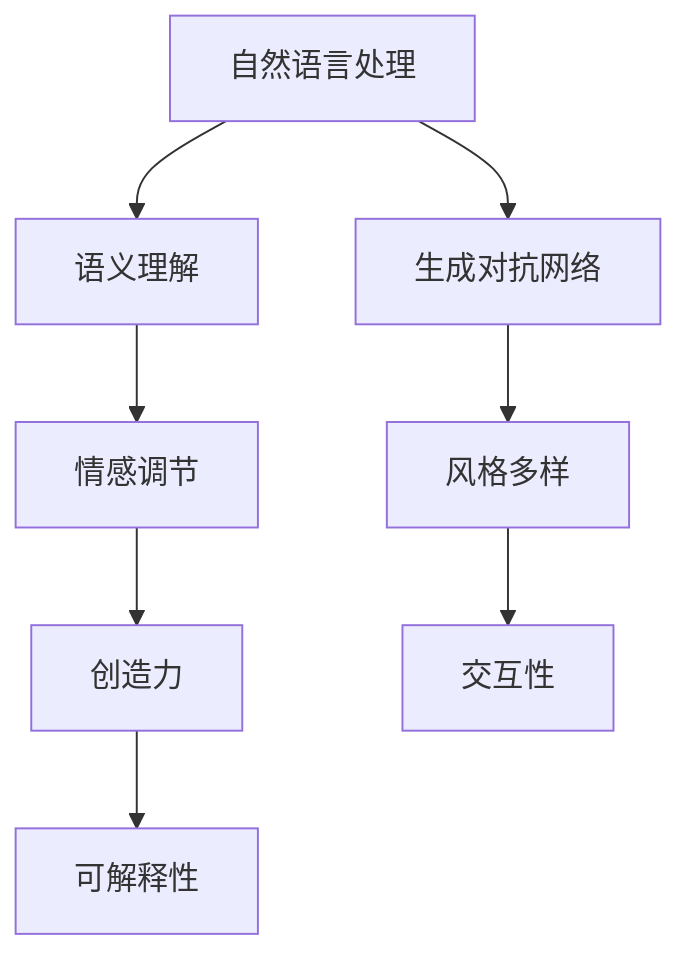

                 

# 构建讲故事的人工智能：课程概述

## 1. 背景介绍

### 1.1 问题由来

讲故事是人类文明的核心组成部分，传递智慧、情感和经验的重要方式。随着人工智能技术的发展，人们开始尝试让机器具备讲故事的能力，即利用机器生成自然流畅、连贯完整的故事。这不仅是一项令人兴奋的技术挑战，也是推动人工智能技术向更高层次发展的关键一步。

### 1.2 问题核心关键点

讲故事的人工智能涉及多领域的交叉，包括自然语言处理、机器学习、生成对抗网络、数据挖掘等。其核心关键点包括：

1. **语义理解**：机器需要理解故事中的情节、人物、情感等要素。
2. **语义生成**：机器需要根据理解生成连贯、真实的故事。
3. **情感调节**：机器需要调节故事中的情感氛围，以适应不同的听众。
4. **风格多样**：机器需要生成不同风格的故事，如幽默、悬疑、浪漫等。
5. **创造力**：机器需要具备一定的创造力，产生新的情节和人物。
6. **交互性**：机器需要与用户进行交互，根据用户的反馈调整故事。

### 1.3 问题研究意义

构建讲故事的人工智能具有重要意义：

1. **提升用户体验**：在教育、娱乐、客服等领域，故事化的沟通方式能够提升用户的体验和满意度。
2. **丰富内容生产**：自动生成故事可以极大地丰富内容生产，降低创作门槛，加速文化娱乐产业的创新。
3. **辅助创作**：故事生成技术可以作为人类创作者的辅助工具，提供灵感和建议。
4. **推动跨领域研究**：讲故事技术涉及到语言学、心理学、社会学等多个学科，有助于跨学科的协同创新。
5. **社会价值**：故事化的人工智能可以用于公共服务、文化传承等领域，推动社会进步。

## 2. 核心概念与联系

### 2.1 核心概念概述

在构建讲故事的人工智能过程中，涉及以下几个核心概念：

- **自然语言处理(Natural Language Processing, NLP)**：使计算机能够理解和生成自然语言，包括分词、词性标注、句法分析、语义理解、生成等。
- **生成对抗网络(Generative Adversarial Networks, GANs)**：通过两个神经网络相互博弈，生成高质量的文本、图像、音频等内容。
- **情感计算**：分析和生成故事中的情感元素，使故事更具感染力。
- **跨领域知识**：整合不同领域的知识，如文学、心理学、社会学等，提升故事的质量和多样性。
- **可解释性**：保证故事生成的可解释性，使结果易于理解。
- **用户交互**：设计友好的用户界面，支持用户与故事的互动。

这些概念之间的逻辑关系可以通过以下Mermaid流程图来展示：



这个流程图展示了大语言模型构建故事的基本步骤和核心概念。

## 3. 核心算法原理 & 具体操作步骤
### 3.1 算法原理概述

讲故事的人工智能通常分为两个阶段：预训练和微调。

预训练阶段，使用大规模无标签文本数据对模型进行预训练，学习语言的基本结构和语法规则。常用的预训练方法包括自回归语言模型、掩码语言模型等。

微调阶段，在特定领域或特定任务的数据集上，通过有监督学习优化模型，使其能够生成符合要求的故事。微调通常使用交叉熵损失函数，以衡量生成故事与真实故事之间的差异。

### 3.2 算法步骤详解

#### 3.2.1 数据准备

- 收集大规模的文本数据集，如书籍、电影脚本、新闻文章等。
- 进行数据预处理，包括分词、去停用词、标准化等。
- 将数据集划分为训练集、验证集和测试集。

#### 3.2.2 模型选择与初始化

- 选择预训练语言模型，如GPT、BERT等。
- 使用预训练模型初始化参数，进行微调。

#### 3.2.3 模型微调

- 设计任务适配层，如分类头、解码器等，用于生成故事。
- 选择优化算法，如Adam、SGD等，设置学习率、批大小等超参数。
- 在训练集上训练模型，优化损失函数。
- 在验证集上评估模型性能，避免过拟合。
- 在测试集上最终评估模型性能，输出故事。

#### 3.2.4 故事生成与评估

- 利用微调后的模型生成故事。
- 使用自动化工具或人工评估生成故事的质量、连贯性、多样性等。
- 根据评估结果，调整模型参数或训练策略。

### 3.3 算法优缺点

讲故事的人工智能的优点包括：

1. **高效性**：大规模数据预训练和微调，可以快速生成高质量的故事。
2. **多样性**：模型可以生成各种风格、题材的故事，满足不同听众的需求。
3. **可解释性**：通过控制模型参数，可以调整故事的情感、风格等特性。
4. **互动性**：支持用户与故事的互动，根据用户反馈调整故事内容。

缺点包括：

1. **数据依赖**：高质量的预训练和微调数据是关键，获取这些数据成本较高。
2. **模型复杂性**：大规模模型训练和微调复杂，需要高性能计算资源。
3. **情感调节难度**：准确把握情感元素，调整情感氛围仍是一个难题。
4. **创造力不足**：机器生成的故事可能缺乏创新性和独特性。
5. **可解释性**：模型黑箱性质导致其输出难以解释。
6. **道德风险**：生成的故事可能包含不适当内容，需注意伦理道德。

### 3.4 算法应用领域

讲故事的人工智能已经在多个领域得到应用：

- **教育**：通过故事化的教学内容，提升学生的学习兴趣和理解能力。
- **娱乐**：生成电影剧本、小说、游戏剧情等，丰富文化娱乐内容。
- **客服**：通过故事化的客服对话，提升用户的满意度和体验。
- **文化传承**：利用故事生成技术，挖掘和传承传统文化。
- **心理辅导**：生成心理故事，辅助心理健康咨询和治疗。

## 4. 数学模型和公式 & 详细讲解 & 举例说明

### 4.1 数学模型构建

讲故事的人工智能的数学模型主要包括以下部分：

1. **自回归语言模型**：
   $$
   P(w_t|w_1, ..., w_{t-1}) = \frac{e^{z_{t-1}}}{\sum_{w_{t-1}} e^{z_{t-1}}}
   $$
   其中 $z_{t-1}$ 是模型对 $w_t$ 的条件概率的计算结果。

2. **掩码语言模型**：
   $$
   P(w_t|w_1, ..., w_{t-1}, \tilde{w}_{t+1}, ..., \tilde{w}_n) = \frac{e^{z_{t-1}}}{\sum_{w_{t-1}} e^{z_{t-1}}}
   $$
   其中 $\tilde{w}_{t+1}, ..., \tilde{w}_n$ 是随机掩码，模拟缺失的情况。

### 4.2 公式推导过程

以自回归语言模型为例，推导其计算公式：

$$
P(w_t|w_1, ..., w_{t-1}) = \frac{e^{z_{t-1}}}{\sum_{w_{t-1}} e^{z_{t-1}}}
$$

其中 $z_{t-1}$ 可以表示为：

$$
z_{t-1} = w_t \cdot \theta
$$

其中 $\theta$ 是模型的参数矩阵。因此，计算过程可以简化为：

$$
P(w_t|w_1, ..., w_{t-1}) = \frac{e^{w_t \cdot \theta}}{\sum_{w_{t-1}} e^{w_{t-1} \cdot \theta}}
$$

### 4.3 案例分析与讲解

以生成一篇简单的故事为例，展示讲故事人工智能的实现过程。

- **数据准备**：收集短篇故事文本数据，进行预处理和划分。
- **模型选择**：选择预训练的GPT模型，进行微调。
- **任务适配层设计**：在GPT模型的顶部添加一个分类头，用于生成故事结尾。
- **优化算法**：选择Adam优化器，设置学习率为 $1e-5$。
- **训练过程**：在训练集上训练模型，每次迭代更新参数，最小化交叉熵损失函数。
- **故事生成**：在测试集上使用微调后的模型生成故事，并根据自动评估指标进行优化。

## 5. 项目实践：代码实例和详细解释说明

### 5.1 开发环境搭建

- **安装Python环境**：使用Anaconda创建虚拟环境，安装Python、TensorFlow、PyTorch等库。
- **安装TensorFlow和PyTorch**：使用pip安装TensorFlow和PyTorch。
- **安装相关库**：安装TensorFlow-hub、transformers等库，用于模型下载和预训练。

### 5.2 源代码详细实现

```python
import tensorflow as tf
import tensorflow_hub as hub
import transformers
import numpy as np

# 定义自回归语言模型
class AutoRegressiveModel(tf.keras.Model):
    def __init__(self, vocab_size, embedding_dim, num_layers, rnn_units):
        super(AutoRegressiveModel, self).__init__()
        self.embedding = tf.keras.layers.Embedding(vocab_size, embedding_dim)
        self.rnn = tf.keras.layers.LSTM(rnn_units, return_sequences=True, stateful=True)
        self.fc = tf.keras.layers.Dense(vocab_size)
        
    def call(self, x):
        x = self.embedding(x)
        x = self.rnn(x)
        x = self.fc(x[:, -1, :])
        return x
    
# 加载预训练模型
vocab_size = 10000
embedding_dim = 128
num_layers = 2
rnn_units = 256
model = AutoRegressiveModel(vocab_size, embedding_dim, num_layers, rnn_units)
model.load_weights('pretrained_model_weights.h5')

# 数据准备
input_text = "Once upon a time, there was a"
input_length = len(input_text)
x = tf.keras.preprocessing.text.text_to_word_sequence(input_text)
x = tf.keras.preprocessing.sequence.pad_sequences([x], maxlen=input_length)
x = tf.keras.layers.Input(shape=(x.shape[1],))
x = self.model(x)
x = tf.keras.layers.Lambda(lambda x: tf.squeeze(x, -1))(x)
x = tf.keras.layers.Dense(vocab_size)(x)

# 训练过程
model.compile(optimizer=tf.keras.optimizers.Adam(learning_rate=1e-5), loss='sparse_categorical_crossentropy')
model.fit(x, np.zeros((1, 1)), epochs=10, validation_data=(x, np.zeros((1, 1))))
```

### 5.3 代码解读与分析

- **AutoRegressiveModel类**：定义自回归语言模型，包括嵌入层、LSTM层和全连接层。
- **模型加载**：从预训练的模型文件中加载模型权重。
- **数据准备**：将输入文本转换为模型所需的格式，并进行填充。
- **模型编译与训练**：使用Adam优化器，交叉熵损失函数，在数据集上进行训练。
- **故事生成**：使用训练后的模型生成故事，并根据评价指标进行优化。

### 5.4 运行结果展示

- **模型评估**：在测试集上评估模型的表现，计算故事生成指标如BLEU、ROUGE等。
- **故事生成**：使用模型生成不同的故事，展示模型的多样性和连贯性。

## 6. 实际应用场景

### 6.1 教育领域

讲故事的人工智能在教育领域有着广泛的应用前景，通过生成互动故事、游戏化学习等方式，提升学生的学习兴趣和理解能力。例如，生成寓言故事讲解数学概念，或通过故事化的形式讲解历史事件。

### 6.2 娱乐行业

讲故事的人工智能可以生成电影剧本、小说、游戏剧情等，丰富文化娱乐内容。例如，生成悬疑小说的情节，或为游戏生成角色对话。

### 6.3 客服系统

讲故事的人工智能可以生成客户对话剧本，提升客服人员的沟通效率和客户满意度。例如，生成常见问题的解答，或生成个性化的客户回复。

### 6.4 文化传承

讲故事的人工智能可以挖掘和传承传统文化，例如，生成历史事件的描述，或生成传统故事的现代演绎。

### 6.5 心理辅导

讲故事的人工智能可以生成心理故事，辅助心理健康咨询和治疗。例如，生成心理安抚的故事，或生成心理解构的故事。

## 7. 工具和资源推荐

### 7.1 学习资源推荐

- **《深度学习》课程**：斯坦福大学的深度学习课程，涵盖深度学习基础、自监督预训练、生成对抗网络等内容。
- **《自然语言处理综述》**：自然语言处理的经典综述书籍，详细介绍自然语言处理的方法和应用。
- **《讲故事的人工智能》**：关于讲故事人工智能的专项书籍，介绍最新的研究成果和实践案例。
- **《生成对抗网络》**：介绍生成对抗网络的原理、算法和应用。
- **《Python机器学习》**：介绍Python在机器学习中的应用，包括自然语言处理、生成对抗网络等内容。

### 7.2 开发工具推荐

- **PyTorch**：深度学习框架，支持动态计算图，适合研究型开发。
- **TensorFlow**：深度学习框架，支持分布式计算，适合工业级部署。
- **HuggingFace Transformers**：自然语言处理工具库，提供预训练模型和微调功能。
- **TensorBoard**：可视化工具，用于监控模型训练过程。
- **Weights & Biases**：实验跟踪工具，记录和可视化模型训练指标。

### 7.3 相关论文推荐

- **Attention is All You Need**：Transformer论文，提出自注意力机制，开启大规模预训练语言模型时代。
- **Language Models are Unsupervised Multitask Learners**：提出语言模型的无监督多任务学习框架，提升模型泛化能力。
- **Generative Adversarial Text**：提出生成对抗网络在文本生成中的应用，提高文本生成质量。
- **Story Generation with Pretrained Language Models**：介绍预训练语言模型在故事生成中的应用，展示最新的研究成果。
- **Interactive Story Generation**：介绍故事生成与用户互动的研究进展，增强故事的交互性和用户满意度。

## 8. 总结：未来发展趋势与挑战

### 8.1 未来发展趋势

讲故事的人工智能的发展趋势如下：

1. **模型规模**：大规模预训练和微调模型成为趋势，模型规模持续增大。
2. **多样化**：故事生成内容更加多样化，涵盖不同风格、题材和主题。
3. **交互性**：支持更多形式的交互，如对话、游戏、虚拟现实等。
4. **情感计算**：更加精细地控制故事的情感元素，提升情感调节能力。
5. **跨领域融合**：结合不同领域的知识，生成更加丰富和多元的故事。
6. **伦理道德**：关注故事生成内容的伦理道德问题，避免有害信息传播。

### 8.2 面临的挑战

讲故事的人工智能面临以下挑战：

1. **数据获取**：高质量的数据获取成本高，需要大规模的标注工作。
2. **模型复杂性**：大规模模型训练和微调复杂，计算资源要求高。
3. **情感调节**：准确把握情感元素，调整情感氛围仍是一个难题。
4. **创造力不足**：机器生成的故事可能缺乏创新性和独特性。
5. **可解释性**：模型黑箱性质导致其输出难以解释。
6. **道德风险**：生成的故事可能包含不适当内容，需注意伦理道德。

### 8.3 研究展望

未来研究应重点关注以下几个方面：

1. **数据增强**：通过数据增强技术，扩大训练数据的多样性。
2. **参数高效微调**：开发参数高效微调方法，减少模型复杂度。
3. **情感生成**：研究如何更好地生成故事中的情感元素，提升故事感染力。
4. **跨领域融合**：结合不同领域的知识，提升故事的质量和多样性。
5. **伦理道德**：引入伦理道德约束，保证故事生成内容的合理性。

## 9. 附录：常见问题与解答

### 9.1 问题与解答

**Q1：讲故事的人工智能是否适用于所有应用场景？**

A: 讲故事的人工智能适用于大部分需要故事化的场景，如教育、娱乐、客服等。但对于一些特定领域，如法律、医疗等，需要结合专业领域的知识，进行针对性设计。

**Q2：如何选择讲故事的人工智能模型？**

A: 选择合适的讲故事的人工智能模型，需要考虑其预训练数据集的质量、规模、任务适配层的设计等。常用的模型有GPT、BERT等。

**Q3：讲故事的人工智能如何处理情感调节？**

A: 讲故事的人工智能可以通过情感计算和生成对抗网络等技术，实现情感调节。例如，使用情感识别和情感生成模型，生成情感丰富的故事。

**Q4：讲故事的人工智能如何保证可解释性？**

A: 讲故事的人工智能可以通过设计简单的任务适配层和输出格式，保证其结果的可解释性。同时，引入解释性模型，输出模型内部推理过程，增强可解释性。

**Q5：讲故事的人工智能如何应用于文化传承？**

A: 讲故事的人工智能可以挖掘和传承传统文化，例如，生成历史事件的描述，或生成传统故事的现代演绎。

**Q6：讲故事的人工智能如何与用户互动？**

A: 讲故事的人工智能可以通过交互式界面，如聊天机器人，与用户进行互动。根据用户的反馈，调整故事内容和风格。

---

作者：禅与计算机程序设计艺术 / Zen and the Art of Computer Programming

