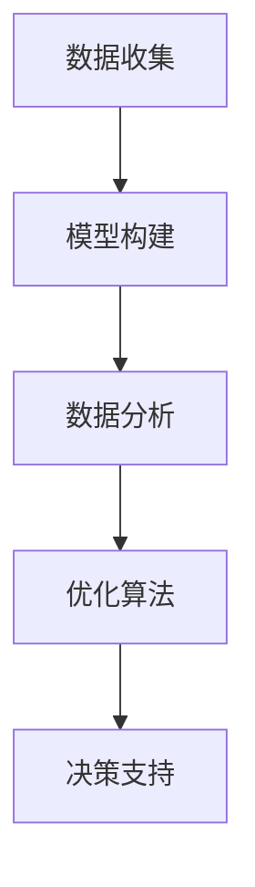

                 

# 模型思维:管理者认知复杂世界的捷径

## 1. 背景介绍

### 1.1 问题由来

在当今高度复杂和动态变化的环境中，管理者面临着前所未有的挑战。如何迅速理解复杂的商业环境，做出明智的决策，成为了现代管理者的核心挑战之一。传统的决策制定方式已难以适应快速变化的市场环境，新兴的管理工具和技术应运而生，模型思维便是其中的一种。

模型思维是指使用数学模型和数据分析工具来理解和预测复杂现象，辅助管理者进行决策的一种思维方式。它通过将现实世界的问题抽象为数学模型，利用数据分析和优化算法求解，进而为管理者提供有依据的决策支持。

### 1.2 问题核心关键点

模型思维的核心在于如何构建和应用有效的数学模型，来解释和预测现实世界中的复杂现象。它包含以下几个关键点：

- **数据收集**：收集和整理相关的数据，确保数据的质量和完备性。
- **模型构建**：选择合适的数学模型，并根据数据调整模型参数，使其能够准确描述现实问题。
- **数据验证**：通过历史数据验证模型的预测能力，确保模型的可靠性。
- **决策支持**：基于模型预测结果，结合专业知识，做出决策。

模型思维在金融、市场营销、运营管理等多个领域得到了广泛应用，显著提升了管理效率和决策质量。

### 1.3 问题研究意义

研究模型思维对于现代管理有着重要的理论意义和实践价值：

- **提升决策质量**：通过模型思维，管理者可以更科学、客观地进行决策，减少决策中的主观偏见。
- **提高管理效率**：模型思维提供了一种系统化的方法，帮助管理者识别和解决问题，优化管理流程。
- **支持战略规划**：模型思维可以帮助企业预测市场趋势，优化资源配置，支持长期战略规划。

模型思维的广泛应用，标志着现代管理从经验驱动向数据驱动的转变，为企业的可持续发展提供了坚实的理论基础和工具支持。

## 2. 核心概念与联系

### 2.1 核心概念概述

为了更好地理解模型思维，本节将介绍几个核心概念：

- **数学模型(Mathematical Model)**：将现实问题抽象为数学方程或方程组的过程。数学模型是模型思维的基础工具，用于描述和预测现实世界的现象。
- **数据分析(Analytical Data)**：对数据进行收集、清洗、分析，找出数据中的规律和趋势。数据分析是构建模型和验证模型的重要步骤。
- **优化算法(Optimization Algorithm)**：用于求解数学模型的解，如线性规划、非线性优化等。优化算法帮助我们找到模型的最优解，实现模型的预测和决策功能。
- **决策支持(Decision Support)**：利用模型的预测结果，结合专业知识，辅助管理者进行决策。决策支持是模型思维的最终目标。

这些核心概念之间的逻辑关系可以通过以下Mermaid流程图来展示：



这个流程图展示了数据收集、模型构建、数据分析、优化算法和决策支持的逻辑顺序，揭示了模型思维从数据到决策的全过程。

## 3. 核心算法原理 & 具体操作步骤
### 3.1 算法原理概述

模型思维的核心算法原理是基于数学模型和数据分析，通过优化算法求解，最终辅助决策。其基本流程包括数据收集、模型构建、数据分析、优化求解和决策支持五个步骤。

- **数据收集**：收集与问题相关的数据，确保数据的质量和完备性。
- **模型构建**：选择合适的数学模型，并根据数据调整模型参数，使其能够准确描述现实问题。
- **数据分析**：对数据进行清洗和分析，找出数据中的规律和趋势，为模型构建提供支持。
- **优化求解**：使用优化算法求解模型的最优解，实现模型的预测和决策功能。
- **决策支持**：基于模型的预测结果，结合专业知识，辅助管理者进行决策。

### 3.2 算法步骤详解

**Step 1: 数据收集**

- 收集与问题相关的数据，确保数据的质量和完备性。
- 数据类型包括定量数据和定性数据，如时间序列数据、交易数据、客户满意度调查数据等。

**Step 2: 模型构建**

- 选择合适的数学模型，并根据数据调整模型参数，使其能够准确描述现实问题。
- 常见的数学模型包括线性回归、逻辑回归、时间序列模型、决策树等。

**Step 3: 数据分析**

- 对数据进行清洗和分析，找出数据中的规律和趋势。
- 数据分析常用的方法包括统计分析、回归分析、聚类分析等。

**Step 4: 优化求解**

- 使用优化算法求解模型的最优解，实现模型的预测和决策功能。
- 优化算法包括线性规划、非线性优化、遗传算法等。

**Step 5: 决策支持**

- 基于模型的预测结果，结合专业知识，辅助管理者进行决策。
- 决策支持常用的方法包括敏感性分析、场景模拟、蒙特卡洛模拟等。

### 3.3 算法优缺点

模型思维具有以下优点：

- **科学性**：基于数据和数学模型进行决策，减少主观偏见。
- **系统性**：提供了一套系统化的方法，帮助管理者识别和解决问题。
- **可验证性**：模型和预测结果可以验证和修正，确保决策的可靠性。

但模型思维也存在一些缺点：

- **复杂性**：模型构建和数据分析需要一定的专业知识和技能。
- **数据依赖性**：模型的效果依赖于数据的质量和完备性。
- **计算资源需求高**：一些复杂的模型和算法需要较高的计算资源。

尽管存在这些局限性，但模型思维作为现代管理的重要工具，仍具有广泛的应用前景。

### 3.4 算法应用领域

模型思维在多个领域得到了广泛应用，包括：

- **金融管理**：利用数学模型预测市场趋势，优化投资组合。
- **市场营销**：利用数据分析和回归模型，预测消费者行为，制定营销策略。
- **运营管理**：利用优化算法和供应链模型，优化生产流程和库存管理。
- **人力资源管理**：利用数据分析和预测模型，优化人才选拔和培训。

## 4. 数学模型和公式 & 详细讲解 & 举例说明

### 4.1 数学模型构建

模型思维的核心是构建数学模型，用于描述和预测现实世界中的复杂现象。常见的数学模型包括：

- **线性回归模型(Linear Regression Model)**：用于描述因变量与自变量之间的线性关系。
- **逻辑回归模型(Logistic Regression Model)**：用于预测二分类问题，如客户流失与否。
- **时间序列模型(Time Series Model)**：用于描述时间序列数据的变化趋势，如股票价格。
- **决策树模型(Decision Tree Model)**：用于分类和回归问题，如客户分类和销售预测。

### 4.2 公式推导过程

以线性回归模型为例，推导其基本公式和参数求解过程。

设因变量 $y$ 与自变量 $x_1, x_2, ..., x_n$ 之间存在线性关系，则线性回归模型可以表示为：

$$ y = \beta_0 + \beta_1x_1 + \beta_2x_2 + ... + \beta_nx_n + \epsilon $$

其中 $\beta_0$ 为截距，$\beta_1, \beta_2, ..., \beta_n$ 为自变量的系数，$\epsilon$ 为误差项。

根据最小二乘法，求解 $\beta_0, \beta_1, ..., \beta_n$ 的公式为：

$$ \hat{\beta} = (X^TX)^{-1}X^Ty $$

其中 $X$ 为自变量的矩阵，$y$ 为因变量的向量。

### 4.3 案例分析与讲解

假设某电商平台希望预测客户的购买行为，使用线性回归模型来构建预测模型。

- **数据收集**：收集客户的购买历史、浏览历史、年龄、性别等信息。
- **模型构建**：选择线性回归模型，并根据数据调整模型参数。
- **数据分析**：对数据进行清洗和分析，找出影响购买行为的关键因素。
- **优化求解**：使用最小二乘法求解模型参数，得到预测模型。
- **决策支持**：基于预测模型，进行客户购买行为预测，制定个性化营销策略。

## 5. 项目实践：代码实例和详细解释说明
### 5.1 开发环境搭建

在进行模型思维项目开发前，需要准备好开发环境。以下是使用Python进行SciPy开发的环境配置流程：

1. 安装Anaconda：从官网下载并安装Anaconda，用于创建独立的Python环境。

2. 创建并激活虚拟环境：
```bash
conda create -n model-env python=3.8 
conda activate model-env
```

3. 安装SciPy：
```bash
pip install scipy
```

4. 安装相关工具包：
```bash
pip install pandas numpy matplotlib seaborn scikit-learn statsmodels
```

完成上述步骤后，即可在`model-env`环境中开始模型思维项目的开发。

### 5.2 源代码详细实现

下面我们以线性回归模型为例，给出使用SciPy进行模型构建和求解的Python代码实现。

```python
from scipy import stats
import pandas as pd
import numpy as np
import matplotlib.pyplot as plt

# 加载数据
data = pd.read_csv('data.csv')

# 数据预处理
X = data[['x1', 'x2', 'x3', 'x4']]
y = data['y']

# 模型构建
X = stats.add_constant(X)
model = stats.OLS(y, X).fit()

# 输出结果
print(model.summary())
```

### 5.3 代码解读与分析

让我们再详细解读一下关键代码的实现细节：

**数据加载和预处理**：
- 使用pandas库读取数据文件，并进行预处理。
- 将自变量 $x_1, x_2, ..., x_n$ 转换为矩阵形式，并添加常数项。

**模型构建**：
- 使用stats库中的OLS方法，构建线性回归模型。
- 调用`fit()`方法求解模型参数。

**结果输出**：
- 使用`summary()`方法输出模型结果，包括系数、截距、R方等指标。

**结果可视化**：
- 使用matplotlib库绘制模型拟合图，直观展示模型效果。

```python
import matplotlib.pyplot as plt

# 绘制拟合图
plt.scatter(X[:, 1], y)
plt.plot(X[:, 1], model.fittedvalues, color='red')
plt.xlabel('x1')
plt.ylabel('y')
plt.show()
```

## 6. 实际应用场景
### 6.1 金融风险管理

在金融领域，模型思维广泛应用于风险管理和投资决策。通过构建金融时间序列模型，预测市场趋势和波动，评估投资组合的风险和回报。

具体而言，可以收集历史股票价格、市场指数等数据，利用ARIMA等时间序列模型预测未来的股价走势。同时，利用风险价值模型(VaR)和压力测试，评估投资组合在不同市场情况下的风险和回报。

### 6.2 市场营销策略制定

市场营销人员利用模型思维，通过数据分析和回归模型，预测消费者行为和市场趋势，制定有效的营销策略。

例如，可以收集消费者的购买历史、浏览记录、社交媒体行为等数据，利用逻辑回归和决策树模型，预测消费者对不同产品的偏好，从而制定个性化的营销方案，提升销售转化率。

### 6.3 运营管理优化

运营管理中，模型思维帮助企业优化生产流程和库存管理，提高运营效率。

通过构建供应链模型和优化算法，企业可以预测需求变化，优化库存水平，减少库存成本。同时，利用线性规划和整数规划模型，优化生产排程和资源分配，提升生产效率和资源利用率。

### 6.4 未来应用展望

随着数据科学和人工智能技术的不断发展，模型思维的应用场景将更加广泛和深入。未来，模型思维将在以下领域得到进一步发展：

- **个性化推荐系统**：利用协同过滤和深度学习模型，提供个性化的产品推荐，提升用户体验。
- **智能客服系统**：利用自然语言处理和情感分析模型，构建智能客服系统，提升客户满意度。
- **智能供应链管理**：利用物联网和实时数据分析，构建智能供应链系统，提升供应链效率和灵活性。

## 7. 工具和资源推荐
### 7.1 学习资源推荐

为了帮助开发者系统掌握模型思维的理论基础和实践技巧，这里推荐一些优质的学习资源：

1. 《数据科学导论》系列博文：由数据科学专家撰写，深入浅出地介绍了数据科学的基础知识和实用技巧。

2. 《机器学习实战》书籍：由机器学习专家撰写，详细介绍了机器学习的基本原理和实际应用。

3. 《Python数据科学手册》书籍：全面介绍了Python在数据科学中的应用，包括数据处理、模型构建和可视化等。

4. Kaggle平台：一个全球性的数据科学竞赛平台，提供丰富的数据集和模型竞赛，帮助你提升实战能力。

5. Coursera平台：提供在线数据科学和机器学习课程，由世界顶尖大学的教授授课，涵盖从基础到高级的各类主题。

通过对这些资源的学习实践，相信你一定能够快速掌握模型思维的精髓，并用于解决实际的数据科学问题。

### 7.2 开发工具推荐

高效的开发离不开优秀的工具支持。以下是几款用于模型思维开发的常用工具：

1. Python：开源的编程语言，具有强大的数据分析和科学计算能力，是数据科学家的首选工具。

2. R：另一款流行的统计分析和数据科学工具，特别适合于统计建模和数据可视化。

3. Jupyter Notebook：一款交互式的Python开发环境，支持代码编写、数据可视化和结果展示，方便开发者协作和交流。

4. Scikit-learn：基于Python的机器学习库，提供丰富的模型和算法，支持数据预处理、模型构建和评估等。

5. TensorFlow：由Google主导开发的深度学习框架，支持构建和训练复杂的神经网络模型。

6. Matplotlib：Python的可视化库，提供丰富的绘图功能，方便数据可视化。

合理利用这些工具，可以显著提升模型思维的开发效率，加快创新迭代的步伐。

### 7.3 相关论文推荐

模型思维的研究源于学界的持续探索。以下是几篇奠基性的相关论文，推荐阅读：

1. "The Elements of Statistical Learning" by Hastie et al.：介绍了统计学习的基本原理和实用方法，是数据科学家必读之作。

2. "Pattern Recognition and Machine Learning" by Bishop：全面介绍了机器学习的基本概念和算法，适合进阶学习。

3. "Practical Machine Learning for Horizon 2020 Challenges" by Zauniar et al.：介绍了机器学习在欧盟Horizon 2020项目中的应用，展示了机器学习的广泛潜力。

4. "Deep Learning for Time Series Forecasting" by Diebold：探讨了深度学习在时间序列预测中的应用，是时间序列分析的权威著作。

5. "A Course in Decision, Risk, and Uncertainty" by Dyer et al.：介绍了决策理论的基本原理和应用，适合管理者和数据科学家学习。

这些论文代表了大数据和人工智能技术的最新进展，帮助读者了解前沿技术和研究方法。

## 8. 总结：未来发展趋势与挑战
### 8.1 总结

本文对模型思维进行了全面系统的介绍。首先阐述了模型思维的研究背景和意义，明确了模型思维在现代管理中的独特价值。其次，从原理到实践，详细讲解了模型思维的数学原理和关键步骤，给出了模型思维任务开发的完整代码实例。同时，本文还广泛探讨了模型思维在金融、市场营销、运营管理等多个行业领域的应用前景，展示了模型思维的广泛潜力。此外，本文精选了模型思维的学习资源，力求为读者提供全方位的技术指引。

通过本文的系统梳理，可以看到，模型思维作为现代管理的重要工具，正在成为数据分析和决策制定的主流范式，显著提升了管理效率和决策质量。未来，伴随数据科学和人工智能技术的不断演进，模型思维必将在更多领域得到应用，为企业的可持续发展提供坚实的理论基础和工具支持。

### 8.2 未来发展趋势

展望未来，模型思维将呈现以下几个发展趋势：

- **自动化和智能化**：随着AI技术的进步，自动化和智能化模型将进一步提高管理效率，减少人工干预。
- **跨领域融合**：模型思维将与其他人工智能技术进行更深入的融合，如自然语言处理、计算机视觉等，形成更加全面、多模态的决策支持。
- **实时性提升**：基于实时数据分析和处理，模型思维将实现实时决策支持，提升决策的时效性。
- **可解释性增强**：模型思维将引入更多的解释性技术，如因果分析、模型可视化等，提高模型的透明度和可信度。

### 8.3 面临的挑战

尽管模型思维已经取得了显著成就，但在迈向更加智能化、普适化应用的过程中，它仍面临诸多挑战：

- **数据质量问题**：模型的效果依赖于高质量的数据，如何获取和清洗数据是一个重要挑战。
- **计算资源需求高**：复杂的模型和算法需要高计算资源，如何降低计算成本是一个关键问题。
- **模型解释性不足**：许多复杂的模型和算法缺乏可解释性，难以满足管理者的需求。
- **模型鲁棒性差**：模型在不同环境下的表现不稳定，如何提高模型的鲁棒性是一个重要研究方向。

### 8.4 研究展望

面对模型思维面临的挑战，未来的研究需要在以下几个方面寻求新的突破：

- **数据驱动**：加强数据驱动的模型构建，减少对经验的依赖，提升模型的科学性和可靠性。
- **多模态融合**：将多模态数据和模型进行融合，实现跨领域的决策支持。
- **智能化决策**：引入AI技术，实现智能化决策支持，提升决策的效率和效果。
- **模型优化**：优化模型算法，降低计算资源需求，提高模型的可解释性和鲁棒性。

这些研究方向的探索，必将引领模型思维技术迈向更高的台阶，为构建智能化的管理决策支持系统铺平道路。面向未来，模型思维还需要与其他人工智能技术进行更深入的融合，共同推动企业决策的科学化和智能化进程。只有勇于创新、敢于突破，才能不断拓展模型思维的边界，让模型思维更好地服务于现代管理。

## 9. 附录：常见问题与解答

**Q1：模型思维是否适用于所有管理场景？**

A: 模型思维在大多数管理场景下都能取得良好的效果，特别是对于数据量较大的问题。但对于一些特殊的管理场景，如人际关系管理、组织文化建设等，模型的适用性可能有限。需要结合具体情况，选择合适的方法和技术。

**Q2：如何选择合适的数学模型？**

A: 选择合适的数学模型需要综合考虑多个因素，如数据类型、问题性质、模型复杂度等。一般来说，数据量较大的问题适合使用复杂的模型，数据量较小的问题适合使用简单的模型。常用的模型包括线性回归、逻辑回归、决策树、随机森林等。

**Q3：数据预处理有哪些常见方法？**

A: 数据预处理是模型构建的基础，常见的预处理方法如下：
- 数据清洗：去除缺失值、异常值等噪声数据。
- 数据归一化：将数据缩放到指定范围，提高模型的收敛速度。
- 特征工程：构建新的特征变量，提升模型的预测能力。
- 数据可视化：通过可视化工具，直观展示数据的分布和规律。

**Q4：如何提高模型的解释性？**

A: 提高模型的解释性可以通过以下方法：
- 使用可解释性较高的模型，如决策树、线性回归等。
- 引入解释性分析工具，如LIME、SHAP等，分析模型的特征重要性。
- 结合领域知识，解释模型的预测结果。

**Q5：模型思维在实际应用中需要注意哪些问题？**

A: 模型思维在实际应用中需要注意以下问题：
- 模型验证：确保模型在实际数据上的表现符合预期。
- 模型更新：根据实际情况定期更新模型，保持模型的新鲜度。
- 模型评估：通过各种指标评估模型的效果，如准确率、召回率、F1值等。
- 模型监控：实时监控模型的性能，及时发现和修正问题。

通过不断优化和改进模型思维，管理者可以更科学、高效地进行决策，提升企业的竞争力和可持续发展能力。模型思维作为现代管理的重要工具，将继续在数据驱动的管理实践中发挥重要作用。

---

作者：禅与计算机程序设计艺术 / Zen and the Art of Computer Programming

