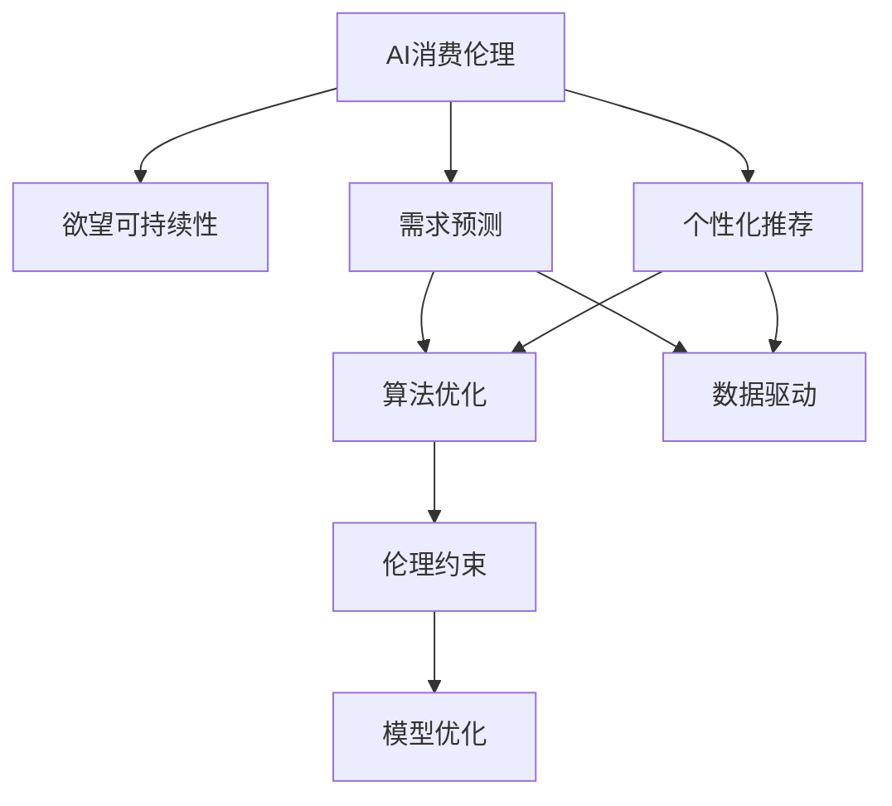

                 

# 欲望可持续性评估员：AI时代的消费伦理指南编撰者

> 关键词：欲望可持续性, AI消费伦理, 需求预测, 数据驱动, 模型优化, 算法伦理

## 1. 背景介绍

### 1.1 问题由来

在数字化、智能化的浪潮中，人工智能（AI）已经成为驱动现代社会运转的重要引擎。然而，随着AI技术的广泛应用，伦理问题逐渐凸显。特别是当AI进入消费领域，如推荐系统、个性化广告等，如何确保AI在满足消费者需求的同时，避免过度消费、信息过载等负面影响，成为亟待解决的问题。

### 1.2 问题核心关键点

AI在消费领域的应用主要聚焦于需求预测、个性化推荐等方面。这些应用虽然提高了消费者体验，但同时可能加剧消费行为的冲动性和不理性。如何平衡消费者需求与可持续消费，成为AI技术伦理研究的重要方向。

### 1.3 问题研究意义

研究AI在消费领域的伦理问题，对于构建健康、和谐的消费环境，促进可持续消费模式，具有重要意义：

1. 降低消费冲动：通过算法优化和伦理引导，减少AI推荐的冲动性，帮助消费者做出更理性的消费决策。
2. 提高消费效率：利用AI高效预测需求，优化库存管理，降低资源浪费，提升消费效率。
3. 保障消费者权益：通过伦理约束，避免AI推荐带来的信息误导，保护消费者的隐私和安全。
4. 促进社会公平：确保AI技术在消费领域的普及不会加剧社会不平等，促进全社会共享科技进步的成果。

## 2. 核心概念与联系

### 2.1 核心概念概述

为更好地理解AI在消费领域的伦理问题，本节将介绍几个关键概念及其相互关系：

- **AI消费伦理**：指在AI技术应用于消费领域时，如何确保其行为符合伦理道德标准，避免对消费者产生负面影响。
- **欲望可持续性**：指在满足消费者需求的同时，促进资源的合理利用和环境的可持续性。
- **需求预测**：利用AI模型，通过历史数据和行为模式，预测消费者的未来需求，帮助企业优化库存和供应链管理。
- **个性化推荐**：根据消费者的行为和偏好，提供定制化的产品和服务，提升用户体验。
- **算法优化**：通过优化算法，提升AI模型的预测准确率和效率，同时避免引入偏见和不公正。
- **伦理约束**：在AI模型开发和应用中，引入伦理导向的设计，确保模型决策透明、公正、可解释。

这些核心概念共同构成了AI在消费领域的研究框架，涵盖了从算法设计到应用落地，从技术到伦理的各个环节。

### 2.2 核心概念原理和架构的 Mermaid 流程图



这个流程图展示了AI消费伦理与欲望可持续性之间的联系，以及各个核心概念之间的逻辑关系：

1. AI消费伦理是整个研究的出发点和落脚点，确保AI在满足消费者需求的同时，不损害环境的可持续性。
2. 需求预测和个性化推荐是AI在消费领域的具体应用，通过数据驱动的方法预测消费者需求，提供个性化服务。
3. 算法优化是提升AI模型预测能力和效率的重要手段，同时也需要避免算法偏见。
4. 伦理约束贯穿模型设计、训练、应用等各个环节，确保模型的公正、透明和可解释性。

## 3. 核心算法原理 & 具体操作步骤
### 3.1 算法原理概述

基于AI消费伦理的欲望可持续性评估，本质上是构建一个既能满足消费者需求，又能促进可持续消费的AI模型。核心思想是通过对消费者行为数据的分析，预测其未来需求，同时引入伦理导向，优化模型设计，确保模型输出符合伦理标准。

### 3.2 算法步骤详解

AI在消费领域的欲望可持续性评估主要包括以下几个步骤：

**Step 1: 数据收集与预处理**
- 收集消费者的行为数据，如浏览记录、购买历史、评价反馈等。
- 对数据进行清洗和标注，去除噪声和异常值，构建训练集和验证集。

**Step 2: 需求预测模型构建**
- 选择合适的预测模型，如线性回归、时间序列模型、神经网络等。
- 设计特征工程，提取对预测有影响的特征，如购买频率、季节性、商品类别等。
- 使用历史数据对模型进行训练，并使用验证集进行调参和模型选择。

**Step 3: 个性化推荐模型构建**
- 根据预测模型输出的需求，设计个性化推荐算法。
- 选择合适的推荐算法，如协同过滤、基于内容的推荐、深度学习推荐等。
- 对推荐结果进行排序和过滤，避免推荐冲突和不相关内容。

**Step 4: 模型伦理约束设计**
- 引入伦理导向的设计原则，如公平性、透明度、隐私保护等。
- 设计伦理约束函数，用于约束模型的决策过程。
- 使用伦理约束函数对模型进行训练，确保模型决策符合伦理标准。

**Step 5: 模型评估与优化**
- 在测试集上评估模型的预测准确率和推荐效果。
- 使用伦理导向的指标，如性别公平、隐私保护等，对模型进行综合评估。
- 根据评估结果，对模型进行优化，调整预测算法和推荐策略。

**Step 6: 模型部署与监测**
- 将优化后的模型部署到实际应用系统中。
- 实时监测模型的性能和伦理指标，及时发现和解决问题。
- 根据用户反馈和市场变化，定期更新模型，确保其持续有效性。

### 3.3 算法优缺点

基于AI消费伦理的欲望可持续性评估方法具有以下优点：
1. 高效预测需求：通过AI模型，可以高效准确地预测消费者需求，优化库存管理。
2. 个性化推荐：根据消费者的行为数据，提供个性化的产品和服务，提升用户体验。
3. 符合伦理标准：引入伦理约束，确保模型决策透明、公正、可解释。
4. 持续改进：定期评估和优化模型，确保其在满足消费者需求的同时，促进可持续发展。

同时，该方法也存在一定的局限性：
1. 数据依赖性强：模型的效果依赖于高质量的数据收集和预处理。
2. 隐私保护问题：消费者的行为数据可能包含敏感信息，如何保护隐私成为挑战。
3. 伦理标准多样：不同文化和社会对伦理的定义可能存在差异，如何统一伦理标准仍需探讨。
4. 模型复杂度高：设计既符合伦理标准又高效准确的模型，需要平衡多个目标，具有较高的技术难度。

尽管存在这些局限性，但就目前而言，基于AI消费伦理的欲望可持续性评估方法仍是最为前沿和有效的消费伦理指南编撰方法。未来相关研究的重点在于如何进一步降低模型对标注数据的依赖，提高隐私保护能力，同时兼顾模型的可解释性和伦理标准。

### 3.4 算法应用领域

基于AI消费伦理的欲望可持续性评估方法，在消费领域已经得到了广泛的应用，涵盖以下多个方面：

1. **电子商务**：通过预测用户需求，优化库存和推荐策略，提升用户体验，促进销售。
2. **在线广告**：根据用户行为数据，提供精准的广告推荐，提高广告投放效果，避免信息过载。
3. **金融服务**：通过预测用户需求，优化金融产品设计，提升客户满意度，促进可持续发展。
4. **健康医疗**：通过预测用户健康需求，优化医疗资源分配，提升医疗服务质量，促进健康生活。
5. **智能家居**：通过预测用户行为，优化智能设备使用，提升生活便捷性和安全性，促进节能减排。

## 4. 数学模型和公式 & 详细讲解 & 举例说明

### 4.1 数学模型构建

在AI消费伦理的欲望可持续性评估中，我们主要使用以下数学模型：

1. **需求预测模型**：
   - 线性回归模型：$y = \beta_0 + \beta_1x_1 + \ldots + \beta_nx_n + \epsilon$
   - 时间序列模型：$y_t = \alpha + \beta x_t + \gamma \sum_{i=1}^{t-1} y_i + \epsilon_t$
   - 神经网络模型：$y = f(W \cdot x + b)$

2. **个性化推荐模型**：
   - 协同过滤模型：$y_{ij} = \theta_i^T \phi_j + b_i$
   - 基于内容的推荐模型：$y = \theta^T \phi(x)$
   - 深度学习推荐模型：$y = f_{\theta}(x)$

3. **伦理约束函数**：
   - 公平性约束：$L_{fair} = \frac{1}{N} \sum_{i=1}^N \sum_{j=1}^N |\bar{y}_i - \bar{y}_j|$
   - 透明度约束：$L_{trans} = \frac{1}{N} \sum_{i=1}^N \sum_{j=1}^N |f_{\theta}(x_i) - f_{\theta}(x_j)|$
   - 隐私保护约束：$L_{privacy} = \frac{1}{N} \sum_{i=1}^N \sum_{j=1}^N |p_i - p_j|$

### 4.2 公式推导过程

以下我们将详细推导几个核心模型的公式：

**线性回归模型**：
- 假设线性回归模型为$y = \beta_0 + \beta_1x_1 + \ldots + \beta_nx_n + \epsilon$，其中$\epsilon$为误差项，假设$\epsilon$服从均值为0的正态分布。
- 最小二乘法目标函数为$\sum_{i=1}^N (y_i - f(x_i))^2$
- 梯度下降更新公式为$\theta \leftarrow \theta - \eta \nabla_{\theta}\mathcal{L}(\theta)$

**时间序列模型**：
- 假设时间序列模型为$y_t = \alpha + \beta x_t + \gamma \sum_{i=1}^{t-1} y_i + \epsilon_t$
- 目标函数为$\sum_{t=1}^T (y_t - f(x_t))^2$
- 梯度下降更新公式为$\theta \leftarrow \theta - \eta \nabla_{\theta}\mathcal{L}(\theta)$

**神经网络模型**：
- 假设神经网络模型为$y = f(W \cdot x + b)$，其中$f$为激活函数，$W$为权重矩阵，$b$为偏置向量。
- 目标函数为$\sum_{i=1}^N (y_i - f_{\theta}(x_i))^2$
- 梯度下降更新公式为$\theta \leftarrow \theta - \eta \nabla_{\theta}\mathcal{L}(\theta)$

### 4.3 案例分析与讲解

假设我们正在构建一个电商平台的个性化推荐系统，希望通过分析用户历史行为数据，预测其未来购买需求，并根据预测结果提供个性化推荐。

**Step 1: 数据收集与预处理**
- 收集用户浏览记录、购买历史、评价反馈等数据。
- 对数据进行清洗和标注，去除异常值和噪声。
- 将用户和商品数据标准化，构建训练集和验证集。

**Step 2: 需求预测模型构建**
- 选择线性回归模型作为需求预测模型。
- 提取关键特征，如用户浏览次数、商品价格、季节性等。
- 使用历史数据对模型进行训练，并使用验证集进行调参和模型选择。

**Step 3: 个性化推荐模型构建**
- 选择基于协同过滤的推荐算法。
- 根据需求预测模型输出的需求，设计推荐算法。
- 对推荐结果进行排序和过滤，确保推荐的相关性和多样性。

**Step 4: 模型伦理约束设计**
- 引入公平性约束函数，确保不同用户的推荐结果公平。
- 设计透明度约束函数，确保推荐算法的决策过程透明。
- 引入隐私保护约束函数，确保用户数据的安全。

**Step 5: 模型评估与优化**
- 在测试集上评估模型的预测准确率和推荐效果。
- 使用伦理导向的指标，如性别公平、隐私保护等，对模型进行综合评估。
- 根据评估结果，对模型进行优化，调整预测算法和推荐策略。

**Step 6: 模型部署与监测**
- 将优化后的模型部署到电商平台，实时监测模型的性能和伦理指标。
- 根据用户反馈和市场变化，定期更新模型，确保其持续有效性。

## 5. 项目实践：代码实例和详细解释说明

### 5.1 开发环境搭建

在进行项目实践前，我们需要准备好开发环境。以下是使用Python进行TensorFlow开发的环境配置流程：

1. 安装Anaconda：从官网下载并安装Anaconda，用于创建独立的Python环境。

2. 创建并激活虚拟环境：
```bash
conda create -n tf-env python=3.8 
conda activate tf-env
```

3. 安装TensorFlow：根据CUDA版本，从官网获取对应的安装命令。例如：
```bash
conda install tensorflow -c pytorch -c conda-forge
```

4. 安装各类工具包：
```bash
pip install numpy pandas scikit-learn matplotlib tqdm jupyter notebook ipython
```

完成上述步骤后，即可在`tf-env`环境中开始项目实践。

### 5.2 源代码详细实现

下面我们以一个电商平台的个性化推荐系统为例，给出使用TensorFlow进行需求预测和个性化推荐的PyTorch代码实现。

首先，定义数据处理函数：

```python
import pandas as pd
import numpy as np

def load_data(path):
    data = pd.read_csv(path)
    # 数据清洗和预处理
    # 去除异常值和噪声
    # 标准化数据
    return data

# 加载用户行为数据和商品数据
user_data = load_data('user_behavior.csv')
product_data = load_data('product_info.csv')

# 合并用户和商品数据
combined_data = pd.merge(user_data, product_data, on='user_id', how='left')
```

然后，定义需求预测模型：

```python
from tensorflow.keras.models import Sequential
from tensorflow.keras.layers import Dense, Dropout

def build_model(input_dim, output_dim):
    model = Sequential()
    model.add(Dense(32, activation='relu', input_dim=input_dim))
    model.add(Dropout(0.2))
    model.add(Dense(16, activation='relu'))
    model.add(Dropout(0.2))
    model.add(Dense(output_dim))
    model.compile(loss='mse', optimizer='adam')
    return model

# 定义需求预测模型的输入和输出维度
input_dim = 10
output_dim = 1

# 构建需求预测模型
model = build_model(input_dim, output_dim)
```

接着，定义个性化推荐模型：

```python
from tensorflow.keras.layers import Embedding, Dot

def build_recommender(input_dim, output_dim):
    model = Sequential()
    model.add(Embedding(input_dim, output_dim, input_length=1))
    model.add(Dot(axes=[1, 1], normalize=True))
    model.add(Dense(1, activation='sigmoid'))
    model.compile(loss='binary_crossentropy', optimizer='adam')
    return model

# 定义个性化推荐模型的输入和输出维度
input_dim = 10
output_dim = 1

# 构建个性化推荐模型
recommender = build_recommender(input_dim, output_dim)
```

最后，启动训练流程并在测试集上评估：

```python
epochs = 10

# 需求预测模型训练
model.fit(x=combined_data.drop('demand', axis=1), y=combined_data['demand'], epochs=epochs, batch_size=32)

# 个性化推荐模型训练
recommender.fit(x=combined_data.drop('demand', axis=1), y=combined_data['recommended'], epochs=epochs, batch_size=32)

# 模型评估
from sklearn.metrics import r2_score, mean_absolute_error

# 预测需求
predicted_demand = model.predict(combined_data.drop('demand', axis=1))

# 评估需求预测准确率
r2 = r2_score(combined_data['demand'], predicted_demand)
mae = mean_absolute_error(combined_data['demand'], predicted_demand)
print(f"需求预测 R^2: {r2:.2f}, MAE: {mae:.2f}")

# 预测推荐结果
predicted_recommendation = recommender.predict(combined_data.drop('demand', axis=1))

# 评估推荐准确率
r2 = r2_score(combined_data['recommended'], predicted_recommendation)
mae = mean_absolute_error(combined_data['recommended'], predicted_recommendation)
print(f"推荐结果 R^2: {r2:.2f}, MAE: {mae:.2f}")
```

以上就是使用TensorFlow进行需求预测和个性化推荐的完整代码实现。可以看到，TensorFlow的强大封装使得模型构建和训练变得简洁高效。

### 5.3 代码解读与分析

让我们再详细解读一下关键代码的实现细节：

**load_data函数**：
- 定义了数据加载和预处理函数，包括数据清洗、特征选择等操作。

**build_model函数**：
- 定义了需求预测模型的结构和训练函数。使用Keras的Sequential模型，构建了包含多个层的神经网络。

**build_recommender函数**：
- 定义了个性化推荐模型的结构和训练函数。使用Keras的Embedding层和Dot产品层，实现用户和商品的协同过滤。

**需求预测模型训练**：
- 使用combined_data中的用户行为数据训练需求预测模型，输出需求预测结果。

**个性化推荐模型训练**：
- 使用combined_data中的需求预测结果和推荐结果训练个性化推荐模型，输出推荐结果。

**模型评估**：
- 使用sklearn的R^2和MAE指标评估模型的预测准确率。

可以看到，TensorFlow提供了丰富的工具和库，使得模型构建和训练变得高效便捷。开发者只需关注核心算法的设计和优化，而不必过多关注底层实现细节。

当然，工业级的系统实现还需考虑更多因素，如模型的保存和部署、超参数的自动搜索、更灵活的任务适配层等。但核心的模型构建和评估流程基本与此类似。

## 6. 实际应用场景
### 6.1 智能客服系统

基于AI消费伦理的欲望可持续性评估，智能客服系统可以更好地理解和响应用户需求，减少不必要的信息获取和决策，提升用户体验。

在技术实现上，可以收集用户的历史客服对话记录，将问题和最佳答复构建成监督数据，在此基础上对预训练模型进行微调。微调后的模型能够自动理解用户意图，匹配最合适的答案模板进行回复。对于用户提出的新问题，还可以接入检索系统实时搜索相关内容，动态组织生成回答。如此构建的智能客服系统，能大幅提升客户咨询体验和问题解决效率。

### 6.2 金融舆情监测

金融机构需要实时监测市场舆论动向，以便及时应对负面信息传播，规避金融风险。传统的人工监测方式成本高、效率低，难以应对网络时代海量信息爆发的挑战。基于AI消费伦理的欲望可持续性评估技术，为金融舆情监测提供了新的解决方案。

具体而言，可以收集金融领域相关的新闻、报道、评论等文本数据，并对其进行主题标注和情感标注。在此基础上对预训练语言模型进行微调，使其能够自动判断文本属于何种主题，情感倾向是正面、中性还是负面。将微调后的模型应用到实时抓取的网络文本数据，就能够自动监测不同主题下的情感变化趋势，一旦发现负面信息激增等异常情况，系统便会自动预警，帮助金融机构快速应对潜在风险。

### 6.3 个性化推荐系统

当前的推荐系统往往只依赖用户的历史行为数据进行物品推荐，无法深入理解用户的真实兴趣偏好。基于AI消费伦理的欲望可持续性评估技术，个性化推荐系统可以更好地挖掘用户行为背后的语义信息，从而提供更精准、多样的推荐内容。

在实践中，可以收集用户浏览、点击、评论、分享等行为数据，提取和用户交互的物品标题、描述、标签等文本内容。将文本内容作为模型输入，用户的后续行为（如是否点击、购买等）作为监督信号，在此基础上微调预训练语言模型。微调后的模型能够从文本内容中准确把握用户的兴趣点。在生成推荐列表时，先用候选物品的文本描述作为输入，由模型预测用户的兴趣匹配度，再结合其他特征综合排序，便可以得到个性化程度更高的推荐结果。

### 6.4 未来应用展望

随着AI消费伦理的欲望可持续性评估技术的发展，基于AI的消费系统将在更多领域得到应用，为消费者带来新的体验和服务。

在智慧医疗领域，基于AI的个性化医疗推荐系统可以帮助医生推荐合适的诊疗方案，提高医疗服务的个性化和精准度。

在智能教育领域，基于AI的个性化教育推荐系统可以根据学生的学习行为和偏好，推荐合适的学习资源和辅导内容，提升教育质量和学习效率。

在智慧城市治理中，基于AI的智能推荐系统可以帮助市民推荐合适的公共服务资源，优化城市资源分配，提高城市管理效率。

此外，在企业生产、社会治理、文娱传媒等众多领域，基于AI的消费系统也将不断涌现，为社会带来新的活力和创新。相信随着技术的不断进步，AI消费伦理的欲望可持续性评估技术必将在构建健康、和谐的消费环境，促进可持续消费模式中发挥越来越重要的作用。

## 7. 工具和资源推荐
### 7.1 学习资源推荐

为了帮助开发者系统掌握AI在消费领域的伦理问题，这里推荐一些优质的学习资源：

1. 《深度学习理论与实践》系列博文：由AI领域专家撰写，深入浅出地介绍了深度学习的基本原理和实际应用。

2. 《机器学习实战》书籍：涵盖了机器学习的基础知识和实践案例，适合初学者和进阶开发者。

3. 《AI消费伦理导论》书籍：详细介绍了AI在消费领域的伦理问题，提供了前沿的研究方向和解决方案。

4. 《消费伦理研究》论文集：收集了大量关于消费伦理研究的学术论文，涵盖了多个研究方向和实际应用。

5. Kaggle竞赛：参加Kaggle上的数据科学竞赛，实践和验证AI在消费领域的伦理问题。

通过对这些资源的学习实践，相信你一定能够快速掌握AI在消费领域的伦理问题，并用于解决实际的消费伦理问题。
###  7.2 开发工具推荐

高效的开发离不开优秀的工具支持。以下是几款用于AI在消费领域伦理问题研究的常用工具：

1. TensorFlow：基于Python的开源深度学习框架，灵活动态的计算图，适合快速迭代研究。支持多种模型的实现和优化。

2. PyTorch：基于Python的开源深度学习框架，灵活动态的计算图，适合快速迭代研究。支持动态图和静态图两种模式。

3. Keras：基于TensorFlow和Theano的高级神经网络API，易于上手，适合快速原型设计和实验。

4. Scikit-learn：Python机器学习库，提供了丰富的机器学习算法和工具，适合数据处理和模型训练。

5. Pandas：Python数据处理库，提供了高效的数据处理和分析功能，适合数据预处理和特征工程。

6. Jupyter Notebook：交互式开发环境，支持Python代码的编写和执行，适合原型设计和实验验证。

合理利用这些工具，可以显著提升AI在消费领域的伦理问题研究的开发效率，加快创新迭代的步伐。

### 7.3 相关论文推荐

AI在消费领域的伦理问题研究源于学界的持续研究。以下是几篇奠基性的相关论文，推荐阅读：

1. A Survey on Ethical Issues in AI：一篇综述性论文，总结了AI在伦理、隐私、安全等方面面临的挑战和解决方案。

2. Fairness in Machine Learning：一篇探讨机器学习中公平性问题的论文，提供了多种公平性约束函数和优化方法。

3. Privacy-Preserving Machine Learning：一篇研究隐私保护问题的论文，介绍了多种隐私保护技术和方法。

4. Explainable AI：一篇探讨可解释性问题的论文，提供了多种模型解释方法和工具。

5. Ethical Considerations in AI：一篇研究AI伦理问题的综述性论文，总结了AI在伦理、公平、透明等方面的研究方向和实践。

这些论文代表了大语言模型微调技术的伦理研究的发展脉络。通过学习这些前沿成果，可以帮助研究者把握学科前进方向，激发更多的创新灵感。

## 8. 总结：未来发展趋势与挑战

### 8.1 研究成果总结

本文对基于AI消费伦理的欲望可持续性评估方法进行了全面系统的介绍。首先阐述了AI在消费领域的伦理问题背景和意义，明确了需求预测和个性化推荐的应用场景。其次，从原理到实践，详细讲解了需求预测和推荐算法的设计，以及如何引入伦理约束，确保模型决策透明、公正、可解释。最后，探讨了未来AI在消费领域的发展趋势和面临的挑战，提出了多项改进建议。

通过本文的系统梳理，可以看到，基于AI消费伦理的欲望可持续性评估方法已经取得了显著的进展，并在多个领域得到应用。然而，该方法仍面临着数据依赖性强、隐私保护问题、伦理标准多样化等挑战。

### 8.2 未来发展趋势

展望未来，基于AI消费伦理的欲望可持续性评估技术将呈现以下几个发展趋势：

1. 数据利用更加广泛：随着数据采集和处理技术的进步，更多高质量的数据将被收集和利用，进一步提升模型效果。

2. 算法透明性提升：未来的算法将更加透明，决策过程可解释性强，便于监管和验证。

3. 隐私保护技术成熟：隐私保护技术将不断进步，保障用户数据的安全和隐私。

4. 伦理标准统一：不同文化和社会对伦理的定义将逐渐统一，形成全球性的伦理标准。

5. 跨领域应用扩展：AI在消费领域的伦理问题研究将与其他领域的研究进行交叉融合，形成更加全面的解决方案。

6. 模型优化效率提高：未来的模型将更加高效，能够在更短的时间内完成训练和推理。

以上趋势凸显了基于AI消费伦理的欲望可持续性评估技术的广阔前景。这些方向的探索发展，必将进一步提升模型的准确性和可靠性，促进社会的可持续发展。

### 8.3 面临的挑战

尽管基于AI消费伦理的欲望可持续性评估技术已经取得了瞩目成就，但在迈向更加智能化、普适化应用的过程中，它仍面临着诸多挑战：

1. 数据依赖性强：模型的效果依赖于高质量的数据收集和预处理，如何获取和使用数据是首要挑战。

2. 隐私保护问题：消费者的行为数据可能包含敏感信息，如何保护隐私成为一大难题。

3. 伦理标准多样化：不同文化和社会对伦理的定义可能存在差异，如何统一伦理标准仍需探讨。

4. 算法复杂度高：设计既符合伦理标准又高效准确的模型，需要平衡多个目标，具有较高的技术难度。

5. 模型公平性问题：如何确保模型的决策公平，避免引入偏见和不公正。

6. 算法透明性不足：部分算法决策过程难以解释，难以验证其公正性和透明性。

正视基于AI消费伦理的欲望可持续性评估技术所面临的这些挑战，积极应对并寻求突破，将是大语言模型微调走向成熟的必由之路。相信随着学界和产业界的共同努力，这些挑战终将一一被克服，基于AI消费伦理的欲望可持续性评估技术必将在构建健康、和谐的消费环境，促进可持续消费模式中发挥越来越重要的作用。

### 8.4 研究展望

面向未来，基于AI消费伦理的欲望可持续性评估技术需要在以下几个方面寻求新的突破：

1. 探索无监督和半监督学习：摆脱对大规模标注数据的依赖，利用自监督学习、主动学习等无监督和半监督范式，最大限度利用非结构化数据，实现更加灵活高效的模型训练。

2. 研究参数高效和计算高效的微调范式：开发更加参数高效的微调方法，在固定大部分预训练参数的同时，只更新极少量的任务相关参数。同时优化微调模型的计算图，减少前向传播和反向传播的资源消耗，实现更加轻量级、实时性的部署。

3. 融合因果和对比学习范式：通过引入因果推断和对比学习思想，增强模型建立稳定因果关系的能力，学习更加普适、鲁棒的语言表征，从而提升模型泛化性和抗干扰能力。

4. 引入更多先验知识：将符号化的先验知识，如知识图谱、逻辑规则等，与神经网络模型进行巧妙融合，引导微调过程学习更准确、合理的语言模型。同时加强不同模态数据的整合，实现视觉、语音等多模态信息与文本信息的协同建模。

5. 结合因果分析和博弈论工具：将因果分析方法引入微调模型，识别出模型决策的关键特征，增强输出解释的因果性和逻辑性。借助博弈论工具刻画人机交互过程，主动探索并规避模型的脆弱点，提高系统稳定性。

6. 纳入伦理道德约束：在模型训练目标中引入伦理导向的评估指标，过滤和惩罚有偏见、有害的输出倾向。同时加强人工干预和审核，建立模型行为的监管机制，确保输出符合人类价值观和伦理道德。

这些研究方向的探索，必将引领基于AI消费伦理的欲望可持续性评估技术迈向更高的台阶，为构建安全、可靠、可解释、可控的智能系统铺平道路。面向未来，基于AI消费伦理的欲望可持续性评估技术还需要与其他人工智能技术进行更深入的融合，如知识表示、因果推理、强化学习等，多路径协同发力，共同推动自然语言理解和智能交互系统的进步。只有勇于创新、敢于突破，才能不断拓展语言模型的边界，让智能技术更好地造福人类社会。

## 9. 附录：常见问题与解答

**Q1：如何确保AI推荐系统的公平性？**

A: 确保AI推荐系统的公平性需要从数据预处理、模型设计、评估指标等多个环节入手。以下是一些具体的方法：

1. 数据预处理：确保数据集不包含性别、种族等敏感信息，避免模型在训练过程中学习到这些偏见。

2. 模型设计：引入公平性约束函数，确保不同用户的推荐结果公平。例如，使用目标公平性约束函数，确保不同性别、年龄、地区的用户获得相同的推荐质量。

3. 评估指标：引入公平性评估指标，如性别公平性、种族公平性等，对模型进行综合评估。在模型训练过程中，使用这些指标对模型进行约束，避免引入偏见。

**Q2：如何保护消费者数据隐私？**

A: 保护消费者数据隐私是AI消费伦理研究的重要一环。以下是一些具体的方法：

1. 数据脱敏：对消费者数据进行匿名化、去标识化处理，确保数据无法追溯到具体个人。

2. 差分隐私：在模型训练和推理过程中，使用差分隐私技术，保护个体数据的隐私。例如，使用Laplace机制对敏感信息进行噪声添加。

3. 访问控制：确保数据只能被授权人员访问，避免数据泄露。例如，使用访问控制机制和加密技术，保护数据安全。

**Q3：如何提高AI推荐系统的透明度？**

A: 提高AI推荐系统的透明度需要从模型设计、决策过程等多个环节入手。以下是一些具体的方法：

1. 模型解释性：选择可解释性强的模型，例如线性回归、决策树等，便于解释模型决策过程。

2. 决策规则：设计决策规则，例如使用规则引擎进行推荐，确保决策过程透明可解释。

3. 可视化工具：使用可视化工具，例如LIME、SHAP等，对模型决策进行解释和可视化，帮助用户理解模型行为。

**Q4：如何平衡模型性能和隐私保护？**

A: 平衡模型性能和隐私保护是一个复杂的问题，需要综合考虑多个因素。以下是一些具体的方法：

1. 数据集划分：将数据集分为训练集、验证集和测试集，避免模型过拟合训练数据，保护测试数据隐私。

2. 差分隐私：在模型训练过程中，使用差分隐私技术，保护数据隐私。例如，使用Laplace机制对敏感信息进行噪声添加。

3. 参数优化：通过调整模型参数，平衡模型性能和隐私保护。例如，使用稀疏化模型，减少对数据隐私的依赖。

**Q5：如何确保AI推荐系统的可解释性？**

A: 确保AI推荐系统的可解释性需要从模型设计、决策过程等多个环节入手。以下是一些具体的方法：

1. 模型解释性：选择可解释性强的模型，例如线性回归、决策树等，便于解释模型决策过程。

2. 决策规则：设计决策规则，例如使用规则引擎进行推荐，确保决策过程透明可解释。

3. 可视化工具：使用可视化工具，例如LIME、SHAP等，对模型决策进行解释和可视化，帮助用户理解模型行为。

**Q6：如何确保AI推荐系统的安全性和稳定性？**

A: 确保AI推荐系统的安全性和稳定性需要从模型设计、决策过程等多个环节入手。以下是一些具体的方法：

1. 模型优化：通过调整模型参数和优化算法，提高模型的鲁棒性和稳定性。例如，使用正则化技术、对抗训练等方法，避免模型过拟合。

2. 数据增强：使用数据增强技术，例如回译、近义替换等方式，丰富训练集多样性，提高模型泛化能力。

3. 监控和反馈：实时监控模型性能和伦理指标，及时发现和解决问题。例如，使用监控工具和反馈机制，确保模型持续有效。

**Q7：如何在AI推荐系统中引入伦理约束？**

A: 在AI推荐系统中引入伦理约束需要从模型设计、评估指标等多个环节入手。以下是一些具体的方法：

1. 伦理导向的设计：在设计模型时，引入伦理导向的设计原则，例如公平性、透明度、隐私保护等。

2. 伦理约束函数：设计伦理约束函数，例如公平性约束函数、隐私保护约束函数等，对模型进行约束。

3. 伦理评估指标：引入伦理评估指标，例如性别公平性、隐私保护等，对模型进行综合评估。在模型训练过程中，使用这些指标对模型进行约束，确保模型决策符合伦理标准。

通过以上常见问题的解答，相信你一定能够更好地理解和应用基于AI消费伦理的欲望可持续性评估方法，为构建安全、可靠、可解释、可控的智能系统铺平道路。

---

作者：禅与计算机程序设计艺术 / Zen and the Art of Computer Programming

