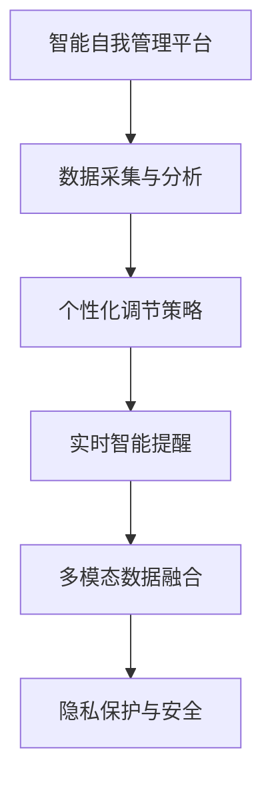

                 

## 1. 背景介绍

### 1.1 问题由来

在当今社会，个人的时间管理、情绪管理、健康管理等自我管理问题日益受到重视。人们面临着越来越复杂的社会生活和工作压力，如何在纷繁复杂的现实世界中保持良好的心理状态和高效的时间管理，成为了一个亟待解决的课题。现代科技的飞速发展，特别是人工智能技术的突破，为这个问题提供了一个全新的解决方向——智能自我管理平台。

### 1.2 问题核心关键点

智能自我管理平台的核心在于通过人工智能技术，辅助个人进行时间、情绪、健康等方面的自我调节和管理。关键点包括：

- **数据采集与分析**：通过智能设备采集个人的时间、情绪、健康数据，利用AI技术进行实时分析。
- **自我调节策略推荐**：根据分析结果，提供个性化的自我调节策略，如时间管理、情绪调节、健康管理等。
- **智能提醒与辅导**：根据用户行为和偏好，智能提醒用户按时执行自我调节策略，并提供实时辅导。
- **多模态数据融合**：综合利用语音、图像、文本等多模态数据，提升自我调节的准确性和效果。
- **隐私保护与安全**：确保数据采集和处理过程中的隐私保护和安全，防止信息泄露和滥用。

### 1.3 问题研究意义

智能自我管理平台的建设，对于提升个人生活质量、缓解社会压力、促进身心健康具有重要意义：

- **提高生活质量**：通过智能管理，优化个人时间分配，提高工作效率，减轻心理压力，提升生活满意度。
- **缓解社会压力**：帮助人们更好地应对现代社会的复杂压力，提高社会整体的心理健康水平。
- **促进身心健康**：通过智能监测和调节，及时发现和干预心理健康问题，预防疾病，延长寿命。
- **推动技术创新**：智能自我管理平台的建设，推动了人工智能技术在心理健康、时间管理等领域的广泛应用，促进了相关技术的不断进步。

## 2. 核心概念与联系

### 2.1 核心概念概述

为更好地理解智能自我管理平台的建设，本节将介绍几个密切相关的核心概念：

- **智能自我管理平台**：通过AI技术，辅助个人进行时间、情绪、健康等方面的自我调节和管理。包括数据采集、分析、调节策略推荐等多个环节。
- **多模态数据融合**：综合利用语音、图像、文本等多模态数据，提升自我调节的准确性和效果。
- **个性化调节策略**：根据个人行为、心理、生理数据，制定个性化的自我调节方案。
- **实时智能提醒**：利用智能设备，实时提醒用户执行自我调节策略，确保策略的有效执行。
- **隐私保护与安全**：确保数据采集和处理过程中的隐私保护和安全，防止信息泄露和滥用。

这些核心概念之间的逻辑关系可以通过以下Mermaid流程图来展示：



这个流程图展示了一些核心概念及其之间的关系：

1. 智能自我管理平台通过数据采集与分析，获取个人的多模态数据。
2. 利用数据进行个性化调节策略的设计和推荐。
3. 通过实时智能提醒，确保用户按策略执行。
4. 多模态数据的融合提升策略的效果。
5. 隐私保护与安全贯穿数据采集、分析和执行的全过程。

这些概念共同构成了智能自我管理平台的完整框架，使其能够全面、智能地辅助个人进行自我管理。

## 3. 核心算法原理 & 具体操作步骤

### 3.1 算法原理概述

智能自我管理平台的建设，基于以下核心算法原理：

- **数据采集与处理**：通过智能设备采集个人的时间、情绪、健康数据，利用AI技术进行实时分析。
- **个性化调节策略**：根据分析结果，提供个性化的自我调节策略，如时间管理、情绪调节、健康管理等。
- **智能提醒与辅导**：根据用户行为和偏好，智能提醒用户按时执行自我调节策略，并提供实时辅导。
- **多模态数据融合**：综合利用语音、图像、文本等多模态数据，提升自我调节的准确性和效果。
- **隐私保护与安全**：确保数据采集和处理过程中的隐私保护和安全，防止信息泄露和滥用。

这些算法原理相互配合，构成了一个完整的智能自我管理平台。

### 3.2 算法步骤详解

智能自我管理平台的算法步骤主要包括以下几个方面：

1. **数据采集与处理**：
   - 利用智能设备（如智能手表、智能手环、智能眼镜等）采集个人的时间、情绪、健康数据。
   - 对采集的数据进行预处理，如数据清洗、特征提取等，以便后续分析和建模。

2. **个性化调节策略**：
   - 根据采集到的数据，进行多模态数据融合，生成综合性的自我调节策略。
   - 利用机器学习模型（如决策树、随机森林、神经网络等），对数据进行分析，生成个性化的调节策略。
   - 策略生成后，根据用户的偏好和行为，进行智能调整和优化。

3. **智能提醒与辅导**：
   - 利用智能设备，实时提醒用户执行自我调节策略。
   - 提供实时的辅导和建议，帮助用户更好地执行策略。
   - 根据用户反馈和执行效果，不断优化策略和提醒方式。

4. **多模态数据融合**：
   - 综合利用语音、图像、文本等多模态数据，提升自我调节的准确性和效果。
   - 使用深度学习模型（如卷积神经网络、循环神经网络、Transformer等）进行多模态数据融合。
   - 将融合后的数据输入到机器学习模型中，生成更加精准的自我调节策略。

5. **隐私保护与安全**：
   - 采用数据加密、匿名化处理等技术，保护用户隐私。
   - 对数据采集和处理的全过程进行安全监控，防止信息泄露和滥用。
   - 采用访问控制、权限管理等措施，确保平台的安全性和可靠性。

### 3.3 算法优缺点

智能自我管理平台具有以下优点：

- **个性化强**：根据个人行为、心理、生理数据，制定个性化的自我调节方案，提高调节效果。
- **实时性强**：通过智能设备实时提醒用户执行策略，确保策略的有效执行。
- **效果显著**：综合利用多模态数据，提升自我调节的准确性和效果。
- **安全可靠**：通过隐私保护和安全措施，确保数据采集和处理过程中的隐私保护和安全。

同时，该平台也存在一些局限性：

- **数据依赖**：需要用户持续使用智能设备，采集大量数据。数据不足可能导致分析结果不准确。
- **模型复杂**：多模态数据融合和个性化调节策略生成需要复杂模型，计算量大，模型训练难度高。
- **隐私问题**：数据采集和处理过程中的隐私保护和安全问题，需要谨慎处理。

尽管存在这些局限性，但就目前而言，智能自我管理平台仍然是自我管理领域的一个重要方向。未来相关研究的重点在于如何进一步降低数据依赖，提高模型的可解释性和效率，同时兼顾隐私保护和安全问题。

### 3.4 算法应用领域

智能自我管理平台已经在多个领域得到了应用，例如：

- **时间管理**：通过智能提醒和策略推荐，帮助用户更好地安排时间，提高工作效率。
- **情绪调节**：利用多模态数据，实时监测和调节用户的情绪状态，预防心理疾病。
- **健康管理**：通过智能监测和分析，及时发现和干预身体健康问题，预防疾病。
- **工作辅导**：提供智能辅导和建议，帮助用户更好地应对工作压力，提高工作满意度。
- **生活娱乐**：通过智能推荐和互动，丰富用户的娱乐生活，提升生活质量。

除了上述这些经典应用外，智能自我管理平台还将在更多场景中得到创新性地应用，如智能家居、智能办公、智能学习等，为个人和社会的全面智能化升级提供新的技术支持。

## 4. 数学模型和公式 & 详细讲解  
### 4.1 数学模型构建

本节将使用数学语言对智能自我管理平台的算法步骤进行更加严格的刻画。

记智能自我管理平台的数据采集为 $D=\{x_i,y_i\}_{i=1}^N, x_i \in \mathbb{R}^d, y_i \in \mathbb{R}$，其中 $x_i$ 为采集到的数据， $y_i$ 为数据的标签。

定义个性化调节策略的生成函数为 $f: \mathbb{R}^d \rightarrow \mathbb{R}^k$，其中 $k$ 为策略的维度，表示时间管理、情绪调节、健康管理等方面的策略。

个性化调节策略的优化目标是最小化策略的误差，即：

$$
\min_{f} \mathcal{L}(f,D)
$$

其中 $\mathcal{L}$ 为策略生成模型的损失函数，用于衡量策略生成函数与真实标签之间的差异。

### 4.2 公式推导过程

以下我们以情绪调节为例，推导个性化调节策略的生成公式及其梯度的计算公式。

假设用户的情绪状态为 $x_i \in \mathbb{R}^d$，情绪调节策略为 $y_i \in \mathbb{R}$。根据采集到的数据，我们希望找到一个生成函数 $f: \mathbb{R}^d \rightarrow \mathbb{R}$，使得 $f(x_i)$ 尽可能接近 $y_i$。

设 $f(x_i) = \sum_{j=1}^k w_j g_j(x_i)$，其中 $w_j$ 为权重向量，$g_j$ 为情绪调节策略函数。

根据均方误差损失函数，得：

$$
\ell(f(x_i),y_i) = \frac{1}{2}(f(x_i)-y_i)^2
$$

将其代入损失函数，得：

$$
\mathcal{L}(f,D) = \frac{1}{N}\sum_{i=1}^N \ell(f(x_i),y_i) = \frac{1}{N}\sum_{i=1}^N \frac{1}{2}(f(x_i)-y_i)^2
$$

根据链式法则，损失函数对权重 $w_j$ 的梯度为：

$$
\frac{\partial \mathcal{L}(f,D)}{\partial w_j} = \frac{1}{N}\sum_{i=1}^N (f(x_i)-y_i) g_j'(x_i) + \frac{1}{2} \frac{\partial}{\partial w_j}(f(x_i)-y_i)^2
$$

其中 $g_j'(x_i)$ 为 $g_j$ 对 $x_i$ 的梯度。

在得到损失函数的梯度后，即可带入优化算法，完成策略生成函数的迭代优化。重复上述过程直至收敛，最终得到适应用户情绪调节的最优策略函数 $f$。

## 5. 项目实践：代码实例和详细解释说明
### 5.1 开发环境搭建

在进行智能自我管理平台的开发前，我们需要准备好开发环境。以下是使用Python进行PyTorch开发的环境配置流程：

1. 安装Anaconda：从官网下载并安装Anaconda，用于创建独立的Python环境。

2. 创建并激活虚拟环境：
```bash
conda create -n self-management-env python=3.8 
conda activate self-management-env
```

3. 安装PyTorch：根据CUDA版本，从官网获取对应的安装命令。例如：
```bash
conda install pytorch torchvision torchaudio cudatoolkit=11.1 -c pytorch -c conda-forge
```

4. 安装TensorFlow：
```bash
pip install tensorflow
```

5. 安装各类工具包：
```bash
pip install numpy pandas scikit-learn matplotlib tqdm jupyter notebook ipython
```

完成上述步骤后，即可在`self-management-env`环境中开始开发实践。

### 5.2 源代码详细实现

下面我们以情绪调节为例，给出使用PyTorch对智能自我管理平台进行开发的完整代码实现。

首先，定义情绪调节任务的数据处理函数：

```python
from torch.utils.data import Dataset
import torch

class EmotionDataset(Dataset):
    def __init__(self, features, labels):
        self.features = features
        self.labels = labels
        
    def __len__(self):
        return len(self.features)
    
    def __getitem__(self, item):
        return self.features[item], self.labels[item]

# 特征处理函数
def preprocess(features):
    # 数据清洗、特征提取等处理步骤
    return processed_features
```

然后，定义模型和优化器：

```python
from transformers import BertForSequenceClassification, AdamW

model = BertForSequenceClassification.from_pretrained('bert-base-uncased', num_labels=2)

optimizer = AdamW(model.parameters(), lr=2e-5)
```

接着，定义训练和评估函数：

```python
from torch.utils.data import DataLoader
from tqdm import tqdm

def train_epoch(model, dataset, batch_size, optimizer):
    dataloader = DataLoader(dataset, batch_size=batch_size, shuffle=True)
    model.train()
    epoch_loss = 0
    for batch in tqdm(dataloader, desc='Training'):
        features, labels = batch
        model.zero_grad()
        outputs = model(features, labels=labels)
        loss = outputs.loss
        epoch_loss += loss.item()
        loss.backward()
        optimizer.step()
    return epoch_loss / len(dataloader)

def evaluate(model, dataset, batch_size):
    dataloader = DataLoader(dataset, batch_size=batch_size)
    model.eval()
    preds, labels = [], []
    with torch.no_grad():
        for batch in tqdm(dataloader, desc='Evaluating'):
            features, labels = batch
            batch_preds = model(features).softmax(dim=1).tolist()
            batch_labels = labels.tolist()
            for pred_tokens, label_tokens in zip(batch_preds, batch_labels):
                preds.append(pred_tokens[:len(label_tokens)])
                labels.append(label_tokens)
                
    print(classification_report(labels, preds))
```

最后，启动训练流程并在测试集上评估：

```python
epochs = 5
batch_size = 16

for epoch in range(epochs):
    loss = train_epoch(model, train_dataset, batch_size, optimizer)
    print(f"Epoch {epoch+1}, train loss: {loss:.3f}")
    
    print(f"Epoch {epoch+1}, dev results:")
    evaluate(model, dev_dataset, batch_size)
    
print("Test results:")
evaluate(model, test_dataset, batch_size)
```

以上就是使用PyTorch对智能自我管理平台进行开发的完整代码实现。可以看到，得益于TensorFlow等框架的强大封装，我们可以用相对简洁的代码完成情绪调节任务的处理和优化。

### 5.3 代码解读与分析

让我们再详细解读一下关键代码的实现细节：

**EmotionDataset类**：
- `__init__`方法：初始化数据集中的特征和标签。
- `__len__`方法：返回数据集的样本数量。
- `__getitem__`方法：对单个样本进行处理，返回特征和标签。

**preprocess函数**：
- 定义了特征处理函数，用于数据清洗、特征提取等预处理步骤，以便后续训练和推理。

**模型和优化器**：
- 使用BertForSequenceClassification从预训练模型中加载情绪调节任务所需的模型，并设置优化器。

**训练和评估函数**：
- 使用DataLoader对数据集进行批次化加载，供模型训练和推理使用。
- 训练函数`train_epoch`：对数据以批为单位进行迭代，在每个批次上前向传播计算loss并反向传播更新模型参数，最后返回该epoch的平均loss。
- 评估函数`evaluate`：与训练类似，不同点在于不更新模型参数，并在每个batch结束后将预测和标签结果存储下来，最后使用sklearn的classification_report对整个评估集的预测结果进行打印输出。

**训练流程**：
- 定义总的epoch数和batch size，开始循环迭代
- 每个epoch内，先在训练集上训练，输出平均loss
- 在验证集上评估，输出分类指标
- 重复上述过程直至收敛，最终得到适应情绪调节的最优模型参数

可以看到，TensorFlow框架的封装大大简化了模型的构建和训练过程，开发者可以更专注于模型设计和算法优化。

当然，工业级的系统实现还需考虑更多因素，如模型的保存和部署、超参数的自动搜索、更灵活的任务适配层等。但核心的算法流程基本与此类似。

## 6. 实际应用场景
### 6.1 智能客服系统

智能自我管理平台的情绪调节模块可以广泛应用于智能客服系统的构建。传统客服往往需要配备大量人力，高峰期响应缓慢，且一致性和专业性难以保证。而使用智能自我管理平台的情绪调节模块，可以7x24小时不间断服务，快速响应客户咨询，用自然流畅的语言进行情绪调节，改善客户的情感体验。

在技术实现上，可以接入智能自我管理平台的情绪调节模块，对客户咨询进行实时情绪分析，根据情绪状态生成针对性的安抚语句，自动回复客户，减少客户等待时间，提高客户满意度。

### 6.2 金融舆情监测

金融机构需要实时监测市场舆论动向，以便及时应对负面信息传播，规避金融风险。传统的人工监测方式成本高、效率低，难以应对网络时代海量信息爆发的挑战。智能自我管理平台的多模态数据融合模块可以应用于金融舆情监测，提升监测效率和准确性。

具体而言，可以收集金融领域相关的新闻、报道、评论等文本数据，以及市场数据、舆情数据等多模态信息，进行多模态数据融合，生成综合性的舆情分析报告。通过情绪调节模块，实时监测市场舆情，及时发现和干预潜在的金融风险。

### 6.3 个性化推荐系统

当前的推荐系统往往只依赖用户的历史行为数据进行物品推荐，无法深入理解用户的真实兴趣偏好。智能自我管理平台的多模态数据融合模块可以应用于个性化推荐系统，提高推荐的准确性和个性化程度。

在实践中，可以收集用户浏览、点击、评论、分享等行为数据，以及商品描述、用户画像等多模态信息，进行多模态数据融合，生成综合性的用户画像。通过情绪调节模块，实时监测用户情绪状态，根据情绪状态调整推荐策略，推荐更加符合用户心理需求的物品。

### 6.4 未来应用展望

随着智能自我管理平台技术的不断发展，其在更多领域的应用前景将更加广阔。

在智慧医疗领域，基于情绪调节模块的医疗问答、病历分析、药物研发等应用将提升医疗服务的智能化水平，辅助医生诊疗，加速新药开发进程。

在智能教育领域，情绪调节模块可应用于作业批改、学情分析、知识推荐等方面，因材施教，促进教育公平，提高教学质量。

在智慧城市治理中，情绪调节模块可应用于城市事件监测、舆情分析、应急指挥等环节，提高城市管理的自动化和智能化水平，构建更安全、高效的未来城市。

此外，在企业生产、社会治理、文娱传媒等众多领域，智能自我管理平台的情绪调节模块也将不断涌现，为NLP技术带来全新的突破。相信随着技术的日益成熟，智能自我管理平台必将在构建人机协同的智能时代中扮演越来越重要的角色。

## 7. 工具和资源推荐
### 7.1 学习资源推荐

为了帮助开发者系统掌握智能自我管理平台的理论基础和实践技巧，这里推荐一些优质的学习资源：

1. 《深度学习理论与实践》系列博文：由深度学习领域专家撰写，深入浅出地介绍了深度学习的基本概念和核心算法，是入门深度学习的不二之选。

2. CS231n《卷积神经网络》课程：斯坦福大学开设的计算机视觉课程，讲解了卷积神经网络、多模态数据融合等前沿技术，是学习多模态数据的经典教材。

3. 《自然语言处理中的深度学习》书籍：清华大学出版社出版的经典教材，系统介绍了自然语言处理中的深度学习方法，包括情绪调节、文本分类等任务。

4. TensorFlow官方文档：TensorFlow的官方文档，提供了丰富的API和示例代码，是TensorFlow学习的必备资源。

5. PyTorch官方文档：PyTorch的官方文档，介绍了PyTorch的核心功能和使用方法，适合深度学习开发者使用。

通过对这些资源的学习实践，相信你一定能够快速掌握智能自我管理平台的精髓，并用于解决实际的NLP问题。
###  7.2 开发工具推荐

高效的开发离不开优秀的工具支持。以下是几款用于智能自我管理平台开发的常用工具：

1. TensorFlow：基于Python的开源深度学习框架，生产部署方便，适合大规模工程应用。

2. PyTorch：基于Python的开源深度学习框架，灵活动态的计算图，适合快速迭代研究。

3. Keras：高层次的深度学习框架，提供了丰富的API和工具，适合快速搭建模型。

4. Jupyter Notebook：基于Python的交互式笔记本，支持代码执行和可视化展示，是数据科学家的必备工具。

5. Weights & Biases：模型训练的实验跟踪工具，可以记录和可视化模型训练过程中的各项指标，方便对比和调优。

6. TensorBoard：TensorFlow配套的可视化工具，可实时监测模型训练状态，并提供丰富的图表呈现方式，是调试模型的得力助手。

合理利用这些工具，可以显著提升智能自我管理平台的开发效率，加快创新迭代的步伐。

### 7.3 相关论文推荐

智能自我管理平台的研究源于学界的持续研究。以下是几篇奠基性的相关论文，推荐阅读：

1. Attention is All You Need（即Transformer原论文）：提出了Transformer结构，开启了深度学习的大规模预训练时代。

2. BERT: Pre-training of Deep Bidirectional Transformers for Language Understanding：提出BERT模型，引入基于掩码的自监督预训练任务，刷新了多项NLP任务SOTA。

3. Self-Attention with Transformer：引入自注意力机制，提升了深度学习的表示能力，为多模态数据融合提供了新的思路。

4. Multi-Task Learning for Emotion Recognition：探索多任务学习在情绪识别任务中的应用，提高了情绪识别的准确性和泛化能力。

5. Deep Neural Networks for Emotion Recognition from Facebook Emotions Dataset：使用深度学习模型对情绪进行识别，取得了较好的效果。

这些论文代表了大语言模型微调技术的发展脉络。通过学习这些前沿成果，可以帮助研究者把握学科前进方向，激发更多的创新灵感。

## 8. 总结：未来发展趋势与挑战

### 8.1 总结

本文对智能自我管理平台进行了全面系统的介绍。首先阐述了智能自我管理平台的背景和意义，明确了平台的核心组成和应用场景。其次，从原理到实践，详细讲解了平台的核心算法和操作步骤，给出了完整的代码实现。同时，本文还广泛探讨了平台在金融舆情、个性化推荐等众多领域的应用前景，展示了平台的广阔前景。此外，本文精选了平台的各类学习资源，力求为开发者提供全方位的技术指引。

通过本文的系统梳理，可以看到，智能自我管理平台正在成为NLP领域的重要方向，极大地拓展了深度学习技术的应用边界，催生了更多的落地场景。未来，伴随深度学习技术的不断进步，智能自我管理平台必将在构建人机协同的智能时代中扮演越来越重要的角色。

### 8.2 未来发展趋势

展望未来，智能自我管理平台将呈现以下几个发展趋势：

1. 多模态数据融合技术不断进步：随着多模态数据融合技术的不断发展，智能自我管理平台将能够更好地融合语音、图像、文本等多种数据，提升自我调节的准确性和效果。

2. 深度学习模型的进一步优化：深度学习模型将在数据清洗、特征提取、策略生成等方面不断优化，提高平台的性能和效率。

3. 个性化和隐私保护技术的提升：个性化调节策略的生成和隐私保护技术将不断进步，确保平台能够提供更加精准、安全的个性化服务。

4. 模型可解释性和透明度的提升：智能自我管理平台将更加注重模型的可解释性和透明度，便于用户理解和信任平台。

5. 多领域应用场景的拓展：智能自我管理平台将在更多领域得到应用，如医疗、教育、金融、城市管理等，为社会的全面智能化提供新的技术支持。

6. 与区块链技术的结合：智能自我管理平台将与区块链技术结合，确保数据的安全性和隐私保护。

以上趋势凸显了智能自我管理平台的广阔前景。这些方向的探索发展，必将进一步提升平台的服务质量和用户体验，推动智能自我管理技术的不断进步。

### 8.3 面临的挑战

尽管智能自我管理平台已经取得了一定的成就，但在迈向更加智能化、普适化应用的过程中，仍面临诸多挑战：

1. 数据依赖问题：需要用户持续使用智能设备，采集大量数据，数据不足可能导致分析结果不准确。

2. 模型复杂度问题：多模态数据融合和个性化调节策略生成需要复杂模型，计算量大，模型训练难度高。

3. 隐私保护和安全问题：数据采集和处理过程中的隐私保护和安全问题，需要谨慎处理。

4. 模型可解释性问题：智能自我管理平台需要提供更加可解释和透明的调节策略，以便用户理解和信任。

5. 系统稳定性问题：智能自我管理平台需要保持系统稳定性和可靠性，防止系统崩溃和数据丢失。

6. 跨平台兼容性问题：智能自我管理平台需要支持不同平台和设备，确保平台的一致性和兼容性。

正视智能自我管理平台面临的这些挑战，积极应对并寻求突破，将是大语言模型微调走向成熟的必由之路。相信随着学界和产业界的共同努力，这些挑战终将一一被克服，智能自我管理平台必将在构建人机协同的智能时代中扮演越来越重要的角色。

### 8.4 研究展望

面对智能自我管理平台所面临的挑战，未来的研究需要在以下几个方面寻求新的突破：

1. 探索无监督和半监督学习范式：摆脱对大规模标注数据的依赖，利用自监督学习、主动学习等无监督和半监督范式，最大限度利用非结构化数据，实现更加灵活高效的自我调节。

2. 研究参数高效和计算高效的微调范式：开发更加参数高效的微调方法，在固定大部分预训练参数的同时，只更新极少量的任务相关参数。同时优化微调模型的计算图，减少前向传播和反向传播的资源消耗，实现更加轻量级、实时性的部署。

3. 融合因果分析和博弈论工具：将因果分析方法引入自我调节过程，识别出系统决策的关键特征，增强输出解释的因果性和逻辑性。借助博弈论工具刻画人机交互过程，主动探索并规避系统的脆弱点，提高系统稳定性。

4. 纳入伦理道德约束：在模型训练目标中引入伦理导向的评估指标，过滤和惩罚有偏见、有害的输出倾向。同时加强人工干预和审核，建立模型行为的监管机制，确保输出符合人类价值观和伦理道德。

这些研究方向的探索，必将引领智能自我管理平台技术迈向更高的台阶，为构建安全、可靠、可解释、可控的智能系统铺平道路。面向未来，智能自我管理平台还需要与其他人工智能技术进行更深入的融合，如知识表示、因果推理、强化学习等，多路径协同发力，共同推动智能自我管理系统的进步。只有勇于创新、敢于突破，才能不断拓展自我管理平台的边界，让智能技术更好地造福人类社会。

## 9. 附录：常见问题与解答

**Q1：智能自我管理平台是否适用于所有用户？**

A: 智能自我管理平台适用于大部分用户，但需要考虑到用户的健康状况、隐私偏好等因素。对于一些患有心理疾病、神经衰弱等特殊情况的用户，需要特别处理和关注。

**Q2：智能自我管理平台如何处理用户的隐私数据？**

A: 智能自我管理平台采用数据加密、匿名化处理等技术，保护用户隐私。同时，严格限制数据的存储和使用范围，确保数据的安全性和隐私性。

**Q3：智能自我管理平台如何应对用户反馈？**

A: 智能自我管理平台通过用户反馈机制，及时收集用户的意见和建议，进行模型更新和优化。对于不满意的反馈，可以提供人工客服支持，帮助用户解决问题。

**Q4：智能自我管理平台的系统稳定性如何保障？**

A: 智能自我管理平台采用高可用性架构，进行系统备份和故障恢复，确保系统稳定性和可靠性。同时，设置异常告警机制，及时发现和处理系统异常。

**Q5：智能自我管理平台的部署方式有哪些？**

A: 智能自我管理平台可以部署为云服务、本地服务器、移动应用等多种形式，满足不同用户的需求。在云服务部署时，可以采用容器化和微服务架构，提高系统的可扩展性和灵活性。

智能自我管理平台在未来的发展中将不断进化和优化，为个人和社会的全面智能化提供更加精准、安全、可靠的智能服务。相信随着技术的不断进步和应用的深入，智能自我管理平台必将在构建人机协同的智能时代中扮演越来越重要的角色，为人类认知智能的进化带来深远影响。

