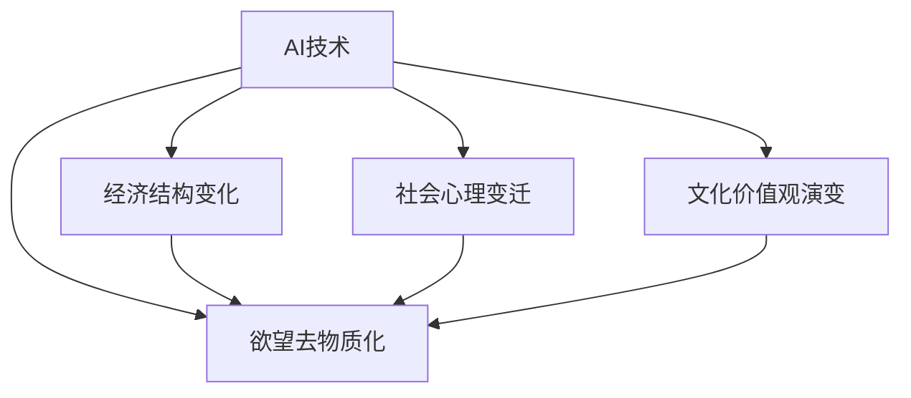
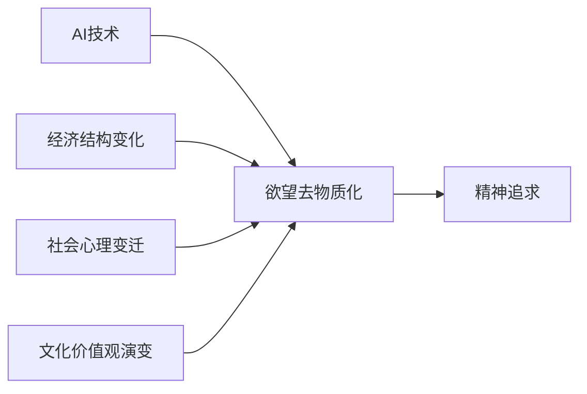

                 

## 1. 背景介绍

### 1.1 问题由来
在人类文明漫长的历史长河中，欲望始终是推动社会进步的动力。从原始狩猎到现代科技，欲望不仅驱动着人类的生理需求，也塑造着我们的精神世界。然而，在人工智能(AI)时代，欲望的形态与追求方式正在发生深刻变革。

AI技术的迅速发展，正在让欲望去物质化，即从物质需求的追求转化为精神追求。这种变化不仅关乎人类社会的物质生产方式，更关乎我们的思维模式、价值观念乃至文化形态。本文将深入探讨这一转变背后的驱动因素、主要表现以及未来趋势，以期为人类社会在AI时代的精神追求提供新的思考方向。

### 1.2 问题核心关键点
AI时代欲望去物质化的主要核心关键点包括：

1. **技术进步**：AI技术的发展，特别是深度学习、自然语言处理、计算机视觉等领域的技术突破，为欲望的去物质化提供了可能。
2. **经济结构变化**：随着生产力的提升和物质财富的积累，人类的需求重心从基本的物质需求逐渐向精神需求转移。
3. **社会心理变迁**：数字化、网络化时代，人们的社交模式、消费习惯、娱乐方式等发生了显著变化，精神追求逐渐成为主导。
4. **文化价值观演变**：传统工业社会以物质生产为核心，而AI时代更强调个体价值、创意表达和精神满足。

## 2. 核心概念与联系

### 2.1 核心概念概述

要深入理解AI时代欲望去物质化的现象，首先需要明确几个核心概念：

1. **AI技术**：包括机器学习、深度学习、自然语言处理、计算机视觉等技术，是实现欲望去物质化的关键手段。
2. **欲望**：是人类对于物质和精神层面的需求和追求，是推动社会进步的内在动力。
3. **去物质化**：指的是从物质需求追求向精神需求追求的转变，即AI技术帮助人类在精神层面的追求更加高效、丰富。
4. **精神追求**：包括自我实现、创造性、人际互动、认知提升等精神需求，是AI时代欲望去物质化的主要表现。

这些核心概念之间的逻辑关系可以通过以下Mermaid流程图来展示：



这个流程图展示了AI技术与欲望去物质化之间的内在联系，以及经济、社会、文化等多个因素对欲望去物质化的影响。

### 2.2 核心概念原理和架构的 Mermaid 流程图

为了更直观地展示欲望去物质化的原理和架构，我们可以构建一个简化的流程图，如下所示：



这个流程图展示了AI技术通过改变经济结构、社会心理和文化价值观，最终促使欲望去物质化，并推动精神追求的实现。

## 3. 核心算法原理 & 具体操作步骤

### 3.1 算法原理概述

欲望去物质化主要通过AI技术来实现，其核心算法原理可以概括为以下几个步骤：

1. **数据收集与处理**：通过AI技术，大规模收集和处理用户的行为数据、情感数据、兴趣数据等，构建出丰富且高效的数据集。
2. **模型训练与优化**：使用机器学习、深度学习等技术，训练出能够理解用户需求和偏好的模型，并进行优化，以提高预测和推荐的准确性。
3. **个性化服务与反馈**：根据用户的历史行为和实时反馈，提供个性化的推荐和服务，不断调整和优化算法，以更好地满足用户的精神需求。
4. **用户体验优化**：通过增强现实(AR)、虚拟现实(VR)、增强现实沉浸式互动等技术，提升用户体验，实现更深层次的精神满足。

### 3.2 算法步骤详解

具体而言，欲望去物质化的算法步骤可以如下展开：

1. **数据采集与预处理**：
   - 利用网络爬虫、社交媒体API等技术，收集用户的行为数据、情感数据、兴趣数据等。
   - 对数据进行清洗、归一化、特征提取等预处理操作，构建出高质量的数据集。

2. **模型训练与优化**：
   - 使用机器学习算法（如线性回归、逻辑回归、随机森林等）或深度学习算法（如神经网络、卷积神经网络、循环神经网络等）进行模型训练。
   - 通过交叉验证、正则化等技术，优化模型参数，提高预测准确率。

3. **个性化推荐与反馈**：
   - 使用协同过滤、基于内容的推荐、基于模型的推荐等方法，提供个性化的推荐和服务。
   - 收集用户的反馈数据，如点击率、评分、评论等，用于进一步优化模型。

4. **用户体验优化**：
   - 利用AR/VR等技术，提供沉浸式体验，增强用户的精神满足感。
   - 结合用户反馈，不断调整和优化算法，提升用户体验。

### 3.3 算法优缺点

欲望去物质化算法具有以下优点：

1. **高效性**：通过大数据和AI技术，能够快速处理和分析大量用户数据，提供个性化推荐和服务。
2. **准确性**：机器学习、深度学习等算法能够准确预测用户需求和偏好，提高推荐的准确性。
3. **可扩展性**：算法能够处理大规模数据集，适应不同场景和需求。
4. **灵活性**：通过不断的反馈和优化，算法能够适应用户需求的变化，提供更贴合的服务。

同时，算法也存在以下缺点：

1. **隐私风险**：收集和处理大量用户数据，可能存在隐私泄露的风险。
2. **过度依赖**：过度依赖AI算法，可能导致用户失去自我决策能力。
3. **技术门槛**：需要高水平的技术能力和丰富的数据资源，普通人难以轻易实现。
4. **伦理问题**：算法可能存在偏见，加剧社会不公，引发伦理争议。

### 3.4 算法应用领域

欲望去物质化算法已经在多个领域得到了广泛应用，主要包括以下几个方面：

1. **电子商务**：通过个性化推荐系统，提升用户体验，增加用户粘性和转化率。
2. **内容推荐**：如Netflix、YouTube等平台，根据用户兴趣推荐电影、电视剧、视频等。
3. **社交媒体**：如Facebook、Instagram等，通过兴趣标签推荐内容，增加用户互动。
4. **金融服务**：如股票投资、理财规划等，根据用户行为和偏好提供个性化服务。
5. **医疗健康**：如个性化健康管理、在线咨询等，提升用户的健康管理和医疗服务体验。
6. **教育培训**：如在线学习平台，根据用户学习习惯和知识水平提供个性化课程和推荐。

## 4. 数学模型和公式 & 详细讲解 & 举例说明

### 4.1 数学模型构建

欲望去物质化算法的数学模型主要涉及以下几个方面：

1. **数据集构建**：
   - 用户行为数据：如浏览记录、购买记录、搜索记录等。
   - 用户情感数据：如评分、评论、情感分析等。
   - 用户兴趣数据：如标签、关键词、社交关系等。

2. **模型训练**：
   - 协同过滤模型：基于用户行为数据，通过计算用户间的相似度，推荐相似用户喜欢的商品或内容。
   - 基于内容的推荐模型：根据商品或内容的特征，计算用户对不同商品或内容的兴趣度。
   - 深度学习模型：如卷积神经网络(CNN)、循环神经网络(RNN)、长短期记忆网络(LSTM)等，用于提取和建模用户需求。

### 4.2 公式推导过程

以协同过滤模型为例，其基本公式如下：

$$
\text{预测评分} = \sum_{i=1}^{n} u_{ui} \times i_{vi}
$$

其中，$u_{ui}$ 表示用户$u$对项目$i$的评分，$i_{vi}$ 表示项目$i$的评分，$n$表示项目总数。

通过计算用户和项目之间的相似度，可以推导出推荐公式：

$$
\text{推荐评分} = \frac{\sum_{i=1}^{n} \text{预测评分}_i}{\sqrt{\sum_{i=1}^{n} \text{预测评分的平方}}}
$$

### 4.3 案例分析与讲解

以Netflix为例，其个性化推荐系统通过协同过滤模型，结合用户行为数据和项目元数据，实现了高效、准确的个性化推荐。具体步骤如下：

1. **数据收集**：收集用户历史观看数据、项目元数据、用户评分数据等。
2. **数据预处理**：对数据进行清洗、归一化、特征提取等操作，构建出高质量的数据集。
3. **模型训练**：使用协同过滤算法，训练出用户和项目之间的相似度矩阵。
4. **推荐生成**：根据用户历史行为和相似度矩阵，生成个性化推荐列表。
5. **反馈优化**：根据用户的点击、观看、评分等反馈数据，不断调整和优化模型。

## 5. 项目实践：代码实例和详细解释说明

### 5.1 开发环境搭建

为了实现欲望去物质化算法，首先需要搭建好开发环境。以下是Python开发环境的搭建步骤：

1. 安装Python：从官网下载并安装Python 3.x版本。
2. 安装Pip：在命令行中执行`pip install --upgrade pip`命令。
3. 安装依赖库：使用pip安装所需的依赖库，如Numpy、Pandas、Scikit-Learn等。

### 5.2 源代码详细实现

以下是一个简单的协同过滤推荐系统的Python代码实现：

```python
import pandas as pd
from scipy.spatial.distance import cosine

# 数据加载
data = pd.read_csv('user_item_ratings.csv')

# 用户评分矩阵
user_item = data.pivot_table(index='user', columns='item', values='rating')

# 计算用户和项目的相似度
similarity_matrix = pd.DataFrame(index=user_item.index, columns=user_item.columns)
for i in similarity_matrix.index:
    for j in similarity_matrix.columns:
        similarity_matrix.iat[i, j] = 1 - cosine(user_item[i].values, user_item[j].values)

# 推荐生成
def recommend(user_id, top_n=10):
    similarity_scores = similarity_matrix.loc[user_id].sort_values(ascending=False)
    recommended_items = list(similarity_scores.index[:top_n])
    return recommended_items

# 测试推荐系统
user_id = 'user1'
recommendations = recommend(user_id)
print(f'推荐列表: {recommendations}')
```

### 5.3 代码解读与分析

上述代码实现了基本的协同过滤推荐系统。关键步骤包括：

1. **数据加载**：通过Pandas库读取用户和项目的评分数据，构建出用户评分矩阵。
2. **相似度计算**：使用余弦相似度计算用户和项目之间的相似度，构建出相似度矩阵。
3. **推荐生成**：根据相似度矩阵，生成推荐列表。
4. **测试推荐**：使用一个用户ID测试推荐系统，输出推荐列表。

## 6. 实际应用场景

### 6.1 智能家居

智能家居领域通过欲望去物质化算法，实现了更加个性化、智能化的家居控制。用户可以通过语音、手势等自然交互方式，控制家中的各种设备，如灯光、温度、安防系统等。AI系统根据用户的习惯和偏好，提供个性化的家居方案，提升用户的生活体验。

### 6.2 虚拟健康助手

在医疗健康领域，欲望去物质化算法帮助构建虚拟健康助手，为用户提供个性化的健康管理和医疗服务。系统通过分析用户的健康数据、生活方式、疾病历史等，提供个性化的健康建议、饮食规划、运动计划等，帮助用户实现自我管理和预防疾病。

### 6.3 在线教育

在线教育平台通过欲望去物质化算法，提供个性化的学习体验。系统根据学生的学习习惯、知识水平、兴趣偏好等，推荐个性化的课程、练习、作业等，帮助学生更高效地学习和掌握知识。

### 6.4 未来应用展望

未来，欲望去物质化算法将在更多领域得到应用，为人类社会带来新的变化和机遇：

1. **全场景智能**：AI技术将渗透到生活的各个方面，从家居、医疗到教育、娱乐，实现全方位的智能化和个性化服务。
2. **情感计算**：通过情感分析、表情识别等技术，系统能够更好地理解和响应用户的情感需求，提供更加贴心和温馨的服务。
3. **人机协同**：AI系统与人类协同工作，提升工作效率，减少人工干预，实现更高效的生产模式。
4. **虚拟现实**：结合AR/VR技术，系统可以提供沉浸式的体验，提升用户的参与感和满足感。

## 7. 工具和资源推荐

### 7.1 学习资源推荐

为了帮助开发者系统掌握欲望去物质化算法的理论基础和实践技巧，这里推荐一些优质的学习资源：

1. **Coursera**：提供机器学习、深度学习、人工智能等相关课程，涵盖从基础到高级的内容。
2. **edX**：提供深度学习、自然语言处理等前沿课程，由知名高校和公司提供。
3. **Kaggle**：数据科学竞赛平台，提供大量实际数据集和挑战题目，帮助开发者实践和提升技能。
4. **GitHub**：代码托管平台，提供大量开源项目和代码示例，方便开发者学习和借鉴。

### 7.2 开发工具推荐

欲望去物质化算法的实现需要依赖多种工具和框架，以下是几款推荐的工具：

1. **TensorFlow**：开源的深度学习框架，支持大规模分布式计算，适用于复杂的AI模型。
2. **PyTorch**：开源的深度学习框架，灵活且易于使用，适用于快速原型开发和实验。
3. **scikit-learn**：开源的机器学习库，提供多种常用的机器学习算法和工具。
4. **Pandas**：开源的数据处理库，支持大规模数据的处理和分析。
5. **Jupyter Notebook**：开源的交互式开发环境，支持多语言的代码实现和数据可视化。

### 7.3 相关论文推荐

欲望去物质化算法的理论研究涉及多个领域，以下是几篇具有代表性的论文：

1. **Generative Adversarial Networks**：提出生成对抗网络(GAN)，用于生成高质量的模拟数据，提升AI系统的表现。
2. **Autoencoder for Multi-label Classification**：提出自编码器模型，用于多标签分类任务，提升算法的准确性和泛化能力。
3. **Deep Reinforcement Learning**：提出深度强化学习算法，用于智能决策和控制，提升系统的智能化水平。
4. **Transfer Learning for Automatic Speech Recognition**：提出迁移学习方法，用于自动语音识别任务，提升模型的泛化能力和鲁棒性。

## 8. 总结：未来发展趋势与挑战

### 8.1 总结

本文对欲望去物质化算法的原理和实践进行了全面系统的介绍。首先探讨了欲望去物质化的背景和意义，明确了AI技术在欲望去物质化中的关键作用。其次，从理论到实践，详细讲解了欲望去物质化算法的数学模型和核心步骤，给出了完整的代码实现示例。同时，本文还探讨了欲望去物质化算法在多个领域的应用前景，展示了其广阔的潜力和应用价值。

通过本文的系统梳理，可以看到，欲望去物质化算法正在成为AI技术在各个领域的重要应用范式，推动人类社会从物质追求向精神追求的转变。未来，伴随着AI技术的持续演进和跨领域融合，欲望去物质化算法必将在更多的应用场景中发挥作用，引领人类社会迈向更加智能化、个性化的未来。

### 8.2 未来发展趋势

展望未来，欲望去物质化算法将呈现以下几个发展趋势：

1. **技术融合**：随着AI技术的不断发展，欲望去物质化算法将与其他技术进行深度融合，如物联网、区块链、区块链等，实现更广泛的应用场景。
2. **数据驱动**：大规模数据的收集和处理将成为欲望去物质化算法的重要基础，通过不断优化算法，提升用户体验和服务质量。
3. **多模态融合**：结合语音、图像、视频等多种数据源，提升算法的感知能力和决策水平，实现更全面的智能化服务。
4. **人机协同**：通过增强现实、虚拟现实等技术，实现人机协同工作，提升效率和体验。
5. **情感计算**：通过情感分析、表情识别等技术，实现对用户情感的精准捕捉和响应，提升用户体验。

### 8.3 面临的挑战

尽管欲望去物质化算法已经取得了显著进展，但在迈向更广泛应用的过程中，仍面临诸多挑战：

1. **数据隐私**：大规模数据的收集和处理可能引发隐私泄露和伦理问题，需要加强数据保护和安全措施。
2. **技术瓶颈**：AI系统的复杂性和多样性带来了技术实现上的挑战，需要持续进行技术创新和突破。
3. **人机协同**：如何实现高效、自然的人机协同工作，提升用户体验，需要深入研究和实践。
4. **伦理道德**：AI系统可能存在偏见和歧视，引发伦理争议，需要建立健全的伦理审查机制。
5. **资源消耗**：大规模数据处理和深度学习模型的计算需求，带来了资源消耗和成本问题，需要优化资源使用。

### 8.4 研究展望

为了应对欲望去物质化算法面临的挑战，未来的研究方向可以包括：

1. **隐私保护**：开发隐私保护算法和技术，确保用户数据的隐私和安全。
2. **技术优化**：提升算法的效率和效果，降低资源消耗，提高用户体验。
3. **人机协同**：研究人机交互技术，提升人机协同的效率和自然度，实现更自然的用户交互。
4. **伦理研究**：建立健全的伦理审查机制，确保AI系统的公正性和道德性。
5. **跨领域融合**：探索AI系统与其他领域的融合，实现更广泛的应用场景。

## 9. 附录：常见问题与解答

**Q1：欲望去物质化算法是否适用于所有应用场景？**

A: 欲望去物质化算法在大多数应用场景中都能取得不错的效果，特别是对于数据量较大的应用。但对于一些数据量较小的应用，可能效果有限。

**Q2：如何平衡欲望去物质化算法的效率和准确性？**

A: 在实际应用中，可以通过以下方法平衡效率和准确性：
1. 选择合适的算法和模型，根据具体场景优化参数。
2. 采用分布式计算和并行处理，提高计算效率。
3. 对数据进行预处理和特征提取，减少计算量。
4. 合理设置超参数，平衡模型复杂度和效果。

**Q3：欲望去物质化算法的应用前景如何？**

A: 欲望去物质化算法在多个领域都具有广阔的应用前景，如智能家居、医疗健康、在线教育等。随着AI技术的不断发展，未来欲望去物质化算法将会在更多领域得到应用，为人类社会带来新的变化和机遇。

**Q4：欲望去物质化算法的实现过程中需要注意哪些问题？**

A: 欲望去物质化算法的实现过程中需要注意以下问题：
1. 数据隐私问题：确保用户数据的隐私和安全。
2. 算法复杂度：控制算法的复杂度，避免过拟合和资源消耗过大。
3. 人机协同：提升人机协同的效率和自然度，增强用户体验。
4. 伦理问题：确保AI系统的公正性和道德性。

**Q5：如何衡量欲望去物质化算法的性能？**

A: 欲望去物质化算法的性能可以通过以下指标进行衡量：
1. 准确率：衡量推荐系统的准确性，即推荐的商品或内容是否符合用户兴趣。
2. 召回率：衡量推荐系统覆盖面，即推荐系统是否能够覆盖用户感兴趣的商品或内容。
3. F1分数：综合考虑准确率和召回率，衡量推荐系统的综合表现。
4. 用户满意度：通过用户反馈和评价，衡量推荐系统的用户体验。

**Q6：欲望去物质化算法的实现过程中如何优化算法性能？**

A: 欲望去物质化算法的优化可以从以下几个方面进行：
1. 数据优化：进行数据清洗、归一化、特征提取等预处理操作，构建高质量的数据集。
2. 算法优化：选择合适的算法和模型，根据具体场景优化参数，避免过拟合和欠拟合。
3. 超参数优化：采用网格搜索、随机搜索等方法，寻找最优超参数组合，提升算法效果。
4. 模型压缩和优化：使用模型压缩、稀疏化存储等技术，减小模型大小，提升推理速度。

---

作者：禅与计算机程序设计艺术 / Zen and the Art of Computer Programming

