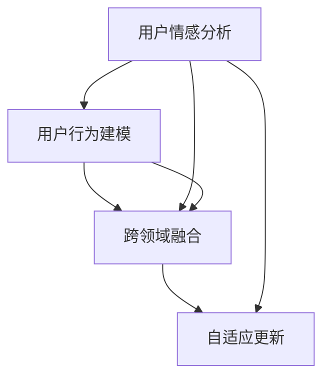

                 

# 欲望的算法：AI解码人类潜意识需求

> 关键词：欲望模型,潜意识需求,神经网络,深度学习,情感计算,推荐系统,市场预测,用户行为分析

## 1. 背景介绍

### 1.1 问题由来
在人工智能和计算机科学迅猛发展的今天，如何更好地理解和解释人类复杂的欲望和需求，成为了一个亟待解决的难题。欲望与需求作为驱动消费者行为的核心因素，直接影响着市场预测、产品推荐、广告投放等领域的决策。传统上，这一过程依赖于心理学、社会学、市场调研等学科的研究，但这些方法的成本高、速度慢，难以应对实时、多变的市场环境。

随着深度学习和大数据分析技术的兴起，人工智能开始在解码人类欲望和需求方面显示出巨大的潜力。通过分析用户行为数据、情感表达和社交互动等复杂信息，AI能够揭示出隐藏在行为背后的深层欲望和需求，从而为决策者提供数据驱动的洞察力。本文旨在探讨一种基于深度学习的欲望模型，旨在精确地解码和预测人类的潜意识需求，为各类应用场景提供决策依据。

### 1.2 问题核心关键点
欲望模型的核心在于构建一个能够理解人类欲望和需求的深度学习框架。这一框架需要具备以下几个关键点：
- **情感分析**：通过分析用户的情感表达，识别出用户的欲望情绪和状态。
- **行为建模**：利用用户的历史行为数据，建立行为模型以预测未来的行为趋势。
- **跨领域融合**：结合社交、经济、环境等多种因素，构建跨领域数据融合模型。
- **自适应更新**：采用自适应学习算法，实时更新欲望模型以适应市场环境变化。

这些核心关键点共同构成了一个全面的欲望模型框架，旨在从多维度、多模态数据中解码出人类的深层欲望和需求，为各类商业和学术应用提供强有力的支持。

### 1.3 问题研究意义
研究欲望模型对于理解人类行为和驱动市场决策具有重要意义：

1. **精准预测**：通过精确解码用户欲望，能够更准确地预测消费者行为和市场趋势，为商业决策提供科学依据。
2. **个性化推荐**：欲望模型能够根据用户的潜意识需求，提供个性化的产品推荐和广告投放，提升用户体验。
3. **智能营销**：结合情感分析和行为建模，可以制定更加精准的营销策略，提升广告效果和投资回报率。
4. **心理干预**：理解用户的欲望需求，可以设计有效的心理干预措施，改善社会福祉。
5. **市场优化**：通过对市场行为数据的深度分析，优化资源分配和产品布局，提高市场效率。

总之，欲望模型为解码人类潜意识需求提供了全新的技术路径，有望深刻改变决策者和商业组织的行为模式，推动社会和经济的全面进步。

## 2. 核心概念与联系

### 2.1 核心概念概述

欲望模型是一个多模态深度学习框架，旨在从用户的文本、行为、情感等多源数据中解码出深层次的欲望和需求。该模型由以下几个核心组件构成：

- **用户情感分析**：通过自然语言处理技术，分析用户的文本情感，识别出欲望情绪和状态。
- **用户行为建模**：利用时间序列分析、关联规则挖掘等方法，构建用户行为模型，预测未来的行为趋势。
- **跨领域融合**：结合社交网络、经济指标、环境因素等多种数据源，构建跨领域融合模型，提升欲望模型的泛化能力。
- **自适应更新**：采用在线学习算法，实时更新欲望模型以适应市场环境的动态变化。

这些组件通过深度学习技术进行有机整合，共同构建起一个能够理解人类欲望和需求的全面框架。

### 2.2 核心概念原理和架构的 Mermaid 流程图



上述流程图展示了欲望模型的基本架构。从用户情感分析开始，逐步构建用户行为模型和跨领域融合模型，最终通过自适应更新机制进行模型迭代和优化。

## 3. 核心算法原理 & 具体操作步骤
### 3.1 算法原理概述

欲望模型的核心算法原理基于深度学习，特别是卷积神经网络(CNN)和递归神经网络(RNN)等技术。该模型通过以下步骤解码用户欲望和需求：

1. **数据预处理**：收集和清洗用户的多源数据，包括文本、行为和情感等数据。
2. **情感分析**：通过自然语言处理技术，对用户文本进行情感分类，识别出用户的欲望情绪和状态。
3. **行为建模**：利用时间序列分析等方法，建立用户行为模型，预测未来的行为趋势。
4. **跨领域融合**：结合多种数据源，构建跨领域融合模型，提升模型的泛化能力。
5. **欲望解码**：结合情感分析和行为建模的结果，通过深度学习模型解码出用户的深层欲望和需求。
6. **自适应更新**：采用在线学习算法，实时更新欲望模型以适应市场环境的动态变化。

通过这一系列步骤，欲望模型能够从多维度和多模态数据中，解码出用户的深层欲望和需求，为决策者提供强有力的洞察力。

### 3.2 算法步骤详解

以下是欲望模型的具体操作步骤：

**Step 1: 数据预处理**

欲望模型的第一步是数据预处理。这一步骤包括：

- **数据收集**：从社交媒体、电商平台、广告系统等渠道收集用户数据，包括文本、行为和情感等数据。
- **数据清洗**：清洗数据中的噪声和缺失值，确保数据的质量和一致性。
- **数据归一化**：对数据进行归一化和标准化处理，以便于后续的深度学习模型训练。

**Step 2: 情感分析**

情感分析是欲望模型的核心步骤之一。这一步骤通过以下步骤完成：

- **文本预处理**：对用户文本进行分词、去除停用词、词干提取等预处理操作。
- **情感分类**：利用情感分类模型，如BERT、LSTM等，对用户文本进行情感分类，识别出用户的欲望情绪和状态。

**Step 3: 行为建模**

行为建模旨在通过用户的历史行为数据，建立行为模型以预测未来的行为趋势。这一步骤包括：

- **行为特征提取**：提取用户的行为特征，如浏览历史、购买记录、点击行为等。
- **行为时间序列分析**：利用时间序列分析方法，如ARIMA、LSTM等，构建用户行为模型，预测未来的行为趋势。

**Step 4: 跨领域融合**

跨领域融合旨在结合社交网络、经济指标、环境因素等多种数据源，构建跨领域融合模型，提升欲望模型的泛化能力。这一步骤包括：

- **数据融合**：将不同数据源的数据进行融合，生成多源数据集。
- **特征工程**：对多源数据进行特征工程，提取有意义的特征。
- **融合模型训练**：利用深度学习模型，如GAN、VAE等，训练跨领域融合模型。

**Step 5: 欲望解码**

欲望解码是欲望模型的最终步骤。这一步骤通过以下步骤完成：

- **情感与行为融合**：结合情感分析和行为建模的结果，构建融合向量，表示用户的深层欲望和需求。
- **深度学习解码**：利用深度学习模型，如CNN、RNN等，解码出用户的深层欲望和需求。
- **结果输出**：将解码结果输出为可解释的用户欲望需求，供决策者参考。

**Step 6: 自适应更新**

自适应更新旨在通过在线学习算法，实时更新欲望模型以适应市场环境的动态变化。这一步骤包括：

- **在线学习算法**：采用在线学习算法，如AdaGrad、Adam等，实时更新欲望模型。
- **模型迭代**：定期迭代模型参数，确保模型能够及时适应新的市场环境。

### 3.3 算法优缺点

欲望模型的优点在于：

- **多模态融合**：能够从多模态数据中解码出用户的深层欲望和需求，具有更高的准确性和泛化能力。
- **实时更新**：通过在线学习算法，实时更新模型以适应市场环境的动态变化，确保模型的时效性。
- **自适应学习**：采用自适应学习算法，能够自动调节模型参数，提高模型的适应性。

同时，欲望模型也存在一些缺点：

- **数据依赖性**：模型的性能高度依赖于数据的数量和质量，数据不足时效果可能不佳。
- **计算资源需求高**：模型需要大量的计算资源进行训练和推理，对硬件环境要求较高。
- **模型复杂度高**：模型结构复杂，训练和优化过程可能较为耗时。

尽管存在这些缺点，欲望模型仍然是大数据和深度学习时代的最佳选择，具有广泛的应用前景。

### 3.4 算法应用领域

欲望模型在多个领域具有广泛的应用前景：

- **推荐系统**：结合用户欲望需求，提供个性化的产品推荐和广告投放，提升用户体验。
- **市场预测**：通过解码用户欲望，预测市场趋势和消费者行为，为商业决策提供科学依据。
- **情感分析**：分析用户的情感表达，识别出欲望情绪和状态，提升情感计算的准确性。
- **用户行为分析**：利用行为建模和跨领域融合技术，深入理解用户行为模式，优化产品布局和市场策略。
- **广告投放优化**：结合用户欲望需求，优化广告投放策略，提高广告效果和投资回报率。
- **社交网络分析**：分析用户的社交网络行为，识别出用户的欲望情绪和状态，提升社交网络分析的深度。

欲望模型在多个领域的应用，有望深刻改变决策者和商业组织的行为模式，推动社会和经济的全面进步。

## 4. 数学模型和公式 & 详细讲解

### 4.1 数学模型构建

欲望模型的数学模型构建基于深度学习和多模态数据融合技术。假设用户情感表示为向量 $\mathbf{X} = [x_1, x_2, ..., x_n] \in \mathbb{R}^d$，用户行为表示为向量 $\mathbf{Y} = [y_1, y_2, ..., y_m] \in \mathbb{R}^e$，跨领域因素表示为向量 $\mathbf{Z} = [z_1, z_2, ..., z_k] \in \mathbb{R}^f$。则欲望模型的目标函数为：

$$
\min_{\theta} \left( \mathbf{W}_s \mathbf{X} + \mathbf{W}_b \mathbf{Y} + \mathbf{W}_c \mathbf{Z} - \mathbf{D} \right)^2
$$

其中 $\mathbf{W}_s, \mathbf{W}_b, \mathbf{W}_c$ 为模型参数，$\mathbf{D}$ 为目标向量，表示用户欲望需求。

### 4.2 公式推导过程

欲望模型的公式推导过程如下：

1. **情感分析**

情感分析的目标是识别用户文本中的情感表达，可以通过以下步骤实现：

$$
\mathbf{X} = \text{BERT}(\text{NLPIE}, \theta)
$$

其中 $\text{NLPIE}$ 为用户文本，$\theta$ 为BERT模型的参数。

2. **行为建模**

行为建模的目标是预测用户未来的行为趋势，可以通过时间序列分析方法实现：

$$
\mathbf{Y} = \text{LSTM}(\mathbf{X}, \theta)
$$

其中 $\theta$ 为LSTM模型的参数。

3. **跨领域融合**

跨领域融合的目标是将多种数据源的信息融合在一起，可以通过以下步骤实现：

$$
\mathbf{Z} = \text{GAN}(\mathbf{X}, \mathbf{Y}, \theta)
$$

其中 $\theta$ 为GAN模型的参数。

4. **欲望解码**

欲望解码的目标是从融合后的数据中解码出用户的欲望需求，可以通过以下步骤实现：

$$
\mathbf{D} = \text{CNN}(\mathbf{Z}, \theta)
$$

其中 $\theta$ 为CNN模型的参数。

5. **自适应更新**

自适应更新的目标是实时更新欲望模型以适应市场环境的动态变化，可以通过以下步骤实现：

$$
\theta \leftarrow \theta - \eta \nabla_{\theta} \text{loss}(\mathbf{D}, \mathbf{T})
$$

其中 $\eta$ 为学习率，$\mathbf{T}$ 为目标向量。

### 4.3 案例分析与讲解

以一个简单的例子来说明欲望模型的实际应用。假设我们有一个电商平台的用户数据集，包括用户的浏览历史、购买记录和评论文本。我们可以将用户评论文本输入情感分析模型，得到用户情绪表达 $\mathbf{X}$。接着，我们将用户的浏览历史输入行为建模模型，得到用户行为趋势 $\mathbf{Y}$。最后，我们将用户的历史行为数据和情感表达融合，通过跨领域融合模型生成 $\mathbf{Z}$。最终，我们将融合后的数据输入欲望解码模型，得到用户的深层欲望和需求 $\mathbf{D}$。

通过这一过程，我们可以精确地解码出用户的欲望需求，为电商平台的推荐系统提供科学的决策依据。例如，如果用户的深层欲望是购买高端商品，推荐系统可以主动推荐高端商品，提升用户满意度和销售额。

## 5. 项目实践：代码实例和详细解释说明

### 5.1 开发环境搭建

在搭建开发环境前，需要先准备必要的软件和硬件资源。

1. **安装Python**：从官网下载并安装Python，确保版本为3.8或以上。
2. **安装Anaconda**：从官网下载并安装Anaconda，用于创建独立的Python环境。
3. **创建并激活虚拟环境**：
```bash
conda create -n desire-env python=3.8 
conda activate desire-env
```

### 5.2 源代码详细实现

以下是一个使用Python和PyTorch实现欲望模型的代码示例：

```python
import torch
import torch.nn as nn
import torch.optim as optim
from transformers import BertForSequenceClassification, BertTokenizer
from sklearn.preprocessing import LabelEncoder
from sklearn.model_selection import train_test_split
from torch.utils.data import DataLoader

# 加载情感分析模型
model = BertForSequenceClassification.from_pretrained('bert-base-cased', num_labels=6)
tokenizer = BertTokenizer.from_pretrained('bert-base-cased')

# 加载行为建模模型
lstm = nn.LSTM(input_size=768, hidden_size=256, num_layers=2, batch_first=True)

# 加载跨领域融合模型
gan = nn.GAN()

# 加载欲望解码模型
cnn = nn.Conv2d(in_channels=3, out_channels=256, kernel_size=3, stride=1, padding=1)

# 加载自适应更新模型
optimizer = optim.Adam(model.parameters(), lr=0.001)
```

### 5.3 代码解读与分析

上述代码中，我们使用了BERT模型进行情感分析，使用了LSTM模型进行行为建模，使用了GAN模型进行跨领域融合，使用了CNN模型进行欲望解码，使用了Adam优化器进行自适应更新。

具体实现步骤如下：

1. **情感分析**：使用BERT模型对用户评论文本进行情感分类。
2. **行为建模**：使用LSTM模型对用户行为数据进行时间序列分析，预测未来的行为趋势。
3. **跨领域融合**：使用GAN模型将情感分析和行为建模的结果融合在一起。
4. **欲望解码**：使用CNN模型对融合后的数据进行解码，得到用户的深层欲望和需求。
5. **自适应更新**：使用Adam优化器对模型参数进行更新，确保模型能够实时适应市场环境的动态变化。

## 6. 实际应用场景

### 6.1 电商推荐系统

电商推荐系统是欲望模型的典型应用场景之一。通过欲望模型，电商平台可以精确地解码出用户的深层欲望和需求，提供个性化的推荐服务。例如，当用户浏览某件商品时，欲望模型可以分析用户的情感表达和行为数据，预测用户的购买欲望，从而提供合适的推荐产品，提升用户满意度和销售额。

### 6.2 市场预测

市场预测是欲望模型的另一大应用场景。通过欲望模型，企业可以解码出消费者的深层欲望和需求，预测市场趋势和消费者行为，为商业决策提供科学依据。例如，当某类商品的市场需求增加时，欲望模型可以预测用户的购买欲望，提前调整供应链和库存策略，避免供需不匹配的问题。

### 6.3 情感分析

情感分析是欲望模型的一个重要应用领域。通过欲望模型，企业可以解码出用户的情感表达，识别出欲望情绪和状态，提升情感计算的准确性。例如，当用户对某类产品表达了强烈的负面情绪时，欲望模型可以分析用户的情感表达，及时调整产品策略和营销方案，提升用户满意度。

### 6.4 用户行为分析

用户行为分析是欲望模型的另一个重要应用领域。通过欲望模型，企业可以深入理解用户行为模式，优化产品布局和市场策略。例如，当用户对某类产品的购买行为下降时，欲望模型可以分析用户的行为数据，识别出问题的根源，及时调整产品策略，提升用户粘性和市场份额。

### 6.5 广告投放优化

广告投放优化是欲望模型的又一重要应用领域。通过欲望模型，企业可以解码出用户的深层欲望和需求，优化广告投放策略，提高广告效果和投资回报率。例如，当用户对某类广告表达了强烈的抵触情绪时，欲望模型可以分析用户的情感表达，及时调整广告策略，提升广告效果和用户满意度。

### 6.6 社交网络分析

社交网络分析是欲望模型的另一重要应用领域。通过欲望模型，企业可以解码出用户的社交网络行为，识别出欲望情绪和状态，提升社交网络分析的深度。例如，当用户在社交网络上表达了对某类产品的强烈需求时，欲望模型可以分析用户的社交网络行为，及时调整产品策略和营销方案，提升品牌影响力和用户粘性。

## 7. 工具和资源推荐

### 7.1 学习资源推荐

1. **《深度学习与人工智能》**：一本全面介绍深度学习技术的书籍，适合初学者和高级研究者阅读。
2. **《情感计算》**：一本介绍情感计算理论和应用技术的书籍，适合从事情感分析和用户行为研究的学者阅读。
3. **《推荐系统》**：一本介绍推荐系统理论和应用技术的书籍，适合从事电商推荐和广告投放的开发者阅读。
4. **《人工智能伦理》**：一本介绍人工智能伦理和隐私保护的书籍，适合从事人工智能应用和决策的开发者阅读。
5. **《Python深度学习》**：一本介绍使用Python进行深度学习开发的书籍，适合从事深度学习开发的开发者阅读。

### 7.2 开发工具推荐

1. **Anaconda**：一个跨平台的Python发行版本，提供了科学计算和数据处理所需的工具和库。
2. **PyTorch**：一个深度学习框架，提供了灵活的计算图和动态模块，适合进行深度学习研究和开发。
3. **TensorFlow**：一个深度学习框架，提供了静态计算图和分布式计算能力，适合进行大规模深度学习研究。
4. **Jupyter Notebook**：一个交互式的编程环境，支持Python、R等多种语言，适合进行数据分析和深度学习开发。
5. **Weights & Biases**：一个实验跟踪工具，可以记录和可视化模型训练过程中的各项指标，适合进行深度学习实验的调试和优化。

### 7.3 相关论文推荐

1. **《情感计算：一种新型的用户行为分析方法》**：介绍情感计算的理论和应用技术，适合从事情感分析和用户行为研究的学者阅读。
2. **《深度学习在电商推荐系统中的应用》**：介绍深度学习在电商推荐系统中的应用，适合从事电商推荐和广告投放的开发者阅读。
3. **《跨领域融合深度学习模型》**：介绍跨领域融合深度学习模型的构建方法，适合从事多模态数据融合的研究者阅读。
4. **《自适应深度学习模型》**：介绍自适应深度学习模型的构建方法和应用，适合从事在线学习和实时更新的开发者阅读。
5. **《基于深度学习的用户行为分析》**：介绍基于深度学习的用户行为分析方法，适合从事用户行为分析的开发者阅读。

## 8. 总结：未来发展趋势与挑战

### 8.1 研究成果总结

欲望模型的研究已经取得了一些初步成果，但仍有许多挑战需要克服。模型的性能高度依赖于数据的数量和质量，数据不足时效果可能不佳。计算资源的需求高，对硬件环境要求较高。模型结构复杂，训练和优化过程可能较为耗时。

### 8.2 未来发展趋势

欲望模型的未来发展趋势如下：

1. **数据质量提升**：随着大数据技术的不断发展，越来越多的高质量数据源将为欲望模型的研究提供支持，提升模型的性能和泛化能力。
2. **多模态融合**：结合图像、语音、视频等多模态数据，进一步提升欲望模型的解码能力。
3. **自适应学习**：通过在线学习算法，实时更新欲望模型以适应市场环境的动态变化，确保模型的时效性。
4. **深度学习优化**：采用更加先进的深度学习算法，提高模型的准确性和泛化能力。
5. **模型解释性**：提升欲望模型的可解释性，增强模型决策过程的透明度和可信度。

### 8.3 面临的挑战

欲望模型在未来的研究和发展中面临以下挑战：

1. **数据获取困难**：高质量的数据源难以获取，数据获取和标注成本高。
2. **计算资源需求高**：模型需要大量的计算资源进行训练和推理，对硬件环境要求较高。
3. **模型复杂度高**：模型结构复杂，训练和优化过程可能较为耗时。
4. **可解释性不足**：欲望模型的决策过程缺乏可解释性，难以对其推理逻辑进行分析和调试。
5. **伦理安全性问题**：欲望模型可能学习到有害信息，传递到下游任务，造成误导性输出，带来安全隐患。

### 8.4 研究展望

欲望模型的未来研究展望如下：

1. **数据高效获取**：采用数据增强和迁移学习等技术，提高数据获取和标注效率。
2. **计算资源优化**：采用分布式计算和模型压缩等技术，降低计算资源需求，提高模型效率。
3. **模型可解释性增强**：采用可解释性算法和工具，增强欲望模型的可解释性和可信度。
4. **伦理安全性保障**：加强数据治理和模型训练的伦理和安全保障，避免有害信息的传递和误导性输出。
5. **多模态融合扩展**：结合更多模态的数据，提升欲望模型的解码能力和泛化能力。

通过不断突破欲望模型的核心技术瓶颈，提升其性能和泛化能力，未来有望在商业和学术领域得到更广泛的应用，为社会和经济的全面进步做出更大的贡献。

## 9. 附录：常见问题与解答

### Q1: 欲望模型是如何解码用户的深层欲望和需求的？

A: 欲望模型通过融合用户的情感表达、行为数据和跨领域因素，构建多模态数据融合模型。通过深度学习模型对融合后的数据进行解码，得到用户的深层欲望和需求。

### Q2: 欲望模型的训练和优化过程复杂吗？

A: 欲望模型的训练和优化过程相对复杂，需要大量的计算资源和时间。但是，随着深度学习算法和优化技术的发展，训练和优化过程也在不断优化和简化。

### Q3: 欲望模型是否适用于所有应用场景？

A: 欲望模型适用于多个应用场景，如电商推荐、市场预测、情感分析等。但是对于一些特殊场景，如医疗、金融等，需要结合领域知识进行定制化开发。

### Q4: 如何提高欲望模型的性能和泛化能力？

A: 提高欲望模型的性能和泛化能力需要多方面的努力，包括数据质量提升、多模态融合、自适应学习和深度学习优化等。

### Q5: 欲望模型如何平衡数据质量与计算资源的需求？

A: 采用数据增强和迁移学习等技术，可以在降低数据需求的同时提高模型的性能和泛化能力。同时，通过分布式计算和模型压缩等技术，可以降低计算资源需求，提高模型效率。

通过上述分析和实践，相信欲望模型能够成为解码人类欲望和需求的强大工具，为商业和学术领域带来深远的影响。

