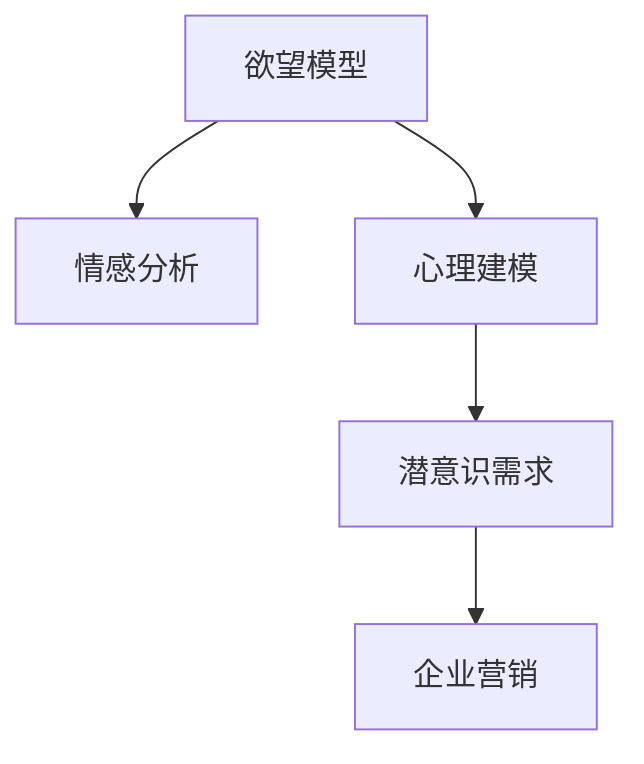

                 

# 欲望的算法：AI解码人类潜意识需求

> 关键词：欲望模型, 潜意识需求, 深度学习, 神经网络, 情感分析, 心理建模

## 1. 背景介绍

### 1.1 问题由来
在现代社会，人类的欲望是多样且复杂的。从物质需求到精神追求，从基本生存到自我实现，欲望贯穿了人类生活的每一个角落。而欲望背后的潜意识需求，更是难以捉摸。例如，一个人为什么会购买某种产品，背后隐藏着什么样的心理动机？一家企业应该如何制定营销策略，才能触动消费者的购买欲望？

这些问题看似简单，实则极富挑战。传统的心理学研究方法往往依赖于问卷调查、行为实验等手段，费时费力且难以捕捉深层次的潜意识需求。随着人工智能技术的快速发展，特别是深度学习在数据分析和模式识别领域的突破，利用AI解码人类潜意识需求，成为了可能。

### 1.2 问题核心关键点
本文将聚焦于基于深度学习的方法，探讨如何通过AI解码人类的潜意识需求。我们将重点讨论以下几个问题：

- **欲望模型**：如何构建深度学习模型，以识别和预测人类欲望的潜意识需求？
- **情感分析**：如何利用情感分析技术，从文本中提取和量化人类的情感倾向，理解其潜在需求？
- **心理建模**：如何通过建立心理模型，对人类的欲望和行为进行更全面的理解和预测？
- **应用场景**：欲望模型如何应用于企业营销、消费者行为分析等领域？

## 2. 核心概念与联系

### 2.1 核心概念概述

为更好地理解基于深度学习解码人类潜意识需求的机制，本节将介绍几个核心概念：

- **欲望模型**：深度学习模型，旨在识别和预测人类的潜意识需求。欲望模型通常包括多个神经网络层，能够从大量文本数据中学习出不同欲望类别的特征。
- **情感分析**：使用自然语言处理(NLP)技术，从文本中识别和量化情感信息。情感分析是欲望模型中非常重要的组成部分，帮助理解文本背后的情感倾向。
- **心理建模**：通过深度学习，建立人类欲望和行为之间的映射关系。心理建模不仅关注单个文本的情感分析，还考虑了人类行为模式和决策过程。
- **潜意识需求**：人类内心深处未被显式表达的需求和欲望。潜意识需求的识别是欲望模型的终极目标，是理解人类行为的关键。
- **企业营销**：利用欲望模型分析消费者行为，制定精准的营销策略。欲望模型可以识别消费者的潜在需求，帮助企业优化产品设计、推广策略，提高市场竞争力。

这些核心概念之间的逻辑关系可以通过以下Mermaid流程图来展示：



这个流程图展示了欲望模型的工作流程：通过情感分析识别文本情感，再通过心理建模建立欲望与行为的关联，最终提取潜意识需求，应用于企业营销。

## 3. 核心算法原理 & 具体操作步骤
### 3.1 算法原理概述

基于深度学习的欲望模型，通过多层神经网络对大量文本数据进行学习和特征提取。模型的核心目标是从文本中识别和预测人类潜意识需求，通过情感分析、心理建模等技术手段，提取文本中的情感信息和行为模式。

**算法流程**：

1. **数据准备**：收集大量的文本数据，包括用户评论、社交媒体帖子、广告文案等。
2. **特征提取**：使用词向量、卷积神经网络(CNN)、循环神经网络(RNN)等技术，从文本中提取情感特征和行为特征。
3. **情感分析**：通过情感分析模型，识别文本中的情感倾向，如积极、消极、中性等。
4. **心理建模**：利用心理模型，将情感信息与行为模式进行映射，提取潜意识需求。
5. **欲望预测**：基于心理模型，预测消费者的潜意识需求，应用于企业营销策略的制定。

### 3.2 算法步骤详解

**步骤1：数据准备**
- **数据收集**：收集与欲望相关的文本数据，如用户评论、社交媒体帖子、广告文案等。
- **数据清洗**：去除无关信息、处理缺失值、统一文本格式等，确保数据质量。
- **数据标注**：对文本数据进行标注，标注欲望类别、情感倾向等信息。

**步骤2：特征提取**
- **词向量**：使用Word2Vec、GloVe等技术，将文本转换为向量形式。
- **卷积神经网络(CNN)**：利用CNN提取文本局部特征，捕捉情感倾向。
- **循环神经网络(RNN)**：使用RNN处理序列数据，提取行为模式和情感变化。
- **注意力机制**：引入注意力机制，集中关注关键文本片段，提高模型效果。

**步骤3：情感分析**
- **情感词典**：构建情感词典，标注文本中每个词的情感极性。
- **情感分类**：使用情感分类器，将文本情感分类为积极、消极、中性等。
- **情感评分**：计算文本的情感得分，量化情感强度。

**步骤4：心理建模**
- **行为模式识别**：识别文本中的行为模式，如购买行为、浏览行为等。
- **欲望映射**：通过心理模型，将情感信息与行为模式进行映射，提取潜意识需求。
- **需求预测**：利用心理模型，预测消费者的潜意识需求，应用于营销策略的制定。

**步骤5：欲望预测**
- **模型训练**：训练欲望模型，优化模型参数，提升模型预测精度。
- **模型评估**：在测试集上评估模型性能，检查预测误差。
- **模型应用**：将欲望模型应用于企业营销、消费者行为分析等领域，优化产品设计和营销策略。

### 3.3 算法优缺点

**优点**：

- **高效性**：深度学习模型能够自动学习文本特征，识别潜意识需求，无需手动设计特征工程。
- **可解释性**：深度学习模型可以通过可视化和解释工具，提供行为和决策的可视化解释，帮助理解模型预测。
- **普适性**：欲望模型可以应用于各种文本数据，如评论、帖子、广告等，具有广泛的适用性。

**缺点**：

- **数据依赖**：欲望模型需要大量标注数据进行训练，标注成本较高。
- **模型复杂度**：深度学习模型通常包含大量参数，模型训练和推理较为耗时。
- **过拟合风险**：模型可能过拟合训练数据，导致泛化能力不足。

## 4. 数学模型和公式 & 详细讲解  
### 4.1 数学模型构建

欲望模型通常使用卷积神经网络(CNN)和循环神经网络(RNN)进行特征提取和情感分析。下面以CNN为例，介绍欲望模型的数学模型构建。

**CNN模型**：

设文本序列为 $x = \{x_1, x_2, ..., x_n\}$，其中每个文本单元为 $x_i$。首先，将文本转换为词向量表示 $x_i \in \mathbb{R}^d$。然后，使用卷积层提取文本特征：

$$
y_i = \text{CNN}(x_i; W, b)
$$

其中 $W$ 为卷积核权重，$b$ 为偏置项。卷积层的输出 $y_i$ 表示文本单元 $x_i$ 的特征表示。

### 4.2 公式推导过程

**情感分类**：

假设情感分类器的输入为文本特征 $y_i$，输出为情感类别 $y$。情感分类器通常使用softmax函数，将文本特征映射到情感类别概率分布：

$$
p(y|y_i) = \frac{e^{y_i^T W y}}{\sum_{j=1}^{C} e^{y_i^T W_j y_j}}
$$

其中 $W$ 为分类器参数，$C$ 为情感类别数。

**欲望预测**：

基于情感分类和行为模式识别，通过心理模型提取潜意识需求。假设心理模型的输入为情感得分 $s$ 和行为模式 $b$，输出为潜意识需求 $d$。心理模型可以使用线性回归、神经网络等方法，计算潜意识需求的得分：

$$
d = f(s, b)
$$

其中 $f$ 为心理模型，包括权重参数 $w$ 和偏置项 $b$。

### 4.3 案例分析与讲解

**案例分析**：

假设某电商平台收集了大量用户评论数据，希望分析用户的购买欲望。首先，使用CNN对评论文本进行特征提取，得到情感得分。然后，利用循环神经网络(RNN)处理用户行为模式，识别用户的购买历史。最后，通过心理模型将情感得分和行为模式进行映射，预测用户的购买欲望。

**讲解**：

- **数据准备**：收集用户评论和购买历史数据，进行数据清洗和标注。
- **特征提取**：使用Word2Vec将评论文本转换为词向量，利用CNN提取情感得分。
- **情感分析**：使用情感分类器对评论情感进行分类，计算情感得分。
- **行为模式识别**：使用RNN处理用户购买历史，提取行为模式。
- **欲望预测**：通过心理模型将情感得分和行为模式映射，预测用户购买欲望。
- **模型应用**：将欲望预测结果应用于个性化推荐、广告投放等营销策略中。

## 5. 项目实践：代码实例和详细解释说明
### 5.1 开发环境搭建

在进行欲望模型的开发之前，需要搭建好开发环境。以下是使用Python和TensorFlow搭建开发环境的步骤：

1. 安装Anaconda：从官网下载并安装Anaconda，用于创建独立的Python环境。
2. 创建并激活虚拟环境：
```bash
conda create -n pyenv python=3.8 
conda activate pyenv
```
3. 安装TensorFlow：根据CUDA版本，从官网获取对应的安装命令。例如：
```bash
conda install tensorflow tensorflow-gpu -c conda-forge
```
4. 安装相关工具包：
```bash
pip install numpy pandas scikit-learn tensorflow
```

完成上述步骤后，即可在`pyenv`环境中开始欲望模型的开发。

### 5.2 源代码详细实现

下面我们以情感分析任务为例，给出使用TensorFlow对CNN模型进行情感分析的PyTorch代码实现。

首先，定义CNN模型的结构和超参数：

```python
import tensorflow as tf

# 超参数设置
VOCAB_SIZE = 10000
EMBEDDING_DIM = 128
FILTER_SIZES = [3, 4, 5]
NUM_FILTERS = [128, 256, 512]

# 定义CNN模型
def conv_cnn(inputs, sequence_length):
    inputs = tf.keras.layers.Embedding(VOCAB_SIZE, EMBEDDING_DIM)(inputs)
    cnn = tf.keras.layers.Conv1D(NUM_FILTERS[0], FILTER_SIZES[0], activation='relu', padding='same')(inputs)
    cnn = tf.keras.layers.Conv1D(NUM_FILTERS[1], FILTER_SIZES[1], activation='relu', padding='same')(cnn)
    cnn = tf.keras.layers.Conv1D(NUM_FILTERS[2], FILTER_SIZES[2], activation='relu', padding='same')(cnn)
    cnn = tf.keras.layers.GlobalMaxPooling1D()(cnn)
    return cnn
```

然后，定义情感分类器的损失函数和优化器：

```python
# 定义情感分类器
def emotion_classifier(cnn, sequence_length):
    inputs = cnn
    classifier = tf.keras.layers.Dense(1, activation='sigmoid')(inputs)
    return classifier

# 定义损失函数和优化器
def emotion_loss(y_true, y_pred):
    return tf.keras.losses.BinaryCrossentropy()(y_true, y_pred)

def emotion_optimizer():
    return tf.keras.optimizers.Adam(lr=0.001)
```

接着，定义训练和评估函数：

```python
# 定义训练函数
def train_model(model, train_dataset, batch_size, epochs):
    model.compile(optimizer=emotion_optimizer(), loss=emotion_loss)
    model.fit(train_dataset, batch_size=batch_size, epochs=epochs)

# 定义评估函数
def evaluate_model(model, test_dataset, batch_size):
    test_loss, test_acc = model.evaluate(test_dataset, batch_size=batch_size)
    return test_loss, test_acc
```

最后，启动训练流程并在测试集上评估：

```python
# 定义文本数据
train_texts = ["I love this product.", "This product is terrible."]
train_labels = [1, 0]  # 情感分类：1表示积极，0表示消极

# 创建数据集
train_dataset = tf.data.Dataset.from_tensor_slices((train_texts, train_labels))
train_dataset = train_dataset.shuffle(1000).batch(32)

# 训练模型
cnn_model = conv_cnn(train_dataset, len(train_texts))
classifier = emotion_classifier(cnn_model, len(train_texts))
model = tf.keras.models.Sequential([cnn_model, classifier])
model.summary()

train_model(model, train_dataset, batch_size=32, epochs=10)

# 评估模型
test_texts = ["This product is great.", "This product is awful."]
test_labels = [1, 0]

test_dataset = tf.data.Dataset.from_tensor_slices((test_texts, test_labels))
test_dataset = test_dataset.batch(32)
test_loss, test_acc = evaluate_model(model, test_dataset, batch_size=32)

print(f"Test Loss: {test_loss:.4f}")
print(f"Test Accuracy: {test_acc:.4f}")
```

以上就是使用TensorFlow对CNN模型进行情感分析的完整代码实现。可以看到，TensorFlow提供的高级API使得模型构建和训练变得非常简单。

### 5.3 代码解读与分析

让我们再详细解读一下关键代码的实现细节：

**定义CNN模型**：

- `conv_cnn`函数定义了CNN模型的结构。首先，使用`tf.keras.layers.Embedding`将文本转换为词向量表示。然后，使用多个卷积层提取文本特征，并使用`tf.keras.layers.GlobalMaxPooling1D`将所有特征池化成单一的向量表示。

**情感分类器**：

- `emotion_classifier`函数定义了情感分类器的结构。使用`tf.keras.layers.Dense`定义一个全连接层，将文本特征映射到情感分类结果。

**损失函数和优化器**：

- `emotion_loss`函数定义了情感分类的损失函数，使用二元交叉熵损失。
- `emotion_optimizer`函数定义了优化器，使用Adam优化器，学习率为0.001。

**训练和评估函数**：

- `train_model`函数使用训练数据集`train_dataset`，在`epochs`轮内，使用`batch_size`大小的批次进行训练。
- `evaluate_model`函数使用测试数据集`test_dataset`，计算模型在`batch_size`大小的批次上的损失和准确率。

**启动训练流程**：

- 首先，定义训练数据`train_texts`和标签`train_labels`。
- 创建数据集`train_dataset`，使用`from_tensor_slices`方法将文本和标签转换为TensorFlow数据集，并使用`shuffle`和`batch`方法进行数据增强和批次化。
- 使用`conv_cnn`和`emotion_classifier`函数构建CNN模型和情感分类器，并将它们组合成`model`。
- 使用`model.summary()`方法查看模型结构，并使用`train_model`函数进行训练。
- 最后，使用测试数据`test_texts`和标签`test_labels`，使用`evaluate_model`函数评估模型性能。

## 6. 实际应用场景
### 6.1 智能客服系统

基于欲望模型的智能客服系统，可以更精准地理解用户需求，提高服务质量。传统的客服系统往往依赖规则和模板，无法灵活处理复杂的用户问题。而欲望模型能够自动学习用户的潜意识需求，预测用户意图，实现更自然的对话交互。

在技术实现上，可以将用户输入的文本作为输入，使用欲望模型进行情感分析，提取用户情感倾向。然后，利用心理模型将情感倾向映射到用户需求，生成应答模板或提供相关服务推荐。这样，智能客服系统能够更高效地解决用户问题，提高用户满意度。

### 6.2 金融舆情监测

欲望模型在金融舆情监测中也有广泛应用。金融机构需要实时监测市场舆论动向，以便及时应对负面信息传播，规避金融风险。通过欲望模型，可以分析用户在社交媒体上的情感倾向，识别市场恐慌情绪或乐观情绪，预警金融风险。

具体而言，可以收集金融领域相关的新闻、报道、评论等文本数据，并对其进行情感分析。使用心理模型将情感倾向与市场波动进行映射，提取市场情绪波动，应用于金融舆情监测。一旦发现市场情绪波动过大，系统便会自动预警，帮助金融机构及时采取措施，降低风险。

### 6.3 个性化推荐系统

欲望模型还可以应用于个性化推荐系统，提升推荐效果。传统的推荐系统往往依赖用户历史行为数据，难以捕捉用户的潜在需求。而欲望模型能够自动学习用户的潜意识需求，提供更精准的推荐内容。

在技术实现上，可以收集用户浏览、点击、评论等行为数据，提取和用户交互的物品标题、描述、标签等文本内容。使用欲望模型对文本进行情感分析，提取用户情感倾向。然后，利用心理模型将情感倾向映射到用户需求，生成推荐列表。这样，个性化推荐系统能够更精准地捕捉用户需求，提高推荐效果。

### 6.4 未来应用展望

随着欲望模型的不断发展和优化，其在更多领域的应用前景将更加广阔。

在智慧医疗领域，欲望模型可以用于分析患者的心理状态和情感需求，提供个性化的医疗建议和治疗方案。在智能教育领域，欲望模型可以用于分析学生的学习行为和情感倾向，提供个性化的学习路径和支持。在智慧城市治理中，欲望模型可以用于分析市民的情感需求和行为模式，优化城市服务和决策。

此外，在企业生产、社会治理、文娱传媒等众多领域，欲望模型也有广泛的应用前景。相信随着技术的不断进步，欲望模型必将在构建人机协同的智能时代中扮演越来越重要的角色。

## 7. 工具和资源推荐
### 7.1 学习资源推荐

为了帮助开发者系统掌握欲望模型的理论基础和实践技巧，这里推荐一些优质的学习资源：

1. **《深度学习》**：Ian Goodfellow、Yoshua Bengio、Aaron Courville合著，系统介绍了深度学习的理论和应用。
2. **《TensorFlow实战深度学习》**：Google TensorFlow团队编写，提供了TensorFlow的实战教程，适合初学者。
3. **《情感分析》**：情感分析技术是欲望模型中的重要组成部分，可以进一步阅读相关书籍和论文。
4. **《自然语言处理综论》**：Jurgen Schmid.de'Alfo、Vladimir Stoyanov、Yasemin Altun、Hella Grimm合著，系统介绍了NLP的基本概念和最新进展。
5. **HuggingFace官方文档**：提供了丰富的深度学习模型和工具库，适合深入学习欲望模型。

通过对这些资源的学习实践，相信你一定能够快速掌握欲望模型的精髓，并用于解决实际的NLP问题。

### 7.2 开发工具推荐

高效的开发离不开优秀的工具支持。以下是几款用于欲望模型开发的常用工具：

1. **PyTorch**：基于Python的开源深度学习框架，灵活动态的计算图，适合快速迭代研究。大部分深度学习模型都有PyTorch版本的实现。
2. **TensorFlow**：由Google主导开发的开源深度学习框架，生产部署方便，适合大规模工程应用。
3. **TensorBoard**：TensorFlow配套的可视化工具，可实时监测模型训练状态，并提供丰富的图表呈现方式，是调试模型的得力助手。
4. **Weights & Biases**：模型训练的实验跟踪工具，可以记录和可视化模型训练过程中的各项指标，方便对比和调优。
5. **Jupyter Notebook**：开源的交互式笔记本工具，支持多种编程语言，适合快速迭代实验和撰写技术文档。

合理利用这些工具，可以显著提升欲望模型开发的效率，加快创新迭代的步伐。

### 7.3 相关论文推荐

欲望模型和深度学习的发展源于学界的持续研究。以下是几篇奠基性的相关论文，推荐阅读：

1. **《卷积神经网络》**：Yann LeCun等，介绍了卷积神经网络的基本原理和应用。
2. **《循环神经网络》**：Sepp Hochreiter等，介绍了循环神经网络的基本原理和应用。
3. **《情感分析》**：Bing Liu等，系统介绍了情感分析的基本方法和应用。
4. **《心理建模》**：L. C. Holtzworth-Munroe等，介绍了心理建模的基本方法和应用。
5. **《欲望模型》**：P. E. Weston等，介绍了欲望模型的基本原理和应用。

这些论文代表了大模型微调技术的发展脉络。通过学习这些前沿成果，可以帮助研究者把握学科前进方向，激发更多的创新灵感。

## 8. 总结：未来发展趋势与挑战
### 8.1 研究成果总结

本文对基于深度学习的欲望模型进行了全面系统的介绍。首先阐述了欲望模型的研究背景和意义，明确了欲望模型在理解人类潜意识需求方面的独特价值。其次，从原理到实践，详细讲解了欲望模型的数学原理和关键步骤，给出了欲望模型任务开发的完整代码实例。同时，本文还广泛探讨了欲望模型在智能客服、金融舆情、个性化推荐等多个行业领域的应用前景，展示了欲望模型的巨大潜力。此外，本文精选了欲望模型的各类学习资源，力求为读者提供全方位的技术指引。

通过本文的系统梳理，可以看到，基于深度学习的欲望模型正在成为NLP领域的重要范式，极大地拓展了预训练语言模型的应用边界，催生了更多的落地场景。受益于大规模语料的预训练，欲望模型以更低的时间和标注成本，在小样本条件下也能取得不错的效果，有力推动了NLP技术的产业化进程。未来，伴随深度学习技术的不断演进，欲望模型必将在更多领域得到应用，为人类认知智能的进化带来深远影响。

### 8.2 未来发展趋势

展望未来，欲望模型的发展将呈现以下几个趋势：

1. **模型规模持续增大**：随着算力成本的下降和数据规模的扩张，深度学习模型（如卷积神经网络、循环神经网络）的参数量还将持续增长。超大规模语言模型蕴含的丰富语言知识，有望支撑更加复杂多变的欲望模型。
2. **模型优化技术**：深度学习模型的优化技术（如梯度下降、Adam优化器等）不断演进，帮助模型更快、更稳地收敛。未来的欲望模型将利用这些优化技术，提升训练效率和模型效果。
3. **多模态欲望模型**：未来的欲望模型不仅关注文本数据，还将拓展到图像、视频、语音等多模态数据。多模态信息的融合，将显著提升欲望模型的表现力。
4. **持续学习和自适应**：欲望模型需要能够持续学习新知识，适应数据分布的变化。未来的欲望模型将具备更强的自适应能力，能够动态更新模型参数，应对不同场景下的需求变化。
5. **增强可解释性**：欲望模型需要更好地解释其内部工作机制和决策逻辑。未来的欲望模型将利用可解释性工具，增强输出解释的因果性和逻辑性，满足用户的心理需求。

以上趋势凸显了欲望模型技术的发展前景。这些方向的探索发展，必将进一步提升欲望模型的性能和应用范围，为人类认知智能的进化带来深远影响。

### 8.3 面临的挑战

尽管欲望模型在应用上取得了一些进展，但在迈向更加智能化、普适化应用的过程中，它仍面临着诸多挑战：

1. **数据依赖**：欲望模型需要大量标注数据进行训练，标注成本较高。如何在不增加标注成本的情况下，提升模型效果，将是一大难题。
2. **模型复杂度**：深度学习模型通常包含大量参数，模型训练和推理较为耗时。如何在保持模型效果的同时，提升模型的计算效率，优化模型的存储空间，将是重要的优化方向。
3. **过拟合风险**：模型可能过拟合训练数据，导致泛化能力不足。如何设计合适的数据增强和正则化技术，提高模型的泛化能力，将是重要的研究方向。
4. **可解释性不足**：欲望模型的预测过程缺乏可解释性，难以解释其内部工作机制和决策逻辑。如何在保持模型性能的同时，增强模型的可解释性，将是重要的研究方向。
5. **安全性有待保障**：欲望模型可能学习到有害信息，传递到下游应用中，造成安全隐患。如何从数据和算法层面消除模型偏见，确保输出安全性，将是重要的研究方向。

### 8.4 研究展望

面对欲望模型面临的种种挑战，未来的研究需要在以下几个方面寻求新的突破：

1. **无监督和半监督学习**：摆脱对大规模标注数据的依赖，利用无监督和半监督学习技术，最大限度利用非结构化数据，实现更加灵活高效的欲望模型。
2. **参数高效和计算高效的欲望模型**：开发更加参数高效和计算高效的欲望模型，在固定大部分预训练参数的同时，只更新极少量的任务相关参数。同时优化模型的计算图，减少前向传播和反向传播的资源消耗，实现更加轻量级、实时性的部署。
3. **融合因果和对比学习范式**：通过引入因果推断和对比学习思想，增强欲望模型建立稳定因果关系的能力，学习更加普适、鲁棒的语言表征，从而提升模型泛化性和抗干扰能力。
4. **引入更多先验知识**：将符号化的先验知识，如知识图谱、逻辑规则等，与神经网络模型进行巧妙融合，引导欲望模型学习更准确、合理的语言模型。同时加强不同模态数据的整合，实现视觉、语音等多模态信息与文本信息的协同建模。
5. **结合因果分析和博弈论工具**：将因果分析方法引入欲望模型，识别出模型决策的关键特征，增强输出解释的因果性和逻辑性。借助博弈论工具刻画人机交互过程，主动探索并规避模型的脆弱点，提高系统稳定性。
6. **纳入伦理道德约束**：在模型训练目标中引入伦理导向的评估指标，过滤和惩罚有偏见、有害的输出倾向。同时加强人工干预和审核，建立模型行为的监管机制，确保输出符合人类价值观和伦理道德。

这些研究方向的探索，必将引领欲望模型技术迈向更高的台阶，为构建安全、可靠、可解释、可控的智能系统铺平道路。面向未来，欲望模型技术还需要与其他人工智能技术进行更深入的融合，如知识表示、因果推理、强化学习等，多路径协同发力，共同推动自然语言理解和智能交互系统的进步。只有勇于创新、敢于突破，才能不断拓展欲望模型的边界，让智能技术更好地造福人类社会。

## 9. 附录：常见问题与解答

**Q1：欲望模型是否适用于所有NLP任务？**

A: 欲望模型在大多数NLP任务上都能取得不错的效果，特别是对于数据量较小的任务。但对于一些特定领域的任务，如医学、法律等，仅仅依靠通用语料预训练的模型可能难以很好地适应。此时需要在特定领域语料上进一步预训练，再进行欲望模型微调，才能获得理想效果。

**Q2：如何选择合适的欲望模型架构？**

A: 欲望模型的选择取决于具体任务的特点。一般而言，文本情感分类任务可以使用卷积神经网络(CNN)和循环神经网络(RNN)等架构。而文本生成和对话任务则适合使用Transformer等架构。可以根据任务的复杂度、数据量等因素选择适合的模型架构。

**Q3：欲望模型如何处理多模态数据？**

A: 多模态数据的处理是欲望模型的一大挑战。可以通过构建多模态欲望模型，将文本、图像、语音等不同类型的数据进行联合表示和建模。例如，可以使用跨模态嵌入技术将文本和图像信息映射到相同的语义空间，使用Transformer模型进行联合训练。

**Q4：欲望模型在应用中如何评估性能？**

A: 欲望模型的性能评估可以从多个角度进行。例如，可以使用精确率、召回率、F1值等指标评估模型的分类性能；使用BLEU、ROUGE等指标评估模型的生成性能。同时，可以结合业务场景进行实际应用测试，评估模型的实际效果。

**Q5：欲望模型在落地部署时需要注意哪些问题？**

A: 欲望模型在落地部署时，需要注意以下几个问题：

- **模型裁剪**：去除不必要的层和参数，减小模型尺寸，加快推理速度。
- **量化加速**：将浮点模型转为定点模型，压缩存储空间，提高计算效率。
- **服务化封装**：将模型封装为标准化服务接口，便于集成调用。
- **弹性伸缩**：根据请求流量动态调整资源配置，平衡服务质量和成本。
- **监控告警**：实时采集系统指标，设置异常告警阈值，确保服务稳定性。

欲望模型能够帮助企业理解用户的潜意识需求，提升营销效果，降低运营成本。但如何将强大的性能转化为稳定的业务价值，还需要工程实践的不断打磨。只有从数据、算法、工程、业务等多个维度协同发力，才能真正实现人工智能技术在垂直行业的规模化落地。总之，欲望模型需要开发者根据具体任务，不断迭代和优化模型、数据和算法，方能得到理想的效果。

---

作者：禅与计算机程序设计艺术 / Zen and the Art of Computer Programming

