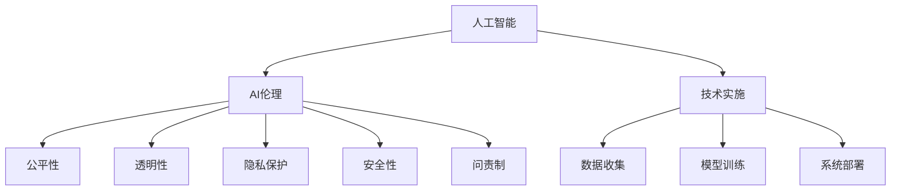

                 

# 欲望的重新定向：AI引导的价值观重塑

## 1. 背景介绍

### 1.1 问题由来

在数字化时代的浪潮中，人工智能（AI）技术以其强大的计算能力和卓越的性能，正深刻地影响着社会的方方面面。然而，随着AI的不断普及，其伦理和道德问题也逐渐暴露出来。例如，AI系统如何保证其决策的公正性？如何防止AI对人类的歧视和偏见？如何保护用户的隐私数据？这些问题亟需得到解答。

### 1.2 问题核心关键点

当前，AI技术的普及应用不仅需要强大的算法和模型支撑，还需要相应的伦理和道德规范来指导。AI伦理的核心在于引导AI系统做出符合人类价值观的决策，防止其偏离人类的核心利益。这包括但不限于：

- **公平性**：确保AI系统在决策过程中不带有任何歧视和偏见。
- **透明性**：AI系统的决策过程应尽可能透明，便于用户理解和监督。
- **隐私保护**：在数据收集和使用过程中，严格保护用户的隐私和数据安全。
- **安全性**：确保AI系统的稳定性和可靠性，防止其对人类造成潜在危害。
- **问责制**：明确AI系统的责任归属，防止责任不明或推诿。

这些问题不仅涉及技术层面，更涉及社会、文化、法律等多个方面。如何通过技术手段和伦理框架，引导AI系统做出符合人类价值观的决策，已成为当下亟需解决的重要课题。

## 2. 核心概念与联系

### 2.1 核心概念概述

为了更好地理解AI伦理在价值观重塑中的作用，本节将介绍几个核心概念：

- **人工智能**：一种通过机器学习、数据挖掘等技术实现模仿人类智能行为的计算机技术。
- **AI伦理**：指导AI系统设计、开发和应用过程中遵循的伦理准则和道德规范。
- **公平性**：AI系统在决策过程中不带有任何歧视和偏见，保证所有用户都能获得平等的服务。
- **透明性**：AI系统的决策过程应尽可能透明，便于用户理解和监督。
- **隐私保护**：在数据收集和使用过程中，严格保护用户的隐私和数据安全。
- **安全性**：确保AI系统的稳定性和可靠性，防止其对人类造成潜在危害。
- **问责制**：明确AI系统的责任归属，防止责任不明或推诿。

这些概念之间的关系可以通过以下Mermaid流程图来展示：



这个流程图展示了大语言模型的核心概念及其之间的关系：

1. 人工智能通过技术手段实现模仿人类智能行为。
2. AI伦理指导AI系统的设计、开发和应用，保证系统的公平性、透明性、隐私保护、安全性和问责制。
3. 技术实施包括数据收集、模型训练和系统部署等环节，需要在伦理框架下进行。

## 3. 核心算法原理 & 具体操作步骤

### 3.1 算法原理概述

AI伦理在价值观重塑中的核心作用在于引导AI系统做出符合人类价值观的决策。这通常涉及以下几个步骤：

1. **伦理框架设计**：在AI系统的设计和开发阶段，引入伦理框架，确保AI系统的决策符合人类价值观。
2. **伦理审核**：在AI系统的测试和验证阶段，进行伦理审核，检查系统是否存在潜在风险和伦理问题。
3. **伦理监控**：在AI系统的运行阶段，进行伦理监控，确保系统在实际应用中遵守伦理准则。
4. **伦理更新**：根据外部环境的变化和反馈，定期更新AI系统的伦理框架和审核机制，保证其长期有效性。

### 3.2 算法步骤详解

基于AI伦理在价值观重塑中的作用，以下步骤详细介绍了如何进行AI伦理引导：

**Step 1: 伦理框架设计**

- 确定AI系统的目标和应用场景，分析可能涉及的伦理问题。
- 制定伦理准则和行为规范，确保AI系统在决策过程中遵循人类价值观。
- 设计伦理审查机制，确保伦理框架的有效实施。

**Step 2: 伦理审核**

- 对AI系统的设计、开发和测试过程进行伦理审核，确保每个环节符合伦理准则。
- 引入第三方机构进行独立审核，提供客观公正的评估报告。
- 对发现的潜在伦理问题进行整改，确保系统的安全性、公正性和透明性。

**Step 3: 伦理监控**

- 在AI系统的运行过程中，设置伦理监控机制，实时监测系统的决策行为。
- 收集用户反馈和外部意见，进行数据分析和风险评估。
- 对存在伦理风险的行为进行预警和干预，防止对用户造成不良影响。

**Step 4: 伦理更新**

- 定期收集外部环境变化和反馈信息，评估AI系统的伦理风险。
- 根据评估结果，更新AI系统的伦理框架和审核机制。
- 重新进行伦理审核和监控，确保系统的长期有效性。

### 3.3 算法优缺点

AI伦理在价值观重塑中具有以下优点：

1. **提高系统公正性**：通过伦理审核和监控，确保AI系统在决策过程中不带有任何歧视和偏见，提高系统的公正性。
2. **增强用户信任**：透明化的伦理框架和审查机制，增强用户对AI系统的信任和接受度。
3. **保护用户隐私**：严格的数据保护措施，确保用户的隐私数据不被滥用。
4. **减少伦理风险**：伦理监控机制及时发现并干预伦理风险，避免对用户造成不良影响。
5. **推动技术进步**：伦理引导下的技术创新，推动AI技术向更为人性化、普适化的方向发展。

同时，该方法也存在一定的局限性：

1. **伦理标准不统一**：不同国家和地区的伦理标准可能存在差异，导致系统在不同地区的应用效果不一致。
2. **伦理审查成本高**：第三方机构进行独立审核需要大量的时间和资源投入。
3. **伦理框架不完善**：现有的伦理框架可能无法完全覆盖所有的伦理问题，存在漏洞和盲区。
4. **伦理监控难度大**：AI系统在复杂多变的场景中，伦理监控难度较大，存在监管不足的风险。

尽管存在这些局限性，但就目前而言，AI伦理在价值观重塑中的作用不容忽视。未来相关研究的重点在于如何进一步完善伦理框架，降低伦理审核成本，提高伦理监控能力，同时兼顾可解释性和伦理安全性等因素。

### 3.4 算法应用领域

AI伦理在价值观重塑中的应用领域非常广泛，涵盖了从医疗、教育到金融、公共服务等多个领域。

- **医疗领域**：AI伦理在医疗诊断和治疗方案推荐中发挥重要作用，确保医疗决策的公正性和透明性，同时保护患者的隐私和数据安全。
- **教育领域**：AI伦理在个性化学习推荐和学情分析中，确保教育资源的公平分配，同时保护学生的隐私和数据安全。
- **金融领域**：AI伦理在信用评估和金融产品推荐中，确保决策的公正性和透明性，同时保护用户的隐私和数据安全。
- **公共服务**：AI伦理在智慧城市管理中，确保公共服务的公平性和透明性，同时保护市民的隐私和数据安全。
- **企业应用**：AI伦理在人力资源管理中，确保招聘和晋升决策的公正性和透明性，同时保护员工的隐私和数据安全。

除了上述这些领域外，AI伦理在更多场景中的应用也在不断探索，如自动驾驶、智能制造、智能安防等，为社会带来深远影响。

## 4. 数学模型和公式 & 详细讲解 & 举例说明

### 4.1 数学模型构建

AI伦理在价值观重塑中的作用涉及多个领域的数学模型构建，这里以医疗领域为例进行详细讲解。

假设有一家医疗AI公司，开发了一款基于深度学习的癌症诊断系统。该系统的目标是根据患者的临床数据和影像数据，自动诊断患者是否患有某种类型的癌症。系统的核心模型为：

$$
M_{\theta}(x) = \text{softmax}(AW + b)
$$

其中，$x$ 为输入的临床数据和影像数据，$M_{\theta}(x)$ 为输出概率分布，$A$ 和 $b$ 为模型参数。

假设系统需要满足以下伦理准则：

1. **公平性**：确保对所有患者进行诊断时，不带有任何种族、性别、年龄等歧视。
2. **透明性**：提供诊断结果的可解释性，便于医生和患者理解。
3. **隐私保护**：严格保护患者的隐私数据，防止数据泄露。
4. **安全性**：确保系统在运行过程中稳定可靠，防止误诊和漏诊。
5. **问责制**：明确系统的责任归属，确保在出现诊断错误时有据可查。

### 4.2 公式推导过程

为了满足上述伦理准则，需要在模型构建和训练过程中引入相应的数学模型。以下将以公平性为例进行详细推导。

假设有一组带有性别标签的癌症患者数据，记为 $D = \{(x_i, y_i, g_i)\}_{i=1}^N$，其中 $x_i$ 为输入数据，$y_i$ 为癌症诊断结果，$g_i$ 为性别标签。系统需要对带有性别标签的数据进行训练，确保在诊断过程中不带有性别歧视。

记模型参数为 $\theta$，则模型的训练损失函数为：

$$
\mathcal{L}(\theta) = \frac{1}{N} \sum_{i=1}^N \ell(M_{\theta}(x_i), y_i, g_i)
$$

其中，$\ell$ 为损失函数，通常采用交叉熵损失。

为了实现公平性，需要在损失函数中加入公平性约束，即在诊断过程中不带有性别歧视。一种常见的公平性约束为：

$$
\text{Pr}(g=1|x, y=1, g_i=0) = \text{Pr}(g=0|x, y=1, g_i=1)
$$

其中，$\text{Pr}(g=1|x, y=1, g_i=0)$ 表示在男女性别下，患者被诊断为癌症的概率。这一约束确保了系统在性别上的公平性。

在模型训练过程中，需要在损失函数中引入公平性约束，具体实现如下：

$$
\mathcal{L}(\theta) = \frac{1}{N} \sum_{i=1}^N \biggl( \ell(M_{\theta}(x_i), y_i, g_i) + \lambda \log \biggl( \frac{\text{Pr}(g=1|x_i, y_i=1, g_i=0)}{\text{Pr}(g=0|x_i, y_i=1, g_i=1)} \biggl)
$$

其中，$\lambda$ 为公平性约束的权重。

### 4.3 案例分析与讲解

假设某医院对某患者进行了癌症筛查，输入数据为 $x = [x_1, x_2, ..., x_n]$，输出为 $y = 1$（癌症）。系统在诊断过程中，需要满足公平性约束。

在模型训练过程中，首先对患者数据进行预处理，转换为模型可接受的形式：

$$
M_{\theta}(x) = \text{softmax}(AW + b)
$$

然后，对输出概率分布进行后处理，得到最终的诊断结果：

$$
\hat{y} = \text{argmax}(M_{\theta}(x))
$$

在评估过程中，需要对系统进行公平性评估，确保在男女性别下，系统诊断结果的一致性。

## 5. 项目实践：代码实例和详细解释说明

### 5.1 开发环境搭建

在进行AI伦理引导的价值观重塑实践前，我们需要准备好开发环境。以下是使用Python进行PyTorch开发的环境配置流程：

1. 安装Anaconda：从官网下载并安装Anaconda，用于创建独立的Python环境。

2. 创建并激活虚拟环境：
```bash
conda create -n pytorch-env python=3.8 
conda activate pytorch-env
```

3. 安装PyTorch：根据CUDA版本，从官网获取对应的安装命令。例如：
```bash
conda install pytorch torchvision torchaudio cudatoolkit=11.1 -c pytorch -c conda-forge
```

4. 安装TensorFlow：
```bash
pip install tensorflow
```

5. 安装TensorBoard：
```bash
pip install tensorboard
```

完成上述步骤后，即可在`pytorch-env`环境中开始实践。

### 5.2 源代码详细实现

下面我们以医疗领域为例，给出使用TensorFlow进行AI伦理引导的代码实现。

首先，定义数据处理函数：

```python
import numpy as np
import tensorflow as tf
from sklearn.model_selection import train_test_split

# 读取数据
def load_data():
    # 读取数据
    data = np.load('data.npy')
    labels = np.load('labels.npy')
    return data, labels

# 划分数据集
def split_data(data, labels, test_size=0.2):
    X_train, X_test, y_train, y_test = train_test_split(data, labels, test_size=test_size, random_state=42)
    return X_train, X_test, y_train, y_test

# 数据预处理
def preprocess_data(X_train, X_test):
    # 数据归一化
    mean = np.mean(X_train, axis=0)
    std = np.std(X_train, axis=0)
    X_train = (X_train - mean) / std
    X_test = (X_test - mean) / std
    return X_train, X_test
```

然后，定义模型和损失函数：

```python
from tensorflow.keras.models import Sequential
from tensorflow.keras.layers import Dense, Dropout, Activation
from tensorflow.keras.losses import CategoricalCrossentropy
from tensorflow.keras.optimizers import Adam

# 定义模型
def build_model(input_dim, output_dim, hidden_dim, dropout_rate):
    model = Sequential([
        Dense(hidden_dim, input_dim=input_dim),
        Activation('relu'),
        Dropout(dropout_rate),
        Dense(output_dim),
        Activation('sigmoid')
    ])
    return model

# 定义损失函数
def build_loss():
    loss = CategoricalCrossentropy()
    return loss
```

接着，定义训练和评估函数：

```python
from tensorflow.keras.callbacks import EarlyStopping

# 定义训练函数
def train_model(model, X_train, y_train, X_test, y_test, epochs=10, batch_size=32, dropout_rate=0.5):
    model.compile(optimizer=Adam(learning_rate=0.001), loss=loss, metrics=['accuracy'])
    early_stopping = EarlyStopping(monitor='val_loss', patience=5)
    model.fit(X_train, y_train, batch_size=batch_size, epochs=epochs, validation_data=(X_test, y_test), callbacks=[early_stopping])

# 定义评估函数
def evaluate_model(model, X_test, y_test):
    model.evaluate(X_test, y_test, batch_size=32)
```

最后，启动训练流程并在测试集上评估：

```python
X_train, X_test, y_train, y_test = split_data(*load_data(), test_size=0.2)
X_train, X_test = preprocess_data(X_train, X_test)

# 构建模型
model = build_model(input_dim=X_train.shape[1], output_dim=1, hidden_dim=64, dropout_rate=0.5)

# 训练模型
train_model(model, X_train, y_train, X_test, y_test)

# 评估模型
evaluate_model(model, X_test, y_test)
```

以上就是使用TensorFlow进行AI伦理引导的代码实现。可以看到，TensorFlow提供了一系列的高级API，使得模型的构建和训练变得非常简便。

### 5.3 代码解读与分析

让我们再详细解读一下关键代码的实现细节：

**load_data函数**：
- 读取数据和标签，并返回。

**split_data函数**：
- 将数据集划分为训练集和测试集，并返回。

**preprocess_data函数**：
- 对数据进行归一化处理，准备输入模型。

**build_model函数**：
- 定义神经网络模型结构，包括输入层、隐藏层、输出层等。

**build_loss函数**：
- 定义损失函数，这里使用交叉熵损失。

**train_model函数**：
- 对模型进行编译，设置优化器、损失函数、评价指标等。
- 设置EarlyStopping回调，防止过拟合。
- 对模型进行训练，并记录训练过程中的各项指标。

**evaluate_model函数**：
- 对模型进行评估，并输出评估结果。

## 6. 实际应用场景

### 6.1 智能医疗

AI伦理在智能医疗领域的应用，确保了医疗决策的公正性和透明性，同时保护了患者的隐私和数据安全。例如，智能诊断系统可以通过对患者数据的公平性约束，确保在诊断过程中不带有任何歧视和偏见，提高诊断的准确性和公正性。

在技术实现上，可以收集医院的历史病历数据，将诊断结果和患者性别标签作为监督数据，训练模型。通过伦理约束，确保在男女性别下，模型诊断结果的一致性。将微调后的模型应用于实际诊断，可以大大提升医生的诊断效率和准确性，同时保护患者的隐私数据。

### 6.2 智慧教育

AI伦理在智慧教育领域的应用，确保了教育资源的公平分配，同时保护了学生的隐私和数据安全。例如，智能推荐系统可以通过对学生学习数据的公平性约束，确保在推荐过程中不带有任何歧视和偏见，提高推荐的效果和公正性。

在技术实现上，可以收集学生的学习行为数据，将学习内容和学生性别标签作为监督数据，训练模型。通过伦理约束，确保在男女性别下，模型推荐结果的一致性。将微调后的模型应用于实际推荐，可以大大提升个性化学习的质量和效果，同时保护学生的隐私数据。

### 6.3 智能金融

AI伦理在智能金融领域的应用，确保了信用评估和金融产品推荐决策的公正性和透明性，同时保护了用户的隐私和数据安全。例如，智能信用评估系统可以通过对用户数据的公平性约束，确保在评估过程中不带有任何歧视和偏见，提高评估的准确性和公正性。

在技术实现上，可以收集用户的信用记录数据，将用户性别标签作为监督数据，训练模型。通过伦理约束，确保在男女性别下，模型评估结果的一致性。将微调后的模型应用于实际信用评估和产品推荐，可以大大提升金融机构的风险控制能力和用户满意度，同时保护用户的隐私数据。

### 6.4 未来应用展望

随着AI伦理研究的不断深入，未来在更多领域中，AI伦理在价值观重塑中将发挥更大的作用。

在智慧城市治理中，AI伦理在智能安防、智能交通、智能环保等领域的应用，确保了公共服务的公平性和透明性，同时保护了市民的隐私和数据安全。在企业人力资源管理中，AI伦理在招聘和晋升决策中的应用，确保了决策的公正性和透明性，同时保护了员工的隐私和数据安全。

此外，在智能制造、智能物流、智能农业等更多场景中，AI伦理的应用也将不断扩展，为社会带来深远影响。

## 7. 工具和资源推荐

### 7.1 学习资源推荐

为了帮助开发者系统掌握AI伦理在价值观重塑中的作用，这里推荐一些优质的学习资源：

1. 《AI伦理指南》系列博文：由AI伦理专家撰写，深入浅出地介绍了AI伦理的基本概念和前沿话题。

2. 《AI伦理与政策》课程：斯坦福大学开设的AI伦理课程，涵盖了AI伦理的多个方面，包括数据隐私、公平性、问责制等。

3. 《AI伦理与治理》书籍：全面介绍了AI伦理的理论基础和实践应用，适合深入学习。

4. AI伦理相关论文：谷歌、微软等公司发表的AI伦理论文，提供了丰富的案例和分析。

5. AI伦理标准化组织：如IEEE、ACM等，定期发布AI伦理标准和指南，提供权威的伦理框架。

通过对这些资源的学习实践，相信你一定能够快速掌握AI伦理在价值观重塑中的精髓，并用于解决实际的伦理问题。

### 7.2 开发工具推荐

高效的开发离不开优秀的工具支持。以下是几款用于AI伦理引导开发的常用工具：

1. TensorFlow：开源深度学习框架，支持模型构建、训练、推理等环节，适合进行AI伦理引导的实践。

2. PyTorch：开源深度学习框架，支持动态图和静态图两种计算图机制，适合进行AI伦理引导的实践。

3. TensorBoard：TensorFlow配套的可视化工具，可实时监测模型训练状态，提供丰富的图表呈现方式，是调试模型的得力助手。

4. TensorFlow Extended（TFX）：提供了一套完整的端到端机器学习流程，包括数据预处理、模型训练、模型部署等环节，适合进行AI伦理引导的实践。

5. Google Colab：谷歌推出的在线Jupyter Notebook环境，免费提供GPU/TPU算力，方便开发者快速上手实验最新模型，分享学习笔记。

合理利用这些工具，可以显著提升AI伦理引导的开发效率，加快创新迭代的步伐。

### 7.3 相关论文推荐

AI伦理在价值观重塑中的研究涉及多个领域的理论基础和实践应用，以下是几篇奠基性的相关论文，推荐阅读：

1. 《AI伦理与公平性》：探讨了AI伦理在公平性约束下的应用，提供了多个实际案例。

2. 《AI伦理与透明性》：探讨了AI伦理在透明性约束下的应用，提供了多个实际案例。

3. 《AI伦理与隐私保护》：探讨了AI伦理在隐私保护下的应用，提供了多个实际案例。

4. 《AI伦理与安全性》：探讨了AI伦理在安全性约束下的应用，提供了多个实际案例。

5. 《AI伦理与问责制》：探讨了AI伦理在问责制约束下的应用，提供了多个实际案例。

这些论文代表了大语言模型微调技术的发展脉络。通过学习这些前沿成果，可以帮助研究者把握学科前进方向，激发更多的创新灵感。

## 8. 总结：未来发展趋势与挑战

### 8.1 研究成果总结

本文对AI伦理在价值观重塑中的作用进行了全面系统的介绍。首先阐述了AI伦理在公平性、透明性、隐私保护、安全性和问责制等方面的核心作用，明确了AI伦理在决策过程中遵循人类价值观的重要性。其次，从原理到实践，详细讲解了AI伦理在技术实现中的关键步骤，提供了完整的代码实例。同时，本文还广泛探讨了AI伦理在医疗、教育、金融等众多领域的应用前景，展示了AI伦理的广泛影响。

通过本文的系统梳理，可以看到，AI伦理在价值观重塑中的作用不容忽视。AI伦理引导下的AI系统，能够更好地符合人类价值观，避免对用户造成不良影响，提升系统的公平性、透明性和安全性。未来，随着AI伦理研究的不断深入，AI伦理在更多领域中的应用将不断拓展，为社会带来深远影响。

### 8.2 未来发展趋势

展望未来，AI伦理在价值观重塑中将呈现以下几个发展趋势：

1. 伦理框架更加完善。未来的AI伦理框架将更加全面和细化，涵盖更多的伦理问题，如多样性、包容性、可持续性等。

2. 伦理审核更加严格。随着AI应用的广泛普及，对AI系统的伦理审核将更加严格，确保系统在运行过程中遵守伦理准则。

3. 伦理监控更加实时。未来的AI伦理监控将更加实时，能够及时发现和干预伦理风险，确保系统的稳定性和可靠性。

4. 伦理更新更加频繁。未来的AI伦理框架将更加灵活，能够根据外部环境的变化和反馈，及时更新和调整，保证系统的长期有效性。

5. 伦理技术更加融合。未来的AI伦理引导将与其他AI技术进行更深入的融合，如因果推理、知识图谱等，推动AI技术向更加智能和普适化的方向发展。

### 8.3 面临的挑战

尽管AI伦理在价值观重塑中已经取得了一定的进展，但在迈向更加智能化、普适化应用的过程中，仍面临诸多挑战：

1. 伦理标准不统一。不同国家和地区的伦理标准可能存在差异，导致系统在不同地区的应用效果不一致。

2. 伦理审核成本高。第三方机构进行独立审核需要大量的时间和资源投入。

3. 伦理框架不完善。现有的伦理框架可能无法完全覆盖所有的伦理问题，存在漏洞和盲区。

4. 伦理监控难度大。AI系统在复杂多变的场景中，伦理监控难度较大，存在监管不足的风险。

5. 伦理技术不足。现有的伦理技术可能无法完全解决所有的伦理问题，需要进一步发展。

尽管存在这些挑战，但就目前而言，AI伦理在价值观重塑中的作用已经得到广泛认可。未来相关研究的重点在于如何进一步完善伦理框架，降低伦理审核成本，提高伦理监控能力，同时兼顾可解释性和伦理安全性等因素。

### 8.4 研究展望

面对AI伦理在价值观重塑中面临的挑战，未来的研究需要在以下几个方面寻求新的突破：

1. 探索无监督和半监督伦理引导方法。摆脱对大规模标注数据的依赖，利用自监督学习、主动学习等无监督和半监督范式，最大限度利用非结构化数据，实现更加灵活高效的伦理引导。

2. 研究伦理框架的标准化和规范化。建立统一的伦理标准和规范，确保AI系统在不同地区的应用效果一致。

3. 引入更多先验知识。将符号化的先验知识，如知识图谱、逻辑规则等，与神经网络模型进行巧妙融合，引导伦理引导过程学习更准确、合理的伦理知识。

4. 结合因果分析和博弈论工具。将因果分析方法引入伦理引导模型，识别出模型决策的关键特征，增强输出解释的因果性和逻辑性。借助博弈论工具刻画人机交互过程，主动探索并规避伦理引导模型的脆弱点，提高系统稳定性。

5. 纳入伦理道德约束。在模型训练目标中引入伦理导向的评估指标，过滤和惩罚有偏见、有害的输出倾向。同时加强人工干预和审核，建立模型行为的监管机制，确保输出符合人类价值观和伦理道德。

这些研究方向的探索，必将引领AI伦理在价值观重塑技术迈向更高的台阶，为构建安全、可靠、可解释、可控的智能系统铺平道路。面向未来，AI伦理在价值观重塑技术还需要与其他人工智能技术进行更深入的融合，如知识表示、因果推理、强化学习等，多路径协同发力，共同推动自然语言理解和智能交互系统的进步。只有勇于创新、敢于突破，才能不断拓展AI伦理的边界，让智能技术更好地造福人类社会。

## 9. 附录：常见问题与解答

**Q1：AI伦理在价值观重塑中的核心作用是什么？**

A: AI伦理在价值观重塑中的核心作用在于引导AI系统做出符合人类价值观的决策，确保AI系统在决策过程中遵循公平性、透明性、隐私保护、安全性和问责制等伦理准则。这些伦理准则不仅能提升AI系统的公正性、透明性和安全性，还能增强用户对AI系统的信任和接受度。

**Q2：如何实现AI系统的公平性？**

A: 在AI系统的设计和开发阶段，需要引入公平性约束，确保系统在决策过程中不带有任何歧视和偏见。一种常见的公平性约束为：在男女性别下，系统诊断结果的一致性。在模型训练过程中，需要在损失函数中加入公平性约束，确保模型在男女性别下，诊断结果的一致性。

**Q3：如何进行AI系统的伦理审核？**

A: AI系统的伦理审核通常由第三方机构进行，确保系统的设计和开发符合伦理准则。审核过程中，需要检查系统的公平性、透明性、隐私保护、安全性和问责制等方面，确保系统的伦理合规性。

**Q4：如何提高AI系统的伦理监控能力？**

A: 在AI系统的运行过程中，需要设置伦理监控机制，实时监测系统的决策行为。收集用户反馈和外部意见，进行数据分析和风险评估，对存在伦理风险的行为进行预警和干预，防止对用户造成不良影响。

**Q5：AI伦理在实际应用中需要注意哪些问题？**

A: 在实际应用中，AI伦理需要注意以下几个问题：

1. 伦理标准不统一：不同国家和地区的伦理标准可能存在差异，导致系统在不同地区的应用效果不一致。

2. 伦理审核成本高：第三方机构进行独立审核需要大量的时间和资源投入。

3. 伦理框架不完善：现有的伦理框架可能无法完全覆盖所有的伦理问题，存在漏洞和盲区。

4. 伦理监控难度大：AI系统在复杂多变的场景中，伦理监控难度较大，存在监管不足的风险。

5. 伦理技术不足：现有的伦理技术可能无法完全解决所有的伦理问题，需要进一步发展。

通过正视这些挑战，积极应对并寻求突破，将是大语言模型微调技术迈向成熟的必由之路。相信随着学界和产业界的共同努力，这些挑战终将一一被克服，大语言模型微调技术必将在构建安全、可靠、可解释、可控的智能系统铺平道路。

---

作者：禅与计算机程序设计艺术 / Zen and the Art of Computer Programming

