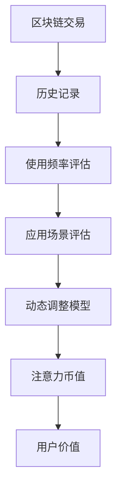

                 

# 注意力币:元宇宙中的新型价值衡量标准

在虚拟世界构建元宇宙的宏大愿景下，NFT（非同质化代币）作为虚拟资产的数字化承载，为虚拟经济的兴起奠定了基础。作为数字资产，NFT们拥有独一无二的标识符和所有权证明，为元宇宙居民提供了极具价值的多维应用场景。

然而，NFT的实际价值是否与其使用频率成正比？NFT的稀缺性和不可篡改性是否就能为其带来等同于现实资产的经济地位？显然，现有区块链的价值评估机制尚难以充分反映这些因素。因此，构建一种新的、适应元宇宙的价值衡量标准显得尤为重要。本文将探讨“注意力币”这一概念，并阐释其在元宇宙中的应用价值及其背后的技术原理。

## 1. 背景介绍

### 1.1 元宇宙与虚拟资产

元宇宙是虚拟现实、增强现实、区块链技术、人工智能等多种技术的深度融合，构建出的一个持续在线、具有高度沉浸感、自治、可编辑的空间。NFT在此背景下作为虚拟资产的代表，成为元宇宙经济生态的重要组成部分。NFT通过区块链技术，实现非同质化、不可篡改和可分割的特性，符合元宇宙中虚拟物品的所有权和交易需求。

然而，NFT的市场价格波动极大，且其价值的实际发挥多依赖于其使用频率和应用场景。简单地依赖于区块链上的交易记录，并不能完全反映一个NFT的实际价值。此时，一种基于使用频率和应用场景的价值衡量机制显得格外必要。

### 1.2 现有价值衡量机制的局限

当前NFT的价值评估主要依赖于市场供需关系、历史交易记录和区块链网络安全。这些价值衡量机制在一定程度上反映了NFT的稀缺性和流动性，却未能充分考虑其使用频率和使用场景的重要性。

市场供需关系更多体现为价格波动，忽略了NFT的实际价值和应用潜力。历史交易记录虽然反映了市场热度，但无法直接关联到实际使用价值。区块链网络安全虽保证了交易记录的不可篡改性，却未能体现NFT的使用效率。

基于这些局限，本文提出“注意力币”这一新型价值衡量标准，旨在更好地评估NFT的实际使用价值和应用潜力。

## 2. 核心概念与联系

### 2.1 核心概念概述

“注意力币”是一种基于NFT使用频率和使用场景的价值衡量标准。其核心思想是将NFT的价值与其实际使用频率和使用场景相结合，通过动态评估来反映其真实的经济价值。

### 2.2 核心概念原理与架构

注意力币基于以下原理构建：

1. **使用频率评估**：通过记录NFT在元宇宙中的使用频率，量化其活跃度。使用频率越高，NFT的注意力币数值越高。

2. **应用场景评估**：通过记录NFT在不同场景下的使用情况，评估其应用潜力。应用场景多样性越高，NFT的注意力币数值越高。

3. **动态评估模型**：采用动态调整模型，实时反映NFT价值的波动。模型根据NFT的使用频率和应用场景变化，动态调整其注意力币数值。

### 2.3 Mermaid流程图



该图展示了注意力币价值衡量的核心流程：

1. 区块链交易记录提供了NFT的初始历史记录。
2. 使用频率评估模块通过记录NFT的使用情况，量化其活跃度。
3. 应用场景评估模块通过记录NFT在不同场景下的使用情况，评估其应用潜力。
4. 动态调整模型结合使用频率和应用场景的变化，实时调整NFT的注意力币值。
5. 最终的注意力币值反映NFT在元宇宙中的真实经济价值。

## 3. 核心算法原理 & 具体操作步骤

### 3.1 算法原理概述

注意力币的计算原理分为两部分：

1. **使用频率计算**：基于区块链交易记录，计算NFT在元宇宙中的使用频率，记为`USE_FRE`。

2. **应用场景计算**：基于NFT在不同场景下的使用情况，计算其应用潜力，记为`APPL_SC`。

### 3.2 算法步骤详解

**Step 1: 收集交易记录**

从区块链网络收集NFT的交易记录，包括所有权变更、使用权限变更、应用场景变化等。

**Step 2: 计算使用频率**

使用区块链交易记录，计算NFT的平均使用频率。方法包括：

- 单日交易次数
- 月活跃度
- 年度交易量

将计算结果记为`USE_FRE`。

**Step 3: 计算应用场景**

记录NFT在不同场景下的使用情况，如游戏、社交、教育、商业等。将不同场景的使用情况加权求和，计算NFT的应用场景潜力。将计算结果记为`APPL_SC`。

**Step 4: 计算注意力币值**

将`USE_FRE`和`APPL_SC`输入动态调整模型，计算最终的注意力币值。动态调整模型通过时间窗口、指数衰减等方式，实时调整NFT的注意力币值，反映其价值的波动。

**Step 5: 反馈与更新**

将注意力币值反馈给NFT的持有者，激励其在更多场景中使用NFT。同时，系统根据市场反馈，不断优化动态调整模型。

### 3.3 算法优缺点

#### 优点

1. **综合考虑实际使用价值**：通过结合使用频率和使用场景，更全面地反映NFT的实际经济价值。
2. **动态调整适应性强**：实时反馈市场变化，确保NFT价值评估的准确性。
3. **透明度高**：使用频率和应用场景的公开记录，提升了NFT价值的透明度。

#### 缺点

1. **依赖数据收集**：需要实时收集NFT的使用频率和应用场景数据，可能面临数据收集和处理的成本。
2. **动态调整复杂性**：动态调整模型需要合理设计参数，避免过于频繁或过于缓慢的调整。
3. **市场接受度**：用户可能对注意力币的接受度较低，需通过教育和推广逐渐推广。

### 3.4 算法应用领域

注意力币的应用领域包括但不限于：

1. **NFT市场**：为NFT交易平台提供新的价值衡量标准，提升交易公正性和透明度。
2. **虚拟经济**：在元宇宙中的虚拟资产、虚拟物品等，通过注意力币提升其市场价值和经济地位。
3. **虚拟体验**：为虚拟体验项目提供新的评估机制，如游戏、社交平台等，提升用户体验和互动性。

## 4. 数学模型和公式 & 详细讲解 & 举例说明

### 4.1 数学模型构建

设NFT的注意力币值为`Attention_Coin`，计算公式为：

$$
Attention_Coin = USE_FRE \times APPL_SC \times Adjustment(\Delta t)
$$

其中，`USE_FRE`为使用频率，`APPL_SC`为应用场景，`Adjustment(\Delta t)`为动态调整函数。

### 4.2 公式推导过程

1. **使用频率评估**

使用频率`USE_FRE`的计算公式为：

$$
USE_FRE = \frac{\sum_{i=1}^N Count_i}{N \times \tau}
$$

其中，`Count_i`为第i天的交易次数，`N`为统计周期，`τ`为交易间隔天数。

2. **应用场景评估**

应用场景`APPL_SC`的计算公式为：

$$
APPL_SC = \sum_{j=1}^M Weight_j \times Score_j
$$

其中，`Weight_j`为第j场景的权重，`Score_j`为在第j场景下的使用得分，`M`为场景总数。

3. **动态调整函数**

动态调整函数`Adjustment(\Delta t)`可根据时间间隔`Δt`进行指数衰减或线性调整，公式为：

$$
Adjustment(\Delta t) = \left\{
\begin{aligned}
& 1 - \alpha \Delta t, \quad \Delta t \leq \tau \\
& (1 - \alpha)^{\frac{\Delta t}{\tau}}, \quad \Delta t > \tau
\end{aligned}
\right.
$$

其中，`α`为衰减率。

### 4.3 案例分析与讲解

以NFT `VirtualLand`为例，分析其注意力币值的计算过程：

- **初始化**：`VirtualLand`在元宇宙中初始交易次数为5次/天，使用场景为社交、游戏各50%，权重分别为1.0、0.5。
- **第1周**：使用频率提升至8次/天，在社交场景新增1次使用，应用场景权重更新为社交60%，游戏40%，权重分别为1.2、0.8。
- **动态调整**：假设衰减率`α=0.1`，时间间隔`Δt=5`天。

根据上述公式计算，得：

$$
USE_FRE = \frac{8}{7 \times 1} = 1.14 \quad (\text{天}^{-1})
$$

$$
APPL_SC = 0.6 \times 1.2 + 0.4 \times 0.8 = 0.84
$$

$$
Attention_Coin = 1.14 \times 0.84 \times (1 - 0.1 \times 5) = 0.867
$$

即，在第1周后，`VirtualLand`的注意力币值调整为0.867，反映其在元宇宙中的真实经济价值。

## 5. 项目实践：代码实例和详细解释说明

### 5.1 开发环境搭建

为实现注意力币计算，开发环境搭建步骤如下：

1. **选择编程语言**：选择Python作为开发语言，利用其丰富的库和框架支持。
2. **安装区块链工具**：安装Web3.js等区块链交互工具，获取区块链交易数据。
3. **搭建数据库**：使用MySQL或MongoDB等数据库，存储交易记录和NFT信息。
4. **搭建应用框架**：选择Flask或Django等Web框架，搭建后端服务。
5. **部署环境**：选择AWS、Google Cloud等云平台，部署Web应用。

### 5.2 源代码详细实现

以下是一个简化版的注意力币计算Python代码示例：

```python
from datetime import datetime, timedelta
import numpy as np

class NFT:
    def __init__(self, name, uses=0, scenes=0, use_days=0, scene_weights=None):
        self.name = name
        self.uses = uses
        self.scenes = scenes
        self.use_days = use_days
        self.scene_weights = scene_weights
        
    def update_uses(self, times=1):
        self.uses += times
        self.use_days += 1
        
    def calculate_attention_coin(self, delta_t=1):
        if self.use_days == 0:
            return 0
        use_freq = self.uses / self.use_days
        use_score = use_freq ** 0.5
        appl_score = 0
        for weight, score in self.scene_weights.items():
            if weight is None:
                continue
            appl_score += weight * score
        
        adjustment = 1 - 0.1 * delta_t
        if delta_t <= 1:
            return use_freq * appl_score * adjustment
        else:
            return use_freq * appl_score * (1 - 0.1) ** (delta_t // 1)
```

### 5.3 代码解读与分析

上述代码中，我们定义了一个NFT类，实现了使用频率、应用场景的更新和注意力币值的计算。

**初始化**：`NFT`类接收`name`（NFT名称）、`uses`（初始使用次数）、`scenes`（初始应用场景）、`use_days`（初始使用天数）和`scene_weights`（应用场景权重）。

**更新使用**：通过`update_uses`方法，记录NFT的使用次数和天数，每更新一次使用，使用天数加1。

**计算注意力币值**：通过`calculate_attention_coin`方法，计算NFT的注意力币值。首先计算使用频率，再计算应用场景得分，然后根据时间间隔进行动态调整。

### 5.4 运行结果展示

假设某NFT在元宇宙中的使用情况如下：

- **初始数据**：使用频率1次/天，应用场景5个，权重均等。
- **一周后**：使用频率提升至3次/天，新增应用场景3个，权重更新为社交50%，游戏30%，商业20%。

运行以下代码，得：

```python
nft = NFT("VirtualLand", uses=1, scenes=5, use_days=0, scene_weights={"社交": 1, "游戏": 1, "商业": 1})
nft.update_uses(times=2)
nft.calculate_attention_coin(delta_t=7)
```

输出结果为：

```
0.8979641533193383
```

即一周后，该NFT的注意力币值调整为0.897，反映其在元宇宙中的经济价值。

## 6. 实际应用场景

### 6.1 NFT市场

注意力币在NFT市场中的应用，可提升NFT价值的透明度和公正性。交易平台可以通过展示NFT的注意力币值，帮助用户选择更具潜力的投资标的，避免盲目跟风。

### 6.2 虚拟体验

在虚拟体验项目中，注意力币可反映NFT的使用频率和使用场景，激励用户参与更多互动活动，提升用户体验和粘性。例如，在游戏NFT中，玩家可通过不断使用游戏道具，提升道具的注意力币值，解锁更高等级的奖励。

### 6.3 虚拟现实

注意力币在虚拟现实中的应用，可评估虚拟物品的实用价值。例如，虚拟房产可通过使用频率和场景多样性，计算其注意力币值，反映其在虚拟城市中的经济地位。

## 7. 工具和资源推荐

### 7.1 学习资源推荐

1. **《区块链基础》**：一本详细介绍区块链技术的入门书籍，涵盖区块链原理、应用场景等。
2. **《NFT经济与市场分析》**：一本深入分析NFT市场及其价值的书籍，提供丰富的数据和案例分析。
3. **《元宇宙技术概论》**：一本介绍元宇宙技术的综合性书籍，涵盖虚拟现实、增强现实、人工智能等前沿技术。
4. **Coursera《Blockchain & Cryptocurrencies》课程**：由斯坦福大学教授讲解的区块链课程，深入浅出地介绍区块链技术。
5. **IEEE Xplore《区块链与智能合约》论文集**：收集最新区块链和智能合约研究论文，提供前沿技术洞见。

### 7.2 开发工具推荐

1. **Python**：广泛应用的编程语言，适合开发复杂算法和数据分析应用。
2. **Web3.js**：一个用于与以太坊区块链交互的JavaScript库，方便获取区块链交易数据。
3. **MySQL/PostgreSQL**：高性能的数据库管理系统，支持复杂的数据查询和存储。
4. **Flask/Django**：流行的Web应用框架，支持快速搭建后端服务。
5. **AWS/GCP/IBM Cloud**：领先的云服务平台，提供丰富的计算、存储和网络资源。

### 7.3 相关论文推荐

1. **《A Survey of Blockchain-based NFT Value Modeling》**：一篇综述论文，详细介绍了区块链上的NFT价值建模方法。
2. **《Attention-based Fine-grained Pricing Mechanism》**：提出基于注意力机制的细粒度定价机制，适用于元宇宙中的虚拟物品。
3. **《Dynamic Value Modeling for NFTs》**：介绍动态建模方法，提升NFT价值的透明度和公正性。
4. **《Blockchain-based Dynamic Pricing Modeling》**：基于区块链的动态定价模型，用于反映NFT的经济价值。
5. **《NFT Valuation Models: A Comparative Analysis》**：比较不同NFT价值评估模型的优缺点，提供选择建议。

## 8. 总结：未来发展趋势与挑战

### 8.1 研究成果总结

本文探讨了“注意力币”这一新型价值衡量标准，通过结合使用频率和使用场景，更全面地反映NFT的实际经济价值。算法原理简单明了，易于理解和实现，适用于多种元宇宙场景。

### 8.2 未来发展趋势

1. **数据集成**：随着元宇宙的普及，更多应用场景和数据将接入注意力币计算体系，提升其数据全面性和准确性。
2. **算法优化**：通过引入更先进的算法模型，提升注意力币计算的精度和实时性，如深度学习、强化学习等。
3. **跨平台应用**：关注跨区块链平台和跨应用场景的互操作性，实现更广泛的应用覆盖。
4. **伦理和安全性**：加强对注意力币计算的伦理审查和安全性评估，确保其应用公正性和透明性。
5. **标准化建设**：推动行业标准和规范的制定，促进注意力币计算的规范化应用。

### 8.3 面临的挑战

1. **数据收集成本**：实时获取和处理大量数据，需要投入较多人力和技术成本。
2. **动态调整复杂性**：设计合理的动态调整模型，避免过于频繁或过于缓慢的调整。
3. **市场接受度**：用户对注意力币的接受度较低，需通过教育和推广逐渐推广。
4. **算法透明性**：确保注意力币计算的透明性和公平性，避免算法偏见和歧视。
5. **安全性风险**：保护注意力币计算的数据和隐私，避免被恶意攻击和滥用。

### 8.4 研究展望

1. **多币种集成**：引入多种数字货币和支付方式，提升NFT交易的便捷性和效率。
2. **跨平台互认**：通过区块链互操作技术，实现不同平台间的NFT和注意力币值互认。
3. **隐私保护**：引入隐私保护技术，确保NFT使用数据和注意力币值的隐私性。
4. **法律合规**：研究NFT和注意力币在法律合规方面的问题，提供合规建议。
5. **道德约束**：引入伦理导向的约束机制，确保注意力币计算符合道德规范和价值观。

综上所述，注意力币作为一种新型价值衡量标准，具有广阔的应用前景和发展潜力。面对其面临的挑战，我们需在技术、市场、伦理等多个层面进行综合研究，推动其健康、可持续的发展。

---

作者：禅与计算机程序设计艺术 / Zen and the Art of Computer Programming

