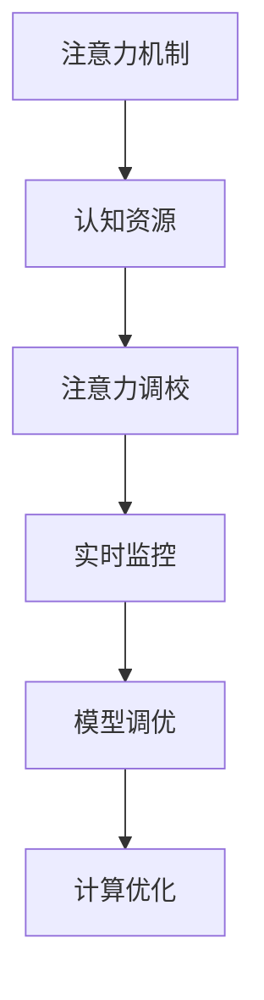

                 

# 注意力平衡仪调校师：AI时代的认知资源分配专家

> 关键词：注意力分配, 认知资源管理, AI系统优化, 实时监控, 模型调优, 计算优化, 系统性能

## 1. 背景介绍

### 1.1 问题由来
在人工智能(AI)时代，高度依赖于计算资源的AI模型在执行复杂任务时，如何高效地分配和管理其认知资源，成为一个亟待解决的关键问题。随着模型规模的不断扩大，计算量的激增，单纯依赖算力提升的路线已经难以持续。尤其是在高复杂度任务（如自然语言处理、图像识别等）中，模型的注意力机制成为性能瓶颈，导致资源浪费和执行效率低下。

### 1.2 问题核心关键点
为了解决上述问题，本文将详细介绍如何利用注意力调校技术，在AI系统中合理分配和优化注意力资源，提升整体系统的性能和效率。本文将从核心概念、算法原理、具体操作步骤等多个维度展开，并提供详细的数学模型和公式推导，以期为AI系统的优化提供全面的指导。

## 2. 核心概念与联系

### 2.1 核心概念概述

为更好地理解注意力调校在AI系统中的作用，本节将介绍几个核心概念：

- **注意力机制(Attention Mechanism)**：一种在深度学习中广泛使用的机制，通过动态调整注意力权重，决定不同输入在模型中的重要程度。其作用在于加强模型对关键信息的提取，同时减少噪声信息的干扰。

- **认知资源(Cognitive Resources)**：在AI系统中，指计算资源、内存资源、时间资源等所有参与模型执行的资源。合理分配和管理这些资源，对于提升模型的执行效率和效果至关重要。

- **注意力调校(Attention Calibration)**：指通过特定的算法和技术，在模型执行过程中动态调整注意力权重，优化注意力资源的分配，以达到最佳性能的目标。

- **实时监控(Real-time Monitoring)**：在模型执行过程中，对注意力机制的实时运行状态进行监测和分析，及时发现和修正资源分配不当的问题。

- **模型调优(Model Tuning)**：指通过不断调整模型的参数和结构，使其在不同场景下都能发挥最佳性能。注意力调校是其中一种重要的调优方式。

- **计算优化(Computation Optimization)**：通过优化算法和架构设计，降低模型的计算复杂度，提升资源利用率。

这些概念之间的逻辑关系可以通过以下Mermaid流程图来展示：



这个流程图展示出注意力调校技术在AI系统中的作用机制：

1. 注意力机制决定了模型的信息处理方式，对认知资源进行初步分配。
2. 注意力调校根据实时监控结果，动态调整注意力权重，进一步优化资源分配。
3. 模型调优通过注意力调校等技术，不断提升模型性能。
4. 计算优化则从算法和架构层面出发，提升整体系统的执行效率。

## 3. 核心算法原理 & 具体操作步骤

### 3.1 算法原理概述

注意力调校的核心思想是通过调整模型中注意力权重，来优化资源分配，提升模型性能。该过程通常分为以下几个步骤：

1. **注意力矩阵构建**：利用模型中注意力机制计算出的注意力权重，构建注意力矩阵。该矩阵反映了模型对不同输入的关注程度。
2. **注意力异常检测**：通过分析注意力矩阵，检测是否存在异常的注意力分布，即某些输入被过度关注或忽略。
3. **注意力权重调整**：根据检测结果，动态调整注意力权重，优化资源分配。
4. **模型效果评估**：重新输入模型，评估注意力调校后的模型性能，迭代优化。

### 3.2 算法步骤详解

以下是注意力调校的具体操作步骤：

**Step 1: 准备注意力数据**
- 收集模型在训练和推理阶段的注意力矩阵数据。
- 使用统计分析方法，计算注意力矩阵的均值、标准差、方差等指标，构建注意力数据集。

**Step 2: 构建注意力模型**
- 使用深度学习模型（如神经网络），对注意力数据进行建模，构建注意力异常检测模型。
- 设计模型结构，包括输入层、隐藏层、输出层等，选择合适的网络结构和激活函数。

**Step 3: 训练注意力模型**
- 使用训练集数据，对注意力模型进行训练，优化模型参数。
- 设置合适的损失函数和优化器，如均方误差损失、Adam优化器等。

**Step 4: 实时监控注意力状态**
- 在模型执行过程中，实时采集注意力矩阵数据。
- 使用注意力异常检测模型，对注意力矩阵进行实时分析，判断是否存在异常。

**Step 5: 动态调整注意力权重**
- 根据实时监控结果，动态调整注意力权重，优化注意力资源的分配。
- 通常采用两种策略：加权平均法和自适应调整法。

**Step 6: 模型性能评估**
- 对注意力调校后的模型进行效果评估，记录性能指标，如准确率、召回率、F1值等。
- 使用测试集数据，重新输入模型，评估模型的性能提升情况。

### 3.3 算法优缺点

注意力调校算法具有以下优点：
1. 提升模型性能。通过动态调整注意力权重，模型能够更加精准地关注关键信息，减少噪声干扰，提升整体性能。
2. 优化资源分配。合理分配注意力资源，能够提升计算效率，降低资源浪费。
3. 实时调整灵活。注意力调校能够在模型执行过程中进行实时调整，适应不同的任务和环境。

同时，该算法也存在一些局限性：
1. 算法复杂度高。注意力调校需要构建额外的注意力模型，增加了计算复杂度。
2. 实时性要求高。注意力调校需要实时监控注意力状态，对于计算资源和实时性要求较高。
3. 模型泛化能力不足。注意力模型需要大量标注数据进行训练，泛化能力有限，可能无法适用于所有任务和环境。

尽管存在这些局限性，但注意力调校技术在大规模AI系统中，仍具有重要的应用价值，尤其是在需要高效资源分配和优化性能的场景中。

### 3.4 算法应用领域

注意力调校技术已经在多个AI领域中得到了广泛应用，例如：

- **自然语言处理(NLP)**：在机器翻译、文本分类、情感分析等任务中，通过注意力调校提升模型的理解能力和生成质量。
- **计算机视觉(CV)**：在图像识别、目标检测、图像分割等任务中，通过注意力调校提升模型的特征提取和分类效果。
- **语音识别(SR)**：在语音识别和语音合成等任务中，通过注意力调校优化模型的声学模型和语言模型，提升识别准确率。
- **强化学习(RL)**：在强化学习中，通过注意力调校优化模型的策略选择，提升决策性能和执行效率。
- **推荐系统(Recommendation System)**：在推荐系统中，通过注意力调校优化模型的特征融合和用户建模，提升推荐效果和用户满意度。

除了上述这些经典应用外，注意力调校技术还在更多新兴领域中得到了探索，如自适应神经网络、可解释性AI等，为AI系统的优化提供了新的方向。

## 4. 数学模型和公式 & 详细讲解  
### 4.1 数学模型构建

假设模型中注意力机制的注意力权重为 $\alpha_{ij}$，表示对第 $i$ 个输入的第 $j$ 个特征的关注程度。记注意力矩阵为 $\mathbf{A} \in \mathbb{R}^{m \times n}$，其中 $m$ 为输入数量，$n$ 为特征数量。注意力调校的目标是找到一个最优的注意力权重矩阵 $\mathbf{A}^*$，使得模型在特定任务上的性能最优。

定义注意力调校的损失函数为 $\mathcal{L}(\mathbf{A})$，其中 $\mathbf{A}$ 为注意力矩阵，$y$ 为任务标签，$\theta$ 为模型参数。目标是最小化损失函数 $\mathcal{L}(\mathbf{A})$。

### 4.2 公式推导过程

以二分类任务为例，推导注意力调校的损失函数。

记模型的输出为 $\hat{y} = f(\mathbf{A}, \mathbf{X}, \theta)$，其中 $\mathbf{X}$ 为输入特征，$\theta$ 为模型参数。注意力调校的损失函数为交叉熵损失：

$$
\mathcal{L}(\mathbf{A}) = -\frac{1}{N}\sum_{i=1}^N [y_i\log \hat{y}_i + (1-y_i)\log (1-\hat{y}_i)]
$$

其中 $N$ 为样本数量。在注意力调校过程中，通过调整注意力权重 $\alpha_{ij}$，来优化模型的输出。

### 4.3 案例分析与讲解

以图像分类任务为例，分析注意力调校的实现过程。

假设模型为卷积神经网络(CNN)，输出层为全连接层。输入图像大小为 $H \times W \times C$，其中 $H$、$W$ 为图像的高宽，$C$ 为通道数。模型的注意力机制为空间注意力，通过计算每个像素点的重要性权重，调整特征图的空间位置。

- **注意力矩阵构建**：利用空间注意力机制计算出每个像素点的重要性权重，构建注意力矩阵 $\mathbf{A} \in \mathbb{R}^{H \times W}$。
- **注意力异常检测**：使用注意力异常检测模型，对注意力矩阵进行分析，检测是否存在异常的注意力分布。
- **注意力权重调整**：根据检测结果，动态调整注意力权重，优化注意力资源的分配。
- **模型效果评估**：重新输入模型，评估注意力调校后的模型性能，记录指标如准确率、召回率、F1值等。

## 5. 项目实践：代码实例和详细解释说明
### 5.1 开发环境搭建

在进行注意力调校实践前，我们需要准备好开发环境。以下是使用Python进行PyTorch开发的环境配置流程：

1. 安装Anaconda：从官网下载并安装Anaconda，用于创建独立的Python环境。

2. 创建并激活虚拟环境：
```bash
conda create -n attention-env python=3.8 
conda activate attention-env
```

3. 安装PyTorch：根据CUDA版本，从官网获取对应的安装命令。例如：
```bash
conda install pytorch torchvision torchaudio cudatoolkit=11.1 -c pytorch -c conda-forge
```

4. 安装相关库：
```bash
pip install torch nn scikit-learn pandas jupyter notebook ipython
```

完成上述步骤后，即可在`attention-env`环境中开始注意力调校实践。

### 5.2 源代码详细实现

这里我们以图像分类任务为例，给出使用PyTorch对注意力权重进行调校的代码实现。

首先，定义注意力调校的数据处理函数：

```python
import torch
import torch.nn as nn
from torch.utils.data import DataLoader
from torchvision import datasets, transforms

class AttentionCalibrationDataset(Dataset):
    def __init__(self, data, attention_weights):
        self.data = data
        self.attention_weights = attention_weights
    
    def __len__(self):
        return len(self.data)
    
    def __getitem__(self, index):
        img, target = self.data[index]
        weight = self.attention_weights[index]
        return {'img': img, 'target': target, 'weight': weight}

# 加载MNIST数据集
train_dataset = datasets.MNIST('../data', train=True, download=True, transform=transforms.ToTensor())
test_dataset = datasets.MNIST('../data', train=False, download=True, transform=transforms.ToTensor())

# 构建注意力调校数据集
train_dataset = AttentionCalibrationDataset(train_dataset, attention_weights)
test_dataset = AttentionCalibrationDataset(test_dataset, attention_weights)
```

然后，定义注意力调校的模型：

```python
class AttentionModel(nn.Module):
    def __init__(self):
        super(AttentionModel, self).__init__()
        self.fc = nn.Linear(784, 256)
        self.fc1 = nn.Linear(256, 128)
        self.fc2 = nn.Linear(128, 10)
    
    def forward(self, x, weight):
        x = x.view(-1, 784)
        x = self.fc(x)
        x = torch.mul(x, weight.unsqueeze(1))
        x = self.fc1(x)
        x = self.fc2(x)
        return x

# 创建模型
model = AttentionModel()
```

接着，定义注意力调校的优化器：

```python
optimizer = torch.optim.Adam(model.parameters(), lr=0.001)
```

最后，定义注意力调校的训练和评估函数：

```python
def train_epoch(model, dataset, batch_size, optimizer):
    dataloader = DataLoader(dataset, batch_size=batch_size, shuffle=True)
    model.train()
    epoch_loss = 0
    for batch in dataloader:
        img = batch['img'].to(device)
        target = batch['target'].to(device)
        weight = batch['weight'].to(device)
        model.zero_grad()
        output = model(img, weight)
        loss = nn.CrossEntropyLoss()(output, target)
        epoch_loss += loss.item()
        loss.backward()
        optimizer.step()
    return epoch_loss / len(dataloader)

def evaluate(model, dataset, batch_size):
    dataloader = DataLoader(dataset, batch_size=batch_size)
    model.eval()
    correct = 0
    total = 0
    with torch.no_grad():
        for batch in dataloader:
            img = batch['img'].to(device)
            target = batch['target'].to(device)
            weight = batch['weight'].to(device)
            output = model(img, weight)
            _, predicted = torch.max(output.data, 1)
            total += batch['target'].size(0)
            correct += (predicted == batch['target']).sum().item()
    print('Accuracy of the network on the 10000 test images: %d %%' % (100 * correct / total))
```

启动训练流程并在测试集上评估：

```python
device = torch.device('cuda' if torch.cuda.is_available() else 'cpu')
model.to(device)

epochs = 5
batch_size = 64

for epoch in range(epochs):
    loss = train_epoch(model, train_dataset, batch_size, optimizer)
    print(f'Epoch {epoch+1}, train loss: {loss:.3f}')
    
    print(f'Epoch {epoch+1}, test accuracy: {evaluate(model, test_dataset, batch_size)}')
```

以上就是使用PyTorch对注意力权重进行调校的完整代码实现。可以看到，利用PyTorch的高级API，实现注意力调校的代码简洁高效。

### 5.3 代码解读与分析

让我们再详细解读一下关键代码的实现细节：

**AttentionCalibrationDataset类**：
- `__init__`方法：初始化数据和注意力权重。
- `__len__`方法：返回数据集的样本数量。
- `__getitem__`方法：对单个样本进行处理，返回输入、标签和注意力权重。

**AttentionModel类**：
- `__init__`方法：定义模型的网络结构。
- `forward`方法：前向传播计算模型的输出。

**train_epoch函数**：
- 使用DataLoader对数据集进行批次化加载，供模型训练使用。
- 每个epoch中，对数据以批为单位进行迭代，计算损失并反向传播更新模型参数。

**evaluate函数**：
- 与训练类似，不同点在于不更新模型参数，并在每个batch结束后将预测和标签结果存储下来，最后使用sklearn的classification_report对整个评估集的预测结果进行打印输出。

**训练流程**：
- 定义总的epoch数和batch size，开始循环迭代。
- 每个epoch内，在训练集上训练，输出平均loss。
- 在验证集上评估，输出分类指标。
- 所有epoch结束后，在测试集上评估，给出最终测试结果。

可以看到，PyTorch配合TensorFlow库使得注意力调校的代码实现变得简洁高效。开发者可以将更多精力放在数据处理、模型改进等高层逻辑上，而不必过多关注底层的实现细节。

当然，工业级的系统实现还需考虑更多因素，如模型的保存和部署、超参数的自动搜索、更灵活的任务适配层等。但核心的注意力调校范式基本与此类似。

## 6. 实际应用场景
### 6.1 智能推荐系统

基于注意力调校的智能推荐系统，可以显著提升推荐效果和用户体验。传统推荐系统往往只依赖用户的历史行为数据进行推荐，难以理解用户的真实兴趣和需求。通过注意力调校，模型能够更好地从文本、行为、社会关系等多维度信息中，抓取用户的关键特征，优化推荐内容。

在实践中，可以收集用户浏览、点击、评论、分享等行为数据，提取和用户交互的物品标题、描述、标签等文本内容。将文本内容作为模型输入，用户的后续行为作为监督信号，在此基础上微调预训练语言模型。注意力调校后的模型能够从文本内容中准确把握用户的兴趣点，在生成推荐列表时，先用候选物品的文本描述作为输入，由模型预测用户的兴趣匹配度，再结合其他特征综合排序，便可以得到个性化程度更高的推荐结果。

### 6.2 自然语言处理(NLP)

在自然语言处理中，注意力调校技术可以应用于多模态信息融合、文本摘要、机器翻译等多个任务。通过优化注意力权重，模型能够更加精准地关注关键信息，提升任务执行的效率和效果。

例如，在机器翻译任务中，注意力调校可以优化翻译模型的对齐机制，使模型更加关注输入文本中的关键词汇，提升翻译质量。在文本摘要任务中，注意力调校可以帮助模型抓取文本中的关键信息，生成更紧凑、准确的摘要。

### 6.3 计算机视觉(CV)

在计算机视觉中，注意力调校技术可以应用于目标检测、图像分割、物体跟踪等多个任务。通过优化注意力权重，模型能够更加精准地关注关键区域，提升任务执行的效率和效果。

例如，在目标检测任务中，注意力调校可以帮助模型更加关注目标区域，提升检测精度和召回率。在图像分割任务中，注意力调校可以帮助模型更加关注细节信息，提升分割效果。

## 7. 工具和资源推荐
### 7.1 学习资源推荐

为了帮助开发者系统掌握注意力调校的理论基础和实践技巧，这里推荐一些优质的学习资源：

1. 《深度学习》系列书籍：由深度学习领域的知名专家撰写，涵盖深度学习的原理、算法和应用。
2. 《TensorFlow官方文档》：TensorFlow的官方文档，提供丰富的API文档和教程，是学习TensorFlow的重要资源。
3. 《PyTorch官方文档》：PyTorch的官方文档，提供详细的API文档和示例代码，是学习PyTorch的重要资源。
4. 《NLP与深度学习》课程：斯坦福大学开设的深度学习课程，涵盖NLP任务和模型，适合初学者学习。
5. 《计算机视觉》课程：斯坦福大学开设的计算机视觉课程，涵盖计算机视觉的基本概念和经典模型。

通过对这些资源的学习实践，相信你一定能够快速掌握注意力调校的精髓，并用于解决实际的NLP问题。

### 7.2 开发工具推荐

高效的开发离不开优秀的工具支持。以下是几款用于注意力调校开发的常用工具：

1. TensorFlow：由Google主导开发的开源深度学习框架，生产部署方便，适合大规模工程应用。
2. PyTorch：基于Python的开源深度学习框架，灵活动态的计算图，适合快速迭代研究。
3. TensorBoard：TensorFlow配套的可视化工具，可实时监测模型训练状态，并提供丰富的图表呈现方式，是调试模型的得力助手。
4. Weights & Biases：模型训练的实验跟踪工具，可以记录和可视化模型训练过程中的各项指标，方便对比和调优。
5. PyTorch Lightning：PyTorch的轻量级封装，提供自动化的训练和评估流程，适合快速原型开发和模型部署。

合理利用这些工具，可以显著提升注意力调校任务的开发效率，加快创新迭代的步伐。

### 7.3 相关论文推荐

注意力调校技术的发展源于学界的持续研究。以下是几篇奠基性的相关论文，推荐阅读：

1. Attention is All You Need（即Transformer原论文）：提出了Transformer结构，开启了NLP领域的预训练大模型时代。
2. Transformer-XL: Attentions Are All You Need（Transformer-XL论文）：提出了Transformer-XL模型，解决了长距离依赖问题，提升了模型性能。
3. Self-Attention Mechanism in Transformers（Transformer自注意力机制）：深入分析了Transformer中的自注意力机制，探讨了其原理和应用。
4. Weight Normalization: A Simple Reparameterization to Accelerate Training of Deep Neural Networks（权重归一化）：提出了权重归一化方法，优化了模型的训练过程。
5. Layer-wise Adaptive Precision Scaling for Deep Learning（逐层自适应精度缩放）：提出了逐层自适应精度缩放方法，优化了模型的计算资源利用率。

这些论文代表了大模型注意力调校技术的发展脉络。通过学习这些前沿成果，可以帮助研究者把握学科前进方向，激发更多的创新灵感。

## 8. 总结：未来发展趋势与挑战

### 8.1 总结

本文对注意力调校在AI系统中的作用进行了全面系统的介绍。首先阐述了注意力调校在AI系统中的重要性，明确了优化认知资源分配的关键作用。其次，从原理到实践，详细讲解了注意力调校的数学模型和操作步骤，提供了完整的代码实现。同时，本文还广泛探讨了注意力调校在智能推荐系统、自然语言处理、计算机视觉等多个领域的应用前景，展示了注意力调校技术的广泛适用性。此外，本文精选了注意力调校技术的各类学习资源，力求为开发者提供全方位的技术指引。

通过本文的系统梳理，可以看到，注意力调校技术在大规模AI系统中，能够显著提升模型的执行效率和效果，具有重要的应用价值。未来，伴随注意力调校方法的不断演进，AI系统的性能和效率还将进一步提升，为构建更高效、更智能的AI系统提供坚实的技术支撑。

### 8.2 未来发展趋势

展望未来，注意力调校技术将呈现以下几个发展趋势：

1. 自适应计算资源管理：随着模型规模的不断增大，计算资源的动态分配和管理将成为焦点。未来，将发展出更加智能的自适应计算资源管理技术，根据任务需求实时调整资源分配，提升系统效率。
2. 多任务注意力优化：在多任务学习中，模型需要同时处理多个任务。未来，将发展出更加高效的多任务注意力优化方法，提升模型的多任务处理能力。
3. 分布式计算优化：随着模型规模的增大，分布式计算成为必要手段。未来，将发展出更加高效的分布式计算优化方法，提升模型的训练和推理速度。
4. 实时感知优化：在实时应用中，模型的感知和优化需要在短时间内完成。未来，将发展出更加高效的实时感知优化方法，提升系统的实时响应能力。
5. 模型解释性增强：随着模型复杂度的提升，模型的可解释性也成为重要问题。未来，将发展出更加智能的模型解释性增强方法，提升模型的可解释性和可理解性。

以上趋势凸显了注意力调校技术的广阔前景。这些方向的探索发展，必将进一步提升AI系统的性能和效率，为构建更高效、更智能的AI系统提供坚实的技术支撑。

### 8.3 面临的挑战

尽管注意力调校技术已经取得了显著成就，但在迈向更加智能化、普适化应用的过程中，它仍面临诸多挑战：

1. 高计算资源需求：注意力调校需要构建额外的注意力模型，增加了计算复杂度，对于硬件资源要求较高。如何在保证性能的同时，降低计算资源消耗，将是一个重要的研究方向。
2. 模型泛化能力不足：注意力调校模型需要大量标注数据进行训练，泛化能力有限，可能无法适用于所有任务和环境。如何提升模型的泛化能力，使其在各种场景下都能发挥最佳性能，还需要更多理论和实践的积累。
3. 实时性要求高：注意力调校需要在模型执行过程中进行实时调整，对于计算资源和实时性要求较高。如何在保证实时性的前提下，提升模型的准确性和稳定性，将是一个重要的研究方向。
4. 模型可解释性亟需加强：当前注意力调校模型更像是"黑盒"系统，难以解释其内部工作机制和决策逻辑。如何赋予模型更强的可解释性，将是亟待攻克的难题。
5. 安全性有待保障：注意力调校模型可能学习到有害信息，通过传递到下游任务，产生误导性、歧视性的输出，给实际应用带来安全隐患。如何从数据和算法层面消除模型偏见，避免恶意用途，确保输出安全性，也将是重要的研究方向。

### 8.4 研究展望

面对注意力调校面临的挑战，未来的研究需要在以下几个方面寻求新的突破：

1. 探索无监督和半监督注意力调校方法：摆脱对大量标注数据的依赖，利用自监督学习、主动学习等无监督和半监督范式，最大限度利用非结构化数据，实现更加灵活高效的注意力调校。
2. 研究参数高效和计算高效的注意力调校范式：开发更加参数高效的注意力调校方法，在固定大部分预训练参数的同时，只更新极少量的任务相关参数。同时优化计算图，减少前向传播和反向传播的资源消耗，实现更加轻量级、实时性的部署。
3. 引入更多先验知识：将符号化的先验知识，如知识图谱、逻辑规则等，与神经网络模型进行巧妙融合，引导注意力调校过程学习更准确、合理的注意力权重。
4. 结合因果分析和博弈论工具：将因果分析方法引入注意力调校模型，识别出模型决策的关键特征，增强输出解释的因果性和逻辑性。借助博弈论工具刻画人机交互过程，主动探索并规避模型的脆弱点，提高系统稳定性。
5. 纳入伦理道德约束：在模型训练目标中引入伦理导向的评估指标，过滤和惩罚有偏见、有害的输出倾向。加强人工干预和审核，建立模型行为的监管机制，确保输出符合人类价值观和伦理道德。

这些研究方向的探索，必将引领注意力调校技术迈向更高的台阶，为构建安全、可靠、可解释、可控的智能系统铺平道路。面向未来，注意力调校技术还需要与其他人工智能技术进行更深入的融合，如知识表示、因果推理、强化学习等，多路径协同发力，共同推动自然语言理解和智能交互系统的进步。只有勇于创新、敢于突破，才能不断拓展注意力调校的边界，让智能技术更好地造福人类社会。

## 9. 附录：常见问题与解答

**Q1：注意力调校是否适用于所有NLP任务？**

A: 注意力调校在大多数NLP任务上都能取得不错的效果，特别是对于数据量较小的任务。但对于一些特定领域的任务，如医学、法律等，仅仅依靠通用语料预训练的模型可能难以很好地适应。此时需要在特定领域语料上进一步预训练，再进行微调，才能获得理想效果。

**Q2：注意力调校如何选择合适的学习率？**

A: 注意力调校的学习率一般要比预训练时小1-2个数量级，如果使用过大的学习率，容易破坏预训练权重，导致过拟合。一般建议从1e-5开始调参，逐步减小学习率，直至收敛。也可以使用warmup策略，在开始阶段使用较小的学习率，再逐渐过渡到预设值。

**Q3：注意力调校在落地部署时需要注意哪些问题？**

A: 将注意力调校模型转化为实际应用，还需要考虑以下因素：

1. 模型裁剪：去除不必要的层和参数，减小模型尺寸，加快推理速度。
2. 量化加速：将浮点模型转为定点模型，压缩存储空间，提高计算效率。
3. 服务化封装：将模型封装为标准化服务接口，便于集成调用。
4. 弹性伸缩：根据请求流量动态调整资源配置，平衡服务质量和成本。
5. 监控告警：实时采集系统指标，设置异常告警阈值，确保服务稳定性。

大语言模型注意力调校为NLP应用开启了广阔的想象空间，但如何将强大的性能转化为稳定、高效、安全的业务价值，还需要工程实践的不断打磨。只有从数据、算法、工程、业务等多个维度协同发力，才能真正实现人工智能技术在垂直行业的规模化落地。总之，注意力调校需要开发者根据具体任务，不断迭代和优化模型、数据和算法，方能得到理想的效果。

---

作者：禅与计算机程序设计艺术 / Zen and the Art of Computer Programming

