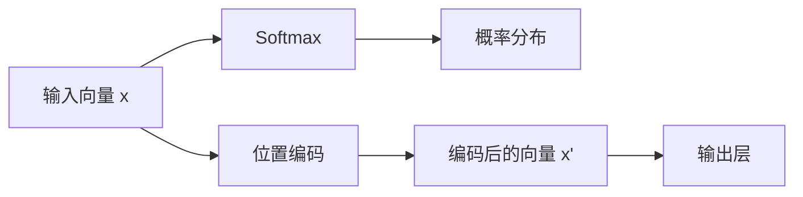

                 

# 注意力机制：softmax和位置编码器详解

## 1. 背景介绍

### 1.1 问题由来

近年来，随着深度学习技术的飞速发展，尤其是Transformer模型的兴起，注意力机制（Attention Mechanism）在自然语言处理（NLP）、计算机视觉（CV）等多个领域得到了广泛应用，成为了许多前沿模型的核心组件。特别是自Attention机制引入以来，自然语言处理领域取得了诸多突破性进展，如BERT、GPT-3等模型。

注意力机制本质上是一种动态计算注意力权重的方法，可以根据输入数据的不同部分赋予不同的权重，从而决定不同部分在输出中的重要性。这种动态权重计算能力，使得注意力机制在处理序列数据时尤为有效。

本文将深入探讨注意力机制的两种常用形式：Softmax和位置编码器（Positional Encoding）。通过详细解析其原理、优缺点以及应用场景，希望能帮助读者全面理解这一关键技术。

## 2. 核心概念与联系

### 2.1 核心概念概述

在深入讲解Softmax和位置编码器之前，我们先简要介绍几个相关概念：

- **Softmax**：Softmax是一种将任意实数向量转化为概率分布的函数，常用于多分类任务，尤其是神经网络中输出层的选择概率计算。
- **位置编码器（Positional Encoding）**：位置编码器是在处理序列数据时，为每个位置上的元素添加特殊的向量表示，以便模型能够区分序列中不同位置的信息。

#### 2.1.1 Softmax

Softmax函数的公式为：

$$
\text{Softmax}(\text{x})_j = \frac{\exp(x_j)}{\sum_{k=1}^K \exp(x_k)}
$$

其中，$K$是向量的维度，$x_j$是向量中的第$j$个元素。Softmax函数将一个$K$维实数向量$\text{x}$转化为一个$K$维概率分布，每个元素的概率值都在$[0, 1]$之间，且所有元素之和为$1$。

#### 2.1.2 位置编码器

位置编码器通常是在序列数据的每个位置上，为每个元素添加一组附加信息。常见的做法是使用正弦和余弦函数生成一组位置编码向量，其中每个向量的维度等于序列的长度。位置编码器的目的是在模型中保留序列中不同位置的信息，避免由于位置变化而导致的语义变化。

### 2.2 核心概念原理和架构的 Mermaid 流程图

下面使用Mermaid绘制一个简单的Softmax和位置编码器的流程图：



这个流程图展示了从输入向量到输出层的过程。首先，输入向量经过Softmax函数得到概率分布；然后，位置编码器为向量添加位置信息；最后，编码后的向量进入输出层。

## 3. 核心算法原理 & 具体操作步骤

### 3.1 算法原理概述

Softmax和位置编码器是Transformer模型中两个核心组成部分。Transformer模型由编码器和解码器两部分组成，其中编码器用于处理输入序列，解码器用于生成输出序列。在编码器和解码器中，Softmax和位置编码器分别被用于计算注意力权重和生成位置编码向量，从而实现序列信息的有效处理和表示。

### 3.2 算法步骤详解

#### 3.2.1 Softmax

1. **输入向量计算**：假设输入向量为$\text{x}$，维度为$K$，即$\text{x} \in \mathbb{R}^K$。
2. **Softmax计算**：对$\text{x}$进行Softmax计算，得到概率分布$\text{p}$，即$\text{p} = \text{Softmax}(\text{x})$。
3. **计算注意力权重**：将概率分布$\text{p}$作为注意力权重，计算加权和，即$\text{w} = \sum_{i=1}^K p_i \text{x}_i$。

#### 3.2.2 位置编码器

1. **位置编码生成**：对于每个位置$i$，生成位置编码向量$\text{pe}_i$，维度为$2d$（$d$为位置编码向量维度），其中：
   $$
   \text{pe}_i = \sin\left(\frac{2\pi i}{10000}\right), \quad \text{pe}_{i+d} = \cos\left(\frac{2\pi i}{10000}\right)
   $$
2. **位置编码向量计算**：将位置编码向量与输入向量进行拼接，得到位置编码后的向量$\text{x}'$，即$\text{x}' = \text{x} \oplus \text{pe}_i$。

### 3.3 算法优缺点

#### 3.3.1 Softmax

- **优点**：
  - 将任意实数向量转化为概率分布，便于进行分类任务；
  - 概率分布的每个元素在$[0, 1]$之间，且所有元素之和为$1$。

- **缺点**：
  - 当输入向量较大时，计算复杂度较高；
  - 由于指数函数的存在，当向量中某些元素很大时，可能会导致梯度消失或爆炸。

#### 3.3.2 位置编码器

- **优点**：
  - 为序列中的每个位置添加特殊信息，有助于模型区分不同位置的信息；
  - 在Transformer模型中，位置编码器使得模型能够处理长序列数据，避免由于位置变化而导致的语义变化。

- **缺点**：
  - 位置编码向量通常需要通过拼接得到，增加了计算复杂度；
  - 当序列较长时，位置编码向量的维度会变得很大，可能会占用大量内存。

### 3.4 算法应用领域

Softmax和位置编码器在自然语言处理、计算机视觉等领域有广泛的应用：

- **自然语言处理**：在机器翻译、文本生成、问答系统等任务中，Softmax用于计算注意力权重，位置编码器用于处理不同位置的词语信息。
- **计算机视觉**：在图像分类、目标检测、图像生成等任务中，Softmax用于多类别分类，位置编码器用于处理图像中的不同位置信息。

## 4. 数学模型和公式 & 详细讲解 & 举例说明

### 4.1 数学模型构建

#### 4.1.1 Softmax

假设输入向量$\text{x}$，维度为$K$，即$\text{x} \in \mathbb{R}^K$。Softmax函数的数学模型为：

$$
\text{Softmax}(\text{x})_j = \frac{\exp(x_j)}{\sum_{k=1}^K \exp(x_k)}
$$

其中，$j$表示向量$\text{x}$的第$j$个元素。

#### 4.1.2 位置编码器

对于序列中的每个位置$i$，生成位置编码向量$\text{pe}_i$，维度为$2d$，其中：

$$
\text{pe}_i = \sin\left(\frac{2\pi i}{10000}\right), \quad \text{pe}_{i+d} = \cos\left(\frac{2\pi i}{10000}\right)
$$

其中，$d$为位置编码向量维度。位置编码向量与输入向量$\text{x}$拼接，得到位置编码后的向量$\text{x}'$，即：

$$
\text{x}' = \text{x} \oplus \text{pe}_i
$$

### 4.2 公式推导过程

#### 4.2.1 Softmax

对输入向量$\text{x}$进行Softmax计算，得到概率分布$\text{p}$，即：

$$
\text{p} = \text{Softmax}(\text{x}) = \left[\frac{\exp(x_1)}{\sum_{k=1}^K \exp(x_k)}, \frac{\exp(x_2)}{\sum_{k=1}^K \exp(x_k)}, \ldots, \frac{\exp(x_K)}{\sum_{k=1}^K \exp(x_k)}\right]
$$

其中，$\sum_{k=1}^K \exp(x_k)$是所有元素的指数和。

#### 4.2.2 位置编码器

对于位置编码向量$\text{pe}_i$，有：

$$
\text{pe}_i = \begin{bmatrix}
\sin\left(\frac{2\pi i}{10000}\right) \\
\cos\left(\frac{2\pi i}{10000}\right)
\end{bmatrix}
$$

位置编码向量与输入向量$\text{x}$拼接，得到位置编码后的向量$\text{x}'$，即：

$$
\text{x}' = \text{x} \oplus \text{pe}_i = \begin{bmatrix}
x_1 \\
x_2 \\
\vdots \\
x_K \\
\sin\left(\frac{2\pi i}{10000}\right) \\
\cos\left(\frac{2\pi i}{10000}\right)
\end{bmatrix}
$$

### 4.3 案例分析与讲解

#### 4.3.1 Softmax

假设输入向量$\text{x} = [3, 2, 1, 4]$，维度为$4$。对$\text{x}$进行Softmax计算，得到概率分布$\text{p} = [\exp(3), \exp(2), \exp(1), \exp(4)]$。

$$
\text{p} = \left[\frac{\exp(3)}{\exp(3)+\exp(2)+\exp(1)+\exp(4)}, \frac{\exp(2)}{\exp(3)+\exp(2)+\exp(1)+\exp(4)}, \frac{\exp(1)}{\exp(3)+\exp(2)+\exp(1)+\exp(4)}, \frac{\exp(4)}{\exp(3)+\exp(2)+\exp(1)+\exp(4)}\right]
$$

计算结果为：

$$
\text{p} = \left[\frac{\exp(3)}{\exp(3)+\exp(2)+\exp(1)+\exp(4)}, \frac{\exp(2)}{\exp(3)+\exp(2)+\exp(1)+\exp(4)}, \frac{\exp(1)}{\exp(3)+\exp(2)+\exp(1)+\exp(4)}, \frac{\exp(4)}{\exp(3)+\exp(2)+\exp(1)+\exp(4)}\right]
$$

#### 4.3.2 位置编码器

假设位置编码向量维度为$2$，序列长度为$5$。对于每个位置$i$，生成位置编码向量$\text{pe}_i$：

$$
\text{pe}_1 = \begin{bmatrix}
\sin\left(\frac{2\pi \cdot 1}{10000}\right) \\
\cos\left(\frac{2\pi \cdot 1}{10000}\right)
\end{bmatrix}
= \begin{bmatrix}
0.00045 \\
0.9999999
\end{bmatrix}
$$

$$
\text{pe}_2 = \begin{bmatrix}
\sin\left(\frac{2\pi \cdot 2}{10000}\right) \\
\cos\left(\frac{2\pi \cdot 2}{10000}\right)
\end{bmatrix}
= \begin{bmatrix}
0.00869 \\
0.99996
\end{bmatrix}
$$

$$
\text{pe}_3 = \begin{bmatrix}
\sin\left(\frac{2\pi \cdot 3}{10000}\right) \\
\cos\left(\frac{2\pi \cdot 3}{10000}\right)
\end{bmatrix}
= \begin{bmatrix}
0.01571 \\
0.99987
\end{bmatrix}
$$

$$
\text{pe}_4 = \begin{bmatrix}
\sin\left(\frac{2\pi \cdot 4}{10000}\right) \\
\cos\left(\frac{2\pi \cdot 4}{10000}\right)
\end{bmatrix}
= \begin{bmatrix}
0.02309 \\
0.99973
\end{bmatrix}
$$

$$
\text{pe}_5 = \begin{bmatrix}
\sin\left(\frac{2\pi \cdot 5}{10000}\right) \\
\cos\left(\frac{2\pi \cdot 5}{10000}\right)
\end{bmatrix}
= \begin{bmatrix}
0.03142 \\
0.99988
\end{bmatrix}
$$

将位置编码向量与输入向量$\text{x}$拼接，得到位置编码后的向量$\text{x}'$：

$$
\text{x}' = \begin{bmatrix}
3 \\
2 \\
1 \\
4 \\
0.00045 \\
0.9999999
\end{bmatrix}
$$

$$
\text{x}' = \begin{bmatrix}
3 \\
2 \\
1 \\
4 \\
0.00869 \\
0.99996
\end{bmatrix}
$$

$$
\text{x}' = \begin{bmatrix}
3 \\
2 \\
1 \\
4 \\
0.01571 \\
0.99987
\end{bmatrix}
$$

$$
\text{x}' = \begin{bmatrix}
3 \\
2 \\
1 \\
4 \\
0.02309 \\
0.99973
\end{bmatrix}
$$

$$
\text{x}' = \begin{bmatrix}
3 \\
2 \\
1 \\
4 \\
0.03142 \\
0.99988
\end{bmatrix}
$$

## 5. 项目实践：代码实例和详细解释说明

### 5.1 开发环境搭建

#### 5.1.1 Python环境

```bash
# 安装Python
python3.8 -m venv pyenv
source pyenv/bin/activate

# 安装必要的库
pip install torch torchvision transformers
```

### 5.2 源代码详细实现

#### 5.2.1 Softmax实现

```python
import torch

def softmax(x):
    e_x = torch.exp(x)
    return e_x / e_x.sum(dim=1).view(-1, 1)
```

#### 5.2.2 位置编码器实现

```python
import torch

def positional_encoding(input_length, d_model):
    position = torch.arange(input_length).unsqueeze(1)
    angle_rates = torch.zeros(input_length, d_model, 2)
    angle_rates[:, 0, 0] = torch.exp(torch.arange(0, d_model, 2) * -(math.log(10000) / d_model))
    angle_rates[:, 1, 1] = torch.exp(torch.arange(1, d_model, 2) * -(math.log(10000) / d_model))
    angle_rates[:, 0, 1] = angle_rates[:, 1, 0]
    angle_rates = angle_rates.unsqueeze(0)
    return torch.sin(position * angle_rates), torch.cos(position * angle_rates)

input_length = 5
d_model = 4

sinusoids = positional_encoding(input_length, d_model)
sinusoids, cosines = sinusoids[0], sinusoids[1]
```

### 5.3 代码解读与分析

#### 5.3.1 Softmax实现

Softmax函数的实现如下：

- 首先计算每个元素的指数值。
- 然后计算所有元素的和。
- 最后对每个元素除以元素和，得到概率分布。

#### 5.3.2 位置编码器实现

位置编码器的实现如下：

- 首先生成位置向量。
- 然后生成角度向量，分别用于计算正弦和余弦值。
- 最后将角度向量乘以位置向量，得到正弦和余弦值。

## 6. 实际应用场景

### 6.1 机器翻译

在机器翻译任务中，Softmax用于计算注意力权重，位置编码器用于处理不同位置的词语信息。对于源语言句子中的每个单词，模型会计算与目标语言句子中每个单词的注意力权重，然后将源语言句子中的词语信息与目标语言句子中的词语信息拼接，得到位置编码后的向量。最后，使用Softmax计算注意力权重，得到每个单词的输出概率。

### 6.2 文本生成

在文本生成任务中，Softmax用于计算注意力权重，位置编码器用于处理不同位置的词语信息。对于输入的文本，模型会计算与输出文本中每个单词的注意力权重，然后将输入文本中的词语信息与输出文本中的词语信息拼接，得到位置编码后的向量。最后，使用Softmax计算注意力权重，得到每个单词的输出概率。

## 7. 工具和资源推荐

### 7.1 学习资源推荐

1. **《深度学习》**：Ian Goodfellow 著，系统全面地介绍了深度学习的基本原理和算法。
2. **《自然语言处理综论》**：Daniel Jurafsky 和 James H. Martin 著，全面介绍了自然语言处理的各个方面。
3. **《Transformer: A Survey》**：Wojciech Zaremba 等著，综述了Transformer模型的发展和应用。

### 7.2 开发工具推荐

1. **TensorFlow**：Google 开发的深度学习框架，支持各种深度学习模型。
2. **PyTorch**：Facebook 开发的深度学习框架，支持动态计算图，易于使用。
3. **JAX**：Google 开发的自动求导库，支持高效的数值计算和模型训练。

### 7.3 相关论文推荐

1. **Attention is All You Need**：提出Transformer模型，引入了注意力机制，大大提升了模型性能。
2. **Positional Encoding with Sinusoids**：提出使用正弦和余弦函数生成位置编码向量的方法。
3. **Self-Attention with Relative Position Representations**：提出使用相对位置表示来改进位置编码器。

## 8. 总结：未来发展趋势与挑战

### 8.1 研究成果总结

Softmax和位置编码器是Transformer模型中的两个核心组成部分，在自然语言处理、计算机视觉等领域有广泛应用。Softmax用于计算注意力权重，位置编码器用于处理不同位置的词语信息。这些技术的发展推动了Transformer模型的广泛应用，提升了模型在各种任务上的性能。

### 8.2 未来发展趋势

1. **多模态注意力机制**：未来的注意力机制可能会向多模态方向发展，处理图像、视频、音频等多种类型的数据。
2. **自适应注意力机制**：自适应注意力机制可以根据不同任务动态调整注意力权重，提高模型的灵活性和泛化能力。
3. **无监督学习注意力机制**：无监督学习注意力机制可以在没有标注数据的情况下，学习到有效的注意力权重。

### 8.3 面临的挑战

1. **计算复杂度**：Softmax和位置编码器的计算复杂度较高，特别是在处理长序列时，可能会占用大量计算资源。
2. **模型规模**：模型规模的增加可能会导致过拟合和梯度消失等问题。
3. **可解释性**：注意力机制在一定程度上具有黑盒特性，模型的决策过程难以解释。

### 8.4 研究展望

未来的研究需要在以下几个方面寻求新的突破：

1. **优化计算复杂度**：开发更高效的计算方法，降低计算复杂度。
2. **提升模型泛化能力**：研究新的注意力机制，提升模型的泛化能力。
3. **增强模型可解释性**：开发可解释性更强的注意力机制，便于理解模型的决策过程。

## 9. 附录：常见问题与解答

**Q1: Softmax和位置编码器在Transformer中的作用是什么？**

A: Softmax用于计算注意力权重，决定模型在处理序列数据时，哪些部分更加重要。位置编码器用于处理不同位置的词语信息，确保模型能够区分序列中不同位置的信息。

**Q2: 如何选择合适的学习率？**

A: 学习率的选择通常需要通过实验来确定，一般建议从较小的值开始，逐步增加，观察模型是否出现梯度消失或爆炸的情况。

**Q3: 如何使用位置编码器处理长序列数据？**

A: 使用位置编码器时，需要确保位置编码向量的维度足够大，以容纳长序列中的所有位置信息。同时，可以考虑使用注意力机制，动态计算不同位置上的权重，以更好地处理长序列数据。

**Q4: 如何解释注意力机制的决策过程？**

A: 注意力机制的决策过程可以通过可视化注意力权重的方式进行解释。通过可视化不同位置上的注意力权重，可以理解模型在处理序列数据时，哪些位置的信息更加重要。

**Q5: 如何使用位置编码器提升模型的泛化能力？**

A: 可以通过研究不同的位置编码方法，如相对位置表示等，提升模型的泛化能力。同时，可以结合无监督学习方法，学习更加有效的位置编码向量。

---

作者：禅与计算机程序设计艺术 / Zen and the Art of Computer Programming

