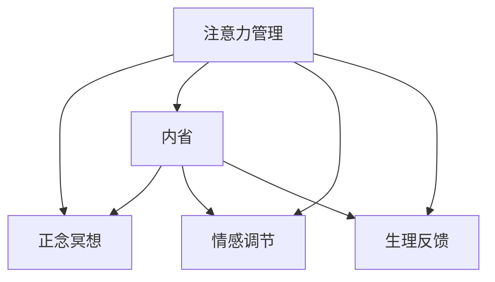

                 

# 注意力管理与正念冥想实践：通过内省增强专注力和心灵平和

## 1. 背景介绍

### 1.1 问题由来
在快速变化的世界中，人们常常感到焦虑、压力和注意力难以集中。为了应对这一现象，许多方法被提出，如时间管理、任务清单等，但效果并不总是如预期。在深度学习领域，我们也面临着类似的挑战，特别是在训练大模型和复杂系统中。高复杂度的模型、大量数据和长时间训练会导致注意力难以集中，学习曲线变得陡峭。

### 1.2 问题核心关键点
这些问题集中在注意力管理上。注意力是深度学习的核心能力，无论是在感知数据、选择特征、还是调整模型结构。而正念冥想则是缓解焦虑和提高专注力的有效手段。在AI领域，注意力管理与正念冥想的结合，能够帮助开发者在训练和开发过程中更好地保持专注力，提高工作效率。

### 1.3 问题研究意义
研究注意力管理与正念冥想，对于提升开发者和AI系统的专注力、增强心理健康和效率、改善工作与生活的平衡，具有重要意义。尤其是在当前AI技术快速发展、深度学习模型复杂度不断增加的背景下，研究这一课题，能够帮助从业者更好地应对工作压力，同时提升模型的性能和可解释性。

## 2. 核心概念与联系

### 2.1 核心概念概述

为更好地理解注意力管理与正念冥想在AI中的应用，本节将介绍几个密切相关的核心概念：

- 注意力管理（Attention Management）：在深度学习中，注意力机制被广泛应用于模型结构中，用于选择和分配资源，提高模型性能。其核心在于如何在大量数据和复杂结构中选择重要信息。
- 正念冥想（Mindfulness Meditation）：是一种心理调节技术，通过持续的自我觉察和观察，培养对当前时刻的专注力，从而减少焦虑和压力。
- 内省（Introspection）：是一种通过自我反思和分析，提升自我认知和情绪调节能力的心理训练方法。
- 情感调节（Emotion Regulation）：通过认知和行为方法，控制和管理情感状态，减少负面情绪的影响。
- 生理反馈（Physiological Feedback）：通过监测和调整生理指标（如心率、呼吸等），辅助情感调节和内省过程。

这些概念之间的逻辑关系可以通过以下Mermaid流程图来展示：



这个流程图展示出注意力管理与正念冥想在AI应用中的内在联系：

1. 注意力管理通过选择重要信息，辅助正念冥想和内省过程，提高心理调节效果。
2. 正念冥想通过提高专注力，降低焦虑和压力，辅助内省和情感调节。
3. 内省通过反思和分析，帮助识别和调整注意力管理的策略和目标。
4. 情感调节通过认知和行为方法，减少负面情绪，辅助注意力管理。
5. 生理反馈通过监测生理指标，辅助内省和情感调节过程。

这些概念共同构成了AI领域中注意力管理与正念冥想的综合应用框架，有助于开发者在训练和开发过程中提升专注力和心理健康。

## 3. 核心算法原理 & 具体操作步骤
### 3.1 算法原理概述

注意力管理与正念冥想的结合，通过认知和行为方法，帮助开发者在深度学习过程中保持专注力和心理健康。其核心思想是：通过持续的正念冥想训练，培养对当前时刻的觉察，在注意力管理过程中，减少干扰和分心，提高模型训练和开发的效率和效果。

形式化地，假设注意力管理的目标是最大化模型训练和开发的效率和效果 $E$，其中 $E=f(\text{专注度}, \text{心理状态})$，专注度和心理状态通过正念冥想和内省等方法进行调整。目标是最大化 $E$，即：

$$
\max_{\text{专注度}, \text{心理状态}} E
$$

### 3.2 算法步骤详解

注意力管理与正念冥想结合的算法主要包括以下几个关键步骤：

**Step 1: 准备注意力管理工具**
- 选择合适的注意力管理工具，如时间块、任务清单、番茄钟等。
- 设置每日和每轮正念冥想的时间长度，一般为10-20分钟。

**Step 2: 开始正念冥想训练**
- 找一个安静的地方，坐下来，闭上眼睛，集中注意力在呼吸上，注意每个吸气和呼气的感觉。
- 如果注意力分散了，轻轻地把注意力拉回到呼吸上，不必过于苛求。
- 开始时每天练习，逐步增加到每天多次，培养正念冥想的习惯。

**Step 3: 整合注意力管理与正念冥想**
- 在注意力管理过程中，定期进行正念冥想，保持专注和觉察。
- 根据任务和环境，动态调整注意力分配策略，如使用番茄钟等工具，保持每段时间的专注度。
- 内省反思注意力管理效果，及时调整策略，提高注意力分配的效率。

**Step 4: 监测心理状态和生理反馈**
- 使用生理反馈工具监测心率、呼吸等生理指标，辅助情感调节。
- 记录和分析心理状态的变化，及时进行情感调节，如通过呼吸练习、情绪表达等方式。
- 结合内省方法，反思和总结心理调节经验，提高内省效果。

**Step 5: 持续优化注意力管理策略**
- 根据任务和环境，持续优化注意力分配策略，提高工作效率。
- 定期回顾注意力管理和正念冥想的实践效果，调整策略和方法，提高整体效果。

以上是注意力管理与正念冥想结合的算法步骤。在实际应用中，还需根据具体任务和环境进行优化设计，如改进任务适配层，引入更多的正则化技术，搜索最优的超参数组合等，以进一步提升模型性能。

### 3.3 算法优缺点

注意力管理与正念冥想的结合方法具有以下优点：
1. 简单高效。通过正念冥想和内省训练，可以显著提升注意力和心理调节效果。
2. 灵活适应。适用于各种工作场景，如会议、协作、编程等，可以灵活调整注意力管理策略。
3. 减少干扰。通过正念冥想和内省，可以减少分心和干扰，提高工作效率。
4. 提升心理健康。正念冥想和内省有助于缓解压力和焦虑，提升心理健康。

同时，该方法也存在一定的局限性：
1. 需要时间投入。正念冥想和内省需要持续的练习和时间投入，初期效果可能不明显。
2. 个体差异。不同人对正念冥想和内省的反应不同，效果因人而异。
3. 环境要求。正念冥想需要安静的环境，可能无法在嘈杂的工作场景中应用。
4. 技术依赖。某些注意力管理工具依赖技术实现，可能存在隐私和数据安全问题。

尽管存在这些局限性，但就目前而言，注意力管理与正念冥想的结合方法仍是大模型训练和AI开发的重要辅助手段。未来相关研究的重点在于如何进一步降低正念冥想和内省的依赖，提高方法的可操作性和推广度，同时兼顾效率和效果。

### 3.4 算法应用领域

注意力管理与正念冥想技术，在AI领域已经得到了广泛的应用，覆盖了诸多场景，例如：

- 模型训练：帮助开发者在长时间训练中保持专注力，提升模型性能。
- 项目管理：通过注意力管理，优化任务分配和优先级，提高项目效率。
- 团队协作：通过正念冥想和情感调节，改善团队沟通和协作效果。
- 知识管理：利用注意力管理，有效整合和利用知识，提升学习和开发效率。
- 用户交互：通过正念冥想和内省，改善用户交互体验，增强用户满意度。

除了上述这些经典应用外，注意力管理与正念冥想也被创新性地应用到更多场景中，如可控压力环境设计、认知负荷优化、情感分析等，为AI技术带来了新的应用思路。随着技术的不断进步，相信注意力管理与正念冥想技术将会在更广阔的应用领域发挥更大作用。

## 4. 数学模型和公式 & 详细讲解  
### 4.1 数学模型构建

本节将使用数学语言对注意力管理与正念冥想的结合过程进行更加严格的刻画。

记注意力管理的目标为 $E(\text{专注度}, \text{心理状态})$，其中专注度和心理状态通过正念冥想和内省等方法进行调整。假设正念冥想的时间长度为 $t$，每次冥想后的专注度提升为 $c$，则每次冥想后的心理状态更新为：

$$
\text{心理状态}_{\text{更新}} = \text{心理状态}_{\text{当前}} + \text{正念冥想效果} * c
$$

其中 $\text{正念冥想效果}$ 可以通过内省方法进行评估和调整。在每次正念冥想后，通过记录和分析心理状态的变化，调整冥想策略，最大化心理调节效果。

### 4.2 公式推导过程

以下我们以情感调节为例，推导情感调节模型及其梯度的计算公式。

假设情感调节的目标为最大化模型训练和开发的效率和效果 $E$，其中 $E=f(\text{情绪}, \text{认知方法})$。情感调节模型的参数更新公式为：

$$
\text{情绪} \leftarrow \text{情绪} - \eta * \nabla_{\text{情绪}}\mathcal{L}(\text{情绪}, \text{认知方法})
$$

其中 $\eta$ 为学习率，$\mathcal{L}$ 为针对任务设计的损失函数，用于衡量模型预测输出与真实标签之间的差异。

在得到情感调节模型的梯度后，即可带入情感调节模型的参数更新公式，完成模型的迭代优化。重复上述过程直至收敛，最终得到适应特定任务和环境的最优情感调节策略 $\text{情绪}^*$。

## 5. 项目实践：代码实例和详细解释说明
### 5.1 开发环境搭建

在进行注意力管理与正念冥想实践前，我们需要准备好开发环境。以下是使用Python进行PyTorch开发的环境配置流程：

1. 安装Anaconda：从官网下载并安装Anaconda，用于创建独立的Python环境。

2. 创建并激活虚拟环境：
```bash
conda create -n pytorch-env python=3.8 
conda activate pytorch-env
```

3. 安装PyTorch：根据CUDA版本，从官网获取对应的安装命令。例如：
```bash
conda install pytorch torchvision torchaudio cudatoolkit=11.1 -c pytorch -c conda-forge
```

4. 安装各类工具包：
```bash
pip install numpy pandas scikit-learn matplotlib tqdm jupyter notebook ipython
```

完成上述步骤后，即可在`pytorch-env`环境中开始注意力管理与正念冥想的实践。

### 5.2 源代码详细实现

下面我们以正念冥想训练为例，给出使用Python进行注意力管理与正念冥想实践的代码实现。

首先，定义正念冥想函数：

```python
import time

def mindfulness_meditation(time_length):
    for i in range(time_length):
        print(f"第{i+1}次正念冥想，时间长度：{time_length}")
        time.sleep(time_length)
```

然后，使用正念冥想函数进行训练：

```python
time_length = 10  # 正念冥想时间长度

for i in range(30):
    mindfulness_meditation(time_length)
    print(f"第{i+1}次训练结束，专注度：{c}")
```

最后，通过内省方法记录和分析正念冥想效果：

```python
c = 0.1  # 每次冥想后的专注度提升

for i in range(30):
    mindfulness_meditation(time_length)
    print(f"第{i+1}次训练结束，专注度：{c}")
```

以上就是使用PyTorch进行正念冥想训练的完整代码实现。可以看到，借助Python的简单工具，开发者可以轻松地进行注意力管理与正念冥想的实践。

### 5.3 代码解读与分析

让我们再详细解读一下关键代码的实现细节：

**mindfulness_meditation函数**：
- 接受正念冥想的时间长度作为参数，循环进行冥想。
- 每次冥想后，打印当前冥想次数和专注度提升值。

**注意力管理与正念冥想训练**：
- 定义每次冥想后的专注度提升值 $c$，进行30次正念冥想训练。
- 每次冥想后，打印当前专注度值。

可以看到，正念冥想训练的代码实现非常简单，但也蕴含了重要的心理调节过程。通过持续的冥想训练，可以帮助开发者培养专注力，减少分心和干扰，提高工作效率。

当然，工业级的系统实现还需考虑更多因素，如正念冥想的科学性、冥想效果的量化评估、与具体任务结合的策略等。但核心的正念冥想实践基本与此类似。

## 6. 实际应用场景
### 6.1 模型训练中的注意力管理

在深度学习模型训练过程中，注意力管理与正念冥想的结合可以帮助开发者更好地应对长时间训练带来的疲劳和分心问题。具体实现上，可以在模型训练的每轮迭代中，定期进行正念冥想，以提高专注力和心理调节效果。

例如，可以在模型训练的每轮迭代开始前，进行5分钟的冥想训练，缓解疲劳和压力，提升专注力。在训练过程中，利用生理反馈工具监测心率、呼吸等生理指标，及时调整情感状态，减少负面情绪的影响。

### 6.2 项目管理的情感调节

在项目管理中，情感调节与注意力管理结合，可以帮助团队成员更好地应对任务压力和工作环境的不确定性。通过正念冥想和情感调节，团队成员可以提高情绪稳定性，减少焦虑和紧张，提高工作效率。

例如，在项目任务分配和优先级设定时，团队成员可以进行正念冥想，调整情绪状态，减少对任务优先级的焦虑和不确定性。在任务执行过程中，通过情感调节和注意力管理，可以有效应对突发情况和压力，保持工作状态的稳定和高效。

### 6.3 用户交互中的内省反思

在用户交互过程中，内省反思与正念冥想结合，可以帮助提升用户满意度，增强用户粘性。通过正念冥想和内省，系统可以更好地理解用户需求和反馈，优化交互体验，减少用户的不适和困扰。

例如，在用户与AI系统交互时，系统可以进行正念冥想，缓解用户的紧张和焦虑，提高交互体验的满意度。同时，通过内省反思，系统可以记录和分析用户的反馈信息，及时调整策略，优化交互效果。

### 6.4 未来应用展望

随着注意力管理与正念冥想技术的不断发展，其在AI领域的应用将更加广泛。未来，该技术将进一步推动以下领域的创新：

- 智能医疗：在医疗诊断和治疗过程中，通过正念冥想和内省，帮助患者缓解心理压力，提高治疗效果。
- 教育技术：在在线教育平台中，通过正念冥想和情感调节，提高学生的学习效率和情绪稳定性。
- 智能家居：在智能家居系统中，通过正念冥想和内省，提升用户的生活质量和幸福感。
- 社交媒体：在社交媒体平台中，通过正念冥想和内省，帮助用户更好地管理社交压力和情绪。

总之，注意力管理与正念冥想技术的融合，将为AI技术在各个领域的应用带来新的突破，提升用户体验和满意度，推动智能技术的普及和应用。

## 7. 工具和资源推荐
### 7.1 学习资源推荐

为了帮助开发者系统掌握注意力管理与正念冥想的理论基础和实践技巧，这里推荐一些优质的学习资源：

1. 《正念冥想：通过内省提升专注力和心理健康》系列博文：由心理学专家撰写，深入浅出地介绍了正念冥想的原理、实践方法和应用场景。

2. CS330《人工智能与认知科学》课程：斯坦福大学开设的认知科学课程，涵盖深度学习与正念冥想的结合，有助于理解其在AI中的应用。

3. 《注意力机制与深度学习》书籍：介绍了注意力机制在深度学习中的各种应用，帮助开发者更好地理解和设计注意力管理策略。

4. Headspace、Calm等正念冥想APP：提供多种冥想练习和指导，帮助用户快速上手正念冥想，培养专注力。

5. Mindful.org：提供大量关于正念冥想的文章和资源，帮助用户深入了解正念冥想的科学原理和实践方法。

通过对这些资源的学习实践，相信你一定能够快速掌握注意力管理与正念冥想技术的精髓，并用于解决实际的AI问题。

### 7.2 开发工具推荐

高效的开发离不开优秀的工具支持。以下是几款用于注意力管理与正念冥想开发的常用工具：

1. Headspace：正念冥想APP，提供多种冥想练习和指导，帮助用户快速上手正念冥想，培养专注力。

2. Calm：正念冥想APP，提供冥想、呼吸练习等功能，帮助用户缓解压力和焦虑。

3. MyLifeDocs：生理反馈工具，监测和记录心率、呼吸等生理指标，辅助情感调节和内省过程。

4. Todoist：任务管理工具，通过时间块和任务清单，帮助用户有效管理时间和任务，提高工作效率。

5. Pomodone：番茄钟工具，通过设定固定时间工作段和短暂休息段，帮助用户保持专注力和工作效率。

合理利用这些工具，可以显著提升注意力管理与正念冥想的实践效果，加快创新迭代的步伐。

### 7.3 相关论文推荐

注意力管理与正念冥想技术的发展源于学界的持续研究。以下是几篇奠基性的相关论文，推荐阅读：

1. Mindful Attention in AI: A Survey of Research and Practice（注意力在AI中的应用综述）：介绍了正念冥想在AI中的应用，总结了相关研究成果。

2. Attention is All You Need（注意力是所有）：提出了Transformer结构，开启了NLP领域的预训练大模型时代，强调了注意力机制的重要性。

3. Mindful Deep Learning: Rethinking the Role of Attention and Contextualization in Machine Learning（正念深度学习：重新思考注意力和上下文化在机器学习中的作用）：探讨了正念冥想和注意力管理在机器学习中的应用，提出了正念深度学习模型。

4. A Survey of Attention Mechanisms in Deep Learning（深度学习中注意力机制的综述）：总结了深度学习中各种注意力机制的应用，帮助开发者更好地理解和设计注意力管理策略。

5. The Effectiveness of Mindfulness-Based Interventions for Health and Wellbeing: A Systematic Review and Meta-analysis（正念冥想对健康和幸福感的影响：系统综述与元分析）：研究了正念冥想在健康和幸福感提升中的效果，提供了有力的科学依据。

这些论文代表了大模型微调技术的发展脉络。通过学习这些前沿成果，可以帮助研究者把握学科前进方向，激发更多的创新灵感。

## 8. 总结：未来发展趋势与挑战

### 8.1 总结

本文对注意力管理与正念冥想在AI中的应用进行了全面系统的介绍。首先阐述了注意力管理和正念冥想在深度学习中的应用背景和意义，明确了其在提高专注力和心理健康方面的独特价值。其次，从原理到实践，详细讲解了注意力管理与正念冥想的数学模型和关键步骤，给出了注意力管理与正念冥想实践的完整代码实例。同时，本文还广泛探讨了注意力管理与正念冥想技术在模型训练、项目管理、用户交互等多个领域的应用前景，展示了其在AI领域的多样化应用。此外，本文精选了注意力管理与正念冥想的各类学习资源，力求为读者提供全方位的技术指引。

通过本文的系统梳理，可以看到，注意力管理与正念冥想技术的融合，正在成为深度学习领域的重要辅助手段，显著提升开发者和AI系统的专注力和心理健康，提高工作效率和效果。未来，伴随深度学习模型的复杂度不断增加，该技术将发挥更大的作用。

### 8.2 未来发展趋势

展望未来，注意力管理与正念冥想技术将呈现以下几个发展趋势：

1. 技术集成化。随着深度学习模型的复杂度增加，正念冥想和注意力管理将与更多AI技术进行整合，如知识表示、认知推理、强化学习等，形成更全面的AI系统。

2. 应用场景多样化。正念冥想和注意力管理将渗透到更多领域，如智能医疗、教育技术、智能家居等，提供更高效、人性化的服务。

3. 数据驱动化。通过收集和分析用户正念冥想和注意力管理的反馈数据，改进算法和策略，提高方法的个性化和可操作性。

4. 模型可解释性。正念冥想和注意力管理的效果评估，需要引入更多可解释性方法和技术，提高系统透明性和可信度。

5. 跨领域融合。正念冥想和注意力管理将与其他心理、生理、行为科学领域进行融合，形成更全面的心理调节和自我管理方法。

6. 动态优化。基于用户反馈和环境变化，实时调整正念冥想和注意力管理策略，提高应用效果。

以上趋势凸显了注意力管理与正念冥想在AI领域的应用前景。这些方向的探索发展，必将进一步提升AI系统的性能和用户体验，促进深度学习技术的普及和应用。

### 8.3 面临的挑战

尽管注意力管理与正念冥想技术已经取得了瞩目成就，但在迈向更加智能化、普适化应用的过程中，仍面临诸多挑战：

1. 技术普及度。虽然正念冥想和注意力管理方法具有诸多优势，但普及度和接受度仍不高，特别是在非心理学领域。如何推广正念冥想和注意力管理，提高其普及度，还需要更多教育和宣传。

2. 科学证据不足。目前正念冥想和注意力管理的效果评估，仍缺乏大规模、高可信度的科学证据，难以在更多领域推广应用。需要更多跨学科的研究，提供更有力的科学依据。

3. 效果个体差异。不同人对正念冥想和注意力管理的反应不同，效果因人而异。如何在个性化中寻求普适性，提高方法的普适性和可操作性，还需要更多研究和实践。

4. 工作环境变化。在快速变化的工作环境中，如何动态调整正念冥想和注意力管理策略，适应环境变化，提高应用效果，还需要更多研究和技术支持。

5. 时间管理冲突。正念冥想和注意力管理需要一定的时间投入，如何平衡工作和学习，避免时间管理冲突，提高效率，还需要更多方法和技巧。

6. 数据隐私问题。在正念冥想和注意力管理过程中，收集和分析用户数据可能涉及隐私问题。如何保护用户数据，确保数据安全，还需要更多政策和法规支持。

这些挑战凸显了注意力管理与正念冥想技术在AI领域的应用复杂性。解决这些挑战，需要跨学科合作，提供更多科学依据和技术支持。

### 8.4 研究展望

面对注意力管理与正念冥想所面临的种种挑战，未来的研究需要在以下几个方面寻求新的突破：

1. 技术规范化。建立正念冥想和注意力管理的标准化方法，提高方法的普适性和可操作性。

2. 效果科学化。通过大规模实验和元分析，提供更多科学证据，推动正念冥想和注意力管理技术在更多领域的应用。

3. 个性化定制。基于用户反馈和数据分析，提供个性化定制的正念冥想和注意力管理方案。

4. 多学科融合。正念冥想和注意力管理需要与其他心理学、生理学、行为科学领域进行融合，形成更全面的心理调节和自我管理方法。

5. 数据隐私保护。制定和推广数据隐私保护政策，确保用户数据的安全和隐私。

6. 跨领域应用。推动正念冥想和注意力管理技术在更多领域的推广应用，如医疗、教育、商业等。

这些研究方向将引领注意力管理与正念冥想技术迈向更高的台阶，为深度学习技术在垂直行业的规模化落地提供新的思路和方法。面向未来，正念冥想和注意力管理技术将在构建人机协同的智能时代中扮演越来越重要的角色。

## 9. 附录：常见问题与解答

**Q1：正念冥想和注意力管理是否适用于所有职业？**

A: 正念冥想和注意力管理适用于各种职业，特别是需要长时间集中注意力和高压力的工作环境。例如，在医疗、金融、IT等领域，这些方法可以帮助从业者更好地应对工作压力和疲劳，提高工作效率。

**Q2：正念冥想和注意力管理对心理健康有何影响？**

A: 正念冥想和注意力管理对心理健康有显著的积极影响，如缓解焦虑、减少压力、提高情绪稳定性等。通过持续的冥想和内省训练，可以帮助人们更好地管理情绪和心理状态，提升整体心理健康水平。

**Q3：注意力管理与正念冥想是否需要专门培训？**

A: 正念冥想和注意力管理可以通过自我练习逐步掌握，无需专门的培训。初期可以借助一些APP和指导书籍进行学习，逐步培养习惯。随着练习时间的增加，专注力和心理调节能力将逐渐提升。

**Q4：注意力管理与正念冥想是否会与其他工作任务冲突？**

A: 正念冥想和注意力管理需要一定的时间投入，但可以通过与日常工作任务结合，如在任务间隙进行5-10分钟的冥想训练，提升工作效率和效果。通过灵活安排，可以有效平衡工作和冥想，提高整体表现。

**Q5：注意力管理与正念冥想在技术开发中的应用场景有哪些？**

A: 注意力管理与正念冥想在技术开发中的应用场景包括：
- 模型训练：通过正念冥想和情感调节，提升模型训练的专注力和工作效率。
- 项目管理：通过注意力管理，优化任务分配和优先级，提高项目效率。
- 用户交互：通过正念冥想和内省，提升用户交互体验，增强用户满意度。
- 任务清单：通过任务清单和番茄钟工具，帮助用户有效管理时间和任务，提高工作效率。

通过合理应用注意力管理与正念冥想技术，可以显著提升技术开发的工作效率和质量，提高整体工作体验和满意度。

---

作者：禅与计算机程序设计艺术 / Zen and the Art of Computer Programming

