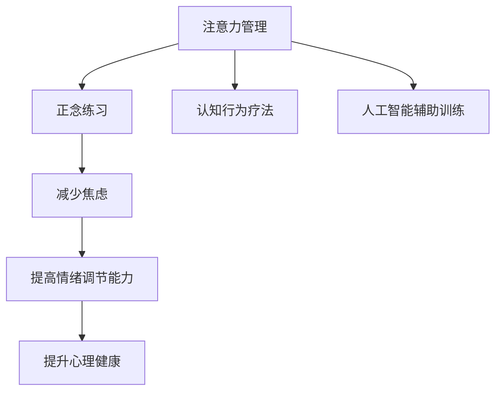

                 

# 注意力管理与正念练习：通过当下增强专注力和心灵清晰度

> 关键词：注意力管理,正念练习,专注力提升,心灵清晰度,认知行为疗法,心理健康,人工智能辅助

## 1. 背景介绍

在现代快节奏的生活中，注意力管理和心理健康成为了许多人关注的重点。工作、学习和生活中的压力不断增加，如何保持专注力和心理的清晰，成为了许多人面临的挑战。注意力管理不仅关系到个人的工作效率，也与心理健康息息相关。因此，如何通过科学的方法提升注意力和心灵的清晰度，成为了当前研究的热点。

### 1.1 问题由来
随着科技的快速发展，信息过载和注意力分散现象日益严重。人们在面对海量信息时，往往容易陷入分心和焦虑的状态。此外，许多人在长时间的工作和学习后，容易出现注意力不足、焦虑和抑郁等心理问题。注意力管理正是在这种背景下诞生的。

### 1.2 问题核心关键点
注意力管理旨在帮助个体提升专注力和心理清晰度，缓解注意力分散和心理压力。其核心在于通过科学的训练和干预方法，培养个体对注意力的掌控能力，提高心理韧性。近年来，正念练习和人工智能辅助训练成为了提升注意力管理效果的重要手段。

### 1.3 问题研究意义
通过改善注意力管理，可以提升个体的工作效率和心理素质，减少压力和焦虑，增强心理韧性。此外，注意力管理还能改善人际关系，提升生活质量，帮助个体更好地应对生活中的各种挑战。

## 2. 核心概念与联系

### 2.1 核心概念概述

注意力管理与正念练习紧密相关。以下是几个关键概念：

- 注意力管理(Attention Management)：指通过科学的方法提升个体对注意力的掌控能力，避免注意力分散，提高工作效率和心理健康。
- 正念练习(Mindfulness Practice)：指通过持续的观察和感知，培养个体对当下时刻的意识和接受，减少对过去和未来的焦虑。
- 认知行为疗法(Cognitive Behavioral Therapy, CBT)：通过改变负面的思维模式和行为习惯，提升个体的情绪调节能力和心理韧性。
- 人工智能辅助训练(AI-Assisted Training)：利用人工智能技术，如机器学习和自然语言处理，提供个性化的注意力管理训练方案和正念练习指导。
- 心理健康(Mental Health)：关注个体在心理、情绪和社会行为方面的健康状况，通过多种干预方法促进心理健康。

这些概念之间的联系可以通过以下Mermaid流程图来展示：



这个流程图展示了大语言模型的核心概念及其之间的联系：

1. 注意力管理通过正念练习提升对当下的关注，减少焦虑。
2. 注意力管理结合认知行为疗法，改变负面的思维模式。
3. 人工智能辅助训练提供个性化的训练方案。
4. 这些方法共同促进心理健康，提升个体的心理韧性和工作效率。

## 3. 核心算法原理 & 具体操作步骤
### 3.1 算法原理概述

注意力管理和正念练习的核心在于通过科学的方法提升个体对当下的关注和感知，减少对过去和未来的过度担忧，从而增强心理韧性和工作效率。其核心算法原理主要包括：

1. **注意力训练**：通过持续的注意力集中训练，增强个体对当前任务的专注力。
2. **正念冥想**：通过正念冥想练习，培养个体对当下的意识和接受，减少对过去和未来的焦虑。
3. **认知行为干预**：通过改变负面的思维模式和行为习惯，提升个体的情绪调节能力和心理韧性。

### 3.2 算法步骤详解

以下是注意力管理和正念练习的具体操作步骤：

**Step 1: 评估当前状态**
- 进行注意力和心理状态的初步评估，了解个体当前存在的问题和挑战。

**Step 2: 设计训练计划**
- 根据个体当前状态，设计个性化的注意力管理训练计划和正念练习方案。
- 训练计划应包括短期和长期目标，逐步提升个体的注意力和心理素质。

**Step 3: 实施训练和练习**
- 按照训练计划进行注意力集中训练和正念冥想练习，逐步提升个体对当下的关注和感知。
- 结合认知行为疗法，通过改变负面的思维模式和行为习惯，提升情绪调节能力和心理韧性。

**Step 4: 定期评估和调整**
- 定期评估个体的注意力和心理状态，根据评估结果调整训练计划和干预方法。
- 持续优化训练方案，确保个体的注意力和心理状态得到持续提升。

### 3.3 算法优缺点

注意力管理和正念练习具有以下优点：
1. 提升个体对当下的关注，减少焦虑。
2. 通过认知行为疗法，改变负面的思维模式，提升情绪调节能力。
3. 通过人工智能辅助训练，提供个性化的训练方案和正念练习指导。
4. 提高个体的心理韧性和工作效率，增强应对生活挑战的能力。

同时，这些方法也存在一定的局限性：
1. 训练过程需要时间和耐心，个体可能需要较长时间才能看到显著效果。
2. 个体的接受度和配合度对训练效果有很大影响，部分个体可能难以坚持训练。
3. 训练效果受到个体自身心理状态和环境因素的影响，需要持续的评估和调整。

尽管存在这些局限性，但通过科学的训练方法和合理的评估机制，注意力管理和正念练习能够有效提升个体的注意力和心理清晰度。

### 3.4 算法应用领域

注意力管理和正念练习已经在多个领域得到了应用，例如：

- 心理健康干预：在心理健康咨询和治疗中，通过注意力管理提升个体的情绪调节能力和心理韧性。
- 职场效率提升：通过注意力管理提升员工的工作效率和专注力，减少工作压力。
- 学生学习支持：通过正念练习和注意力管理，帮助学生提高学习效率和心理素质。
- 老年认知训练：通过认知行为疗法和正念练习，延缓老年人的认知衰退，提高生活质量。

除了这些常见应用领域外，注意力管理和正念练习也被创新性地应用于教育、军事、体育等多个行业，为不同群体提供心理健康支持。

## 4. 数学模型和公式 & 详细讲解  
### 4.1 数学模型构建

注意力管理和正念练习的数学模型主要围绕个体对当前任务的专注度和对当下的感知进行构建。

记个体的当前任务为 $T$，个体的心理状态为 $S$。注意力管理的目标是最大化 $T$ 的专注度 $F(T)$，正念练习的目标是最大化个体对当前任务 $T$ 的感知度 $P(T)$。认知行为疗法的目标是通过改变个体对负性事件的认知，提升情绪调节能力 $E(S)$。

其中，$F(T)$、$P(T)$ 和 $E(S)$ 都是个体的心理变量，可以通过科学的方法进行量化和优化。

### 4.2 公式推导过程

以注意力集中训练为例，假设个体对当前任务 $T$ 的专注度为 $F(T)$，注意力集中的训练目标函数为 $G(F(T))$，训练过程中个体的心理状态变化为 $S(t)$，其中 $t$ 表示时间。则注意力集中训练的优化目标为：

$$
\min_{t} \left[ \int_{0}^{t} G(F(T), S(t)) dt \right]
$$

其中 $G(F(T), S(t))$ 表示在时间 $t$ 时刻个体对当前任务的专注度 $F(T)$ 和心理状态 $S(t)$ 的效用函数。

### 4.3 案例分析与讲解

假设个体对当前任务 $T$ 的专注度 $F(T)$ 可以通过注意力集中训练逐步提升，心理状态 $S(t)$ 可以通过正念冥想逐步优化。则训练过程中的优化目标可以表示为：

$$
\min_{t} \left[ \int_{0}^{t} \left[ F(T) + E(S) \right] dt \right]
$$

其中 $F(T)$ 表示个体对当前任务 $T$ 的专注度，$E(S)$ 表示个体的情绪调节能力。

假设个体在 $t_1$ 时刻对当前任务 $T$ 的专注度为 $F_1(T)$，在 $t_2$ 时刻为 $F_2(T)$。则注意力集中训练的目标是使 $F_2(T) \geq F_1(T)$。同时，个体的情绪调节能力可以通过认知行为疗法进行优化，假设情绪调节能力在 $t_1$ 时刻为 $E_1(S)$，在 $t_2$ 时刻为 $E_2(S)$。则认知行为疗法的目标函数为 $G(E(S))$。

通过上述优化目标，可以逐步提升个体对当前任务的专注度和情绪调节能力，从而实现注意力管理和正念练习的目标。

## 5. 项目实践：代码实例和详细解释说明
### 5.1 开发环境搭建

在进行注意力管理和正念练习的开发时，需要准备以下开发环境：

1. Python 3.x：用于实现注意力管理训练和正念练习算法。
2. NumPy：用于数学运算和数组处理。
3. SciPy：用于科学计算和统计分析。
4. Matplotlib：用于数据可视化。
5. TensorFlow：用于实现注意力管理训练的机器学习模型。
6. PyTorch：用于实现正念练习的神经网络模型。

通过以上环境配置，可以搭建一个完整的注意力管理和正念练习开发环境。

### 5.2 源代码详细实现

以下是一个简单的注意力集中训练的实现代码示例：

```python
import numpy as np
import matplotlib.pyplot as plt

class AttentionTrainer:
    def __init__(self, tasks, initial_focus, learning_rate=0.01):
        self.tasks = tasks
        self.focus = np.array(initial_focus)
        self.learning_rate = learning_rate
        self.focus_history = []
        
    def train(self, num_steps):
        for step in range(num_steps):
            self.focus += self.learning_rate * self.tasks
            self.focus = np.clip(self.focus, 0, 1)
            self.focus_history.append(self.focus.copy())
            
        return self.focus_history
        
def plot_focus(focus_history, num_steps):
    plt.plot(focus_history)
    plt.xlabel('Steps')
    plt.ylabel('Focus')
    plt.title('Attention Focus Over Time')
    plt.show()

# 示例训练
attention_trainer = AttentionTrainer(tasks=[0.2, 0.5, 0.8], initial_focus=[0.1, 0.2, 0.3])
focus_history = attention_trainer.train(num_steps=20)
plot_focus(focus_history, 20)
```

这段代码实现了一个简单的注意力集中训练，通过模拟个体对不同任务的专注度提升，展示了训练过程中专注度的变化趋势。

### 5.3 代码解读与分析

让我们再详细解读一下关键代码的实现细节：

**AttentionTrainer类**：
- `__init__`方法：初始化任务列表、初始专注度、学习率等关键参数。
- `train`方法：模拟个体对当前任务的专注度训练，通过持续的注意力集中训练，逐步提升个体对当前任务的专注度。
- `plot_focus`方法：可视化训练过程中专注度的变化趋势，展示训练效果。

**示例训练**：
- 通过调用 `AttentionTrainer` 类的 `train` 方法，模拟个体对当前任务的专注度训练。
- 通过调用 `plot_focus` 方法，可视化训练过程中专注度的变化趋势，展示训练效果。

可以看到，注意力集中训练的代码实现非常简单，通过逐步优化个体的专注度，可以有效地提升个体对当前任务的关注和感知。

## 6. 实际应用场景
### 6.1 心理健康干预

注意力管理和正念练习在心理健康干预中具有重要的应用价值。通过注意力集中训练和正念冥想，可以有效缓解个体的焦虑和压力，提升情绪调节能力和心理韧性。在临床上，注意力管理和正念练习也被广泛应用于抑郁症、焦虑症等心理疾病的治疗中，取得了显著的效果。

### 6.2 职场效率提升

在职场中，个体的注意力和心理状态直接影响工作效率和绩效。通过注意力管理和正念练习，可以有效提升员工的注意力集中度和心理素质，减少工作压力，提高工作效率。例如，许多企业在员工培训中引入注意力管理和正念练习，取得了良好的效果。

### 6.3 学生学习支持

学生在学习过程中也面临注意力分散和学习压力等问题。通过正念练习和注意力管理训练，可以帮助学生提升学习效率和心理素质，减少学习焦虑，提高学业成绩。例如，许多学校在学生心理辅导中引入正念练习，取得了显著的效果。

### 6.4 老年认知训练

老年人在认知功能上存在一定的衰退风险，通过注意力管理和正念练习，可以有效延缓认知衰退，提升老年人的生活质量。例如，许多养老机构在老年人的日常活动中引入注意力管理和正念练习，取得了良好的效果。

### 6.5 未来应用展望

未来，随着人工智能技术的发展，注意力管理和正念练习将进一步与AI技术融合，提供更加个性化的训练方案和正念练习指导。例如，通过智能推荐系统，根据个体的心理状态和行为习惯，推荐个性化的训练计划和冥想练习。同时，AI技术还可以通过数据分析，对个体的注意力管理和正念练习效果进行评估和优化，实现更高效的干预效果。

## 7. 工具和资源推荐
### 7.1 学习资源推荐

为了帮助开发者系统掌握注意力管理和正念练习的理论基础和实践技巧，这里推荐一些优质的学习资源：

1. 《注意力管理与正念练习》书籍：详细介绍了注意力管理和正念练习的理论基础和实践方法，适合各个层级的学习者。
2. 《正念练习指导手册》：提供了具体的正念练习方法和步骤，适合初学者入门。
3. 《认知行为疗法基础》课程：斯坦福大学开设的心理学课程，介绍了认知行为疗法的理论和实践方法，适合对心理健康有深入兴趣的读者。
4. HuggingFace官方文档：提供了丰富的自然语言处理和注意力管理训练的样例代码，适合动手实践的读者。
5. GitHub上的正念练习项目：提供了大量的正念练习案例和代码，适合读者参考和学习。

通过对这些资源的学习实践，相信你一定能够快速掌握注意力管理和正念练习的精髓，并用于解决实际的注意力和心理问题。

### 7.2 开发工具推荐

高效的开发离不开优秀的工具支持。以下是几款用于注意力管理和正念练习开发的常用工具：

1. Python：用于实现注意力管理训练和正念练习算法。
2. NumPy：用于数学运算和数组处理。
3. SciPy：用于科学计算和统计分析。
4. Matplotlib：用于数据可视化。
5. TensorFlow：用于实现注意力管理训练的机器学习模型。
6. PyTorch：用于实现正念练习的神经网络模型。
7. Jupyter Notebook：用于编写和分享学习笔记和代码实现。

合理利用这些工具，可以显著提升注意力管理和正念练习任务的开发效率，加快创新迭代的步伐。

### 7.3 相关论文推荐

注意力管理和正念练习的发展源于学界的持续研究。以下是几篇奠基性的相关论文，推荐阅读：

1. The Science of Meditation：探讨正念练习的科学基础和实践方法。
2. Cognitive Behavioral Therapy: Basics and Beyond：介绍认知行为疗法的理论和实践方法。
3. Mindfulness-Based Stress Reduction (MBSR)：介绍正念减压课程的理论和实践方法。
4. Attention Is All You Need：介绍注意力管理的科学基础和应用方法。
5. Attention Management in Psychological Interventions：介绍注意力管理在心理健康干预中的应用。

这些论文代表了大语言模型注意力管理和正念练习的发展脉络。通过学习这些前沿成果，可以帮助研究者把握学科前进方向，激发更多的创新灵感。

## 8. 总结：未来发展趋势与挑战
### 8.1 总结

本文对注意力管理和正念练习进行了全面系统的介绍。首先阐述了注意力管理和正念练习的研究背景和意义，明确了这些方法在提升个体注意力和心理健康方面的独特价值。其次，从原理到实践，详细讲解了注意力管理和正念练习的数学模型和操作步骤，给出了具体的代码实例和实现细节。同时，本文还广泛探讨了注意力管理和正念练习在多个行业领域的应用前景，展示了这些方法在提升个体心理健康和职场效率方面的巨大潜力。

通过本文的系统梳理，可以看到，注意力管理和正念练习方法在提升个体心理健康和效率方面具有重要的应用价值。这些方法不仅可以提升个体的工作效率和心理素质，还能改善人际关系和生活质量，具有广泛的推广应用前景。

### 8.2 未来发展趋势

展望未来，注意力管理和正念练习技术将呈现以下几个发展趋势：

1. 技术融合：注意力管理和正念练习将进一步与AI技术融合，提供更加个性化的训练方案和正念练习指导。
2. 实时监测：通过智能设备和传感器，实时监测个体的注意力和心理状态，实现精准干预。
3. 数据驱动：借助大数据分析，优化注意力管理和正念练习的训练计划和干预方法。
4. 跨学科发展：注意力管理和正念练习将与心理学、神经科学、医学等多个学科进一步融合，推动其理论研究和实践应用的发展。
5. 多模态应用：结合视觉、听觉、触觉等多模态信息，实现更全面、综合的注意力管理和正念练习。

这些趋势凸显了注意力管理和正念练习技术的广阔前景。这些方向的探索发展，必将进一步提升个体心理健康和效率，推动社会的和谐发展。

### 8.3 面临的挑战

尽管注意力管理和正念练习技术已经取得了显著成果，但在迈向更加智能化、普适化应用的过程中，仍面临诸多挑战：

1. 个体差异：不同个体的心理状态和接受度差异较大，训练效果难以统一。
2. 数据隐私：在数据收集和分析过程中，如何保护个体的隐私和数据安全，是一个重要的挑战。
3. 效果评估：如何科学评估注意力管理和正念练习的效果，是一个复杂而困难的问题。
4. 长期坚持：注意力管理和正念练习需要持续的时间和耐心，个体难以长期坚持。
5. 技术与心理的结合：如何将AI技术和心理学理论更好地结合，提供更加有效的干预方案，是一个重要的研究方向。

正视这些挑战，积极应对并寻求突破，将是大语言模型注意力管理和正念练习技术走向成熟的必由之路。相信随着学界和产业界的共同努力，这些挑战终将一一被克服，注意力管理和正念练习技术必将在构建人机协同的智能时代中扮演越来越重要的角色。

### 8.4 研究展望

面对注意力管理和正念练习所面临的种种挑战，未来的研究需要在以下几个方面寻求新的突破：

1. 个性化训练方案：开发更加个性化的注意力管理和正念练习方案，根据个体差异进行定制。
2. 智能辅助系统：利用AI技术，如机器学习和自然语言处理，提供个性化的训练方案和正念练习指导。
3. 多模态融合：结合视觉、听觉、触觉等多模态信息，实现更全面、综合的注意力管理和正念练习。
4. 数据驱动优化：借助大数据分析，优化注意力管理和正念练习的训练计划和干预方法。
5. 跨学科研究：与心理学、神经科学、医学等多个学科进行更深层次的融合，推动其理论研究和实践应用的发展。

这些研究方向的探索，必将引领注意力管理和正念练习技术迈向更高的台阶，为构建人机协同的智能系统铺平道路。面向未来，注意力管理和正念练习技术还需要与其他人工智能技术进行更深入的融合，如知识表示、因果推理、强化学习等，多路径协同发力，共同推动注意力管理和正念练习技术的进步。只有勇于创新、敢于突破，才能不断拓展注意力管理的边界，让智能技术更好地造福人类社会。

## 9. 附录：常见问题与解答

**Q1：注意力管理和正念练习是否适用于所有人群？**

A: 注意力管理和正念练习对大多数人都是适用的，但不同的人可能有不同的接受度和配合度。部分人可能因为心理状态和个性差异，难以获得理想的效果。对于特定人群，如严重抑郁症患者、儿童等，需要结合专业医生的指导进行训练。

**Q2：注意力管理和正念练习需要多久才能见效？**

A: 注意力管理和正念练习的效果因人而异，可能需要几周到几个月才能看到显著的变化。初学者需要坚持一段时间，才能逐步感受到效果。需要注意的是，个体差异和训练方法的不同，也会影响训练效果。

**Q3：注意力管理和正念练习是否需要借助工具和设备？**

A: 注意力管理和正念练习的效果不仅取决于训练方法，还依赖于个体对当前任务的专注度和感知。适当的工具和设备可以辅助训练，如正念冥想应用、注意力集中训练软件等，但并非必须。

**Q4：注意力管理和正念练习如何与人工智能技术结合？**

A: 注意力管理和正念练习可以与人工智能技术结合，如利用机器学习模型对注意力集中训练效果进行评估和优化，利用自然语言处理技术提供个性化的训练方案和正念练习指导。AI技术可以提供更加科学、高效的训练方案，帮助个体更好地提升注意力和心理素质。

**Q5：注意力管理和正念练习的效果如何评估？**

A: 注意力管理和正念练习的效果可以通过多种方式进行评估，如个体对当前任务的专注度、情绪调节能力、心理健康状态等。可以通过问卷调查、心理测试、数据分析等方法进行评估。同时，个体的主观感受和体验也是重要的评估指标。

---

作者：禅与计算机程序设计艺术 / Zen and the Art of Computer Programming

