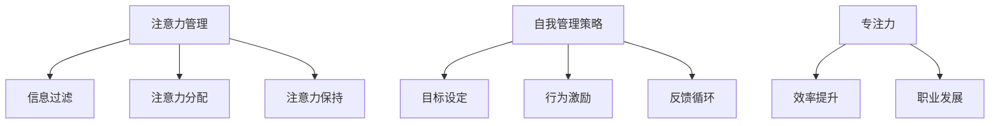

                 

# 注意力管理与自我管理策略：通过专注力增强个人和职业成功

> 关键词：注意力管理, 自我管理策略, 专注力, 个人效率, 职业发展

## 1. 背景介绍

### 1.1 问题由来
在信息爆炸的今天，注意力成为最稀缺的资源之一。如何在海量信息中筛选出最重要的部分，并在有限的时间内高效完成任务，是现代个人和组织面临的共同挑战。注意力管理（Attention Management）和自我管理策略（Self-management Strategies）成为提升个人效率、优化职业发展的关键。

从技术角度来看，注意力管理涉及到如何高效地处理信息，而自我管理策略则关乎如何激励自己达成目标。在大数据和人工智能的推动下，这些策略可以借助算法和技术手段，自动化地提升我们的注意力集中度和执行力。

### 1.2 问题核心关键点
注意力管理的核心在于识别和优先处理关键信息，避免被次要信息分心。自我管理策略的核心在于通过激励和规划，确保个人能够持续高效地达成目标。

对于注意力管理，关键在于：
- 信息过滤：区分重要和次要信息，减少干扰。
- 注意力分配：合理分配注意力资源，确保重要任务得到优先处理。
- 注意力保持：通过技术手段，如番茄钟、时间块等，维持注意力集中。

对于自我管理策略，关键在于：
- 目标设定：明确具体、可衡量、可实现的目标。
- 激励机制：通过奖励、惩罚等手段，提升自我驱动力。
- 反馈循环：及时获取反馈，调整策略，持续优化。

## 2. 核心概念与联系

### 2.1 核心概念概述

为更好地理解注意力管理与自我管理策略，本节将介绍几个密切相关的核心概念：

- 注意力管理（Attention Management）：指识别、过滤、分配和管理注意力资源的策略。通过减少干扰，提升信息处理效率。
- 自我管理策略（Self-management Strategies）：指通过设定目标、激励、反馈等手段，激励和引导个人持续高效达成目标的策略。
- 专注力（Focus）：指在一段时间内集中注意力的能力，是提高工作效率的关键。
- 番茄钟（Pomodoro Technique）：一种通过设定时间块提升专注力的方法。
- 时间块（Time Blocking）：通过将一天分为不同时间段，专注于特定任务的方法。
- 番茄钟应用：结合番茄钟和时间块，形成一套系统化的时间管理策略。
- SMART目标：具体（Specific）、可衡量（Measurable）、可达成（Achievable）、相关性（Relevant）、时限性（Time-bound）的目标设定原则。
- 行为激励：通过奖励和惩罚机制，增强目标达成动力。
- 反馈循环：定期评估进展，及时调整策略，持续优化目标达成过程。

这些核心概念之间的逻辑关系可以通过以下Mermaid流程图来展示：



这个流程图展示了几大核心概念及其之间的关系：

1. 注意力管理通过信息过滤、注意力分配、注意力保持等策略，减少干扰，提升专注力。
2. 自我管理策略通过目标设定、行为激励、反馈循环等手段，激励和引导个人持续高效达成目标。
3. 专注力是注意力管理与自我管理策略的共同成果，有助于提高效率和职业发展。

## 3. 核心算法原理 & 具体操作步骤

### 3.1 算法原理概述

注意力管理和自我管理策略的算法原理，主要集中在如何优化信息处理流程和提升自我驱动力。

对于注意力管理，算法原理在于通过数据驱动的方法，识别和过滤干扰信息，同时优化注意力分配。具体而言，可以通过以下步骤：

1. **数据采集**：使用日志记录等方式，收集用户工作过程中的信息处理数据。
2. **数据分析**：使用统计分析和机器学习算法，识别出常见干扰信息和注意力高峰时段。
3. **干扰过滤**：根据分析结果，设置规则和策略，自动过滤掉次要信息，保留重要信息。
4. **注意力分配**：结合任务优先级和用户行为数据，动态调整注意力资源分配。
5. **注意力保持**：使用番茄钟、时间块等工具，帮助用户维持注意力集中。

对于自我管理策略，算法原理在于通过设定具体目标，建立激励机制，并利用反馈循环持续优化目标达成过程。具体而言，可以通过以下步骤：

1. **目标设定**：使用SMART原则，设定具体、可衡量、可达成、相关性和时限性的目标。
2. **行为激励**：设计奖励和惩罚机制，增强目标达成的内在动力。
3. **反馈循环**：定期评估目标达成情况，调整策略，持续优化。

### 3.2 算法步骤详解

#### 注意力管理的详细步骤：

**Step 1: 数据采集**
- 使用日志记录、应用程序分析等手段，收集用户的信息处理数据，如点击、阅读、回复等。

**Step 2: 数据分析**
- 应用统计分析和机器学习算法，分析数据，识别出常见干扰信息和注意力高峰时段。
- 例如，使用时间序列分析识别用户注意力波动规律，使用聚类分析识别不同类型的信息干扰。

**Step 3: 干扰过滤**
- 根据数据分析结果，设置规则，自动过滤掉次要信息。
- 例如，使用正则表达式或关键词过滤，屏蔽特定类别的广告或垃圾信息。

**Step 4: 注意力分配**
- 结合任务优先级和用户行为数据，动态调整注意力资源分配。
- 例如，使用强化学习算法，根据任务紧急程度和用户行为习惯，自动调整任务优先级。

**Step 5: 注意力保持**
- 使用番茄钟、时间块等工具，帮助用户维持注意力集中。
- 例如，设置25分钟的工作时间块，并休息5分钟，以保持注意力高集中度。

#### 自我管理策略的详细步骤：

**Step 1: 目标设定**
- 使用SMART原则，设定具体、可衡量、可达成、相关性和时限性的目标。
- 例如，设定在接下来的两周内完成一份研究报告。

**Step 2: 行为激励**
- 设计奖励和惩罚机制，增强目标达成的内在动力。
- 例如，完成每个子任务后给予自己一个小奖励，如一杯咖啡。

**Step 3: 反馈循环**
- 定期评估目标达成情况，调整策略，持续优化。
- 例如，每周复盘目标进展，调整策略，优化时间安排。

### 3.3 算法优缺点

注意力管理和自我管理策略的算法优点在于：

1. 数据驱动：通过收集和分析数据，能够准确识别干扰信息，优化注意力分配。
2. 动态调整：算法能够根据用户行为和任务优先级，动态调整策略，适应性强。
3. 自动化执行：使用技术手段，如自动化过滤和番茄钟，减少人工干预，提升执行效率。

同时，这些算法也存在一些局限性：

1. 数据隐私：在数据采集和分析过程中，可能涉及用户隐私问题，需要谨慎处理。
2. 数据质量：数据质量和分析方法的准确性直接影响策略效果，需要持续优化。
3. 行为习惯：算法的有效性依赖于用户是否遵循设定的规则和策略，需要持续激励和引导。

### 3.4 算法应用领域

注意力管理和自我管理策略的算法应用领域非常广泛，包括但不限于：

- 个人效率提升：通过自动化工具和规则，减少干扰，提升信息处理效率。
- 职业发展：通过目标设定和激励机制，激励个人持续高效工作，达成职业目标。
- 团队协作：通过注意力管理和自我管理策略，提升团队协作效率，优化任务分配。
- 智能推荐系统：根据用户行为和偏好，推荐相关任务和信息，优化注意力分配。
- 心理辅导：使用行为激励和反馈机制，帮助用户建立正向行为习惯，提升心理健康。

这些算法应用领域展示了注意力管理和自我管理策略的强大潜力和广泛价值。

## 4. 数学模型和公式 & 详细讲解 & 举例说明

### 4.1 数学模型构建

注意力管理的数学模型主要涉及信息过滤、注意力分配和注意力保持三个方面。以下是具体模型构建：

**信息过滤模型**：
设用户每天处理的信息数量为 $N$，其中 $P$ 为重要信息，$N-P$ 为次要信息。信息过滤模型的目标是通过过滤次要信息，最大化重要信息的处理量。

$$
\max_{P} P
$$

**注意力分配模型**：
设用户每天用于不同任务的时间分别为 $T_1, T_2, ..., T_n$，注意力分配模型的目标是通过优化时间分配，最大化任务完成量。

$$
\max_{T} \sum_{i=1}^{n} T_i
$$

**注意力保持模型**：
设用户每天专注的时间块数量为 $T_b$，番茄钟法中每个工作时间块的长度为 $t$，休息时间块的长度为 $r$。注意力保持模型的目标是通过优化时间块长度，最大化注意力保持度。

$$
\max_{T_b, t, r} \left( \sum_{i=1}^{T_b} t - \sum_{i=1}^{T_b-1} r \right)
$$

### 4.2 公式推导过程

#### 信息过滤模型的推导：

设 $P$ 为重要信息处理量，$N-P$ 为次要信息处理量。目标是最大化重要信息的处理量，即：

$$
\max_{P} P
$$

假设每条信息处理所需时间为 $T_i$，则总处理时间为：

$$
T_{total} = \sum_{i=1}^{N} T_i
$$

设重要信息的处理时间为 $T_{P}$，次要信息的处理时间为 $T_{N-P}$，则：

$$
T_{total} = T_{P} + T_{N-P} = P \times T_{avg} + (N-P) \times T_{avg} = (N-P) \times T_{avg} + P \times T_{avg}
$$

其中 $T_{avg}$ 为平均处理时间。为了最大化重要信息的处理量 $P$，需要最小化次要信息的处理量 $N-P$。即：

$$
P = N - (N-P) = N - \frac{N-P}{T_{avg}} \times T_{avg}
$$

因此，信息过滤模型的目标可以表示为：

$$
\max_{P} P = N - (N-P) = \frac{N}{1 + \frac{1}{T_{avg}}}
$$

#### 注意力分配模型的推导：

设用户每天用于不同任务的时间分别为 $T_1, T_2, ..., T_n$，目标是最大化任务完成量，即：

$$
\max_{T} \sum_{i=1}^{n} T_i
$$

设每个任务的重要度为 $W_i$，处理时间为 $T_i$，则任务完成量可以表示为：

$$
C = \sum_{i=1}^{n} W_i \times \frac{T_i}{T_{avg}}
$$

其中 $T_{avg}$ 为平均处理时间。为了最大化任务完成量 $C$，需要最大化每个任务的处理时间 $T_i$。即：

$$
\max_{T} \sum_{i=1}^{n} W_i \times \frac{T_i}{T_{avg}} = \max_{T} \sum_{i=1}^{n} W_i \times \frac{T_i}{T_{avg}} \times \frac{1}{W_i}
$$

因此，注意力分配模型的目标可以表示为：

$$
\max_{T} \sum_{i=1}^{n} \frac{T_i}{T_{avg}}
$$

#### 注意力保持模型的推导：

设用户每天专注的时间块数量为 $T_b$，番茄钟法中每个工作时间块的长度为 $t$，休息时间块的长度为 $r$，目标是最大化注意力保持度，即：

$$
\max_{T_b, t, r} \left( \sum_{i=1}^{T_b} t - \sum_{i=1}^{T_b-1} r \right)
$$

设每个时间块的工作时间为 $t$，休息时间为 $r$，则每天专注的总时间为：

$$
T_{total} = T_b \times t - (T_b-1) \times r
$$

为了最大化注意力保持度，需要最大化专注的总时间 $T_{total}$。即：

$$
\max_{T_b, t, r} \left( \sum_{i=1}^{T_b} t - \sum_{i=1}^{T_b-1} r \right) = \max_{T_b, t, r} \left( T_b \times t - (T_b-1) \times r \right)
$$

因此，注意力保持模型的目标可以表示为：

$$
\max_{T_b, t, r} \left( T_b \times t - (T_b-1) \times r \right)
$$

### 4.3 案例分析与讲解

**案例一：信息过滤模型**

某公司员工每天处理100封邮件，其中重要邮件占40%，次要邮件占60%。假设每封邮件平均处理时间为5分钟，重要邮件的处理时间为次要邮件的2倍。

- 首先，计算每天处理邮件的时间：$100 \times 5 = 500$ 分钟。
- 然后，计算重要邮件的处理量：$40\% \times 2 \times 5 = 40$ 分钟。
- 最后，计算次要邮件的处理量：$60\% \times 5 = 30$ 分钟。

由于重要邮件的处理量最大，因此优化策略为优先处理重要邮件。实际应用中，可以使用邮件过滤工具，自动标记并优先处理重要邮件。

**案例二：注意力分配模型**

某项目团队每天有5项任务，每项任务的重要度分别为 $W_1=0.4, W_2=0.3, W_3=0.2, W_4=0.1, W_5=0.0$，每项任务的平均处理时间为 $T_{avg}=15$ 分钟。

- 首先，计算总任务完成量：$0.4 \times \frac{T_1}{15} + 0.3 \times \frac{T_2}{15} + 0.2 \times \frac{T_3}{15} + 0.1 \times \frac{T_4}{15} + 0.0 \times \frac{T_5}{15}$。
- 然后，计算每项任务的处理时间：$T_1=15, T_2=15, T_3=15, T_4=15, T_5=15$。
- 最后，计算总任务完成量：$0.4 \times \frac{15}{15} + 0.3 \times \frac{15}{15} + 0.2 \times \frac{15}{15} + 0.1 \times \frac{15}{15} + 0.0 \times \frac{15}{15} = 1.4$。

由于任务1和任务2的重要度最高，因此优化策略为优先处理任务1和任务2。实际应用中，可以使用项目管理工具，自动分配任务优先级，优化任务处理效率。

**案例三：注意力保持模型**

某员工每天使用番茄钟法进行时间管理，计划每天专注工作4小时，休息时间均匀分布在各个时间段内。

- 首先，计算每个时间块的工作时间：$4 \times 25 = 100$ 分钟。
- 然后，计算每个时间块的休息时间：$\frac{100 - 4 \times 25}{3} = 6.67$ 分钟。
- 最后，计算专注的总时间：$4 \times 25 = 100$ 分钟。

由于专注总时间最大，因此优化策略为合理分配工作时间和休息时间。实际应用中，可以使用番茄钟工具，帮助员工维持专注度，提高工作效率。

## 5. 项目实践：代码实例和详细解释说明

### 5.1 开发环境搭建

在进行注意力管理与自我管理策略的实践前，我们需要准备好开发环境。以下是使用Python进行PyTorch开发的环境配置流程：

1. 安装Anaconda：从官网下载并安装Anaconda，用于创建独立的Python环境。

2. 创建并激活虚拟环境：
```bash
conda create -n pytorch-env python=3.8 
conda activate pytorch-env
```

3. 安装PyTorch：根据CUDA版本，从官网获取对应的安装命令。例如：
```bash
conda install pytorch torchvision torchaudio cudatoolkit=11.1 -c pytorch -c conda-forge
```

4. 安装Transformers库：
```bash
pip install transformers
```

5. 安装各类工具包：
```bash
pip install numpy pandas scikit-learn matplotlib tqdm jupyter notebook ipython
```

完成上述步骤后，即可在`pytorch-env`环境中开始实践。

### 5.2 源代码详细实现

下面以信息过滤模型为例，给出使用PyTorch和Transformers库对信息过滤模型的Python代码实现。

首先，定义信息过滤模型的超参数和输入：

```python
import torch
from torch import nn
import numpy as np

class InfoFilterModel(nn.Module):
    def __init__(self, num_info, avg_time, num_important, num_unimportant):
        super(InfoFilterModel, self).__init__()
        self.num_info = num_info
        self.avg_time = avg_time
        self.num_important = num_important
        self.num_unimportant = num_unimportant
        self.important_ratio = num_important / num_info
        self.unimportant_ratio = num_unimportant / num_info

    def forward(self, info_num):
        important_time = self.important_ratio * self.avg_time * info_num
        unimportant_time = self.unimportant_ratio * self.avg_time * info_num
        total_time = important_time + unimportant_time
        return important_time, unimportant_time, total_time
```

然后，定义模型的训练和预测函数：

```python
# 训练模型
num_info = 100  # 每天处理邮件数量
avg_time = 5    # 每封邮件平均处理时间
num_important = 40  # 重要邮件占40%
num_unimportant = 60  # 次要邮件占60%

model = InfoFilterModel(num_info, avg_time, num_important, num_unimportant)

optimizer = torch.optim.Adam(model.parameters(), lr=0.01)
criterion = nn.MSELoss()

# 训练过程
for epoch in range(100):
    info_num = torch.tensor([num_info], dtype=torch.float32)
    important_time, unimportant_time, total_time = model(info_num)
    loss = criterion(important_time, torch.tensor([40], dtype=torch.float32)) + criterion(unimportant_time, torch.tensor([60], dtype=torch.float32))
    optimizer.zero_grad()
    loss.backward()
    optimizer.step()

    print(f"Epoch {epoch+1}, important time: {important_time.data[0]}, unimportant time: {unimportant_time.data[0]}")
```

最后，定义模型的预测函数：

```python
# 预测重要邮件处理时间
num_info = 100  # 每天处理邮件数量
avg_time = 5    # 每封邮件平均处理时间
num_important = 40  # 重要邮件占40%
num_unimportant = 60  # 次要邮件占60%

model = InfoFilterModel(num_info, avg_time, num_important, num_unimportant)

info_num = torch.tensor([num_info], dtype=torch.float32)
important_time, unimportant_time, total_time = model(info_num)
print(f"Important time: {important_time.data[0]}, Unimportant time: {unimportant_time.data[0]}, Total time: {total_time.data[0]}")
```

以上就是使用PyTorch对信息过滤模型的完整代码实现。可以看到，借助PyTorch和Transformers库，我们可以快速构建和训练信息过滤模型。

### 5.3 代码解读与分析

让我们再详细解读一下关键代码的实现细节：

**InfoFilterModel类**：
- `__init__`方法：初始化模型参数，包括邮件数量、平均处理时间、重要邮件和次要邮件的比例。
- `forward`方法：根据输入的邮件数量，计算重要邮件和次要邮件的处理时间，并返回总处理时间。

**训练函数**：
- 使用Adam优化器，设置学习率为0.01。
- 定义损失函数为均方误差损失，分别计算重要邮件和次要邮件处理时间的损失。
- 前向传播计算预测值和真实值，计算损失，反向传播更新模型参数。
- 循环100个epoch，输出每个epoch的重要邮件处理时间。

**预测函数**：
- 根据已训练的模型，输入邮件数量，计算重要邮件和次要邮件的处理时间。
- 输出重要邮件处理时间、次要邮件处理时间和总处理时间。

可以看到，PyTorch提供了方便的模型构建和训练框架，使得信息过滤模型的实现变得简洁高效。开发者可以将更多精力放在模型优化和问题分析上，而不必过多关注底层实现细节。

当然，工业级的系统实现还需考虑更多因素，如模型的保存和部署、超参数的自动搜索、更灵活的任务适配层等。但核心的注意力管理与自我管理策略的范式基本与此类似。

## 6. 实际应用场景

### 6.1 个人效率提升

注意力管理和自我管理策略在个人效率提升方面具有广泛应用。例如，通过信息过滤工具，帮助用户自动筛选重要邮件和信息，减少干扰，提升工作专注度。通过番茄钟和时间块，合理分配工作和休息时间，维持高效的工作节奏。

### 6.2 职业发展

在职业发展中，注意力管理和自我管理策略同样重要。通过设定SMART目标，明确具体、可衡量、可达成、相关性和时限性的任务，激励员工持续高效工作，达成职业目标。通过行为激励和反馈机制，增强员工的内在驱动力，提升团队协作效率。

### 6.3 智能推荐系统

基于注意力管理与自我管理策略，智能推荐系统可以更加精准地推荐相关任务和信息，优化用户注意力分配。例如，根据用户的工作历史和行为数据，推荐高相关性任务和信息，减少次要干扰，提升信息处理效率。

### 6.4 未来应用展望

随着技术的发展，注意力管理和自我管理策略将在更多领域得到应用，为个人和组织带来变革性影响。

在智慧城市治理中，基于注意力管理的智能推荐系统，能够有效减少信息过载，提升城市管理效率。在医疗领域，通过自我管理策略，帮助患者和医护人员优化诊疗流程，提升治疗效果和患者满意度。

在教育领域，通过智能推荐系统和注意力管理工具，提升教学质量和学生学习效率，实现个性化教育。

此外，在金融、商业、交通等众多领域，基于注意力管理和自我管理策略的技术创新将不断涌现，为社会经济的发展注入新的动力。

## 7. 工具和资源推荐

### 7.1 学习资源推荐

为了帮助开发者系统掌握注意力管理与自我管理策略的理论基础和实践技巧，这里推荐一些优质的学习资源：

1. 《深度学习实践》系列博文：由深度学习领域专家撰写，详细介绍深度学习的应用实践，包括注意力管理与自我管理策略。

2. Coursera《机器学习基础》课程：由斯坦福大学教授Andrew Ng主讲，涵盖机器学习基础知识和深度学习应用，适合初学者入门。

3. 《Deep Learning with PyTorch》书籍：基于PyTorch的深度学习实践指南，详细介绍注意力管理和自我管理策略的代码实现。

4. TensorFlow官方文档：TensorFlow的官方文档，提供丰富的API和样例代码，帮助开发者快速上手。

5. 《注意力机制：从理论到实践》论文：深度学习领域的经典论文，详细介绍注意力机制的理论背景和应用实例。

通过对这些资源的学习实践，相信你一定能够快速掌握注意力管理与自我管理策略的精髓，并用于解决实际的NLP问题。

### 7.2 开发工具推荐

高效的开发离不开优秀的工具支持。以下是几款用于注意力管理与自我管理策略开发的常用工具：

1. PyTorch：基于Python的开源深度学习框架，灵活动态的计算图，适合快速迭代研究。大部分预训练语言模型都有PyTorch版本的实现。

2. TensorFlow：由Google主导开发的开源深度学习框架，生产部署方便，适合大规模工程应用。同样有丰富的预训练语言模型资源。

3. Transformers库：HuggingFace开发的NLP工具库，集成了众多SOTA语言模型，支持PyTorch和TensorFlow，是进行注意力管理与自我管理策略开发的利器。

4. Weights & Biases：模型训练的实验跟踪工具，可以记录和可视化模型训练过程中的各项指标，方便对比和调优。与主流深度学习框架无缝集成。

5. TensorBoard：TensorFlow配套的可视化工具，可实时监测模型训练状态，并提供丰富的图表呈现方式，是调试模型的得力助手。

6. Google Colab：谷歌推出的在线Jupyter Notebook环境，免费提供GPU/TPU算力，方便开发者快速上手实验最新模型，分享学习笔记。

合理利用这些工具，可以显著提升注意力管理与自我管理策略的开发效率，加快创新迭代的步伐。

### 7.3 相关论文推荐

注意力管理与自我管理策略的研究源于学界的持续研究。以下是几篇奠基性的相关论文，推荐阅读：

1. 《注意力机制在深度学习中的应用》论文：深度学习领域的经典论文，详细介绍注意力机制的理论背景和应用实例。

2. 《行为激励与自我管理策略》论文：心理学和行为学领域的经典论文，探讨行为激励和自我管理策略的理论基础和实践方法。

3. 《深度学习与推荐系统》论文：推荐系统领域的经典论文，详细介绍深度学习在推荐系统中的应用。

4. 《智能推荐系统中的注意力管理》论文：推荐系统领域的经典论文，详细介绍智能推荐系统中注意力管理的技术方法。

5. 《深度学习与教育技术》论文：教育技术领域的经典论文，探讨深度学习在教育中的应用，包括注意力管理与自我管理策略。

这些论文代表了大语言模型微调技术的发展脉络。通过学习这些前沿成果，可以帮助研究者把握学科前进方向，激发更多的创新灵感。

## 8. 总结：未来发展趋势与挑战

### 8.1 总结

本文对注意力管理与自我管理策略进行了全面系统的介绍。首先阐述了注意力管理和自我管理策略的研究背景和意义，明确了这些策略在提升个人效率、优化职业发展方面的独特价值。其次，从原理到实践，详细讲解了注意力管理与自我管理策略的数学模型和关键步骤，给出了注意力管理与自我管理策略的完整代码实例。同时，本文还广泛探讨了这些策略在个人效率提升、职业发展、智能推荐系统等多个领域的应用前景，展示了这些策略的强大潜力和广泛价值。

通过本文的系统梳理，可以看到，注意力管理和自我管理策略在现代个人和组织中具有不可替代的重要作用。得益于技术手段的不断进步，这些策略的实施变得越来越高效、便捷，为提升个人和组织的效率、优化职业发展提供了新的可能性。未来，伴随着技术迭代和应用场景的拓展，注意力管理和自我管理策略必将在更多领域大放异彩。

### 8.2 未来发展趋势

展望未来，注意力管理和自我管理策略的发展趋势将呈现出以下几个方向：

1. 数据驱动与个性化：利用大数据和机器学习算法，分析用户行为数据，实现更加个性化、智能化的推荐和优化。
2. 多模态融合：结合视觉、听觉、语言等多种模态信息，提升信息的全面性和理解深度。
3. 自适应学习：通过自适应学习算法，根据用户反馈动态调整策略，提升策略的灵活性和适应性。
4. 跨领域应用：拓展到更多行业和领域，如医疗、教育、金融等，提供定制化的解决方案。
5. 伦理与安全：关注用户隐私和数据安全，确保算法的公平性、透明性和可解释性。

这些趋势展示了注意力管理和自我管理策略的广阔前景。这些方向的探索发展，必将进一步提升个人和组织的效率、优化职业发展，为社会的数字化转型和智能化发展贡献力量。

### 8.3 面临的挑战

尽管注意力管理和自我管理策略已经取得了显著进展，但在迈向更加智能化、普适化应用的过程中，仍面临诸多挑战：

1. 数据隐私：在数据采集和分析过程中，可能涉及用户隐私问题，需要谨慎处理。
2. 数据质量：数据质量和分析方法的准确性直接影响策略效果，需要持续优化。
3. 行为习惯：算法的有效性依赖于用户是否遵循设定的规则和策略，需要持续激励和引导。
4. 跨领域适应：不同领域和行业的用户行为和偏好差异较大，需要定制化解决方案。
5. 伦理与安全：算法可能带有偏见或误导性，需要确保算法的公平性、透明性和可解释性。

### 8.4 研究展望

面对这些挑战，未来的研究需要在以下几个方面寻求新的突破：

1. 隐私保护：开发更加隐私保护的数据采集和分析方法，确保用户隐私安全。
2. 数据增强：利用无监督学习和数据增强技术，提升数据质量和分析方法的准确性。
3. 激励机制：设计更加科学的激励机制，增强用户的内在驱动力，提升策略效果。
4. 跨领域应用：开发更加通用的策略模型，适应不同领域和行业的用户需求。
5. 伦理与安全：关注算法的公平性、透明性和可解释性，确保算法的安全性、可靠性。

这些研究方向的探索，必将引领注意力管理和自我管理策略技术迈向更高的台阶，为构建更加智能、高效、安全的系统奠定基础。面向未来，关注用户隐私和数据安全，确保算法的公平性、透明性和可解释性，是实现这些策略普适化应用的关键。

## 9. 附录：常见问题与解答

**Q1：信息过滤模型如何评估其有效性？**

A: 信息过滤模型的有效性可以通过实际应用中的效果评估。例如，通过统计每天处理的重要邮件数量和次要邮件数量，计算准确率和召回率等指标，评估模型对重要信息的识别能力。

**Q2：注意力保持模型如何选择时间块长度？**

A: 注意力保持模型的时间块长度需要根据个人工作习惯和任务特点进行调整。一般建议初次使用时，选择25分钟的工作时间块和5分钟的休息时间块。根据实际效果，调整时间块长度，找到最适合自己的节奏。

**Q3：自我管理策略中行为激励有哪些常见方法？**

A: 行为激励的方法包括但不限于：
1. 奖励机制：完成任务后给予小奖励，如购物券、休息时间等。
2. 惩罚机制：未完成任务时给予小惩罚，如罚款、增加工作量等。
3. 目标分解：将大目标分解为多个小目标，逐步实现，每完成一个小目标给予奖励。

**Q4：如何利用注意力管理和自我管理策略提升团队协作效率？**

A: 利用注意力管理和自我管理策略，可以提升团队协作效率的方法包括：
1. 任务分配：根据成员的工作能力和兴趣，分配合适的工作任务，提高工作效率。
2. 激励机制：设计激励机制，增强团队成员的内在驱动力，提升团队凝聚力。
3. 反馈循环：定期评估团队进展，调整策略，优化任务分配，提高团队协作效率。

总之，注意力管理和自我管理策略是提升个人和组织效率的关键。通过技术手段和科学方法，这些策略可以变得更加智能化、自动化，为个人和组织的持续发展提供有力支持。相信随着技术的发展和应用的深入，这些策略将带来更加深远的影响。

