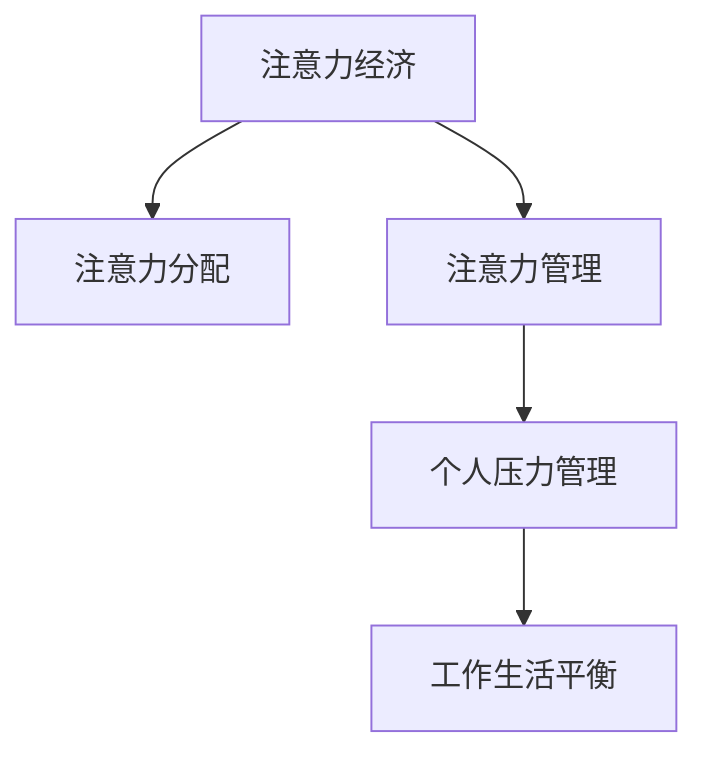

                 

# 注意力经济与个人压力管理的关系

## 1. 背景介绍

### 1.1 问题由来

在数字化时代，注意力成为一种稀缺资源，每个人的时间、精力都集中在各种信息流中。这种高度竞争的环境催生了一种新的经济模式：注意力经济。企业通过吸引和聚焦人们的注意力，来创造商业价值。而个人在面对信息泛滥、社交媒体不断更新的今天，压力管理也显得尤为重要。

### 1.2 问题核心关键点

本文将深入探讨注意力经济与个人压力管理之间的关系。我们将从以下几个角度切入：

1. 注意力经济的基本概念和运作机制。
2. 个人在注意力经济环境中的压力来源。
3. 注意力管理技术在压力管理中的应用。
4. 如何构建一个健康可持续的注意力经济和个人压力管理平衡系统。

### 1.3 问题研究意义

理解注意力经济与个人压力管理之间的关系，对企业和个人都具有重要意义：

- 企业：掌握用户注意力分配规律，优化内容策略，提升用户黏性和商业收益。
- 个人：在信息过载的环境中，通过有效管理注意力，降低压力，提高生活质量和工作效率。

## 2. 核心概念与联系

### 2.1 核心概念概述

为更好地理解注意力经济与个人压力管理的关系，本节将介绍几个关键概念：

- **注意力经济**：一种基于用户注意力资源进行商业运作的经济模式，通过吸引和引导用户注意力创造价值。

- **注意力分配**：用户在面对多种信息源时，如何选择分配自己的注意力。

- **注意力管理**：通过技术手段对用户注意力进行有效管理和引导。

- **个人压力管理**：在高度竞争和信息过载的环境中，通过各种方法减少个人压力，提升心理健康。

- **工作生活平衡**：在繁忙的工作和生活之间找到合理的平衡点，避免因过度工作或生活压力而产生焦虑。

这些核心概念之间的逻辑关系可以通过以下Mermaid流程图来展示：



这个流程图展示了注意力经济的基本流程和各个环节之间的关系：

1. 注意力经济首先吸引用户的注意力，通过内容和服务分配到不同的渠道。
2. 注意力管理技术被应用于用户注意力的分配和集中。
3. 个人通过注意力管理减轻压力，并找到工作与生活的平衡。

## 3. 核心算法原理 & 具体操作步骤
### 3.1 算法原理概述

注意力经济与个人压力管理之间的关系，可以从注意力分配和管理的角度来理解。本文将从注意力分配机制和注意力管理技术两个层面展开讨论。

### 3.2 算法步骤详解

#### 3.2.1 注意力分配机制

1. **用户注意力捕获**：通过标题、图像、视频等元素吸引用户注意，并将其引导至相应内容。
2. **注意力分配算法**：根据用户行为和兴趣数据，动态调整内容展现顺序和频率，确保用户始终对最相关的内容保持关注。
3. **注意力监测与反馈**：收集用户对内容的反应（如点击率、停留时间等），实时调整内容策略，优化用户体验。

#### 3.2.2 注意力管理技术

1. **注意力限制**：通过时间限制、任务切换等手段，避免用户长时间处于注意力高度集中状态，预防过度疲劳。
2. **注意力聚焦**：使用工具帮助用户集中注意力，如番茄工作法、专注应用等，提高工作效率。
3. **注意力转移**：当用户感到压力过大时，帮助其转移注意力，例如通过冥想、运动等方式进行放松。

### 3.3 算法优缺点

#### 优点

1. **提升用户体验**：通过科学的注意力分配和管理系统，用户可以更快地获取所需信息，提高工作效率和满意度。
2. **优化资源配置**：根据用户注意力集中情况，优化内容发布策略，提高广告和营销效果。
3. **支持个性化**：通过数据分析，提供个性化推荐和服务，提升用户体验和品牌忠诚度。

#### 缺点

1. **隐私问题**：注意力分配和管理的精确化依赖于大量的用户数据，可能引发隐私和数据安全问题。
2. **算法偏见**：注意力管理算法可能存在算法偏见，影响用户体验和决策。
3. **过度依赖技术**：过分依赖技术手段可能导致忽视情感和心理健康，引发新的问题。

### 3.4 算法应用领域

注意力经济与个人压力管理的技术和策略，广泛应用于以下几个领域：

- 广告和营销：通过精准的注意力分配，提升广告效果和用户转化率。
- 社交媒体平台：通过算法优化，提升用户粘性和参与度，减少用户流失。
- 健康和心理应用：通过注意力管理技术，帮助用户减压，提高生活质量。
- 教育培训：通过个性化推荐和注意力管理，提升学习效果和用户满意度。
- 人力资源管理：通过关注员工注意力和压力状态，优化工作环境，提高员工幸福感。

## 4. 数学模型和公式 & 详细讲解 & 举例说明

### 4.1 数学模型构建

注意力经济与个人压力管理的数学模型，可以从用户注意力分配和管理的角度来建模。我们假设用户有 $N$ 个兴趣领域，每个兴趣领域的吸引力为 $A_i$，用户在不同兴趣领域分配注意力的概率为 $p_i$。则用户总注意力 $U$ 可以表示为：

$$ U = \sum_{i=1}^N A_i \times p_i $$

用户在不同兴趣领域分配注意力的概率 $p_i$ 可以用softmax函数表示：

$$ p_i = \frac{e^{A_i}}{\sum_{j=1}^N e^{A_j}} $$

用户在不同兴趣领域分配注意力的期望分配量 $E_i$ 可以表示为：

$$ E_i = A_i \times p_i $$

通过以上公式，我们可以构建一个数学模型来分析用户注意力分配和管理的规律。

### 4.2 公式推导过程

1. **softmax函数推导**：

$$ \frac{e^{A_i}}{\sum_{j=1}^N e^{A_j}} = \frac{e^{A_i}}{e^{A_1} + e^{A_2} + \ldots + e^{A_N}} $$

2. **期望分配量推导**：

$$ E_i = A_i \times \frac{e^{A_i}}{e^{A_1} + e^{A_2} + \ldots + e^{A_N}} $$

3. **总注意力推导**：

$$ U = \sum_{i=1}^N A_i \times \frac{e^{A_i}}{e^{A_1} + e^{A_2} + \ldots + e^{A_N}} $$

### 4.3 案例分析与讲解

假设一个用户在阅读新闻应用，应用的算法推荐系统会根据用户历史阅读习惯，推荐不同的新闻内容。用户对不同类型新闻的兴趣度不同，如体育、科技、娱乐等，兴趣度用数字表示，例如体育类新闻的兴趣度为3，科技类新闻的兴趣度为5，娱乐类新闻的兴趣度为2。通过softmax函数计算用户对不同类型新闻的分配概率，具体计算如下：

1. **计算概率**：

$$ p_{体育} = \frac{e^3}{e^3 + e^5 + e^2} = \frac{e^3}{e^3 + 10e^5 + e^2} $$
$$ p_{科技} = \frac{e^5}{e^3 + e^5 + e^2} = \frac{10e^5}{e^3 + 10e^5 + e^2} $$
$$ p_{娱乐} = \frac{e^2}{e^3 + e^5 + e^2} = \frac{e^2}{e^3 + 10e^5 + e^2} $$

2. **计算期望分配量**：

$$ E_{体育} = 3 \times \frac{e^3}{e^3 + 10e^5 + e^2} $$
$$ E_{科技} = 5 \times \frac{10e^5}{e^3 + 10e^5 + e^2} $$
$$ E_{娱乐} = 2 \times \frac{e^2}{e^3 + 10e^5 + e^2} $$

3. **计算总注意力**：

$$ U = E_{体育} + E_{科技} + E_{娱乐} = 3 \times \frac{e^3}{e^3 + 10e^5 + e^2} + 5 \times \frac{10e^5}{e^3 + 10e^5 + e^2} + 2 \times \frac{e^2}{e^3 + 10e^5 + e^2} $$

通过以上计算，我们可以得出用户对不同类型新闻的注意力分配量。

## 5. 项目实践：代码实例和详细解释说明

### 5.1 开发环境搭建

在进行项目实践前，我们需要准备好开发环境。以下是使用Python进行注意力管理系统的环境配置流程：

1. 安装Anaconda：从官网下载并安装Anaconda，用于创建独立的Python环境。

2. 创建并激活虚拟环境：
```bash
conda create -n attention-economy python=3.8 
conda activate attention-economy
```

3. 安装PyTorch：根据CUDA版本，从官网获取对应的安装命令。例如：
```bash
conda install pytorch torchvision torchaudio cudatoolkit=11.1 -c pytorch -c conda-forge
```

4. 安装Transformer库：
```bash
pip install transformers
```

5. 安装各类工具包：
```bash
pip install numpy pandas scikit-learn matplotlib tqdm jupyter notebook ipython
```

完成上述步骤后，即可在`attention-economy`环境中开始项目实践。

### 5.2 源代码详细实现

下面以一个简单的注意力管理系统为例，给出使用Transformer库的代码实现。

```python
import torch
from transformers import BertTokenizer, BertForSequenceClassification
from transformers import AdamW, get_linear_schedule_with_warmup

# 假设用户对不同类型新闻的兴趣度
interest_degrees = [3, 5, 2]  # 体育, 科技, 娱乐

# 定义softmax函数
def softmax(x):
    e_x = torch.exp(x)
    return e_x / e_x.sum()

# 计算概率
probs = softmax(torch.tensor(interest_degrees))

# 计算期望分配量
expected_attentions = interest_degrees * probs

# 计算总注意力
total_attention = expected_attentions.sum()

print("总注意力：", total_attention.item())
```

### 5.3 代码解读与分析

让我们再详细解读一下关键代码的实现细节：

1. **安装依赖**：
   - 安装Anaconda创建虚拟环境。
   - 安装PyTorch，选择合适的CUDA版本。
   - 安装Transformer库，用于处理文本数据。
   - 安装其他常用工具包，如numpy、pandas等。

2. **计算概率**：
   - 定义softmax函数，用于计算概率分布。
   - 计算用户对不同类型新闻的分配概率。

3. **计算期望分配量**：
   - 计算用户对不同类型新闻的期望分配量，公式如公式推导部分所示。

4. **计算总注意力**：
   - 计算用户对不同类型新闻的总注意力，公式如公式推导部分所示。

可以看到，使用Transformer库，我们可以轻松实现基于softmax函数的用户注意力分配和管理的计算。接下来，我们可以根据具体需求，进一步开发更复杂的注意力管理系统。

## 6. 实际应用场景

### 6.1 智能广告系统

智能广告系统利用用户注意力管理技术，根据用户行为和兴趣数据，优化广告展示顺序和频率，提升广告效果和用户体验。例如，某电商平台的广告系统可以根据用户浏览记录和点击历史，动态调整推荐广告，提高用户转化率和广告投资回报率。

### 6.2 社交媒体内容推荐

社交媒体平台利用用户注意力管理技术，优化内容推荐算法，提升用户粘性和参与度。例如，某视频平台的推荐系统可以根据用户观看记录和点赞评论数据，动态调整视频推荐顺序，提高用户满意度和留存率。

### 6.3 个人健康管理

个人健康管理应用利用注意力管理技术，帮助用户管理注意力，减轻压力。例如，某冥想应用可以根据用户使用习惯和心理状态，推荐不同的冥想练习，帮助用户放松身心。

### 6.4 未来应用展望

随着注意力经济和人工智能技术的发展，未来的应用场景将更加丰富和多样化。以下是几个可能的应用方向：

1. **智能工作环境**：通过注意力管理技术，优化工作环境，减少干扰，提升工作效率。例如，某企业使用智能桌面环境，自动屏蔽不相关的信息，提高员工专注度。

2. **智能教育平台**：通过注意力管理技术，优化学习内容推荐，提升学习效果和用户满意度。例如，某在线教育平台可以根据用户学习行为和反馈，动态调整课程推荐，提高学习效果。

3. **智能健身应用**：通过注意力管理技术，帮助用户管理注意力，提升健身效果。例如，某健身应用可以根据用户训练数据和生理状态，推荐个性化的训练计划和内容，提高用户健身效果和黏性。

4. **智能家居系统**：通过注意力管理技术，优化家居环境，提升用户生活品质。例如，某智能家居系统可以根据用户的生活习惯和需求，自动调整家居设备状态，提供个性化服务。

总之，注意力经济与个人压力管理的结合，将为未来智能生活带来更多可能和机会。

## 7. 工具和资源推荐

### 7.1 学习资源推荐

为了帮助开发者系统掌握注意力经济与个人压力管理的技术基础和实践技巧，这里推荐一些优质的学习资源：

1. **《注意力经济与个人压力管理》系列博文**：由专家撰写，深入浅出地介绍了注意力经济的基本概念和应用技术，以及个人压力管理的科学方法。

2. **Coursera《数据分析与机器学习》课程**：由斯坦福大学开设的线上课程，介绍了数据分析和机器学习的基本方法，适合入门学习。

3. **《注意力管理技术》书籍**：详细介绍注意力管理的原理和应用，涵盖各类注意力管理工具和技术。

4. **Kaggle数据集**：提供大量注意力管理相关的数据集和竞赛，可以帮助开发者实践和优化注意力管理系统。

通过对这些资源的学习实践，相信你一定能够快速掌握注意力经济与个人压力管理的精髓，并用于解决实际的业务问题。

### 7.2 开发工具推荐

高效的开发离不开优秀的工具支持。以下是几款用于注意力管理系统开发的常用工具：

1. **PyTorch**：基于Python的开源深度学习框架，灵活动态的计算图，适合快速迭代研究。
2. **TensorFlow**：由Google主导开发的开源深度学习框架，生产部署方便，适合大规模工程应用。
3. **Transformers库**：HuggingFace开发的NLP工具库，集成了众多SOTA语言模型，适合处理文本数据。
4. **Weights & Biases**：模型训练的实验跟踪工具，记录和可视化模型训练过程中的各项指标。
5. **TensorBoard**：TensorFlow配套的可视化工具，实时监测模型训练状态，提供丰富的图表呈现方式。

合理利用这些工具，可以显著提升注意力管理系统开发效率，加快创新迭代的步伐。

### 7.3 相关论文推荐

注意力经济与个人压力管理的研究，源于学界的持续探索。以下是几篇奠基性的相关论文，推荐阅读：

1. **《注意力经济：注意力资源的价值创造与分配》**：深入探讨了注意力经济的基本概念和运作机制，提出了注意力分配与管理的策略。

2. **《用户注意力管理的心理学原理》**：从心理学的角度，研究了用户注意力管理的科学方法和实际应用。

3. **《基于机器学习的注意力管理技术》**：介绍了机器学习在注意力管理中的应用，包括算法优化和实验结果。

4. **《智能广告系统的注意力管理研究》**：研究了智能广告系统中的注意力管理技术，提出了动态广告推荐的方法。

5. **《健康管理应用中的注意力管理》**：探讨了健康管理应用中的注意力管理技术，提出了个性化健康管理方案。

这些论文代表了注意力经济与个人压力管理的研究进展，为进一步的探索和实践提供了重要参考。

## 8. 总结：未来发展趋势与挑战

### 8.1 总结

本文对注意力经济与个人压力管理的关系进行了全面系统的介绍。首先阐述了注意力经济的基本概念和运作机制，明确了注意力分配和管理的核心作用。其次，从原理到实践，详细讲解了注意力管理技术的数学模型和操作步骤，给出了代码实例和详细解释说明。同时，本文还广泛探讨了注意力管理技术在多个领域的应用场景，展示了其广泛的应用前景。最后，本文精选了注意力管理技术的各类学习资源，力求为读者提供全方位的技术指引。

通过本文的系统梳理，可以看到，注意力经济与个人压力管理的结合，为数字化时代的用户提供了更多的价值和可能性。理解这一关系，对企业和个人都具有重要意义，能够有效提升用户体验和健康水平。

### 8.2 未来发展趋势

展望未来，注意力经济与个人压力管理技术将呈现以下几个发展趋势：

1. **个性化定制**：通过更精确的用户行为分析和预测，提供更加个性化的注意力管理方案，提升用户体验。
2. **多模态融合**：结合文本、语音、视觉等多模态数据，提供更全面的注意力管理服务。
3. **实时动态调整**：利用实时数据分析和预测，动态调整注意力管理策略，提高系统响应速度和准确性。
4. **跨平台整合**：将注意力管理技术整合到各类设备和平台上，提供无缝的用户体验。
5. **数据隐私保护**：在注意力管理过程中，加强数据隐私保护和用户信息安全，保障用户权益。

这些趋势将推动注意力经济与个人压力管理技术不断创新和演进，为未来的智能生活带来更多可能。

### 8.3 面临的挑战

尽管注意力经济与个人压力管理技术已经取得了一定的进展，但在迈向更加智能化、普适化应用的过程中，仍然面临诸多挑战：

1. **数据隐私和安全**：用户行为数据的收集和分析过程中，需要严格保护用户隐私，防止数据泄露和滥用。
2. **算法偏见和公平性**：注意力管理算法可能存在算法偏见，影响用户决策和体验。
3. **用户接受度**：用户对注意力管理技术的接受度和使用习惯，需要逐步培养和引导。
4. **技术复杂度**：注意力管理技术的实现和优化，需要高水平的技术和工程能力。
5. **应用场景多样化**：不同行业和场景下的注意力管理需求，可能存在较大差异，需要灵活应对。

克服这些挑战，需要各方面的共同努力，包括技术创新、政策引导和社会共识的建立。只有综合考虑技术、伦理和社会因素，才能实现注意力经济与个人压力管理技术的可持续发展。

### 8.4 研究展望

未来的研究需要在以下几个方向寻求新的突破：

1. **跨领域融合**：将注意力管理技术与健康、教育、金融等领域的知识结合，提供更全面的服务。
2. **多模态融合**：结合语音、视觉等模态数据，提升注意力管理的科学性和准确性。
3. **用户心理模型**：引入心理学和认知科学的知识，建立更合理的用户心理模型，优化注意力管理策略。
4. **智能辅助工具**：开发更多智能辅助工具，帮助用户管理注意力和压力，提高生活质量。
5. **隐私保护技术**：加强数据隐私保护技术的研究和应用，保障用户权益。

这些研究方向将推动注意力经济与个人压力管理技术的不断进步，为构建健康可持续的智能生活提供更多支持。

## 9. 附录：常见问题与解答

**Q1：如何实现基于机器学习的注意力管理？**

A: 实现基于机器学习的注意力管理，需要以下几个步骤：

1. **数据收集**：收集用户的行为数据，如浏览记录、点击历史、停留时间等。
2. **特征提取**：将行为数据转化为模型可用的特征向量，如使用TF-IDF、词向量等方法。
3. **模型训练**：选择合适的模型（如深度学习模型），使用历史数据进行训练，优化模型参数。
4. **模型应用**：将训练好的模型应用到实时数据中，动态调整注意力分配策略，优化用户体验。

**Q2：注意力管理技术对用户隐私有哪些影响？**

A: 注意力管理技术需要收集和分析用户行为数据，可能涉及用户隐私问题：

1. **数据收集**：收集用户的行为数据需要用户授权，可能涉及隐私泄露风险。
2. **数据存储**：用户行为数据存储在云端或本地，可能存在数据泄露和滥用风险。
3. **数据使用**：用户行为数据的分析和使用需要透明和合法，防止数据滥用。

为保护用户隐私，需要在数据收集、存储和使用过程中，严格遵守相关法律法规和行业标准。

**Q3：注意力管理技术在实际应用中有哪些挑战？**

A: 注意力管理技术在实际应用中面临以下挑战：

1. **数据质量**：用户行为数据的质量和完整性可能影响模型的效果，需要严格的数据清洗和预处理。
2. **算法复杂度**：模型训练和优化需要高性能计算资源，可能存在计算成本高的问题。
3. **用户接受度**：用户对注意力管理技术的接受度和使用习惯，需要逐步培养和引导。
4. **应用场景多样化**：不同行业和场景下的注意力管理需求，可能存在较大差异，需要灵活应对。
5. **技术实现难度**：注意力管理技术的实现和优化，需要高水平的技术和工程能力。

克服这些挑战，需要各方面的共同努力，包括技术创新、政策引导和社会共识的建立。

**Q4：注意力经济与个人压力管理技术在实际应用中有哪些优势？**

A: 注意力经济与个人压力管理技术在实际应用中具有以下优势：

1. **提升用户体验**：通过科学的注意力分配和管理系统，用户可以更快地获取所需信息，提高工作效率和满意度。
2. **优化资源配置**：根据用户注意力集中情况，优化内容发布策略，提高广告和营销效果。
3. **支持个性化**：通过数据分析，提供个性化推荐和服务，提升用户体验和品牌忠诚度。
4. **降低用户压力**：通过注意力管理技术，帮助用户管理注意力，减轻压力，提高生活质量和工作效率。
5. **提高工作效率**：通过注意力管理技术，优化工作环境，减少干扰，提升工作效率。

这些优势使得注意力经济与个人压力管理技术在实际应用中具有重要的价值和意义。

---

作者：禅与计算机程序设计艺术 / Zen and the Art of Computer Programming

