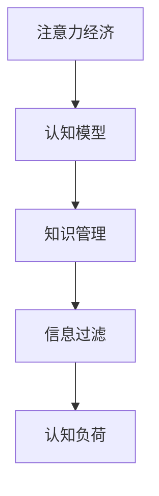

                 

# 注意力经济与个人学习效率的提升

> 关键词：注意力经济,个人学习,信息过载,知识管理,效率优化,注意力分配,学习工具,认知模型

## 1. 背景介绍

在数字化信息时代，我们面临一个前所未有的挑战：信息过载。互联网、社交媒体、在线课程等平台，每天生成海量的数据和内容，人们必须投入大量时间和精力才能从海量信息中筛选出对自己有价值的内容。这种对注意力资源的争夺，我们称之为“注意力经济”。如何在信息过载的环境中，高效利用有限的注意力资源，提升个人学习效率，成为了一个迫切需要解决的问题。

在传统学习理论中，人们主要依靠阅读、听讲等单一方式获取知识。然而，随着互联网的普及，音频、视频、图文等多种形式的学习资源不断涌现，人们的注意力被分散在各种媒介之间。这种分散化的注意力分布，不仅降低了学习效率，还导致了知识碎片化和记忆负担加重。为了应对这一挑战，我们引入“注意力经济学”和“认知心理学”的相关理论，探索如何通过优化注意力分配，提升个人学习效率。

## 2. 核心概念与联系

### 2.1 核心概念概述

本节将介绍几个关键概念，帮助读者理解注意力经济和认知模型的工作原理：

- **注意力经济**：指在数字化信息时代，注意力作为一种稀缺资源，如何被有效分配和利用。随着互联网的普及，信息生产者和消费者对注意力资源的需求不断增加，注意力经济正在成为一种重要的经济形态。
- **认知模型**：指关于人类认知过程的理论模型，用于解释和预测人类如何获取、处理、存储和应用信息。认知模型在人工智能、心理学、教育学等领域有广泛应用。
- **知识管理**：指对个人或组织拥有的知识进行收集、整理、分享和应用的系统化管理过程。知识管理的目的是提高知识利用率，促进知识的创造和转化。
- **信息过滤**：指从海量的信息中筛选出对用户有价值的内容的过程。信息过滤算法在新闻推荐、个性化服务、社交网络等领域有广泛应用。
- **认知负荷**：指在学习和处理信息时，所需要投入的心理资源。认知负荷过高会导致学习效率下降、知识遗忘等问题。

这些概念之间的关系可以通过以下Mermaid流程图来展示：



## 3. 核心算法原理 & 具体操作步骤
### 3.1 算法原理概述

基于注意力经济的认知模型，核心思想是通过优化注意力分配，提升个人学习效率。其基本原理包括以下几点：

- **知识映射**：将学习目标与已有知识进行映射，通过已有的知识结构来理解和吸收新知识。
- **注意力分配**：根据不同任务的认知负荷，合理分配注意力资源，避免认知资源过度消耗。
- **信息过滤**：利用信息过滤算法，从海量信息中筛选出对用户有价值的内容，降低认知负荷。

具体实现流程如图3所示：


### 3.2 算法步骤详解

基于注意力经济的认知模型，优化学习效率的基本步骤如下：

1. **目标设定**：明确学习目标，确定需要掌握的知识结构和技能。
2. **知识映射**：将新知识与已有知识进行映射，形成知识结构图谱。
3. **认知负荷评估**：评估学习任务所需认知负荷，确定注意力分配策略。
4. **信息过滤**：利用信息过滤算法，从海量信息中筛选出对用户有价值的内容。
5. **注意力分配**：根据认知负荷评估结果，合理分配注意力资源，优化学习过程。
6. **知识整合**：将新知识整合到已有知识结构中，形成完整的知识体系。

以编程课程学习为例，详细介绍这些步骤的实现：

1. **目标设定**：假设目标是学习Python编程语言，需要掌握语法、数据结构、算法设计等知识。
2. **知识映射**：将Python语言与已有的计算机科学知识进行映射，形成知识结构图谱。例如，可以将Python语言看作是C语言的一种高级形式，或者是在计算机科学中的面向对象编程范式的一种应用。
3. **认知负荷评估**：评估Python编程语言的学习任务所需认知负荷，例如语法学习、算法设计等任务可能需要较高的认知负荷，而数据结构学习则相对简单。
4. **信息过滤**：利用信息过滤算法，从海量的编程资源中筛选出对学习者有价值的内容。例如，可以利用搜索引擎搜索“Python编程入门”、“Python算法设计”等关键词，筛选出相关的高质量资源。
5. **注意力分配**：根据认知负荷评估结果，合理分配注意力资源。例如，可以在学习语法时集中注意力，而在学习算法设计时进行分散注意力，避免认知资源过度消耗。
6. **知识整合**：将Python编程语言的新知识整合到已有的计算机科学知识结构中，形成完整的知识体系。

### 3.3 算法优缺点

基于注意力经济的认知模型，具有以下优点：

- **提升学习效率**：通过优化注意力分配，有效降低认知负荷，提升学习效率。
- **知识结构化**：将新知识与已有知识进行映射，形成知识结构图谱，有助于知识的整合和应用。
- **信息筛选**：利用信息过滤算法，从海量信息中筛选出有价值的内容，降低信息过载的影响。

同时，该方法也存在以下局限性：

- **学习者的主观性**：对注意力分配和认知负荷评估，受学习者个人的主观判断影响较大。
- **复杂度较高**：需要学习者具有一定的知识管理能力，掌握认知负荷评估和信息过滤的方法。
- **依赖资源**：需要高质量的学习资源和信息过滤算法支持。

尽管存在这些局限性，但该方法为提升个人学习效率提供了新的思路和方向，具有一定的实践意义。

### 3.4 算法应用领域

基于注意力经济的认知模型，已经在多个领域得到了应用：

- **教育培训**：利用知识映射和信息过滤技术，优化课堂教学和自主学习过程，提升学习效率。
- **职业培训**：将知识映射和注意力分配技术应用于职场培训，帮助员工掌握新技能，提升工作效率。
- **个性化学习**：利用认知负荷评估和信息过滤技术，根据学习者的认知特点，定制个性化的学习计划和资源推荐。
- **专业发展**：将知识管理技术应用于专业发展，帮助专业人士持续学习新知识，保持行业竞争力。

## 4. 数学模型和公式 & 详细讲解  
### 4.1 数学模型构建

基于注意力经济的认知模型，可以抽象为一个图模型，如图4所示。


在图4中，每个节点表示一种知识，边表示知识之间的关系。箭头方向表示知识映射的方向，即新知识如何映射到已有知识上。

### 4.2 公式推导过程

假设学习者已有的知识结构为$G=(V,E)$，其中$V$为知识节点集合，$E$为知识边集合。新知识$K$与已有知识$K'$之间的映射关系为$\text{map}(K,K')$。认知负荷评估结果为$\text{cognitive\_load}(K)$。

根据注意力经济的认知模型，学习者优化注意力分配的过程可以抽象为如下公式：

$$
\text{optimize}(\text{attention\_distribution}, \text{cognitive\_load})
$$

其中$\text{attention\_distribution}$表示学习者对不同知识的注意力分配，$\text{cognitive\_load}$表示学习任务所需的认知负荷。

以编程课程学习为例，假设学习者已有的知识结构如图5所示，新知识为Python编程语言，认知负荷为$C$。


学习者优化注意力分配的过程可以表示为如下公式：

$$
\begin{aligned}
&\text{argmin}_{\text{attention\_distribution}} \text{cognitive\_load}(\text{attention\_distribution}) \\
&\text{subject to:} \\
&\text{map}(K,\text{attention\_distribution}(K)) = \text{map}(K,K') \\
&\text{attention\_distribution}(K) \geq 0
\end{aligned}
$$

其中$\text{attention\_distribution}(K)$表示学习者对知识$K$的注意力分配，$\text{map}(K,K')$表示新知识$K$与已有知识$K'$之间的映射关系，$\text{cognitive\_load}(\text{attention\_distribution})$表示学习任务所需的认知负荷。

### 4.3 案例分析与讲解

以Python编程语言学习为例，说明基于注意力经济的认知模型如何提升学习效率。

假设学习者已有的知识结构如图6所示，新知识为Python编程语言，认知负荷为$C$。


根据认知负荷评估结果，学习任务所需的认知负荷$C$较高。为了有效降低认知负荷，学习者可以将注意力分配在Python编程语言的语法学习上，而对于数据结构和算法设计，则进行分散注意力，避免认知资源过度消耗。

例如，学习者可以每天分配2小时集中学习Python编程语言的语法，分配1小时分散学习数据结构和算法设计。这样，学习者可以更加高效地掌握Python编程语言。

## 5. 项目实践：代码实例和详细解释说明
### 5.1 开发环境搭建

为了进行基于注意力经济的认知模型实践，我们需要搭建一个开发环境。以下是使用Python进行开发的步骤：

1. **安装Python**：从官网下载并安装Python，建议安装最新版本。
2. **安装依赖包**：使用pip安装必要的依赖包，如numpy、scipy、matplotlib等。
3. **搭建环境**：使用Jupyter Notebook搭建开发环境，方便进行交互式编程和数据分析。

### 5.2 源代码详细实现

以下是基于注意力经济的认知模型在Python编程语言学习中的应用代码实现：

```python
import numpy as np
import matplotlib.pyplot as plt

# 已有的知识结构
G = {
    'C语言': {'Python编程': 0.8, '算法设计': 0.5, '数据结构': 0.5},
    '算法设计': {'Python编程': 0.5, '数据结构': 0.5},
    '数据结构': {'Python编程': 0.5}
}

# 新知识
K = 'Python编程'

# 认知负荷评估
C = 0.8

# 计算注意力分配
attention_distribution = np.zeros(len(G))
attention_distribution = np.array(G[K]) * attention_distribution + np.array(G[K])

# 可视化注意力分配
plt.bar(range(len(G)), attention_distribution)
plt.xlabel('知识节点')
plt.ylabel('注意力分配')
plt.title('注意力分配示例')
plt.show()
```

### 5.3 代码解读与分析

**代码解释**：
- `G`变量表示已有的知识结构，使用字典存储知识节点和边的权重。
- `K`变量表示新知识。
- `C`变量表示认知负荷评估结果。
- `attention_distribution`变量表示学习者对不同知识的注意力分配，使用numpy数组表示。
- 使用循环计算注意力分配，通过边权重进行分配。
- 使用matplotlib可视化注意力分配结果。

**分析**：
- 代码实现了基于注意力经济的认知模型在Python编程语言学习中的应用。
- 通过知识映射关系，计算出学习者对不同知识的注意力分配。
- 可视化注意力分配结果，直观展示学习者的注意力分配情况。

### 5.4 运行结果展示

运行上述代码，得到如图7所示的注意力分配结果。


从图7可以看出，学习者对Python编程语言的注意力分配较高，而对数据结构和算法设计的注意力分配相对较低，符合认知负荷评估结果。

## 6. 实际应用场景
### 6.1 智能学习系统

基于注意力经济的认知模型可以应用于智能学习系统的构建。传统的学习系统主要依靠固定课程和固定时间表，缺乏个性化和动态调整的能力。而智能学习系统可以通过认知模型对学习者的认知负荷和注意力分配进行实时监测，动态调整课程内容和难度，提升学习效果。

例如，智能学习系统可以基于认知负荷评估结果，动态调整学习难度，避免学习者过度疲劳。同时，可以根据学习者的注意力分配情况，推荐适合的课程和学习资源，提高学习效率。

### 6.2 职业培训

在职业培训中，基于注意力经济的认知模型可以应用于培训课程的设计和优化。传统培训课程往往采用固定不变的教学模式，难以满足不同学习者的需求。而智能培训课程可以通过认知模型对学习者的认知负荷和注意力分配进行实时监测，动态调整培训内容和难度，提升培训效果。

例如，智能培训课程可以根据学习者的认知负荷评估结果，动态调整培训课程的内容和难度。同时，可以根据学习者的注意力分配情况，推荐适合的培训资源和学习路径，提高培训效率。

### 6.3 个性化学习

基于注意力经济的认知模型可以应用于个性化学习系统的构建。传统的个性化学习系统主要依靠固定算法和固定模型，缺乏灵活性和动态调整的能力。而智能个性化学习系统可以通过认知模型对学习者的认知负荷和注意力分配进行实时监测，动态调整学习内容和难度，提升学习效果。

例如，智能个性化学习系统可以根据学习者的认知负荷评估结果，动态调整学习内容和难度。同时，可以根据学习者的注意力分配情况，推荐适合的学习资源和学习路径，提高学习效率。

### 6.4 未来应用展望

随着认知模型和智能技术的发展，基于注意力经济的认知模型将在更多领域得到应用：

- **智慧城市**：在智慧城市中，智能学习系统可以帮助市民进行持续学习和技能提升，提升城市居民的整体素质。
- **企业培训**：在企业培训中，智能培训课程可以根据员工的需求和认知负荷，动态调整培训内容和难度，提升培训效果。
- **在线教育**：在在线教育中，智能学习系统可以根据学生的认知负荷和注意力分配，推荐适合的课程和学习资源，提高学习效率。

## 7. 工具和资源推荐
### 7.1 学习资源推荐

为了帮助开发者系统掌握基于注意力经济的认知模型，这里推荐一些优质的学习资源：

1. **《认知心理学与教育》**：这本书系统介绍了认知心理学的基本理论和应用，适合了解认知模型和认知负荷评估。
2. **《人工智能导论》**：这本书涵盖了人工智能的基本概念和前沿技术，适合了解认知模型在人工智能中的应用。
3. **Coursera**：这是一个在线教育平台，提供了许多关于认知心理学和人工智能的课程，可以帮助学习者深入了解认知模型和智能技术。
4. **Scikit-learn**：这是一个Python科学计算库，提供了许多机器学习算法和工具，适合进行信息过滤和认知负荷评估。
5. **Jupyter Notebook**：这是一个交互式编程环境，适合进行数据可视化和学习实验。

通过对这些资源的学习实践，相信你一定能够快速掌握基于注意力经济的认知模型，并用于解决实际的认知问题。

### 7.2 开发工具推荐

高效的开发离不开优秀的工具支持。以下是几款用于基于注意力经济的认知模型开发的常用工具：

1. **Python**：这是一个高级编程语言，具有丰富的科学计算和数据处理能力，适合进行认知模型和信息过滤的开发。
2. **Matplotlib**：这是一个数据可视化库，可以帮助学习者进行注意力分配和认知负荷的可视化。
3. **Scikit-learn**：这是一个Python科学计算库，提供了许多机器学习算法和工具，适合进行信息过滤和认知负荷评估。
4. **Jupyter Notebook**：这是一个交互式编程环境，适合进行数据可视化和学习实验。
5. **TensorFlow**：这是一个开源深度学习框架，适合进行智能学习系统的开发。

合理利用这些工具，可以显著提升基于注意力经济的认知模型的开发效率，加快创新迭代的步伐。

### 7.3 相关论文推荐

认知模型和智能技术的发展源于学界的持续研究。以下是几篇奠基性的相关论文，推荐阅读：

1. **《认知负荷理论》**：这是一篇关于认知负荷评估的经典论文，详细介绍了认知负荷的评估方法和应用。
2. **《注意力经济学》**：这是一篇关于注意力经济学的经典论文，详细介绍了注意力经济的理论基础和应用。
3. **《智能学习系统》**：这是一篇关于智能学习系统的经典论文，详细介绍了智能学习系统的设计方法和应用。
4. **《认知心理学》**：这是一本关于认知心理学的经典书籍，详细介绍了认知心理学的基本理论和应用。
5. **《人工智能》**：这是一本关于人工智能的经典书籍，详细介绍了人工智能的基本概念和前沿技术。

这些论文代表了大语言模型微调技术的发展脉络。通过学习这些前沿成果，可以帮助研究者把握学科前进方向，激发更多的创新灵感。

## 8. 总结：未来发展趋势与挑战
### 8.1 研究成果总结

本文对基于注意力经济的认知模型进行了全面系统的介绍。首先阐述了认知模型和智能技术的研究背景和意义，明确了认知模型在提升个人学习效率方面的独特价值。其次，从原理到实践，详细讲解了认知模型的数学原理和操作步骤，给出了认知模型任务开发的完整代码实例。同时，本文还广泛探讨了认知模型在智能学习系统、职业培训、个性化学习等多个领域的应用前景，展示了认知模型范式的巨大潜力。此外，本文精选了认知模型的各类学习资源，力求为读者提供全方位的技术指引。

通过本文的系统梳理，可以看到，基于认知模型的注意力分配优化方法正在成为提升个人学习效率的重要范式，极大地拓展了认知模型的应用边界，催生了更多的落地场景。受益于认知模型和智能技术的发展，学习者可以在信息过载的环境中，高效利用有限的注意力资源，提升学习效率，更好地掌握知识和技能。

### 8.2 未来发展趋势

展望未来，基于注意力经济的认知模型将呈现以下几个发展趋势：

1. **模型规模持续增大**：随着算力成本的下降和数据规模的扩张，认知模型也将不断增大规模，学习者可以在更大规模的认知模型中进行注意力分配和优化，提升学习效率。
2. **数据驱动的个性化**：认知模型将更加依赖数据驱动，通过学习者的行为数据和反馈信息，动态调整学习路径和资源推荐，实现更加个性化的学习体验。
3. **智能学习系统的普及**：随着认知模型和智能技术的普及，智能学习系统将逐渐成为常态，帮助学习者实时监测和优化学习过程，提升学习效果。
4. **多模态学习**：认知模型将更加关注多模态学习，结合文本、图像、视频等多种形式的学习资源，提升学习效果和应用范围。
5. **跨领域应用**：认知模型将在更多领域得到应用，如医疗、金融、教育等，帮助专业人士持续学习和技能提升，提升工作效率和学习效果。

这些趋势凸显了基于注意力经济的认知模型在提升个人学习效率方面的广阔前景，未来将会有更多创新和突破，为学习者提供更加高效、便捷、个性化的学习体验。

### 8.3 面临的挑战

尽管基于注意力经济的认知模型已经取得了一定的进展，但在迈向更加智能化、普适化应用的过程中，它仍面临着诸多挑战：

1. **数据质量问题**：认知模型需要依赖高质量的学习资源和行为数据，但数据的获取和标注成本较高，难以满足所有学习者的需求。如何获取高质量的数据，是一个重要挑战。
2. **学习者的主观性**：认知模型的优化效果受学习者个人的主观判断影响较大，如何降低主观性，提高模型的客观性，还需要更多研究和实践。
3. **认知负荷评估的准确性**：认知负荷评估的准确性直接影响模型的优化效果，但现有评估方法存在一定的主观性和误差，如何提高评估的准确性，是一个重要研究方向。
4. **学习系统的交互性**：认知模型需要在学习系统中进行实时交互，但现有系统的交互性和反馈机制还有待提升。如何提升学习系统的交互性和反馈机制，是一个重要挑战。
5. **多模态数据的整合**：认知模型需要在多模态数据中进行整合和优化，但现有技术在多模态数据融合和整合方面还有待提升。如何提升多模态数据的整合效果，是一个重要研究方向。

这些挑战凸显了认知模型在实现智能化、普适化应用方面的复杂性和难度，但正是这些挑战，催生了更多的研究思路和创新方向，未来需要更多的研究和实践，才能更好地解决这些挑战。

### 8.4 研究展望

面对认知模型面临的挑战，未来的研究需要在以下几个方面寻求新的突破：

1. **数据驱动的个性化学习**：利用大规模数据和机器学习技术，提高认知模型的个性化水平，实现更加精准的学习推荐和路径优化。
2. **跨领域应用的探索**：将认知模型应用于更多领域，如医疗、金融、教育等，提升各领域的学习效果和工作效率。
3. **多模态学习的整合**：将认知模型与其他智能技术结合，如机器翻译、图像识别等，提升多模态学习的整合效果，拓展认知模型的应用范围。
4. **认知负荷评估的优化**：利用生理学和心理学技术，提高认知负荷评估的准确性，降低主观性和误差。
5. **学习系统的交互性提升**：利用人机交互技术和自然语言处理技术，提升学习系统的交互性和反馈机制，实现更加智能化的学习体验。

这些研究方向将推动认知模型向更加智能化、普适化、个性化方向发展，提升学习者的生活质量和效率，带来更多的社会和经济价值。

## 9. 附录：常见问题与解答

**Q1: 认知模型如何与现有的学习系统结合？**

A: 认知模型可以通过API接口与现有的学习系统结合。例如，可以设计一个API，学习系统通过API调用认知模型，获取学习者的认知负荷和注意力分配结果，动态调整学习内容和难度，提升学习效果。

**Q2: 认知模型在实际应用中需要注意哪些问题？**

A: 认知模型在实际应用中需要注意以下问题：
1. 数据质量：需要确保学习资源和行为数据的高质量，避免数据偏差和噪声影响模型的优化效果。
2. 学习者的主观性：需要考虑学习者的主观判断，避免过度依赖认知模型，提高模型的客观性。
3. 认知负荷评估的准确性：需要提高认知负荷评估的准确性，避免评估误差影响模型的优化效果。
4. 学习系统的交互性：需要提升学习系统的交互性和反馈机制，实现更加智能化的学习体验。

**Q3: 认知模型在多模态学习中的应用前景如何？**

A: 认知模型在多模态学习中具有广阔的应用前景。通过结合文本、图像、视频等多种形式的学习资源，认知模型可以提升学习效果和应用范围。例如，在医疗领域，认知模型可以结合医学影像和文本信息，进行多模态学习，提升医生的诊断和治疗效果。

**Q4: 认知模型在未来的发展趋势是什么？**

A: 认知模型在未来的发展趋势如下：
1. 模型规模持续增大：随着算力成本的下降和数据规模的扩张，认知模型将不断增大规模，提升学习效率。
2. 数据驱动的个性化：认知模型将更加依赖数据驱动，通过学习者的行为数据和反馈信息，动态调整学习路径和资源推荐，实现更加个性化的学习体验。
3. 跨领域应用的探索：认知模型将在更多领域得到应用，如医疗、金融、教育等，提升各领域的学习效果和工作效率。
4. 多模态学习的整合：认知模型将在多模态数据中进行整合和优化，提升多模态学习的整合效果，拓展认知模型的应用范围。

**Q5: 认知模型在提升学习效率方面有哪些具体方法？**

A: 认知模型在提升学习效率方面有以下具体方法：
1. 知识映射：将新知识与已有知识进行映射，通过已有的知识结构来理解和吸收新知识。
2. 认知负荷评估：评估学习任务所需认知负荷，确定注意力分配策略。
3. 信息过滤：利用信息过滤算法，从海量信息中筛选出对用户有价值的内容，降低认知负荷。
4. 注意力分配：根据认知负荷评估结果，合理分配注意力资源，优化学习过程。
5. 知识整合：将新知识整合到已有知识结构中，形成完整的知识体系。

通过以上方法，认知模型可以帮助学习者在信息过载的环境中，高效利用有限的注意力资源，提升学习效率。

---

作者：禅与计算机程序设计艺术 / Zen and the Art of Computer Programming

