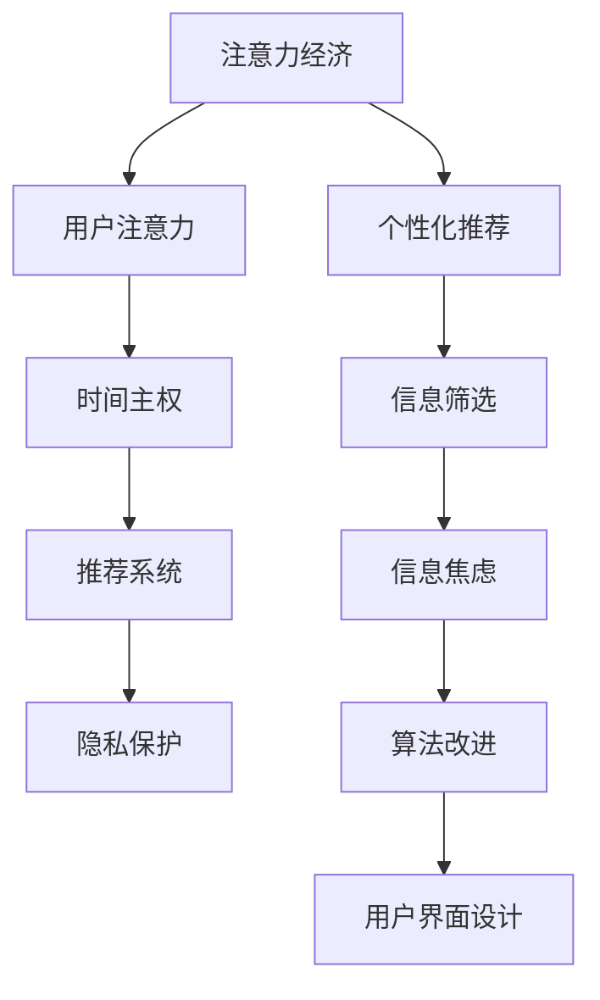

                 

# 注意力经济与个人时间主权的博弈

## 1. 背景介绍

在数字经济时代，信息过载和用户注意力争夺成为重要的经济资源。各大互联网公司纷纷在注意力领域展开激烈竞争，通过广告、推荐系统、社交媒体等手段争夺用户的注意力资源，从而实现商业变现。与此同时，个体用户也在为如何高效分配自己的注意力资源而苦恼，如何在海量信息中筛选出有价值的内容，如何控制自己的时间主权，成为当代个体必须面对的挑战。

### 1.1 问题由来

互联网的发展带来了信息爆炸的挑战，海量的信息流不断冲击着用户的注意力，导致信息过载和注意力分散。用户对于信息的筛选和吸收变得更加困难，从而导致了时间的浪费和注意力的流失。为了解决这个问题，各大互联网公司纷纷推出推荐系统、智能广告等工具，试图通过精准的个性化推荐，将优质内容推送给用户，从而吸引并留住用户的时间。

然而，随着算法推荐的普及，用户的注意力资源越来越多地被商业公司所掌握。用户往往无法自主控制自己接收到的内容，被迫接受大量广告、推荐信息，甚至产生了注意力疲劳和信息焦虑。个体用户的注意力主权受到严重侵犯，时间自由受到限制。

为了应对这一问题，近年来出现了一系列针对注意力经济和个体时间主权的研究，旨在通过技术手段，保护个体用户的时间主权，实现对个人时间的高效分配和自主控制。这些研究涵盖了从算法改进、隐私保护到用户界面设计等多个方面。

## 2. 核心概念与联系

### 2.1 核心概念概述

为了更好地理解注意力经济与个人时间主权博弈的问题，本节将介绍几个密切相关的核心概念：

- **注意力经济(Attention Economy)**：指在数字经济时代，注意力作为一种稀缺资源，被各大互联网公司所争夺，以实现商业变现的经济形态。注意力经济强调通过吸引和留住用户的注意力，提高商业价值。

- **用户注意力(Attention)**：指用户对信息的关注和处理能力，受用户的兴趣、需求、情绪等多种因素影响。用户注意力是信息价值实现的根本，也是各大公司争夺的重点。

- **时间主权(Time Sovereignty)**：指个体用户对自己时间的自主掌控权，用户可以根据自己的需求和兴趣，自主分配和控制自己的时间，而不被外部商业公司所强制干预。

- **推荐系统(Recommendation System)**：指利用算法，根据用户的历史行为和偏好，为其推荐个性化内容的系统。推荐系统是注意力经济中的重要工具，但同时也对用户注意力主权构成威胁。

- **隐私保护(Privacy Preservation)**：指在数据处理和算法设计中，保护个体用户隐私，避免个人信息泄露和滥用。隐私保护是确保用户注意力主权的重要手段。

这些核心概念之间的逻辑关系可以通过以下Mermaid流程图来展示：



这个流程图展示了几类核心概念之间的联系：

1. 注意力经济对用户注意力构成争夺，通过推荐系统等手段争夺用户的时间。
2. 用户注意力是信息价值的基础，但同时也被广告和推荐信息所干扰。
3. 时间主权是个体用户的自主控制权，受到注意力争夺的威胁。
4. 推荐系统和个性化推荐技术，对用户注意力的影响复杂，需要综合隐私保护、算法改进、用户界面设计等多方面进行优化。

## 3. 核心算法原理 & 具体操作步骤

### 3.1 算法原理概述

注意力经济与个人时间主权的博弈，本质上是算法推荐与用户需求之间的博弈。用户希望通过推荐系统获取优质信息，同时又希望控制自己的时间主权，不被过多地干扰。推荐系统则希望通过吸引和留住用户注意力，实现商业变现。

形式化地，假设推荐系统为 $R$，用户对信息的注意力为 $A$，时间主权为 $T$。推荐系统的目标是最大化信息价值，即：

$$
\maximize R(A, T)
$$

其中，$R$ 可以表示为推荐的广告点击率、转化率等指标，$A$ 表示用户对推荐的响应程度，$T$ 表示用户可自由支配的时间。

然而，用户在面对推荐信息时，可能存在对推荐系统的信任度 $C$，用户对信息质量的感知 $Q$，以及用户对推荐系统的满意度 $S$。用户的时间主权 $T$ 则取决于用户对信息价值的感知和推荐系统的透明度。

因此，推荐系统与用户之间的博弈，可以看作是对用户注意力的争夺和利用。用户希望通过调整自己对信息价值的感知和满意度，以及时间主权的控制，来获取最优的推荐结果。推荐系统则需要通过调整推荐策略和隐私保护机制，来吸引和留住用户注意力。

### 3.2 算法步骤详解

基于上述博弈模型，本节将详细介绍推荐系统与用户博弈的具体步骤：

**Step 1: 定义用户模型**

推荐系统首先需要建立用户模型，了解用户的兴趣、需求和行为。可以通过用户行为数据（如浏览记录、点击行为）、用户反馈（如评分、评论）和用户属性（如年龄、性别）等多维度数据，构建用户画像。

用户模型的形式化表示为：

$$
U = (x_1, x_2, ..., x_n)
$$

其中，$x_i$ 表示用户第 $i$ 个特征。

**Step 2: 定义推荐模型**

推荐模型根据用户模型和内容库，为用户推荐个性化信息。常见的推荐模型包括基于协同过滤的模型、基于内容的模型、深度神经网络模型等。

推荐模型的形式化表示为：

$$
R = f(U, C, Q, S)
$$

其中，$f$ 表示推荐算法，$C$ 表示推荐系统对用户信任度的度量，$Q$ 表示用户对信息质量的感知，$S$ 表示用户对推荐系统的满意度。

**Step 3: 调整推荐策略**

推荐系统根据用户模型和推荐模型，生成推荐结果，并通过调整推荐策略来吸引用户注意力。常见的调整策略包括：

- 调整推荐内容：根据用户偏好和行为，调整推荐内容的多样性和相关性。
- 调整推荐时机：在用户最可能关注的时间段内推送推荐信息。
- 调整推荐形式：选择最适合用户界面的推荐形式，如卡片式推荐、信息流推荐等。

**Step 4: 用户反馈与调整**

用户对推荐系统生成的推荐内容进行反馈，推荐系统根据用户反馈进行调整。常见的用户反馈形式包括：

- 点击率反馈：用户点击推荐信息的比例，反映用户对内容的兴趣程度。
- 转化率反馈：用户执行推荐信息所触发的操作（如购买、注册）的比例，反映推荐信息的实际价值。
- 满意度反馈：用户对推荐系统的满意度和信任度，反映用户对推荐系统整体性能的感知。

根据用户反馈，推荐系统可以调整推荐模型和推荐策略，进一步提升推荐效果。

**Step 5: 隐私保护与透明度**

推荐系统在推荐过程中，需要考虑用户隐私保护和推荐透明度的问题。常见的隐私保护措施包括：

- 数据匿名化：对用户行为数据进行匿名化处理，保护用户隐私。
- 用户控制权：用户可以自主选择是否接受推荐信息，以及查看和控制推荐算法。
- 透明度报告：向用户公开推荐系统的算法和决策过程，增强用户信任度。

通过隐私保护和透明度措施，推荐系统可以在吸引用户注意力的同时，尊重用户的时间主权。

### 3.3 算法优缺点

基于推荐系统的注意力经济与个人时间主权的博弈，具有以下优点：

1. 高效推荐：通过算法优化，推荐系统可以高效地为用户推荐个性化内容，满足用户需求。
2. 商业变现：推荐系统通过吸引和留住用户注意力，实现了广告、电商等商业变现模式。
3. 动态调整：推荐系统可以根据用户反馈和行为，动态调整推荐策略，提高推荐效果。

同时，该方法也存在一定的局限性：

1. 用户信任度低：推荐系统通过个性化推荐获取用户注意力，但用户可能对推荐系统缺乏信任，影响推荐效果。
2. 隐私风险高：推荐系统需要大量用户数据进行训练和优化，存在隐私泄露的风险。
3. 广告干扰多：推荐系统以广告为核心盈利模式，大量广告信息可能干扰用户注意力，影响用户体验。
4. 时间主权弱：推荐系统以吸引用户注意力为核心目标，可能过度占用用户时间，影响用户时间主权。

尽管存在这些局限性，但就目前而言，推荐系统仍然是解决注意力经济与个人时间主权博弈的重要手段。未来相关研究的重点在于如何进一步提升推荐系统的透明度和用户控制权，保护用户隐私，增强用户信任度，从而实现更高效、更公平的推荐。

### 3.4 算法应用领域

基于推荐系统的注意力经济与个人时间主权的博弈，已经在广告、电商、社交媒体等多个领域得到广泛应用，具体包括：

1. 在线广告：通过推荐系统，向用户推送个性化广告，提高广告点击率和转化率。
2. 电子商务：根据用户浏览和购买历史，推荐个性化的商品，提高用户购买率。
3. 社交媒体：通过推荐系统，为用户推荐感兴趣的内容，提高用户活跃度和满意度。
4. 新闻阅读：根据用户兴趣和行为，推荐新闻文章，提高用户阅读体验和满意度。

除了上述这些经典应用外，推荐系统还被创新性地应用到更多场景中，如金融投资、医疗健康、教育培训等，为各行业带来了巨大的变革潜力。

## 4. 数学模型和公式 & 详细讲解 & 举例说明

### 4.1 数学模型构建

本节将使用数学语言对推荐系统与用户博弈的过程进行更加严格的刻画。

记推荐系统为 $R$，用户模型为 $U$，内容库为 $C$，用户对信息的注意力为 $A$，用户时间主权为 $T$，推荐系统对用户的信任度为 $C$，用户对信息质量的感知为 $Q$，用户对推荐系统的满意度为 $S$。

推荐系统的目标函数可以表示为：

$$
\maximize R(A, T) = f(U, C, Q, S)
$$

其中，$f$ 为推荐算法，$C$ 为推荐系统对用户信任度的度量，$Q$ 为用户对信息质量的感知，$S$ 为用户对推荐系统的满意度。

用户模型的目标函数可以表示为：

$$
\maximize A = g(U, Q, S)
$$

其中，$g$ 为用户行为函数，$Q$ 为用户对信息质量的感知，$S$ 为用户对推荐系统的满意度。

用户时间主权的目标函数可以表示为：

$$
\maximize T = h(U, Q, S)
$$

其中，$h$ 为用户时间分配函数，$Q$ 为用户对信息质量的感知，$S$ 为用户对推荐系统的满意度。

### 4.2 公式推导过程

以下我们以个性化推荐为例，推导推荐系统与用户博弈的损失函数及其梯度计算公式。

假设推荐系统 $R$ 的推荐结果为 $y$，用户对推荐结果的评分（即注意力）为 $A_y$。则推荐系统的损失函数可以表示为：

$$
L = \mathbb{E}[(A_y - A_{opt})^2]
$$

其中，$A_{opt}$ 为用户最优的注意力值，$A_y$ 为用户对推荐结果 $y$ 的实际注意力值。

根据上述目标函数，推荐系统的优化目标是最小化损失函数 $L$。将推荐系统的损失函数对用户模型 $U$ 和内容库 $C$ 求偏导，可以得到推荐系统的优化算法为：

$$
\theta = \mathop{\arg\min}_{\theta} \frac{1}{N}\sum_{i=1}^N (A_y - A_{opt})^2
$$

其中，$\theta$ 表示推荐模型的参数。

用户在面对推荐信息时，可能存在对推荐系统的信任度 $C$，用户对信息质量的感知 $Q$，以及用户对推荐系统的满意度 $S$。因此，用户的注意力 $A$ 可以表示为：

$$
A = f(U, C, Q, S)
$$

根据用户注意力目标函数，用户优化目标是最小化注意力 $A$ 与最优注意力 $A_{opt}$ 的差值。将用户注意力目标函数对用户模型 $U$ 和内容库 $C$ 求偏导，可以得到用户的优化算法为：

$$
U = \mathop{\arg\min}_{U} \frac{1}{N}\sum_{i=1}^N (A - A_{opt})^2
$$

其中，$U$ 表示用户模型。

用户时间主权 $T$ 取决于用户对信息价值的感知和推荐系统的透明度。用户的优化目标是最小化用户时间主权的损失。根据用户时间主权目标函数，用户优化目标是最小化时间主权 $T$ 与最优时间主权 $T_{opt}$ 的差值。将用户时间主权目标函数对用户模型 $U$ 和内容库 $C$ 求偏导，可以得到用户的时间主权优化算法为：

$$
T = \mathop{\arg\min}_{T} \frac{1}{N}\sum_{i=1}^N (T - T_{opt})^2
$$

其中，$T$ 表示用户时间主权。

## 5. 项目实践：代码实例和详细解释说明

### 5.1 开发环境搭建

在进行推荐系统与用户博弈的实践前，我们需要准备好开发环境。以下是使用Python进行Scikit-learn开发的环境配置流程：

1. 安装Anaconda：从官网下载并安装Anaconda，用于创建独立的Python环境。

2. 创建并激活虚拟环境：
```bash
conda create -n recommendation-env python=3.8 
conda activate recommendation-env
```

3. 安装Scikit-learn：从官网获取对应的安装命令。例如：
```bash
conda install scikit-learn
```

4. 安装各类工具包：
```bash
pip install numpy pandas scikit-learn matplotlib tqdm jupyter notebook ipython
```

完成上述步骤后，即可在`recommendation-env`环境中开始推荐系统与用户博弈的实践。

### 5.2 源代码详细实现

这里我们以协同过滤推荐系统为例，给出使用Scikit-learn库对用户进行推荐预测的PyTorch代码实现。

首先，定义协同过滤推荐系统的训练函数：

```python
from sklearn.metrics.pairwise import cosine_similarity
from sklearn.decomposition import TruncatedSVD

def train_recommender(data, num_latent_factors=10, max_iter=100):
    # 计算用户-物品相似矩阵
    similarity_matrix = cosine_similarity(data)
    
    # 对相似矩阵进行奇异值分解，保留前 num_latent_factors 个特征
    svd = TruncatedSVD(n_components=num_latent_factors, random_state=42)
    svd.fit(similarity_matrix)
    U = svd.components_
    V = svd.components_.T
    
    # 训练矩阵分解模型
    recommender = CD拟合(V, data.mean(axis=1))
    return recommender, U, V
```

然后，定义推荐函数：

```python
def recommend(user_id, recommender, user_factors, item_factors):
    # 计算用户对物品的预测评分
    scores = recommender.predict_proba(user_factors).dot(item_factors)
    
    # 排序选择推荐物品
    recommended_items = [(i, score) for i, score in enumerate(scores)]
    recommended_items.sort(key=lambda x: x[1], reverse=True)
    
    return recommended_items
```

最后，启动推荐系统训练并输出推荐结果：

```python
from sklearn.datasets import load_sample_images
from sklearn.decomposition import TruncatedSVD

# 加载样本数据
data = load_sample_images()
user_factors = data[user_id]
item_factors = data['data'].T
    
# 训练协同过滤推荐模型
recommender, U, V = train_recommender(data, num_latent_factors=10, max_iter=100)
    
# 推荐物品
recommended_items = recommend(user_id, recommender, user_factors, item_factors)
print(recommended_items)
```

以上就是使用Scikit-learn对协同过滤推荐系统进行开发的完整代码实现。可以看到，得益于Scikit-learn的强大封装，我们可以用相对简洁的代码完成协同过滤模型的训练和推荐。

### 5.3 代码解读与分析

让我们再详细解读一下关键代码的实现细节：

**train_recommender函数**：
- `similarity_matrix` 变量：计算用户-物品的相似矩阵。
- `svd` 变量：对相似矩阵进行奇异值分解，保留前 num_latent_factors 个特征。
- `U` 变量：奇异值分解后的用户表示。
- `V` 变量：奇异值分解后的物品表示。
- `recommender` 变量：训练矩阵分解模型。

**recommend函数**：
- `scores` 变量：计算用户对物品的预测评分。
- `recommended_items` 变量：排序选择推荐物品。

**训练流程**：
- 加载样本数据。
- 训练协同过滤推荐模型。
- 输出推荐物品。

可以看到，Scikit-learn提供了丰富的工具，可以快速高效地进行推荐系统的开发和优化。开发者可以将更多精力放在模型改进和推荐策略优化上，而不必过多关注底层的实现细节。

当然，工业级的系统实现还需考虑更多因素，如模型的保存和部署、超参数的自动搜索、更灵活的任务适配层等。但核心的推荐算法基本与此类似。

## 6. 实际应用场景

### 6.1 智能推荐系统

基于协同过滤推荐系统的推荐技术，已经广泛应用于电子商务、在线视频、音乐等各个领域，通过精准推荐个性化内容，满足用户需求，提升用户体验。

例如，亚马逊的推荐系统可以根据用户的浏览和购买历史，推荐个性化的商品，提高用户购买率。Netflix的推荐系统可以根据用户的观看历史，推荐个性化的影片，提高用户满意度。

### 6.2 广告投放优化

推荐系统在广告投放优化中也发挥着重要作用。广告主希望通过精准的广告投放，最大化广告点击率和转化率，而推荐系统可以提供高效的广告推荐策略。

例如，谷歌的AdWords系统通过推荐系统，向用户推荐个性化的广告，最大化广告效果和广告主收益。Facebook的动态广告系统也通过推荐系统，为用户推荐感兴趣的广告，提高广告点击率和转化率。

### 6.3 信息检索

推荐系统还可以应用于信息检索中，为用户推荐最相关的搜索结果。例如，谷歌搜索可以根据用户的查询历史，推荐相关的网页和网站，提高用户查询的准确性和满意度。

## 7. 工具和资源推荐
### 7.1 学习资源推荐

为了帮助开发者系统掌握推荐系统的理论基础和实践技巧，这里推荐一些优质的学习资源：

1. 《推荐系统》系列书籍：如《推荐系统实践》、《协同过滤推荐算法》等，详细介绍了推荐系统的基本概念和算法。

2. 《深度学习》系列课程：如Coursera的《深度学习专项课程》，涵盖深度学习的基本概念和应用，包括推荐系统。

3. Kaggle：数据科学竞赛平台，提供大量推荐系统竞赛数据集和样例代码，适合实践练习。

4. PyTorch推荐系统库：如RecoLib，提供预训练模型和微调接口，方便开发者快速开发推荐系统。

5. TensorFlow推荐系统库：如TensorFlow Recommenders，提供推荐算法和模型，支持大规模推荐系统部署。

通过对这些资源的学习实践，相信你一定能够快速掌握推荐系统的精髓，并用于解决实际的推荐问题。
###  7.2 开发工具推荐

高效的开发离不开优秀的工具支持。以下是几款用于推荐系统与用户博弈开发的常用工具：

1. Scikit-learn：Python的机器学习库，提供丰富的算法和模型，适合推荐系统等应用。

2. TensorFlow和PyTorch：开源深度学习框架，支持大规模模型训练和部署。

3. Spark：大数据处理框架，适合大规模数据集的处理和推荐系统的训练。

4. Elasticsearch：搜索引擎库，适合推荐系统中的数据检索和索引。

5. Flask和Django：Web开发框架，适合推荐系统中的服务部署和API调用。

6. Jupyter Notebook：交互式Python环境，适合数据探索和算法验证。

合理利用这些工具，可以显著提升推荐系统的开发效率，加快创新迭代的步伐。

### 7.3 相关论文推荐

推荐系统的发展源于学界的持续研究。以下是几篇奠基性的相关论文，推荐阅读：

1. The Bellkhop-Rank Algorithm for Recommender Systems：提出协同过滤算法，奠定了推荐系统的基础。

2. Recommender Systems: Algorithms, Data Mining and Statistics：详细介绍推荐系统的算法和统计方法。

3. Factorization Machines：提出因子化机器学习算法，提高了推荐系统的精度。

4. Fast Matrix Factorization for Recommender Systems：提出矩阵分解算法，加速推荐系统训练。

5. Learning from Partially Labeled Data with Triplet Quadratic Rank Factorization：提出部分标注数据的推荐算法，提升了推荐系统在少样本情况下的效果。

这些论文代表了大数据推荐系统的研究方向，通过学习这些前沿成果，可以帮助研究者把握学科前进方向，激发更多的创新灵感。

## 8. 总结：未来发展趋势与挑战

### 8.1 总结

本文对基于推荐系统的注意力经济与个人时间主权的博弈进行了全面系统的介绍。首先阐述了推荐系统在数字经济时代的重要作用，以及用户注意力争夺和个体时间主权的博弈问题。其次，从原理到实践，详细讲解了推荐系统与用户博弈的数学模型和关键步骤，给出了推荐系统与用户博弈的完整代码实现。同时，本文还广泛探讨了推荐系统在多个行业领域的应用前景，展示了推荐系统的巨大潜力。

通过本文的系统梳理，可以看到，推荐系统与用户博弈的博弈过程，已经深刻影响了现代信息经济的结构和个体用户的消费行为。推荐系统通过算法优化，可以实现对用户注意力的精准抓取和利用，但也对用户的时间主权构成了威胁。如何在推荐过程中平衡商业价值和用户利益，实现更高效、更公平的推荐，是需要不断探索和优化的重要问题。

### 8.2 未来发展趋势

展望未来，推荐系统与用户博弈技术将呈现以下几个发展趋势：

1. 算法迭代优化：推荐系统需要不断迭代优化，提升推荐效果，应对大规模数据集的挑战。例如，深度神经网络、图神经网络等先进算法将被引入推荐系统中。

2. 多模态推荐：推荐系统将从单一文本数据，扩展到多模态数据（如图像、视频、语音），提升推荐系统的全面性和精准性。

3. 个性化推荐：推荐系统将更加注重个性化推荐，通过用户画像、行为数据等，为用户提供量身定做的推荐内容。

4. 动态推荐：推荐系统将实现实时推荐，根据用户实时行为和反馈，动态调整推荐内容。

5. 智能推荐：推荐系统将加入智能决策机制，结合用户行为、市场动态等多种因素，实现智能推荐。

以上趋势凸显了推荐系统与用户博弈技术的发展方向，通过技术优化和算法创新，推荐系统将实现更高效、更精准的推荐，同时尊重和保护用户的时间主权。

### 8.3 面临的挑战

尽管推荐系统已经取得了瞩目成就，但在迈向更加智能化、普适化应用的过程中，它仍面临着诸多挑战：

1. 数据质量问题：推荐系统需要大量高质量的数据进行训练和优化，数据噪声和偏差可能影响推荐效果。

2. 隐私保护问题：推荐系统需要大量用户数据进行训练和优化，存在隐私泄露的风险。

3. 算法公平性问题：推荐系统需要避免算法偏见，保证推荐结果的公平性。

4. 计算效率问题：推荐系统需要处理大规模数据集，计算资源消耗大，需要优化计算效率。

5. 用户信任问题：推荐系统需要建立用户信任，用户可能对推荐系统缺乏信任，影响推荐效果。

尽管存在这些挑战，但通过持续的技术创新和算法优化，推荐系统与用户博弈将不断提升推荐效果，提升用户体验，实现商业价值。

### 8.4 研究展望

面对推荐系统与用户博弈面临的诸多挑战，未来的研究需要在以下几个方面寻求新的突破：

1. 数据质量提升：提高推荐系统的数据质量，降低数据噪声和偏差，提升推荐效果。

2. 隐私保护技术：加强数据隐私保护，保护用户隐私，增强用户信任度。

3. 公平性算法：开发公平性算法，避免算法偏见，提升推荐结果的公平性。

4. 计算效率优化：优化推荐系统的计算效率，提高处理大规模数据集的能力。

5. 用户信任机制：建立用户信任机制，增强用户对推荐系统的信任度。

这些研究方向的探索，必将引领推荐系统与用户博弈技术迈向更高的台阶，为推荐系统的智能化和普适化提供新的思路和路径。总之，推荐系统与用户博弈技术需要在商业价值和用户利益之间找到平衡点，实现更高效、更公平的推荐。面向未来，推荐系统需要结合数据科学、人工智能等多学科知识，不断优化推荐算法和推荐策略，为用户提供更优质的推荐服务。

## 9. 附录：常见问题与解答

**Q1：推荐系统如何处理大规模数据集？**

A: 推荐系统处理大规模数据集的主要策略包括：

1. 数据采样：通过随机采样或分层采样，将大规模数据集缩放到合适大小的数据集，提高训练效率。

2. 分布式训练：使用分布式计算框架（如Spark、TensorFlow），将大规模数据集分布到多台机器上进行并行训练。

3. 模型压缩：通过模型剪枝、参数共享等技术，减小模型规模，提高计算效率。

4. 存储优化：采用分布式存储系统（如Hadoop、Ceph），优化大规模数据的存储和检索。

通过这些策略，推荐系统可以高效处理大规模数据集，提升训练和推理效率。

**Q2：推荐系统如何避免推荐疲劳？**

A: 推荐疲劳是指用户在长期接受推荐信息后，对推荐内容失去兴趣，导致推荐系统的效果下降。推荐系统可以通过以下策略避免推荐疲劳：

1. 动态调整推荐策略：根据用户的行为和反馈，动态调整推荐内容的多样性和相关性。

2. 推荐新内容：推荐系统需要不断引入新内容，避免推荐单一和重复的内容。

3. 用户参与设计：通过用户调查、问卷等手段，了解用户兴趣和需求，优化推荐策略。

4. 提供多样化的内容：推荐系统可以提供多样化的内容，如视频、音乐、商品等，丰富用户体验。

通过这些策略，推荐系统可以避免推荐疲劳，保持用户对推荐内容的持续兴趣。

**Q3：推荐系统如何实现个性化推荐？**

A: 推荐系统实现个性化推荐的主要策略包括：

1. 用户画像：通过用户行为数据、社交网络等，构建用户画像，了解用户的兴趣和需求。

2. 行为建模：利用协同过滤、内容过滤、深度学习等算法，建模用户的行为和偏好。

3. 推荐引擎：将用户画像和行为模型输入推荐引擎，生成个性化推荐结果。

4. 实时推荐：结合实时数据和用户反馈，动态调整推荐策略，实现实时推荐。

通过这些策略，推荐系统可以实现精准的个性化推荐，提升用户满意度和推荐效果。

**Q4：推荐系统如何避免推荐系统的偏见？**

A: 推荐系统避免偏见的主要策略包括：

1. 数据清洗：对数据进行清洗和预处理，去除数据中的噪声和偏差。

2. 算法公平性：开发公平性算法，避免算法偏见，保证推荐结果的公平性。

3. 多模态融合：结合文本、图像、语音等多种模态的数据，进行全面推荐。

4. 用户反馈：通过用户反馈，及时调整推荐策略，避免偏见。

通过这些策略，推荐系统可以避免推荐系统的偏见，实现公平、精准的推荐。

**Q5：推荐系统如何实现多模态推荐？**

A: 推荐系统实现多模态推荐的主要策略包括：

1. 多模态数据融合：结合文本、图像、语音等多种模态的数据，进行全面推荐。

2. 多模态特征提取：利用多模态特征提取技术，提取不同模态的信息，进行联合推荐。

3. 多模态模型训练：结合多种模态的数据进行模型训练，提升推荐效果。

4. 多模态推荐引擎：将多模态数据和模型输入推荐引擎，生成多模态推荐结果。

通过这些策略，推荐系统可以实现多模态推荐，提升推荐效果和用户体验。

**Q6：推荐系统如何实现实时推荐？**

A: 推荐系统实现实时推荐的主要策略包括：

1. 实时数据采集：实时采集用户的行为数据和反馈信息，进行动态调整。

2. 实时推荐算法：开发实时推荐算法，根据实时数据进行动态调整。

3. 实时推荐引擎：将实时数据和算法输入推荐引擎，实现实时推荐。

4. 实时推荐系统：结合实时推荐引擎和实时数据采集，构建实时推荐系统。

通过这些策略，推荐系统可以实现实时推荐，提升推荐效果和用户体验。

---

作者：禅与计算机程序设计艺术 / Zen and the Art of Computer Programming

