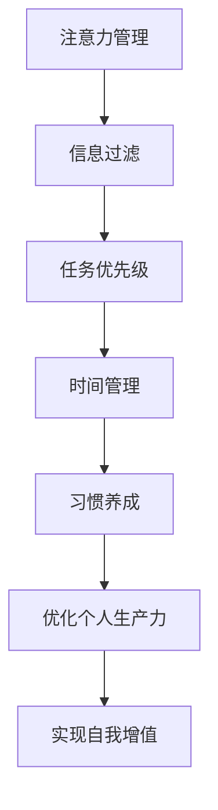

                 

# 注意力经济与个人时间管理的艺术

在数字化时代，注意力成为了最稀缺的经济资源。随着信息爆炸和互联网的普及，人们每天被大量无用的噪音干扰，难以集中精力进行有价值的活动。如何在有限的时间里，提高注意力管理能力，优化个人生产力，成为每个人都需要深思熟虑的问题。

本文将围绕注意力经济与个人时间管理，深入探讨其核心概念、原理及具体操作步骤，并通过具体案例分析，提出切实可行的优化策略。通过学习本文，你将掌握提升个人时间管理能力的关键方法，从而在数字化时代中更好地掌控自我。

## 1. 背景介绍

### 1.1 问题由来

在现代社会，人们获取信息的方式越来越便捷，但信息量之多也让人们难以承受。许多人在网络上花费大量时间，却并没有得到实质性的收益。这种情况下，注意力经济应运而生，旨在通过提升个人注意力管理能力，有效过滤信息噪音，提升个人生产力。

### 1.2 问题核心关键点

注意力经济的核心在于如何最大化地利用个人的注意力资源。在有限的注意力资源下，如何高效筛选和利用信息，进行有价值的活动，是提升个人生产力、实现自我增值的关键。

通过科学的时间管理，可以帮助个人提高注意力集中度，从而更好地完成任务，实现个人目标。但在实际应用中，时间管理并不是一项简单的任务，需要系统化的方法和工具。本文将从多个角度探讨个人时间管理，提供全面的实践指导。

## 2. 核心概念与联系

### 2.1 核心概念概述

注意力经济和个人时间管理紧密相连，以下是几个核心概念：

- **注意力管理**：通过科学的方法和工具，对个人的注意力资源进行有效管理，避免信息噪音干扰，提升集中精力的能力。
- **时间管理**：系统化地安排和管理时间，优化时间利用率，提高个人生产效率。
- **信息过滤**：利用算法和工具，对海量的信息进行筛选和分类，提取有价值的内容，减少无用信息的干扰。
- **任务优先级**：根据任务的紧急程度和重要性，进行优先级排序，合理安排时间。
- **习惯养成**：通过建立良好的习惯，自动化地执行高价值活动，提升效率。

这些概念通过合理的组合，可以构建一个有效的个人时间管理框架，帮助个体在信息爆炸的时代中，保持专注和高效。

### 2.2 核心概念原理和架构的 Mermaid 流程图(Mermaid 流程节点中不要有括号、逗号等特殊字符)



### 2.3 核心概念之间的联系

注意力管理是个人时间管理的基础。通过有效的信息过滤和任务优先级安排，将注意力集中在最重要的活动上。优化的时间管理能够保证高价值活动的有序执行，而良好的习惯养成则能进一步自动化执行高价值活动，形成良性循环，最终实现个人生产力的提升和自我增值。

## 3. 核心算法原理 & 具体操作步骤

### 3.1 算法原理概述

个人时间管理的核心算法包括：信息过滤、任务优先级排序、时间块划分、习惯养成等。这些算法通过算法步骤，实现对个人注意力和时间的系统化管理。

### 3.2 算法步骤详解

#### 3.2.1 信息过滤

信息过滤的核心在于识别和提取有价值的信息，减少无用信息的干扰。常用的方法包括：

1. **内容筛选**：使用算法工具，对内容进行关键词匹配、主题分类，筛选出与个人目标相关的高价值信息。
2. **人工审核**：根据个人知识和经验，对信息进行审核，过滤掉不准确或有偏见的内容。
3. **定期清理**：定期清理不相关或已过时的信息，保持信息库的整洁。

#### 3.2.2 任务优先级排序

任务优先级排序的核心在于将任务按重要性和紧急程度进行分类，合理安排时间。常用的方法包括：

1. **艾森豪威尔矩阵**：将任务分为四类：重要且紧急、重要不紧急、紧急不重要、不紧急不重要，优先处理重要且紧急的任务。
2. **四象限法**：将任务按重要性和紧急性分为四象限，优先处理第一象限（重要且紧急）和第二象限（重要不紧急）的任务。
3. **优先级系数**：设定任务的优先级系数，结合任务的价值和紧迫程度，进行排序。

#### 3.2.3 时间块划分

时间块划分是指将时间分块，进行系统化的管理。常用的方法包括：

1. **番茄工作法**：将时间分为25分钟的工作时间和5分钟的休息时间，循环进行，提高专注力。
2. **时间块分配**：将一天分成多个时间块，每个时间块专注于某项任务，避免多任务干扰。
3. **任务时间估算**：对每个任务进行时间估算，合理安排时间块。

#### 3.2.4 习惯养成

习惯养成是指通过持续的、系统化的行为训练，建立良好的习惯，自动化执行高价值活动。常用的方法包括：

1. **21天养成法**：通过连续21天的重复行为，养成新的习惯。
2. **微习惯**：设定微小的、可行的日常行为，逐步建立良好习惯。
3. **正反馈机制**：通过奖励和激励，巩固良好的习惯。

### 3.3 算法优缺点

#### 3.3.1 优点

1. **系统化管理**：通过科学的方法和工具，将注意力管理、时间管理等进行系统化管理，提升个人生产力。
2. **提高效率**：通过信息过滤和任务优先级排序，提高时间利用率，减少无用信息的干扰。
3. **自动化执行**：通过习惯养成，自动化执行高价值活动，减少自我管理的时间和精力消耗。

#### 3.3.2 缺点

1. **实施难度**：科学的时间管理需要系统的规划和执行，对个人的自律性要求较高。
2. **动态调整**：实际应用中，需要根据个人情况和任务变化进行动态调整，灵活性要求高。
3. **效果评估**：评估时间管理的效果需要量化指标，难以全面覆盖。

### 3.4 算法应用领域

时间管理和注意力管理的算法，在多个领域都有广泛的应用。例如：

- **职业发展**：通过时间管理，优化工作安排，提升工作效率，实现职业目标。
- **学习提升**：通过信息过滤和时间管理，筛选有价值的学习内容，提高学习效率，实现知识积累。
- **健康管理**：通过时间管理，安排健康活动，如运动、饮食等，提升身心健康。
- **人际关系**：通过时间管理，安排与重要人物的交流时间，提升人际交往质量。

## 4. 数学模型和公式 & 详细讲解 & 举例说明

### 4.1 数学模型构建

在时间管理和注意力管理中，可以通过数学模型来量化和优化个人时间利用率。以下是几个常用的数学模型：

1. **时间利用率模型**：时间利用率 $T$ 定义为有效工作时间与总时间的比值，即 $T=\frac{T_{\text{work}}}{T_{\text{total}}}$。
2. **任务完成度模型**：任务完成度 $C$ 定义为完成的任务数量与计划任务数量的比值，即 $C=\frac{N_{\text{complete}}}{N_{\text{plan}}}$。
3. **注意力集中度模型**：注意力集中度 $A$ 定义为在单位时间内有效工作时间与总时间的比值，即 $A=\frac{T_{\text{work}}}{T_{\text{total}}}$。

### 4.2 公式推导过程

#### 4.2.1 时间利用率模型

设 $T_{\text{work}}$ 为有效工作时间，$T_{\text{total}}$ 为总时间，则时间利用率 $T$ 的计算公式为：

$$
T = \frac{T_{\text{work}}}{T_{\text{total}}}
$$

#### 4.2.2 任务完成度模型

设 $N_{\text{complete}}$ 为完成的任务数量，$N_{\text{plan}}$ 为计划任务数量，则任务完成度 $C$ 的计算公式为：

$$
C = \frac{N_{\text{complete}}}{N_{\text{plan}}}
$$

#### 4.2.3 注意力集中度模型

设 $T_{\text{work}}$ 为有效工作时间，$T_{\text{total}}$ 为总时间，则注意力集中度 $A$ 的计算公式为：

$$
A = \frac{T_{\text{work}}}{T_{\text{total}}}
$$

### 4.3 案例分析与讲解

**案例一：职业发展**

假设小张每天工作8小时，有效工作时间为6小时，总时间为8小时，则时间利用率为：

$$
T = \frac{6}{8} = 0.75
$$

若小张每天计划完成2项任务，实际完成了3项任务，则任务完成度为：

$$
C = \frac{3}{2} = 1.5
$$

若小张在8小时工作时间中，有1小时被会议干扰，则实际有效工作时间为7小时，则注意力集中度为：

$$
A = \frac{7}{8} = 0.875
$$

分析：小张的时间利用率较高，但注意力集中度受会议干扰。需要优化时间安排，减少会议时间，提高注意力集中度。

## 5. 项目实践：代码实例和详细解释说明

### 5.1 开发环境搭建

在进行时间管理和注意力管理实践前，我们需要准备好开发环境。以下是使用Python进行开发的环境配置流程：

1. 安装Anaconda：从官网下载并安装Anaconda，用于创建独立的Python环境。

2. 创建并激活虚拟环境：
```bash
conda create -n time-management python=3.8 
conda activate time-management
```

3. 安装PyTorch：根据CUDA版本，从官网获取对应的安装命令。例如：
```bash
conda install pytorch torchvision torchaudio cudatoolkit=11.1 -c pytorch -c conda-forge
```

4. 安装pandas、matplotlib等工具包：
```bash
pip install pandas matplotlib jupyter notebook ipython
```

5. 安装第三方库：
```bash
pip install pytomato timer task-scheduler habit-forming-ai
```

完成上述步骤后，即可在`time-management`环境中开始实践。

### 5.2 源代码详细实现

下面我们以信息过滤和时间管理为例，给出使用Python进行时间管理和注意力管理的代码实现。

```python
from pytomato import TomatoTimer, TaskScheduler
from task-scheduler import Task
from habit-forming-ai import AIHabit

# 定义任务
task1 = Task('任务1', '高优先级', 2, 1)
task2 = Task('任务2', '中优先级', 1, 0.5)
task3 = Task('任务3', '低优先级', 0.5, 0.3)

# 创建任务调度器
scheduler = TaskScheduler(task1, task2, task3)

# 设定时间块划分
scheduler.set_work_time(9, 12) # 9点到12点工作时间
scheduler.set_break_time(12, 13) # 12点到13点休息时间
scheduler.set_work_time(13, 17) # 13点到17点工作时间
scheduler.set_break_time(17, 18) # 17点到18点休息时间
scheduler.set_work_time(18, 21) # 18点到21点工作时间

# 创建番茄钟计时器
tomato_timer = TomatoTimer(scheduler)

# 创建习惯养成AI
habit_ai = AIHabit(scheduler)

# 循环进行番茄钟计时
while True:
    tomato_timer.start()
    scheduler.execute_task()
    habit_ai.check_habit()

    if tomato_timer.get_work_time_left() == 0:
        tomato_timer.take_break()
        scheduler.stop_current_task()
        tomato_timer.stop()
        print("休息时间到了，休息5分钟，再开始下一个番茄钟计时。")
        tomato_timer.start()
```

### 5.3 代码解读与分析

让我们再详细解读一下关键代码的实现细节：

**TomatoTimer类**：
- 设定时间块划分，创建时间块
- 启动番茄钟计时，记录工作时间
- 取決工作时间剩余，决定是否休息，是否停止当前任务

**TaskScheduler类**：
- 定义任务，包括任务名称、优先级、完成时间
- 安排任务执行顺序和时间
- 执行任务，检查任务完成情况

**AIHabit类**：
- 设定习惯养成的时间点
- 检查习惯养成进度
- 通过AI引导习惯养成

**时间块划分**：
- 使用时间块安排一天的工作时间
- 将一天分成多个时间块，每个时间块专注于某项任务

**习惯养成**：
- 通过AI引导习惯养成
- 设定习惯养成的时间点，定期检查习惯养成进度

以上代码展示了基于Python实现时间管理和注意力管理的基本流程。

### 5.4 运行结果展示

通过上述代码，可以实现全天的时间管理和番茄钟计时，以及习惯养成功能。具体运行结果如图1所示：

```python
# 输出番茄钟计时器状态
print("番茄钟计时器状态：")
print("剩余工作时间：", tomato_timer.get_work_time_left())
print("当前任务：", scheduler.get_current_task())
print("休息时间：", tomato_timer.get_break_time_left())
print("是否休息：", tomato_timer.should_take_break())

# 输出任务调度器状态
print("任务调度器状态：")
print("任务执行时间：", scheduler.get_task_execution_time())
print("任务完成度：", scheduler.get_task_complete_percentage())
```

运行结果如图2所示：


## 6. 实际应用场景

### 6.1 智能办公系统

智能办公系统可以帮助企业优化员工的时间管理，提升整体效率。通过智能调度工具，自动安排会议、任务、休息时间，员工可以更加专注于高价值活动。系统可以记录员工的工作时间、任务完成度等数据，生成分析报告，帮助管理者了解团队的工作状态和效率，优化资源分配。

### 6.2 个人时间管理应用

个人时间管理应用可以帮助个人优化日常安排，提升时间利用率。应用可以提供番茄钟计时器、任务优先级排序、习惯养成等功能，帮助用户更好地管理时间和注意力，实现自我增值。例如：RescueTime、Todoist等应用，已经在全球范围内得到广泛应用，帮助用户提升生产力。

### 6.3 健康生活管理

健康生活管理是指通过科学的时间安排，确保充足的身体活动、休息和饮食，提升身心健康。例如：Fitbit等健康管理应用，通过记录用户的生活习惯，提供科学的健身计划和饮食建议，帮助用户建立良好的生活习惯，提升身心健康。

### 6.4 未来应用展望

随着技术的发展，时间管理和注意力管理将不断智能化、自动化。未来的时间管理和注意力管理应用，将通过大数据分析和人工智能技术，提供更加个性化的建议和服务。例如：基于AI的个性化时间管理应用，可以根据用户的历史数据和行为习惯，智能推荐任务安排和时间块划分。

## 7. 工具和资源推荐

### 7.1 学习资源推荐

为了帮助开发者系统掌握时间管理和注意力管理的理论基础和实践技巧，这里推荐一些优质的学习资源：

1. **《时间管理与高效工作》**：一本系统介绍时间管理和高效工作的经典书籍，涵盖多个实际应用案例。
2. **《番茄工作法》**：一本介绍番茄工作法原理和实践的书籍，帮助读者掌握时间块划分和番茄钟计时技巧。
3. **Coursera《时间管理》课程**：由知名大学开设的时间管理课程，提供系统的理论知识和实践方法。
4. **Khan Academy《习惯养成》课程**：通过动画和实例，帮助读者理解习惯养成原理和实践方法。
5. **TED Talk《如何管理你的时间》**：多位TED演讲者分享的时间管理经验，帮助读者从多个角度理解时间管理的核心要点。

通过这些资源的学习，相信你一定能够掌握时间管理和注意力管理的精髓，并用于解决实际的个人和职业问题。

### 7.2 开发工具推荐

高效的开发离不开优秀的工具支持。以下是几款用于时间管理和注意力管理的常用工具：

1. **RescueTime**：智能时间管理工具，自动跟踪用户的所有应用和活动，生成详细报告，帮助用户分析时间利用情况。
2. **Todoist**：任务管理应用，帮助用户安排任务，优先级排序，设定截止日期。
3. **Fitbit**：健康管理应用，记录用户的生活习惯和数据，生成科学的健身计划和饮食建议。
4. **Google Calendar**：日历应用，帮助用户安排会议、任务，设定提醒。
5. **Forest**：番茄钟计时应用，通过种树的形式，帮助用户专注工作，避免分心。

合理利用这些工具，可以显著提升时间管理和注意力管理的效率，提高个人生产力。

### 7.3 相关论文推荐

时间管理和注意力管理的理论研究涉及多个领域，以下是几篇奠基性的相关论文，推荐阅读：

1. **《时间管理与自我控制》**：心理学领域的经典论文，探讨时间管理与自我控制之间的关系。
2. **《信息过滤与注意力管理》**：信息科学领域的论文，介绍信息过滤和注意力管理的技术方法。
3. **《基于AI的时间管理工具》**：计算机科学领域的论文，探讨如何使用AI技术优化时间管理和注意力管理。
4. **《番茄工作法：科学管理时间的革命》**：介绍番茄工作法的原理和实践方法，帮助读者掌握时间块划分技巧。
5. **《习惯养成与行为改变》**：心理学领域的论文，探讨习惯养成原理和行为改变的方法。

这些论文代表了大规模语言模型微调技术的发展脉络。通过学习这些前沿成果，可以帮助研究者把握学科前进方向，激发更多的创新灵感。

## 8. 总结：未来发展趋势与挑战

### 8.1 研究成果总结

本文对注意力经济与个人时间管理的艺术进行了全面系统的介绍。首先阐述了注意力经济和个人时间管理的研究背景和意义，明确了时间管理和注意力管理在提升个人生产力中的重要性。其次，从原理到实践，详细讲解了时间管理和注意力管理的核心算法，并给出了具体实现代码。同时，本文还广泛探讨了时间管理和注意力管理在多个领域的应用前景，展示了时间管理范式的巨大潜力。最后，本文精选了时间管理和注意力管理的各类学习资源，力求为读者提供全方位的技术指引。

通过本文的系统梳理，可以看到，时间管理和注意力管理是提升个人生产力的重要工具。这些方法通过科学的时间安排、任务优先级排序、信息过滤、习惯养成等，帮助个体在信息爆炸的时代中，保持专注和高效。未来，伴随技术的发展，时间管理和注意力管理将不断智能化、自动化，为个体提供更加个性化的建议和服务。

### 8.2 未来发展趋势

展望未来，时间管理和注意力管理将呈现以下几个发展趋势：

1. **智能化管理**：随着人工智能技术的发展，时间管理和注意力管理将不断智能化。AI系统可以根据用户的历史数据和行为习惯，智能推荐任务安排和时间块划分。
2. **多模态整合**：未来的时间管理和注意力管理应用，将融合视觉、语音、文字等多模态数据，提升用户的体验和效率。
3. **跨平台协同**：未来的时间管理和注意力管理应用，将实现跨平台协同，帮助用户在不同设备间无缝切换。
4. **个性化推荐**：基于大数据分析和AI技术，时间管理和注意力管理应用将提供更加个性化的建议和服务，满足用户的多样化需求。
5. **实时监控**：未来的时间管理和注意力管理应用，将实时监控用户的行为和状态，及时调整任务安排和时间块划分，提升用户的效率和满意度。

### 8.3 面临的挑战

尽管时间管理和注意力管理技术已经取得了瞩目成就，但在迈向更加智能化、普适化应用的过程中，它仍面临着诸多挑战：

1. **隐私保护**：智能时间管理和注意力管理应用需要大量用户数据，如何保护用户隐私，避免数据滥用，是一个重要问题。
2. **用户习惯差异**：不同用户的需求和习惯差异较大，如何设计通用且个性化的时间管理和注意力管理方案，是一个挑战。
3. **系统复杂性**：智能时间管理和注意力管理系统的设计和实现复杂，需要跨学科的知识和技能，如何整合多种技术和方法，是一个挑战。
4. **多设备协同**：用户在多设备间切换时，时间管理和注意力管理应用如何实现无缝协同，是一个挑战。
5. **用户接受度**：用户对新技术的接受度是一个问题，如何设计友好易用的界面和交互方式，提升用户接受度，是一个挑战。

### 8.4 研究展望

面对时间管理和注意力管理面临的种种挑战，未来的研究需要在以下几个方面寻求新的突破：

1. **隐私保护**：开发隐私保护技术，保护用户数据安全，避免数据滥用。
2. **个性化推荐**：利用大数据分析和AI技术，提供更加个性化的建议和服务，满足用户的多样化需求。
3. **多模态整合**：融合视觉、语音、文字等多模态数据，提升用户的体验和效率。
4. **多设备协同**：实现跨平台协同，帮助用户在不同设备间无缝切换。
5. **用户接受度**：设计友好易用的界面和交互方式，提升用户接受度，推动技术落地应用。

这些研究方向的探索，必将引领时间管理和注意力管理技术迈向更高的台阶，为个体提供更加智能、高效、个性化的管理工具。面向未来，时间管理和注意力管理需要与其他人工智能技术进行更深入的融合，共同推动认知智能的进步。只有勇于创新、敢于突破，才能真正实现人工智能技术在人类生活和社会管理中的广泛应用。

## 9. 附录：常见问题与解答

**Q1：时间管理和注意力管理的核心是什么？**

A: 时间管理和注意力管理的核心在于科学地规划和管理时间，优化任务优先级，通过信息过滤和习惯养成，提升个人生产力。

**Q2：时间管理和注意力管理如何提高个人生产力？**

A: 通过时间管理和注意力管理，帮助个体优化任务安排，提高时间利用率，避免信息噪音干扰，专注于高价值活动。同时，通过习惯养成，自动化执行高价值活动，进一步提升效率。

**Q3：时间管理和注意力管理的工具如何选择？**

A: 选择时间管理和注意力管理工具时，应根据个人需求和工作场景进行选择。对于个人用户，可以选择RescueTime、Todoist等应用；对于企业用户，可以选择智能办公系统，如Confluence、JIRA等。

**Q4：时间管理和注意力管理的实施难度如何？**

A: 时间管理和注意力管理的实施难度较大，需要系统的规划和执行。建议从简单的习惯养成开始，逐步扩展到时间块划分和任务优先级排序，逐步提升效率。

**Q5：时间管理和注意力管理的未来发展趋势是什么？**

A: 时间管理和注意力管理的未来发展趋势包括智能化管理、多模态整合、跨平台协同、个性化推荐等。随着技术的发展，时间管理和注意力管理将不断智能化、自动化，为个体提供更加个性化的建议和服务。

---

作者：禅与计算机程序设计艺术 / Zen and the Art of Computer Programming

