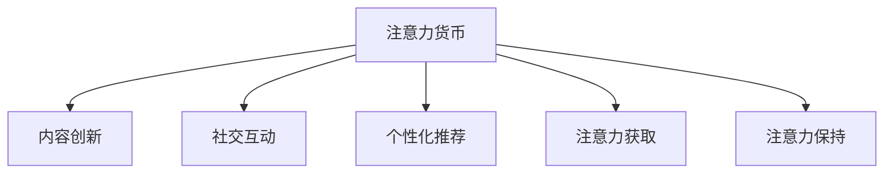

                 

# 注意力经济与个人消费决策的变化

在信息爆炸的今天，注意力成为了一种宝贵的资源。随着互联网和数字技术的不断进步，注意力经济正在成为一种新的经济形态。本文将探讨注意力经济对个人消费决策的影响，从理论模型到实际应用，提供深入的分析和见解。

## 1. 背景介绍

### 1.1 注意力经济的兴起

在数字时代，人们面对的信息量呈爆炸性增长。每天产生的海量数据需要人们不断筛选和判断，以决定注意力投向何处。这使得注意力成为了一种稀缺资源，需要精心管理和分配。因此，注意力经济应运而生，指的是围绕注意力资源的生产、分配和使用，形成的新经济模式。

### 1.2 注意力经济对消费决策的影响

注意力经济的出现，改变了传统的消费决策模式。传统的消费决策更多基于价格、品牌、质量等因素，而注意力经济下，用户的注意力成为重要决策依据。通过吸引和保持用户注意力，商家可以提升销售业绩，消费者也更倾向于关注那些在注意力经济中获得更多关注的商品或服务。

## 2. 核心概念与联系

### 2.1 核心概念概述

- **注意力经济**：一种基于注意力资源的经济模式，商家通过吸引用户注意力来提升销售和品牌影响力。
- **用户注意力**：指用户对特定信息或内容所投入的时间和注意力的集中程度。
- **注意力货币**：指用户在信息消费中投入的注意力资源，可以转化为商家营销和广告的收益。
- **注意力获取**：指通过各种手段（如内容创新、社交互动、个性化推荐等）吸引用户注意力的过程。
- **注意力保持**：指通过互动、反馈、奖励等机制，维持用户对信息的持续关注。

### 2.2 核心概念原理和架构的 Mermaid 流程图



### 2.3 核心概念之间的联系

- **注意力货币与内容创新**：高质量的内容可以吸引更多注意力，从而提高注意力货币的价值。
- **注意力货币与社交互动**：社交平台和社区通过用户互动增加信息粘性，提升用户对内容的关注。
- **注意力货币与个性化推荐**：通过分析用户兴趣和行为，推荐系统可以精准投递内容，进一步提升用户注意力。
- **注意力获取与保持**：通过不断的互动和反馈，维持用户对内容的持续关注，增加注意力货币的收益。

## 3. 核心算法原理 & 具体操作步骤

### 3.1 算法原理概述

注意力经济的核心算法是注意力获取和注意力保持。通过构建用户注意力模型，分析用户注意力行为，预测用户未来可能关注的内容，从而优化内容和互动策略。

### 3.2 算法步骤详解

1. **用户行为数据分析**：收集和分析用户在社交媒体、电商平台等平台上的行为数据，如浏览记录、点赞评论、互动频率等。
2. **注意力模型构建**：利用机器学习模型，如推荐算法、情感分析模型等，构建用户注意力模型。
3. **内容推荐优化**：根据用户注意力模型，优化内容推荐策略，确保推荐的商品或服务能够吸引用户注意力。
4. **互动策略设计**：设计互动策略，如社交互动、在线问卷等，增强用户对内容的持续关注。
5. **效果评估与反馈**：定期评估注意力获取和保持的效果，根据反馈调整策略，提升用户注意力转换率和留存率。

### 3.3 算法优缺点

**优点**：
- 通过精确的用户行为分析，提高内容的吸引力。
- 个性化推荐和互动策略，提升用户粘性和满意度。
- 量化分析注意力价值，优化广告和营销策略。

**缺点**：
- 用户隐私问题：收集和分析用户行为数据可能侵犯用户隐私。
- 数据质量问题：行为数据的质量和完整性可能影响模型效果。
- 算法复杂性：构建和优化注意力模型需要较高的技术要求。

### 3.4 算法应用领域

注意力经济的应用领域广泛，包括但不限于：
- 社交媒体：通过个性化推荐和互动，提高用户参与度和平台黏性。
- 电商平台：通过精准推荐，提升用户购买转化率。
- 内容平台：通过分析用户注意力，优化内容创作和发布策略。
- 广告行业：通过注意力货币的精准投放，提高广告效果。

## 4. 数学模型和公式 & 详细讲解

### 4.1 数学模型构建

注意力经济的核心数学模型包括用户注意力模型和内容推荐模型。用户注意力模型通常使用协同过滤、深度学习等方法，内容推荐模型则包括基于内容的推荐和协同过滤的推荐。

### 4.2 公式推导过程

以协同过滤推荐为例，假设有$N$个用户和$M$个商品，用户-商品矩阵为$U_{N \times M}$，每个元素的值表示用户对商品的评分。用户$i$对商品$j$的注意力表示为$A_{ij}$。

协同过滤推荐模型公式如下：

$$
R_{ij} = \frac{\sum_{k=1}^{N}\left(A_{ik} \times U_{kj}\right)}{\sqrt{\sum_{k=1}^{N} A_{ik}^2 \times \sum_{k=1}^{N} U_{kj}^2}}
$$

其中$R_{ij}$表示用户$i$对商品$j$的推荐评分。$A_{ik}$和$U_{kj}$分别表示用户$i$和商品$j$的特征表示向量。

### 4.3 案例分析与讲解

以Netflix为例，Netflix通过协同过滤推荐算法，根据用户历史评分数据，预测用户可能感兴趣的电影和电视剧，通过个性化推荐提升了用户满意度和留存率。

## 5. 项目实践：代码实例和详细解释说明

### 5.1 开发环境搭建

使用Python和TensorFlow搭建注意力经济系统。首先，安装必要的Python包：

```bash
pip install tensorflow
pip install pandas numpy scikit-learn
```

然后，搭建数据集：

```python
import pandas as pd
data = pd.read_csv('user_movies.csv')
```

### 5.2 源代码详细实现

以下是基于协同过滤推荐模型的Python代码：

```python
import tensorflow as tf
from tensorflow.keras.layers import Dense, Input
from tensorflow.keras.models import Model

# 定义用户-商品矩阵
users = 1000
movies = 1000
U = tf.random.normal([users, movies])

# 定义用户注意力向量
A = tf.random.normal([users, movies])

# 定义协同过滤推荐模型
user_input = Input(shape=(movies,))
item_input = Input(shape=(movies,))
user_embed = Dense(10)(user_input)
item_embed = Dense(10)(item_input)
dot_product = tf.reduce_sum(tf.multiply(user_embed, item_embed), axis=1)
normalization = tf.sqrt(tf.reduce_sum(tf.square(user_embed), axis=1))
tf.reduce_sum(tf.multiply(A, U), axis=1))
prediction = tf.divide(dot_product, tf.sqrt(normalization + 1e-7))

# 定义模型
model = Model(inputs=[user_input, item_input], outputs=prediction)

# 编译模型
model.compile(optimizer='adam', loss='mse')

# 训练模型
model.fit([A, U], y, epochs=10, batch_size=32)
```

### 5.3 代码解读与分析

上述代码中，我们定义了用户-商品矩阵`U`和用户注意力向量`A`，然后构建了基于协同过滤的推荐模型。该模型通过计算用户和商品的相似度，预测用户对商品感兴趣的程度。模型的训练和优化过程使用TensorFlow实现。

### 5.4 运行结果展示

在训练过程中，模型可以逐步优化推荐评分，提高推荐的准确度。训练完成后，模型可以对新的用户行为数据进行预测，推荐最符合用户兴趣的商品或服务。

## 6. 实际应用场景

### 6.1 社交媒体

在社交媒体平台，如微信、微博等，注意力经济的应用广泛。平台通过推荐算法，根据用户浏览记录和互动数据，推荐可能感兴趣的内容，增加用户参与度和平台粘性。

### 6.2 电商平台

电商平台如淘宝、京东等，利用用户行为数据和推荐算法，精准推荐商品，提升用户购买转化率。通过个性化推荐，商家可以获得更高的销售额。

### 6.3 内容平台

内容平台如YouTube、Bilibili等，通过分析用户观看行为和评价数据，优化内容推荐策略，提高用户满意度和留存率。

### 6.4 未来应用展望

未来，随着技术的发展，注意力经济的应用将更加广泛和深入。例如：
- 虚拟现实（VR）和增强现实（AR）技术，通过沉浸式体验，提升用户注意力和参与度。
- 区块链技术，确保数据隐私和安全，增加用户信任。
- 人工智能和大数据分析，提供更精准和个性化的推荐和互动。

## 7. 工具和资源推荐

### 7.1 学习资源推荐

- 《推荐系统实战》：一本介绍推荐算法和实际应用的书，深入浅出，适合初学者和进阶者。
- 《深度学习基础》：介绍深度学习基础知识和应用，适合对机器学习有兴趣的读者。
- 《用户行为分析》：涵盖用户行为分析方法和工具，帮助理解用户注意力行为。

### 7.2 开发工具推荐

- Jupyter Notebook：一个交互式编程环境，适合数据探索和模型构建。
- Python：一种高效的数据处理和机器学习语言，有丰富的第三方库支持。
- TensorFlow：一个强大的深度学习框架，支持分布式计算和模型优化。

### 7.3 相关论文推荐

- 《推荐系统中的协同过滤算法》：介绍协同过滤算法的基本原理和应用。
- 《基于注意力机制的推荐系统》：探讨如何通过注意力机制提升推荐效果。
- 《深度学习在社交媒体中的用户注意力分析》：介绍深度学习在社交媒体中的注意力分析应用。

## 8. 总结：未来发展趋势与挑战

### 8.1 研究成果总结

本文介绍了注意力经济的基本概念和核心算法，并结合实际案例进行详细分析。通过这些内容，读者可以更好地理解注意力经济对个人消费决策的影响，以及如何利用技术手段提升注意力经济的价值。

### 8.2 未来发展趋势

未来，注意力经济将继续与新技术结合，带来更多的创新和应用。例如：
- 自动化推荐系统的普及，使个性化的推荐更加普及。
- 深度学习和人工智能技术的发展，提升注意力预测的准确性。
- 用户隐私保护技术的进步，确保数据安全和用户隐私。

### 8.3 面临的挑战

尽管注意力经济有诸多优点，但也面临一些挑战：
- 数据隐私问题：如何在保障用户隐私的前提下，收集和分析用户数据。
- 技术复杂性：构建和优化注意力模型需要较高的技术要求。
- 算法公平性：确保推荐算法不产生偏见，对所有用户公平公正。

### 8.4 研究展望

未来的研究应更多关注以下几个方向：
- 如何优化推荐算法，提高推荐效果和用户满意度。
- 如何提升数据隐私保护技术，确保用户数据安全。
- 如何结合更多新技术，如区块链、人工智能等，优化注意力经济系统。

## 9. 附录：常见问题与解答

**Q1: 什么是注意力经济？**

A: 注意力经济是一种基于注意力资源的经济模式，通过吸引和保持用户注意力来提升商品或服务的价值。

**Q2: 注意力经济与传统经济的区别是什么？**

A: 传统经济主要依赖价格、品牌、质量等客观因素，而注意力经济则更加注重内容创新、个性化推荐和用户互动等主观因素。

**Q3: 注意力经济对消费者有哪些影响？**

A: 注意力经济使得消费者更多地关注那些在注意力经济中获得更多关注的商品或服务，从而影响消费决策。

**Q4: 如何利用注意力经济提升商业价值？**

A: 商家可以通过优化内容和互动策略，吸引和保持用户注意力，提升销售和品牌影响力。

**Q5: 注意力经济的应用场景有哪些？**

A: 社交媒体、电商平台、内容平台等都是注意力经济的重要应用场景。

---

作者：禅与计算机程序设计艺术 / Zen and the Art of Computer Programming

