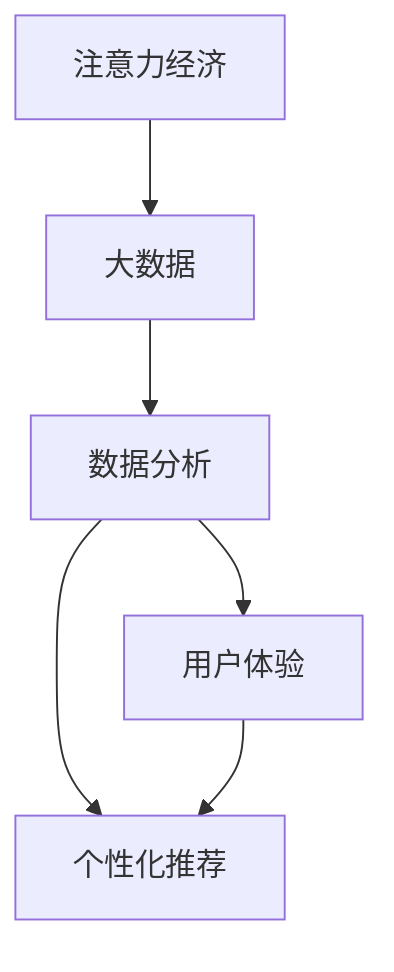

                 

# 注意力经济与数据分析技巧：如何利用数据理解受众行为和偏好

## 1. 背景介绍

### 1.1 问题由来

随着数字经济的兴起，注意力成为越来越稀缺的资源。在海量信息的海洋中，如何让有限的注意力集中于有价值的内容，成为企业和用户共同关注的核心问题。大数据和人工智能技术为解决这一问题提供了新的路径。通过数据分析，我们可以深入理解用户行为和偏好，为用户提供更加个性化、精准的服务。

### 1.2 问题核心关键点

数据驱动的用户行为分析已经成为企业竞争的关键手段。如何利用数据分析技术，洞察用户需求，提升用户体验，优化运营策略，是现代企业数字化转型的重要课题。

在这一过程中，注意力经济理论和数据分析技术扮演了至关重要的角色。注意力经济理论指出，用户的时间和注意力是宝贵的资源，应该合理配置以实现最大的价值。而数据分析技术则通过挖掘数据中的潜在信息，帮助企业更好地理解用户需求，优化产品和服务。

## 2. 核心概念与联系

### 2.1 核心概念概述

- **注意力经济**：在信息过载的时代，用户的注意力成为稀缺资源，企业需要利用各种手段吸引并保持用户注意力，从而创造价值。
- **大数据**：通过收集和分析海量数据，企业可以发现用户行为模式和需求趋势，为个性化服务提供依据。
- **数据分析**：利用统计学、机器学习等方法，从数据中提取有价值的信息，辅助企业做出决策。
- **用户体验**：通过分析用户反馈和行为数据，优化产品和服务，提升用户满意度。
- **个性化推荐**：利用用户的历史行为和偏好数据，提供量身定制的服务，提高用户粘性。

这些核心概念之间具有紧密的联系。注意力经济提供了理论基础，大数据提供了技术手段，数据分析提供了分析工具，用户体验和个性化推荐则是实践目标。

### 2.2 核心概念原理和架构的 Mermaid 流程图(Mermaid 流程节点中不要有括号、逗号等特殊字符)



这个流程图展示了从注意力经济理论出发，通过大数据技术收集用户数据，利用数据分析技术挖掘信息，最终优化用户体验和实现个性化推荐的全流程。

## 3. 核心算法原理 & 具体操作步骤

### 3.1 算法原理概述

基于数据的注意力分析，通常包括以下几个步骤：

1. **数据收集**：通过各种渠道收集用户行为数据，如点击率、停留时间、互动次数等。
2. **特征提取**：利用统计学和机器学习技术，提取有用的特征，如用户兴趣、行为模式等。
3. **模型训练**：使用机器学习算法，如分类、聚类、回归等，训练预测模型，识别用户需求和行为。
4. **模型评估**：通过验证集或测试集评估模型性能，调整参数和算法，优化模型。
5. **结果应用**：将训练好的模型应用于实际场景，提升用户体验和个性化推荐效果。

### 3.2 算法步骤详解

#### 3.2.1 数据收集

数据收集是整个流程的第一步。通过网站分析工具、社交媒体分析工具、用户行为跟踪等手段，可以收集到大量用户数据。例如，可以通过Google Analytics收集用户访问网页的行为数据，通过Facebook Insights分析用户的社交互动数据。

#### 3.2.2 特征提取

特征提取是数据预处理的重要步骤。通过选择和构造合适的特征，可以更好地反映用户行为和偏好。常见的特征包括：

- **基本信息**：如用户年龄、性别、地理位置等。
- **行为特征**：如点击次数、浏览时间、购买次数等。
- **心理特征**：如兴趣爱好、购买动机等。

利用机器学习算法，如PCA、LDA等，可以从原始数据中提取有意义的特征。

#### 3.2.3 模型训练

模型训练是整个流程的核心环节。通过选择合适的模型和算法，训练得到预测用户行为和偏好的模型。常用的模型包括：

- **分类模型**：如决策树、随机森林、支持向量机等，用于预测用户是否会执行某项行为。
- **聚类模型**：如K-Means、层次聚类等，用于发现具有相似行为的用户群体。
- **回归模型**：如线性回归、多项式回归等，用于预测用户行为的结果。

在训练过程中，需要选择合适的损失函数和优化算法，如交叉熵、梯度下降等，确保模型能够准确地预测用户行为。

#### 3.2.4 模型评估

模型评估是验证模型性能的重要环节。常用的评估指标包括：

- **准确率**：预测结果与实际结果的匹配程度。
- **召回率**：实际结果被预测正确的比例。
- **F1分数**：综合考虑准确率和召回率。
- **AUC值**：ROC曲线下的面积，衡量模型的分类能力。

通过模型评估，可以发现模型的优点和不足，进一步优化模型。

#### 3.2.5 结果应用

结果应用是将模型应用于实际场景的过程。常见的应用场景包括：

- **个性化推荐**：通过用户的历史行为和偏好数据，提供量身定制的服务。
- **用户体验优化**：通过分析用户行为数据，优化产品和服务，提升用户满意度。
- **广告投放优化**：通过分析用户兴趣和行为，优化广告投放策略，提高广告效果。

### 3.3 算法优缺点

#### 3.3.1 优点

- **全面覆盖**：利用大数据技术，可以全面覆盖用户行为和偏好，发现潜在的需求和机会。
- **精准预测**：利用机器学习模型，可以准确预测用户行为和偏好，提升推荐效果。
- **灵活调整**：通过不断优化模型和算法，可以灵活调整策略，适应市场变化。

#### 3.3.2 缺点

- **数据质量要求高**：数据收集和处理需要高质量的数据，数据质量问题可能导致误导性的分析结果。
- **模型复杂度高**：模型训练需要大量的计算资源，训练时间较长。
- **隐私保护**：用户数据涉及隐私问题，需要采取相应的保护措施。

### 3.4 算法应用领域

基于数据的注意力分析技术，已经在多个领域得到了广泛应用，例如：

- **电商推荐系统**：通过分析用户的历史行为数据，为用户推荐商品，提高转化率和销售额。
- **社交媒体分析**：利用用户互动数据，分析用户兴趣和行为，优化内容推荐。
- **金融风控**：通过分析用户交易行为，识别潜在风险，提高金融产品的安全性。
- **健康管理**：利用用户健康数据，分析健康行为和需求，提供个性化的健康建议。
- **教育培训**：通过分析学生的学习行为数据，提供个性化的学习计划，提升学习效果。

这些应用场景展示了数据分析技术在各个行业中的巨大潜力和广泛应用。

## 4. 数学模型和公式 & 详细讲解 & 举例说明

### 4.1 数学模型构建

基于数据的注意力分析模型通常可以表示为：

$$
\hat{y} = f(x, \theta)
$$

其中 $x$ 为输入数据，$\theta$ 为模型参数，$f$ 为模型函数，$\hat{y}$ 为预测结果。常见的模型函数包括决策树、随机森林、神经网络等。

### 4.2 公式推导过程

以线性回归模型为例，其公式为：

$$
y = \beta_0 + \beta_1 x_1 + \beta_2 x_2 + ... + \beta_n x_n + \epsilon
$$

其中 $y$ 为预测值，$x_i$ 为特征变量，$\beta_i$ 为模型参数，$\epsilon$ 为误差项。

通过最小化损失函数 $L(\theta) = \frac{1}{2N} \sum_{i=1}^N (y_i - \hat{y}_i)^2$，利用梯度下降等优化算法，可以得到模型参数 $\theta$。

### 4.3 案例分析与讲解

#### 4.3.1 电商推荐系统

电商推荐系统通过分析用户的历史浏览和购买数据，预测用户可能感兴趣的商品。例如，利用协同过滤算法，可以发现具有相似兴趣的用户群体，为每个用户推荐与这些用户相似的商品。

#### 4.3.2 社交媒体分析

社交媒体分析利用用户互动数据，分析用户的兴趣和行为。例如，通过分析用户的点赞、评论、分享等行为，可以发现用户的兴趣偏好，推荐相关内容。

#### 4.3.3 金融风控

金融风控通过分析用户的历史交易行为，识别潜在风险。例如，利用逻辑回归模型，可以预测用户的违约概率，采取相应的风险控制措施。

## 5. 项目实践：代码实例和详细解释说明

### 5.1 开发环境搭建

在进行数据分析实践前，我们需要准备好开发环境。以下是使用Python进行数据分析的环境配置流程：

1. 安装Anaconda：从官网下载并安装Anaconda，用于创建独立的Python环境。

2. 创建并激活虚拟环境：
```bash
conda create -n data-env python=3.8 
conda activate data-env
```

3. 安装必要的Python库：
```bash
pip install pandas numpy matplotlib scikit-learn seaborn statsmodels
```

完成上述步骤后，即可在`data-env`环境中开始数据分析实践。

### 5.2 源代码详细实现

下面是使用Python进行电商推荐系统的代码实现：

```python
import pandas as pd
from sklearn.ensemble import RandomForestClassifier
from sklearn.model_selection import train_test_split
from sklearn.metrics import accuracy_score

# 加载数据集
data = pd.read_csv('click_data.csv')

# 特征选择
features = data[['age', 'gender', 'location', 'click_count', 'purchase_count']]
labels = data['purchase']

# 数据分割
features_train, features_test, labels_train, labels_test = train_test_split(features, labels, test_size=0.2)

# 模型训练
model = RandomForestClassifier(n_estimators=100)
model.fit(features_train, labels_train)

# 模型评估
labels_pred = model.predict(features_test)
accuracy = accuracy_score(labels_test, labels_pred)
print(f"Accuracy: {accuracy:.2f}")
```

### 5.3 代码解读与分析

代码实现中，我们首先加载电商用户点击数据，选择年龄、性别、位置、点击次数和购买次数作为特征，购买次数作为标签。然后利用train_test_split函数将数据集分为训练集和测试集，训练一个随机森林模型，并计算模型在测试集上的准确率。

### 5.4 运行结果展示

运行上述代码，可以得到电商推荐系统的准确率结果。假设模型在测试集上的准确率为85%，可以认为模型具有一定的预测能力，可以用于实际推荐系统。

## 6. 实际应用场景

### 6.1 电商推荐系统

电商推荐系统通过分析用户的历史浏览和购买数据，为用户推荐商品，提高转化率和销售额。例如，通过分析用户点击和购买的商品，可以发现用户的兴趣偏好，推荐相关商品。

### 6.2 社交媒体分析

社交媒体分析利用用户互动数据，分析用户的兴趣和行为。例如，通过分析用户的点赞、评论、分享等行为，可以发现用户的兴趣偏好，推荐相关内容。

### 6.3 金融风控

金融风控通过分析用户的历史交易行为，识别潜在风险。例如，利用逻辑回归模型，可以预测用户的违约概率，采取相应的风险控制措施。

### 6.4 未来应用展望

随着数据分析技术的不断进步，基于数据的注意力分析将进一步提升在各行业中的应用效果。例如，利用深度学习技术，可以更准确地预测用户行为和偏好。利用联邦学习技术，可以在保护用户隐私的前提下，进行跨平台数据分析。利用边缘计算技术，可以实现实时数据分析和决策，提高响应速度。

## 7. 工具和资源推荐

### 7.1 学习资源推荐

为了帮助开发者系统掌握数据分析的理论基础和实践技巧，这里推荐一些优质的学习资源：

1. 《数据科学导论》系列博文：由知名数据科学家撰写，深入浅出地介绍了数据分析的基本概念和关键技术。

2. CS229《机器学习》课程：斯坦福大学开设的机器学习明星课程，有Lecture视频和配套作业，带你深入理解机器学习算法。

3. 《数据科学与统计》书籍：由统计学专家撰写，全面介绍了数据科学和统计学的基础知识，适合系统学习。

4. Kaggle数据科学竞赛平台：提供海量真实数据集和竞赛平台，助力开发者实践数据分析技能。

5. Udacity数据科学纳米学位：提供在线课程和项目实践，帮助你系统掌握数据分析技术。

通过对这些资源的学习实践，相信你一定能够快速掌握数据分析的精髓，并用于解决实际的业务问题。

### 7.2 开发工具推荐

高效的数据分析离不开优秀的工具支持。以下是几款用于数据分析开发的常用工具：

1. Python：基于动态语言的脚本语言，功能强大，生态丰富，适合数据分析任务。

2. R语言：专门用于统计分析和数据可视化，拥有丰富的统计学和机器学习库。

3. Tableau：数据可视化工具，可以帮助用户直观展示数据分析结果，发现数据中的潜在模式。

4. Apache Spark：大数据处理引擎，可以处理大规模数据集，提供高效的分布式计算能力。

5. Jupyter Notebook：交互式开发环境，支持Python和R语言，适合数据分析和机器学习任务。

合理利用这些工具，可以显著提升数据分析的开发效率，加快创新迭代的步伐。

### 7.3 相关论文推荐

数据分析技术的发展源于学界的持续研究。以下是几篇奠基性的相关论文，推荐阅读：

1. "The Elements of Statistical Learning"：统计学领域的经典教材，介绍了多种统计学方法，包括回归、分类、聚类等。

2. "Introduction to Statistical Learning"：机器学习领域的入门教材，介绍了机器学习的基本概念和算法。

3. "Data Science from Scratch"：数据科学领域的入门书籍，介绍了数据科学的基本工具和技术。

4. "Data Science and Statistical Learning"：一本综合性数据科学教材，介绍了数据科学和统计学的融合应用。

这些论文代表了大数据分析技术的发展脉络。通过学习这些前沿成果，可以帮助研究者把握学科前进方向，激发更多的创新灵感。

## 8. 总结：未来发展趋势与挑战

### 8.1 总结

本文对基于数据的注意力分析方法进行了全面系统的介绍。首先阐述了注意力经济理论和数据分析技术的研究背景和意义，明确了数据分析在用户行为分析和个性化服务中的重要作用。其次，从原理到实践，详细讲解了数据分析的数学模型和具体操作步骤，给出了电商推荐系统的代码实现。同时，本文还广泛探讨了数据分析技术在电商、社交媒体、金融等多个行业领域的应用前景，展示了数据分析技术的巨大潜力。

通过本文的系统梳理，可以看到，数据分析技术正在成为各行业数字化转型的重要手段。数据驱动的用户行为分析，有助于企业更好地理解用户需求，优化产品和服务，提升用户满意度和市场竞争力。未来，随着数据分析技术的不断进步，数据分析将进一步拓展其应用领域，为各行各业带来新的机遇和挑战。

### 8.2 未来发展趋势

展望未来，数据分析技术将呈现以下几个发展趋势：

1. 数据质量提升。随着数据采集和处理技术的进步，数据质量将不断提升，数据分析结果将更加可靠。

2. 实时数据分析。利用边缘计算和分布式计算技术，可以实现实时数据分析和决策，提高响应速度和效率。

3. 跨平台数据融合。利用联邦学习等技术，可以在保护用户隐私的前提下，进行跨平台数据融合，提升数据分析的全面性和准确性。

4. 深度学习应用。利用深度学习技术，可以更准确地预测用户行为和偏好，提升数据分析的精准性。

5. 数据可视化工具创新。利用先进的数据可视化技术，可以更直观地展示数据分析结果，发现数据中的潜在模式。

6. 数据治理和隐私保护。随着数据量和复杂度的增加，数据治理和隐私保护将成为重要课题，相关技术和标准将不断完善。

以上趋势凸显了数据分析技术的广阔前景。这些方向的探索发展，将进一步提升数据分析的精度和效率，为各行各业带来新的机遇和挑战。

### 8.3 面临的挑战

尽管数据分析技术已经取得了瞩目成就，但在迈向更加智能化、普适化应用的过程中，它仍面临着诸多挑战：

1. 数据隐私和安全。用户数据涉及隐私问题，如何保护用户隐私，防止数据泄露，是数据分析的重要挑战。

2. 数据质量问题。数据质量问题可能导致误导性的分析结果，如何提高数据质量，是数据分析的难点。

3. 计算资源消耗。大规模数据分析需要大量的计算资源，如何降低计算成本，提高计算效率，是数据分析的关键问题。

4. 模型解释性不足。数据分析模型通常缺乏可解释性，难以对其推理逻辑进行分析和调试。

5. 数据实时性要求高。在实时数据环境中，数据分析需要快速响应，对系统性能和稳定性提出更高要求。

6. 数据多样化处理。随着数据类型的多样化，如何处理不同类型的数据，是数据分析的重要挑战。

正视数据分析面临的这些挑战，积极应对并寻求突破，将是大数据分析技术走向成熟的必由之路。相信随着学界和产业界的共同努力，这些挑战终将一一被克服，数据分析必将在构建智能系统的各个环节中扮演越来越重要的角色。

### 8.4 研究展望

面对数据分析面临的种种挑战，未来的研究需要在以下几个方面寻求新的突破：

1. 探索无监督和半监督数据分析方法。摆脱对大规模标注数据的依赖，利用自监督学习、主动学习等无监督和半监督范式，最大限度利用非结构化数据，实现更加灵活高效的数据分析。

2. 研究深度学习在数据分析中的应用。利用深度学习技术，可以更准确地预测用户行为和偏好，提升数据分析的精准性。

3. 引入因果推断方法。通过引入因果推断方法，可以更准确地理解用户行为和偏好的因果关系，提升数据分析的全面性和可靠性。

4. 融合多模态数据。利用多模态数据分析技术，可以更全面地理解用户需求和行为，提升数据分析的准确性。

5. 加强数据隐私保护。通过加密、去标识化等技术，可以在保护用户隐私的前提下，进行数据分析。

这些研究方向的探索，将引领数据分析技术迈向更高的台阶，为构建智能系统提供更全面、更可靠的数据支持。

## 9. 附录：常见问题与解答

**Q1: 如何选择合适的数据分析工具？**

A: 选择工具应综合考虑数据量、数据类型、分析需求等因素。例如，对于大规模数据集，可以选择Apache Spark进行分布式处理；对于实时数据分析，可以选择Kafka等流处理框架；对于数据可视化，可以选择Tableau或D3.js等工具。

**Q2: 数据分析过程中需要注意哪些数据质量问题？**

A: 数据分析过程中，需要注意以下数据质量问题：

1. 缺失值处理：对于缺失数据，可以采用插值、删除等方法进行处理。
2. 异常值检测：对于异常值，需要进行检测和处理，避免其对分析结果的影响。
3. 数据一致性：确保数据集中的数据一致性，避免数据冲突。
4. 数据标准化：对于不同来源的数据，需要进行标准化处理，避免数据不兼容。

**Q3: 数据分析过程中如何避免过拟合？**

A: 数据分析过程中，需要注意以下避免过拟合的方法：

1. 数据分割：将数据集分为训练集和测试集，避免模型在训练集上过拟合。
2. 正则化：利用L1、L2正则化等方法，避免模型复杂度过高。
3. 模型简化：选择简单的模型结构，避免过度拟合。
4. 交叉验证：利用交叉验证方法，评估模型泛化能力，避免过拟合。

**Q4: 数据分析在实际应用中如何实现实时性？**

A: 数据分析的实时性实现，可以通过以下方法：

1. 数据流处理：利用流处理框架如Kafka、Spark Streaming等，实现实时数据处理。
2. 分布式计算：利用分布式计算框架如Hadoop、Spark等，实现大规模实时数据处理。
3. 边缘计算：利用边缘计算技术，在数据源端进行实时数据处理，减少延迟。

**Q5: 数据分析过程中如何保护用户隐私？**

A: 数据分析过程中，需要注意以下保护用户隐私的方法：

1. 数据匿名化：对数据进行去标识化处理，保护用户隐私。
2. 数据加密：对数据进行加密处理，防止数据泄露。
3. 数据访问控制：限制数据访问权限，保护数据安全。
4. 差分隐私：利用差分隐私技术，保护用户隐私。

通过对这些问题的解答，可以更好地理解数据分析技术的实际应用和关键问题，为数据分析实践提供指导。

---

作者：禅与计算机程序设计艺术 / Zen and the Art of Computer Programming

