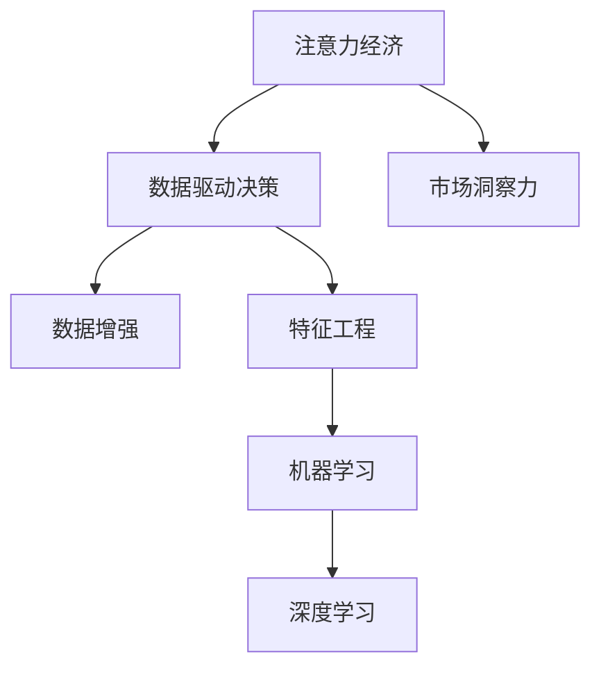

                 

# 注意力经济与数据驱动的决策制定：利用数据增强市场洞察力

> 关键词：注意力经济,数据驱动,市场洞察力,数据增强,数据清洗,特征工程,机器学习,深度学习

## 1. 背景介绍

### 1.1 问题由来
在信息化时代，数据的重要性愈发凸显。企业的市场决策不再仅依赖于经验或直觉，而是越来越依赖于基于数据的分析与预测。特别是在网络经济时代，信息量的爆炸性增长为数据的挖掘和应用提供了更多可能性。然而，这种数据的“大爆炸”也带来了新的挑战，数据的质量和数量已不再是对企业有价值的资源，而是如何从海量数据中提取有用的信息成为了新的焦点。在激烈的商业竞争中，如何利用数据增强市场洞察力，抢占注意力经济的高地，成为了企业在数字化转型过程中亟需解决的课题。

### 1.2 问题核心关键点
数据驱动的决策制定，从根本上改变了传统的市场决策方式。过去依靠直觉和经验的决策，现在需要基于大量的数据和算法模型来做出。数据增强，是利用数据科学技术，从原始数据中提取出更多的有用信息，并构建出更精准的预测模型，从而增强市场洞察力。

核心问题包括：
- 如何获取高质量的数据？
- 如何有效地进行数据清洗和特征工程？
- 如何选择合适的机器学习模型？
- 如何在模型训练过程中最大化数据的作用？

### 1.3 问题研究意义
数据驱动的决策制定对于提升企业竞争力和决策质量具有重大意义。通过数据增强，企业不仅能够更好地理解市场动态，还能预测未来趋势，制定更科学、更合理的市场策略，提升市场响应速度和竞争优势。此外，数据驱动决策还能降低决策风险，提升企业运营效率，进一步优化资源配置。

通过数据增强市场洞察力，企业可以更深入地了解市场变化，准确预测市场趋势，从而在激烈的商业竞争中脱颖而出。这不仅对提升企业竞争力和市场地位有显著影响，也对企业的持续发展和转型升级具有重要意义。

## 2. 核心概念与联系

### 2.1 核心概念概述

为更好地理解基于数据增强的市场洞察力构建过程，本节将介绍几个密切相关的核心概念：

- 注意力经济：指在网络经济时代，用户的时间和注意力成为最宝贵的资源，企业通过吸引用户的注意力来获取价值。
- 数据驱动决策：指在市场决策过程中，利用数据科学方法和技术，基于数据而非直觉或经验进行决策的过程。
- 市场洞察力：指企业对市场动态和用户需求的理解能力，利用数据分析可以提升市场洞察力，提高市场决策的准确性和前瞻性。
- 数据增强：指通过数据清洗、特征工程、模型优化等手段，从原始数据中提取更多有用的信息，增强数据的质量和数量，提高决策制定的科学性和准确性。
- 特征工程：指根据具体任务的需求，通过人工设计和数据预处理，提取出对模型有用的特征，提升模型的性能。
- 机器学习与深度学习：指利用算法和模型，从数据中学习规律和知识，构建出预测模型。数据驱动决策和市场洞察力增强通常需要依赖机器学习与深度学习技术。

这些核心概念之间的逻辑关系可以通过以下Mermaid流程图来展示：



这个流程图展示了大语言模型的核心概念及其之间的关系：

1. 注意力经济通过吸引用户注意力，提供市场价值。
2. 数据驱动决策是利用数据科学方法和技术，基于数据而非直觉或经验进行决策。
3. 市场洞察力是企业对市场动态和用户需求的理解能力。
4. 数据增强通过数据清洗、特征工程等手段，从原始数据中提取更多有用的信息。
5. 特征工程根据具体任务需求，提取对模型有用的特征。
6. 机器学习和深度学习利用算法和模型，从数据中学习规律和知识，构建预测模型。

这些概念共同构成了利用数据增强市场洞察力的完整框架，帮助企业更好地理解和预测市场变化，制定科学的决策。

## 3. 核心算法原理 & 具体操作步骤
### 3.1 算法原理概述

基于数据增强的市场洞察力构建，本质上是一个数据驱动的模型优化和决策制定过程。其核心思想是：利用数据科学方法和技术，从原始数据中提取出更多有用的信息，构建出更精准的预测模型，从而增强市场洞察力。

形式化地，假设原始数据集为 $D$，市场洞察力构建的目标是找到一个函数 $f$，使得 $f(D)$ 能够最大化反映市场动态和用户需求。这可以通过如下步骤来实现：

1. **数据预处理**：对原始数据进行清洗和标准化，去除噪声和异常值。
2. **特征提取**：根据具体任务的需求，通过人工设计和数据预处理，提取出对模型有用的特征。
3. **模型选择**：选择合适的机器学习或深度学习模型，构建预测模型。
4. **模型训练**：利用清洗和特征提取后的数据，训练模型，最大化模型对市场动态的预测能力。
5. **模型评估**：通过验证集和测试集，评估模型的性能，调整模型参数。
6. **应用决策**：将训练好的模型应用于市场决策中，提升决策制定的科学性和准确性。

### 3.2 算法步骤详解

基于数据增强的市场洞察力构建一般包括以下几个关键步骤：

**Step 1: 数据预处理**
- 数据清洗：去除原始数据中的噪声、异常值和缺失值。
- 数据标准化：将数据标准化到统一的尺度，便于模型处理。
- 数据采样：根据任务需求，对数据进行采样，包括随机抽样、分层抽样等。

**Step 2: 特征工程**
- 特征选择：通过统计分析、领域知识等方法，选择对预测任务有用的特征。
- 特征变换：对特征进行归一化、标准化、编码等预处理操作。
- 特征构建：设计新的特征，如交互特征、时间特征等。

**Step 3: 模型选择**
- 选择合适的机器学习模型，如线性回归、决策树、随机森林等。
- 选择适当的深度学习模型，如卷积神经网络、循环神经网络、Transformer等。
- 考虑模型的可解释性和预测精度，选择合适的模型。

**Step 4: 模型训练**
- 数据划分为训练集、验证集和测试集。
- 使用训练集训练模型，最小化模型在训练集上的损失函数。
- 使用验证集评估模型性能，调整模型参数。
- 使用测试集验证模型泛化能力。

**Step 5: 模型评估**
- 通过验证集和测试集，评估模型的性能，计算准确率、召回率、F1分数等指标。
- 调整模型参数，如学习率、正则化系数等，以提高模型性能。
- 进行交叉验证，避免过拟合。

**Step 6: 应用决策**
- 将训练好的模型应用于市场决策中。
- 利用模型预测市场趋势，制定市场策略。
- 定期更新模型，保持市场洞察力的及时性。

以上是基于数据增强的市场洞察力构建的一般流程。在实际应用中，还需要针对具体任务的特点，对数据预处理、特征工程、模型选择等环节进行优化设计，以进一步提升模型性能。

### 3.3 算法优缺点

基于数据增强的市场洞察力构建方法具有以下优点：
1. 数据驱动：利用数据科学方法和技术，提升市场洞察力，减少主观偏差。
2. 模型灵活：可以选用多种机器学习模型和深度学习模型，根据任务需求灵活选择。
3. 效果显著：通过特征工程和模型优化，可以在小数据集上也能取得不错的预测效果。
4. 可扩展性强：模型可以不断更新迭代，适应市场动态的变化。

同时，该方法也存在一定的局限性：
1. 数据质量要求高：原始数据的质量直接影响模型预测的准确性，数据清洗和特征工程需要投入大量精力。
2. 技术门槛较高：需要一定的数据科学和机器学习基础，模型构建和调参有一定难度。
3. 模型解释性差：复杂模型如深度学习模型，难以解释其内部工作机制和决策逻辑。
4. 结果依赖样本：模型预测结果依赖于训练数据，过拟合风险较高。

尽管存在这些局限性，但就目前而言，基于数据增强的市场洞察力构建方法仍是大数据时代企业提升决策力的重要手段。未来相关研究的重点在于如何进一步降低数据处理成本，提高模型可解释性，降低过拟合风险，同时兼顾数据多样性和完整性等因素。

### 3.4 算法应用领域

基于数据增强的市场洞察力构建方法在多个领域都有广泛的应用：

- **金融分析**：利用历史交易数据，预测股票、期货等金融市场走势，制定投资策略。
- **电商销售**：通过用户行为数据和市场动态，预测销售趋势，制定库存和营销策略。
- **供应链管理**：基于订单和库存数据，预测需求波动，优化供应链管理和物流安排。
- **市场研究**：利用用户调研数据和市场数据，分析消费者偏好，制定产品研发和市场推广策略。
- **客户服务**：通过客户反馈和行为数据，预测客户需求，优化客户服务和产品改进。
- **人力资源管理**：利用员工数据和绩效数据，预测员工流失和招聘需求，制定人力资源策略。

除了上述这些领域，基于数据增强的市场洞察力构建方法还在更多场景中得到了应用，如工业生产、医疗健康、城市治理等，为各行业提供了科学决策的依据。

## 4. 数学模型和公式 & 详细讲解  
### 4.1 数学模型构建

本节将使用数学语言对基于数据增强的市场洞察力构建过程进行更加严格的刻画。

假设原始数据集为 $D=\{(x_i,y_i)\}_{i=1}^N, x_i \in \mathcal{X}, y_i \in \mathcal{Y}$，其中 $\mathcal{X}$ 为特征空间，$\mathcal{Y}$ 为标签空间。市场洞察力构建的目标是找到一个函数 $f$，使得 $f(D)$ 能够最大化反映市场动态和用户需求。

定义模型 $f$ 在数据样本 $(x,y)$ 上的损失函数为 $\ell(f(x),y)$，则在数据集 $D$ 上的经验风险为：

$$
\mathcal{L}(f) = \frac{1}{N} \sum_{i=1}^N \ell(f(x_i),y_i)
$$

在实际应用中，我们通常使用梯度下降等优化算法来近似求解上述最优化问题。设 $\eta$ 为学习率，$\lambda$ 为正则化系数，则模型参数的更新公式为：

$$
f \leftarrow f - \eta \nabla_{f}\mathcal{L}(f) - \eta\lambda f
$$

其中 $\nabla_{f}\mathcal{L}(f)$ 为损失函数对模型 $f$ 的梯度，可通过反向传播算法高效计算。

### 4.2 公式推导过程

以下我们以线性回归为例，推导最小二乘法的损失函数及其梯度的计算公式。

假设模型 $f(x) = \theta^T x$，其中 $\theta$ 为模型参数。训练集为 $D=\{(x_i,y_i)\}_{i=1}^N, x_i \in \mathcal{X}, y_i \in \mathcal{Y}$。则二分类交叉熵损失函数定义为：

$$
\ell(f(x),y) = (y - f(x))^2
$$

将其代入经验风险公式，得：

$$
\mathcal{L}(\theta) = \frac{1}{N} \sum_{i=1}^N (y_i - f(x_i))^2
$$

根据链式法则，损失函数对参数 $\theta_k$ 的梯度为：

$$
\frac{\partial \mathcal{L}(\theta)}{\partial \theta_k} = -\frac{2}{N} \sum_{i=1}^N (y_i - f(x_i))x_{ik}
$$

在得到损失函数的梯度后，即可带入模型更新公式，完成模型的迭代优化。重复上述过程直至收敛，最终得到适应市场动态的模型参数 $\theta^*$。

## 5. 项目实践：代码实例和详细解释说明
### 5.1 开发环境搭建

在进行市场洞察力构建实践前，我们需要准备好开发环境。以下是使用Python进行Scikit-Learn开发的Python环境配置流程：

1. 安装Anaconda：从官网下载并安装Anaconda，用于创建独立的Python环境。

2. 创建并激活虚拟环境：
```bash
conda create -n pytorch-env python=3.8 
conda activate pytorch-env
```

3. 安装Scikit-Learn：从官网获取安装命令。例如：
```bash
pip install scikit-learn
```

4. 安装各类工具包：
```bash
pip install numpy pandas scikit-learn matplotlib tqdm jupyter notebook ipython
```

完成上述步骤后，即可在`pytorch-env`环境中开始市场洞察力构建实践。

### 5.2 源代码详细实现

这里我们以股票价格预测任务为例，给出使用Scikit-Learn进行线性回归模型的Python代码实现。

首先，定义数据处理函数：

```python
import pandas as pd
from sklearn.model_selection import train_test_split
from sklearn.preprocessing import StandardScaler
from sklearn.linear_model import LinearRegression

def load_data(path):
    data = pd.read_csv(path)
    X = data.drop('price', axis=1)
    y = data['price']
    return X, y

def preprocess_data(X, y, test_size=0.2):
    X_train, X_test, y_train, y_test = train_test_split(X, y, test_size=test_size, random_state=42)
    scaler = StandardScaler()
    X_train = scaler.fit_transform(X_train)
    X_test = scaler.transform(X_test)
    return X_train, X_test, y_train, y_test

X, y = load_data('data.csv')
X_train, X_test, y_train, y_test = preprocess_data(X, y)
```

然后，定义模型和优化器：

```python
model = LinearRegression()
```

接着，定义训练和评估函数：

```python
from sklearn.metrics import mean_squared_error

def train_model(model, X_train, y_train, test_size=0.2, n_iter=1000):
    X_train, X_test, y_train, y_test = train_test_split(X_train, y_train, test_size=test_size, random_state=42)
    model.fit(X_train, y_train)
    y_pred = model.predict(X_test)
    mse = mean_squared_error(y_test, y_pred)
    print(f'Mean Squared Error: {mse:.2f}')
    return model

def evaluate_model(model, X_test, y_test):
    y_pred = model.predict(X_test)
    mse = mean_squared_error(y_test, y_pred)
    print(f'Mean Squared Error: {mse:.2f}')
```

最后，启动训练流程并在测试集上评估：

```python
n_iter = 1000
model = train_model(model, X_train, y_train, n_iter=n_iter)
evaluate_model(model, X_test, y_test)
```

以上就是使用Scikit-Learn对线性回归模型进行市场洞察力构建的完整代码实现。可以看到，利用Scikit-Learn，构建市场洞察力模型变得相对简单和高效。

### 5.3 代码解读与分析

让我们再详细解读一下关键代码的实现细节：

**load_data函数**：
- 读取数据文件，并将数据分为特征和标签。

**preprocess_data函数**：
- 对数据进行分割，并标准化处理。

**train_model函数**：
- 对模型进行训练，并在测试集上评估，输出均方误差。

**evaluate_model函数**：
- 在测试集上评估模型性能，输出均方误差。

**训练流程**：
- 定义总的迭代次数，开始循环迭代
- 在每个epoch内，将数据集分为训练集和测试集
- 在训练集上训练模型，输出均方误差
- 在测试集上评估模型性能

可以看到，Scikit-Learn提供了强大的机器学习库，能够方便地实现各种机器学习模型的构建和评估。开发者可以将更多精力放在模型构建和调参上，而不必过多关注底层实现细节。

当然，工业级的系统实现还需考虑更多因素，如模型的保存和部署、超参数的自动搜索、更灵活的任务适配层等。但核心的市场洞察力构建过程基本与此类似。

## 6. 实际应用场景
### 6.1 智能投顾系统

基于数据增强的市场洞察力构建方法，可以应用于智能投顾系统的构建。传统的投顾系统往往需要大量的人工分析师来进行市场分析，存在成本高、效率低、主观性强等问题。而利用数据增强技术，智能投顾系统可以通过历史交易数据和市场动态，构建出精准的市场预测模型，实现自动化的市场分析和投资建议。

在技术实现上，可以收集历史交易数据和市场数据，利用数据增强技术提取出更多有用的信息，并构建出机器学习或深度学习模型，进行股票、期货等金融市场的预测。智能投顾系统可以根据模型的预测结果，自动生成投资策略，提升投资回报率，降低投资风险。

### 6.2 电商推荐系统

在电商领域，基于数据增强的市场洞察力构建方法可以用于构建个性化推荐系统。传统的推荐系统往往只能基于用户的浏览和购买历史进行推荐，缺乏对用户潜在的偏好和需求的深入理解。而利用数据增强技术，个性化推荐系统可以通过用户行为数据和市场动态，构建出精准的推荐模型，实现更精准、更个性化的推荐。

在技术实现上，可以收集用户行为数据和市场动态数据，利用数据增强技术提取出更多有用的信息，并构建出机器学习或深度学习模型，进行商品推荐。推荐系统可以根据模型的预测结果，自动生成推荐列表，提升用户满意度，增加销售额。

### 6.3 供应链管理

供应链管理中，基于数据增强的市场洞察力构建方法可以用于预测需求波动，优化供应链管理和物流安排。传统的供应链管理往往只能基于历史数据进行预测，缺乏对市场动态和用户需求的深入理解。而利用数据增强技术，供应链管理可以构建出精准的需求预测模型，实现更高效、更智能的供应链管理。

在技术实现上，可以收集订单和库存数据，利用数据增强技术提取出更多有用的信息，并构建出机器学习或深度学习模型，进行需求预测。供应链管理系统可以根据模型的预测结果，自动调整库存和物流安排，降低库存成本，提升供应链效率。

### 6.4 未来应用展望

随着数据增强技术的不断发展，基于数据增强的市场洞察力构建方法将在更多领域得到应用，为各行各业带来变革性影响。

在智慧医疗领域，基于数据增强的医疗预测系统可以用于预测疾病爆发、推荐治疗方案等，提升医疗服务的智能化水平，辅助医生诊疗，加速新药开发进程。

在智能教育领域，基于数据增强的教育预测系统可以用于预测学生表现、推荐课程内容等，因材施教，促进教育公平，提高教学质量。

在智慧城市治理中，基于数据增强的城市预测系统可以用于预测城市事件、优化交通安排等，提高城市管理的自动化和智能化水平，构建更安全、高效的未来城市。

此外，在企业生产、社会治理、文娱传媒等众多领域，基于数据增强的市场洞察力构建方法也将不断涌现，为各行业提供科学决策的依据。相信随着技术的日益成熟，数据增强方法将成为市场洞察力构建的重要手段，推动市场决策的科学化和智能化。

## 7. 工具和资源推荐
### 7.1 学习资源推荐

为了帮助开发者系统掌握数据增强的市场洞察力构建的理论基础和实践技巧，这里推荐一些优质的学习资源：

1. 《机器学习实战》系列书籍：以通俗易懂的方式介绍了机器学习的基本概念和常用算法，适合初学者入门。

2. 《深度学习》书籍：由深度学习领域的权威专家撰写，全面介绍了深度学习的理论基础和实践方法，适合进一步深入学习。

3. Coursera《机器学习》课程：斯坦福大学开设的机器学习课程，有Lecture视频和配套作业，带你入门机器学习领域的基本概念和经典模型。

4. Kaggle数据科学竞赛平台：通过参加竞赛，实践数据增强和模型构建技术，提升数据处理和算法调优能力。

5. Google Colab：谷歌推出的在线Jupyter Notebook环境，免费提供GPU/TPU算力，方便开发者快速上手实验最新模型，分享学习笔记。

通过对这些资源的学习实践，相信你一定能够快速掌握数据增强技术，并用于解决实际的市场洞察力构建问题。

### 7.2 开发工具推荐

高效的开发离不开优秀的工具支持。以下是几款用于数据增强市场洞察力构建开发的常用工具：

1. Python：作为数据科学和机器学习的主流语言，Python提供了丰富的库和工具，方便数据处理和模型构建。

2. Scikit-Learn：强大的机器学习库，提供了多种机器学习算法和模型，方便快速实现市场洞察力构建。

3. TensorFlow：由Google主导开发的开源深度学习框架，生产部署方便，适合大规模工程应用。

4. PyTorch：由Facebook主导开发的深度学习框架，灵活高效，适合研究和开发。

5. Weights & Biases：模型训练的实验跟踪工具，可以记录和可视化模型训练过程中的各项指标，方便对比和调优。

6. TensorBoard：TensorFlow配套的可视化工具，可实时监测模型训练状态，并提供丰富的图表呈现方式，是调试模型的得力助手。

合理利用这些工具，可以显著提升数据增强市场洞察力构建的开发效率，加快创新迭代的步伐。

### 7.3 相关论文推荐

数据增强的市场洞察力构建技术的发展源于学界的持续研究。以下是几篇奠基性的相关论文，推荐阅读：

1. Deep Learning: A Textbook：由深度学习领域的权威专家撰写，全面介绍了深度学习的理论基础和实践方法，适合进一步深入学习。

2. Data Augmentation for Deep Learning: A Review: 综述了数据增强技术在深度学习中的应用，介绍了各种数据增强方法。

3. Fast AI: 介绍快速实现数据增强和机器学习模型的框架，适合实践和快速原型开发。

4. Generative Adversarial Networks（GANs）: 介绍生成对抗网络在数据增强中的应用，适合了解最新的数据增强技术。

5. Automatic Data Augmentation with SMOTE-Net: 提出自动数据增强方法，适合解决数据增强中的一些实际问题。

这些论文代表了大数据增强技术的最新进展，通过学习这些前沿成果，可以帮助研究者把握学科前进方向，激发更多的创新灵感。

## 8. 总结：未来发展趋势与挑战

### 8.1 总结

本文对基于数据增强的市场洞察力构建方法进行了全面系统的介绍。首先阐述了数据增强技术的研究背景和市场洞察力构建的实际意义，明确了数据增强在提升市场洞察力方面的重要价值。其次，从原理到实践，详细讲解了数据增强的数学原理和关键步骤，给出了市场洞察力构建任务的完整代码实例。同时，本文还广泛探讨了数据增强方法在智能投顾、电商推荐、供应链管理等多个行业领域的应用前景，展示了数据增强范式的巨大潜力。

通过本文的系统梳理，可以看到，基于数据增强的市场洞察力构建方法正在成为市场决策制定的重要手段，极大地提升了企业决策的科学性和前瞻性。数据增强不仅能够更好地理解市场动态和用户需求，还能预测未来趋势，制定更科学、更合理的市场策略，提升市场响应速度和竞争优势。

### 8.2 未来发展趋势

展望未来，数据增强技术将呈现以下几个发展趋势：

1. 模型多样性：随着数据增强方法的不断演进，未来将涌现更多基于数据增强的机器学习模型和深度学习模型，涵盖更广泛的预测任务。

2. 自动化增强：利用自动数据增强技术，提升数据增强效率，降低人工干预成本。未来，自动化增强将成为数据增强技术的主要方向。

3. 跨模态增强：将数据增强技术扩展到跨模态场景，如视觉、语音、文本等多模态数据的增强，提升多模态数据融合的能力。

4. 可解释增强：引入可解释的数据增强方法，提高模型的可解释性和鲁棒性，增强市场洞察力的可信度。

5. 实时增强：利用流数据和在线学习技术，实现实时数据增强，提高市场洞察力的及时性。

6. 多目标增强：实现多目标数据增强，提升模型的多任务学习能力，满足更复杂的应用需求。

以上趋势凸显了数据增强技术的广阔前景。这些方向的探索发展，必将进一步提升数据增强的市场洞察力构建效果，为市场决策提供更加可靠、科学的依据。

### 8.3 面临的挑战

尽管数据增强技术已经取得了显著成果，但在迈向更加智能化、普适化应用的过程中，它仍面临着诸多挑战：

1. 数据质量问题：数据增强的效果依赖于原始数据的质量，数据的不准确或不完整将影响模型的预测能力。

2. 模型复杂度：复杂的数据增强方法可能引入额外的噪声，降低模型的泛化能力。如何平衡数据增强的效果和模型的复杂度，是一个重要的研究方向。

3. 技术门槛：数据增强技术的实现需要一定的技术基础，对于非专业技术人员来说，具有一定的门槛。如何降低技术门槛，提高数据增强方法的普及率，是一个重要的课题。

4. 计算资源：数据增强通常需要大量的计算资源，如何提升计算效率，降低计算成本，是数据增强技术需要解决的重要问题。

5. 模型评估：如何评估数据增强效果和模型性能，是一个复杂的问题，需要综合考虑多个指标。

6. 数据隐私：数据增强过程中可能涉及敏感数据的处理，如何保护用户隐私，避免数据泄露，是一个重要的问题。

正视数据增强面临的这些挑战，积极应对并寻求突破，将是大数据增强技术走向成熟的必由之路。相信随着学界和产业界的共同努力，这些挑战终将一一被克服，数据增强技术必将在市场洞察力构建中发挥越来越重要的作用。

### 8.4 研究展望

面对数据增强技术所面临的种种挑战，未来的研究需要在以下几个方面寻求新的突破：

1. 探索自动化和半自动化数据增强方法：摆脱对人工干预的依赖，利用自动数据增强技术，提高数据增强效率和效果。

2. 研究跨模态数据增强方法：将数据增强技术扩展到跨模态场景，提升多模态数据融合的能力，增强模型的泛化能力。

3. 引入可解释性增强方法：引入可解释的数据增强方法，提高模型的可解释性和鲁棒性，增强市场洞察力的可信度。

4. 利用流数据和在线学习技术：实现实时数据增强，提高市场洞察力的及时性，增强决策的灵活性和响应速度。

5. 引入多目标数据增强方法：实现多目标数据增强，提升模型的多任务学习能力，满足更复杂的应用需求。

6. 结合领域知识和专家系统：将符号化的领域知识和专家系统与神经网络模型进行融合，提升模型的知识整合能力，增强市场洞察力的全面性和准确性。

这些研究方向的探索，必将引领数据增强技术迈向更高的台阶，为市场决策提供更加可靠、科学的依据。面向未来，数据增强技术还需要与其他人工智能技术进行更深入的融合，如知识表示、因果推理、强化学习等，多路径协同发力，共同推动市场决策的科学化和智能化。只有勇于创新、敢于突破，才能不断拓展市场洞察力的边界，让数据增强技术更好地造福市场决策。

## 9. 附录：常见问题与解答

**Q1：数据增强为什么能够提升市场洞察力？**

A: 数据增强通过增加数据量和多样性，使模型能够学习到更多样化的数据分布和模式，从而提高模型的泛化能力和预测精度。在市场洞察力构建中，数据增强能够帮助模型更好地理解市场动态和用户需求，预测未来趋势，制定更科学、更合理的市场策略，提升市场响应速度和竞争优势。

**Q2：如何选择合适的数据增强方法？**

A: 数据增强方法的选择应根据具体任务和数据特点进行。一般来说，常用的数据增强方法包括：
- 随机扰动：通过加入噪声、平移、旋转等手段，增加数据多样性。
- 数据合成：通过生成合成数据，增加数据量。
- 数据采样：通过随机抽样、分层抽样等方法，增加数据样本的代表性。
- 特征变换：通过特征编码、降维等手段，转换数据表示方式，提升模型性能。

**Q3：数据增强是否会影响模型的泛化能力？**

A: 合理的数据增强可以提升模型的泛化能力，但过度增强或不当增强可能会导致模型泛化能力下降。关键在于找到数据增强和模型复杂度之间的平衡点。

**Q4：数据增强是否需要人工干预？**

A: 在数据增强的初期阶段，可能需要一定的人工干预。但随着技术的不断进步，自动化数据增强方法逐渐成为主流，减少了人工干预的成本和复杂度。

**Q5：数据增强在实际应用中需要注意哪些问题？**

A: 数据增强在实际应用中需要注意以下问题：
- 数据质量：原始数据的质量直接影响数据增强的效果，数据清洗和预处理需要投入大量精力。
- 模型复杂度：复杂的数据增强方法可能引入额外的噪声，降低模型的泛化能力。
- 计算资源：数据增强通常需要大量的计算资源，如何提升计算效率，降低计算成本，是数据增强技术需要解决的重要问题。
- 模型评估：如何评估数据增强效果和模型性能，是一个复杂的问题，需要综合考虑多个指标。
- 数据隐私：数据增强过程中可能涉及敏感数据的处理，如何保护用户隐私，避免数据泄露，是一个重要的问题。

**Q6：数据增强和特征工程的区别是什么？**

A: 数据增强和特征工程都是数据预处理的重要手段，但它们的目的和作用不同。数据增强通过增加数据量和多样性，提升模型的泛化能力和预测精度。而特征工程则通过设计和预处理，提取出对模型有用的特征，提升模型的性能。

通过本文的系统梳理，可以看到，基于数据增强的市场洞察力构建方法正在成为市场决策制定的重要手段，极大地提升了企业决策的科学性和前瞻性。数据增强不仅能够更好地理解市场动态和用户需求，还能预测未来趋势，制定更科学、更合理的市场策略，提升市场响应速度和竞争优势。随着数据增强技术的不断演进，其在市场洞察力构建中的应用将更加广泛，为各行业提供科学决策的依据。相信随着技术的日益成熟，数据增强技术必将在市场洞察力构建中发挥越来越重要的作用。

