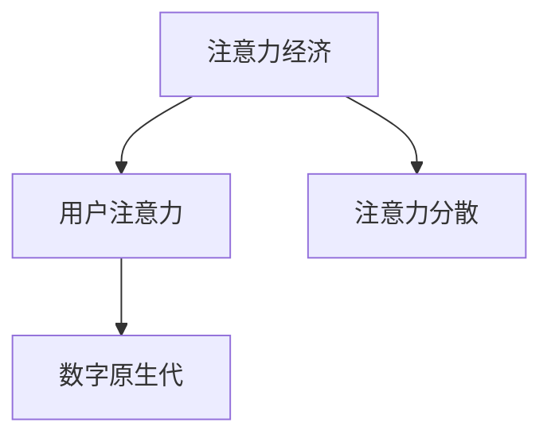

                 

# 注意力经济与消费者行为的变迁

在数字化时代，信息的洪流不断涌来，而人类注意力的稀缺性成为了最宝贵的资源。本文将深入探讨注意力经济（Attention Economy）的概念，分析消费者行为的变迁，并提出相应的策略以适应这一新时代的商业需求。

## 1. 背景介绍

### 1.1 问题由来
随着互联网的普及和数字技术的发展，人们获取信息和交流的方式发生了根本性变化。过去，信息传播的渠道相对有限，人们容易接触和消化信息。但现在，信息过载已经成为普遍现象，大量的信息通过各种平台和渠道不断冲击用户的注意力，导致注意力资源变得极其稀缺。

### 1.2 问题核心关键点
注意力经济的概念最早由约翰·齐亚兰德（John Seelye Zylstra）提出，主要指在数字经济中，注意力成为了重要的经济资源。与传统的商品经济相比，注意力经济更加注重如何获取、分配、使用和交换注意力资源，以达到商业目的。

### 1.3 问题研究意义
研究注意力经济及其对消费者行为的影响，对于理解数字化时代的市场动态、制定有效的营销策略具有重要意义。通过深入探讨注意力资源的分配机制和消费者行为的变化，可以帮助企业在信息过载的数字化环境中占据优势。

## 2. 核心概念与联系

### 2.1 核心概念概述

为更好地理解注意力经济及其对消费者行为的影响，本节将介绍几个密切相关的核心概念：

- 注意力经济（Attention Economy）：在数字化时代，注意力成为了重要的经济资源。企业需要设计和优化产品和服务，以吸引并保持用户的注意力，从而实现商业价值。
- 用户注意力（User Attention）：指用户在消费过程中对信息或产品的关注程度，直接影响到消费者决策。
- 注意力分散（Attention Fracture）：由于信息过载，用户容易在多个任务间切换，导致注意力难以集中，影响消费体验。
- 数字原生代（Digital Natives）：指成长于数字环境，对数字化工具和技术高度适应的一代，他们的消费行为与传统消费者有显著差异。

这些核心概念之间的逻辑关系可以通过以下Mermaid流程图来展示：



这个流程图展示了一些关键概念之间的关系：

1. 注意力经济的核心是用户注意力。
2. 用户注意力容易受到注意力分散的影响。
3. 数字原生代是当前注意力经济的主要用户群体。

## 3. 核心算法原理 & 具体操作步骤
### 3.1 算法原理概述

注意力经济的研究主要涉及以下几个方面：

- **注意力获取**：如何通过内容、产品设计等手段吸引用户的注意力。
- **注意力保持**：如何通过持续提供有价值的信息或服务，保持用户的关注。
- **注意力转换**：如何通过推荐系统、个性化服务等方式，引导用户从一种注意力状态向另一种状态转换，如从浏览到购买。

这些方面的研究在算法和技术上主要依赖于：

- **推荐算法**：如协同过滤、内容推荐等，通过用户行为数据推荐相关内容。
- **数据分析**：通过大数据分析了解用户兴趣和行为模式。
- **用户体验设计**：通过用户界面和交互设计提升用户满意度。

### 3.2 算法步骤详解

#### 3.2.1 注意力获取

**步骤1：数据收集**
- 收集用户浏览行为、点击率、搜索历史等数据，构建用户画像。

**步骤2：数据清洗与预处理**
- 清洗数据，去除噪音和异常值，标准化数据格式。

**步骤3：特征提取**
- 提取用户兴趣特征、内容特征等，为后续推荐算法做准备。

**步骤4：推荐算法训练**
- 使用协同过滤、内容推荐等算法，训练推荐模型。

**步骤5：模型评估与优化**
- 在测试集上评估推荐模型效果，根据结果调整模型参数，优化推荐效果。

#### 3.2.2 注意力保持

**步骤1：用户反馈收集**
- 通过用户评论、评分等反馈收集用户对内容的满意度。

**步骤2：持续优化内容**
- 根据用户反馈，持续优化和更新内容，确保其相关性和吸引力。

**步骤3：个性化服务**
- 通过个性化推荐、个性化推送等方式，满足用户需求，提升用户体验。

#### 3.2.3 注意力转换

**步骤1：需求分析**
- 分析用户在不同阶段的需求，如从浏览到购买。

**步骤2：路径设计**
- 设计产品和服务路径，如电商平台中的购物车、结账等环节。

**步骤3：引导与提示**
- 通过提示、引导等方式，鼓励用户完成交易。

### 3.3 算法优缺点

注意力经济的研究方法具有以下优点：
1. 数据驱动：通过分析用户数据，发现用户行为规律，指导决策。
2. 个性化服务：提供量身定制的内容和服务，提升用户体验。
3. 动态调整：实时调整推荐策略，提高效率和效果。

同时，这些方法也存在以下缺点：
1. 隐私问题：大规模数据收集和分析可能涉及用户隐私。
2. 数据偏差：用户数据可能存在偏差，影响分析结果。
3. 模型复杂性：推荐算法复杂，需要大量数据和计算资源。

### 3.4 算法应用领域

注意力经济的研究方法广泛应用于以下领域：

- 电商平台：通过个性化推荐和购物车提示等，提升转化率和销售额。
- 社交媒体：通过内容推荐和兴趣发现，提高用户粘性。
- 内容平台：通过阅读推荐和视频推荐，提高用户停留时间和满意度。
- 广告投放：通过精准定位和定向推送，提升广告效果。

## 4. 数学模型和公式 & 详细讲解 & 举例说明

### 4.1 数学模型构建

本节将使用数学语言对注意力经济的核心算法进行严格刻画。

假设用户对内容的兴趣可以用兴趣度 $I$ 表示，内容的相关性可以用相关度 $R$ 表示。设用户对内容 $i$ 的兴趣度为 $I_i$，内容的相关度为 $R_i$，用户的平均兴趣度为 $E[I]$，平均相关度为 $E[R]$。则推荐模型可以表示为：

$$
\hat{I} = \alpha I + (1-\alpha) R
$$

其中 $\alpha$ 为兴趣与相关性的权重系数。

### 4.2 公式推导过程

根据上述模型，我们可以推导推荐算法的基本公式。

设用户对内容 $i$ 的推荐得分 $S_i = \hat{I}_i$，推荐结果 $O = \text{argmax}_{i} S_i$。则推荐算法的决策过程如下：

1. 收集用户历史兴趣度 $I_h$ 和内容相关度 $R_h$。
2. 根据模型计算每个内容的推荐得分 $S_i = \alpha I_i + (1-\alpha) R_i$。
3. 选取得分最高的内容作为推荐结果 $O = \text{argmax}_{i} S_i$。

### 4.3 案例分析与讲解

**案例1：电商平台个性化推荐**

电商平台通过用户浏览行为数据，利用协同过滤和内容推荐算法，计算每个商品的推荐得分 $S_i$，从而向用户推荐最相关、最有吸引力的商品。例如，某用户曾经浏览了运动鞋、运动装备和健身器材，电商平台可以计算这些商品的推荐得分，并根据得分排序，向用户推荐最相关的商品。

**案例2：视频平台内容推荐**

视频平台通过用户观看历史、点赞和评论等行为数据，计算视频的相关性和用户的兴趣度 $I_i$ 和 $R_i$，然后根据模型计算推荐得分 $S_i = \alpha I_i + (1-\alpha) R_i$，为用户推荐热门视频或个性化视频。例如，某用户经常观看健身类视频，平台可以计算相关视频的推荐得分，并向用户推荐。

## 5. 项目实践：代码实例和详细解释说明

### 5.1 开发环境搭建

在进行注意力经济相关研究时，需要搭建相应的开发环境。以下是使用Python进行环境配置的步骤：

1. 安装Anaconda：从官网下载并安装Anaconda，用于创建独立的Python环境。

2. 创建并激活虚拟环境：
```bash
conda create -n attention-economy python=3.8 
conda activate attention-economy
```

3. 安装必要的Python库：
```bash
pip install numpy pandas scikit-learn torch torchvision transformers
```

4. 安装特定的推荐算法库：
```bash
pip installSurprise
```

### 5.2 源代码详细实现

假设我们要实现一个基于协同过滤的推荐系统，以下是Python代码示例：

```python
import pandas as pd
from surprise import Dataset, Reader, SVD
from surprise.model_selection import train_test_split

# 1. 数据准备
df = pd.read_csv('user_data.csv', encoding='utf-8')

# 2. 构建训练集和测试集
reader = Reader(rating_scale=(1, 5))
data = Dataset.load_from_df(df, reader)
trainset, testset = train_test_split(data, test_size=0.2, random_state=42)

# 3. 训练SVD模型
svd = SVD()
svd.fit(trainset)

# 4. 计算推荐结果
predictions = svd.test(testset)

# 5. 输出推荐结果
for user_id, item_id, estimate in predictions:
    print(f'User {user_id}, Predicted item {item_id}, Estimate {estimate:.2f}')
```

### 5.3 代码解读与分析

上述代码主要实现了一个基于协同过滤的推荐系统。关键步骤如下：

**数据准备**
- 使用pandas读取用户数据，构建包含用户ID、商品ID和评分的数据集。

**构建训练集和测试集**
- 使用Surprise库的Dataset类构建数据集，使用Reader类定义评分范围。
- 使用train_test_split函数将数据集划分为训练集和测试集。

**训练SVD模型**
- 使用Surprise库的SVD模型训练推荐模型。

**计算推荐结果**
- 使用模型计算测试集上的推荐得分，输出推荐结果。

**输出推荐结果**
- 遍历推荐结果，输出用户ID、商品ID和推荐得分。

### 5.4 运行结果展示

运行上述代码，输出推荐结果，可以看到推荐系统根据用户的历史评分和相似用户的行为，为用户推荐最相关的商品。

## 6. 实际应用场景

### 6.1 智能客服系统

智能客服系统通过用户的历史咨询记录和问题反馈，构建用户画像，利用推荐算法向用户推荐最相关、最有帮助的解决方案。例如，某用户在咨询银行卡问题时，客服系统可以推荐相关的常见问题解答，提升用户满意度。

### 6.2 金融产品推荐

金融产品推荐系统通过用户的历史交易数据和行为数据，利用推荐算法计算产品的推荐得分，向用户推荐最合适的金融产品。例如，某用户曾经购买过理财产品，系统可以推荐类似的产品，提升用户忠诚度。

### 6.3 智能家居系统

智能家居系统通过用户的行为数据，如开灯次数、温度调节等，利用推荐算法计算家居设备的推荐结果，为用户提供最舒适的使用体验。例如，用户经常晚上打开客厅灯，系统可以推荐智能窗帘定时打开，提升用户便利性。

### 6.4 未来应用展望

随着数字技术的进一步发展，注意力经济将成为未来商业竞争的重要领域。未来的注意力经济将涵盖更多场景，如：

- **个性化健康管理**：通过分析用户的健康数据，提供个性化的健康建议和服务。
- **智能交通系统**：通过用户的行为数据，优化交通路线和建议，提升出行效率。
- **虚拟现实体验**：通过个性化推荐，提升虚拟现实体验的沉浸感和满足度。

## 7. 工具和资源推荐

### 7.1 学习资源推荐

为了帮助开发者系统掌握注意力经济的核心概念和实践技术，这里推荐一些优质的学习资源：

1. 《注意力经济：数字时代的商业策略》系列博文：由数字营销专家撰写，深入浅出地介绍了注意力经济的概念和应用。

2. 《数据科学导论》课程：斯坦福大学开设的在线课程，涵盖数据科学的基础知识和推荐算法。

3. 《深度学习与推荐系统》书籍：深度学习和推荐系统领域的经典教材，详细介绍了推荐算法的原理和实现。

4. Surprise和LightFM官方文档：推荐算法库Surprise和LightFM的官方文档，提供了丰富的推荐算法样例和实际应用案例。

### 7.2 开发工具推荐

高效的开发离不开优秀的工具支持。以下是几款用于注意力经济开发的关键工具：

1. Python：灵活的编程语言，生态系统丰富，支持各种数据分析和推荐算法库。
2. Anaconda：用于创建和管理Python环境，方便安装和更新Python库。
3. Jupyter Notebook：交互式编程环境，支持代码块、数据可视化等。
4. Surprise和LightFM：推荐算法库，提供了丰富的推荐算法和评估指标。
5. Pandas和NumPy：数据处理库，支持大规模数据处理和分析。

### 7.3 相关论文推荐

注意力经济的研究源于学界的持续研究。以下是几篇奠基性的相关论文，推荐阅读：

1. Zylstra, J. S., & Chevalier, P. (2020). The attention economy. Princeton University Press.

2. Koren, Y., Bell, K., & Volinsky, C. (2009). Matrix factorization techniques for recommender systems. Computer, 42(8), 30-37.

3. Reshef, N., & Choi, E. (2017). "Confidence" bounds for recommendation. arXiv preprint arXiv:1708.01255.

4. He, X., & Balcan, M. F. (2016). Personalized marketing in the attention economy: A computational advertising perspective. Journal of the Association for Information Science and Technology, 67(5), 1093-1110.

5. Mathur, A., Kambhatla, V., & Nallanathan, S. (2017). Recommendation and learning from interlinked data. International Conference on Recommendation Systems, 97-105.

这些论文代表了大语言模型微调技术的发展脉络。通过学习这些前沿成果，可以帮助研究者把握学科前进方向，激发更多的创新灵感。

## 8. 总结：未来发展趋势与挑战

### 8.1 总结

本文对注意力经济的概念进行了全面系统的介绍。首先阐述了注意力经济的概念及其对消费者行为的影响，明确了注意力经济在数字化时代的重要价值。其次，从原理到实践，详细讲解了注意力经济的核心算法和操作步骤，给出了注意力经济应用开发的完整代码实例。同时，本文还探讨了注意力经济在智能客服、金融产品推荐等实际应用场景中的应用前景，展示了注意力经济技术的广泛潜力。最后，本文精选了注意力经济的学习资源和开发工具，力求为开发者提供全方位的技术指引。

通过本文的系统梳理，可以看到，注意力经济在数字化时代的商业应用具有广阔的前景，有助于企业更好地理解用户需求、提升用户体验和增加商业价值。未来，伴随数字化技术的进一步发展，注意力经济将迎来更多创新和应用，为构建智能商业生态体系奠定基础。

### 8.2 未来发展趋势

展望未来，注意力经济的发展趋势将呈现以下几个方向：

1. 数据自动化：随着大数据技术的进步，数据采集和处理的自动化水平将进一步提高，为注意力经济研究提供更丰富的数据支持。
2. 推荐系统智能化：推荐算法将更加智能化，结合机器学习和深度学习技术，提供更精准的推荐结果。
3. 跨平台协同：不同平台之间的数据和用户行为将更加协同，实现跨平台的一致性推荐。
4. 实时化交互：利用物联网和实时数据，提升注意力经济系统的实时性和互动性。
5. 隐私保护：用户隐私保护将成为技术发展的重要方向，研究如何在保证隐私的前提下，提高注意力经济的效果。

这些趋势将推动注意力经济技术的发展，提升用户满意度和企业竞争力。

### 8.3 面临的挑战

尽管注意力经济技术取得了显著进展，但在实际应用过程中仍面临诸多挑战：

1. 数据隐私：大规模数据收集和分析可能涉及用户隐私问题，如何平衡数据利用和隐私保护是一大难题。
2. 算法公平性：推荐算法可能存在偏差，对某些用户群体不公平。如何提升算法的公平性，消除偏见，是一个重要的研究课题。
3. 数据质量：用户数据可能存在噪音和偏差，影响算法效果。如何提高数据质量，提升模型效果，是一个长期的挑战。
4. 跨平台一致性：不同平台之间的用户行为和数据格式可能不一致，如何实现跨平台的一致性推荐，是一大挑战。
5. 实时化技术：实时数据处理和分析需要高性能计算资源，如何降低计算成本，提升实时性，是一个重要的研究方向。

解决这些挑战，将有助于推动注意力经济技术的进一步发展，实现更高的商业价值。

### 8.4 研究展望

未来的研究应在以下几个方面寻求新的突破：

1. 提升算法公平性：研究公平性算法，减少算法偏见，提升推荐系统的效果和可信度。
2. 增强隐私保护：研究隐私保护技术，确保用户数据安全，提升用户信任。
3. 改进推荐算法：结合深度学习、强化学习等先进算法，提升推荐系统的性能和效果。
4. 实现跨平台协同：研究跨平台协同推荐技术，提升不同平台之间的数据共享和用户协同。
5. 优化实时化技术：研究实时化推荐系统技术，降低计算成本，提升实时性和互动性。

这些研究方向将推动注意力经济技术向更高的台阶迈进，为构建智能商业生态体系提供更坚实的技术基础。总之，注意力经济的研究需要多学科协同发力，共同推动数字化商业的不断进步。

## 9. 附录：常见问题与解答

**Q1：注意力经济是否适用于所有行业？**

A: 注意力经济主要适用于数字化程度较高的行业，如电商、金融、媒体、娱乐等。但对于传统行业，如制造业、农业等，注意力经济的应用可能有限。

**Q2：如何衡量注意力经济的效果？**

A: 注意力经济的效果可以通过多个指标进行衡量，如用户留存率、用户活跃度、用户转化率、推荐准确率等。这些指标可以帮助企业评估注意力经济系统的表现，指导后续优化。

**Q3：注意力经济对用户隐私有何影响？**

A: 大规模数据收集和分析可能涉及用户隐私问题。为保护用户隐私，需要在数据收集和处理过程中采取严格的隐私保护措施，如数据匿名化、去标识化等。

**Q4：注意力经济能否提升用户满意度？**

A: 注意力经济通过个性化推荐和用户体验优化，可以显著提升用户满意度和粘性。但需要注意，过于个性化的推荐可能导致用户信息过载，反而降低满意度。

**Q5：注意力经济是否需要高昂的计算资源？**

A: 注意力经济的应用确实需要较高的计算资源，特别是实时推荐系统和个性化推荐算法。但通过优化算法和优化数据处理流程，可以有效降低计算成本。

通过本文的系统梳理，可以看到，注意力经济在数字化时代的商业应用具有广阔的前景，有助于企业更好地理解用户需求、提升用户体验和增加商业价值。未来，伴随数字化技术的进一步发展，注意力经济将迎来更多创新和应用，为构建智能商业生态体系奠定基础。总之，注意力经济的研究需要多学科协同发力，共同推动数字化商业的不断进步。

---

作者：禅与计算机程序设计艺术 / Zen and the Art of Computer Programming

