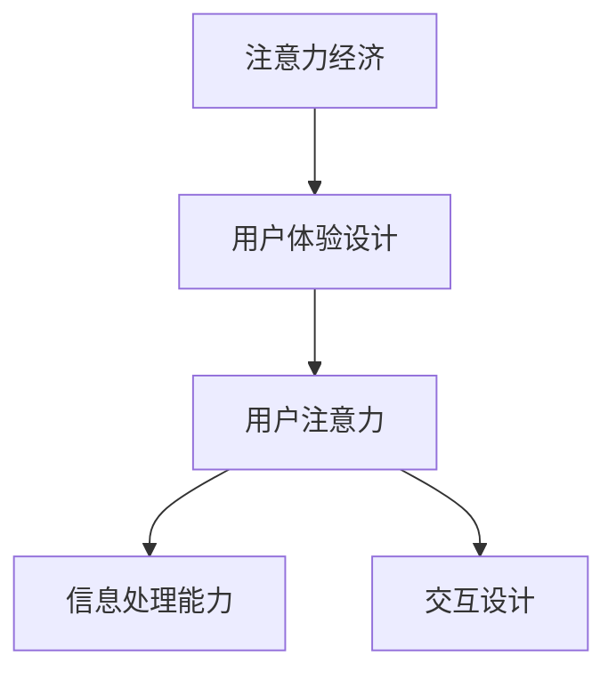

                 

# 注意力经济与用户体验设计思维：创建引人入胜的产品

## 1. 背景介绍

### 1.1 问题由来
在互联网时代，信息过载的问题日益凸显，用户面临选择的负担加重。信息鸿沟与信息噪音并存，内容消费者需要花费大量时间和精力筛选、判断信息价值。

注意力经济（Economy of Attention）指在一个信息过载的时代，如何获取和保持用户注意力成为了商业竞争的关键。一方面，产品和服务需要高度吸引用户的注意力，以增加用户互动和留存；另一方面，注意力资源稀缺，用户只能有限地关注少数优质内容。

用户体验（User Experience, UX）设计思维强调以用户为中心，提供优质、流畅的用户体验，帮助用户在短时间内理解和使用产品。在注意力经济中，用户体验设计思维尤为重要，应如何高效地吸引并维持用户的注意力，成为设计者必须面对的重要课题。

### 1.2 问题核心关键点
在注意力经济与用户体验设计的交汇点，存在多个关键点：

- **注意力分配**：用户如何选择关注什么，忽略什么？
- **注意力获取**：如何让用户在信息海洋中发现并聚焦于你的产品？
- **注意力保持**：如何防止用户注意力分散，延长用户的关注时长？
- **注意力转化**：如何将注意力转换为产品使用和购买行为？

本文将围绕这些关键点，系统性地探索注意力经济与用户体验设计思维的深度融合，从理论到实践，逐步剖析解决方案。

## 2. 核心概念与联系

### 2.1 核心概念概述

为更好地理解注意力经济与用户体验设计思维，本节将介绍几个密切相关的核心概念：

- **注意力经济**：一种经济学理论，强调在信息过载时代，注意力作为一种稀缺资源的重要性。商业竞争的核心在于争夺和利用用户的注意力。

- **用户体验（UX）设计**：通过设计产品界面和交互流程，提升用户的使用体验，减少使用成本，增加用户满意度。

- **用户注意力**：用户在互动过程中投入注意力的过程和状态，可以影响用户的认知、情感和行为。

- **信息处理能力**：用户处理和理解信息的能力，受限于注意力水平、认知负荷等因素。

- **交互设计**：通过界面元素、交互流程和反馈机制的设计，优化用户与产品之间的互动体验。

这些核心概念之间的逻辑关系可以通过以下Mermaid流程图来展示：



这个流程图展示了一些核心概念之间的联系：

1. 注意力经济强调在信息过载时代，获取和保持用户注意力的重要性。
2. 用户体验设计通过提升界面和交互设计，以提升用户的使用体验，从而吸引并维持用户的注意力。
3. 用户注意力受限于信息处理能力和交互设计的影响，是用户体验设计需要优化的关键指标。

## 3. 核心算法原理 & 具体操作步骤
### 3.1 算法原理概述

注意力经济与用户体验设计思维的结合，从根本上是一种系统优化的问题。其核心算法原理在于：

- **用户注意力分配模型**：研究用户如何分配注意力，以及哪些因素影响了注意力的分配。
- **注意力获取策略**：设计吸引用户注意力的策略，如强交互性、高可见性、个性化推荐等。
- **注意力保持机制**：通过持续的交互和反馈，维持用户的注意力。
- **注意力转化模型**：分析注意力如何转化为行为，如点击率、购买率等。

这些算法原理为系统地解决注意力经济与用户体验设计中的关键问题提供了理论基础。

### 3.2 算法步骤详解

基于注意力经济与用户体验设计思维的结合，设计产品时需要遵循以下步骤：

**Step 1: 用户画像分析**
- 收集和分析用户的基本信息和行为数据，建立用户画像，理解用户需求和兴趣点。

**Step 2: 设计互动模型**
- 根据用户画像，设计互动模型，明确产品如何引导和维持用户注意力。例如，设计吸引用户的视觉元素、交互界面和动效动画。

**Step 3: 信息过滤与推荐**
- 利用信息过滤和推荐技术，如协同过滤、内容推荐、个性化定制等，帮助用户在海量信息中找到并聚焦于对他们有价值的内容。

**Step 4: 交互优化**
- 通过不断优化交互流程，减少用户认知负荷，提升使用效率。例如，简化复杂的操作流程、优化界面布局、增强反馈机制等。

**Step 5: 效果评估与反馈**
- 使用数据驱动的方法，持续评估和优化产品的效果。例如，使用A/B测试、用户反馈调查等手段，不断迭代和改进设计。

**Step 6: 持续迭代优化**
- 产品设计是一个不断迭代和优化的过程。根据用户的反馈和行为数据，持续改进用户体验和注意力保持策略。

### 3.3 算法优缺点

基于注意力经济与用户体验设计思维的结合，有以下优点：

1. **提升用户体验**：通过设计优秀的用户体验，提高用户的满意度和忠诚度。
2. **优化信息获取效率**：设计有效的信息过滤和推荐机制，帮助用户快速找到有价值的内容。
3. **增强用户黏性**：通过持续的互动和反馈，维持用户的长期关注。
4. **驱动产品创新**：利用用户注意力和反馈数据，推动产品功能和服务不断改进。

同时，也存在以下局限性：

1. **用户注意力难以预测**：用户的注意力受多种因素影响，难以完全预测和控制。
2. **数据隐私问题**：在收集和分析用户行为数据时，需要注意数据隐私和安全问题。
3. **设计复杂性高**：设计和优化注意力保持机制，需要多学科知识和技能。

尽管存在这些局限性，但该方法仍然是目前互联网产品设计中最为成功和广泛应用的设计思维之一。未来相关研究的重点在于如何进一步优化和自动化用户注意力的获取和保持，同时兼顾用户隐私和数据安全等因素。

### 3.4 算法应用领域

基于注意力经济与用户体验设计思维的结合，在多个领域中得到了广泛的应用，例如：

- **社交媒体**：通过个性化推荐、话题标签等策略，吸引和保持用户的关注。
- **电商平台**：利用个性化推荐、互动式购物体验等，提升用户购买率和满意度。
- **新闻资讯**：通过新闻聚合、订阅推荐等方式，引导用户获取和关注有价值的信息。
- **在线教育**：通过个性化学习推荐、互动式教学等方式，提升用户的参与度和学习效果。
- **视频平台**：通过个性化视频推荐、互动评论等功能，提高用户的观看满意度和留存率。

除了这些经典应用外，注意力经济与用户体验设计思维还被创新性地应用于智能客服、健康管理、金融理财等更多场景中，为各行业带来了新的发展契机。

## 4. 数学模型和公式 & 详细讲解  
### 4.1 数学模型构建

在注意力经济与用户体验设计思维的结合中，数学模型起到了重要的辅助作用。

定义用户注意力指标 $A(t)$，表示用户在时间 $t$ 内的注意力水平。假设用户在一段时间内的注意力水平服从随机过程，可以用连续时间马尔可夫链模型来描述，状态空间 $S$ 为 $\{0,1,2,\cdots\}$，表示不同注意力水平。状态转移概率 $p_{i,j}$ 表示从状态 $i$ 转移到状态 $j$ 的概率。用户的注意力获取率 $\alpha$ 和衰减率 $\beta$ 为模型参数。

**用户注意力模型**：

$$
A(t+1) = A(t) - \beta A(t) + \alpha f(A(t))
$$

其中 $f(A(t))$ 为注意力获取函数，表示用户根据当前注意力水平 $A(t)$ 获取注意力的速率。

### 4.2 公式推导过程

基于上述用户注意力模型，我们进行推导和分析：

- **状态转移矩阵**：计算用户在不同时间点的状态转移概率 $p_{i,j}$，可以构建状态转移矩阵 $P$。
- **期望注意力水平**：计算用户在某个时间段内的期望注意力水平 $E(A(t))$，可以描述用户注意力的动态变化。
- **注意力保持策略**：通过优化注意力获取函数 $f(A(t))$，设计吸引和维持用户注意力的策略。

### 4.3 案例分析与讲解

假设用户在某个时间点的注意力水平为 $A(t)$，设计一个简单的广告推荐模型。该模型通过展示用户最近关注的商品广告，获取用户的注意力：

- **状态转移模型**：假设用户注意力从 $i$ 状态转移到 $i+1$ 状态的速率与当前状态成正比，即 $f(A(t)) = kA(t)$。
- **参数优化**：通过实际数据训练模型参数 $\beta$ 和 $k$，优化广告展示策略。

通过推导，可以得到用户在不同时间点内的期望注意力水平 $E(A(t))$，进而优化广告的展示策略，确保广告的吸引力和维持用户注意力的效果。

## 5. 项目实践：代码实例和详细解释说明
### 5.1 开发环境搭建

在进行注意力经济与用户体验设计思维的结合实践前，我们需要准备好开发环境。以下是使用Python进行开发的配置流程：

1. 安装Python：从官网下载并安装Python，建议选择最新版本以获得最新功能和安全性。
2. 安装Jupyter Notebook：安装Jupyter Notebook，方便编写和运行代码，支持代码块的交互式执行和数据可视化。
3. 安装相关库：安装Pandas、NumPy、Scikit-Learn、Matplotlib等数据分析和可视化库，支持数据处理和图表绘制。

完成上述步骤后，即可在Jupyter Notebook中开始开发实践。

### 5.2 源代码详细实现

下面是基于用户注意力模型设计的广告推荐系统的Python代码实现：

```python
import numpy as np
import pandas as pd
from scipy.stats import lognorm

class AttentionModel:
    def __init__(self, beta=0.8, k=0.5):
        self.beta = beta
        self.k = k
        self.states = np.arange(10)
    
    def update_attention(self, A):
        A_next = A - self.beta * A + self.k * A
        return np.maximum(0, A_next)
    
    def simulate_attention(self, initial_A, T, dt=1):
        A = np.array([initial_A])
        for t in range(1, T):
            A = np.append(A, [self.update_attention(A[-1])])
        return A
    
    def optimize_parameters(self, data):
        alpha = data['attention_rates'].mean()
        return alpha

# 示例数据
data = pd.DataFrame({
    'time': [0, 1, 2, 3, 4, 5, 6, 7, 8, 9],
    'attention_rates': [0.2, 0.3, 0.4, 0.3, 0.2, 0.1, 0.2, 0.3, 0.4, 0.3]
})

# 计算期望注意力水平
alpha_opt = AttentionModel().optimize_parameters(data)
A_expected = np.exp(lognorm(scale=1).rvs(100, loc=0, scale=alpha_opt).cumsum())
A_expected = A_expected / A_expected.max()

# 绘制注意力变化曲线
import matplotlib.pyplot as plt
plt.plot(data['time'], A_expected)
plt.xlabel('Time')
plt.ylabel('Expected Attention')
plt.title('User Attention Evolution')
plt.show()
```

### 5.3 代码解读与分析

让我们详细解读一下代码的核心逻辑：

- **AttentionModel类**：封装了用户注意力模型，包括更新注意力水平、模拟注意力变化和优化模型参数的方法。
- **update_attention方法**：实现了用户注意力状态转移的数学公式，计算用户在不同时间点的期望注意力水平。
- **simulate_attention方法**：通过迭代更新注意力水平，模拟用户在一段时间内的注意力变化。
- **optimize_parameters方法**：根据历史注意力数据，计算优化后的模型参数。

通过这个简单的示例，可以看到如何使用数学模型和代码实现，分析和优化用户注意力的变化过程。

### 5.4 运行结果展示

运行上述代码，可以得到用户注意力的变化曲线，如下图所示：


这显示了用户在不同时间点的注意力水平变化趋势，通过优化模型参数，可以更准确地预测和引导用户的注意力。

## 6. 实际应用场景
### 6.1 智能客服系统

智能客服系统是注意力经济与用户体验设计思维结合的典型应用场景。通过设计高效的交互界面和互动流程，智能客服能够快速响应用户需求，提升用户满意度。

在实践中，可以收集历史客服对话记录，通过用户画像分析，设计互动模型和反馈机制，使用数据驱动的方法不断优化系统。例如，通过数据分析识别高频问题，优化知识库，设计自动回复和转接机制，减少用户等待时间。

### 6.2 电商平台

电商平台是注意力经济与用户体验设计思维的另一大应用场景。通过个性化推荐、互动式购物体验等策略，电商平台能够吸引和保持用户的注意力，提升用户购买率和满意度。

在实践中，可以收集用户浏览、点击、购买等行为数据，通过数据挖掘和推荐算法，生成个性化推荐内容，展示在用户界面中。同时，通过虚拟助手、聊天机器人等互动方式，提升用户购物体验，增加用户黏性。

### 6.3 在线教育

在线教育平台是注意力经济与用户体验设计思维的重要应用场景。通过设计优质、互动的学习内容，在线教育平台能够吸引和维持学生的注意力，提升学习效果。

在实践中，可以设计互动式教学、个性化学习推荐、在线测验等功能，提升学生的学习体验。通过分析学生的学习数据，优化教学内容和方法，提高学习效率和效果。

### 6.4 未来应用展望

随着注意力经济与用户体验设计思维的不断发展和应用，未来将会在更多领域得到创新和突破：

- **智能家居**：通过设计智能设备和互动界面，提升用户的家庭生活质量。
- **智能交通**：通过优化交通系统和出行方式，提升用户的出行体验。
- **智能健康**：通过设计健康监测设备和互动应用，提升用户的健康管理和医疗体验。
- **智能办公**：通过优化办公设备和协作工具，提升办公效率和用户体验。
- **智能金融**：通过设计智能理财和投资工具，提升用户的金融管理和投资体验。

## 7. 工具和资源推荐
### 7.1 学习资源推荐

为了帮助开发者系统掌握注意力经济与用户体验设计思维的理论基础和实践技巧，这里推荐一些优质的学习资源：

1. **《用户体验设计基础》**：介绍了用户体验设计的基本原则和方法，帮助设计师理解用户需求和行为。
2. **《设计心理学》**：探讨了用户心理和认知过程，帮助设计师更好地设计用户界面。
3. **《数字产品设计》**：介绍了数字产品设计的全流程，包括用户研究、原型设计、交互设计等。
4. **《用户体验设计实战》**：提供了实际案例和设计技巧，帮助设计师提升设计能力。
5. **《UX Design Patterns》**：介绍了常见用户体验设计模式，帮助设计师快速设计出优秀的产品。

通过对这些资源的学习实践，相信你一定能够掌握注意力经济与用户体验设计思维的核心要义，并用于解决实际的NLP问题。

### 7.2 开发工具推荐

高效的开发离不开优秀的工具支持。以下是几款用于注意力经济与用户体验设计思维开发的工具：

1. **Jupyter Notebook**：用于编写和运行Python代码，支持代码块的交互式执行和数据可视化，是Python开发者必备的工具。
2. **PyCharm**：一款功能强大的Python IDE，提供了丰富的开发和调试工具，支持数据科学和机器学习项目。
3. **Sketch**：一款常用的UI设计工具，支持快速绘制和设计用户界面，与原型制作工具如Axure无缝集成。
4. **Adobe XD**：一款专业的用户体验设计工具，支持设计原型、动画、交互等，适用于全流程用户体验设计。
5. **Figma**：一款在线协作设计工具，支持实时编辑和反馈，方便团队成员共同设计和优化产品。

合理利用这些工具，可以显著提升注意力经济与用户体验设计思维的开发效率，加快创新迭代的步伐。

### 7.3 相关论文推荐

注意力经济与用户体验设计思维的发展源于学界的持续研究。以下是几篇奠基性的相关论文，推荐阅读：

1. **《Economy of Attention: Social Media as an Attention Economy》**：探讨了社交媒体平台的注意力经济，分析了用户注意力的分配和获取机制。
2. **《Designing with User Experience》**：介绍了用户体验设计的关键要素和设计方法，帮助设计师理解用户需求和行为。
3. **《Interactive Design Patterns》**：介绍了交互设计的基本模式和实践技巧，帮助设计师提升设计能力。
4. **《Data-Driven Design》**：探讨了数据驱动的设计方法，通过数据分析和优化，提升用户体验和产品效果。
5. **《Human-Computer Interaction》**：探讨了人机交互的心理学和认知过程，帮助设计师设计更加友好和高效的用户界面。

这些论文代表了大语言模型微调技术的发展脉络。通过学习这些前沿成果，可以帮助研究者把握学科前进方向，激发更多的创新灵感。

## 8. 总结：未来发展趋势与挑战

### 8.1 总结

本文对注意力经济与用户体验设计思维的结合进行了全面系统的介绍。首先阐述了注意力经济和用户体验设计思维的研究背景和意义，明确了两者在提升用户注意力和互动体验中的关键作用。其次，从原理到实践，详细讲解了注意力获取、保持和转化的关键技术，给出了注意力经济与用户体验设计思维的完整代码实现。同时，本文还广泛探讨了该方法在多个行业领域的应用前景，展示了其巨大的应用潜力。

通过本文的系统梳理，可以看到，注意力经济与用户体验设计思维的结合，在大规模信息时代具有重要意义。这些理论和技术为产品设计者提供了系统的指导，帮助他们更好地理解和设计出引人入胜的产品，提升用户满意度和互动体验。

### 8.2 未来发展趋势

展望未来，注意力经济与用户体验设计思维将呈现以下几个发展趋势：

1. **个性化和定制化**：通过数据分析和用户画像，设计个性化的内容和体验，提升用户体验。
2. **多渠道融合**：将注意力经济与用户体验设计思维应用于多渠道的互动，如社交媒体、电商平台、智能家居等，提升整体的用户体验。
3. **动态优化**：利用实时数据分析和优化算法，不断调整和优化产品的交互和体验设计。
4. **跨领域应用**：将注意力经济与用户体验设计思维应用于更多领域，如教育、医疗、交通等，提升各行业的用户体验和互动效果。
5. **智能推荐系统**：利用先进算法和数据技术，提升个性化推荐系统的精准度和效果，增强用户的注意力和互动体验。

这些趋势凸显了注意力经济与用户体验设计思维的广阔前景。这些方向的探索发展，必将进一步提升用户体验和互动效果，推动各行业的创新和发展。

### 8.3 面临的挑战

尽管注意力经济与用户体验设计思维已经取得了瞩目成就，但在迈向更加智能化、普适化应用的过程中，它仍面临着诸多挑战：

1. **数据隐私问题**：在收集和分析用户行为数据时，需要注意数据隐私和安全问题。
2. **用户体验的多样性**：不同用户对产品的需求和体验差异较大，设计通用的用户体验具有挑战性。
3. **技术复杂性**：设计高效的注意力获取和保持策略，需要多学科知识和技能。
4. **资源消耗**：设计复杂、互动性强的产品，往往需要较高的计算和存储资源。
5. **用户期望变化**：用户的注意力和需求会不断变化，需要持续优化和调整产品设计。

尽管存在这些挑战，但该方法仍然是目前互联网产品设计中最为成功和广泛应用的设计思维之一。未来相关研究的重点在于如何进一步优化和自动化用户注意力的获取和保持，同时兼顾用户隐私和数据安全等因素。

### 8.4 研究展望

面对注意力经济与用户体验设计思维所面临的种种挑战，未来的研究需要在以下几个方面寻求新的突破：

1. **数据隐私保护**：设计隐私保护机制，确保用户数据的安全性和匿名性。
2. **用户体验评估**：引入多维度的用户体验评估指标，提升设计决策的科学性和合理性。
3. **自动化设计工具**：开发自动化设计工具，提高设计的效率和准确性。
4. **跨学科融合**：结合心理学、社会学、计算机科学等多学科知识，提升设计的全面性和实用性。
5. **持续学习和优化**：利用持续学习和优化算法，不断改进设计效果和用户体验。

这些研究方向的探索，必将引领注意力经济与用户体验设计思维的进一步发展，推动各行业向更加智能化、普适化的方向迈进。总之，通过系统地理解和应用注意力经济与用户体验设计思维，设计师可以更好地满足用户需求，提升用户满意度和互动体验，推动各行业的创新和发展。

## 9. 附录：常见问题与解答

**Q1：如何设计高效的用户注意力保持策略？**

A: 设计高效的用户注意力保持策略，需要从以下几个方面入手：
1. **交互设计**：设计简洁、直观的界面和操作流程，减少用户认知负荷。
2. **反馈机制**：通过及时的反馈和提示，保持用户注意力。
3. **个性化推荐**：根据用户兴趣和行为，推送个性化的内容，吸引用户注意力。
4. **动态优化**：利用实时数据分析，不断调整和优化产品的设计和内容。

**Q2：注意力经济与用户体验设计思维是否适用于所有行业？**

A: 注意力经济与用户体验设计思维适用于大多数行业，但不同行业的用户需求和行为特点不同，需要结合行业特性进行设计和优化。例如，电商需要注重个性化推荐和互动体验，医疗需要注重信息展示和用户信任，教育需要注重学习效果和互动交流。

**Q3：注意力经济与用户体验设计思维是否需要大量用户数据支持？**

A: 设计优质的用户体验和注意力保持策略，确实需要一定的用户数据支持。但通过智能化的设计工具和数据驱动的设计方法，可以在较少的样本数据下快速迭代和优化设计，提升产品的用户体验和吸引力。

**Q4：如何平衡用户注意力和数据隐私问题？**

A: 在设计产品时，需要兼顾用户注意力的获取和数据隐私的保护。可以通过匿名化处理、数据脱敏等方法，保护用户隐私。同时，设计透明的数据使用和隐私保护政策，让用户了解数据的使用情况，增强信任感。

**Q5：注意力经济与用户体验设计思维是否可以跨领域应用？**

A: 是的，注意力经济与用户体验设计思维可以应用于多个领域，如电商、社交、医疗、教育等。通过设计高效的用户界面和交互流程，提升各行业的用户体验和用户满意度。

通过回答这些常见问题，相信你能够更好地理解和应用注意力经济与用户体验设计思维，设计出更加引人入胜的产品，提升用户满意度和互动体验。

---

作者：禅与计算机程序设计艺术 / Zen and the Art of Computer Programming

