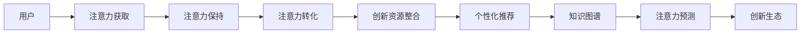

                 

# 注意力经济对企业创新管理的影响

> 关键词：注意力经济, 企业创新管理, 数据驱动, 个性化推荐, 知识图谱, 创新生态

## 1. 背景介绍

### 1.1 问题由来

在信息爆炸的时代，注意力成为了一种稀缺资源。随着数字媒体、社交网络、电子商务等互联网应用的发展，数据和信息的海量涌入使得人类面临前所未有的信息过载问题。在这种情况下，如何高效、精准地获取、分析和利用注意力成为了企业创新管理的核心课题。

注意力经济（Economy of Attention）这一概念最早由互联网分析家Newson提出，他强调在信息过载的时代，获取和维持用户注意力的能力将成为企业竞争力的关键。这种经济形态不仅影响着广告、媒体、娱乐等行业，也逐渐渗透到企业的创新管理中。

### 1.2 问题核心关键点

在企业创新管理中，注意力经济主要体现在以下几个关键点：

1. **用户注意力获取**：企业需要通过各种渠道吸引用户的注意，包括社交媒体、搜索引擎、邮件营销等。
2. **用户注意力保持**：一旦获取了用户的注意力，如何维持这种注意力，避免用户流失，是企业需要解决的另一个重要问题。
3. **用户注意力转化**：将用户的注意力转化为实际购买、订阅、注册等行为，是企业创新管理的最终目标。
4. **注意力数据应用**：通过分析用户注意力数据，企业可以了解用户行为，优化产品和服务，提升用户体验。
5. **创新资源整合**：企业可以借助注意力数据，整合内部资源和外部合作伙伴，推动跨部门、跨行业的协同创新。

### 1.3 问题研究意义

研究注意力经济对企业创新管理的影响，对于提升企业竞争力、优化产品和服务、推动创新生态系统建设具有重要意义：

1. 提升用户满意度：通过深入了解用户注意力行为，企业可以提供更加个性化的产品和服务，提高用户满意度和忠诚度。
2. 增强创新效率：利用注意力数据，企业可以更准确地识别市场需求，优化创新流程，提升创新速度和成功率。
3. 拓展市场空间：注意力经济使得企业可以精准定位目标用户，突破地域限制，开拓更广阔的市场空间。
4. 构建创新生态：企业可以通过跨领域合作，共享注意力资源，构建更加开放、协作、共赢的创新生态系统。
5. 强化竞争优势：在信息时代，谁能更好地利用注意力，谁就掌握了竞争的主动权。

## 2. 核心概念与联系

### 2.1 核心概念概述

在企业创新管理中，注意力经济涉及的核心概念包括：

- **用户注意力**：用户对于产品、服务、广告等的关注程度。
- **注意力分配**：用户将注意力分配到不同渠道和内容的比例。
- **注意力转化**：用户从关注到购买、订阅等行为的过程。
- **个性化推荐**：根据用户注意力行为，提供定制化的产品和服务。
- **知识图谱**：将用户注意力数据转化为结构化的知识模型，用于智能决策。
- **注意力预测**：利用机器学习算法，预测用户注意力行为。
- **创新生态**：企业通过注意力数据，与外部合作伙伴建立协作网络，形成创新联盟。

### 2.2 核心概念原理和架构的 Mermaid 流程图



这个流程图展示了注意力经济在企业创新管理中的核心流程：从获取用户注意力开始，通过保持注意力、转化注意力，整合创新资源，提供个性化推荐，构建知识图谱，预测用户注意力，最终形成创新生态。

## 3. 核心算法原理 & 具体操作步骤

### 3.1 算法原理概述

注意力经济在企业创新管理中的应用，主要依赖于以下算法原理：

1. **数据驱动**：企业通过收集和分析用户注意力数据，了解用户行为，指导产品和服务优化。
2. **个性化推荐**：利用用户注意力数据，推荐个性化的内容，提升用户体验和转化率。
3. **知识图谱**：将用户注意力数据转化为知识图谱，用于智能决策和创新规划。
4. **注意力预测**：利用机器学习算法，预测用户未来的注意力行为，提前布局资源。
5. **创新生态**：通过数据共享和合作，形成跨领域的创新网络，提升整体创新能力。

### 3.2 算法步骤详解

1. **数据收集**：使用API、爬虫、传感器等方式收集用户注意力数据，包括点击率、浏览时长、页面跳转等行为数据。
2. **数据清洗**：对收集到的数据进行去重、去噪、格式化等处理，确保数据的质量。
3. **数据分析**：利用统计分析、机器学习等技术，对用户注意力数据进行分析，识别用户行为模式。
4. **用户画像**：基于用户注意力数据，构建用户画像，了解用户的兴趣和偏好。
5. **个性化推荐**：根据用户画像，提供个性化的内容推荐，提升用户满意度和转化率。
6. **知识图谱构建**：将用户注意力数据转化为知识图谱，用于知识发现和智能决策。
7. **注意力预测**：利用机器学习算法，预测用户未来的注意力行为，指导资源配置和创新策略。
8. **创新生态合作**：通过数据共享和合作，与其他企业建立创新联盟，共同推动行业发展。

### 3.3 算法优缺点

**优点**：

- **提升用户体验**：通过个性化推荐，提升用户满意度和忠诚度。
- **优化资源配置**：利用注意力数据，优化产品开发和营销资源分配。
- **推动创新**：通过数据分析和预测，发现新的市场机会，推动创新。
- **增强竞争力**：利用注意力经济，提升企业在信息时代的竞争力。

**缺点**：

- **隐私风险**：用户注意力数据涉及隐私问题，如何保护用户隐私是重要挑战。
- **技术复杂性**：注意力经济的实现需要先进的数据分析技术，对技术要求较高。
- **数据质量问题**：数据收集和清洗过程存在误差，影响分析结果的准确性。
- **创新依赖**：过于依赖数据分析，可能忽略创新中的偶然性和创造性。

### 3.4 算法应用领域

注意力经济在多个领域中具有广泛的应用，包括：

- **电子商务**：通过个性化推荐和用户画像，提升用户购买转化率。
- **媒体娱乐**：通过注意力预测，优化广告投放和内容分发。
- **金融服务**：利用用户注意力数据，进行风险评估和投资推荐。
- **医疗健康**：通过分析患者行为数据，提供个性化诊疗方案。
- **教育培训**：根据用户学习行为，提供个性化教学内容，提升教育效果。
- **交通出行**：通过用户行为数据，优化交通路线和服务。

## 4. 数学模型和公式 & 详细讲解 & 举例说明

### 4.1 数学模型构建

在企业创新管理中，注意力经济的数学模型可以表示为：

$$
\begin{aligned}
&\minimize_{\theta} \sum_{i=1}^n \left( y_i \log p_i(\theta) + (1-y_i) \log (1-p_i(\theta)) \right) \\
&\text{subject to } \quad p_i(\theta) = \sigma(\langle \theta, x_i \rangle)
\end{aligned}
$$

其中，$\theta$ 为模型参数，$x_i$ 为样本特征向量，$p_i(\theta)$ 为模型的输出概率，$\sigma$ 为激活函数。

### 4.2 公式推导过程

以二分类任务为例，假设用户对某产品的关注度（即注意力）可以用二分类模型进行建模，目标是最小化预测错误，即：

$$
\min_{\theta} \sum_{i=1}^n \left( y_i \log p_i(\theta) + (1-y_i) \log (1-p_i(\theta)) \right)
$$

其中，$y_i$ 为标签（是否关注），$p_i(\theta)$ 为模型预测的概率。

通过梯度下降等优化算法，求解上述目标函数，得到模型参数 $\theta$。具体推导过程如下：

1. 计算梯度：
$$
\frac{\partial \mathcal{L}(\theta)}{\partial \theta} = \sum_{i=1}^n \left( y_i \frac{\partial p_i(\theta)}{\partial \theta} - (1-y_i) \frac{\partial (1-p_i(\theta))}{\partial \theta} \right)
$$

2. 更新参数：
$$
\theta \leftarrow \theta - \eta \frac{\partial \mathcal{L}(\theta)}{\partial \theta}
$$

### 4.3 案例分析与讲解

假设某电商平台的个性化推荐系统，用户对商品的态度可以用二分类模型进行预测，数据集为 $(x_i, y_i)$，其中 $x_i$ 为商品特征，$y_i$ 为是否关注。

1. **数据收集**：通过用户点击、浏览、购买等行为数据，收集用户对商品的关注度。
2. **特征工程**：对商品特征进行特征提取和处理，形成特征向量 $x_i$。
3. **模型训练**：使用二分类模型，训练预测用户是否关注商品的模型，优化目标为：
$$
\min_{\theta} \sum_{i=1}^n \left( y_i \log p_i(\theta) + (1-y_i) \log (1-p_i(\theta)) \right)
$$
4. **模型评估**：在验证集上评估模型性能，选择最优模型进行推广。
5. **个性化推荐**：根据用户行为数据和模型预测，为用户推荐个性化的商品。

## 5. 项目实践：代码实例和详细解释说明

### 5.1 开发环境搭建

在实际项目开发中，需要进行以下环境搭建：

1. 安装Python、TensorFlow、Keras等深度学习框架和库。
2. 配置数据采集工具，如Apache Kafka、Flume等，收集用户行为数据。
3. 使用分布式计算框架，如Hadoop、Spark，处理大规模数据。
4. 部署推荐系统，如TensorFlow Serving、Redis等，提供实时推荐服务。

### 5.2 源代码详细实现

以下是基于TensorFlow和Keras的个性化推荐系统实现示例：

```python
import tensorflow as tf
from tensorflow.keras.models import Sequential
from tensorflow.keras.layers import Dense, Dropout, Activation
from tensorflow.keras.optimizers import Adam

# 定义模型
model = Sequential()
model.add(Dense(64, input_dim=n_features, activation='relu'))
model.add(Dropout(0.5))
model.add(Dense(32, activation='relu'))
model.add(Dropout(0.5))
model.add(Dense(1, activation='sigmoid'))

# 编译模型
model.compile(loss='binary_crossentropy', optimizer=Adam(lr=0.001), metrics=['accuracy'])

# 训练模型
model.fit(x_train, y_train, epochs=10, batch_size=32)

# 测试模型
test_loss, test_acc = model.evaluate(x_test, y_test)
print('Test accuracy:', test_acc)
```

### 5.3 代码解读与分析

在上述代码中，我们定义了一个简单的神经网络模型，用于预测用户是否关注商品。模型包含两个隐藏层，使用ReLU激活函数和Dropout正则化，最后一层为sigmoid激活函数，输出概率。模型通过二分类交叉熵损失函数进行训练，优化器使用Adam，学习率为0.001。

在训练过程中，模型在训练集上进行前向传播和反向传播，更新参数，最小化损失函数。通过测试集评估模型性能，得到测试精度。

### 5.4 运行结果展示

假设模型在测试集上得到80%的准确率，说明模型能够较好地预测用户是否关注商品。进一步优化模型结构和参数，可以进一步提升推荐系统的精度和效果。

## 6. 实际应用场景

### 6.1 智能推荐系统

在智能推荐系统中，注意力经济具有重要应用。推荐系统通过分析用户行为数据，了解用户兴趣，提供个性化的商品和服务推荐，提升用户满意度和转化率。

1. **内容推荐**：分析用户观看视频、阅读文章等行为，推荐个性化的内容。
2. **商品推荐**：根据用户浏览、购买行为，推荐个性化的商品。
3. **活动推荐**：通过用户兴趣数据，推荐适合的营销活动和促销信息。

### 6.2 社交媒体分析

社交媒体平台通过分析用户注意力行为，了解用户兴趣和社交网络结构，优化内容和广告投放，提升用户活跃度和留存率。

1. **内容优化**：根据用户互动数据，推荐热门话题和内容，提高用户参与度。
2. **广告投放**：分析用户注意力分布，优化广告位和投放策略，提升广告效果。
3. **社群构建**：通过用户兴趣数据，构建社群，提升用户粘性。

### 6.3 个性化服务

个性化服务是注意力经济的重要应用场景，通过了解用户注意力行为，提供定制化的产品和服务，提升用户体验和忠诚度。

1. **智能客服**：通过分析用户聊天记录，提供个性化的客服响应和解决方案。
2. **个性化推荐**：根据用户行为数据，推荐个性化的产品和服务，提升用户满意度。
3. **精准营销**：通过用户注意力数据，优化营销策略，提高营销效果。

## 7. 工具和资源推荐

### 7.1 学习资源推荐

为了帮助开发者掌握注意力经济的相关技术和工具，这里推荐一些优质的学习资源：

1. **《注意力经济：理论、实践与应用》**：系统介绍注意力经济的概念、理论、技术和应用，是入门必读书籍。
2. **Coursera《数据科学与大数据分析》课程**：通过Coursera平台，学习数据科学和大数据分析技术，了解注意力经济在实际应用中的案例。
3. **Kaggle竞赛**：参与Kaggle的个性化推荐竞赛，实战练习注意力经济的应用。
4. **GitHub开源项目**：查看GitHub上相关的开源项目，学习先进的技术实现。

### 7.2 开发工具推荐

在注意力经济的实现过程中，需要使用多种工具和框架，以下是一些推荐的开发工具：

1. **TensorFlow**：强大的深度学习框架，支持分布式计算和高效的数值计算。
2. **Keras**：简单易用的深度学习框架，支持多种模型架构和优化算法。
3. **PyTorch**：灵活的深度学习框架，支持动态计算图和高效的自动微分。
4. **Apache Kafka**：高吞吐量的数据流处理平台，用于实时数据采集和传输。
5. **Hadoop/Spark**：分布式计算平台，用于处理大规模数据集。
6. **Redis**：高性能的键值存储系统，用于实时推荐系统的缓存和存储。

### 7.3 相关论文推荐

为了深入理解注意力经济的相关理论和实践，推荐阅读以下论文：

1. **《注意力经济：理论与实践》**：介绍注意力经济的概念、理论和应用，是理论研究的经典之作。
2. **《个性化推荐系统：原理、算法与实现》**：深入分析个性化推荐系统的原理和算法，是技术实现的参考书籍。
3. **《社交媒体分析：方法、模型与应用》**：介绍社交媒体数据的分析和建模技术，是实际应用的指导书籍。

## 8. 总结：未来发展趋势与挑战

### 8.1 研究成果总结

注意力经济作为信息时代的新兴经济形态，已经广泛应用于多个领域，取得了显著的成果：

1. **提升用户体验**：通过个性化推荐和用户画像，提升用户满意度和忠诚度。
2. **优化资源配置**：利用注意力数据，优化产品开发和营销资源分配。
3. **推动创新**：通过数据分析和预测，发现新的市场机会，推动创新。
4. **增强竞争力**：利用注意力经济，提升企业在信息时代的竞争力。

### 8.2 未来发展趋势

未来，注意力经济将在以下几个方面进一步发展：

1. **数据融合与集成**：将多源数据融合，形成更加全面、精细的用户画像。
2. **深度学习与强化学习**：结合深度学习和强化学习技术，提升推荐系统的智能化水平。
3. **跨领域应用拓展**：将注意力经济应用于更多领域，如医疗、金融、交通等。
4. **实时处理与动态调整**：提升处理速度和动态调整能力，满足实时用户的需求。
5. **隐私保护与安全**：加强用户隐私保护和数据安全，构建可信的注意力经济系统。

### 8.3 面临的挑战

尽管注意力经济在多个领域中取得了显著进展，但也面临诸多挑战：

1. **数据隐私**：用户注意力数据涉及隐私问题，如何保护用户隐私是重要挑战。
2. **数据质量**：数据收集和清洗过程存在误差，影响分析结果的准确性。
3. **技术复杂性**：注意力经济的实现需要先进的数据分析技术，对技术要求较高。
4. **创新依赖**：过于依赖数据分析，可能忽略创新中的偶然性和创造性。

### 8.4 研究展望

未来，关注以下方向的研究将有助于推动注意力经济的进一步发展：

1. **隐私保护技术**：研究数据隐私保护技术，如差分隐私、联邦学习等，保护用户隐私。
2. **高效处理技术**：研究高效数据处理技术，如流式计算、分布式计算等，提升处理速度和精度。
3. **跨领域应用**：研究将注意力经济应用于更多领域的创新模式和机制，推动跨领域合作。
4. **智能化推荐**：结合深度学习和强化学习技术，提升推荐系统的智能化水平。
5. **开放创新生态**：构建开放、协作、共赢的创新生态系统，推动技术创新和社会进步。

## 9. 附录：常见问题与解答

### Q1: 注意力经济的核心要素有哪些？

A: 注意力经济的核心要素包括用户注意力、注意力分配、注意力转化、个性化推荐、知识图谱、注意力预测和创新生态。这些要素共同构成了一个完整的注意力经济系统，用于优化企业创新管理和提升用户体验。

### Q2: 如何提升个性化推荐系统的准确性？

A: 提升个性化推荐系统的准确性需要从以下几个方面入手：
1. 数据质量：保证数据采集和清洗的准确性和全面性，避免噪声和偏差。
2. 特征工程：进行有效的特征提取和处理，提取更有信息量的特征。
3. 模型选择：选择合适的推荐算法，如协同过滤、基于内容的推荐、深度学习推荐等。
4. 模型优化：优化模型参数和超参数，如学习率、正则化系数等，提升模型性能。
5. 实时更新：通过在线学习，实时更新推荐模型，适应用户行为的变化。

### Q3: 如何保护用户隐私？

A: 保护用户隐私需要从数据收集、存储、处理和使用的全生命周期进行管理：
1. 数据匿名化：对用户数据进行匿名化处理，保护用户隐私。
2. 数据加密：对数据进行加密存储和传输，防止数据泄露。
3. 差分隐私：在数据分析过程中使用差分隐私技术，保护个体隐私。
4. 数据访问控制：设置严格的访问控制策略，防止数据滥用。
5. 合规监管：遵守相关隐私法律法规，如GDPR、CCPA等，确保合规性。

### Q4: 注意力经济在电商领域的应用有哪些？

A: 注意力经济在电商领域的应用包括：
1. 个性化推荐：根据用户行为数据，推荐个性化的商品，提升用户购买率。
2. 广告投放：分析用户注意力分布，优化广告位和投放策略，提升广告效果。
3. 用户画像：通过分析用户行为数据，构建用户画像，提高用户留存率和转化率。
4. 智能客服：通过分析用户聊天记录，提供个性化的客服响应和解决方案。
5. 活动推荐：根据用户兴趣数据，推荐适合的营销活动和促销信息。

### Q5: 注意力经济在社交媒体中的应用有哪些？

A: 注意力经济在社交媒体中的应用包括：
1. 内容优化：根据用户互动数据，推荐热门话题和内容，提高用户参与度。
2. 广告投放：分析用户注意力分布，优化广告位和投放策略，提升广告效果。
3. 社群构建：通过用户兴趣数据，构建社群，提升用户粘性。
4. 用户洞察：通过分析用户行为数据，了解用户需求和偏好，优化社交媒体内容。
5. 营销策略：结合用户注意力数据，制定精准的营销策略，提升营销效果。

### Q6: 注意力经济在医疗健康领域的应用有哪些？

A: 注意力经济在医疗健康领域的应用包括：
1. 个性化诊疗：根据患者行为数据，推荐个性化的诊疗方案。
2. 健康管理：通过分析用户健康数据，提供个性化的健康管理建议。
3. 患者教育：根据患者关注点，推送相关的健康教育内容，提升患者健康意识。
4. 药品推荐：根据患者疾病信息，推荐适合的药品和治疗方案。
5. 健康监测：通过分析患者行为数据，监测健康状况，及时发现问题。

---

作者：禅与计算机程序设计艺术 / Zen and the Art of Computer Programming

