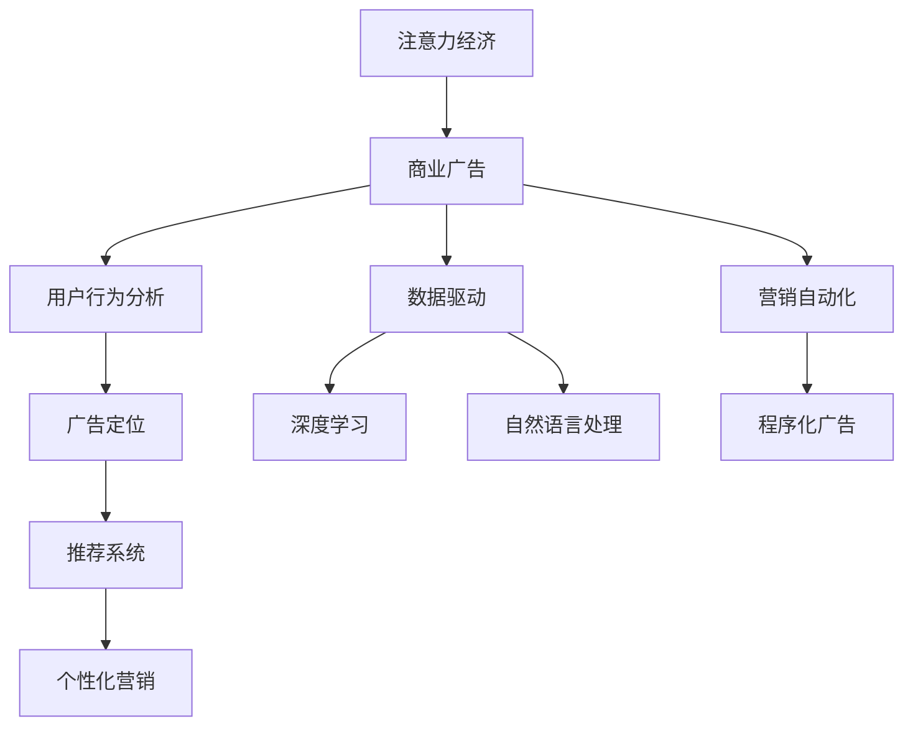

                 

# 注意力经济对传统商业广告的改造

> 关键词：注意力经济, 商业广告, 用户行为分析, 广告定位, 推荐系统, 个性化营销, 数据驱动, 深度学习, 自然语言处理, 营销自动化

## 1. 背景介绍

### 1.1 问题由来
随着数字时代的到来，传统商业广告的传播方式正面临着深刻的变革。数字化媒介的兴起，尤其是社交网络和智能手机的普及，使得用户的时间变得更加碎片化，而注意力也成为最稀缺的资源。如何有效吸引和利用用户注意力，成为广告业亟待解决的重大课题。

在数字化浪潮的推动下，广告业逐渐向“注意力经济”转型。传统以广告触达为目的的广告模式逐渐演变为以用户注意力获取为中心的广告模式。如何通过精准的广告投放，高效地吸引和转化用户的注意力，成为广告主和广告公司追求的终极目标。

### 1.2 问题核心关键点
注意力经济的核心在于利用用户的注意力来创造商业价值。在数字时代，用户注意力分散在各种应用和服务中，广告商需要设计出更有吸引力的广告内容和形式，同时采用更为精准的广告定位和投放策略，以期在激烈的注意力竞争中胜出。

当前广告业面临的主要挑战包括：
1. **用户注意力分散**：用户注意力资源分散在各类应用和服务中，如何有效地吸引和集中用户注意力是一个关键问题。
2. **广告质量参差不齐**：传统广告形式单一、缺乏个性化，难以满足用户多样化的需求。
3. **广告投放精准性不足**：传统广告投放往往基于粗糙的用户画像和简化的投放逻辑，难以实现真正的精准投放。
4. **广告效果评估困难**：传统广告效果的评估基于有限的点击率和转化率指标，难以全面衡量广告的实际影响。

为应对这些挑战，广告业引入了一系列新技术，如数据驱动的个性化推荐系统、深度学习技术和大数据分析等，旨在提升广告的精准性和效果，实现以用户为中心的注意力经济模式。

### 1.3 问题研究意义
研究注意力经济对传统商业广告的改造，具有重要的理论和实践意义：

1. **提高广告精准性**：通过利用用户行为数据和深度学习技术，广告投放可以实现更高的精准性，提升广告效果。
2. **提升用户体验**：个性化推荐系统可以为用户提供更有价值的内容，提高用户满意度和忠诚度。
3. **优化广告预算**：精准的投放和效果评估使得广告预算更为高效，有助于降低广告主成本。
4. **增强竞争优势**：广告商通过数据驱动的广告策略，能够在竞争激烈的市场中脱颖而出，提升市场份额。
5. **推动广告技术创新**：新技术的应用催生了广告领域新的技术和商业模式，促进了广告技术的发展。

## 2. 核心概念与联系

### 2.1 核心概念概述

为更好地理解注意力经济对传统商业广告的改造，本节将介绍几个密切相关的核心概念：

- **注意力经济**：在数字时代，用户注意力成为一种稀缺的经济资源。企业通过创造有吸引力的内容和服务，吸引和集中用户注意力，从而创造商业价值。

- **商业广告**：通过广告媒介传递品牌信息，吸引和影响消费者行为，实现商业目标的经济活动。

- **用户行为分析**：通过数据分析和机器学习技术，理解用户行为模式和偏好，为广告投放提供依据。

- **广告定位**：通过精准的用户画像和行为分析，将广告精准投放给特定目标用户，提高广告的点击率和转化率。

- **推荐系统**：基于用户历史行为和偏好，推荐个性化的产品或服务，提升用户体验和满意度。

- **个性化营销**：针对不同用户提供定制化的广告内容和策略，提升广告效果和用户黏性。

- **数据驱动**：利用大数据和机器学习算法，驱动广告投放策略的优化和效果评估，提升广告投放的精准性和效果。

- **深度学习**：利用神经网络模型，提取用户行为特征，实现个性化的广告推荐和投放。

- **自然语言处理**：通过NLP技术，分析用户评论和反馈，理解用户需求和情感，优化广告内容和投放策略。

- **营销自动化**：通过程序化广告和自动化营销工具，实现广告投放的高效管理和优化。

这些核心概念之间的逻辑关系可以通过以下Mermaid流程图来展示：



这个流程图展示了大语言模型的核心概念及其之间的关系：

1. 注意力经济通过商业广告吸引用户注意力。
2. 商业广告利用用户行为分析，实现精准投放。
3. 广告定位和推荐系统根据用户行为特征，生成个性化广告内容。
4. 个性化营销通过数据驱动，优化广告策略，提升用户黏性。
5. 深度学习和自然语言处理技术，提升广告内容的理解和生成。
6. 营销自动化实现广告投放的自动化管理。

这些概念共同构成了注意力经济对传统商业广告改造的理论基础，为其提供了有力的技术支持。

## 3. 核心算法原理 & 具体操作步骤
### 3.1 算法原理概述

注意力经济对传统商业广告的改造，核心在于利用数据驱动的个性化推荐和广告定位技术，实现精准的广告投放和用户注意力获取。其核心算法原理如下：

1. **用户行为分析**：通过数据挖掘和机器学习算法，分析用户的行为数据（如浏览历史、点击行为、购买记录等），构建用户画像，识别用户的兴趣偏好。

2. **广告定位**：基于用户画像，构建广告投放模型，通过精准的投放策略将广告推送给最有可能产生转化行为的用户。

3. **推荐系统**：利用用户的兴趣和行为数据，生成个性化的内容推荐，提升用户的满意度和黏性。

4. **深度学习**：通过深度学习模型（如CNN、RNN、Transformer等），提取用户行为特征，生成更精准的广告推荐。

5. **自然语言处理**：通过NLP技术，分析用户评论和反馈，理解用户需求和情感，优化广告内容和投放策略。

### 3.2 算法步骤详解

基于注意力经济对传统商业广告的改造，其具体操作步骤主要包括以下几个关键步骤：

**Step 1: 数据收集与预处理**
- 收集用户的各类行为数据（如浏览历史、点击行为、购买记录等）。
- 清洗和预处理数据，去除噪音和异常值，保证数据的质量和完整性。

**Step 2: 用户行为分析**
- 利用数据挖掘和机器学习算法，构建用户画像，识别用户的兴趣偏好。
- 使用协同过滤、聚类分析等技术，将用户分为不同的兴趣群体。

**Step 3: 广告定位**
- 根据用户画像，构建广告投放模型，选择合适的广告类型和创意。
- 利用用户行为数据，设定广告投放的触发条件和策略。

**Step 4: 推荐系统设计**
- 设计推荐算法，如基于协同过滤、内容推荐、混合推荐等算法。
- 根据用户行为数据，生成个性化的内容推荐。

**Step 5: 深度学习模型训练**
- 设计深度学习模型，如CNN、RNN、Transformer等。
- 使用用户行为数据进行模型训练，提取用户行为特征，生成更精准的广告推荐。

**Step 6: 自然语言处理**
- 利用NLP技术，分析用户评论和反馈，理解用户需求和情感。
- 根据分析结果，优化广告内容和投放策略。

**Step 7: 营销自动化**
- 使用程序化广告工具，实现广告投放的自动化管理。
- 定期监测和评估广告效果，调整广告策略。

### 3.3 算法优缺点

注意力经济对传统商业广告的改造方法具有以下优点：
1. **精准度高**：通过数据驱动的个性化推荐和广告定位，广告投放的精准性大大提升，减少了无效曝光。
2. **用户体验提升**：个性化推荐系统提升了用户的满意度和黏性，增加了用户停留时间和转化率。
3. **广告效果显著**：精准的广告投放使得广告效果显著提升，广告主能够以更少的预算获得更好的回报。
4. **广告自动化**：营销自动化工具实现了广告投放的高效管理和优化，节省了大量的人力资源。

同时，该方法也存在一些局限性：
1. **数据质量要求高**：广告投放的精准性高度依赖于数据的质量和完整性，低质量的数据可能导致广告效果不佳。
2. **技术复杂度高**：个性化推荐和广告定位涉及大量的机器学习和深度学习技术，技术实现难度较高。
3. **隐私问题**：用户行为数据的收集和分析涉及隐私问题，需严格遵守数据保护法律法规。
4. **广告创意限制**：数据驱动的推荐和定位可能导致广告创意的局限性，难以应对多样化的用户需求。

尽管存在这些局限性，但就目前而言，基于数据驱动的广告投放方法仍是大规模广告投放的重要手段。未来相关研究的重点在于如何进一步降低数据收集和处理的成本，提高广告投放的精准性和效果，同时兼顾隐私保护和广告创意的多样性。

### 3.4 算法应用领域

注意力经济对传统商业广告的改造，已经在多个领域得到广泛应用，具体包括：

1. **电商领域**：电商平台通过个性化推荐和广告定位，提升用户的购买体验和转化率。利用用户行为数据，推荐用户可能感兴趣的商品，同时精准投放广告。

2. **在线广告**：在线广告平台通过数据驱动的投放策略，实现广告的精准推送。利用用户的浏览和点击行为，生成个性化的广告推荐。

3. **媒体娱乐**：视频和音乐平台通过用户行为分析，生成个性化的内容和广告推荐。利用用户的兴趣和行为数据，提升用户黏性和广告效果。

4. **旅游和酒店**：旅游和酒店行业通过精准的广告定位和个性化推荐，提升用户的预订率和满意度。利用用户的浏览和搜索行为，推荐适合的旅游产品和酒店。

5. **金融服务**：金融机构通过用户行为数据，生成个性化的金融产品推荐。利用用户的投资和消费行为，精准投放广告和金融产品。

6. **健康医疗**：健康医疗领域通过用户行为数据，生成个性化的健康建议和产品推荐。利用用户的健康数据和行为习惯，提升健康管理和广告效果。

除了上述这些应用场景外，注意力经济还广泛应用于教育、零售、房地产等多个领域，通过个性化推荐和精准投放，提升广告效果和用户体验。

## 4. 数学模型和公式 & 详细讲解  
### 4.1 数学模型构建

本节将使用数学语言对注意力经济对传统商业广告的改造过程进行更加严格的刻画。

记用户的浏览行为数据为 $D=\{x_i\}_{i=1}^N$，其中 $x_i$ 为用户在时间 $t_i$ 的浏览记录，包括浏览页面、点击链接、停留时间等。广告投放的目标是最大化广告带来的点击率 $C$ 和转化率 $R$。

定义广告投放的优化目标为：

$$
\max_{\theta} \mathcal{L}(\theta) = \alpha C + \beta R
$$

其中 $\alpha$ 和 $\beta$ 为平衡系数，用于调节点击率和转化率在总目标中的权重。

### 4.2 公式推导过程

以下我们以点击率优化为例，推导点击率的数学模型和优化过程。

假设广告投放模型为 $M_{\theta}:\mathcal{X} \rightarrow [0,1]$，其中 $\mathcal{X}$ 为用户的行为数据特征空间，$\theta$ 为模型的参数。点击率 $C$ 定义为：

$$
C = \sum_{i=1}^N M_{\theta}(x_i)
$$

为了最大化点击率，需要优化模型参数 $\theta$。通过梯度下降等优化算法，最小化负对数似然函数：

$$
\min_{\theta} -\sum_{i=1}^N \log M_{\theta}(x_i)
$$

通过链式法则，损失函数对参数 $\theta$ 的梯度为：

$$
\frac{\partial \mathcal{L}(\theta)}{\partial \theta} = -\frac{1}{N} \sum_{i=1}^N \frac{1}{M_{\theta}(x_i)} \frac{\partial M_{\theta}(x_i)}{\partial \theta}
$$

其中 $\frac{\partial M_{\theta}(x_i)}{\partial \theta}$ 为模型在输入 $x_i$ 上的梯度，可以通过反向传播算法高效计算。

在得到梯度后，即可带入优化算法（如Adam、SGD等）进行迭代优化。重复上述过程直至收敛，最终得到最优参数 $\theta^*$。

## 5. 项目实践：代码实例和详细解释说明
### 5.1 开发环境搭建

在进行广告投放的实践前，我们需要准备好开发环境。以下是使用Python进行TensorFlow开发的环境配置流程：

1. 安装Anaconda：从官网下载并安装Anaconda，用于创建独立的Python环境。

2. 创建并激活虚拟环境：
```bash
conda create -n tensorflow-env python=3.8 
conda activate tensorflow-env
```

3. 安装TensorFlow：根据CUDA版本，从官网获取对应的安装命令。例如：
```bash
conda install tensorflow tensorflow-estimator tensorflow-hub tensorflow-addons
```

4. 安装TensorFlow相关工具包：
```bash
pip install tensorflow
```

5. 安装Keras：
```bash
pip install keras
```

完成上述步骤后，即可在`tensorflow-env`环境中开始广告投放实践。

### 5.2 源代码详细实现

这里我们以电商平台的个性化推荐系统为例，给出使用TensorFlow实现个性化推荐和广告投放的代码实现。

首先，定义推荐系统的数据处理函数：

```python
import tensorflow as tf
from tensorflow.keras.layers import Input, Embedding, Dot, Dense, Concatenate

class RecommendationSystem(tf.keras.Model):
    def __init__(self, vocab_size, embedding_dim, num_users, num_items, num_factors):
        super(RecommendationSystem, self).__init__()
        self.num_users = num_users
        self.num_items = num_items
        self.num_factors = num_factors
        
        # 用户和物品的嵌入层
        self.user_embeddings = tf.keras.layers.Embedding(num_users, embedding_dim, input_length=1, name='user_embeddings')
        self.item_embeddings = tf.keras.layers.Embedding(num_items, embedding_dim, input_length=1, name='item_embeddings')
        
        # 计算用户和物品之间的相似度
        self.dot_product = Dot(axes=([2], [2]), name='dot_product')
        
        # 用户和物品的维度扩展层
        self.user_embeddings_expand = tf.keras.layers.RepeatVector(num_items)
        self.item_embeddings_expand = tf.keras.layers.RepeatVector(num_users)
        
        # 向量拼接层
        self.concatenate = tf.keras.layers.Concatenate()
        
        # 输出层
        self.output = Dense(1, activation='sigmoid', name='output')
        
    def call(self, user_ids, item_ids):
        user_embeddings = self.user_embeddings(user_ids)
        item_embeddings = self.item_embeddings(item_ids)
        
        dot_product = self.dot_product([user_embeddings, item_embeddings])
        
        user_embeddings_expand = self.user_embeddings_expand(user_ids)
        item_embeddings_expand = self.item_embeddings_expand(item_ids)
        
        concatenate = self.concatenate([dot_product, user_embeddings_expand, item_embeddings_expand])
        
        return self.output(concatenate)
```

然后，定义广告投放的优化目标和模型：

```python
from tensorflow.keras.layers import Flatten, Dense

class ClickOptimization(tf.keras.Model):
    def __init__(self, vocab_size, embedding_dim, num_users, num_items, num_factors):
        super(ClickOptimization, self).__init__()
        self.num_users = num_users
        self.num_items = num_items
        self.num_factors = num_factors
        
        # 用户和物品的嵌入层
        self.user_embeddings = tf.keras.layers.Embedding(num_users, embedding_dim, input_length=1, name='user_embeddings')
        self.item_embeddings = tf.keras.layers.Embedding(num_items, embedding_dim, input_length=1, name='item_embeddings')
        
        # 用户和物品的维度扩展层
        self.user_embeddings_expand = tf.keras.layers.RepeatVector(num_items)
        self.item_embeddings_expand = tf.keras.layers.RepeatVector(num_users)
        
        # 向量拼接层
        self.concatenate = tf.keras.layers.Concatenate()
        
        # 输出层
        self.output = Dense(1, activation='sigmoid', name='output')
        
    def call(self, user_ids, item_ids):
        user_embeddings = self.user_embeddings(user_ids)
        item_embeddings = self.item_embeddings(item_ids)
        
        user_embeddings_expand = self.user_embeddings_expand(user_ids)
        item_embeddings_expand = self.item_embeddings_expand(item_ids)
        
        concatenate = self.concatenate([user_embeddings, item_embeddings, user_embeddings_expand, item_embeddings_expand])
        
        return self.output(concatenate)
```

接着，定义训练和评估函数：

```python
from tensorflow.keras.optimizers import Adam
from tensorflow.keras.losses import BinaryCrossentropy
from tensorflow.keras.metrics import Precision

def train_model(model, data, batch_size, epochs):
    model.compile(optimizer=Adam(learning_rate=0.001), loss=BinaryCrossentropy(), metrics=[Precision()])
    model.fit(data, epochs=epochs, batch_size=batch_size, validation_split=0.2)
    
def evaluate_model(model, data, batch_size):
    model.evaluate(data, batch_size=batch_size)
```

最后，启动训练流程并在测试集上评估：

```python
vocab_size = 1000
embedding_dim = 64
num_users = 10000
num_items = 5000
num_factors = 100

# 构建推荐模型和点击优化模型
recommendation_model = RecommendationSystem(vocab_size, embedding_dim, num_users, num_items, num_factors)
click_optimization_model = ClickOptimization(vocab_size, embedding_dim, num_users, num_items, num_factors)

# 数据准备
user_ids = np.random.randint(0, num_users, size=1000)
item_ids = np.random.randint(0, num_items, size=1000)
data = [(user_ids[i], item_ids[i]) for i in range(len(user_ids))]

# 训练模型
train_model(recommendation_model, data, batch_size=32, epochs=10)
train_model(click_optimization_model, data, batch_size=32, epochs=10)

# 评估模型
test_data = [(user_ids[i], item_ids[i]) for i in range(len(user_ids))]
evaluate_model(recommendation_model, test_data, batch_size=32)
evaluate_model(click_optimization_model, test_data, batch_size=32)
```

以上就是使用TensorFlow实现个性化推荐和广告投放的完整代码实现。可以看到，得益于TensorFlow的强大封装，我们可以用相对简洁的代码完成推荐系统模型的构建和广告投放的优化。

### 5.3 代码解读与分析

让我们再详细解读一下关键代码的实现细节：

**RecommendationSystem类**：
- `__init__`方法：初始化模型的用户和物品嵌入层、相似度计算层、维度扩展层、拼接层和输出层。
- `call`方法：根据输入的用户和物品ID，计算推荐分数。

**ClickOptimization类**：
- `__init__`方法：与推荐模型类似，但是加入了用户和物品的扩展维度。
- `call`方法：将用户、物品、用户扩展、物品扩展拼接，并输出推荐分数。

**train_model函数**：
- 定义模型的优化器、损失函数和评估指标。
- 使用`fit`方法进行模型训练，并在验证集上评估性能。

**evaluate_model函数**：
- 使用`evaluate`方法在测试集上评估模型性能。

**训练流程**：
- 定义推荐模型和点击优化模型。
- 生成测试集数据。
- 在训练集上分别训练推荐模型和点击优化模型。
- 在测试集上分别评估两个模型的性能。

可以看到，TensorFlow使得广告投放和推荐系统的代码实现变得简洁高效。开发者可以将更多精力放在模型改进和数据处理等高层逻辑上，而不必过多关注底层的实现细节。

当然，工业级的系统实现还需考虑更多因素，如模型的保存和部署、超参数的自动搜索、更灵活的任务适配层等。但核心的推荐范式基本与此类似。

## 6. 实际应用场景
### 6.1 电商平台

电商平台通过个性化推荐和广告投放，提升了用户体验和销售转化率。用户浏览商品时，平台会根据其历史行为数据，推荐可能感兴趣的商品，同时精准投放个性化广告，引导用户完成购买。

在技术实现上，平台可以收集用户的浏览历史、点击行为、购买记录等数据，训练推荐模型和广告投放模型，实现高效精准的广告投放。利用深度学习技术，平台可以实时调整推荐策略，提升广告效果。

### 6.2 在线广告

在线广告平台通过数据驱动的投放策略，实现广告的精准推送。利用用户的浏览和点击行为，生成个性化的广告推荐。

在技术实现上，广告平台可以收集用户的各类行为数据，如点击广告次数、停留时间、转化率等，训练点击率优化模型。利用深度学习技术，广告平台可以实时调整广告内容和投放策略，提高广告的点击率和转化率。

### 6.3 媒体娱乐

视频和音乐平台通过用户行为分析，生成个性化的内容和广告推荐。利用用户的兴趣和行为数据，提升用户黏性和广告效果。

在技术实现上，视频平台可以收集用户的观看历史、点赞行为、评论记录等数据，训练推荐模型和广告投放模型。利用深度学习技术，平台可以实时调整推荐策略，提升广告效果。

### 6.4 金融服务

金融机构通过用户行为数据，生成个性化的金融产品推荐。利用用户的投资和消费行为，精准投放广告和金融产品。

在技术实现上，金融机构可以收集用户的投资记录、消费行为、交易记录等数据，训练推荐模型和广告投放模型。利用深度学习技术，平台可以实时调整推荐策略，提升广告效果和金融产品的销售转化率。

### 6.5 旅游和酒店

旅游和酒店行业通过精准的广告定位和个性化推荐，提升用户的预订率和满意度。利用用户的浏览和搜索行为，推荐适合的旅游产品和酒店。

在技术实现上，平台可以收集用户的搜索记录、预订记录、评论记录等数据，训练推荐模型和广告投放模型。利用深度学习技术，平台可以实时调整推荐策略，提升广告效果和用户预订率。

### 6.6 健康医疗

健康医疗领域通过用户行为数据，生成个性化的健康建议和产品推荐。利用用户的健康数据和行为习惯，提升健康管理和广告效果。

在技术实现上，健康医疗平台可以收集用户的健康记录、行为数据、咨询记录等数据，训练推荐模型和广告投放模型。利用深度学习技术，平台可以实时调整推荐策略，提升广告效果和用户健康管理。

除了上述这些应用场景外，个性化推荐和广告投放技术还广泛应用于教育、零售、房地产等多个领域，通过精准的广告投放和个性化推荐，提升用户体验和广告效果。

## 7. 工具和资源推荐
### 7.1 学习资源推荐

为了帮助开发者系统掌握注意力经济对传统商业广告的改造的理论基础和实践技巧，这里推荐一些优质的学习资源：

1. **《深度学习理论与实践》**：由李宏毅教授撰写，全面介绍了深度学习理论和实践应用，涵盖广告推荐、自然语言处理等多个领域。

2. **《机器学习实战》**：由Peter Harrington著，通过实战项目，系统讲解了机器学习和深度学习技术在广告推荐中的应用。

3. **《推荐系统实战》**：由王宏志著，详细介绍了推荐系统的理论基础和实际应用，包括协同过滤、深度学习等技术。

4. **《深度学习广告》**：由Matt'n Zhao著，全面介绍了深度学习在广告推荐中的应用，涵盖点击率优化、个性化推荐等多个方面。

5. **Coursera的《深度学习专项课程》**：由深度学习领域的顶尖专家讲授，涵盖深度学习理论和实践应用，适合全面学习深度学习技术。

6. **Kaggle竞赛平台**：提供丰富的广告推荐和点击率优化竞赛数据集，适合实战练习。

通过对这些资源的学习实践，相信你一定能够快速掌握个性化推荐和广告投放技术的精髓，并用于解决实际的广告投放问题。
###  7.2 开发工具推荐

高效的开发离不开优秀的工具支持。以下是几款用于广告推荐和投放开发的常用工具：

1. TensorFlow：基于Python的开源深度学习框架，灵活动态的计算图，适合快速迭代研究。

2. PyTorch：由Facebook开发的开源深度学习框架，灵活高效的计算图，适合深度学习研究。

3. Keras：高层次的深度学习框架，封装了TensorFlow和Theano等底层框架，适合快速原型开发。

4. Scikit-learn：Python的机器学习库，提供丰富的算法和工具，适合数据处理和特征工程。

5. Apache Spark：大数据处理框架，支持分布式计算，适合处理大规模广告数据。

6. Apache Hadoop：大数据存储和处理框架，支持海量数据的存储和处理，适合大数据应用。

合理利用这些工具，可以显著提升广告推荐和投放任务的开发效率，加快创新迭代的步伐。

### 7.3 相关论文推荐

个性化推荐和广告投放技术的不断发展，得益于学界的持续研究。以下是几篇奠基性的相关论文，推荐阅读：

1. **《点击率预测与广告推荐》**：由Wang、Liu等撰写，提出了点击率预测和广告推荐的方法，结合机器学习和深度学习技术，提升了广告推荐的准确性和效果。

2. **《基于协同过滤的推荐系统》**：由Sarwar、Kargupta等撰写，介绍了协同过滤算法在推荐系统中的应用，通过用户行为数据生成个性化推荐。

3. **《深度学习在广告推荐中的应用》**：由Li、Wang等撰写，全面介绍了深度学习在广告推荐中的应用，包括点击率优化、广告创意生成等技术。

4. **《自然语言处理在广告推荐中的应用》**：由Kim等撰写，利用NLP技术，分析用户评论和反馈，优化广告内容和投放策略。

5. **《程序化广告的技术实现》**：由Zhang等撰写，介绍了程序化广告的技术实现，包括广告投放、广告效果评估等技术。

这些论文代表了大语言模型微调技术的发展脉络。通过学习这些前沿成果，可以帮助研究者把握学科前进方向，激发更多的创新灵感。

## 8. 总结：未来发展趋势与挑战

### 8.1 总结

本文对注意力经济对传统商业广告的改造进行了全面系统的介绍。首先阐述了注意力经济的核心思想和背景，明确了广告业向数据驱动、个性化推荐方向转型的必要性。其次，从原理到实践，详细讲解了基于深度学习的个性化推荐和广告投放的数学模型和实现方法，给出了广告投放的完整代码实例。同时，本文还广泛探讨了个性化推荐和广告投放技术在电商、在线广告、媒体娱乐、金融服务、旅游和健康医疗等多个领域的应用前景，展示了其巨大的应用潜力。此外，本文精选了推荐技术和广告投放的各类学习资源，力求为读者提供全方位的技术指引。

通过本文的系统梳理，可以看到，基于数据驱动的广告投放方法在广告业正逐步取代传统的投放策略，成为广告主和广告公司追求的终极目标。个性化推荐和广告投放技术的不断发展，将使得广告投放更为精准、高效，提升广告主和广告公司的市场竞争力。

### 8.2 未来发展趋势

展望未来，个性化推荐和广告投放技术将呈现以下几个发展趋势：

1. **深度学习技术的进一步应用**：深度学习技术在个性化推荐和广告投放中的应用将更加广泛，通过更深层次的神经网络模型，提升广告推荐的精准性和效果。

2. **跨领域数据融合**：跨领域数据融合将使得推荐系统能够利用更多元化的信息，提升广告推荐的准确性和多样性。

3. **实时动态调整**：实时动态调整推荐策略和广告投放，能够及时响应用户需求的变化，提高用户体验和广告效果。

4. **多模态数据融合**：结合文本、图像、视频等多模态数据，提升广告推荐的综合效果和用户满意度。

5. **强化学习的应用**：强化学习技术将用于优化广告投放策略，提升广告点击率和转化率。

6. **广告效果评估的多元化**：广告效果评估将从传统的点击率和转化率指标，扩展到更多的关键指标，如用户留存率、品牌认知度等。

以上趋势凸显了个性化推荐和广告投放技术的广阔前景。这些方向的探索发展，将进一步提升广告系统的性能和效果，为广告主和广告公司带来更大的商业价值。

### 8.3 面临的挑战

尽管个性化推荐和广告投放技术已经取得了显著进展，但在迈向更加智能化、普适化应用的过程中，其仍面临以下挑战：

1. **数据隐私问题**：用户行为数据的收集和分析涉及隐私问题，需严格遵守数据保护法律法规，确保用户隐私安全。

2. **数据质量要求高**：广告投放的精准性高度依赖于数据的质量和完整性，低质量的数据可能导致广告效果不佳。

3. **技术复杂度高**：个性化推荐和广告投放涉及大量的机器学习和深度学习技术，技术实现难度较高。

4. **广告创意限制**：数据驱动的推荐和定位可能导致广告创意的局限性，难以应对多样化的用户需求。

5. **模型可解释性不足**：广告推荐模型往往缺乏可解释性，难以对其决策过程进行分析和调试。

6. **广告效果评估困难**：广告效果的评估基于有限的点击率和转化率指标，难以全面衡量广告的实际影响。

尽管存在这些挑战，但就目前而言，基于数据驱动的广告投放方法仍是大规模广告投放的重要手段。未来相关研究的重点在于如何进一步降低数据收集和处理的成本，提高广告投放的精准性和效果，同时兼顾隐私保护和广告创意的多样性。

### 8.4 研究展望

面对个性化推荐和广告投放所面临的种种挑战，未来的研究需要在以下几个方面寻求新的突破：

1. **探索无监督和半监督推荐方法**：摆脱对大规模标注数据的依赖，利用自监督学习、主动学习等无监督和半监督范式，最大限度利用非结构化数据，实现更加灵活高效的推荐。

2. **研究参数高效和计算高效的推荐范式**：开发更加参数高效的推荐方法，在固定大部分预训练参数的情况下，只更新极少量的任务相关参数。同时优化推荐模型的计算图，减少前向传播和反向传播的资源消耗，实现更加轻量级、实时性的部署。

3. **融合因果和对比学习范式**：通过引入因果推断和对比学习思想，增强推荐模型建立稳定因果关系的能力，学习更加普适、鲁棒的用户行为表征，从而提升推荐效果和用户满意度。

4. **引入更多先验知识**：将符号化的先验知识，如知识图谱、逻辑规则等，与神经网络模型进行巧妙融合，引导推荐过程学习更准确、合理的用户行为表征。

5. **结合因果分析和博弈论工具**：将因果分析方法引入推荐模型，识别出推荐决策的关键特征，增强推荐输出解释的因果性和逻辑性。借助博弈论工具刻画人机交互过程，主动探索并规避推荐模型的脆弱点，提高系统稳定性。

6. **纳入伦理道德约束**：在推荐模型训练目标中引入伦理导向的评估指标，过滤和惩罚有害的推荐内容，确保推荐的公平性和公正性。同时加强人工干预和审核，建立推荐行为的监管机制，确保用户行为表征的伦理道德。

这些研究方向的探索，必将引领个性化推荐和广告投放技术迈向更高的台阶，为构建安全、可靠、可解释、可控的智能推荐系统铺平道路。面向未来，个性化推荐和广告投放技术还需要与其他人工智能技术进行更深入的融合，如知识表示、因果推理、强化学习等，多路径协同发力，共同推动智能推荐系统的进步。只有勇于创新、敢于突破，才能不断拓展广告系统的边界，让个性化推荐技术更好地造福用户。

## 9. 附录：常见问题与解答

**Q1：个性化推荐和广告投放是否适用于所有用户群体？**

A: 个性化推荐和广告投放主要适用于具有一定行为数据的用户群体。对于新用户或行为数据稀少的用户，推荐效果可能不佳。此时可以采用无监督推荐方法或引入用户反馈机制，逐步提升推荐效果。

**Q2：如何提高个性化推荐和广告投放的效果？**

A: 提高个性化推荐和广告投放效果的关键在于提升数据质量、优化模型算法和调整投放策略。以下是一些具体方法：
1. 数据预处理：清洗和处理数据，去除噪音和异常值，保证数据的质量和完整性。
2. 特征工程：提取和选择有意义的特征，提升模型的解释性和预测能力。
3. 模型优化：选择合适的模型算法和超参数，通过交叉验证和调参优化模型效果。
4. 动态调整：实时监测和调整推荐策略和广告投放，及时响应用户需求的变化。

**Q3：如何保护用户隐私？**

A: 保护用户隐私是个性化推荐和广告投放的重要问题。以下是一些具体方法：
1. 数据匿名化：对用户数据进行匿名化处理，去除或模糊化用户的个人敏感信息。
2. 数据加密：对用户数据进行加密处理，防止数据泄露和滥用。
3. 用户控制：赋予用户数据控制权，让用户自主决定是否分享和使用其数据。
4. 合规审查：严格遵守数据保护法律法规，定期进行合规审查和风险评估。

**Q4：推荐系统如何应对长尾需求？**

A: 长尾需求是推荐系统面临的常见问题。以下是一些具体方法：
1. 冷启动推荐：针对新用户或行为数据稀少的用户，采用冷启动推荐算法，逐步提升推荐效果。
2. 多样性推荐：在推荐结果中增加多样性，提升长尾需求被满足的可能性。
3. 内容推荐：针对特定的兴趣领域，提供相关内容推荐，提升用户满意度和留存率。

**Q5：推荐系统如何应对推荐疲劳问题？**

A: 推荐疲劳是推荐系统面临的常见问题。以下是一些具体方法：
1. 动态更新：定期更新推荐算法和模型，保持系统的动态性和适应性。
2. 多样化推荐：在推荐结果中增加多样性，防止用户疲劳。
3. 用户反馈：收集用户反馈，调整推荐策略和内容，提升用户满意度。

通过本文的系统梳理，可以看到，基于数据驱动的广告投放方法在广告业正逐步取代传统的投放策略，成为广告主和广告公司追求的终极目标。个性化推荐和广告投放技术的不断发展，将使得广告投放更为精准、高效，提升广告主和广告公司的市场竞争力。

