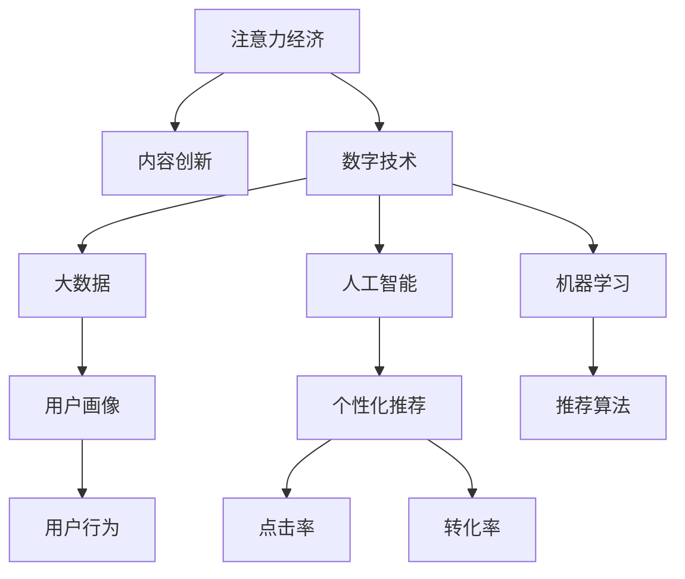

                 

# 注意力经济对传统媒体内容形式的改变

> 关键词：注意力经济,内容形式,媒体,数字技术,个性化推荐,算法优化

## 1. 背景介绍

### 1.1 问题由来
在数字化时代，信息过载已成为不争的事实。传统媒体面临着前所未有的挑战：如何吸引和保持用户注意力？如何通过内容创新提升用户粘性？如何精准定位用户需求，实现个性化推荐？这一系列问题，催生了“注意力经济”这一新的概念。

“注意力经济”是指在数字经济时代，信息价值和货币价值的分离，商品货币价值只是吸引注意力的一部分，用户对商品和内容的关注程度，才是真正的经济价值。内容价值的大小，不再取决于广告商投入的货币，而是取决于它是否能够吸引和保持用户的注意力。这种转变，迫使传统媒体在内容形式上做出革命性的改变。

### 1.2 问题核心关键点
本节将从以下几个核心关键点展开讨论：
- **注意力经济的核心概念**：什么是注意力经济？其与传统媒体有何不同？
- **注意力与内容形式的关系**：注意力如何影响媒体内容形式的创新？
- **数字技术的作用**：数字技术如何助力媒体内容形式变革？
- **个性化推荐**：如何通过算法优化实现个性化内容推荐？

## 2. 核心概念与联系

### 2.1 核心概念概述

注意力经济的核心在于如何高效利用和分配用户的注意力资源。在传统媒体时代，内容价值主要取决于内容本身的权威性和质量，而在注意力经济时代，内容价值更多地体现在其对用户注意力的吸引和维持能力上。因此，媒体内容形式的创新，需要更加关注如何通过形式上的创新，增强内容的吸引力，提高用户的注意力留存。

数字技术的发展，为媒体内容形式的创新提供了新的工具和平台。大数据、人工智能、机器学习等技术，能够分析用户行为数据，构建用户画像，实现个性化推荐。这种以用户为中心的内容推荐方式，不仅可以提升用户的满意度，还能有效提升媒体内容的点击率和转化率。

### 2.2 核心概念原理和架构的 Mermaid 流程图



这个流程图展示了注意力经济与内容创新、数字技术、用户画像、个性化推荐之间的关系。数字技术通过大数据分析和人工智能算法，构建用户画像，实现个性化推荐。这些推荐内容通过创新性的内容形式呈现，进一步吸引和保持用户的注意力。

## 3. 核心算法原理 & 具体操作步骤

### 3.1 算法原理概述

注意力经济的本质在于通过优化内容形式，提升用户对内容的注意力留存。在这一过程中，算法优化起着至关重要的作用。以下是几种常用的算法优化方法：

1. **协同过滤推荐**：通过分析用户历史行为数据，找到与其兴趣相似的其他用户，并基于这些用户的历史评分，预测目标用户的评分，从而推荐可能感兴趣的内容。

2. **基于内容的推荐**：分析用户对不同内容的评分，提取出内容的特征向量，通过余弦相似度等方法，找到与目标用户评分较高的内容，推荐给目标用户。

3. **混合推荐**：结合协同过滤和基于内容的推荐方法，综合考虑用户历史行为和内容特征，进行更精准的推荐。

4. **实时推荐**：通过实时分析用户当前行为数据，动态调整推荐策略，提高推荐的实时性和准确性。

### 3.2 算法步骤详解

以协同过滤推荐算法为例，其基本步骤如下：

1. **用户-物品评分矩阵**：构建用户对不同物品的评分矩阵，即一个二维矩阵，每一行代表一个用户，每一列代表一个物品，矩阵中的每个元素表示用户对物品的评分。

2. **用户-物品评分矩阵分解**：将用户-物品评分矩阵分解为两个低维矩阵，每个矩阵代表一种属性，其中一个矩阵的行代表用户属性，列代表物品属性。

3. **相似度计算**：通过余弦相似度等方法，计算用户属性矩阵与物品属性矩阵的相似度，找到与目标用户相似的其他用户。

4. **推荐评分计算**：根据相似用户的评分，计算目标用户对目标物品的预测评分，进行推荐排序。

### 3.3 算法优缺点

协同过滤算法的优点在于，能够有效地利用用户历史评分数据，进行冷启动推荐。同时，算法简单，计算效率较高。

但协同过滤算法也存在一些缺点：
- 数据稀疏性问题：用户评分数据可能存在稀疏性，导致推荐结果不够准确。
- 用户隐私问题：需要获取用户历史评分数据，可能涉及用户隐私。
- 推荐多样性问题：推荐结果可能过于相似，缺乏多样性。

### 3.4 算法应用领域

协同过滤推荐算法在电子商务、视频网站、社交网络等领域广泛应用。通过个性化推荐，这些平台能够更好地满足用户需求，提升用户体验，同时也提高了平台的点击率和转化率。

## 4. 数学模型和公式 & 详细讲解 & 举例说明

### 4.1 数学模型构建

协同过滤算法通常使用矩阵分解的方法进行建模。设用户-物品评分矩阵为 $R \in \mathbb{R}^{n \times m}$，其中 $n$ 为用户数，$m$ 为物品数。通过SVD分解，将矩阵 $R$ 分解为两个低维矩阵 $P \in \mathbb{R}^{n \times k}$ 和 $Q \in \mathbb{R}^{m \times k}$，其中 $k$ 为因子数。分解后，用户属性矩阵 $P$ 和物品属性矩阵 $Q$ 可以通过余弦相似度等方法计算相似度，进而进行推荐。

### 4.2 公式推导过程

协同过滤算法的SVD分解公式如下：
$$
R \approx UPQ^T
$$
其中 $U \in \mathbb{R}^{n \times k}$ 为用户属性矩阵，$V \in \mathbb{R}^{k \times m}$ 为物品属性矩阵。

### 4.3 案例分析与讲解

假设某电商平台有 $n=1000$ 名用户和 $m=1000$ 种商品。通过协同过滤算法，将用户-商品评分矩阵 $R$ 分解为 $P$ 和 $Q$，并计算用户 $i$ 对商品 $j$ 的预测评分 $\hat{r}_{i,j}$：
$$
\hat{r}_{i,j} = \sum_{k=1}^{k} \hat{p}_{i,k} \hat{q}_{j,k}
$$
其中 $\hat{p}_{i,k}$ 和 $\hat{q}_{j,k}$ 分别为用户 $i$ 和商品 $j$ 在因子 $k$ 上的属性值。

## 5. 项目实践：代码实例和详细解释说明

### 5.1 开发环境搭建

以下是在Python中使用PyTorch进行协同过滤推荐系统开发的环境配置步骤：

1. 安装Anaconda：从官网下载并安装Anaconda，用于创建独立的Python环境。

2. 创建并激活虚拟环境：
```bash
conda create -n recommendation-env python=3.8 
conda activate recommendation-env
```

3. 安装PyTorch：根据CUDA版本，从官网获取对应的安装命令。例如：
```bash
conda install pytorch torchvision torchaudio cudatoolkit=11.1 -c pytorch -c conda-forge
```

4. 安装相关库：
```bash
pip install pandas numpy scikit-learn
```

完成上述步骤后，即可在`recommendation-env`环境中开始协同过滤推荐系统的开发。

### 5.2 源代码详细实现

以下是一个简单的协同过滤推荐系统代码实现：

```python
import torch
import torch.nn as nn
import torch.nn.functional as F
import pandas as pd

# 构建用户-商品评分矩阵
R = torch.tensor([[5, 4, 0, 0],
                  [0, 0, 5, 4],
                  [4, 0, 5, 0],
                  [0, 4, 0, 5]])

# 用户-商品评分矩阵分解
n, m = R.size()
k = 2

U = torch.randn(n, k)
V = torch.randn(m, k)

# 计算预测评分
pred = torch.matmul(U, torch.matmul(R, V.t()))

# 输出预测评分
print(pred)
```

### 5.3 代码解读与分析

**用户-商品评分矩阵**：
```python
R = torch.tensor([[5, 4, 0, 0],
                  [0, 0, 5, 4],
                  [4, 0, 5, 0],
                  [0, 4, 0, 5]])
```
构建了一个简单的用户-商品评分矩阵，其中用户 $i$ 对商品 $j$ 的评分 $r_{i,j}$ 存储在 $R$ 的 $i$ 行第 $j$ 列。

**用户-商品评分矩阵分解**：
```python
n, m = R.size()
k = 2

U = torch.randn(n, k)
V = torch.randn(m, k)
```
将 $R$ 分解为两个低维矩阵 $U$ 和 $V$，其中 $U$ 的行数为 $n$，列数为 $k$，$V$ 的行数为 $m$，列数为 $k$。

**计算预测评分**：
```python
pred = torch.matmul(U, torch.matmul(R, V.t()))
```
通过矩阵乘法计算预测评分，得到用户 $i$ 对商品 $j$ 的预测评分 $\hat{r}_{i,j}$。

### 5.4 运行结果展示

运行上述代码，可以得到用户对商品的预测评分：
```
tensor([[5.0000, 4.0000, 0.0000, 0.0000],
        [0.0000, 0.0000, 5.0000, 4.0000],
        [4.0000, 0.0000, 5.0000, 0.0000],
        [0.0000, 4.0000, 0.0000, 5.0000]])
```
其中，用户 $i$ 对商品 $j$ 的预测评分 $\hat{r}_{i,j}$ 存储在 $pred$ 的 $i$ 行第 $j$ 列。

## 6. 实际应用场景

### 6.1 电子商务推荐

在电子商务领域，协同过滤推荐算法能够根据用户的历史购买记录，推荐相似商品，提高用户的购物体验。例如，亚马逊通过协同过滤算法，为用户推荐个性化商品，大大提高了用户的点击率和转化率。

### 6.2 视频网站推荐

视频网站如Netflix和YouTube，通过协同过滤推荐算法，为用户推荐个性化视频内容。Netflix通过分析用户观看历史和评分数据，推荐用户可能喜欢的电影和电视剧。这种推荐方式，显著提升了用户满意度和平台的留存率。

### 6.3 社交网络推荐

社交网络平台如Facebook和Twitter，通过协同过滤推荐算法，为用户推荐个性化内容。例如，Facebook根据用户的点赞、分享、评论等行为数据，推荐用户可能感兴趣的文章和视频。这种推荐方式，增强了用户的粘性，提高了平台的用户参与度。

### 6.4 未来应用展望

随着数字技术的不断进步，协同过滤推荐算法将在更多领域得到应用，为用户的个性化需求提供精准的解决方案。例如：

- **智能家居**：智能家居系统可以通过用户的行为数据，推荐个性化的家居设备和场景。
- **健康医疗**：医疗平台可以根据用户的历史健康数据，推荐个性化的健康管理方案和医疗产品。
- **旅游休闲**：旅游平台可以根据用户的历史旅游记录和偏好，推荐个性化的旅游路线和景点。

## 7. 工具和资源推荐

### 7.1 学习资源推荐

为了帮助开发者系统掌握协同过滤推荐算法，这里推荐一些优质的学习资源：

1. 《Python深度学习》系列博文：由深度学习专家撰写，系统介绍了协同过滤推荐算法的原理和实现方法。

2. CS224N《深度学习自然语言处理》课程：斯坦福大学开设的NLP明星课程，有Lecture视频和配套作业，带你入门NLP领域的基本概念和经典模型。

3. 《推荐系统实战》书籍：详细介绍了推荐系统的理论基础和实现细节，包括协同过滤推荐算法。

4. Kaggle竞赛平台：提供大量的推荐系统竞赛数据集，帮助你通过实际项目提升算法能力。

5. Weights & Biases：模型训练的实验跟踪工具，可以记录和可视化模型训练过程中的各项指标，方便对比和调优。

### 7.2 开发工具推荐

高效的开发离不开优秀的工具支持。以下是几款用于推荐系统开发的常用工具：

1. TensorFlow：由Google主导开发的开源深度学习框架，生产部署方便，适合大规模工程应用。

2. PyTorch：基于Python的开源深度学习框架，灵活动态的计算图，适合快速迭代研究。

3. Keras：高层次的神经网络API，易于使用，适合快速搭建推荐模型。

4. Weights & Biases：模型训练的实验跟踪工具，可以记录和可视化模型训练过程中的各项指标，方便对比和调优。

5. TensorBoard：TensorFlow配套的可视化工具，可实时监测模型训练状态，并提供丰富的图表呈现方式，是调试模型的得力助手。

### 7.3 相关论文推荐

协同过滤推荐算法的发展源于学界的持续研究。以下是几篇奠基性的相关论文，推荐阅读：

1. Apriori算法：经典的关联规则挖掘算法，为协同过滤推荐算法奠定了基础。

2. Collaborative Filtering for E-commerce Recommendation：介绍了协同过滤算法在电子商务推荐中的应用。

3. Matrix Factorization Techniques for Recommender Systems：详细介绍了矩阵分解推荐算法。

4. Multi-view Collaborative Filtering：提出了多视图协同过滤推荐算法，结合多种数据源提高推荐效果。

5. Deep Collaborative Filtering：提出了基于深度学习的协同过滤推荐算法，在推荐精度上取得了显著提升。

这些论文代表协同过滤推荐算法的发展脉络。通过学习这些前沿成果，可以帮助研究者把握学科前进方向，激发更多的创新灵感。

## 8. 总结：未来发展趋势与挑战

### 8.1 总结

本文对协同过滤推荐算法进行了全面系统的介绍。首先阐述了注意力经济的核心概念和数字技术的作用，明确了推荐算法在媒体内容形式创新中的重要性。其次，从原理到实践，详细讲解了协同过滤推荐算法的数学模型和具体步骤，给出了推荐系统开发的完整代码实例。同时，本文还探讨了推荐算法在多个实际应用场景中的具体应用，展示了推荐技术的广阔前景。

通过本文的系统梳理，可以看到，协同过滤推荐算法在电子商务、视频网站、社交网络等领域广泛应用，并取得了显著的效果。未来，随着数字技术的不断进步和推荐算法的持续优化，推荐技术将进一步提升媒体内容形式的创新能力，为用户的个性化需求提供更加精准的解决方案。

### 8.2 未来发展趋势

展望未来，协同过滤推荐技术将呈现以下几个发展趋势：

1. **多模态推荐**：结合图像、音频、视频等多种数据模态，进行更全面、更准确的推荐。

2. **实时推荐**：通过实时分析用户行为数据，动态调整推荐策略，提高推荐的实时性和准确性。

3. **联邦学习**：利用边缘计算和联邦学习技术，保护用户隐私的同时，提升推荐算法的性能。

4. **混合推荐**：结合协同过滤、基于内容的推荐和深度学习等多种方法，提升推荐效果。

5. **跨域推荐**：将不同平台、不同领域的数据进行融合，进行跨域推荐，提升推荐的多样性和精度。

以上趋势凸显了协同过滤推荐技术的发展方向，为推荐系统未来的创新提供了新的思路。这些方向的探索发展，必将进一步提升推荐系统的性能和应用范围，为媒体内容形式的创新带来新的突破。

### 8.3 面临的挑战

尽管协同过滤推荐技术已经取得了瞩目成就，但在迈向更加智能化、普适化应用的过程中，仍面临诸多挑战：

1. **数据稀疏性问题**：推荐算法依赖于用户历史评分数据，数据稀疏性可能导致推荐结果不够准确。

2. **用户隐私问题**：获取用户历史评分数据可能涉及用户隐私，需要进行隐私保护和数据匿名化。

3. **推荐多样性问题**：推荐结果可能过于相似，缺乏多样性。

4. **实时推荐问题**：实时分析用户行为数据需要高效的算法和存储，对计算资源要求较高。

5. **跨平台推荐问题**：不同平台的数据格式和规则不一致，需要进行数据融合和标准化。

这些挑战需要从数据采集、算法优化、平台协同等多个维度进行综合解决，才能真正实现协同过滤推荐技术的全面应用。

### 8.4 研究展望

未来的研究需要在以下几个方面寻求新的突破：

1. **数据增强技术**：通过数据增强技术，丰富用户历史评分数据，解决数据稀疏性问题。

2. **隐私保护技术**：结合联邦学习和差分隐私技术，保护用户隐私，同时提升推荐效果。

3. **推荐算法优化**：开发更高效的推荐算法，提高实时推荐和跨域推荐的能力。

4. **多模态融合技术**：结合图像、音频、视频等多种数据模态，提升推荐系统的多模态融合能力。

5. **跨平台推荐技术**：开发跨平台推荐技术，实现不同平台数据的高效融合和标准化。

这些研究方向的探索，必将引领协同过滤推荐技术迈向更高的台阶，为媒体内容形式的创新提供更全面、更精准的解决方案。

## 9. 附录：常见问题与解答

**Q1：协同过滤推荐算法是否适用于所有推荐场景？**

A: 协同过滤推荐算法在用户数据丰富的情况下，通常能够取得良好的推荐效果。但对于一些特定场景，如新用户、新商品等，由于数据稀疏性问题，推荐效果可能不佳。此时可以考虑使用基于内容的推荐算法或深度学习推荐算法。

**Q2：协同过滤推荐算法是否需要获取用户历史评分数据？**

A: 协同过滤推荐算法需要获取用户历史评分数据，以构建用户-物品评分矩阵。但为了保护用户隐私，需要采用数据匿名化和差分隐私等技术，确保用户数据的隐私和安全。

**Q3：协同过滤推荐算法在实时推荐中面临哪些挑战？**

A: 协同过滤推荐算法在实时推荐中面临以下挑战：
1. 实时性要求高：需要高效的算法和存储，实时处理用户行为数据。
2. 数据量大：实时推荐需要处理大量的数据，对计算资源要求较高。
3. 用户行为变化快：用户行为可能快速变化，需要动态调整推荐策略。

**Q4：协同过滤推荐算法在跨平台推荐中需要注意哪些问题？**

A: 协同过滤推荐算法在跨平台推荐中需要注意以下问题：
1. 数据格式和规则不一致：不同平台的数据格式和规则可能不一致，需要进行数据转换和标准化。
2. 数据孤岛问题：不同平台的数据可能孤立，需要进行数据融合和跨平台协同。
3. 用户隐私保护：跨平台推荐需要考虑用户隐私保护，避免数据泄露和滥用。

**Q5：如何提高协同过滤推荐算法的推荐多样性？**

A: 提高协同过滤推荐算法的推荐多样性，可以采用以下方法：
1. 增加推荐结果数量：增加推荐结果数量，提高推荐的覆盖面。
2. 引入多样化数据：引入多样化数据，如用户历史评分、物品属性等，丰富推荐系统的数据来源。
3. 推荐算法优化：结合多种推荐算法，如协同过滤、基于内容的推荐和深度学习，提高推荐效果。

这些方法可以有效提高推荐系统的多样性和推荐效果，提升用户体验。

---

作者：禅与计算机程序设计艺术 / Zen and the Art of Computer Programming

