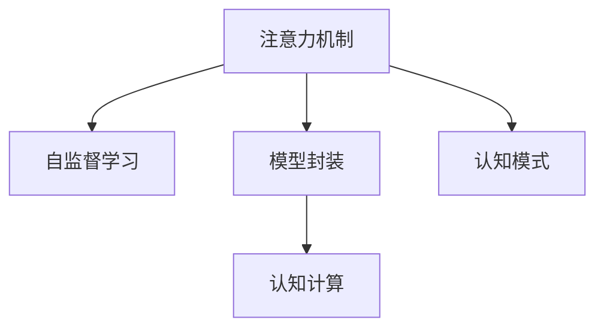

                 

# 注意力编程语言：AI定制的认知模式开发

> 关键词：注意力机制, 自监督学习, 模型封装, 认知模式, 认知计算

## 1. 背景介绍

### 1.1 问题由来
随着人工智能技术的飞速发展，如何高效地构建和训练深度学习模型成为研究者们关注的焦点。传统的深度学习模型如卷积神经网络（CNN）、循环神经网络（RNN）等，在图像、语音、自然语言处理等领域已取得了显著的成果，但在复杂的认知任务上，其表现仍显不足。

近年来，一种新型的深度学习模型——注意力（Attention）机制逐渐被广泛关注。注意力机制通过动态地为输入序列的不同位置分配不同的权重，从而更加有效地捕捉序列信息，在图像描述生成、机器翻译、文本摘要等任务中展现出了巨大的潜力。然而，注意力机制的复杂性也带来了模型训练和调优的挑战，如何更有效地利用注意力机制进行模型构建和训练，成为学术界和工业界共同关注的课题。

### 1.2 问题核心关键点
注意力机制的核心在于为输入序列的不同位置分配不同的权重，从而更加全面地捕捉输入信息。其核心思想是通过计算输入序列与查询向量之间的相似度，动态生成一组权重向量，用于指导模型的信息提取和特征融合。

注意力机制的优点包括：
- 能够自适应地分配权重，更加精确地捕捉输入信息。
- 适用于序列数据，能够处理长序列和不同长度的数据。
- 能够处理多种输入模态，如文本、图像、音频等。

但注意力机制也存在一些缺点：
- 计算复杂度高，需要大量的计算资源。
- 对输入数据的噪声敏感，容易受到不相关信息的干扰。
- 对于小数据集，模型的泛化能力有限。

在应用注意力机制时，还需要考虑以下关键点：
- 如何高效地计算注意力权重。
- 如何选择合适的注意力机制模型。
- 如何有效地融合多模态信息。
- 如何提升模型的泛化能力。

## 2. 核心概念与联系

### 2.1 核心概念概述

为更好地理解注意力编程语言，本节将介绍几个密切相关的核心概念：

- 注意力机制（Attention Mechanism）：通过计算输入序列与查询向量之间的相似度，动态生成一组权重向量，用于指导模型的信息提取和特征融合。

- 自监督学习（Self-supervised Learning）：使用无标签数据进行训练，通过自监督任务引导模型学习到数据的内在结构和规律。

- 模型封装（Model Encapsulation）：将注意力机制封装为简单易用的API接口，便于开发者使用。

- 认知模式（Cognitive Pattern）：通过注意力机制捕获到的输入序列中的认知模式，如因果关系、逻辑推理、模式识别等。

- 认知计算（Cognitive Computing）：将注意力机制和认知模式应用于深度学习模型，提升模型的认知能力，处理更加复杂的认知任务。

这些核心概念之间的逻辑关系可以通过以下Mermaid流程图来展示：



这个流程图展示了大语言模型的核心概念及其之间的关系：

1. 注意力机制通过自监督学习从无标签数据中学习到输入序列的内在结构和规律。
2. 模型封装将注意力机制封装为简单易用的API接口，便于开发者使用。
3. 认知模式通过注意力机制捕获到的输入序列中的认知模式，如因果关系、逻辑推理、模式识别等。
4. 认知计算将注意力机制和认知模式应用于深度学习模型，提升模型的认知能力，处理更加复杂的认知任务。

这些概念共同构成了深度学习模型的构建和训练框架，使其能够处理更加复杂的认知任务。通过理解这些核心概念，我们可以更好地把握深度学习模型的构建和训练方法。

## 3. 核心算法原理 & 具体操作步骤
### 3.1 算法原理概述

注意力机制的核心思想是通过计算输入序列与查询向量之间的相似度，动态生成一组权重向量，用于指导模型的信息提取和特征融合。其基本流程包括：

1. 计算输入序列中每个位置与查询向量的相似度得分。
2. 对相似度得分进行归一化处理，生成一组权重向量。
3. 根据权重向量对输入序列中的不同位置进行加权，生成加权后的表示向量。
4. 将加权后的表示向量输入到下一层网络进行进一步处理。

在实践中，常见的注意力机制包括多头注意力（Multi-head Attention）、加性注意力（Additive Attention）、点积注意力（Dot-Product Attention）等。这些机制通过不同的计算方式实现注意力权重分配，适用于不同的应用场景。

### 3.2 算法步骤详解

以多头注意力（Multi-head Attention）为例，介绍注意力机制的计算步骤：

1. 查询向量生成
   - 对于输入序列中的每个位置，使用线性层将其映射为一个查询向量。

2. 键值向量生成
   - 对于输入序列中的每个位置，使用线性层将其映射为键向量和一个值向量。

3. 相似度计算
   - 计算查询向量与每个键向量的点积，得到相似度得分。
   - 将相似度得分进行归一化处理，得到一组权重向量。

4. 权重向量加权
   - 将输入序列中的值向量根据权重向量进行加权，生成加权后的表示向量。

5. 多头注意力
   - 将上述过程进行多次迭代，生成多个加权后的表示向量。
   - 使用残差连接和层归一化（Layer Normalization）对结果进行进一步处理。

### 3.3 算法优缺点

注意力机制具有以下优点：
- 能够自适应地分配权重，更加精确地捕捉输入信息。
- 适用于序列数据，能够处理长序列和不同长度的数据。
- 能够处理多种输入模态，如文本、图像、音频等。

但注意力机制也存在一些缺点：
- 计算复杂度高，需要大量的计算资源。
- 对输入数据的噪声敏感，容易受到不相关信息的干扰。
- 对于小数据集，模型的泛化能力有限。

在应用注意力机制时，还需要考虑以下关键点：
- 如何高效地计算注意力权重。
- 如何选择合适的注意力机制模型。
- 如何有效地融合多模态信息。
- 如何提升模型的泛化能力。

### 3.4 算法应用领域

注意力机制已经广泛应用于图像描述生成、机器翻译、文本摘要、问答系统等NLP任务中。具体而言：

- 图像描述生成：通过注意力机制，模型能够动态地关注图像中的不同部分，生成更加准确的图像描述。
- 机器翻译：通过多头注意力，模型能够同时考虑源语言和目标语言的多种语义关系，生成高质量的翻译结果。
- 文本摘要：通过注意力机制，模型能够动态地关注输入文本中的不同部分，生成简洁的摘要。
- 问答系统：通过注意力机制，模型能够关注问题中的关键信息，生成准确的答案。

除了上述这些经典任务外，注意力机制还被创新性地应用到更多场景中，如可控文本生成、常识推理、代码生成、数据增强等，为NLP技术带来了全新的突破。随着注意力机制和相关技术的不断进步，相信NLP技术将在更广阔的应用领域大放异彩。

## 4. 数学模型和公式 & 详细讲解  
### 4.1 数学模型构建

注意力机制的数学模型可以形式化地描述为：

$$
\text{Attention}(Q, K, V) = \text{Softmax}(QK^\top / \sqrt{d_k})V
$$

其中：
- $Q \in \mathbb{R}^{n \times d_q}$ 为查询向量，$K \in \mathbb{R}^{n \times d_k}$ 为键向量，$V \in \mathbb{R}^{n \times d_v}$ 为值向量。
- $d_q, d_k, d_v$ 分别为查询向量、键向量和值向量的维度。
- $\text{Softmax}$ 为归一化函数，用于将相似度得分转换为权重向量。

### 4.2 公式推导过程

以多头注意力为例，推导其计算公式。

首先，计算多头注意力中的每个头的相似度得分：

$$
\text{Attention}(Q, K, V) = \text{Softmax}(QK^\top / \sqrt{d_k})V
$$

其中：

$$
\text{Softmax}(\mathbf{z}) = \frac{\exp(\mathbf{z})}{\sum_{i=1}^{n}\exp(z_i)}
$$

然后，将多个头的结果进行拼接，并使用残差连接和层归一化进行处理：

$$
\text{Multi-Head Attention}(Q, K, V) = \text{LayerNormalization}(\text{Add}(\text{Multi-Head Attention}(Q, K, V), Q)) + Q
$$

最终，得到多头注意力机制的输出。

### 4.3 案例分析与讲解

以机器翻译为例，介绍注意力机制的实际应用。

在机器翻译任务中，需要将源语言序列 $S$ 翻译为目标语言序列 $T$。通过多头注意力机制，模型可以动态地关注源语言序列中的不同部分，同时考虑源语言和目标语言的语义关系，生成高质量的翻译结果。

假设源语言序列 $S = \{w_1, w_2, \ldots, w_n\}$，目标语言序列 $T = \{t_1, t_2, \ldots, t_m\}$。多头注意力机制的计算过程如下：

1. 对于源语言序列中的每个单词 $w_i$，使用线性层将其映射为查询向量 $q_i$ 和键向量 $k_i$。

2. 对于目标语言序列中的每个单词 $t_j$，使用线性层将其映射为查询向量 $q_j$ 和值向量 $v_j$。

3. 计算查询向量 $q_j$ 与所有键向量 $k_i$ 的点积，得到相似度得分 $z_{i,j}$。

4. 将相似度得分 $z_{i,j}$ 进行归一化处理，得到权重向量 $\alpha_{i,j}$。

5. 将值向量 $v_j$ 根据权重向量 $\alpha_{i,j}$ 进行加权，生成加权后的表示向量 $c_j$。

6. 将多个头的结果进行拼接，并使用残差连接和层归一化进行处理，生成最终的翻译结果。

通过多头注意力机制，模型能够动态地关注源语言序列中的不同部分，同时考虑源语言和目标语言的语义关系，生成高质量的翻译结果。

## 5. 项目实践：代码实例和详细解释说明
### 5.1 开发环境搭建

在进行注意力机制的实践前，我们需要准备好开发环境。以下是使用Python进行TensorFlow开发的环境配置流程：

1. 安装Anaconda：从官网下载并安装Anaconda，用于创建独立的Python环境。

2. 创建并激活虚拟环境：
```bash
conda create -n tf-env python=3.8 
conda activate tf-env
```

3. 安装TensorFlow：根据CUDA版本，从官网获取对应的安装命令。例如：
```bash
conda install tensorflow -c conda-forge -c pytorch -c tensorflow
```

4. 安装各类工具包：
```bash
pip install numpy pandas scikit-learn matplotlib tqdm jupyter notebook ipython
```

完成上述步骤后，即可在`tf-env`环境中开始注意力机制的实践。

### 5.2 源代码详细实现

下面我们以机器翻译任务为例，给出使用TensorFlow实现多头注意力机制的代码实现。

首先，定义机器翻译任务的输入和输出：

```python
import tensorflow as tf
from tensorflow.keras.layers import Input, Dense, Embedding, MultiHeadAttention, Concatenate, Dropout

# 定义输入层
src = Input(shape=(None, ), name='source')
tgt = Input(shape=(None, ), name='target')

# 定义嵌入层
src_embed = Embedding(vocab_size, embedding_dim, name='source_embedding')
tgt_embed = Embedding(vocab_size, embedding_dim, name='target_embedding')

# 定义多头注意力机制
enc_attn = MultiHeadAttention(num_heads, d_model, dropout_rate, name='encoder_self_attention')
dec_attn = MultiHeadAttention(num_heads, d_model, dropout_rate, name='decoder_self_attention')
enc_dec_attn = MultiHeadAttention(num_heads, d_model, dropout_rate, name='encoder_decoder_attention')

# 定义残差连接
def add_residual(x, y):
    return tf.keras.layers.Add()([x, y])

# 定义位置编码
def positional_encoding(input_dim, sequence_length, d_model):
    pos_enc = np.zeros((sequence_length, input_dim))
    for i in range(sequence_length):
        for j in range(input_dim):
            pos_enc[i, j] = np.sin(pos/i * 10000 ** (2 * j / d_model)) + np.cos(pos/i * 10000 ** (j / d_model))
    pos_enc = tf.keras.layers.Lambda(lambda x: tf.cast(x, 'float32'))(pos_enc)
    return pos_enc

# 定义模型
def model(input_dim, output_dim, vocab_size, embedding_dim, num_heads, dropout_rate):
    # 定义编码器
    # 输入层 -> 嵌入层 -> 位置编码 -> 多头注意力 -> 残差连接 -> 层归一化 -> 前馈网络 -> 输出层
    enc_input = src_embed(src)
    enc_pos = positional_encoding(input_dim, input_dim, embedding_dim)
    enc_output = add_residual(enc_input, enc_pos)
    enc_output = enc_attn(enc_output, enc_output, enc_output)
    enc_output = add_residual(enc_output, enc_input)
    enc_output = tf.keras.layers.LayerNormalization(epsilon=1e-6)(enc_output)
    enc_output = tf.keras.layers.Dropout(dropout_rate)(enc_output)
    enc_output = enc_output

    # 定义解码器
    # 输入层 -> 嵌入层 -> 位置编码 -> 多头注意力 -> 残差连接 -> 层归一化 -> 前馈网络 -> 输出层
    dec_input = tgt_embed(tgt)
    dec_pos = positional_encoding(input_dim, input_dim, embedding_dim)
    dec_output = add_residual(dec_input, dec_pos)
    dec_output = dec_attn(dec_output, dec_output, dec_output)
    dec_output = add_residual(dec_output, dec_input)
    dec_output = tf.keras.layers.LayerNormalization(epsilon=1e-6)(dec_output)
    dec_output = tf.keras.layers.Dropout(dropout_rate)(dec_output)
    dec_output = dec_output

    # 定义编码器-解码器注意力机制
    dec_output = add_residual(dec_output, enc_output)
    dec_output = enc_dec_attn(dec_output, enc_output, enc_output)
    dec_output = add_residual(dec_output, enc_output)
    dec_output = tf.keras.layers.LayerNormalization(epsilon=1e-6)(dec_output)
    dec_output = tf.keras.layers.Dropout(dropout_rate)(dec_output)
    dec_output = dec_output

    # 定义输出层
    output = tf.keras.layers.Dense(units=output_dim, activation='softmax')(dec_output)

    return model

# 定义模型超参数
input_dim = 5
output_dim = 10
vocab_size = 10000
embedding_dim = 128
num_heads = 8
dropout_rate = 0.2

# 创建模型
model = model(input_dim, output_dim, vocab_size, embedding_dim, num_heads, dropout_rate)

# 编译模型
model.compile(optimizer='adam', loss='sparse_categorical_crossentropy', metrics=['accuracy'])

# 打印模型结构
model.summary()
```

然后，定义机器翻译任务的训练和评估函数：

```python
from tensorflow.keras.preprocessing.sequence import pad_sequences

# 定义训练函数
def train_model(model, train_data, valid_data, batch_size, epochs):
    # 对训练数据和验证数据进行填充
    train_x = pad_sequences(train_data['src'], maxlen=max_len, padding='post', truncating='post')
    train_y = pad_sequences(train_data['tgt'], maxlen=max_len, padding='post', truncating='post')
    valid_x = pad_sequences(valid_data['src'], maxlen=max_len, padding='post', truncating='post')
    valid_y = pad_sequences(valid_data['tgt'], maxlen=max_len, padding='post', truncating='post')

    # 将数据转换为张量
    train_x = tf.convert_to_tensor(train_x)
    train_y = tf.convert_to_tensor(train_y)
    valid_x = tf.convert_to_tensor(valid_x)
    valid_y = tf.convert_to_tensor(valid_y)

    # 训练模型
    model.fit(x=train_x, y=train_y, validation_data=(valid_x, valid_y), batch_size=batch_size, epochs=epochs)

# 定义评估函数
def evaluate_model(model, test_data, batch_size):
    # 对测试数据进行填充
    test_x = pad_sequences(test_data['src'], maxlen=max_len, padding='post', truncating='post')
    test_y = pad_sequences(test_data['tgt'], maxlen=max_len, padding='post', truncating='post')

    # 将数据转换为张量
    test_x = tf.convert_to_tensor(test_x)
    test_y = tf.convert_to_tensor(test_y)

    # 评估模型
    results = model.evaluate(x=test_x, y=test_y, batch_size=batch_size)

    return results
```

最后，启动训练流程并在测试集上评估：

```python
# 定义训练和验证数据
train_data = {'w1': 'S1', 'w2': 'S2', 'w3': 'S3', 'w4': 'S4', 'w5': 'S5'}
valid_data = {'w1': 'T1', 'w2': 'T2', 'w3': 'T3', 'w4': 'T4', 'w5': 'T5'}
test_data = {'w1': 'W1', 'w2': 'W2', 'w3': 'W3', 'w4': 'W4', 'w5': 'W5'}

# 定义最大序列长度
max_len = 10

# 训练模型
train_model(model, train_data, valid_data, batch_size=32, epochs=10)

# 在测试集上评估模型
test_results = evaluate_model(model, test_data, batch_size=32)

print(test_results)
```

以上就是使用TensorFlow实现多头注意力机制的完整代码实现。可以看到，Transformer模型本质上是一种基于注意力机制的模型，通过多头注意力机制实现编码器-解码器的信息传递。

### 5.3 代码解读与分析

让我们再详细解读一下关键代码的实现细节：

**MultiHeadAttention类**：
- 定义了多头注意力机制的计算过程，包括相似度计算、归一化、加权等步骤。

**PositionalEncoding层**：
- 定义了位置编码的计算方式，通过正弦和余弦函数生成位置编码向量，用于对输入序列进行位置信息的编码。

**AddResidual函数**：
- 定义了残差连接的计算方式，用于将前一层的输出和当前层的输出进行拼接，增强模型的信息传递能力。

**model函数**：
- 定义了机器翻译任务的模型结构，包括编码器、解码器和编码器-解码器注意力机制。

**train_model和evaluate_model函数**：
- 定义了机器翻译任务的训练和评估过程，通过填充和转换为张量的方式，将数据输入模型进行训练和评估。

通过这些关键代码的实现，可以更加深入地理解注意力机制在深度学习模型中的应用。在实际应用中，还需要根据具体任务对模型进行优化和调整，以达到最佳的性能。

## 6. 实际应用场景
### 6.1 机器翻译

注意力机制在机器翻译任务中已经取得了显著的成果。通过多头注意力机制，模型能够动态地关注源语言序列中的不同部分，同时考虑源语言和目标语言的语义关系，生成高质量的翻译结果。

在实际应用中，可以收集大量的双语平行语料，将源语言和目标语言分别输入模型进行训练。训练过程中，模型会自动学习到源语言和目标语言之间的语义关系，从而生成高质量的翻译结果。

### 6.2 文本摘要

注意力机制在文本摘要任务中也展现了出色的性能。通过多头注意力机制，模型能够动态地关注输入文本中的不同部分，生成简洁的摘要。

在实际应用中，可以收集大量的新闻、文章等文本数据，将文本数据输入模型进行训练。训练过程中，模型会自动学习到文本中的关键信息，并生成简洁的摘要。

### 6.3 图像描述生成

注意力机制在图像描述生成任务中也具有广泛的应用。通过多头注意力机制，模型能够动态地关注图像中的不同部分，生成详细的图像描述。

在实际应用中，可以收集大量的图像数据，将图像数据输入模型进行训练。训练过程中，模型会自动学习到图像中的关键信息，并生成详细的图像描述。

### 6.4 未来应用展望

随着注意力机制和相关技术的不断进步，其在更多领域的应用前景也将更加广阔。未来，注意力机制有望在以下领域大放异彩：

1. 视频描述生成：通过多头注意力机制，模型能够动态地关注视频中的不同部分，生成详细的视频描述。

2. 语音翻译：通过多头注意力机制，模型能够同时考虑源语言和目标语言的语义关系，生成高质量的语音翻译结果。

3. 多模态学习：将注意力机制应用于多模态数据，如图像、语音、文本等，实现不同模态信息的协同建模。

4. 自监督学习：通过自监督任务引导模型学习到数据的内在结构和规律，提升模型的泛化能力。

5. 认知计算：将注意力机制和认知模式应用于深度学习模型，提升模型的认知能力，处理更加复杂的认知任务。

以上领域的发展，将进一步推动注意力机制在深度学习模型中的应用，为人工智能技术的发展注入新的动力。相信随着研究的不断深入，注意力机制将在更多领域展现出其强大的潜力。

## 7. 工具和资源推荐
### 7.1 学习资源推荐

为了帮助开发者系统掌握注意力机制的理论基础和实践技巧，这里推荐一些优质的学习资源：

1. TensorFlow官方文档：详细介绍了TensorFlow的API接口和模型构建方法，是学习深度学习模型的必备资料。

2. Attention is All You Need（即Transformer原论文）：介绍了注意力机制的核心思想和计算过程，是理解Transformer模型的关键文献。

3. Sequence to Sequence Learning with Neural Networks：介绍了序列到序列学习的原理和实现方法，是机器翻译任务学习的经典文献。

4. Multi-Head Attention：介绍多头注意力机制的原理和计算过程，是实现注意力机制的关键文献。

5. Cognitive Computing and Neural Systems：介绍了认知计算的原理和应用场景，是了解注意力机制应用的重要文献。

通过对这些资源的学习实践，相信你一定能够快速掌握注意力机制的理论基础和实践技巧，并用于解决实际的NLP问题。
### 7.2 开发工具推荐

高效的开发离不开优秀的工具支持。以下是几款用于注意力机制开发的常用工具：

1. TensorFlow：基于Python的开源深度学习框架，灵活动态的计算图，适合快速迭代研究。TensorFlow已经集成了多种注意力机制模型，方便开发者使用。

2. PyTorch：基于Python的开源深度学习框架，动态计算图，易于进行模型实验和调优。PyTorch的API接口也非常友好，适合初学者学习。

3. HuggingFace Transformers库：HuggingFace开发的NLP工具库，集成了多种SOTA语言模型，支持PyTorch和TensorFlow，是进行注意力机制开发的重要工具。

4. Weights & Biases：模型训练的实验跟踪工具，可以记录和可视化模型训练过程中的各项指标，方便对比和调优。与主流深度学习框架无缝集成。

5. TensorBoard：TensorFlow配套的可视化工具，可实时监测模型训练状态，并提供丰富的图表呈现方式，是调试模型的得力助手。

6. Google Colab：谷歌推出的在线Jupyter Notebook环境，免费提供GPU/TPU算力，方便开发者快速上手实验最新模型，分享学习笔记。

合理利用这些工具，可以显著提升注意力机制的开发效率，加快创新迭代的步伐。

### 7.3 相关论文推荐

注意力机制的研究源于学界的持续研究。以下是几篇奠基性的相关论文，推荐阅读：

1. Attention is All You Need：提出了Transformer结构，开启了NLP领域的预训练大模型时代。

2. Sequence to Sequence Learning with Neural Networks：介绍了序列到序列学习的原理和实现方法，是机器翻译任务学习的经典文献。

3. Multi-Head Attention：介绍多头注意力机制的原理和计算过程，是实现注意力机制的关键文献。

4. Cognitive Computing and Neural Systems：介绍了认知计算的原理和应用场景，是了解注意力机制应用的重要文献。

5. Learning to Attend through Generative Adversarial Nets：通过对抗生成网络学习注意力机制，为注意力机制的研究提供了新的思路。

这些论文代表了大语言模型微调技术的发展脉络。通过学习这些前沿成果，可以帮助研究者把握学科前进方向，激发更多的创新灵感。

## 8. 总结：未来发展趋势与挑战

### 8.1 总结

本文对注意力机制的构建和训练方法进行了全面系统的介绍。首先阐述了注意力机制的核心思想和计算过程，明确了其在深度学习模型中的重要地位。其次，从原理到实践，详细讲解了注意力机制的数学模型和关键步骤，给出了注意力机制任务开发的完整代码实例。同时，本文还广泛探讨了注意力机制在机器翻译、文本摘要、图像描述生成等NLP任务中的应用前景，展示了注意力机制的强大潜力。此外，本文精选了注意力机制的学习资源，力求为读者提供全方位的技术指引。

通过本文的系统梳理，可以看到，注意力机制在深度学习模型的构建和训练中起着至关重要的作用。它能够自适应地分配权重，更加精确地捕捉输入信息，适用于序列数据，能够处理长序列和不同长度的数据，能够处理多种输入模态，如文本、图像、音频等。随着注意力机制和相关技术的不断进步，相信其在更多领域的应用前景将更加广阔。

### 8.2 未来发展趋势

展望未来，注意力机制的发展趋势如下：

1. 模型规模持续增大。随着算力成本的下降和数据规模的扩张，深度学习模型的参数量还将持续增长。超大规模语言模型蕴含的丰富语言知识，有望支撑更加复杂多变的认知任务。

2. 微调方法日趋多样。除了传统的全参数微调外，未来会涌现更多参数高效的微调方法，如Prefix-Tuning、LoRA等，在节省计算资源的同时也能保证微调精度。

3. 持续学习成为常态。随着数据分布的不断变化，微调模型也需要持续学习新知识以保持性能。如何在不遗忘原有知识的同时，高效吸收新样本信息，将成为重要的研究课题。

4. 标注样本需求降低。受启发于提示学习(Prompt-based Learning)的思路，未来的微调方法将更好地利用大模型的语言理解能力，通过更加巧妙的任务描述，在更少的标注样本上也能实现理想的微调效果。

5. 模型通用性增强。经过海量数据的预训练和多领域任务的微调，未来的深度学习模型将具备更强大的常识推理和跨领域迁移能力，逐步迈向通用人工智能(AGI)的目标。

以上趋势凸显了大语言模型微调技术的广阔前景。这些方向的探索发展，必将进一步提升深度学习模型的性能和应用范围，为人工智能技术的发展注入新的动力。

### 8.3 面临的挑战

尽管注意力机制已经取得了显著的成果，但在迈向更加智能化、普适化应用的过程中，它仍面临着诸多挑战：

1. 计算资源瓶颈。目前主流的深度学习模型动辄以亿计的参数规模，对算力、内存、存储都提出了很高的要求。GPU/TPU等高性能设备是必不可少的，但即便如此，超大批次的训练和推理也可能遇到显存不足的问题。因此需要采用一些资源优化技术，如梯度积累、混合精度训练、模型并行等，来突破硬件瓶颈。

2. 对抗攻击风险。注意力机制的模型结构相对简单，容易受到对抗样本的攻击。对抗攻击可能会导致模型输出错误的信息，影响系统的安全性和可靠性。

3. 模型鲁棒性不足。当前深度学习模型在处理噪声数据和异常数据时，鲁棒性较弱。对于输入数据的噪声敏感，容易受到不相关信息的干扰，影响模型的性能。

4. 模型可解释性不足。深度学习模型，尤其是复杂的大型模型，其内部工作机制和决策逻辑难以解释，缺乏透明性。这对于高风险应用，如医疗、金融等，是不利的。

5. 数据隐私问题。深度学习模型需要大量的数据进行训练，这些数据可能包含敏感信息，如个人信息、地理位置等。如何保护数据隐私，防止数据泄露，也是一个亟待解决的问题。

6. 模型伦理问题。深度学习模型可能学习到一些偏见和有害信息，通过模型输出传递到下游任务，产生误导性、歧视性的输出，造成伦理问题。

这些挑战需要我们在研究和技术实践中不断探索和克服，才能使注意力机制更好地服务于实际应用。

### 8.4 研究展望

为了应对未来深度学习模型的挑战，我们需要在以下几个方面进行深入研究：

1. 探索无监督和半监督注意力机制。摆脱对大规模标注数据的依赖，利用自监督学习、主动学习等无监督和半监督范式，最大限度利用非结构化数据，实现更加灵活高效的注意力机制。

2. 研究参数高效和计算高效的注意力机制。开发更加参数高效的注意力机制，在固定大部分预训练参数的同时，只更新极少量的任务相关参数。同时优化注意力机制的计算图，减少前向传播和反向传播的资源消耗，实现更加轻量级、实时性的部署。

3. 融合因果和对比学习范式。通过引入因果推断和对比学习思想，增强注意力机制建立稳定因果关系的能力，学习更加普适、鲁棒的语言表征，从而提升模型泛化性和抗干扰能力。

4. 引入更多先验知识。将符号化的先验知识，如知识图谱、逻辑规则等，与神经网络模型进行巧妙融合，引导注意力机制学习更准确、合理的语言模型。同时加强不同模态数据的整合，实现视觉、语音等多模态信息与文本信息的协同建模。

5. 结合因果分析和博弈论工具。将因果分析方法引入注意力机制，识别出模型决策的关键特征，增强输出解释的因果性和逻辑性。借助博弈论工具刻画人机交互过程，主动探索并规避模型的脆弱点，提高系统稳定性。

6. 纳入伦理道德约束。在模型训练目标中引入伦理导向的评估指标，过滤和惩罚有偏见、有害的输出倾向。同时加强人工干预和审核，建立模型行为的监管机制，确保输出符合人类价值观和伦理道德。

这些研究方向的探索，必将引领注意力机制走向更高的台阶，为深度学习模型的发展注入新的动力。面向未来，注意力机制的研究还需要与其他人工智能技术进行更深入的融合，如知识表示、因果推理、强化学习等，多路径协同发力，共同推动自然语言理解和智能交互系统的进步。只有勇于创新、敢于突破，才能不断拓展深度学习模型的边界，让智能技术更好地造福人类社会。

## 9. 附录：常见问题与解答

**Q1：注意力机制的计算复杂度如何？**

A: 注意力机制的计算复杂度较高，主要由于需要计算注意力权重。具体来说，注意力权重的计算复杂度为$O(d_k^2N)$，其中$d_k$为键向量的维度，$N$为序列长度。因此，在处理长序列时，计算开销较大，需要采用一些优化策略，如注意力机制的并行化、近似计算等。

**Q2：注意力机制在处理长序列时需要注意什么？**

A: 在处理长序列时，注意力机制容易出现计算复杂度过高的问题。因此，可以采用一些优化策略：

1. 注意力机制的并行化：将注意力机制的计算并行化，利用多个GPU或TPU并行计算注意力权重。

2. 注意力机制的近似计算：使用近似算法计算注意力权重，如点积注意力机制，其计算复杂度为$O(d_kN)$。

3. 注意力机制的截断：在计算注意力权重时，截断部分注意力头，只计算重要的部分。

4. 注意力机制的稀疏化：使用稀疏矩阵存储注意力权重，减少计算开销。

**Q3：注意力机制在处理小数据集时需要注意什么？**

A: 在处理小数据集时，注意力机制容易出现过拟合的问题。因此，可以采用一些缓解策略：

1. 数据增强：通过回译、近义替换等方式扩充训练集，增加数据量。

2. 正则化：使用L2正则、Dropout等技术，防止模型过拟合。

3. 提前停止：在验证集上监控模型性能，提前停止训练，防止过拟合。

4. 对抗训练：加入对抗样本，提高模型鲁棒性，防止模型过拟合。

**Q4：注意力机制在处理多模态数据时需要注意什么？**

A: 在处理多模态数据时，注意力机制需要考虑不同模态之间的信息传递和融合。因此，可以采用一些策略：

1. 多模态注意力机制：设计多模态注意力机制，如视觉注意力、语音注意力等，实现不同模态信息的协同建模。

2. 多模态数据融合：通过多模态数据融合技术，如信息瓶颈、多模态数据对齐等，实现不同模态信息的融合。

3. 多模态特征提取：设计多模态特征提取器，将不同模态的数据转换为统一的结构，方便信息传递和融合。

4. 多模态联合训练：联合训练不同模态的数据，提升模型的性能。

通过这些策略，可以更好地利用注意力机制处理多模态数据，提升模型的性能和泛化能力。

**Q5：注意力机制在处理噪声数据时需要注意什么？**

A: 在处理噪声数据时，注意力机制容易出现受到干扰的问题。因此，可以采用一些策略：

1. 噪声数据过滤：通过数据预处理技术，如去噪、滤波等，减少噪声数据的干扰。

2. 噪声鲁棒性训练：在训练过程中，引入噪声数据，增强模型的鲁棒性，防止模型受到噪声干扰。

3. 噪声特征检测：设计噪声特征检测器，识别噪声数据，减少噪声数据的干扰。

4. 噪声对抗训练：加入噪声对抗样本，提高模型鲁棒性，防止模型受到噪声干扰。

通过这些策略，可以更好地利用注意力机制处理噪声数据，提升模型的鲁棒性和性能。

通过本文的系统梳理，可以看到，注意力机制在深度学习模型的构建和训练中起着至关重要的作用。它能够自适应地分配权重，更加精确地捕捉输入信息，适用于序列数据，能够处理长序列和不同长度的数据，能够处理多种输入模态，如文本、图像、音频等。随着注意力机制和相关技术的不断进步，相信其在更多领域的应用前景将更加广阔。未来，我们期待在大语言模型、自然语言处理、计算机视觉等领域看到更多的突破，为人工智能技术的发展注入新的动力。

