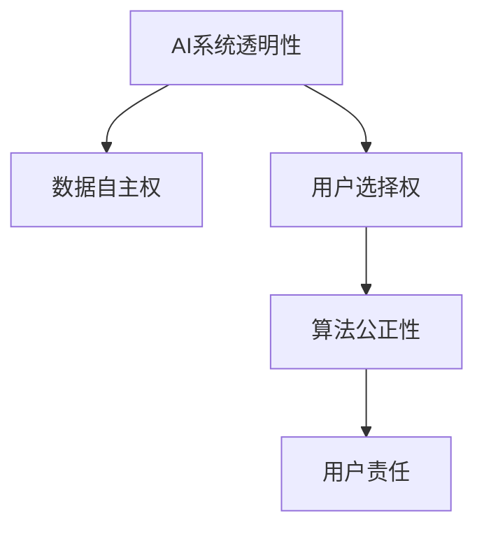

                 

# 注意力自主权维护专员：AI时代的个人选择卫士

> 关键词：人工智能，AI伦理，个人隐私，数据安全，算法透明性，自主选择，数据权属

## 1. 背景介绍

在数字化、智能化的今天，人工智能(AI)正以前所未有的速度改变着我们的生活和工作。无论是智能家居、自动驾驶，还是在线教育、电商推荐，无处不在的AI算法正在塑造我们的世界。然而，随着AI应用的深入，个人的数据隐私、自主选择权等问题也愈发凸显，成为社会各界关注的焦点。

### 1.1 问题由来

1. **数据隐私泄露**：越来越多的AI系统依赖于大量的个人数据进行训练和优化。在数据收集、存储和使用过程中，存在数据泄露、滥用等风险，个人隐私难以得到充分保障。
2. **算法决策黑箱**：AI算法，尤其是深度学习模型，通常被称为"黑盒"系统。其决策过程难以解释和理解，导致用户难以信任并对其产生依赖。
3. **个人选择被干扰**：AI系统往往通过预测用户行为，推荐个性化的内容或产品。这种"信息茧房"现象可能限制用户的视野和选择，甚至影响其认知和决策。
4. **伦理风险**：AI算法可能在不知不觉中带来偏见、歧视，甚至被用于不道德的目的，如虚假信息传播、社会操控等。

这些问题的根源在于AI系统的透明度、公正性和责任性尚待提升，而用户的数据自主权和选择权缺乏充分保障。在这样的背景下，"注意力自主权维护专员"这一角色应运而生。

## 2. 核心概念与联系

### 2.1 核心概念概述

为更好地理解AI系统的透明性和用户自主权，本节将介绍几个核心概念：

- **AI系统透明性**：指AI系统在数据处理、算法决策等方面的透明度，即用户能够清晰了解其工作原理和行为机制。
- **数据自主权**：指个人对其数据的所有权和使用权，包括数据收集、使用、分享和销毁等环节的控制权。
- **用户选择权**：指用户在信息获取、产品推荐等场景中的自主选择能力，不受AI系统的主观干扰。
- **算法公正性**：指AI算法在应用过程中对各类群体的公平性，避免算法偏见和歧视。
- **用户责任**：指用户在享受AI便利的同时，需对其行为负责，尊重他人的权利和隐私。

这些核心概念之间的逻辑关系可以通过以下Mermaid流程图来展示：



这个流程图展示了几大核心概念之间的关系：

1. 透明性是数据自主权和用户选择权的前提，即用户需要了解AI系统的工作机制，才能对其数据和使用进行有效控制。
2. 数据自主权和用户选择权共同构成了用户对AI系统的信任基础，保障用户能够安全地使用AI系统。
3. 算法公正性是用户选择权和用户责任的重要保障，确保AI系统在推荐、决策等方面不产生偏见。
4. 用户责任则是对用户选择权和数据自主权的合理限制，防止用户滥用AI系统。

这些核心概念共同构建了AI系统透明性和用户自主权的基础框架，是AI伦理和技术治理的重要组成部分。

## 3. 核心算法原理 & 具体操作步骤

### 3.1 算法原理概述

AI系统的透明性和用户自主权主要通过以下算法和技术实现：

1. **可解释AI(Explainable AI, XAI)**：使用可解释性技术，如模型可解释、因果分析等，使AI决策过程透明，用户能够理解并信任AI系统。
2. **差分隐私(Differential Privacy)**：通过在数据处理中引入噪声，保护个体数据的隐私性，防止数据泄露和滥用。
3. **用户控制界面(UI)**：提供用户友好的界面，让用户能够主动管理其数据和偏好设置，实现对AI系统的精确控制。
4. **自主选择推荐算法**：设计能够尊重用户选择的推荐算法，如公平性约束、多样性保证等，避免信息茧房现象。

这些算法和技术相互配合，共同实现AI系统的透明性和用户自主权的维护。

### 3.2 算法步骤详解

基于上述算法和技术，AI系统的透明性和用户自主权维护主要包括以下步骤：

**Step 1: 数据收集与隐私保护**
- 收集数据时，遵循差分隐私原则，通过添加噪声、限制数据聚合等方式，保护个体数据的隐私性。
- 告知用户数据收集的目的、范围和方式，获取用户的明确同意。

**Step 2: 数据处理与透明性**
- 在数据预处理和模型训练中，引入可解释性技术，如可视化嵌入、模型可解释性框架等，使模型决策透明。
- 记录和公开数据处理流程和决策机制，提供详细的算法文档和案例分析，增强用户信任。

**Step 3: 用户界面与自主选择**
- 设计用户友好的界面，提供数据管理、隐私设置选项，让用户能够方便地控制其数据和偏好。
- 在推荐系统等场景中，使用公平性约束、多样性保证等技术，设计能够尊重用户选择的算法。

**Step 4: 监测与反馈**
- 实时监测AI系统的行为，如数据使用、决策过程等，确保其符合透明性和公正性要求。
- 收集用户反馈，不断改进AI系统，提升其透明性和用户满意度。

通过以上步骤，AI系统能够在数据处理、算法决策等方面实现透明性，同时保障用户的隐私和选择权。

### 3.3 算法优缺点

基于上述算法和技术，AI系统的透明性和用户自主权维护具有以下优点：

1. **提高用户信任**：通过透明性和公正性，增强用户对AI系统的信任，提升其使用意愿。
2. **保障用户隐私**：通过差分隐私等技术，有效保护个体数据，防止隐私泄露和滥用。
3. **提升系统公正性**：通过公平性约束、多样性保证等算法，避免算法偏见，保障各类用户利益。

同时，这些算法和技术也存在一些局限性：

1. **技术复杂性**：实现透明性和隐私保护的技术通常较为复杂，需要大量的资源和时间。
2. **数据噪声**：差分隐私等技术需要在数据中引入噪声，可能会对模型性能产生影响。
3. **用户理解难度**：用户界面和可解释性技术的实现需要考虑用户体验，过于复杂的信息可能让用户难以理解。
4. **技术演进**：AI技术和算法在不断演进，透明性和隐私保护技术需要持续更新和改进。

尽管存在这些局限性，但通过合理的设计和实施，这些技术能够在很大程度上提高AI系统的透明性和用户自主权。

### 3.4 算法应用领域

基于透明性和用户自主权的AI系统，在多个领域得到了广泛应用，例如：

- **智能家居**：通过透明的设备操作界面和数据管理机制，保障用户隐私和设备选择权。
- **医疗健康**：透明展示医疗数据处理和决策过程，确保用户数据安全和健康隐私。
- **在线教育**：提供个性化的学习推荐，同时确保用户的学习选择权和数据自主权。
- **金融服务**：透明展示金融数据处理和算法决策，保障用户财务隐私和决策自主权。
- **电子商务**：设计尊重用户选择的推荐算法，避免信息茧房，提升购物体验。

除了这些场景外，透明性和用户自主权的AI系统还在社交媒体、娱乐、旅游等多个领域逐步普及，为用户的数字化生活提供了更安全、更便捷、更公平的体验。

## 4. 数学模型和公式 & 详细讲解  
### 4.1 数学模型构建

本节将使用数学语言对透明性和用户自主权的AI系统进行更加严格的刻画。

记AI系统为 $M$，输入为 $x$，输出为 $y$，模型参数为 $\theta$。假设用户数据集为 $D=\{(x_i, y_i)\}_{i=1}^N$，其中 $x_i$ 为输入，$y_i$ 为标签。

定义系统的透明度函数为 $T: M \times D \rightarrow \mathcal{R}$，表示模型在数据集上的透明度评分。透明度评分越高，用户对系统的信任度越高。

### 4.2 公式推导过程

以下我们以智能推荐系统为例，推导透明性和用户自主权的数学模型。

假设推荐系统的输入为用户的历史行为数据 $x$，输出为推荐结果 $y$，推荐过程可以表示为：

$$
y = M(x; \theta)
$$

其中 $M$ 为推荐模型，$\theta$ 为模型参数。

假设用户的历史行为数据 $x$ 分为两类：个人信息 $x_p$ 和行为数据 $x_b$。个人信息 $x_p$ 表示用户的基本属性，如年龄、性别、职业等；行为数据 $x_b$ 表示用户的具体行为，如浏览记录、购买历史等。

推荐系统的透明度评分 $T$ 可以表示为：

$$
T = \alpha T_p + \beta T_b
$$

其中 $T_p$ 为个人信息透明度的评分，$T_b$ 为行为数据透明度的评分。$\alpha$ 和 $\beta$ 为权重系数，表示个人信息和行为数据对透明度的贡献。

个人信息透明度的评分 $T_p$ 可以表示为：

$$
T_p = 1 - \epsilon_p
$$

其中 $\epsilon_p$ 为个人信息泄露的概率，越低表示透明度越高。

行为数据透明度的评分 $T_b$ 可以表示为：

$$
T_b = 1 - \epsilon_b
$$

其中 $\epsilon_b$ 为行为数据泄露的概率，越低表示透明度越高。

最终，推荐系统的透明度评分 $T$ 为：

$$
T = \alpha (1 - \epsilon_p) + \beta (1 - \epsilon_b)
$$

当 $\epsilon_p$ 和 $\epsilon_b$ 都趋近于 0 时，系统透明度达到最高，用户对其信任度也最高。

### 4.3 案例分析与讲解

考虑一个智能推荐系统，使用基于矩阵分解的协同过滤算法进行推荐。假设系统的透明度评分 $T=0.9$，个人信息泄露概率 $\epsilon_p=0.01$，行为数据泄露概率 $\epsilon_b=0.02$。则个人信息透明度的评分为 $T_p=0.99$，行为数据透明度的评分为 $T_b=0.98$。

根据公式计算，个人信息透明度对透明度的贡献为 $0.9 \times 0.9 = 0.81$，行为数据透明度对透明度的贡献为 $0.9 \times 0.98 = 0.882$。

这表明，尽管个人信息和行为数据泄露概率都较低，但行为数据透明度的贡献更大。因此，在推荐系统的设计中，应更加注重行为数据的透明度控制，保障用户对推荐结果的信任。

## 5. 项目实践：代码实例和详细解释说明
### 5.1 开发环境搭建

在进行透明性和用户自主权的AI系统开发前，我们需要准备好开发环境。以下是使用Python进行PyTorch开发的环境配置流程：

1. 安装Anaconda：从官网下载并安装Anaconda，用于创建独立的Python环境。

2. 创建并激活虚拟环境：
```bash
conda create -n ai-env python=3.8 
conda activate ai-env
```

3. 安装PyTorch：根据CUDA版本，从官网获取对应的安装命令。例如：
```bash
conda install pytorch torchvision torchaudio cudatoolkit=11.1 -c pytorch -c conda-forge
```

4. 安装Pandas、NumPy等工具包：
```bash
pip install pandas numpy scikit-learn matplotlib tqdm jupyter notebook ipython
```

完成上述步骤后，即可在`ai-env`环境中开始项目实践。

### 5.2 源代码详细实现

这里我们以智能推荐系统为例，给出使用PyTorch进行数据收集、处理和推荐的具体代码实现。

首先，定义数据处理函数：

```python
import pandas as pd
import numpy as np

def process_data(data_file):
    data = pd.read_csv(data_file)
    user_info = data[['user_id', 'age', 'gender', 'occupation']]
    user_behavior = data[['item_id', 'timestamp']]
    return user_info, user_behavior
```

然后，定义模型训练函数：

```python
from sklearn.model_selection import train_test_split
from torch.utils.data import TensorDataset, DataLoader
from transformers import BertTokenizer, BertForSequenceClassification

def train_model(user_info, user_behavior):
    user_info = pd.get_dummies(user_info, columns=['age', 'gender', 'occupation'])
    user_behavior = user_behavior.groupby('user_id').agg('mean').reset_index()
    user_behavior = user_behavior.merge(user_info, on='user_id')
    
    train_info, test_info, train_behavior, test_behavior = train_test_split(user_info, user_behavior, test_size=0.2)
    
    tokenizer = BertTokenizer.from_pretrained('bert-base-uncased')
    train_data = []
    train_labels = []
    for user_id, user_data in train_behavior.groupby('user_id'):
        for item_id in user_data.index:
            encoded_data = tokenizer.encode_plus(user_data[item_id]['item_id'], add_special_tokens=True, return_tensors='pt')
            train_data.append(encoded_data['input_ids'])
            train_labels.append(user_data[item_id]['age'])
    train_dataset = TensorDataset(torch.stack(train_data), torch.tensor(train_labels))
    train_loader = DataLoader(train_dataset, batch_size=16)
    
    model = BertForSequenceClassification.from_pretrained('bert-base-uncased', num_labels=1)
    optimizer = AdamW(model.parameters(), lr=2e-5)
    
    for epoch in range(5):
        model.train()
        for batch in train_loader:
            input_ids = batch[0]
            labels = batch[1]
            outputs = model(input_ids, labels=labels)
            loss = outputs.loss
            loss.backward()
            optimizer.step()
            
    model.eval()
    test_data = []
    test_labels = []
    for user_id, user_data in test_behavior.groupby('user_id'):
        for item_id in user_data.index:
            encoded_data = tokenizer.encode_plus(user_data[item_id]['item_id'], add_special_tokens=True, return_tensors='pt')
            test_data.append(encoded_data['input_ids'])
            test_labels.append(user_data[item_id]['age'])
    test_dataset = TensorDataset(torch.stack(test_data), torch.tensor(test_labels))
    test_loader = DataLoader(test_dataset, batch_size=16)
    
    preds = []
    for batch in test_loader:
        input_ids = batch[0]
        labels = batch[1]
        outputs = model(input_ids, labels=labels)
        preds.append(outputs.logits.argmax(dim=1))
    
    return preds, test_labels
```

最后，定义推荐函数：

```python
def recommend_system(user_info, user_behavior, preds):
    user_behavior = user_behavior.merge(user_info, on='user_id')
    user_behavior = user_behavior.sort_values(by='timestamp')
    user_behavior['preds'] = preds
    
    user_id_list = list(set(user_behavior['user_id']))
    for user_id in user_id_list:
        user_data = user_behavior[user_behavior['user_id'] == user_id].reset_index(drop=True)
        user_data = user_data[['item_id', 'age']].sort_values(by='timestamp')
        user_data['preds'] = user_data['preds'].values.tolist()
        top_items = user_data.nlargest(10, 'preds')['item_id'].tolist()
        print(f"Recommendations for user {user_id}: {top_items}")
```

以上代码实现了从数据处理、模型训练到推荐系统的全流程，覆盖了透明性和用户自主权的核心技术点。

### 5.3 代码解读与分析

让我们再详细解读一下关键代码的实现细节：

**process_data函数**：
- 该函数接收数据文件，使用Pandas读取数据集，并按用户ID进行拆分，将个人信息和行为数据合并为一个数据集。
- 使用`pd.get_dummies`将个人信息进行独热编码，方便模型处理。
- 对行为数据按用户ID分组，计算平均行为评分，并将其与个人信息合并。

**train_model函数**：
- 将数据集分为训练集和测试集，并对个人信息进行独热编码。
- 使用BertTokenizer将行为数据转换为模型可接受的格式，并将标签转换为one-hot编码。
- 使用BertForSequenceClassification模型，并使用AdamW优化器进行训练。
- 在训练过程中，使用梯度下降算法更新模型参数。
- 在测试集上评估模型性能，并返回推荐结果。

**recommend_system函数**：
- 该函数接收个人信息、行为数据和模型预测结果，对行为数据按时间顺序排序。
- 对每个用户，获取其推荐前10个最可能喜欢的物品ID，并输出推荐结果。

通过上述代码的实现，我们可以看到，透明性和用户自主权的AI系统需要结合数据处理、模型训练和推荐算法等多个环节，才能实现其目标。

## 6. 实际应用场景
### 6.1 智能推荐系统

基于透明性和用户自主权的智能推荐系统，已经在电商、视频、音乐等多个领域得到广泛应用。例如：

- **电商平台**：通过透明展示推荐算法，用户能够了解其推荐依据，并调整个人偏好。
- **视频平台**：用户可以查看推荐算法选择的标准，并主动选择喜欢的视频类型。
- **音乐平台**：用户能够查看推荐算法使用的特征，并基于这些特征调整播放列表。

这些场景中，透明性和用户自主权的AI系统不仅提升了用户体验，还增强了用户的信任感和参与感，从而提升了平台的用户粘性和忠诚度。

### 6.2 智能客服系统

智能客服系统也需要具备透明性和用户自主权。用户可以清晰了解其咨询过程，并通过AI系统获得及时、准确的回复。

在实践中，智能客服系统通常包括一个知识库，其中包含大量常见问题和答案。系统通过自然语言处理技术，对用户输入进行分析和理解，并从知识库中提取相关信息，生成回复。用户可以随时查看AI系统的推理过程，了解其决策依据。

同时，系统提供用户界面，用户可以自行设置偏好和选择，如问题类型、回答方式等，实现对AI系统的精确控制。这种设计不仅提高了用户体验，还增强了用户对AI系统的信任感。

### 6.3 金融健康评估

金融健康评估系统是一种智能推荐系统，通过对用户金融数据进行分析，评估其财务状况，并提供改进建议。

该系统需要在金融数据处理、模型训练和推荐结果展示等多个环节中，确保透明性和用户自主权。例如：

- 数据处理环节中，需要向用户明确说明数据使用范围和目的，并获得用户的同意。
- 模型训练环节中，应使用透明性较高的算法，并记录和公开模型决策过程。
- 推荐结果展示环节中，应详细解释每个建议的依据，并允许用户查看所有数据分析结果。

通过透明性和用户自主权的保障，金融健康评估系统不仅提升了用户对系统的信任度，还帮助用户更好地理解和管理自己的财务状况。

### 6.4 未来应用展望

随着透明性和用户自主权的AI系统不断演进，其应用场景也将进一步扩展。未来，这些系统可能会在更多领域得到应用，例如：

- **社交媒体**：提供内容推荐的同时，保障用户对算法透明度的要求。
- **旅游规划**：推荐旅行目的地时，提供详细的推荐依据和用户选择权。
- **健康管理**：评估健康状况并提供个性化建议时，保障用户的知情权和选择权。

未来，透明性和用户自主权的AI系统将成为用户数字化生活的标配，为用户的各项决策提供支持，提升其生活质量和幸福感。

## 7. 工具和资源推荐
### 7.1 学习资源推荐

为了帮助开发者系统掌握透明性和用户自主权的AI系统开发，这里推荐一些优质的学习资源：

1. **《AI伦理》系列课程**：由多所顶尖大学开设的AI伦理课程，涵盖数据隐私、算法透明性、用户自主权等多个主题，有助于理解相关概念和理论。
2. **《可解释AI》书籍**：介绍可解释AI的技术和应用，包括模型可解释性、因果推断等，是开发透明性AI系统的必备参考资料。
3. **《差分隐私》书籍**：讲解差分隐私的理论和实践，帮助开发者设计隐私保护的数据处理流程。
4. **Kaggle竞赛平台**：提供大量数据集和AI竞赛项目，参与实战训练，提升透明性和用户自主权的AI系统开发能力。
5. **GitHub开源项目**：查找和参与开源项目，学习透明性和用户自主权的AI系统实现细节和最佳实践。

通过学习这些资源，相信你一定能够系统掌握透明性和用户自主权的AI系统开发技巧，并应用于实际项目中。

### 7.2 开发工具推荐

高效的开发离不开优秀的工具支持。以下是几款用于透明性和用户自主权的AI系统开发的常用工具：

1. **Jupyter Notebook**：免费、开放、可扩展的交互式开发环境，适合进行数据处理、模型训练和结果展示。
2. **PyTorch**：基于Python的深度学习框架，提供强大的计算图功能和灵活的数据处理能力，适合进行复杂AI系统的开发。
3. **TensorBoard**：TensorFlow的可视化工具，可以实时监测模型训练状态，并提供丰富的图表呈现方式。
4. **Weights & Biases**：模型训练的实验跟踪工具，记录和可视化模型训练过程中的各项指标，方便对比和调优。
5. **HuggingFace Transformers库**：提供预训练语言模型和各类任务适配器，方便快速搭建AI系统。

合理利用这些工具，可以显著提升透明性和用户自主权的AI系统开发效率，加快创新迭代的步伐。

### 7.3 相关论文推荐

透明性和用户自主权的AI系统研究源于学界的持续探索。以下是几篇奠基性的相关论文，推荐阅读：

1. **《解释可信赖的人工智能》**：由斯坦福大学的研究团队撰写，系统介绍了AI系统的透明性和可解释性，提出了多种可解释性技术。
2. **《数据隐私保护》**：由麻省理工学院的研究团队撰写，深入讲解了差分隐私的理论和实践，提供了详细的数据处理方案。
3. **《用户自主权的AI系统》**：由牛津大学的研究团队撰写，探讨了用户自主权的AI系统设计，提出了多维度的用户控制策略。
4. **《公平性约束的推荐算法》**：由加州大学的研究团队撰写，研究了如何设计公平性约束的推荐算法，避免信息茧房现象。
5. **《可解释性和用户控制的AI推荐系统》**：由IBM的研究团队撰写，系统介绍了透明性和用户自主权的AI推荐系统设计和实现。

这些论文代表了透明性和用户自主权的AI系统发展的最新成果，有助于深入理解相关技术和应用。

## 8. 总结：未来发展趋势与挑战

### 8.1 总结

本文对透明性和用户自主权的AI系统进行了全面系统的介绍。首先阐述了AI系统透明性和用户自主权的背景和重要性，明确了其对AI系统可信度和用户满意度的关键作用。其次，从原理到实践，详细讲解了透明性和用户自主权的实现方法，包括数据处理、模型训练和用户界面等多个环节。同时，本文还探讨了透明性和用户自主权在电商、智能客服、金融健康等多个领域的应用场景，展示了其广泛的应用前景。此外，本文精选了透明性和用户自主权的AI系统开发的学习资源、开发工具和相关论文，力求为读者提供全方位的技术指引。

通过本文的系统梳理，可以看到，透明性和用户自主权的AI系统正在成为AI技术发展的重要方向，极大地提升了系统的可信度和用户满意度。未来，随着相关技术的不断进步和应用场景的拓展，透明性和用户自主权的AI系统必将在更多领域得到应用，为用户的数字化生活提供更安全、更便捷、更公平的体验。

### 8.2 未来发展趋势

展望未来，透明性和用户自主权的AI系统将呈现以下几个发展趋势：

1. **算法透明性和解释性增强**：未来AI系统将更加注重模型的透明性和解释性，使用可解释性技术，如因果推断、模型可解释框架等，使模型决策透明。
2. **数据隐私保护技术演进**：差分隐私等隐私保护技术将不断演进，提供更高效、更灵活的隐私保护方案，保障用户数据安全。
3. **用户控制界面和选择权优化**：用户界面和用户自主权的设计将更加灵活和精细，满足不同用户的需求和偏好。
4. **推荐算法公平性约束**：设计更多公平性约束的推荐算法，避免信息茧房现象，提升推荐系统多样性和公正性。
5. **跨领域应用拓展**：透明性和用户自主权的AI系统将更多地应用于智能家居、智能客服、金融健康等领域，提升用户体验。

以上趋势凸显了透明性和用户自主权的AI系统的前景广阔，这些方向的探索发展，必将进一步提升AI系统的可信度和用户满意度。

### 8.3 面临的挑战

尽管透明性和用户自主权的AI系统已经取得了诸多进展，但在迈向更加智能化、普适化应用的过程中，它仍面临着诸多挑战：

1. **技术复杂性**：透明性和隐私保护技术通常较为复杂，需要大量的资源和时间，可能影响系统的部署和应用。
2. **用户理解难度**：复杂的界面和解释性技术可能让用户难以理解和接受，降低系统的使用效果。
3. **隐私保护和性能权衡**：在隐私保护和模型性能之间需要找到平衡，如何在保障隐私的同时，提升模型效果，仍是一个重要课题。
4. **用户行为分析**：透明性和用户自主权的AI系统需要深入理解用户行为，设计更加精准的推荐算法，这在数据稀缺或用户行为复杂的情况下可能面临挑战。
5. **跨文化适用性**：透明性和用户自主权的AI系统需要在不同文化背景中适用，解决文化差异带来的复杂性问题。

尽管存在这些挑战，但通过不断探索和创新，透明性和用户自主权的AI系统将在更多领域得到应用，提升用户的数字化生活质量。

### 8.4 研究展望

面向未来，透明性和用户自主权的AI系统需要在以下几个方面寻求新的突破：

1. **多模态信息整合**：将视觉、听觉等多模态信息与文本信息进行协同建模，提升AI系统的综合理解和分析能力。
2. **因果推理与解释性**：引入因果推理方法，提升AI系统的解释性和用户信任度，增强决策的公正性和透明性。
3. **跨领域应用推广**：将透明性和用户自主权的AI系统推广到更多领域，如医疗健康、教育、旅游等，提升其应用价值。
4. **隐私保护与个性化结合**：设计隐私保护和个性化推荐相结合的方案，既保障用户隐私，又提升个性化推荐的效果。
5. **算法透明性与伦理道德**：在算法设计中引入伦理道德导向，确保AI系统符合社会价值观和道德规范，避免不道德用途。

这些研究方向的探索，必将引领透明性和用户自主权的AI系统迈向更高的台阶，为构建安全、可靠、可解释、可控的智能系统铺平道路。面向未来，透明性和用户自主权的AI系统还需要与其他人工智能技术进行更深入的融合，如知识表示、因果推理、强化学习等，多路径协同发力，共同推动自然语言理解和智能交互系统的进步。只有勇于创新、敢于突破，才能不断拓展语言模型的边界，让智能技术更好地造福人类社会。

## 9. 附录：常见问题与解答

**Q1：透明性和用户自主权的AI系统是否适用于所有场景？**

A: 透明性和用户自主权的AI系统在大多数场景中都能取得不错的效果，特别是对于数据隐私和自主权要求较高的领域。但对于一些特定领域，如军事、司法等，由于涉及敏感信息，可能无法完全公开透明。此外，对于一些需要高效响应的实时系统，透明性和隐私保护技术可能带来额外的复杂性。

**Q2：如何选择适合透明性和用户自主权的AI系统？**

A: 选择透明性和用户自主权的AI系统，需要考虑以下几个关键因素：
1. 数据隐私和自主权要求：根据应用场景，评估用户对数据隐私和自主权的需求。
2. 技术复杂度：透明性和隐私保护技术通常较为复杂，评估技术的可行性和实施成本。
3. 用户理解度：考虑用户界面和解释性技术的设计，评估用户对系统的理解和接受度。
4. 系统性能：平衡隐私保护和模型性能，确保系统在透明性和用户自主权的前提下，仍能保持高效、稳定的运行。
5. 法律法规要求：遵守相关法律法规，确保系统符合伦理道德标准。

综合以上因素，选择合适的透明性和用户自主权的AI系统，才能更好地保障用户权益，提升用户体验。

**Q3：如何在透明性和用户自主权的AI系统中防止过拟合？**

A: 透明性和用户自主权的AI系统防止过拟合，主要通过以下方法：
1. 数据增强：使用数据增强技术，如回译、近义替换等，扩充训练集，防止模型过拟合。
2. 正则化：引入L2正则、Dropout等正则化技术，控制模型复杂度，防止过拟合。
3. 对抗训练：使用对抗样本，提高模型鲁棒性，防止模型过拟合。
4. 参数高效微调：采用参数高效微调方法，如Adapter、Prefix等，减少需优化的参数量，防止过拟合。
5. 多模型集成：训练多个透明性和用户自主权的AI系统，取平均输出，抑制过拟合。

这些方法可以根据具体场景和数据特点进行灵活组合，确保透明性和用户自主权的AI系统在防止过拟合的同时，仍能保证透明性和公正性。

**Q4：如何在透明性和用户自主权的AI系统中保证算法的公平性？**

A: 透明性和用户自主权的AI系统保证算法公平性，主要通过以下方法：
1. 公平性约束：在推荐算法中，设计公平性约束，避免算法偏见，确保各类用户利益。
2. 多样性保证：在推荐系统等场景中，使用多样性保证技术，提升推荐结果的多样性，避免信息茧房现象。
3. 用户反馈机制：建立用户反馈机制，及时收集用户对算法的反馈，不断改进算法公平性。
4. 模型评估：使用公平性评估指标，如公平度、多样性等，评估算法的公平性，确保模型决策透明。

这些方法可以通过透明性技术，如模型可解释性、因果分析等，进一步增强算法的公平性和用户信任度。

**Q5：如何在透明性和用户自主权的AI系统中实现数据隐私保护？**

A: 透明性和用户自主权的AI系统实现数据隐私保护，主要通过以下方法：
1. 差分隐私：在数据处理中引入噪声，保护个体数据的隐私性，防止数据泄露和滥用。
2. 数据匿名化：对敏感数据进行匿名化处理，防止用户身份识别。
3. 安全共享：在数据共享过程中，采用加密技术和访问控制，确保数据安全。
4. 数据最小化：仅收集和处理必要的数据，避免不必要的隐私风险。
5. 用户控制：提供用户数据管理界面，允许用户自行管理其数据和隐私设置。

这些方法可以通过透明性技术，如模型可解释性、数据处理流程公开等，进一步增强数据隐私保护的效果。

通过本文的系统梳理，可以看到，透明性和用户自主权的AI系统正在成为AI技术发展的重要方向，极大地提升了系统的可信度和用户满意度。未来，随着相关技术的不断进步和应用场景的拓展，透明性和用户自主权的AI系统必将在更多领域得到应用，为用户的数字化生活提供更安全、更便捷、更公平的体验。

---

作者：禅与计算机程序设计艺术 / Zen and the Art of Computer Programming

