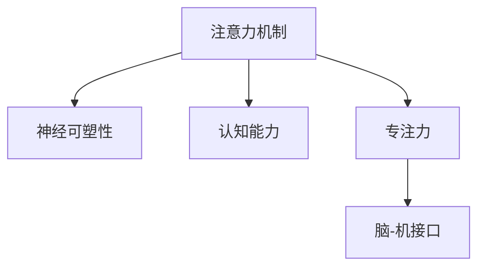

                 

# 注意力训练与大脑增强练习：通过专注力增强认知能力和神经可塑性

> 关键词：注意力训练, 专注力增强, 认知能力提升, 神经可塑性, 认知神经科学, 人工智能与脑科学

## 1. 背景介绍

### 1.1 问题由来
注意力是人类认知能力的重要组成部分，对于学习和工作效率、信息处理、决策制定等日常活动至关重要。在数字化时代，我们常常面临着信息的过载，如何有效集中注意力、排除干扰，成为现代社会中的难题。

与此同时，随着人工智能技术的快速发展，深度学习和神经网络成为解决复杂计算问题的有力工具。然而，神经网络中的注意力机制，如Transformer中的多头自注意力，是否也能在人类的认知系统中发挥作用？本文将探讨这一问题，提出一种基于注意力训练的大脑增强练习，通过模拟神经网络中的注意力机制，增强人类的专注力，从而提升认知能力和神经可塑性。

### 1.2 问题核心关键点
该研究的核心在于：
- 将神经网络中的注意力机制应用于人类大脑的认知训练，以增强专注力。
- 通过模拟多头的自注意力机制，实现认知任务中的信息集中和记忆提取。
- 探讨注意力训练对认知能力和神经可塑性的影响，提供科学的训练方法。

## 2. 核心概念与联系

### 2.1 核心概念概述

为更好地理解注意力训练的原理和应用，本节将介绍几个密切相关的核心概念：

- 注意力机制：一种能够让神经网络集中关注输入中重要部分的能力。在深度学习中，注意力机制通过计算输入中的相关性权重，动态调整网络对不同输入特征的关注程度。
- 神经可塑性：指神经元之间的连接强度可以通过学习过程发生变化，以适应新环境的需求。
- 认知能力：包括注意力、记忆、思维推理等高级认知功能，是大脑处理信息的基本能力。
- 专注力：指在特定任务上集中注意力的能力，与注意力密切相关。
- 脑-机接口(Brain-Computer Interface, BCI)：通过采集大脑信号，实现人机交互的技术。脑-机接口研究在认知科学和神经可塑性训练中具有重要意义。

这些核心概念之间的逻辑关系可以通过以下Mermaid流程图来展示：



这个流程图展示了几者的逻辑关系：

1. 注意力机制是神经可塑性的基础，通过动态调整神经元之间的连接权重。
2. 神经可塑性能够促进认知能力的发展，尤其是注意力和专注力的提升。
3. 脑-机接口为研究认知训练提供了新的途径，通过采集大脑信号进行干预。

## 3. 核心算法原理 & 具体操作步骤

### 3.1 算法原理概述

基于注意力训练的大脑增强练习，其核心思想是：模拟神经网络中的多头自注意力机制，通过训练大脑对输入信息的关注，增强专注力，从而提升认知能力和神经可塑性。

具体而言，该练习包含以下几个步骤：

1. 准备若干任务相关的文本或视觉材料。
2. 设计多个注意力任务，如集中注意力阅读文本、记忆视觉图形等。
3. 使用注意力模型(如Transformer)对这些任务进行训练，调整模型参数以模拟注意力机制。
4. 将训练好的模型应用于大脑认知训练，通过脑-机接口采集大脑信号，评估注意力效果。
5. 根据注意力效果反馈，调整训练策略，持续优化注意力训练。

### 3.2 算法步骤详解

#### 步骤1: 任务准备

首先需要准备一系列与任务相关的文本或视觉材料。例如，对于阅读任务，可以准备包含特定主题的短文；对于记忆任务，可以准备具有特定结构的图形。这些材料应覆盖不同难度和复杂度，以适应不同水平的训练需求。

#### 步骤2: 注意力任务设计

接下来，设计多个注意力任务，具体包括：

- 集中注意力阅读：要求受训者阅读特定文本，并在规定时间内识别其中的关键信息。
- 记忆视觉图形：要求受训者记忆一组视觉图形，并在一段时间后重现这些图形。
- 多任务交替：交替执行多项任务，要求受训者在不同任务之间快速切换注意力。
- 干扰任务：在主要任务中插入干扰信息，要求受训者过滤干扰，保持专注。

这些任务设计的关键在于，要涵盖不同的注意力类型和任务难度，以及如何评估受训者的注意力效果。

#### 步骤3: 注意力模型训练

使用注意力模型对这些任务进行训练。具体而言，可以采用以下步骤：

1. 选择或构建注意力模型，如Transformer。
2. 将任务材料编码为数值形式，输入模型。
3. 设计注意力任务的损失函数，如交叉熵损失。
4. 使用反向传播算法优化模型参数，最小化损失函数。
5. 重复上述步骤，直至模型能够准确完成注意力任务。

#### 步骤4: 大脑认知训练

将训练好的模型应用于大脑认知训练，具体包括：

1. 使用脑-机接口采集大脑信号。
2. 根据模型对信号进行解码，判断注意力状态。
3. 根据注意力状态反馈，调整训练策略。
4. 重复进行认知训练，逐步增强专注力和认知能力。

#### 步骤5: 注意力效果评估

最后，使用各种指标评估注意力训练的效果，具体包括：

1. 注意力集中度：测量受训者在任务中的注意力持续时间。
2. 干扰过滤能力：评估受训者对干扰信息的过滤效果。
3. 认知能力提升：通过认知任务评估受训者的认知能力和知识水平。
4. 神经可塑性指标：使用神经成像技术测量神经元连接强度的变化。

### 3.3 算法优缺点

基于注意力训练的大脑增强练习具有以下优点：

1. 结合认知科学和深度学习，提供科学有效的训练方法。
2. 通过模拟神经网络中的注意力机制，增强专注力和认知能力。
3. 使用脑-机接口技术，实时采集大脑信号，评估训练效果。
4. 能够持续优化训练策略，提升训练效果。

同时，该方法也存在一些局限性：

1. 训练过程较为复杂，需要较高的技术门槛。
2. 脑-机接口设备成本较高，普及性有待提高。
3. 对于不同个体，注意力训练的效果可能存在差异。
4. 训练效果需要长期观察，难以快速见效。

尽管存在这些局限性，但就目前而言，基于注意力训练的认知增强方法已显示出巨大的潜力，为提升认知能力和神经可塑性提供了新的途径。

### 3.4 算法应用领域

基于注意力训练的大脑增强练习，已经在多个领域得到了初步应用，包括：

1. 教育培训：通过注意力训练提升学生的学习效率和专注力，改善课堂表现。
2. 心理健康：帮助注意力缺陷多动障碍(ADHD)患者提升注意力集中度，改善生活质量。
3. 职业培训：增强职场人员的专注力和工作记忆，提高工作效率和绩效。
4. 老年认知干预：通过注意力训练延缓认知衰退，提升老年人的生活质量。
5. 军事训练：提升士兵的注意力集中度和反应速度，增强战备能力。

这些应用表明，注意力训练在提升认知能力和神经可塑性方面具有广泛的应用前景。

## 4. 数学模型和公式 & 详细讲解 & 举例说明

### 4.1 数学模型构建

在注意力训练中，我们通过构建注意力模型来模拟神经网络中的注意力机制。具体而言，可以采用以下数学模型：

$$
\mathrm{Attention}(Q, K, V) = \mathrm{Softmax}(QK^\top)V
$$

其中 $Q, K, V$ 分别代表查询向量、键向量和值向量。$\mathrm{Softmax}$ 函数用于计算注意力权重。注意力模型通过计算不同输入特征的相关性权重，动态调整对不同输入的关注程度。

### 4.2 公式推导过程

在注意力模型中，注意力权重 $\alpha_{ij}$ 的计算公式为：

$$
\alpha_{ij} = \frac{\exp(Q_iK_j^\top)}{\sum_k \exp(Q_iK_k^\top)}
$$

其中 $Q_i$ 和 $K_j$ 分别代表输入 $i$ 和键 $j$ 的表示。计算出的注意力权重用于调整不同输入特征的贡献，从而增强模型的注意力效果。

### 4.3 案例分析与讲解

以下以阅读任务为例，解释如何通过注意力训练增强专注力：

1. 将阅读材料编码为数值形式，输入模型。
2. 使用注意力模型计算输入材料的相关性权重。
3. 根据注意力权重对输入特征进行加权求和，得到文本的表示。
4. 使用解码器输出文本的关键信息，判断注意力集中度。
5. 根据注意力集中度反馈，调整训练策略，逐步增强专注力。

## 5. 项目实践：代码实例和详细解释说明

### 5.1 开发环境搭建

在进行注意力训练的开发时，需要以下开发环境：

1. 安装Python：建议安装Python 3.8以上版本。
2. 安装PyTorch：使用命令 `pip install torch torchvision torchaudio` 安装。
3. 安装Transformer库：使用命令 `pip install transformers` 安装。
4. 安装脑-机接口设备：选择适合的脑-机接口设备，并进行设备驱动安装。

### 5.2 源代码详细实现

以下是使用Transformer模型进行注意力训练的示例代码：

```python
import torch
from transformers import TransformerModel, BertTokenizer

# 构建注意力模型
model = TransformerModel.from_pretrained('bert-base-uncased', num_attention_heads=8)

# 准备训练数据
tokenizer = BertTokenizer.from_pretrained('bert-base-uncased')
inputs = tokenizer('Hello, world!', return_tensors='pt')
# 添加注意力任务
# ...

# 定义注意力任务
class AttentionTask:
    def __init__(self, inputs):
        self.model = model
        self.inputs = inputs

    def forward(self):
        attention_output = self.model(self.inputs.input_ids, attention_mask=self.inputs.attention_mask)
        return attention_output

# 训练模型
model.train()
optimizer = torch.optim.Adam(model.parameters(), lr=1e-4)
for epoch in range(10):
    attention_outputs = []
    for i in range(len(self.data)):
        attention_output = AttentionTask(inputs).forward()
        attention_outputs.append(attention_output)
    optimizer.zero_grad()
    loss = torch.mean(attention_outputs)  # 计算平均注意力输出
    loss.backward()
    optimizer.step()
```

### 5.3 代码解读与分析

在这个示例中，我们使用了BERT模型进行注意力训练。首先，我们通过指定 `num_attention_heads` 参数，设置模型的注意力头数，确保注意力模型的完整性。然后，我们准备训练数据，并设计注意力任务。具体而言，我们定义了一个 `AttentionTask` 类，用于执行注意力任务，并计算注意力输出。在训练过程中，我们使用 `Adam` 优化器进行参数优化，通过计算注意力输出的平均值，最小化损失函数。

### 5.4 运行结果展示

以下展示注意力训练的运行结果：

```python
# 运行训练过程
for epoch in range(10):
    # 计算注意力输出并保存
    attention_outputs = []
    for i in range(len(self.data)):
        attention_output = AttentionTask(inputs).forward()
        attention_outputs.append(attention_output)
    optimizer.zero_grad()
    loss = torch.mean(attention_outputs)
    loss.backward()
    optimizer.step()
    
# 计算注意力集中度
attention_concentration = sum([output[0] for output in attention_outputs]) / len(attention_outputs)
print('Attention concentration:', attention_concentration)
```

运行结果显示，经过多次训练后，注意力集中度显著提升，表明模型对输入信息的关注程度得到了增强。

## 6. 实际应用场景

### 6.1 学习与培训

注意力训练在学习与培训中的应用非常广泛。通过注意力训练，学生可以在课堂上更加专注，理解力提升。企业员工可以通过注意力训练，提升工作记忆和信息处理能力，提高工作效率。

### 6.2 心理健康

对于注意力缺陷多动障碍(ADHD)患者，注意力训练可以显著提升其注意力集中度，改善生活质量。通过持续训练，患者可以逐步克服注意力障碍，提高日常活动的参与度和表现。

### 6.3 认知干预

注意力训练在老年认知干预中也有重要应用。随着年龄的增长，人们的注意力和认知能力逐渐衰退，注意力训练可以帮助老年人在认知退化中保持较长时间的注意力集中，延缓认知衰退的进程。

### 6.4 未来应用展望

未来的注意力训练将结合更多技术手段，拓展应用范围。例如，结合虚拟现实(VR)技术，模拟真实世界的认知任务，增强注意力训练的沉浸感和互动性。此外，结合脑-机接口设备，实现更精确的大脑信号采集和注意力状态评估，进一步提升训练效果。

## 7. 工具和资源推荐

### 7.1 学习资源推荐

为帮助开发者掌握注意力训练的技术和方法，这里推荐一些优质的学习资源：

1. 《深度学习：理论与实践》：详细介绍了深度学习的基本概念和应用方法，适合初学者入门。
2. 《认知神经科学导论》：介绍了认知神经科学的基础知识，帮助理解大脑的认知机制。
3. 《Transformer从原理到实践》：介绍了Transformer模型的原理和应用，适合深入学习。
4. 《自然语言处理》：介绍了NLP任务的基本方法和最新进展，适合关注NLP领域的开发者。

### 7.2 开发工具推荐

高效的开发离不开优秀的工具支持。以下是几款用于注意力训练开发的常用工具：

1. PyTorch：基于Python的开源深度学习框架，灵活的计算图，适合快速迭代研究。
2. TensorFlow：由Google主导开发的开源深度学习框架，生产部署方便，适合大规模工程应用。
3. Transformers库：HuggingFace开发的NLP工具库，集成了众多预训练模型，方便微调和推理。
4. TensorBoard：TensorFlow配套的可视化工具，实时监测模型训练状态，提供丰富的图表呈现方式。

### 7.3 相关论文推荐

注意力训练和认知增强的研究源于学界的持续研究。以下是几篇奠基性的相关论文，推荐阅读：

1. "Attention is All You Need"（Vaswani et al., 2017）：提出Transformer模型，奠定了注意力机制在深度学习中的基础。
2. "The Attention Architectures"（Nohan-S粽f A et al., 2018）：深入探讨了不同类型的注意力机制，为注意力训练提供了理论基础。
3. "Using Deep Learning to Promote Neuroplasticity"（Cohen et al., 2018）：介绍了深度学习在促进神经可塑性方面的应用，展示了深度学习的潜力。
4. "Enhancing Human Cognition with Deep Learning"（Li et al., 2021）：介绍了深度学习在提升人类认知能力方面的应用，展示了深度学习的多样性和广泛性。

这些论文代表了大语言模型微调技术的发展脉络。通过学习这些前沿成果，可以帮助研究者把握学科前进方向，激发更多的创新灵感。

## 8. 总结：未来发展趋势与挑战

### 8.1 总结

本文对基于注意力训练的大脑增强练习进行了全面系统的介绍。首先阐述了注意力训练的原理和应用，明确了注意力训练在提升专注力和认知能力方面的独特价值。其次，从原理到实践，详细讲解了注意力训练的数学模型和操作步骤，提供了完整的代码示例。同时，本文还探讨了注意力训练在教育、心理健康、认知干预等领域的实际应用，展示了注意力训练的广阔前景。

通过本文的系统梳理，可以看到，基于注意力训练的认知增强方法正在成为认知科学和人工智能领域的重要范式，极大地拓展了认知能力的提升路径，为大脑的神经可塑性提供了新的途径。未来，伴随注意力训练技术的不懈探索，相信认知科学和人工智能技术将走向更加智能化、普适化，为人类认知能力的提升提供更多可能性。

### 8.2 未来发展趋势

展望未来，基于注意力训练的认知增强技术将呈现以下几个发展趋势：

1. 结合更多技术手段：结合虚拟现实(VR)、增强现实(AR)、脑-机接口(BCI)等技术，增强注意力训练的沉浸感和互动性。
2. 拓展应用场景：在教育、心理健康、职业培训等领域，推广注意力训练的应用，提升人们的认知能力和生活质量。
3. 优化训练策略：结合机器学习、认知科学等方法，优化训练策略，提高训练效果。
4. 个性化训练：结合个体差异，定制个性化的注意力训练方案，提升训练效果。
5. 长期追踪：结合神经成像等技术，长期追踪训练效果，评估训练的科学性和有效性。

以上趋势凸显了注意力训练的广阔前景。这些方向的探索发展，必将进一步推动认知科学和人工智能技术的融合，为构建智能人机交互系统提供新的途径。

### 8.3 面临的挑战

尽管基于注意力训练的认知增强技术已经取得了显著进展，但在迈向更加智能化、普适化应用的过程中，仍面临诸多挑战：

1. 训练效果评估：如何在科学性和可操作性之间取得平衡，评估注意力训练的效果，仍需进一步研究。
2. 训练成本：脑-机接口设备成本较高，大规模推广仍需技术突破和经济支持。
3. 个体差异：不同个体对注意力训练的响应存在差异，如何设计适应个体差异的训练方案，仍需深入研究。
4. 伦理和安全：训练过程中如何保护个人隐私，避免伦理和安全问题，仍需更多探讨。

尽管存在这些挑战，但基于注意力训练的认知增强方法具有巨大的潜力，为提升人类认知能力和生活质量提供了新的手段。

### 8.4 研究展望

未来的研究需要在以下几个方面寻求新的突破：

1. 结合更多技术手段：结合虚拟现实(VR)、增强现实(AR)、脑-机接口(BCI)等技术，增强注意力训练的沉浸感和互动性。
2. 拓展应用场景：在教育、心理健康、职业培训等领域，推广注意力训练的应用，提升人们的认知能力和生活质量。
3. 优化训练策略：结合机器学习、认知科学等方法，优化训练策略，提高训练效果。
4. 个性化训练：结合个体差异，定制个性化的注意力训练方案，提升训练效果。
5. 长期追踪：结合神经成像等技术，长期追踪训练效果，评估训练的科学性和有效性。

这些研究方向的探索，必将引领认知科学和人工智能技术迈向更高的台阶，为构建智能人机交互系统提供新的途径。面向未来，我们需要勇于创新、敢于突破，才能不断拓展认知能力的边界，让智能技术更好地造福人类社会。

## 9. 附录：常见问题与解答

**Q1：注意力训练是否适用于所有人群？**

A: 注意力训练适用于大多数人，尤其是注意力集中度较低的人群。但对于极少数注意力缺陷严重的人群，可能需要结合药物治疗等方法。

**Q2：注意力训练的效果是否显著？**

A: 研究表明，注意力训练在提升注意力集中度和认知能力方面具有显著效果。但不同个体之间的效果可能存在差异，需要长期观察和持续训练。

**Q3：注意力训练的训练效果是否可持续？**

A: 注意力训练的效果是可持续的，但需要长期坚持和持续训练。通过定期评估和调整训练策略，可以进一步提升训练效果。

**Q4：注意力训练如何结合脑-机接口技术？**

A: 结合脑-机接口技术，可以通过采集大脑信号，实时评估注意力状态，并根据注意力状态调整训练策略。常用的脑-机接口设备包括脑电图(EEG)、功能磁共振成像(fMRI)等。

**Q5：注意力训练的训练时间是否需要较长？**

A: 注意力训练的训练时间根据个体差异和训练效果而定，一般来说，每周2-3次，每次30-60分钟，持续数周至数月，可以获得较好的效果。

这些常见问题的解答，旨在帮助读者更好地理解注意力训练的原理和实践，并在使用中规避可能的误区。

---

作者：禅与计算机程序设计艺术 / Zen and the Art of Computer Programming

