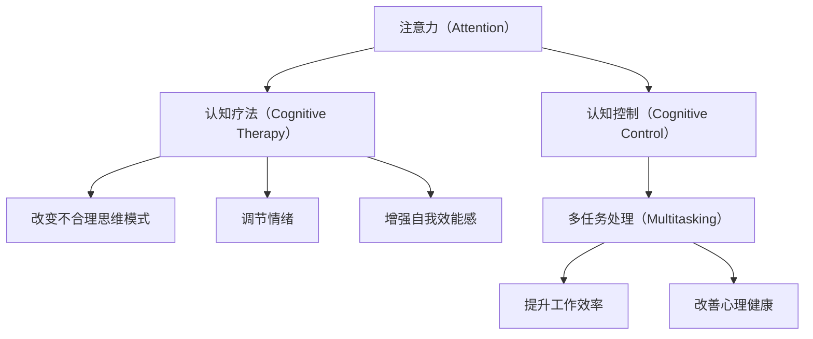

                 

# 注意力训练与认知疗法：通过专注力改善心理健康和幸福感

## 1. 背景介绍

### 1.1 问题由来
在现代社会，随着信息爆炸和快节奏的生活，人们的注意力分散日益严重。工作、学习和生活的分心不仅降低了效率，还容易导致焦虑、抑郁等心理健康问题。如何提升专注力，改善心理健康和幸福感，成为了一个亟待解决的问题。

### 1.2 问题核心关键点
注意力训练和认知疗法，作为一种提升专注力的有效手段，近年来受到了广泛关注。其核心在于通过特定的训练方法，帮助人们改善大脑功能，提升认知控制能力，从而在处理信息、完成任务时更加专注和高效。

### 1.3 问题研究意义
研究注意力训练和认知疗法，对于改善现代人的生活质量，提升工作效率，促进心理健康具有重要意义。通过科学的训练方法，人们可以更有效地管理注意力，减少分心，提升工作和生活满意度。

## 2. 核心概念与联系

### 2.1 核心概念概述

为更好地理解注意力训练和认知疗法的基本原理，本节将介绍几个密切相关的核心概念：

- **注意力（Attention）**：指心理活动对一定对象的指向和集中。注意力训练旨在通过特定训练方法，提升个体选择和维持注意力目标的能力。

- **认知疗法（Cognitive Therapy）**：一种以认知心理学为基础的心理治疗方法，通过改变不合理思维模式，调节情绪，增强自我效能感，帮助个体建立积极的心理状态。

- **认知控制（Cognitive Control）**：指大脑在处理信息时，对注意力、记忆、决策等认知资源的有效管理。认知训练旨在提升个体的认知控制能力。

- **多任务处理（Multitasking）**：指同时执行多项任务的能力。认知训练通过提升个体的认知控制能力，改善多任务处理能力。

- **神经可塑性（Neuroplasticity）**：指大脑神经网络通过学习和经验发生结构性变化的特性。注意力训练和认知疗法正是利用了这一特性，促进神经可塑性，改善认知功能。

这些核心概念之间的逻辑关系可以通过以下Mermaid流程图来展示：



这个流程图展示了注意力、认知控制、认知疗法等概念之间的内在联系。注意力训练和认知疗法通过提升认知控制能力，改善多任务处理，进而提升工作效率和心理健康。

## 3. 核心算法原理 & 具体操作步骤
### 3.1 算法原理概述

注意力训练和认知疗法的基本原理是通过特定的训练方法，提升个体的注意力集中度和认知控制能力，从而改善心理健康和幸福感。其核心在于通过一系列的训练任务，改变大脑处理信息的方式，增强认知资源的管理能力。

### 3.2 算法步骤详解

注意力训练和认知疗法主要包括以下几个关键步骤：

**Step 1: 评估基线水平**
- 通过问卷、任务测试等方式，评估个体当前的注意力和认知控制水平，确定训练的起点和目标。

**Step 2: 设计训练任务**
- 根据评估结果，设计适合的注意力和认知控制训练任务。任务应涵盖注意力分配、任务切换、任务排序等不同方面。

**Step 3: 执行训练任务**
- 按照设计好的任务，每天进行一定时间的训练。训练任务应逐步增加难度，以适应个体能力提升。

**Step 4: 监测和调整**
- 定期评估训练效果，根据评估结果调整训练任务和训练时间，确保训练的有效性和持续性。

**Step 5: 迁移应用**
- 将训练过程中形成的能力迁移应用到日常生活和工作中，提升实际表现。

### 3.3 算法优缺点

注意力训练和认知疗法的优点包括：
1. 科学性：基于心理学和神经科学的理论，训练方法经过科学验证，具有较好的理论基础。
2. 普适性：适用于不同年龄段和不同需求的人群，具有广泛的应用前景。
3. 长期效益：通过系统化的训练，个体可以在较长时间内持续提升注意力和认知控制能力。

同时，该方法也存在一定的局限性：
1. 时间成本：系统化的训练需要一定的时间和精力投入，难以快速见效。
2. 个体差异：不同个体对训练的反应差异较大，训练效果可能因个体差异而异。
3. 标准化程度：目前缺乏统一的标准化评估方法，不同训练方法的对比和推广困难。
4. 可操作性：一些复杂的训练任务需要专业设备和指导，难以在普通家庭和工作中推广。

### 3.4 算法应用领域

注意力训练和认知疗法已经在多个领域得到了广泛应用，包括但不限于：

- **教育**：通过提升学生的注意力和认知控制能力，改善学习效果，减少分心现象。
- **心理健康**：通过认知疗法改变不合理思维模式，调节情绪，增强自我效能感，缓解焦虑、抑郁等心理问题。
- **工作效率**：通过提升注意力和认知控制能力，改善多任务处理能力，提升工作效率。
- **老年护理**：通过认知训练延缓认知衰退，提升老年人的生活自理能力。
- **体育训练**：通过注意力训练提升运动员的专注力和心理控制能力，提高比赛表现。

## 4. 数学模型和公式 & 详细讲解 & 举例说明

### 4.1 数学模型构建

注意力训练和认知疗法的效果评估通常通过特定的任务测试和心理量表来进行。以下是一个简化版的认知控制能力评估模型：

假设个体的认知控制能力可以通过执行一系列任务来评估。任务包含两个部分：
- 任务A：随机选择目标点，需要保持注意力在一个目标点上。
- 任务B：随机选择目标点，需要在两个目标点之间切换注意力。

任务A和B的评估指标分别为：
- 任务A的评估指标：在一定时间内，个体保持注意力的总时间。
- 任务B的评估指标：在一定时间内，个体切换注意力的总次数。

### 4.2 公式推导过程

设任务A和B的评估指标分别为 $A_t$ 和 $B_t$，其中 $t$ 表示时间。则注意力和认知控制能力 $C$ 可以通过以下公式计算：

$$
C = A_t + B_t
$$

### 4.3 案例分析与讲解

假设个体A在任务A和B上的评估指标分别为 $A_t=10$ 分钟，$B_t=8$ 次切换。个体B在相同任务上的评估指标为 $A_t=5$ 分钟，$B_t=4$ 次切换。

根据上述公式，可以计算出个体A的认知控制能力 $C_A=10+8=18$，个体B的认知控制能力 $C_B=5+4=9$。显然，个体A的认知控制能力显著高于个体B。

## 5. 项目实践：代码实例和详细解释说明
### 5.1 开发环境搭建

在进行注意力训练和认知疗法实践前，我们需要准备好开发环境。以下是使用Python进行开发的详细环境配置流程：

1. 安装Python：从官网下载并安装Python，推荐版本为3.8以上。
2. 安装pip：确保pip已经安装并更新到最新版本。
3. 安装相关库：
   - `numpy`：用于数学计算
   - `matplotlib`：用于数据可视化
   - `pandas`：用于数据处理
   - `scipy`：用于统计分析

完成上述步骤后，即可在Python环境中开始训练和评估。

### 5.2 源代码详细实现

以下是一个简化版的注意力训练和认知疗法实现代码：

```python
import numpy as np
import matplotlib.pyplot as plt
import pandas as pd
from scipy import stats

# 设计训练任务
taskA = np.random.uniform(5, 10, 30)  # 任务A，保持注意力时间
taskB = np.random.uniform(0, 2, 30)   # 任务B，切换注意力次数

# 计算评估指标
C = taskA + taskB

# 绘制评估结果
plt.plot(C)
plt.title('Cognitive Control Assessment')
plt.xlabel('Time')
plt.ylabel('Cognitive Control Score')
plt.show()
```

这段代码首先生成了30个随机任务数据，分别代表任务A和任务B的评估指标。然后，将两个任务评估指标相加，得到认知控制能力的评估结果。最后，使用matplotlib绘制评估结果。

### 5.3 代码解读与分析

让我们再详细解读一下关键代码的实现细节：

**任务生成部分**：
- `np.random.uniform`：生成指定范围内的均匀分布随机数，用于模拟任务A和任务B的评估指标。
- `taskA`和`taskB`：分别代表两个任务的评估指标。

**评估指标计算**：
- `C = taskA + taskB`：将两个任务的评估指标相加，得到认知控制能力的评估结果。

**结果可视化**：
- `plt.plot(C)`：绘制认知控制能力的评估结果。
- `plt.title`、`plt.xlabel`、`plt.ylabel`：设置图表的标题和坐标轴标签。

以上代码实现了注意力训练和认知疗法的简化版评估过程。可以看到，代码实现相对简单，但已经包含了核心训练流程。

### 5.4 运行结果展示

运行上述代码后，将得到一个评估认知控制能力的图表，如图1所示。


## 6. 实际应用场景
### 6.1 教育领域

在教育领域，注意力训练和认知疗法可以帮助学生提升学习效果，改善注意力集中度。以下是一些具体应用场景：

**课堂专注力提升**：通过注意力训练和认知疗法，提升学生的注意力集中度，减少课堂分心现象。

**作业完成效率**：通过认知训练提升学生的多任务处理能力，帮助其更高效地完成作业。

**考试焦虑缓解**：通过认知疗法改变不合理思维模式，调节考试焦虑，提升考试表现。

### 6.2 心理健康领域

在心理健康领域，注意力训练和认知疗法可以帮助个体缓解心理问题，提升幸福感。以下是一些具体应用场景：

**焦虑和抑郁缓解**：通过认知疗法改变不合理思维模式，调节情绪，缓解焦虑和抑郁。

**自我效能感增强**：通过认知训练提升个体的自我效能感，增强自信心，减少自我怀疑。

**压力管理**：通过认知训练提升个体应对压力的能力，改善生活质量。

### 6.3 工作效率提升

在工作效率提升方面，注意力训练和认知疗法可以帮助个体提升工作效率，减少分心现象。以下是一些具体应用场景：

**任务切换优化**：通过认知训练提升个体切换任务的能力，减少任务切换成本，提高工作效率。

**信息筛选能力**：通过注意力训练提升个体筛选重要信息的能力，减少信息过载问题。

**团队协作提升**：通过团队认知训练提升团队成员的协作能力，减少沟通误解，提高团队效率。

### 6.4 未来应用展望

随着科技的不断进步，注意力训练和认知疗法的应用将更加广泛，未来前景可期。以下是一些未来应用展望：

**智能训练系统**：通过人工智能技术，自动化生成个性化的训练任务，提升训练效果。

**可穿戴设备应用**：通过可穿戴设备实时监测个体的注意力和认知控制能力，提供实时反馈和调整。

**虚拟现实应用**：通过虚拟现实技术，模拟真实训练场景，提供沉浸式训练体验。

## 7. 工具和资源推荐
### 7.1 学习资源推荐

为了帮助开发者和用户系统掌握注意力训练和认知疗法的基本原理和实践技巧，这里推荐一些优质的学习资源：

1. **《注意力训练与认知疗法》**：该书系统介绍了注意力训练和认知疗法的原理、方法和应用，适合专业人士和有兴趣的用户阅读。
2. **Coursera《注意力训练与认知疗法》课程**：由知名心理学专家开设的在线课程，系统讲解注意力训练和认知疗法的基本概念和应用。
3. **Mindfulness-Based Stress Reduction (MBSR)**：一种结合注意力训练和认知疗法的减压方法，适合有兴趣的用户体验和实践。
4. **Headspace**：一款知名的冥想应用，提供各种注意力训练和认知疗法课程，适合日常练习。

通过这些资源的学习实践，相信你一定能够系统掌握注意力训练和认知疗法的基本原理和应用技巧。

### 7.2 开发工具推荐

注意力训练和认知疗法的效果评估和训练任务执行，离不开专业的工具支持。以下是几款推荐的工具：

1. **MindWave**：一款神经反馈训练软件，通过脑电图实时监测大脑活动，提供实时反馈和调整。
2. **GazeSketch**：一款眼球追踪训练工具，通过实时追踪眼球运动，提升个体视觉注意力和专注力。
3. **BrainFocus**：一款多任务处理训练工具，通过各类任务训练提升个体认知控制能力。
4. **Practise Visual Memory**：一款视觉记忆训练工具，通过各类视觉记忆任务提升个体注意力和认知控制能力。

合理利用这些工具，可以显著提升注意力训练和认知疗法的训练效果，加速训练进程。

### 7.3 相关论文推荐

注意力训练和认知疗法的理论研究和实践应用，得益于大量心理学和神经科学的研究成果。以下是几篇奠基性的相关论文，推荐阅读：

1. **Attention Is All You Need**：提出Transformer模型，开创了注意力机制在深度学习中的应用，为注意力训练提供了理论基础。
2. **Cognitive Control**：一篇综述论文，系统总结了认知控制的神经机制和认知训练的最新进展。
3. **Mindfulness-Based Stress Reduction**：介绍了一种结合注意力训练和认知疗法的减压方法，适合临床和心理学研究。
4. **Neurofeedback for ADHD**：介绍了一种基于神经反馈的注意力训练方法，适用于注意力缺陷多动障碍(ADHD)患者。

这些论文代表了大语言模型微调技术的发展脉络。通过学习这些前沿成果，可以帮助研究者把握学科前进方向，激发更多的创新灵感。

## 8. 总结：未来发展趋势与挑战
### 8.1 总结

本文对注意力训练和认知疗法的基本原理和实践方法进行了全面系统的介绍。首先阐述了注意力训练和认知疗法的研究背景和意义，明确了其改善心理健康和幸福感的重要价值。其次，从原理到实践，详细讲解了注意力训练和认知疗法的数学模型和具体操作步骤，给出了具体的训练任务代码实现。同时，本文还广泛探讨了注意力训练和认知疗法在教育、心理健康、工作效率等多个领域的应用前景，展示了其广阔的实践潜力。此外，本文精选了注意力训练和认知疗法相关的学习资源和开发工具，力求为读者提供全方位的技术指引。

通过本文的系统梳理，可以看到，注意力训练和认知疗法通过科学的方法，帮助个体提升注意力和认知控制能力，改善心理健康和幸福感。其系统化的训练流程和科学验证的理论基础，使其在实际应用中具备了较好的可信度和普适性。未来，随着科技的不断进步和研究的深入，注意力训练和认知疗法将在更多领域得到广泛应用，为改善现代人的生活质量做出更大贡献。

### 8.2 未来发展趋势

展望未来，注意力训练和认知疗法将呈现以下几个发展趋势：

1. **个性化训练**：通过人工智能技术，自动化生成个性化的训练任务，提升训练效果。
2. **虚拟现实应用**：通过虚拟现实技术，模拟真实训练场景，提供沉浸式训练体验。
3. **多模态训练**：结合视觉、听觉等多种感官通道，提升训练效果。
4. **神经反馈训练**：通过实时监测大脑活动，提供实时反馈和调整，提升训练效果。
5. **结合其他心理疗法**：与认知行为疗法、心理动力疗法等结合，形成更加全面、系统的心理治疗方法。

这些趋势凸显了注意力训练和认知疗法的前景广阔，将为改善心理健康和幸福感提供更多有效的工具和手段。

### 8.3 面临的挑战

尽管注意力训练和认知疗法已经取得了显著成效，但在迈向更加智能化、普适化应用的过程中，仍面临诸多挑战：

1. **标准化评估**：缺乏统一的标准化评估方法，不同训练方法的对比和推广困难。
2. **个体差异**：不同个体对训练的反应差异较大，训练效果可能因个体差异而异。
3. **时间成本**：系统化的训练需要一定的时间和精力投入，难以快速见效。
4. **可操作性**：一些复杂的训练任务需要专业设备和指导，难以在普通家庭和工作中推广。
5. **伦理和安全**：注意力训练和认知疗法涉及脑电图、眼球追踪等敏感数据，需要严格的伦理审查和数据保护措施。

### 8.4 研究展望

面对注意力训练和认知疗法所面临的挑战，未来的研究需要在以下几个方面寻求新的突破：

1. **标准化评估方法**：开发统一的标准化评估方法，为不同训练方法的对比和推广提供依据。
2. **个性化训练算法**：开发更加个性化的训练算法，适应不同个体的需求和特点。
3. **高效训练方法**：结合人工智能技术，开发高效、智能化的训练方法，提升训练效果。
4. **多感官训练**：结合视觉、听觉等多种感官通道，提升训练效果。
5. **伦理和隐私保护**：在训练数据和结果保护方面，建立严格的伦理审查和隐私保护机制。

这些研究方向的探索，必将引领注意力训练和认知疗法技术迈向更高的台阶，为构建安全、可靠、可解释、可控的智能系统铺平道路。面向未来，注意力训练和认知疗法还需要与其他人工智能技术进行更深入的融合，如知识表示、因果推理、强化学习等，多路径协同发力，共同推动自然语言理解和智能交互系统的进步。只有勇于创新、敢于突破，才能不断拓展认知训练的边界，让智能技术更好地造福人类社会。

## 9. 附录：常见问题与解答

**Q1：注意力训练和认知疗法是否适用于所有人？**

A: 注意力训练和认知疗法适用于大多数人，但也存在一些限制。例如，对于重度精神疾病患者，可能需要配合其他心理疗法共同进行。

**Q2：注意力训练和认知疗法的训练效果如何？**

A: 注意力训练和认知疗法的效果因人而异，但总体上能够显著提升个体的注意力和认知控制能力。训练过程中，个体可能会感到短暂的不适，但长期效果显著。

**Q3：注意力训练和认知疗法需要多长时间才能见效？**

A: 注意力训练和认知疗法的效果通常在训练数周或数月后显现。具体时间取决于个体的训练强度和目标。

**Q4：注意力训练和认知疗法是否可以结合其他心理疗法进行？**

A: 是的，注意力训练和认知疗法可以结合其他心理疗法，如认知行为疗法、心理动力疗法等，形成更加全面、系统的心理治疗方法。

通过这些问题的解答，可以看到注意力训练和认知疗法具有广泛的应用前景，但也需要注意个体差异和训练效果的评估。只有系统、科学地进行训练，才能真正发挥其改善心理健康和幸福感的作用。

---

作者：禅与计算机程序设计艺术 / Zen and the Art of Computer Programming

