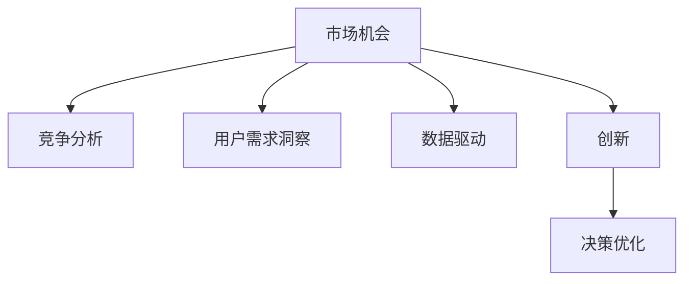

                 

# 洞察力与创业：发现市场机会的能力

> 关键词：洞察力,创业,市场机会,竞争分析,用户需求,数据驱动,创新,决策优化

## 1. 背景介绍

### 1.1 问题由来
在互联网和信息技术的推动下，创业环境发生了翻天覆地的变化。传统创业模式已经难以适应新的商业生态。如何在复杂多变的市场环境中，快速发现和把握市场机会，成为创业者面临的首要问题。传统的市场调研和商业洞察方法往往耗时长、成本高，且难以应对动态变化的市场环境。本文将深入探讨如何通过数据驱动、洞察力驱动的方法，发现市场机会，为创业者提供全新的思路和方法。

### 1.2 问题核心关键点
市场机会的发现是一个涉及市场、技术、用户等多维度因素的复杂过程。影响市场机会发现的关键因素包括：
- 竞争环境分析：了解现有市场中的主要竞争者及其市场份额、优势和劣势。
- 用户需求洞察：深入了解目标用户的痛点、需求和行为模式。
- 技术创新：掌握最新技术趋势和研发进展，判断技术突破可能带来的市场机会。
- 数据驱动：利用大数据、机器学习等工具，从海量数据中发现潜在的市场机会。

这些核心关键点共同构成了发现市场机会的基础框架，帮助创业者在动态变化的市场环境中把握机会。

## 2. 核心概念与联系

### 2.1 核心概念概述

为更好地理解发现市场机会的方法，本节将介绍几个密切相关的核心概念：

- 市场机会(Market Opportunity)：指在市场中存在的尚未被满足的需求，通过创新产品或服务，可以实现商业化的潜在商业价值。
- 竞争分析(Competitive Analysis)：指通过收集和分析竞争对手的信息，了解市场中的竞争态势，制定有效的竞争策略。
- 用户需求洞察(User Requirement Insight)：指通过调查研究、数据分析等手段，深入了解用户需求和行为模式，提供精准的用户体验和产品功能。
- 数据驱动(Data-Driven)：指利用大数据和机器学习技术，从数据中发现模式和趋势，指导商业决策和市场战略。
- 创新(Innovation)：指通过技术突破、商业模式创新等方式，实现产品或服务的差异化，满足用户的深层次需求。
- 决策优化(Decision Optimization)：指通过数学模型、算法等工具，优化商业决策过程，实现最佳的资源配置和收益最大化。

这些核心概念之间的逻辑关系可以通过以下Mermaid流程图来展示：



这个流程图展示了市场机会发现的关键环节和相互关系：

1. 市场机会通过竞争分析、用户需求洞察、数据驱动和创新等手段得到发现。
2. 竞争分析了解市场竞争态势，为决策提供依据。
3. 用户需求洞察揭示用户痛点，指导产品设计和功能开发。
4. 数据驱动从海量数据中发现市场趋势，优化决策过程。
5. 创新实现差异化竞争，提升产品竞争力。
6. 决策优化优化商业决策，提高资源利用效率。

这些概念共同构成了发现市场机会的核心框架，通过理解这些核心概念，我们可以更好地把握市场机会发现的全流程。

## 3. 核心算法原理 & 具体操作步骤
### 3.1 算法原理概述

发现市场机会的核心算法原理主要包括数据驱动、竞争分析和用户需求洞察等方法，通过收集和分析相关数据，识别市场中的潜在机会。以下是这些方法的具体描述：

- **数据驱动**：通过收集市场数据、用户反馈、行业报告等，利用数据挖掘、机器学习等技术，从海量数据中提取模式和趋势，发现潜在的市场机会。
- **竞争分析**：通过收集竞争对手的信息，包括产品特点、市场份额、用户评价等，利用竞争情报技术，分析市场竞争态势，识别自身的优势和劣势，制定有效的竞争策略。
- **用户需求洞察**：通过用户调查、行为分析、用户反馈等手段，深入了解用户的痛点和需求，指导产品设计和功能开发，提高用户体验和满意度。

这些方法共同构成了发现市场机会的技术基础，通过合理组合和应用，可以在复杂多变的市场环境中把握机会，提升商业决策的科学性和准确性。

### 3.2 算法步骤详解

发现市场机会的具体操作步骤可以分为以下几个步骤：

**Step 1: 数据收集与预处理**
- 收集市场数据、用户反馈、行业报告等，如Google Trends、Twitter舆情、亚马逊销量数据等。
- 对数据进行清洗、归一化、去重等预处理，确保数据的质量和一致性。

**Step 2: 数据分析与模型训练**
- 使用数据挖掘、机器学习等技术，对数据进行聚类、分类、回归等分析，识别市场趋势和用户行为模式。
- 使用模型如K-means、随机森林、LSTM等，训练预测模型，预测未来的市场变化和用户需求。

**Step 3: 竞争情报分析**
- 收集竞争对手的信息，如产品特点、市场份额、用户评价等。
- 使用文本挖掘、情感分析等技术，分析竞争对手的优势和劣势，识别市场空缺和机会。

**Step 4: 用户需求分析**
- 通过用户调查、行为分析、用户反馈等手段，深入了解用户的痛点和需求。
- 使用用户画像、关联规则挖掘等技术，发现用户的潜在需求和行为模式。

**Step 5: 创新与优化**
- 结合数据分析和竞争情报的结果，进行产品设计和功能优化，实现产品差异化。
- 使用决策优化模型，如线性规划、动态规划等，优化资源配置和商业决策。

通过上述步骤，可以实现从数据收集、分析到竞争情报、用户需求洞察，再到创新与优化的全流程，科学、高效地发现市场机会。

### 3.3 算法优缺点

数据驱动和洞察力驱动的方法在发现市场机会方面具有以下优点：
1. **数据全面性**：利用大数据和机器学习技术，从海量数据中提取模式和趋势，获取全面的市场信息。
2. **分析深度**：通过深度学习、自然语言处理等技术，深入挖掘用户需求和行为模式，提供精准的市场洞察。
3. **动态响应**：能够及时响应市场变化，调整商业策略，适应动态变化的市场环境。
4. **效率提升**：自动化处理数据和模型训练，提高分析效率，缩短决策周期。

同时，这些方法也存在一定的局限性：
1. **数据质量**：数据质量差、噪音大、样本量不足等都会影响分析结果的准确性。
2. **模型复杂性**：模型复杂度高，解释难度大，模型构建和调参成本高。
3. **隐私风险**：数据涉及用户隐私，需注意数据安全和隐私保护。
4. **竞争情报难度**：竞争对手信息难以获取，分析难度大。
5. **用户需求多样性**：用户需求多样、变化快，难以全面覆盖。

尽管存在这些局限性，但数据驱动和洞察力驱动的方法在现代创业环境中，已成为发现市场机会的重要手段。未来相关研究的方向在于如何进一步提升数据质量、优化模型构建、增强隐私保护等，以更好地应对市场变化的挑战。

### 3.4 算法应用领域

发现市场机会的方法广泛应用于以下领域：

- 互联网企业：通过大数据分析和用户行为分析，发现新的商业模式和市场机会。
- 传统企业：利用行业报告和市场调研，了解市场变化和用户需求，调整商业战略。
- 新兴创业公司：利用竞争情报和用户需求洞察，发现市场空缺和机会，快速进入市场。
- 金融行业：通过大数据和机器学习技术，预测市场趋势，制定风险管理策略。
- 零售行业：通过分析用户购买行为和评论数据，优化库存管理和产品推荐。
- 医疗行业：通过分析医疗数据和用户反馈，发现新的医疗需求和创新解决方案。

这些领域的应用展示了数据驱动和洞察力驱动方法在发现市场机会中的广泛价值，推动了各行业的数字化转型和创新发展。

## 4. 数学模型和公式 & 详细讲解 & 举例说明

### 4.1 数学模型构建

本节将使用数学语言对发现市场机会的算法进行更加严格的刻画。

记市场机会为 $M$，影响因素为 $X$，则市场机会的数学模型可以表示为：

$$
M = f(X)
$$

其中，$f$ 为市场机会与影响因素之间的映射函数。为了更好地建模市场机会，可以使用以下数学模型：

- **线性回归模型**：如果 $M$ 和 $X$ 之间存在线性关系，则可以使用线性回归模型进行建模，公式为：

$$
M = \alpha + \beta_1 X_1 + \beta_2 X_2 + ... + \beta_n X_n
$$

- **决策树模型**：如果 $M$ 和 $X$ 之间存在非线性关系，则可以使用决策树模型进行建模，公式为：

$$
M = \left\{
\begin{aligned}
& f_1(X_1, X_2) & \text{if} &\quad X_1 \leq X_{1, thres} \\
& f_2(X_2, X_3) & \text{if} &\quad X_1 > X_{1, thres}
\end{aligned}
\right.
$$

- **深度学习模型**：如果 $M$ 和 $X$ 之间存在复杂非线性关系，则可以使用深度学习模型进行建模，公式为：

$$
M = \hat{f}(X)
$$

其中 $\hat{f}$ 为深度神经网络模型，通常使用卷积神经网络（CNN）、循环神经网络（RNN）或长短时记忆网络（LSTM）等。

### 4.2 公式推导过程

以下我们以线性回归模型为例，推导其公式及其梯度计算过程。

假设市场机会 $M$ 和影响因素 $X_1, X_2, ..., X_n$ 之间的关系为线性关系，则线性回归模型的目标是最小化预测误差 $\epsilon$：

$$
\epsilon = M - (\alpha + \beta_1 X_1 + \beta_2 X_2 + ... + \beta_n X_n)
$$

通过最小化误差平方和，得到线性回归模型的目标函数：

$$
\mathcal{L}(\alpha, \beta) = \frac{1}{2N} \sum_{i=1}^N (\epsilon_i)^2
$$

其中，$N$ 为样本数量，$\epsilon_i$ 为第 $i$ 个样本的误差。

通过梯度下降算法，最小化目标函数，得到模型参数的更新公式：

$$
\alpha, \beta_1, \beta_2, ..., \beta_n \leftarrow \alpha, \beta_1, \beta_2, ..., \beta_n - \eta \frac{\partial \mathcal{L}}{\partial \alpha}, \frac{\partial \mathcal{L}}{\partial \beta_1}, \frac{\partial \mathcal{L}}{\partial \beta_2}, ..., \frac{\partial \mathcal{L}}{\partial \beta_n}
$$

其中，$\eta$ 为学习率，$\frac{\partial \mathcal{L}}{\partial \alpha}, \frac{\partial \mathcal{L}}{\partial \beta_1}, \frac{\partial \mathcal{L}}{\partial \beta_2}, ..., \frac{\partial \mathcal{L}}{\partial \beta_n}$ 为模型参数的梯度，可以通过求导得到。

通过上述过程，可以训练得到最优的线性回归模型参数 $\alpha$ 和 $\beta$，从而预测市场机会 $M$。

### 4.3 案例分析与讲解

**案例1：互联网行业**

假设某互联网公司希望进入一个新兴市场。通过收集市场数据、用户反馈和行业报告，发现以下影响因素：
- 用户活跃度：表示用户访问频率，数值越大表示市场潜力越高。
- 市场规模：表示市场总用户数，数值越大表示市场容量越大。
- 技术创新：表示新技术的出现频率，数值越高表示市场竞争越激烈。
- 政策支持：表示政府对新兴市场的政策支持力度，数值越高表示市场前景越好。

公司使用线性回归模型对上述因素进行建模，得到如下线性回归模型：

$$
M = \alpha + \beta_1 X_1 + \beta_2 X_2 + \beta_3 X_3 + \beta_4 X_4
$$

模型训练后，得到最优参数 $\alpha$ 和 $\beta_1, \beta_2, \beta_3, \beta_4$，然后根据市场数据对模型进行预测，判断是否进入该市场。

**案例2：传统零售行业**

一家传统零售公司希望通过数据驱动的方式优化库存管理。通过收集历史销售数据和用户反馈，发现以下影响因素：
- 季节性因素：表示不同季节的销售情况，数值越大表示该季节的销售潜力越高。
- 促销活动：表示促销活动的频率和规模，数值越大表示促销活动对销售的提升效果越好。
- 品牌知名度：表示品牌的市场知名度，数值越大表示品牌对销售的推动作用越大。
- 物流效率：表示物流配送的效率，数值越高表示物流成本越低。

公司使用决策树模型对上述因素进行建模，得到如下决策树模型：

$$
M = \left\{
\begin{aligned}
& f_1(X_1, X_2) & \text{if} &\quad X_1 \leq X_{1, thres} \\
& f_2(X_2, X_3) & \text{if} &\quad X_1 > X_{1, thres}
\end{aligned}
\right.
$$

模型训练后，根据用户反馈和市场数据对模型进行预测，优化库存管理和产品推荐。

## 5. 项目实践：代码实例和详细解释说明
### 5.1 开发环境搭建

在进行市场机会发现项目的实践前，我们需要准备好开发环境。以下是使用Python进行机器学习开发的环境配置流程：

1. 安装Anaconda：从官网下载并安装Anaconda，用于创建独立的Python环境。

2. 创建并激活虚拟环境：
```bash
conda create -n market-opportunity python=3.8 
conda activate market-opportunity
```

3. 安装相关依赖：
```bash
pip install pandas numpy scikit-learn matplotlib seaborn sklearn matplotlib
```

完成上述步骤后，即可在`market-opportunity`环境中开始市场机会发现项目的开发。

### 5.2 源代码详细实现

下面我们以用户需求洞察为例，给出使用Scikit-learn库对用户行为进行分析和建模的Python代码实现。

首先，定义用户行为数据集：

```python
import pandas as pd

# 加载用户行为数据集
data = pd.read_csv('user_behavior.csv')

# 数据预览
print(data.head())
```

然后，使用用户行为数据集训练用户需求模型：

```python
from sklearn.cluster import KMeans
from sklearn.decomposition import PCA

# 提取关键特征
X = data[['feature1', 'feature2', 'feature3']]

# 特征降维
pca = PCA(n_components=2)
X_pca = pca.fit_transform(X)

# 聚类分析
kmeans = KMeans(n_clusters=3)
kmeans.fit(X_pca)

# 可视化结果
import matplotlib.pyplot as plt
plt.scatter(X_pca[:, 0], X_pca[:, 1], c=kmeans.labels_)
plt.title('User Behavior Clustering')
plt.xlabel('Principal Component 1')
plt.ylabel('Principal Component 2')
plt.show()
```

最后，分析聚类结果，提取用户需求特征：

```python
# 输出聚类结果
print(kmeans.labels_)

# 提取用户需求特征
cluster_centers = kmeans.cluster_centers_
feature_means = data.groupby(kmeans.labels_).mean()

# 输出聚类中心和用户需求特征
print(cluster_centers)
print(feature_means)
```

以上就是使用Scikit-learn库对用户行为数据进行聚类分析和用户需求洞察的完整代码实现。

### 5.3 代码解读与分析

让我们再详细解读一下关键代码的实现细节：

**用户行为数据集加载**：
- `pd.read_csv`：使用Pandas库加载CSV格式的用户行为数据集。

**关键特征提取**：
- `X = data[['feature1', 'feature2', 'feature3']]`：从数据集中选择关键特征，用于聚类分析。

**特征降维**：
- `pca = PCA(n_components=2)`：使用主成分分析（PCA）对数据进行降维，将高维数据映射到二维平面。
- `X_pca = pca.fit_transform(X)`：计算降维后的数据。

**聚类分析**：
- `kmeans = KMeans(n_clusters=3)`：使用K-means算法进行聚类，将数据分为3个簇。
- `kmeans.fit(X_pca)`：对降维后的数据进行聚类。

**可视化结果**：
- `plt.scatter`：使用Matplotlib库绘制聚类结果的散点图，可视化聚类中心的分布。

**聚类结果分析**：
- `print(kmeans.labels_)`：输出聚类结果，表示每个数据点所属的簇。
- `cluster_centers = kmeans.cluster_centers_`：提取聚类中心的坐标。
- `feature_means = data.groupby(kmeans.labels_).mean()`：对每个簇内的数据进行平均，计算每个簇的特征平均值。

通过上述代码，我们可以对用户行为数据进行聚类分析，发现用户的不同需求特征，指导产品设计和功能开发。

## 6. 实际应用场景
### 6.1 互联网企业

在互联网企业中，数据驱动和洞察力驱动的市场机会发现方法得到了广泛应用。通过大数据分析和用户行为分析，互联网公司可以快速发现新的商业机会，如社交媒体平台的用户需求洞察、电商平台的产品推荐等。

**示例1：社交媒体平台**

某社交媒体平台希望提升用户活跃度。通过收集用户行为数据和反馈，发现以下影响因素：
- 用户互动：表示用户之间的互动频率，数值越大表示用户粘性越高。
- 内容质量：表示内容的吸引力和可读性，数值越高表示内容质量越高。
- 功能丰富度：表示平台功能的丰富程度，数值越高表示用户选择越多。

平台使用聚类分析和回归模型对上述因素进行建模，发现用户互动和内容质量对用户活跃度有显著影响。然后根据模型预测，优化平台内容和功能，提升用户活跃度。

**示例2：电商平台**

某电商平台希望优化产品推荐系统。通过收集用户浏览和购买数据，发现以下影响因素：
- 用户偏好：表示用户对不同产品的偏好程度，数值越高表示用户对该产品越感兴趣。
- 产品评价：表示产品的评价分数，数值越高表示产品质量越高。
- 价格敏感度：表示用户对价格的敏感度，数值越高表示用户对价格变动越敏感。

平台使用协同过滤和回归模型对上述因素进行建模，发现用户偏好和产品评价对产品推荐效果有显著影响。然后根据模型预测，优化推荐算法，提升推荐效果。

### 6.2 传统零售行业

在传统零售行业，数据驱动和洞察力驱动的市场机会发现方法同样具有广泛应用。通过数据分析和用户行为分析，传统零售公司可以优化库存管理和产品推荐，提升用户体验和销售效果。

**示例1：超市连锁店**

某超市连锁店希望提升产品销量。通过收集历史销售数据和用户反馈，发现以下影响因素：
- 季节性因素：表示不同季节的销售情况，数值越大表示该季节的销售潜力越高。
- 促销活动：表示促销活动的频率和规模，数值越大表示促销活动对销售的提升效果越好。
- 品牌知名度：表示品牌的市场知名度，数值越高表示品牌对销售的推动作用越大。
- 物流效率：表示物流配送的效率，数值越高表示物流成本越低。

公司使用决策树模型和回归模型对上述因素进行建模，发现季节性和促销活动对产品销量有显著影响。然后根据模型预测，优化促销策略和库存管理，提升产品销量。

**示例2：服装零售商**

某服装零售商希望提升用户购物体验。通过收集用户浏览和购买数据，发现以下影响因素：
- 用户偏好：表示用户对不同产品的偏好程度，数值越高表示用户对该产品越感兴趣。
- 产品评价：表示产品的评价分数，数值越高表示产品质量越高。
- 购物便利性：表示购物过程的便利性，数值越高表示用户购物体验越好。
- 价格敏感度：表示用户对价格的敏感度，数值越高表示用户对价格变动越敏感。

公司使用协同过滤和回归模型对上述因素进行建模，发现用户偏好和产品评价对用户购物体验有显著影响。然后根据模型预测，优化产品推荐和购物流程，提升用户购物体验。

### 6.3 医疗行业

在医疗行业，数据驱动和洞察力驱动的市场机会发现方法同样具有广泛应用。通过数据分析和用户反馈，医疗行业可以发现新的医疗需求和创新解决方案，提升医疗服务的质量和效率。

**示例1：医院**

某医院希望提升患者就诊体验。通过收集患者就诊数据和反馈，发现以下影响因素：
- 诊疗等待时间：表示患者就诊的等待时间，数值越小表示就诊效率越高。
- 诊疗质量：表示医生的诊疗水平，数值越高表示诊疗质量越好。
- 医疗环境：表示医院的环境舒适度，数值越高表示医疗环境越舒适。
- 药品价格：表示药品的价格水平，数值越高表示药品价格越高。

医院使用回归模型对上述因素进行建模，发现诊疗等待时间和诊疗质量对患者就诊体验有显著影响。然后根据模型预测，优化就诊流程和诊疗服务，提升患者就诊体验。

**示例2：医疗保险公司**

某医疗保险公司希望优化保险产品设计。通过收集用户保险数据和反馈，发现以下影响因素：
- 健康状况：表示用户的健康状况，数值越高表示保险风险越高。
- 保险费用：表示保险费用水平，数值越高表示保险费用越高。
- 赔付比例：表示保险赔付比例，数值越高表示赔付比例越高。
- 理赔效率：表示理赔过程的效率，数值越高表示理赔效率越高。

公司使用回归模型对上述因素进行建模，发现健康状况和保险费用对保险产品设计有显著影响。然后根据模型预测，优化保险产品设计和理赔流程，提升用户满意度。

### 6.4 未来应用展望

随着数据驱动和洞察力驱动方法的不断发展和完善，市场机会发现技术将在更多领域得到应用，为传统行业带来变革性影响。

在智慧医疗领域，通过数据分析和用户反馈，发现新的医疗需求和创新解决方案，提升医疗服务的质量和效率。

在智能城市治理中，通过数据分析和用户行为分析，发现城市管理中的问题，优化城市资源配置和公共服务，提升城市管理效率。

在智能制造领域，通过数据分析和用户反馈，发现生产过程中的问题，优化生产流程和产品设计，提升生产效率和产品质量。

此外，在教育、交通、金融等多个领域，数据驱动和洞察力驱动的市场机会发现方法也将不断涌现，为传统行业带来新的变革和机遇。相信随着技术的日益成熟，市场机会发现技术将为传统行业带来深远影响，推动其数字化转型和创新发展。

## 7. 工具和资源推荐
### 7.1 学习资源推荐

为了帮助开发者系统掌握数据驱动和洞察力驱动的方法，这里推荐一些优质的学习资源：

1. 《数据科学基础》系列课程：Coursera上的数据科学基础课程，涵盖数据收集、数据清洗、数据分析等基本概念和技术。

2. 《机器学习实战》书籍：Peter Harrington所著的经典机器学习实战书籍，详细介绍了各类机器学习算法和应用案例。

3. 《Python数据分析实战》书籍：Jake VanderPlas所著的Python数据分析实战书籍，提供了大量Python数据分析和机器学习的代码实例。

4. Kaggle：Kaggle是一个数据科学竞赛平台，汇集了大量数据集和机器学习模型，适合学习数据驱动方法。

5. DataCamp：DataCamp是一个在线学习平台，提供大量Python、R、SQL等数据科学和机器学习的课程，适合系统学习。

通过这些资源的学习实践，相信你一定能够快速掌握数据驱动和洞察力驱动的方法，并用于发现市场机会。

### 7.2 开发工具推荐

高效的开发离不开优秀的工具支持。以下是几款用于数据驱动和洞察力驱动方法开发的常用工具：

1. Python：Python是数据科学和机器学习领域的主流编程语言，具有丰富的数据处理和机器学习库。

2. Pandas：Pandas是Python中的数据处理库，支持数据清洗、数据转换、数据可视化等操作。

3. NumPy：NumPy是Python中的数值计算库，支持高效的多维数组操作和数学运算。

4. Scikit-learn：Scikit-learn是Python中的机器学习库，支持各类分类、回归、聚类等算法。

5. TensorFlow：TensorFlow是Google开发的深度学习框架，支持大规模分布式计算，适合复杂模型的训练。

6. PyTorch：PyTorch是Facebook开发的深度学习框架，支持动态计算图，适合快速迭代研究。

7. Jupyter Notebook：Jupyter Notebook是一个交互式编程环境，支持Python代码的实时展示和互动，适合数据分析和机器学习实践。

合理利用这些工具，可以显著提升数据驱动和洞察力驱动方法的开发效率，加快创新迭代的步伐。

### 7.3 相关论文推荐

数据驱动和洞察力驱动方法的发展源于学界的持续研究。以下是几篇奠基性的相关论文，推荐阅读：

1. 《数据驱动决策：基于大数据的商业洞察》：介绍如何通过大数据和机器学习技术，从海量数据中提取模式和趋势，指导商业决策。

2. 《用户行为分析：提升用户体验和销售效果》：讨论如何通过用户行为分析，发现用户需求和行为模式，优化用户体验和销售效果。

3. 《竞争情报分析：提升市场竞争力》：探讨如何通过竞争情报技术，分析竞争对手的优势和劣势，制定有效的竞争策略。

4. 《机器学习在零售业的应用》：分析机器学习在零售业中的各种应用，如需求预测、库存管理、推荐系统等。

5. 《医疗数据分析：提升医疗服务的质量和效率》：讨论如何通过医疗数据分析，发现新的医疗需求和创新解决方案，提升医疗服务的质量和效率。

这些论文代表了大数据和洞察力驱动方法的发展脉络。通过学习这些前沿成果，可以帮助研究者把握学科前进方向，激发更多的创新灵感。

## 8. 总结：未来发展趋势与挑战

### 8.1 总结

本文对数据驱动和洞察力驱动的方法进行了全面系统的介绍。首先阐述了市场机会发现的重要性，明确了数据驱动和洞察力驱动方法的核心关键点，包括数据收集、数据分析、竞争情报分析和用户需求洞察等。其次，从原理到实践，详细讲解了线性回归、决策树、深度学习等算法，并给出了代码实例，展示了数据驱动和洞察力驱动方法的应用场景和优势。同时，本文还探讨了数据驱动和洞察力驱动方法在互联网、零售、医疗等多个行业领域的应用前景，展示了其广泛价值。最后，本文精选了数据驱动和洞察力驱动方法的学习资源和开发工具，力求为读者提供全方位的技术指引。

通过本文的系统梳理，可以看到，数据驱动和洞察力驱动的方法已经成为发现市场机会的重要手段，极大地拓展了数据科学在商业决策中的应用范围，推动了各行业的数字化转型和创新发展。未来，伴随数据技术和分析方法的不断演进，数据驱动和洞察力驱动方法必将在更多领域得到应用，为传统行业带来新的变革和机遇。

### 8.2 未来发展趋势

展望未来，数据驱动和洞察力驱动的方法将呈现以下几个发展趋势：

1. **数据自动化采集与清洗**：随着数据采集技术的进步，数据自动化采集和清洗技术将得到广泛应用，降低数据处理的复杂度和成本。

2. **多源数据融合**：通过整合不同数据源的信息，如社交媒体、电商数据、医疗数据等，实现数据的多源融合，提升分析的全面性和深度。

3. **实时数据处理与分析**：实时数据处理和分析技术将得到广泛应用，实现市场机会的实时发现和动态调整。

4. **智能决策系统**：基于大数据和机器学习的智能决策系统将得到广泛应用，实现商业决策的自动化和智能化。

5. **隐私保护与安全**：数据驱动和洞察力驱动方法将更加注重隐私保护和安全问题，确保数据的合法合规和用户隐私的安全。

6. **模型解释性**：通过引入可解释性技术，提高数据驱动和洞察力驱动方法的透明度和可解释性，增强决策的科学性和可信度。

以上趋势凸显了数据驱动和洞察力驱动方法的广阔前景。这些方向的探索发展，必将进一步提升数据科学在商业决策中的应用价值，推动各行业的数字化转型和创新发展。

### 8.3 面临的挑战

尽管数据驱动和洞察力驱动的方法已经取得了显著成效，但在迈向更加智能化、普适化应用的过程中，它仍面临诸多挑战：

1. **数据质量与噪声**：数据质量差、噪音大、样本量不足等问题，会严重影响分析结果的准确性。如何提高数据质量，降低噪声，提升数据可靠性和有效性，将是未来研究的重要方向。

2. **模型复杂性**：模型复杂度高，解释难度大，模型构建和调参成本高。如何简化模型结构，降低模型复杂度，提高模型的可解释性和可靠性，将是重要的优化方向。

3. **隐私保护与安全**：数据驱动和洞察力驱动方法涉及大量用户数据，隐私保护和安全问题亟待解决。如何保障数据安全和用户隐私，确保数据使用的合法合规，将是重要的研究课题。

4. **计算资源消耗**：数据驱动和洞察力驱动方法需要处理大量数据，计算资源消耗大。如何优化计算资源使用，提高数据处理效率，将是重要的优化方向。

5. **实时性要求**：市场机会发现需要实时响应，数据处理和分析的实时性要求高。如何提高数据处理的实时性和响应速度，实现市场机会的实时发现和动态调整，将是重要的研究课题。

6. **跨领域应用挑战**：数据驱动和洞察力驱动方法在不同行业的应用场景和需求差异较大，如何实现跨领域的通用化和适用性，将是重要的研究方向。

尽管存在这些挑战，但数据驱动和洞察力驱动的方法在现代创业环境中，已成为发现市场机会的重要手段。未来相关研究的方向在于如何进一步提升数据质量、优化模型构建、增强隐私保护等，以更好地应对市场变化的挑战。

### 8.4 研究展望

面对数据驱动和洞察力驱动方法所面临的挑战，未来的研究需要在以下几个方面寻求新的突破：

1. **自动化数据采集与清洗**：开发自动化数据采集和清洗工具，降低数据处理成本和复杂度。

2. **多模态数据融合**：将不同类型的数据进行多模态融合，提升数据处理的全面性和深度。

3. **实时数据处理与分析**：开发实时数据处理和分析技术，实现市场机会的实时发现和动态调整。

4. **智能决策系统**：开发智能决策系统，实现商业决策的自动化和智能化。

5. **隐私保护与安全**：开发隐私保护和安全技术，保障数据安全和用户隐私。

6. **模型解释性**：引入可解释性技术，提高数据驱动和洞察力驱动方法的透明度和可解释性。

7. **跨领域应用**：开发跨领域应用技术，实现数据驱动和洞察力驱动方法的通用化和适用性。

这些研究方向的探索，必将引领数据驱动和洞察力驱动方法迈向更高的台阶，为各行业的数字化转型和创新发展提供新的动力。

## 9. 附录：常见问题与解答

**Q1：如何判断一个市场机会是否值得进入？**

A: 评估一个市场机会是否值得进入，需要考虑以下几个因素：
1. **市场需求**：评估市场规模和增长潜力，判断市场是否具有规模经济性。
2. **竞争态势**：评估市场中的竞争者数量和市场份额，判断自身进入市场的竞争优势和风险。
3. **技术可行性**：评估自身在技术上的优势和劣势，判断技术突破对市场机会的影响。
4. **用户需求**：评估目标用户的痛点和需求，判断产品或服务是否能够满足用户需求。
5. **成本和收益**：评估市场进入的成本和预期收益，判断市场机会的可行性和投资回报。

综合考虑以上因素，可以初步判断市场机会是否值得进入。

**Q2：如何进行用户需求洞察？**

A: 用户需求洞察可以通过以下步骤进行：
1. **用户调查**：通过问卷调查、访谈等方式，了解用户的基本需求和痛点。
2. **行为分析**：通过用户行为数据，如浏览记录、购买记录等，分析用户的行为模式和偏好。
3. **用户反馈**：通过用户反馈和评论，了解用户的真实需求和建议。
4. **数据挖掘**：通过数据挖掘和机器学习技术，发现用户的潜在需求和行为模式。
5. **用户画像**：通过用户画像分析，深入了解用户的特征和需求。

通过以上步骤，可以全面深入地了解用户需求，指导产品设计和功能开发。

**Q3：如何处理数据质量差、噪音大的问题？**

A: 数据质量差、噪音大的问题可以通过以下方法处理：
1. **数据清洗**：通过数据清洗技术，如去重、去噪、缺失值填充等，提高数据质量。
2. **异常值检测**：通过异常值检测技术，如箱线图、孤立森林等，识别和处理异常数据。
3. **特征选择**：通过特征选择技术，如信息增益、L1正则化等，选择高质量的特征，提高模型的准确性。
4. **数据增强**：通过数据增强技术，如回译、近义替换等，扩充数据集，提高模型的泛化能力。
5. **模型优化**：通过模型优化技术，如集成学习、神经网络等，提高模型的鲁棒性和准确性。

通过以上方法，可以提升数据质量和模型准确性，更好地发现市场机会。

**Q4：如何在数据驱动和洞察力驱动方法中保证数据安全和隐私？**

A: 数据驱动和洞察力驱动方法中保证数据安全和隐私，可以从以下几个方面进行：
1. **数据加密**：对敏感数据进行加密处理，防止数据泄露。
2. **访问控制**：对数据的访问进行严格控制，限制非授权用户访问。
3. **数据匿名化**：对数据进行匿名化处理，保护用户隐私。
4. **隐私保护技术**：采用隐私保护技术，如差分隐私、联邦学习等，保护用户隐私。
5. **合规管理**：确保数据使用符合相关法律法规，如GDPR、CCPA等。

通过以上方法，可以保障数据安全和隐私，确保数据使用的合法合规。

**Q5：如何在数据驱动和洞察力驱动方法中提高实时性要求？**

A: 数据驱动和洞察力驱动方法中提高实时性要求，可以从以下几个方面进行：
1. **实时数据处理**：采用实时数据处理技术，如流处理、事件驱动等，实现数据的实时分析和处理。
2. **实时计算引擎**：使用实时计算引擎，如Spark Streaming、Apache Kafka等，提升数据处理的实时性和响应速度。
3. **分布式计算**：采用分布式计算技术，如Hadoop、Spark等，实现大规模数据的实时处理和分析。
4. **缓存技术**：使用缓存技术，如Redis、Memcached等，提升数据的访问速度和处理效率。
5. **预测模型优化**：优化预测模型，如减少模型复杂度、使用轻量级模型等，提高模型的实时性和计算效率。

通过以上方法，可以提升数据驱动和洞察力驱动方法的实时性和响应速度，实现市场机会的实时发现和动态调整。

---

作者：禅与计算机程序设计艺术 / Zen and the Art of Computer Programming

