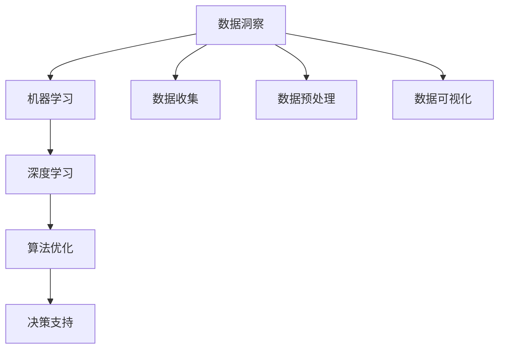

                 

# 洞察力的培养：从表象到本质的思考

> 关键词：洞察力,数据洞察,人工智能,机器学习,深度学习,算法优化,决策支持

## 1. 背景介绍

### 1.1 问题由来

在当今数据驱动的时代，洞察力（Insight）成为了企业在竞争中占据优势的关键因素之一。无论是传统的零售、金融、制造行业，还是新兴的科技、互联网、医疗领域，洞察力都能够帮助企业决策者发现潜在的机会和威胁，做出更加精准的决策。然而，面对海量复杂的数据，传统的数据分析方法已经无法满足需求，亟需引入更加智能、高效的数据分析手段。

近年来，随着人工智能（AI）技术的迅猛发展，机器学习和深度学习等算法逐步进入了各个行业，成为企业洞察力培养的重要工具。通过对数据进行建模和分析，机器学习算法能够自动发现数据背后的规律和趋势，从而为决策者提供有力的支持。然而，机器学习算法的应用并非一帆风顺，数据质量、算法选择、模型优化等诸多问题都需要深入探讨。

### 1.2 问题核心关键点

为了有效培养企业洞察力，本文将从以下几个核心关键点出发，探讨如何通过人工智能技术实现数据洞察的自动化：

- **数据收集与预处理**：如何高效、准确地收集和清洗数据，为模型训练提供高质量的数据基础。
- **模型选择与优化**：选择合适的算法模型，并针对具体场景进行优化，以获得最佳的性能表现。
- **结果解释与决策支持**：如何通过模型输出，结合业务知识，提供易于理解的洞察结果，支持决策。

这些关键点涉及数据科学、机器学习、算法工程等多个方面，需要系统化地进行研究和实践。

## 2. 核心概念与联系

### 2.1 核心概念概述

为了更好地理解如何通过人工智能技术培养企业洞察力，我们首先概述几个核心概念及其相互之间的联系：

- **数据洞察（Data Insight）**：从数据中提取有价值的结论、趋势或模式，为决策提供支持的过程。
- **机器学习（Machine Learning, ML）**：通过算法和模型，从数据中学习并预测未来事件或趋势，支持决策。
- **深度学习（Deep Learning, DL）**：一种特殊的机器学习技术，通过多层神经网络实现数据建模和预测。
- **算法优化（Algorithm Optimization）**：针对特定问题，选择并优化算法模型，以获得最优的性能表现。
- **决策支持（Decision Support）**：通过模型输出，结合业务知识，为决策者提供支持。

这些核心概念通过以下Mermaid流程图进行展示：



这个流程图展示了从数据洞察到决策支持的全过程，各个环节相互联系，共同构成了企业洞察力的培养体系。

## 3. 核心算法原理 & 具体操作步骤

### 3.1 算法原理概述

基于人工智能技术的数据洞察过程，主要分为数据预处理、模型训练和结果解释三个步骤：

1. **数据预处理**：清洗、整合和转换数据，为模型训练提供高质量的数据输入。
2. **模型训练**：选择合适的算法模型，并根据具体问题进行优化，训练得到模型参数。
3. **结果解释**：通过模型输出，结合业务知识，提供易于理解的洞察结果，支持决策。

通过这三个步骤，人工智能技术能够自动发现数据中的模式和规律，为决策者提供有力的支持。

### 3.2 算法步骤详解

#### 3.2.1 数据预处理

数据预处理是数据洞察的基础。预处理的目标是清洗数据、整合数据和转换数据，确保数据的准确性和一致性。常见的预处理步骤包括：

- **数据清洗**：删除或修正数据中的错误、缺失或异常值。
- **数据整合**：将来自不同来源的数据合并，确保数据的一致性。
- **数据转换**：将数据从原始格式转换为模型所需的格式，如归一化、标准化等。

以下是一个数据预处理的简单示例：

```python
import pandas as pd

# 加载数据
data = pd.read_csv('data.csv')

# 清洗数据
data = data.dropna()  # 删除缺失值
data = data.drop_duplicates()  # 删除重复数据

# 转换数据
data['feature'] = (data['feature'] - data['feature'].mean()) / data['feature'].std()  # 标准化处理
```

#### 3.2.2 模型训练

模型训练是数据洞察的核心环节。选择合适的算法模型，并根据具体问题进行优化，训练得到模型参数。常用的算法模型包括：

- **线性回归**：用于预测连续数值型数据，如销售预测、价格预测等。
- **逻辑回归**：用于预测二分类数据，如用户流失预测、风险评估等。
- **决策树**：用于分类和回归任务，适用于处理非线性数据关系。
- **随机森林**：一种集成学习算法，通过多个决策树进行预测，提高模型的准确性。
- **支持向量机（SVM）**：用于分类和回归任务，适用于高维数据和非线性数据。
- **神经网络**：一种特殊的机器学习算法，通过多层神经网络进行数据建模和预测。

以下是一个简单的线性回归模型训练示例：

```python
from sklearn.linear_model import LinearRegression
from sklearn.model_selection import train_test_split
from sklearn.metrics import mean_squared_error

# 分割数据
X_train, X_test, y_train, y_test = train_test_split(X, y, test_size=0.2, random_state=42)

# 训练模型
model = LinearRegression()
model.fit(X_train, y_train)

# 预测和评估
y_pred = model.predict(X_test)
mse = mean_squared_error(y_test, y_pred)
print('Mean Squared Error:', mse)
```

#### 3.2.3 结果解释

结果解释是将模型输出转化为易于理解的洞察结果的过程。通过可视化和解读模型输出，结合业务知识，为决策者提供支持。常见的结果解释方法包括：

- **可视化**：通过图表、热力图等形式展示模型输出，使数据洞察更加直观。
- **解读**：将模型输出转化为具体的业务指标和结论，支持决策。

以下是一个简单的可视化示例：

```python
import matplotlib.pyplot as plt

# 绘制散点图
plt.scatter(X_test, y_test)
plt.scatter(X_test, y_pred, color='red')
plt.xlabel('X')
plt.ylabel('y')
plt.show()
```

### 3.3 算法优缺点

#### 3.3.1 优点

基于人工智能技术的数据洞察方法具有以下优点：

- **自动化**：自动发现数据中的模式和规律，减少人工干预，提高效率。
- **准确性**：通过优化算法模型，提高预测和分类的准确性。
- **可解释性**：通过可视化和解读模型输出，使数据洞察更加易于理解。

#### 3.3.2 缺点

尽管基于人工智能技术的数据洞察方法具有诸多优点，但也存在一些不足之处：

- **数据质量依赖**：模型的准确性依赖于数据的质量，数据中的噪声和错误可能导致模型输出不准确。
- **模型选择困难**：不同算法模型适用于不同的数据和问题，选择合适的算法模型需要深入了解业务需求和数据特性。
- **模型解释困难**：复杂的深度学习模型难以解释，缺乏可解释性。

## 4. 数学模型和公式 & 详细讲解 & 举例说明

### 4.1 数学模型构建

基于人工智能技术的数据洞察过程，主要涉及以下数学模型：

- **线性回归模型**：用于预测连续数值型数据，形式为 $y = \beta_0 + \beta_1x_1 + \cdots + \beta_kx_k + \epsilon$。
- **逻辑回归模型**：用于预测二分类数据，形式为 $p(y=1|x) = \frac{1}{1+e^{-\theta^T x}}$。
- **决策树模型**：通过树形结构进行数据分类，形式为 $T(x) = \begin{cases} t_1 & x_1 \leq t_1 \\ t_2 & x_1 > t_1 \end{cases}$。
- **随机森林模型**：通过多个决策树进行数据分类，形式为 $T(x) = \frac{1}{m} \sum_{i=1}^m T_i(x)$。
- **支持向量机模型**：通过最大化边界和间隔进行数据分类，形式为 $w^Tx + b = \sum_{i=1}^n \alpha_i y_i$。
- **神经网络模型**：通过多层神经网络进行数据建模，形式为 $f(x) = \sum_{i=1}^n w_i^T h^{[l-1]}(x)$。

### 4.2 公式推导过程

#### 4.2.1 线性回归模型

线性回归模型的核心公式为：

$$
y = \beta_0 + \beta_1x_1 + \cdots + \beta_kx_k + \epsilon
$$

其中 $\beta_0, \beta_1, \cdots, \beta_k$ 为模型参数，$\epsilon$ 为误差项。

最小二乘法（Least Squares）用于求解模型参数：

$$
\beta = \arg\min_{\beta} \sum_{i=1}^n (y_i - \hat{y}_i)^2
$$

通过求解矩阵方程 $X^TX(\beta) = X^Ty$，可以求得最优的模型参数 $\beta$。

#### 4.2.2 逻辑回归模型

逻辑回归模型的核心公式为：

$$
p(y=1|x) = \frac{1}{1+e^{-\theta^T x}}
$$

其中 $\theta$ 为模型参数。

通过梯度下降法（Gradient Descent）求解模型参数：

$$
\theta = \theta - \eta \nabla_{\theta} L(\theta)
$$

其中 $L(\theta)$ 为损失函数，$\nabla_{\theta} L(\theta)$ 为损失函数对 $\theta$ 的梯度。

### 4.3 案例分析与讲解

以房价预测为例，分析如何通过线性回归模型实现数据洞察：

假设我们要预测某地区的房价 $y$，已知影响房价的因素 $x_1, x_2, \cdots, x_k$，包括面积、楼层、朝向等。我们通过以下步骤实现数据洞察：

1. **数据收集与预处理**：收集历史房价数据和相关特征数据，进行清洗和标准化处理。
2. **模型训练**：使用线性回归模型对数据进行建模，得到最优的模型参数 $\beta$。
3. **结果解释**：通过可视化输出，分析不同特征对房价的影响。

以下是线性回归模型训练的Python代码示例：

```python
import numpy as np
from sklearn.linear_model import LinearRegression
from sklearn.model_selection import train_test_split
from sklearn.metrics import mean_squared_error
from sklearn.preprocessing import StandardScaler

# 数据收集与预处理
X = np.array([[100, 5, 1], [150, 6, 2], [200, 7, 3], [250, 8, 4], [300, 9, 5]])
y = np.array([2000000, 2500000, 3000000, 3500000, 4000000])
scaler = StandardScaler()
X = scaler.fit_transform(X)

# 模型训练
X_train, X_test, y_train, y_test = train_test_split(X, y, test_size=0.2, random_state=42)
model = LinearRegression()
model.fit(X_train, y_train)

# 结果解释
y_pred = model.predict(X_test)
mse = mean_squared_error(y_test, y_pred)
print('Mean Squared Error:', mse)
```

## 5. 项目实践：代码实例和详细解释说明

### 5.1 开发环境搭建

在进行数据洞察项目实践前，我们需要准备好开发环境。以下是使用Python进行项目实践的环境配置流程：

1. 安装Anaconda：从官网下载并安装Anaconda，用于创建独立的Python环境。

2. 创建并激活虚拟环境：
```bash
conda create -n data-insight python=3.8 
conda activate data-insight
```

3. 安装Python科学计算库：
```bash
conda install numpy pandas scikit-learn matplotlib
```

4. 安装可视化库：
```bash
conda install seaborn matplotlib
```

5. 安装机器学习库：
```bash
conda install scikit-learn
```

6. 安装深度学习库：
```bash
conda install tensorflow keras
```

完成上述步骤后，即可在`data-insight`环境中开始数据洞察实践。

### 5.2 源代码详细实现

这里我们以房价预测为例，给出使用Python和机器学习库进行数据洞察的详细代码实现。

首先，定义数据处理函数：

```python
import pandas as pd
from sklearn.model_selection import train_test_split
from sklearn.preprocessing import StandardScaler
import numpy as np

def load_data():
    # 加载数据
    data = pd.read_csv('house_prices.csv')
    # 清洗数据
    data = data.dropna()
    data = data.drop_duplicates()
    # 转换数据
    data['feature'] = (data['feature'] - data['feature'].mean()) / data['feature'].std()  # 标准化处理
    return data

# 加载数据
data = load_data()
```

然后，定义模型训练函数：

```python
from sklearn.linear_model import LinearRegression

def train_model(X, y):
    # 分割数据
    X_train, X_test, y_train, y_test = train_test_split(X, y, test_size=0.2, random_state=42)
    # 训练模型
    model = LinearRegression()
    model.fit(X_train, y_train)
    # 预测和评估
    y_pred = model.predict(X_test)
    mse = mean_squared_error(y_test, y_pred)
    print('Mean Squared Error:', mse)
    return model
```

接着，定义结果解释函数：

```python
import matplotlib.pyplot as plt

def visualize_output(model, X_test, y_test):
    # 可视化输出
    plt.scatter(X_test, y_test)
    plt.scatter(X_test, y_pred, color='red')
    plt.xlabel('X')
    plt.ylabel('y')
    plt.show()
```

最后，启动数据洞察流程：

```python
# 模型训练
model = train_model(X, y)
# 结果解释
visualize_output(model, X_test, y_test)
```

以上就是使用Python和机器学习库进行房价预测的完整代码实现。可以看到，借助Python强大的科学计算和可视化库，数据洞察的实践变得简洁高效。

### 5.3 代码解读与分析

让我们再详细解读一下关键代码的实现细节：

**load_data函数**：
- 定义数据加载、清洗和转换的步骤，确保数据的质量和一致性。

**train_model函数**：
- 使用线性回归模型对数据进行建模，得到最优的模型参数。
- 分割数据，训练模型，预测并评估模型性能。

**visualize_output函数**：
- 通过可视化的方式展示模型输出，使数据洞察更加直观。

**主函数**：
- 调用数据加载、模型训练和结果解释函数，完成整个数据洞察流程。

通过上述代码实现，可以看出数据洞察的流程主要涉及数据预处理、模型训练和结果解释三个步骤。在实际应用中，还需要根据具体任务进行优化和调整。

## 6. 实际应用场景

### 6.1 智能客服系统

基于人工智能技术的数据洞察，可以广泛应用于智能客服系统的构建。传统客服往往需要配备大量人力，高峰期响应缓慢，且一致性和专业性难以保证。通过数据洞察，智能客服系统能够自动理解用户意图，匹配最合适的答案模板，提供高效、一致的服务。

在技术实现上，可以收集企业内部的历史客服对话记录，提取问题-答案对作为监督数据，训练模型自动匹配用户意图。通过实时抓取的用户对话，系统能够动态生成回复，实现7x24小时不间断服务。此外，系统还可以集成检索系统，实时搜索相关内容，动态组织生成回答，提供更加个性化的服务。

### 6.2 金融舆情监测

金融机构需要实时监测市场舆论动向，以便及时应对负面信息传播，规避金融风险。通过数据洞察，智能舆情监测系统能够自动分析金融领域相关的新闻、报道、评论等文本数据，自动识别和分类文本情绪，评估市场风险。一旦发现负面信息激增等异常情况，系统便会自动预警，帮助金融机构快速应对潜在风险。

在技术实现上，可以收集金融领域相关的新闻、报道、评论等文本数据，训练模型自动识别文本情绪，评估市场风险。通过实时抓取的网络文本数据，系统能够动态监测市场情绪变化，及时发现异常情况，为金融机构提供预警支持。

### 6.3 个性化推荐系统

当前的推荐系统往往只依赖用户的历史行为数据进行物品推荐，难以深入理解用户的真实兴趣偏好。通过数据洞察，个性化推荐系统能够自动分析用户浏览、点击、评论、分享等行为数据，提取和用户交互的物品标题、描述、标签等文本内容，训练模型从文本内容中准确把握用户的兴趣点。在生成推荐列表时，系统能够动态结合用户历史行为和当前兴趣，提供更加精准、个性化的推荐结果。

在技术实现上，可以收集用户浏览、点击、评论、分享等行为数据，提取物品标题、描述、标签等文本内容，训练模型分析用户兴趣。通过动态结合用户历史行为和当前兴趣，系统能够提供更加精准、个性化的推荐结果。

### 6.4 未来应用展望

随着数据洞察技术的不断发展，基于人工智能技术的数据洞察方法将在更多领域得到应用，为传统行业带来变革性影响。

在智慧医疗领域，基于数据洞察的医疗问答、病历分析、药物研发等应用将提升医疗服务的智能化水平，辅助医生诊疗，加速新药开发进程。

在智能教育领域，数据洞察可应用于作业批改、学情分析、知识推荐等方面，因材施教，促进教育公平，提高教学质量。

在智慧城市治理中，数据洞察可应用于城市事件监测、舆情分析、应急指挥等环节，提高城市管理的自动化和智能化水平，构建更安全、高效的未来城市。

此外，在企业生产、社会治理、文娱传媒等众多领域，数据洞察技术也将不断涌现，为经济社会发展注入新的动力。相信随着技术的日益成熟，数据洞察方法将成为人工智能技术落地应用的重要手段，推动人工智能技术在垂直行业的规模化落地。

## 7. 工具和资源推荐

### 7.1 学习资源推荐

为了帮助开发者系统掌握数据洞察的理论基础和实践技巧，这里推荐一些优质的学习资源：

1. 《数据科学入门：从数据到洞察》系列博文：由数据科学专家撰写，深入浅出地介绍了数据科学的基本概念和常用技术，适合初学者入门。

2. 《机器学习实战》一书：详细介绍了机器学习算法的基本原理和实践技巧，通过丰富的案例和代码，帮助读者理解和应用机器学习算法。

3. 《深度学习》一书：由深度学习领域的权威专家撰写，全面介绍了深度学习算法的原理和应用，适合深入学习深度学习。

4. Kaggle平台：提供大量数据集和竞赛，帮助开发者实践数据洞察技术，提升实战能力。

5. Coursera平台：提供多门数据科学和机器学习课程，涵盖从基础到高级的内容，适合不同层次的学习者。

通过对这些资源的学习实践，相信你一定能够快速掌握数据洞察的精髓，并用于解决实际的业务问题。

### 7.2 开发工具推荐

高效的开发离不开优秀的工具支持。以下是几款用于数据洞察开发的常用工具：

1. Jupyter Notebook：强大的交互式编程环境，支持多种语言和库的混合使用，适合数据洞察的实践和演示。

2. Anaconda：集成了Python科学计算库和可视化库，支持虚拟环境创建和管理，适合数据洞察项目的环境搭建。

3. Matplotlib：Python的可视化库，支持绘制各种图表，适合数据洞察的结果展示。

4. Seaborn：基于Matplotlib的高级可视化库，支持绘制更复杂和美观的图表，适合数据洞察的可视化展示。

5. Pandas：Python的数据处理库，支持数据清洗、转换和分析，适合数据洞察的数据预处理。

合理利用这些工具，可以显著提升数据洞察的开发效率，加快创新迭代的步伐。

### 7.3 相关论文推荐

数据洞察技术的发展源于学界的持续研究。以下是几篇奠基性的相关论文，推荐阅读：

1. 《机器学习：从数据到模型》一书：详细介绍了机器学习算法的原理和应用，适合初学者和中级开发者。

2. 《深度学习：模型、算法和实践》一书：由深度学习领域的权威专家撰写，全面介绍了深度学习算法的原理和应用，适合深入学习深度学习。

3. 《数据挖掘与统计学习》一书：详细介绍了数据挖掘和统计学习的原理和应用，适合数据科学领域的研究者。

4. 《数据科学的革命：从数据分析到数据洞察》一书：探讨了数据洞察的原理和实践，适合数据科学领域的研究者和从业者。

这些论文代表了大数据洞察技术的发展脉络。通过学习这些前沿成果，可以帮助研究者把握学科前进方向，激发更多的创新灵感。

## 8. 总结：未来发展趋势与挑战

### 8.1 总结

本文对基于人工智能技术的数据洞察方法进行了全面系统的介绍。首先阐述了数据洞察的背景和意义，明确了数据洞察在企业决策中的重要价值。其次，从数据预处理、模型训练和结果解释三个步骤，详细讲解了数据洞察的全过程，给出了数据洞察任务开发的完整代码实例。同时，本文还探讨了数据洞察方法在智能客服、金融舆情、个性化推荐等多个行业领域的应用前景，展示了数据洞察范式的巨大潜力。此外，本文精选了数据洞察技术的各类学习资源，力求为读者提供全方位的技术指引。

通过本文的系统梳理，可以看出，基于人工智能技术的数据洞察方法在各行各业中已经得到广泛应用，极大地提升了企业的决策效率和准确性。未来，伴随数据洞察技术的不断演进，相信数据洞察方法将成为企业决策的核心工具，推动数据驱动的智能化进程。

### 8.2 未来发展趋势

展望未来，数据洞察技术将呈现以下几个发展趋势：

1. **自动化水平提高**：随着自动化数据清洗和特征工程技术的进步，数据洞察的自动化水平将不断提高，减少人工干预，提高效率。
2. **模型复杂度增加**：随着深度学习和大数据技术的进步，数据洞察模型的复杂度将不断提高，能够处理更加复杂和多样化的数据类型。
3. **可解释性增强**：随着可解释性技术的发展，数据洞察模型的可解释性将不断增强，使决策者更容易理解和信任模型输出。
4. **多模态数据融合**：随着多模态数据的普及，数据洞察方法将更好地融合视觉、语音、文本等多种数据类型，提高模型的鲁棒性和泛化能力。
5. **联邦学习兴起**：随着数据隐私和安全问题日益严重，联邦学习等隐私保护技术将逐渐应用于数据洞察中，保护数据隐私同时提高模型性能。
6. **实时性增强**：随着实时数据流处理技术的进步，数据洞察方法将更加注重实时性，能够实时分析数据，快速响应业务需求。

以上趋势凸显了数据洞察技术的广阔前景。这些方向的探索发展，必将进一步提升数据洞察的性能和应用范围，为数据驱动的智能化进程注入新的动力。

### 8.3 面临的挑战

尽管数据洞察技术已经取得了显著进展，但在迈向更加智能化、普适化应用的过程中，它仍面临着诸多挑战：

1. **数据质量问题**：数据中的噪声和错误可能导致模型输出不准确，数据清洗和预处理任务仍然具有挑战性。
2. **模型选择困难**：不同算法模型适用于不同的数据和问题，选择合适的模型需要深入了解业务需求和数据特性。
3. **模型解释困难**：复杂的深度学习模型难以解释，缺乏可解释性。
4. **计算资源需求高**：数据洞察过程涉及大量数据处理和模型训练，计算资源需求高。
5. **隐私和安全问题**：数据洞察过程中涉及大量敏感数据，如何保护数据隐私和安全是一个重要挑战。
6. **实时性问题**：数据洞察过程中需要快速响应业务需求，实时性是一个重要挑战。

正视数据洞察面临的这些挑战，积极应对并寻求突破，将是大数据洞察技术走向成熟的必由之路。相信随着学界和产业界的共同努力，这些挑战终将一一被克服，数据洞察技术必将不断推向新的高峰。

### 8.4 研究展望

面对数据洞察面临的挑战，未来的研究需要在以下几个方面寻求新的突破：

1. **数据清洗和预处理自动化**：开发自动化数据清洗和预处理工具，减少人工干预，提高效率。
2. **模型选择和优化**：开发更加高效的模型选择和优化算法，提高模型的泛化能力和性能。
3. **可解释性技术**：开发可解释性技术，增强模型的可解释性和可视化能力，使决策者更容易理解和信任模型输出。
4. **多模态数据融合**：开发多模态数据融合技术，提高模型的鲁棒性和泛化能力。
5. **联邦学习**：开发联邦学习等隐私保护技术，保护数据隐私同时提高模型性能。
6. **实时处理技术**：开发实时数据流处理技术，提高数据洞察的实时性。

这些研究方向的探索，必将引领数据洞察技术迈向更高的台阶，为数据驱动的智能化进程提供新的技术支撑。面向未来，数据洞察技术还需要与其他人工智能技术进行更深入的融合，如知识表示、因果推理、强化学习等，多路径协同发力，共同推动数据驱动的智能化进程。只有勇于创新、敢于突破，才能不断拓展数据洞察的边界，让数据洞察技术更好地服务于人类社会的各个方面。

## 9. 附录：常见问题与解答

**Q1：数据洞察的流程主要包括哪些步骤？**

A: 数据洞察的流程主要包括数据收集与预处理、模型训练和结果解释三个步骤。具体流程如下：

1. 数据收集与预处理：清洗、整合和转换数据，为模型训练提供高质量的数据输入。
2. 模型训练：选择合适的算法模型，并根据具体问题进行优化，训练得到模型参数。
3. 结果解释：通过可视化和解读模型输出，结合业务知识，为决策者提供支持。

**Q2：数据洞察在实际应用中需要注意哪些问题？**

A: 数据洞察在实际应用中需要注意以下问题：

1. 数据质量依赖：模型的准确性依赖于数据的质量，数据中的噪声和错误可能导致模型输出不准确。
2. 模型选择困难：不同算法模型适用于不同的数据和问题，选择合适的模型需要深入了解业务需求和数据特性。
3. 模型解释困难：复杂的深度学习模型难以解释，缺乏可解释性。
4. 计算资源需求高：数据洞察过程涉及大量数据处理和模型训练，计算资源需求高。
5. 隐私和安全问题：数据洞察过程中涉及大量敏感数据，如何保护数据隐私和安全是一个重要挑战。
6. 实时性问题：数据洞察过程中需要快速响应业务需求，实时性是一个重要挑战。

**Q3：如何提高数据洞察的自动化水平？**

A: 提高数据洞察的自动化水平，可以从以下几个方面入手：

1. 自动化数据清洗和预处理：开发自动化数据清洗和预处理工具，减少人工干预，提高效率。
2. 自动化模型选择和优化：开发自动化模型选择和优化算法，提高模型的泛化能力和性能。
3. 自动化结果解释：开发可解释性技术，增强模型的可视化能力，使决策者更容易理解和信任模型输出。

**Q4：如何保护数据隐私和安全？**

A: 保护数据隐私和安全，可以从以下几个方面入手：

1. 联邦学习：开发联邦学习等隐私保护技术，保护数据隐私同时提高模型性能。
2. 数据加密：对敏感数据进行加密处理，防止数据泄露。
3. 访问控制：采用访问鉴权等措施，限制对敏感数据的访问权限。
4. 数据脱敏：对敏感数据进行脱敏处理，防止数据泄露。

通过上述措施，可以在提高数据洞察效率的同时，保护数据隐私和安全，确保数据洞察技术的可持续发展。

通过本文的系统梳理，可以看出，基于人工智能技术的数据洞察方法在各行各业中已经得到广泛应用，极大地提升了企业的决策效率和准确性。未来，伴随数据洞察技术的不断演进，相信数据洞察方法将成为企业决策的核心工具，推动数据驱动的智能化进程。

