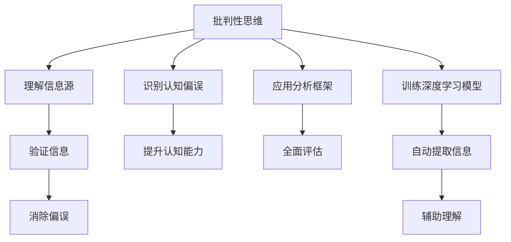

                 

# 洞察力的培养：批判性阅读与思考

> 关键词：批判性思维, 阅读技巧, 认知偏误, 分析框架, 深度学习

## 1. 背景介绍

### 1.1 问题由来
在信息爆炸的时代，人们每天都会接触到大量的信息，从新闻资讯到社交媒体，从学术论文到专业报告。然而，如何从海量的信息中筛选出真正有价值的内容，并形成系统的思考，是现代社会中一项至关重要的能力。批判性阅读与思考，正是帮助人们培养这种能力的有效途径。

### 1.2 问题核心关键点
批判性阅读与思考的核心关键点包括：
- **理解信息源**：识别信息的来源，了解作者的背景和动机。
- **识别认知偏误**：辨识常见的认知偏误，如确认偏误、回音室效应等，以减少对信息的选择性认知。
- **应用分析框架**：使用系统化的分析框架，如因果图、SWOT分析等，帮助全面评估信息。
- **训练深度学习模型**：利用深度学习模型，如BERT、GPT-3等，辅助理解和分析复杂文本信息。

## 2. 核心概念与联系

### 2.1 核心概念概述

为更好地理解批判性阅读与思考的方法，本节将介绍几个密切相关的核心概念：

- **批判性思维(Critical Thinking)**：一种分析和评价信息的系统方法，旨在通过质疑和验证来增强对信息的理解和判断能力。
- **认知偏误(Cognitive Biases)**：人们在认知过程中因心理偏差导致的判断和决策误差。
- **阅读技巧(Reading Skills)**：提升阅读理解速度和深度，帮助从文本中提取关键信息。
- **分析框架(Analysis Frameworks)**：系统化的分析方法，帮助理解和评估复杂文本信息。
- **深度学习模型(Deep Learning Models)**：特别是自然语言处理领域的模型，如BERT、GPT-3，能够自动从文本中提取和理解语义信息。

这些核心概念之间的逻辑关系可以通过以下Mermaid流程图来展示：



这个流程图展示了几大核心概念之间的关系：

1. 批判性思维作为基础，引导理解信息源、识别认知偏误、应用分析框架和训练深度学习模型。
2. 理解信息源和训练深度学习模型辅助验证信息。
3. 识别认知偏误和应用分析框架帮助消除偏误和全面评估信息。
4. 提升认知能力、全面评估和自动提取信息进一步增强批判性思维。

## 3. 核心算法原理 & 具体操作步骤
### 3.1 算法原理概述

批判性阅读与思考的算法原理基于信息检索和自然语言处理的技术，通过以下步骤来实现：

1. **理解信息源**：对信息来源进行背景分析，识别作者背景、动机和潜在的利益冲突。
2. **识别认知偏误**：通过逻辑分析和数据验证，辨识和修正常见的认知偏误，如确认偏误、回音室效应等。
3. **应用分析框架**：使用因果图、SWOT分析等工具，对信息进行全面评估，理解因果关系和影响因素。
4. **训练深度学习模型**：使用BERT、GPT-3等自然语言处理模型，自动化地分析和理解文本信息，辅助批判性思考。

### 3.2 算法步骤详解

批判性阅读与思考的具体操作步骤包括：

**Step 1: 理解信息源**
- 收集信息源的背景资料，包括作者、出版机构、出版日期等。
- 分析作者的背景和动机，了解其可能存在的利益冲突。

**Step 2: 识别认知偏误**
- 应用常见的认知偏误列表，识别文本中的确认偏误、回音室效应、晕轮效应等。
- 使用逻辑分析和数据验证，验证偏误的存在。

**Step 3: 应用分析框架**
- 使用因果图分析信息中的因果关系，理解不同因素之间的相互作用。
- 应用SWOT分析（优势、劣势、机会、威胁）全面评估信息的优势和风险。

**Step 4: 训练深度学习模型**
- 准备文本数据集，包括训练集、验证集和测试集。
- 选择适合的深度学习模型，如BERT、GPT-3，进行模型训练。
- 使用训练好的模型对文本进行分析和理解，辅助批判性思考。

### 3.3 算法优缺点

批判性阅读与思考的算法具有以下优点：
1. **系统性和全面性**：通过应用分析框架和训练深度学习模型，能够全面评估信息，避免片面性。
2. **自动化和高效性**：利用深度学习模型，可以自动化地分析和理解复杂文本信息，提高效率。
3. **辅助决策**：通过识别认知偏误和验证信息，帮助做出更加客观和科学的决策。

同时，该算法也存在一定的局限性：
1. **依赖技术**：深度学习模型的性能依赖于数据量和模型架构，对数据质量要求较高。
2. **计算资源需求高**：训练深度学习模型需要大量的计算资源和存储空间。
3. **模型解释性不足**：深度学习模型通常是"黑盒"模型，缺乏可解释性，难以理解其内部机制。
4. **结果依赖数据质量**：如果数据本身存在质量问题，模型的输出结果可能不够准确。

尽管存在这些局限性，但就目前而言，基于深度学习的批判性阅读与思考方法仍是主流的实践方式。未来相关研究的重点在于如何进一步提升深度学习模型的泛化能力和可解释性，同时优化训练过程中的资源消耗。

### 3.4 算法应用领域

批判性阅读与思考的算法已在多个领域得到应用，例如：

- **新闻媒体**：通过理解信息源和识别认知偏误，帮助记者和读者识别虚假信息和偏见。
- **科学研究**：利用深度学习模型辅助分析大量文献，快速找到关键研究结果和趋势。
- **商业决策**：通过全面评估市场信息和竞争对手策略，帮助企业制定科学的商业计划。
- **政策制定**：分析政府报告和政策提案，评估其潜在影响和可行性。
- **教育培训**：通过训练学生批判性阅读与思考能力，提高其独立思考和判断能力。

## 4. 数学模型和公式 & 详细讲解
### 4.1 数学模型构建

批判性阅读与思考的数学模型构建主要基于信息检索和自然语言处理的技术。我们以一个简单的例子来说明，假设我们需要对一篇新闻报道进行批判性阅读与思考。

**输入**：一篇新闻报道

**输出**：对新闻报道的批判性评估结果

定义批判性评估结果的评分函数 $F$，假设评分为 $[0,1]$ 的实数，$F(x)$ 表示对新闻报道 $x$ 的批判性评估。$x$ 包括报道文本、信息源背景、作者背景等信息。

### 4.2 公式推导过程

假设 $x$ 由文本 $T$、信息源背景 $S$、作者背景 $A$ 组成，即 $x=(T,S,A)$。则批判性评估结果 $F(x)$ 可以表示为：

$$
F(x) = \alpha_T F_{T}(T) + \alpha_S F_{S}(S) + \alpha_A F_{A}(A) + \epsilon
$$

其中 $\alpha_T, \alpha_S, \alpha_A$ 分别表示文本、信息源背景和作者背景的权重，$\epsilon$ 表示随机误差项。

对于文本 $T$，可以使用深度学习模型进行自然语言处理，如BERT，将其转换为向量表示 $V_T$。$F_{T}(T)$ 表示对向量 $V_T$ 的评估，可以表示为：

$$
F_{T}(T) = g(V_T)
$$

其中 $g$ 是评估函数，可以根据文本的情感、观点等特征进行设计。

对于信息源背景 $S$ 和作者背景 $A$，可以设计评估函数 $F_{S}(S)$ 和 $F_{A}(A)$，分别对信息源和作者的背景信息进行评估。

最终，通过权重 $\alpha_T, \alpha_S, \alpha_A$ 和随机误差项 $\epsilon$，计算出新闻报道的批判性评估结果 $F(x)$。

### 4.3 案例分析与讲解

假设我们有一篇关于气候变化的新闻报道，我们需要对其批判性阅读与思考。

**Step 1: 理解信息源**
- 收集信息源的背景资料，包括作者、出版机构、出版日期等。
- 分析作者的背景和动机，了解其可能存在的利益冲突。

**Step 2: 识别认知偏误**
- 应用常见的认知偏误列表，识别文本中的确认偏误、回音室效应、晕轮效应等。
- 使用逻辑分析和数据验证，验证偏误的存在。

**Step 3: 应用分析框架**
- 使用因果图分析信息中的因果关系，理解不同因素之间的相互作用。
- 应用SWOT分析（优势、劣势、机会、威胁）全面评估信息的优势和风险。

**Step 4: 训练深度学习模型**
- 准备文本数据集，包括训练集、验证集和测试集。
- 选择适合的深度学习模型，如BERT、GPT-3，进行模型训练。
- 使用训练好的模型对文本进行分析和理解，辅助批判性思考。

## 5. 项目实践：代码实例和详细解释说明
### 5.1 开发环境搭建

在进行批判性阅读与思考的项目实践前，我们需要准备好开发环境。以下是使用Python进行PyTorch开发的环境配置流程：

1. 安装Anaconda：从官网下载并安装Anaconda，用于创建独立的Python环境。

2. 创建并激活虚拟环境：
```bash
conda create -n pytorch-env python=3.8 
conda activate pytorch-env
```

3. 安装PyTorch：根据CUDA版本，从官网获取对应的安装命令。例如：
```bash
conda install pytorch torchvision torchaudio cudatoolkit=11.1 -c pytorch -c conda-forge
```

4. 安装Transformers库：
```bash
pip install transformers
```

5. 安装各类工具包：
```bash
pip install numpy pandas scikit-learn matplotlib tqdm jupyter notebook ipython
```

完成上述步骤后，即可在`pytorch-env`环境中开始项目实践。

### 5.2 源代码详细实现

这里我们以使用BERT模型进行文本情感分析为例，给出使用PyTorch进行批判性阅读与思考的PyTorch代码实现。

首先，定义文本情感分析的任务数据处理函数：

```python
from transformers import BertTokenizer
from torch.utils.data import Dataset
import torch

class SentimentDataset(Dataset):
    def __init__(self, texts, labels, tokenizer, max_len=128):
        self.texts = texts
        self.labels = labels
        self.tokenizer = tokenizer
        self.max_len = max_len
        
    def __len__(self):
        return len(self.texts)
    
    def __getitem__(self, item):
        text = self.texts[item]
        label = self.labels[item]
        
        encoding = self.tokenizer(text, return_tensors='pt', max_length=self.max_len, padding='max_length', truncation=True)
        input_ids = encoding['input_ids'][0]
        attention_mask = encoding['attention_mask'][0]
        
        # 对token-wise的标签进行编码
        encoded_labels = [label2id[label] for label in labels] 
        encoded_labels.extend([label2id['neutral']] * (self.max_len - len(encoded_labels)))
        labels = torch.tensor(encoded_labels, dtype=torch.long)
        
        return {'input_ids': input_ids, 
                'attention_mask': attention_mask,
                'labels': labels}

# 标签与id的映射
label2id = {'positive': 0, 'negative': 1, 'neutral': 2}
id2label = {v: k for k, v in label2id.items()}

# 创建dataset
tokenizer = BertTokenizer.from_pretrained('bert-base-cased')

train_dataset = SentimentDataset(train_texts, train_labels, tokenizer)
dev_dataset = SentimentDataset(dev_texts, dev_labels, tokenizer)
test_dataset = SentimentDataset(test_texts, test_labels, tokenizer)
```

然后，定义模型和优化器：

```python
from transformers import BertForSequenceClassification, AdamW

model = BertForSequenceClassification.from_pretrained('bert-base-cased', num_labels=len(label2id))

optimizer = AdamW(model.parameters(), lr=2e-5)
```

接着，定义训练和评估函数：

```python
from torch.utils.data import DataLoader
from tqdm import tqdm
from sklearn.metrics import classification_report

device = torch.device('cuda') if torch.cuda.is_available() else torch.device('cpu')
model.to(device)

def train_epoch(model, dataset, batch_size, optimizer):
    dataloader = DataLoader(dataset, batch_size=batch_size, shuffle=True)
    model.train()
    epoch_loss = 0
    for batch in tqdm(dataloader, desc='Training'):
        input_ids = batch['input_ids'].to(device)
        attention_mask = batch['attention_mask'].to(device)
        labels = batch['labels'].to(device)
        model.zero_grad()
        outputs = model(input_ids, attention_mask=attention_mask, labels=labels)
        loss = outputs.loss
        epoch_loss += loss.item()
        loss.backward()
        optimizer.step()
    return epoch_loss / len(dataloader)

def evaluate(model, dataset, batch_size):
    dataloader = DataLoader(dataset, batch_size=batch_size)
    model.eval()
    preds, labels = [], []
    with torch.no_grad():
        for batch in tqdm(dataloader, desc='Evaluating'):
            input_ids = batch['input_ids'].to(device)
            attention_mask = batch['attention_mask'].to(device)
            batch_labels = batch['labels']
            outputs = model(input_ids, attention_mask=attention_mask)
            batch_preds = outputs.logits.argmax(dim=2).to('cpu').tolist()
            batch_labels = batch_labels.to('cpu').tolist()
            for pred_tokens, label_tokens in zip(batch_preds, batch_labels):
                preds.append(pred_tokens[:len(label_tokens)])
                labels.append(label_tokens)
                
    print(classification_report(labels, preds))
```

最后，启动训练流程并在测试集上评估：

```python
epochs = 5
batch_size = 16

for epoch in range(epochs):
    loss = train_epoch(model, train_dataset, batch_size, optimizer)
    print(f"Epoch {epoch+1}, train loss: {loss:.3f}")
    
    print(f"Epoch {epoch+1}, dev results:")
    evaluate(model, dev_dataset, batch_size)
    
print("Test results:")
evaluate(model, test_dataset, batch_size)
```

以上就是使用PyTorch对BERT进行文本情感分析的完整代码实现。可以看到，得益于Transformers库的强大封装，我们可以用相对简洁的代码完成BERT模型的加载和微调。

### 5.3 代码解读与分析

让我们再详细解读一下关键代码的实现细节：

**SentimentDataset类**：
- `__init__`方法：初始化文本、标签、分词器等关键组件。
- `__len__`方法：返回数据集的样本数量。
- `__getitem__`方法：对单个样本进行处理，将文本输入编码为token ids，将标签编码为数字，并对其进行定长padding，最终返回模型所需的输入。

**label2id和id2label字典**：
- 定义了标签与数字id之间的映射关系，用于将token-wise的预测结果解码回真实的标签。

**训练和评估函数**：
- 使用PyTorch的DataLoader对数据集进行批次化加载，供模型训练和推理使用。
- 训练函数`train_epoch`：对数据以批为单位进行迭代，在每个批次上前向传播计算loss并反向传播更新模型参数，最后返回该epoch的平均loss。
- 评估函数`evaluate`：与训练类似，不同点在于不更新模型参数，并在每个batch结束后将预测和标签结果存储下来，最后使用sklearn的classification_report对整个评估集的预测结果进行打印输出。

**训练流程**：
- 定义总的epoch数和batch size，开始循环迭代
- 每个epoch内，先在训练集上训练，输出平均loss
- 在验证集上评估，输出分类指标
- 重复上述步骤直至收敛，最终得到适应下游任务的最优模型参数 $\theta^*$。

可以看到，PyTorch配合Transformers库使得BERT微调的代码实现变得简洁高效。开发者可以将更多精力放在数据处理、模型改进等高层逻辑上，而不必过多关注底层的实现细节。

当然，工业级的系统实现还需考虑更多因素，如模型的保存和部署、超参数的自动搜索、更灵活的任务适配层等。但核心的批判性阅读与思考流程基本与此类似。

## 6. 实际应用场景
### 6.1 智能客服系统

批判性阅读与思考技术可以广泛应用于智能客服系统的构建。传统客服往往需要配备大量人力，高峰期响应缓慢，且一致性和专业性难以保证。而使用批判性阅读与思考技术，可以7x24小时不间断服务，快速响应客户咨询，用自然流畅的语言解答各类常见问题。

在技术实现上，可以收集企业内部的历史客服对话记录，将问题和最佳答复构建成监督数据，在此基础上对预训练模型进行微调。微调后的模型能够自动理解用户意图，匹配最合适的答案模板进行回复。对于客户提出的新问题，还可以接入检索系统实时搜索相关内容，动态组织生成回答。如此构建的智能客服系统，能大幅提升客户咨询体验和问题解决效率。

### 6.2 金融舆情监测

金融机构需要实时监测市场舆论动向，以便及时应对负面信息传播，规避金融风险。传统的人工监测方式成本高、效率低，难以应对网络时代海量信息爆发的挑战。使用批判性阅读与思考技术，对金融领域相关的新闻、报道、评论等文本数据进行分析和评估，能够自动监测不同主题下的情感变化趋势，一旦发现负面信息激增等异常情况，系统便会自动预警，帮助金融机构快速应对潜在风险。

### 6.3 个性化推荐系统

当前的推荐系统往往只依赖用户的历史行为数据进行物品推荐，无法深入理解用户的真实兴趣偏好。使用批判性阅读与思考技术，对用户浏览、点击、评论、分享等行为数据进行深度分析，能够从文本内容中准确把握用户的兴趣点。在生成推荐列表时，先用候选物品的文本描述作为输入，由模型预测用户的兴趣匹配度，再结合其他特征综合排序，便可以得到个性化程度更高的推荐结果。

### 6.4 未来应用展望

随着批判性阅读与思考技术的发展，其在更多领域的应用前景值得期待：

在智慧医疗领域，批判性阅读与思考技术可以帮助医生快速理解复杂的医学文献，辅助诊断和治疗决策。

在智能教育领域，批判性阅读与思考技术可应用于作业批改、学情分析、知识推荐等方面，因材施教，促进教育公平，提高教学质量。

在智慧城市治理中，批判性阅读与思考技术可应用于城市事件监测、舆情分析、应急指挥等环节，提高城市管理的自动化和智能化水平，构建更安全、高效的未来城市。

此外，在企业生产、社会治理、文娱传媒等众多领域，批判性阅读与思考技术也将不断涌现，为NLP技术带来全新的突破。

## 7. 工具和资源推荐
### 7.1 学习资源推荐

为了帮助开发者系统掌握批判性阅读与思考的理论基础和实践技巧，这里推荐一些优质的学习资源：

1. 《批判性思维：一种系统方法》：一本详细介绍批判性思维方法和技巧的书籍，适合系统学习和实践。

2. 《认知偏误：认识与应对》：介绍常见认知偏误的成因和应对策略，帮助提高批判性思维能力。

3. 《深度学习基础》课程：斯坦福大学开设的深度学习入门课程，涵盖深度学习的基本原理和应用。

4. 《自然语言处理与深度学习》课程：斯坦福大学开设的NLP课程，介绍自然语言处理的基本概念和前沿技术。

5. 《Transformers库官方文档》：Transformer库的官方文档，提供丰富的模型和应用案例，是学习深度学习模型的重要资源。

通过对这些资源的学习实践，相信你一定能够快速掌握批判性阅读与思考的精髓，并用于解决实际的NLP问题。

### 7.2 开发工具推荐

高效的开发离不开优秀的工具支持。以下是几款用于批判性阅读与思考开发的常用工具：

1. PyTorch：基于Python的开源深度学习框架，灵活动态的计算图，适合快速迭代研究。BERT、GPT-3等预训练模型都有PyTorch版本的实现。

2. TensorFlow：由Google主导开发的开源深度学习框架，生产部署方便，适合大规模工程应用。同样有丰富的预训练语言模型资源。

3. Transformers库：HuggingFace开发的NLP工具库，集成了众多SOTA语言模型，支持PyTorch和TensorFlow，是进行批判性阅读与思考开发的利器。

4. Weights & Biases：模型训练的实验跟踪工具，可以记录和可视化模型训练过程中的各项指标，方便对比和调优。与主流深度学习框架无缝集成。

5. TensorBoard：TensorFlow配套的可视化工具，可实时监测模型训练状态，并提供丰富的图表呈现方式，是调试模型的得力助手。

6. Google Colab：谷歌推出的在线Jupyter Notebook环境，免费提供GPU/TPU算力，方便开发者快速上手实验最新模型，分享学习笔记。

合理利用这些工具，可以显著提升批判性阅读与思考任务的开发效率，加快创新迭代的步伐。

### 7.3 相关论文推荐

批判性阅读与思考技术的发展源于学界的持续研究。以下是几篇奠基性的相关论文，推荐阅读：

1. 《批判性思维与决策制定的系统方法》：探讨批判性思维在决策制定中的应用，提出系统化的方法和框架。

2. 《认知偏误：心理学与行为学的研究综述》：全面介绍常见认知偏误的成因和影响，提出应对策略。

3. 《自然语言处理与深度学习：一种综述》：综述自然语言处理领域的主要技术和应用，强调深度学习在文本分析中的应用。

4. 《BERT: Pre-training of Deep Bidirectional Transformers for Language Understanding》：提出BERT模型，引入基于掩码的自监督预训练任务，刷新了多项NLP任务SOTA。

5. 《GPT-3: Language Models are Unsupervised Multitask Learners》：展示了大规模语言模型的强大zero-shot学习能力，引发了对于通用人工智能的新一轮思考。

这些论文代表了大语言模型批判性阅读与思考技术的发展脉络。通过学习这些前沿成果，可以帮助研究者把握学科前进方向，激发更多的创新灵感。

## 8. 总结：未来发展趋势与挑战
### 8.1 总结

本文对批判性阅读与思考方法进行了全面系统的介绍。首先阐述了批判性阅读与思考的研究背景和意义，明确了其在提升信息理解和决策能力方面的重要价值。其次，从原理到实践，详细讲解了批判性阅读与思考的数学模型和关键步骤，给出了批判性阅读与思考任务开发的完整代码实例。同时，本文还广泛探讨了批判性阅读与思考方法在智能客服、金融舆情、个性化推荐等多个行业领域的应用前景，展示了其广阔的应用空间。此外，本文精选了批判性阅读与思考技术的各类学习资源，力求为读者提供全方位的技术指引。

通过本文的系统梳理，可以看到，批判性阅读与思考技术已经成为信息时代中不可或缺的思维方式，对于提升个人的信息处理和决策能力具有重要意义。在未来，随着深度学习模型和分析工具的不断进步，批判性阅读与思考技术必将在更多领域得到应用，进一步拓展其在社会生活中的影响力。

### 8.2 未来发展趋势

展望未来，批判性阅读与思考技术将呈现以下几个发展趋势：

1. **深度学习模型的持续优化**：深度学习模型将不断发展，解决当前存在的计算资源消耗高、模型解释性不足等问题。
2. **跨领域应用的拓展**：批判性阅读与思考技术将进一步扩展到图像、视频、语音等多模态领域，实现视觉、语音等多模态信息与文本信息的协同建模。
3. **结合伦理道德约束**：批判性阅读与思考技术将加强对伦理道德的考虑，确保模型输出的公正性和安全性。
4. **模型的自动化和智能化**：通过结合自然语言处理、知识图谱等技术，批判性阅读与思考模型将更加智能化，能够提供更加全面的分析和评估。

以上趋势凸显了批判性阅读与思考技术的广阔前景。这些方向的探索发展，必将进一步提升批判性阅读与思考技术的应用水平，为信息时代的智能化决策提供强大的支持。

### 8.3 面临的挑战

尽管批判性阅读与思考技术已经取得了显著进展，但在迈向更加智能化、普适化应用的过程中，仍面临诸多挑战：

1. **数据质量问题**：深度学习模型依赖高质量的数据进行训练，如何获取和处理大规模、高质量的数据，仍是一个重要的挑战。
2. **模型的可解释性**：深度学习模型通常是"黑盒"模型，难以解释其内部机制和决策过程，如何提高模型的可解释性，是未来研究的重要方向。
3. **计算资源的限制**：训练深度学习模型需要大量的计算资源，如何优化资源消耗，提高模型训练效率，是一个关键问题。
4. **模型的鲁棒性和泛化能力**：当前模型在面对新数据和新场景时，泛化能力仍有待提升，如何增强模型的鲁棒性和泛化能力，是研究的重要课题。
5. **认知偏误的识别和应对**：如何识别和应对复杂的认知偏误，特别是集体性偏见和系统性偏见，是一个复杂的任务。

正视批判性阅读与思考技术面临的这些挑战，积极应对并寻求突破，将是大语言模型批判性阅读与思考技术走向成熟的必由之路。相信随着学界和产业界的共同努力，这些挑战终将一一被克服，批判性阅读与思考技术必将在构建人机协同的智能系统中扮演越来越重要的角色。

### 8.4 研究展望

面向未来，批判性阅读与思考技术需要在以下几个方面寻求新的突破：

1. **无监督和半监督学习方法的探索**：摆脱对大规模标注数据的依赖，利用无监督和半监督学习，最大限度利用非结构化数据。
2. **多模态信息的融合**：将符号化的先验知识，如知识图谱、逻辑规则等，与神经网络模型进行融合，提高模型的综合分析能力。
3. **结合博弈论和认知科学**：通过引入博弈论思想，对模型的决策过程进行建模，增强模型的可解释性和可靠性。
4. **引入伦理学和政策学**：在模型训练目标中引入伦理导向的评估指标，过滤和惩罚有偏见、有害的输出倾向。

这些研究方向的探索，必将引领批判性阅读与思考技术迈向更高的台阶，为构建安全、可靠、可解释、可控的智能系统铺平道路。面向未来，批判性阅读与思考技术还需要与其他人工智能技术进行更深入的融合，如知识表示、因果推理、强化学习等，多路径协同发力，共同推动自然语言理解和智能交互系统的进步。只有勇于创新、敢于突破，才能不断拓展批判性阅读与思考技术的边界，让智能技术更好地造福人类社会。

## 9. 附录：常见问题与解答

**Q1：如何识别常见的认知偏误？**

A: 识别常见的认知偏误需要一定的心理学和逻辑学知识。可以参考以下常见偏误列表：

1. **确认偏误**：倾向于接受与自己观点一致的信息，忽视相反的观点。
2. **回音室效应**：只接触与自己观点相同的信息源，形成封闭的循环。
3. **晕轮效应**：基于对一个人或事物的某个特质进行过度泛化，忽略其他特质。

可以通过逻辑分析和数据验证来识别这些偏误，提高批判性思维能力。

**Q2：如何训练深度学习模型进行文本分析？**

A: 训练深度学习模型进行文本分析主要涉及以下几个步骤：

1. 准备文本数据集，包括训练集、验证集和测试集。
2. 选择适合的深度学习模型，如BERT、GPT-3，进行模型训练。
3. 使用训练好的模型对文本进行分析和理解，辅助批判性思考。

训练过程中需要注意模型的超参数设置、学习率、正则化等。同时，可以通过数据增强和对抗训练等方法提高模型的鲁棒性和泛化能力。

**Q3：批判性阅读与思考技术在实际应用中需要注意哪些问题？**

A: 将批判性阅读与思考技术转化为实际应用，还需要考虑以下问题：

1. 模型的保存和部署：将微调后的模型保存为轻量级模型，便于部署和应用。
2. 模型的实时性：优化模型推理速度，确保实时响应用户需求。
3. 模型的可解释性：增强模型的可解释性，提供更加透明和可靠的输出。

合理利用这些工具，可以显著提升批判性阅读与思考任务的开发效率，加快创新迭代的步伐。

---

作者：禅与计算机程序设计艺术 / Zen and the Art of Computer Programming

