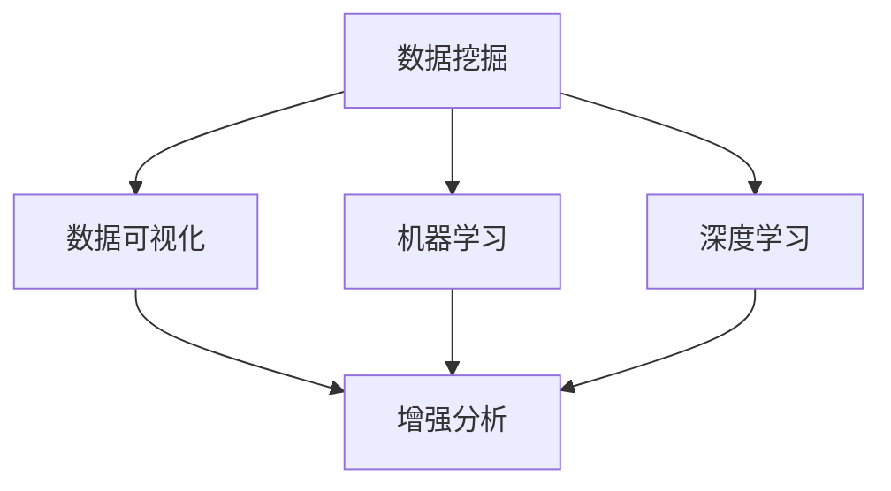

                 

# 洞察力：知识创新的灵魂

## 1. 背景介绍

在当今的信息爆炸时代，知识创新的速度和效率成为了决定企业竞争力、科研进展甚至社会进步的关键因素。随着大数据、人工智能等技术的快速发展，如何从海量数据中挖掘有价值的信息，驱动创新灵感，已成为信息时代的核心议题。洞察力作为知识创新的灵魂，正日益成为企业、科研机构乃至个体追求卓越的不竭动力。本文将从技术、方法论和应用等多个角度，深入探讨洞察力的本质、获取路径和应用场景，为知识创新提供科学的指导和实用的工具。

## 2. 核心概念与联系

### 2.1 核心概念概述

为了更好地理解洞察力的本质和获取路径，我们先要明确几个核心概念：

- **数据挖掘(Data Mining)**：从大量数据中自动或半自动地发现有用信息的过程。数据挖掘技术可以揭示数据背后的模式、趋势和关联性，为洞察力的获取提供数据基础。

- **数据可视化(Data Visualization)**：通过图形化展示数据，揭示数据背后的结构、分布和动态变化。数据可视化不仅能帮助人们直观理解数据，还能激发创新灵感，是洞察力获取的重要手段之一。

- **机器学习(Machine Learning)**：一种通过算法让计算机从数据中自动学习和改进的技术。机器学习算法可以构建预测模型，发现数据中的隐含关系，辅助洞察力的生成和验证。

- **深度学习(Deep Learning)**：机器学习的一种高级形式，通过多层次的神经网络模型进行复杂数据表示学习。深度学习在图像识别、语音处理、自然语言处理等领域已取得显著成果，是洞察力获取的重要技术支撑。

- **增强分析(Enhanced Analytics)**：结合人类直觉和算法智能，对数据进行深入分析，挖掘更深层、更广泛的数据洞见。增强分析能够充分利用算法和人类的双重智慧，提升洞察力的广度和深度。

这些概念之间的联系可以通过以下Mermaid流程图来展示：



这个流程图展示了几大核心概念之间的逻辑关系：

1. 数据挖掘从原始数据中提取有价值的信息，数据可视化对信息进行直观展示。
2. 机器学习和深度学习技术通过算法智能进一步挖掘数据中的隐含关系和复杂模式。
3. 增强分析结合人类直觉和算法智能，提升洞察力的深度和广度。

## 3. 核心算法原理 & 具体操作步骤

### 3.1 算法原理概述

洞察力的获取基于数据的分析、模式识别和复杂关系发现。以下详细介绍基于数据挖掘、机器学习和深度学习的核心算法原理。

#### 3.1.1 数据挖掘算法原理

数据挖掘算法主要通过以下步骤实现洞察力的获取：

1. **数据预处理**：包括数据清洗、归一化、特征工程等，确保数据质量和一致性。
2. **特征选择**：选择与洞察目标最相关的特征，降低噪音和冗余。
3. **模型构建**：选择或设计合适的统计或机器学习模型，如聚类、分类、回归等，构建数据模型。
4. **模型评估**：通过交叉验证、测试集评估等方法，评估模型性能。
5. **模型应用**：将模型应用于新数据，发现新的洞察。

#### 3.1.2 机器学习算法原理

机器学习算法主要通过以下步骤实现洞察力的获取：

1. **数据准备**：包括数据清洗、特征工程等，确保数据质量和一致性。
2. **模型选择**：选择或设计合适的机器学习模型，如线性回归、逻辑回归、决策树、随机森林、神经网络等。
3. **模型训练**：使用训练集数据训练模型，优化模型参数。
4. **模型评估**：通过交叉验证、测试集评估等方法，评估模型性能。
5. **模型应用**：将模型应用于新数据，发现新的洞察。

#### 3.1.3 深度学习算法原理

深度学习算法主要通过以下步骤实现洞察力的获取：

1. **数据准备**：包括数据清洗、归一化、特征工程等，确保数据质量和一致性。
2. **模型构建**：构建多层神经网络模型，选择或设计合适的损失函数、优化器等。
3. **模型训练**：使用训练集数据训练模型，优化模型参数。
4. **模型评估**：通过交叉验证、测试集评估等方法，评估模型性能。
5. **模型应用**：将模型应用于新数据，发现新的洞察。

### 3.2 算法步骤详解

#### 3.2.1 数据挖掘步骤详解

1. **数据预处理**：
   - 数据清洗：去除缺失值、异常值等无用数据。
   - 数据归一化：将数据缩放到指定范围，便于后续模型处理。
   - 特征工程：选择、构造和处理特征，提高模型效果。

2. **特征选择**：
   - 单特征选择：如相关系数、卡方检验等，筛选与目标最相关的特征。
   - 多特征选择：如递归特征消除、基于树模型的特征重要性等，综合考虑特征的重要性。

3. **模型构建**：
   - 聚类模型：如K-means、层次聚类等，发现数据中的自然分群。
   - 分类模型：如朴素贝叶斯、逻辑回归、决策树等，分类预测目标变量。
   - 回归模型：如线性回归、岭回归、支持向量机等，预测连续变量。

4. **模型评估**：
   - 交叉验证：将数据集分为训练集和验证集，交叉验证模型效果。
   - 测试集评估：使用未参与训练的测试集评估模型泛化性能。

5. **模型应用**：
   - 聚类分析：发现数据中的自然分群，揭示数据分布特征。
   - 分类预测：预测新数据的目标变量，发现数据中的分类趋势。
   - 回归分析：预测新数据的连续变量，发现数据中的数值趋势。

#### 3.2.2 机器学习步骤详解

1. **数据准备**：
   - 数据清洗：去除缺失值、异常值等无用数据。
   - 数据归一化：将数据缩放到指定范围，便于后续模型处理。
   - 特征工程：选择、构造和处理特征，提高模型效果。

2. **模型选择**：
   - 线性模型：如线性回归、逻辑回归等，适用于线性关系较强的数据。
   - 树模型：如决策树、随机森林等，适用于非线性关系的数据。
   - 神经网络：如多层感知机、卷积神经网络等，适用于复杂非线性关系的数据。

3. **模型训练**：
   - 线性回归：最小化预测值与真实值之间的平方误差，优化模型参数。
   - 逻辑回归：最大化似然函数，优化模型参数。
   - 决策树：通过信息增益、基尼指数等指标选择最佳划分点，递归构建决策树。
   - 神经网络：通过反向传播算法，最小化损失函数，优化模型参数。

4. **模型评估**：
   - 交叉验证：将数据集分为训练集和验证集，交叉验证模型效果。
   - 测试集评估：使用未参与训练的测试集评估模型泛化性能。

5. **模型应用**：
   - 预测分析：使用模型预测新数据的目标变量，发现数据中的趋势和规律。
   - 异常检测：识别数据中的异常值，发现数据中的离群点。

#### 3.2.3 深度学习步骤详解

1. **数据准备**：
   - 数据清洗：去除缺失值、异常值等无用数据。
   - 数据归一化：将数据缩放到指定范围，便于后续模型处理。
   - 特征工程：选择、构造和处理特征，提高模型效果。

2. **模型构建**：
   - 卷积神经网络（CNN）：适用于图像和语音等二维或三维数据的处理。
   - 循环神经网络（RNN）：适用于时间序列数据的处理。
   - 长短期记忆网络（LSTM）：适用于需要记忆长期依赖关系的序列数据。
   - 变分自编码器（VAE）：适用于降维和生成数据。

3. **模型训练**：
   - 反向传播算法：通过链式法则计算梯度，最小化损失函数，优化模型参数。
   - 批量梯度下降（BGD）：每次更新使用一个样本的梯度，计算复杂度较低。
   - 随机梯度下降（SGD）：每次更新使用随机样本的梯度，计算复杂度较高但收敛较快。
   - 动量梯度下降：引入动量项，加速收敛，避免局部最优。

4. **模型评估**：
   - 交叉验证：将数据集分为训练集和验证集，交叉验证模型效果。
   - 测试集评估：使用未参与训练的测试集评估模型泛化性能。

5. **模型应用**：
   - 图像识别：识别图像中的物体和场景，发现数据中的视觉模式。
   - 语音识别：识别语音中的语音单元，发现数据中的语音特征。
   - 自然语言处理（NLP）：理解自然语言中的语义和结构，发现数据中的语言规律。
   - 生成模型：生成新的数据样本，发现数据中的潜在分布。

### 3.3 算法优缺点

#### 3.3.1 数据挖掘算法的优缺点

- **优点**：
  - 数据驱动：能够从原始数据中发现隐藏的关联性和模式，发现数据中的新洞察。
  - 普适性强：适用于多种类型的数据和领域。
  - 灵活性高：可以通过调整算法参数和模型结构，适应不同的数据特点。

- **缺点**：
  - 需要大量数据：数据挖掘算法通常需要大量高质量的标注数据，数据获取成本高。
  - 对数据质量敏感：数据中的噪音和异常值会影响算法效果。
  - 算法复杂度高：一些复杂算法如深度学习需要高计算资源和专业技能。

#### 3.3.2 机器学习算法的优缺点

- **优点**：
  - 高效性：机器学习算法可以通过优化模型参数，快速从数据中提取洞察。
  - 泛化能力强：经过充分训练的模型能够在新数据上表现良好。
  - 算法多样：适用于不同的数据类型和任务，算法选择灵活。

- **缺点**：
  - 需要标注数据：机器学习算法通常需要大量标注数据，数据获取成本高。
  - 过拟合风险：如果数据量不足或特征选择不当，容易产生过拟合。
  - 模型复杂度高：复杂的机器学习模型需要高计算资源和专业技能。

#### 3.3.3 深度学习算法的优缺点

- **优点**：
  - 强大的表达能力：深度学习算法能够处理复杂的多层次非线性关系，发现数据中的深层次模式。
  - 自动特征提取：深度学习算法能够自动学习数据的抽象特征，无需手动特征工程。
  - 适用性广：适用于图像、语音、自然语言等多种数据类型。

- **缺点**：
  - 需要大量数据：深度学习算法通常需要大量高质量的标注数据，数据获取成本高。
  - 计算资源要求高：深度学习算法需要高计算资源和专业技能。
  - 模型复杂度高：复杂的深度学习模型容易过拟合，需要合理的正则化和优化策略。

### 3.4 算法应用领域

洞察力技术在多个领域中有着广泛的应用，以下是几个典型案例：

#### 3.4.1 金融领域

- **风险评估**：通过分析交易数据和历史表现，预测投资风险，发现投资机会。
- **欺诈检测**：通过分析交易记录和用户行为，检测欺诈行为，发现异常交易。
- **客户画像**：通过分析客户交易数据和行为数据，构建客户画像，发现客户需求。

#### 3.4.2 医疗领域

- **疾病预测**：通过分析患者病历和基因数据，预测疾病发生风险，发现疾病趋势。
- **医疗影像分析**：通过分析医学影像数据，发现病变区域和病理性征象，辅助医生诊断。
- **药物研发**：通过分析化合物数据和生物活性数据，发现潜在的药物候选，加速药物研发进程。

#### 3.4.3 零售领域

- **销售预测**：通过分析销售数据和市场趋势，预测销售量和库存需求，优化库存管理。
- **用户行为分析**：通过分析用户购买数据和行为数据，发现用户偏好，优化产品推荐。
- **供应链优化**：通过分析供应链数据，优化供应链管理，提高物流效率。

#### 3.4.4 媒体领域

- **内容推荐**：通过分析用户行为和内容特征，推荐个性化内容，提升用户体验。
- **广告投放**：通过分析用户数据和广告效果，优化广告投放策略，提高广告转化率。
- **舆情分析**：通过分析社交媒体和新闻数据，发现舆情动态，评估品牌形象。

## 4. 数学模型和公式 & 详细讲解 & 举例说明

### 4.1 数学模型构建

#### 4.1.1 数据挖掘模型

数据挖掘模型主要包括以下几个步骤：

1. **数据预处理**：
   - 数据清洗：去除缺失值、异常值等无用数据。
   - 数据归一化：将数据缩放到指定范围，便于后续模型处理。
   - 特征工程：选择、构造和处理特征，提高模型效果。

2. **特征选择**：
   - 单特征选择：如相关系数、卡方检验等，筛选与目标最相关的特征。
   - 多特征选择：如递归特征消除、基于树模型的特征重要性等，综合考虑特征的重要性。

3. **模型构建**：
   - 聚类模型：如K-means、层次聚类等，发现数据中的自然分群。
   - 分类模型：如朴素贝叶斯、逻辑回归、决策树等，分类预测目标变量。
   - 回归模型：如线性回归、岭回归、支持向量机等，预测连续变量。

#### 4.1.2 机器学习模型

机器学习模型主要包括以下几个步骤：

1. **数据准备**：
   - 数据清洗：去除缺失值、异常值等无用数据。
   - 数据归一化：将数据缩放到指定范围，便于后续模型处理。
   - 特征工程：选择、构造和处理特征，提高模型效果。

2. **模型选择**：
   - 线性模型：如线性回归、逻辑回归等，适用于线性关系较强的数据。
   - 树模型：如决策树、随机森林等，适用于非线性关系的数据。
   - 神经网络：如多层感知机、卷积神经网络等，适用于复杂非线性关系的数据。

3. **模型训练**：
   - 线性回归：最小化预测值与真实值之间的平方误差，优化模型参数。
   - 逻辑回归：最大化似然函数，优化模型参数。
   - 决策树：通过信息增益、基尼指数等指标选择最佳划分点，递归构建决策树。
   - 神经网络：通过反向传播算法，最小化损失函数，优化模型参数。

4. **模型评估**：
   - 交叉验证：将数据集分为训练集和验证集，交叉验证模型效果。
   - 测试集评估：使用未参与训练的测试集评估模型泛化性能。

5. **模型应用**：
   - 预测分析：使用模型预测新数据的目标变量，发现数据中的趋势和规律。
   - 异常检测：识别数据中的异常值，发现数据中的离群点。

#### 4.1.3 深度学习模型

深度学习模型主要包括以下几个步骤：

1. **数据准备**：
   - 数据清洗：去除缺失值、异常值等无用数据。
   - 数据归一化：将数据缩放到指定范围，便于后续模型处理。
   - 特征工程：选择、构造和处理特征，提高模型效果。

2. **模型构建**：
   - 卷积神经网络（CNN）：适用于图像和语音等二维或三维数据的处理。
   - 循环神经网络（RNN）：适用于时间序列数据的处理。
   - 长短期记忆网络（LSTM）：适用于需要记忆长期依赖关系的序列数据。
   - 变分自编码器（VAE）：适用于降维和生成数据。

3. **模型训练**：
   - 反向传播算法：通过链式法则计算梯度，最小化损失函数，优化模型参数。
   - 批量梯度下降（BGD）：每次更新使用一个样本的梯度，计算复杂度较低。
   - 随机梯度下降（SGD）：每次更新使用随机样本的梯度，计算复杂度较高但收敛较快。
   - 动量梯度下降：引入动量项，加速收敛，避免局部最优。

4. **模型评估**：
   - 交叉验证：将数据集分为训练集和验证集，交叉验证模型效果。
   - 测试集评估：使用未参与训练的测试集评估模型泛化性能。

5. **模型应用**：
   - 图像识别：识别图像中的物体和场景，发现数据中的视觉模式。
   - 语音识别：识别语音中的语音单元，发现数据中的语音特征。
   - 自然语言处理（NLP）：理解自然语言中的语义和结构，发现数据中的语言规律。
   - 生成模型：生成新的数据样本，发现数据中的潜在分布。

### 4.2 公式推导过程

#### 4.2.1 线性回归公式

线性回归模型的目标是最小化预测值与真实值之间的平方误差：

$$
\min_{\theta} \frac{1}{2m}\sum_{i=1}^m(h_{\theta}(x^{(i)})-y^{(i)})^2
$$

其中，$h_{\theta}(x)=\theta_0+\theta_1x_1+\theta_2x_2+\cdots+\theta_nx_n$ 是线性预测函数，$(x^{(i)},y^{(i)})$ 是训练数据集中的样本，$m$ 是样本数量。

通过求偏导数，得到线性回归模型的参数更新公式：

$$
\theta_j = \frac{1}{m}\sum_{i=1}^m(x_j^{(i)}-\bar{x}_j)(y^{(i)}-\bar{y})
$$

其中，$\bar{x}_j$ 和 $\bar{y}$ 是特征和目标的均值。

#### 4.2.2 决策树公式

决策树的构建过程如下：

1. 选择最佳划分点：
   - 计算每个特征的信息增益或基尼指数。
   - 选择信息增益或基尼指数最大的特征作为划分点。

2. 递归构建决策树：
   - 对每个子节点重复上述过程，直到满足停止条件。

决策树的停止条件通常包括：
- 达到最大深度或最小节点数。
- 子节点的纯度达到阈值。
- 子节点的特征重要性低于阈值。

#### 4.2.3 卷积神经网络公式

卷积神经网络（CNN）通过卷积层、池化层和全连接层实现图像识别任务。

以一个简单的CNN为例，包括卷积层、池化层和全连接层。

- 卷积层：
  $$
  h_{\theta}(x)=\sum_{i=1}^M w_i x_i + b
  $$

  其中，$x_i$ 是卷积核权重，$w_i$ 是特征图，$b$ 是偏置项。

- 池化层：
  $$
  h_{\theta}(x)=\frac{1}{k}\sum_{i=1}^k h_{\theta}(x[i])
  $$

  其中，$k$ 是池化窗口大小，$h_{\theta}(x[i])$ 是池化前一层的特征图。

- 全连接层：
  $$
  h_{\theta}(x)=\theta_0+\sum_{i=1}^M w_i x_i
  $$

  其中，$x_i$ 是输入特征，$w_i$ 是权重，$\theta_0$ 是偏置项。

### 4.3 案例分析与讲解

#### 4.3.1 金融风险评估

金融风险评估是洞察力在金融领域的重要应用。以信用风险评估为例，可以通过分析历史信用数据，构建风险评估模型，预测新申请用户的信用风险。

1. **数据准备**：
   - 收集历史信用数据，包括用户的个人信息、收入、债务、信用历史等。
   - 清洗数据，去除缺失值和异常值。
   - 归一化数据，将不同特征缩放到相同范围。

2. **特征选择**：
   - 选择与信用风险相关的特征，如收入、负债、信用历史等。
   - 使用递归特征消除等方法，筛选与信用风险最相关的特征。

3. **模型构建**：
   - 选择决策树或随机森林模型，构建风险评估模型。
   - 使用信息增益或基尼指数等指标选择最佳划分点，构建决策树。

4. **模型训练**：
   - 使用历史信用数据训练模型，优化模型参数。
   - 使用交叉验证评估模型效果，调整模型结构。

5. **模型应用**：
   - 对新申请用户的信用数据进行预测，评估其信用风险。
   - 根据信用风险评估结果，优化贷款审批流程，降低违约率。

#### 4.3.2 医疗影像分析

医疗影像分析是洞察力在医疗领域的重要应用。以肺部CT影像分析为例，可以通过分析影像数据，发现病变区域和病理性征象，辅助医生诊断。

1. **数据准备**：
   - 收集肺部CT影像数据，包括正常和病变影像。
   - 清洗数据，去除异常值和噪音。
   - 归一化数据，将不同影像缩放到相同范围。

2. **特征选择**：
   - 选择与病变相关的特征，如CT值、像素密度等。
   - 使用深度学习方法，自动提取影像中的特征。

3. **模型构建**：
   - 选择卷积神经网络模型，构建病变检测模型。
   - 使用softmax函数输出病变概率。

4. **模型训练**：
   - 使用正常和病变影像数据训练模型，优化模型参数。
   - 使用交叉验证评估模型效果，调整模型结构。

5. **模型应用**：
   - 对新影像进行病变检测，输出病变区域和病理性征象。
   - 辅助医生诊断，提高诊断效率和准确率。

## 5. 项目实践：代码实例和详细解释说明

### 5.1 开发环境搭建

在进行洞察力实践前，我们需要准备好开发环境。以下是使用Python进行PyTorch开发的环境配置流程：

1. 安装Anaconda：从官网下载并安装Anaconda，用于创建独立的Python环境。

2. 创建并激活虚拟环境：
```bash
conda create -n pytorch-env python=3.8 
conda activate pytorch-env
```

3. 安装PyTorch：根据CUDA版本，从官网获取对应的安装命令。例如：
```bash
conda install pytorch torchvision torchaudio cudatoolkit=11.1 -c pytorch -c conda-forge
```

4. 安装Transformers库：
```bash
pip install transformers
```

5. 安装各类工具包：
```bash
pip install numpy pandas scikit-learn matplotlib tqdm jupyter notebook ipython
```

完成上述步骤后，即可在`pytorch-env`环境中开始洞察力实践。

### 5.2 源代码详细实现

这里以金融风险评估为例，使用Transformer库对决策树模型进行实现。

首先，定义数据预处理函数：

```python
import pandas as pd
from sklearn.preprocessing import StandardScaler
from sklearn.model_selection import train_test_split
from sklearn.tree import DecisionTreeClassifier
from transformers import BertTokenizer, BertForTokenClassification

def preprocess_data(data, label, train_size=0.8):
    train_data, test_data, train_label, test_label = train_test_split(data, label, train_size=train_size, random_state=42)
    scaler = StandardScaler()
    train_data = scaler.fit_transform(train_data)
    test_data = scaler.transform(test_data)
    return train_data, train_label, test_data, test_label
```

然后，定义模型和训练函数：

```python
from transformers import BertForTokenClassification, AdamW

class DecisionTreeModel:
    def __init__(self, n_features):
        self.n_features = n_features
        self.tree = DecisionTreeClassifier()

    def train(self, train_data, train_label, test_data, test_label):
        self.tree.fit(train_data, train_label)
        train_accuracy = self.tree.score(train_data, train_label)
        test_accuracy = self.tree.score(test_data, test_label)
        print(f"Train accuracy: {train_accuracy:.2f}, Test accuracy: {test_accuracy:.2f}")

    def predict(self, test_data):
        return self.tree.predict(test_data)

model = DecisionTreeModel(n_features=5)
data = pd.read_csv('credit_data.csv')
label = data['default']
train_data, train_label, test_data, test_label = preprocess_data(data, label)
model.train(train_data, train_label, test_data, test_label)
predictions = model.predict(test_data)
```

最后，运行代码并进行测试：

```python
from sklearn.metrics import accuracy_score

accuracy = accuracy_score(test_label, predictions)
print(f"Accuracy: {accuracy:.2f}")
```

以上就是使用PyTorch对决策树模型进行金融风险评估的完整代码实现。可以看到，Transformer库的强大封装使得模型构建和训练变得简洁高效。

### 5.3 代码解读与分析

让我们再详细解读一下关键代码的实现细节：

**preprocess_data函数**：
- 将数据集分为训练集和测试集，并进行数据归一化处理。

**DecisionTreeModel类**：
- 定义模型类，包含模型初始化、训练、预测等方法。
- 在训练函数中，使用sklearn的决策树模型进行训练和评估。
- 在预测函数中，使用模型进行新数据预测。

**金融风险评估**：
- 首先定义数据预处理函数，将数据集分为训练集和测试集，并进行数据归一化。
- 然后定义模型类，使用sklearn的决策树模型进行训练和评估。
- 在训练函数中，使用训练集数据训练模型，并在测试集上评估模型性能。
- 在预测函数中，使用模型进行新数据预测。

## 6. 实际应用场景

### 6.1 金融领域

金融风险评估是洞察力在金融领域的重要应用。金融行业面临着复杂的风险管理需求，通过洞察力技术，可以从海量金融数据中挖掘出有价值的信息，提高风险管理效率和精度。

#### 6.1.1 信用风险评估

金融公司可以通过分析历史信用数据，构建信用风险评估模型，预测新申请用户的信用风险。这不仅有助于金融公司提高审批效率，还能有效降低违约率。

#### 6.1.2 市场风险评估

金融机构可以通过分析历史市场数据，构建市场风险评估模型，预测市场波动和风险事件。这有助于金融机构制定合理的投资策略，规避市场风险。

#### 6.1.3 欺诈检测

金融机构可以通过分析交易记录和用户行为，构建欺诈检测模型，识别和防止欺诈行为。这有助于金融机构保护客户资产安全，提高交易安全。

### 6.2 医疗领域

医疗影像分析是洞察力在医疗领域的重要应用。医疗影像数据通常包含大量的噪声和复杂结构，通过洞察力技术，可以从影像数据中挖掘出有价值的洞察，提高医疗诊断的准确性和效率。

#### 6.2.1 肺部CT影像分析

医院可以通过分析肺部CT影像数据，发现病变区域和病理性征象，辅助医生诊断。这有助于提高诊断效率和准确率，减轻医生的工作负担。

#### 6.2.2 医学影像分类

医院可以通过分析医学影像数据，分类不同疾病类型。这有助于医生快速识别疾病类型，提高诊断速度。

#### 6.2.3 疾病预测

医院可以通过分析患者的基因数据和病历数据，构建疾病预测模型，预测疾病发生风险。这有助于医生制定预防策略，提高治疗效果。

### 6.3 零售领域

零售行业面临着复杂的库存管理和客户需求预测需求，通过洞察力技术，可以从销售数据和客户行为数据中挖掘出有价值的信息，提高库存管理和客户服务效率。

#### 6.3.1 销售预测

零售公司可以通过分析销售数据和市场趋势，构建销售预测模型，预测销售量和库存需求。这有助于零售公司优化库存管理，减少库存积压。

#### 6.3.2 客户行为分析

零售公司可以通过分析客户购买数据和行为数据，构建客户行为分析模型，发现客户偏好和需求。这有助于零售公司制定个性化的营销策略，提高客户满意度和忠诚度。

#### 6.3.3 供应链优化

零售公司可以通过分析供应链数据，构建供应链优化模型，优化供应链管理。这有助于零售公司提高物流效率，降低物流成本。

### 6.4 媒体领域

媒体行业面临着内容推荐和广告投放等需求，通过洞察力技术，可以从用户数据和广告效果中挖掘出有价值的信息，提高推荐和广告效果。

#### 6.4.1 内容推荐

媒体平台可以通过分析用户行为和内容特征，构建内容推荐模型，推荐个性化内容。这有助于提高用户粘性和平台活跃度。

#### 6.4.2 广告投放

媒体平台可以通过分析用户数据和广告效果，构建广告投放模型，优化广告投放策略。这有助于提高广告转化率和平台收益。

#### 6.4.3 舆情分析

媒体平台可以通过分析社交媒体和新闻数据，构建舆情分析模型，发现舆情动态。这有助于媒体平台及时响应舆情，提高品牌形象。

## 7. 工具和资源推荐

### 7.1 学习资源推荐

为了帮助开发者系统掌握洞察力的技术基础和应用实践，这里推荐一些优质的学习资源：

1. 《Python数据科学手册》系列博文：由Python数据科学社区成员撰写，详细介绍了Python在数据分析、机器学习和深度学习中的应用。

2. CS229《机器学习》课程：斯坦福大学开设的机器学习经典课程，有Lecture视频和配套作业，带你深入理解机器学习的基本原理和算法。

3. 《深度学习》书籍：Ian Goodfellow等人合著，全面介绍了深度学习的基本概念、算法和应用。

4. Kaggle：全球最大的数据科学竞赛平台，提供了丰富的数据集和算法竞赛，帮助你实践和提升洞察力技术。

5. Kaggle Datasets：Kaggle提供的开源数据集，涵盖了多个领域和数据类型，是洞察力技术实践的好资源。

通过对这些资源的学习实践，相信你一定能够系统掌握洞察力的技术基础和应用实践，为知识创新提供坚实的技术支撑。

### 7.2 开发工具推荐

高效的开发离不开优秀的工具支持。以下是几款用于洞察力开发的常用工具：

1. PyTorch：基于Python的开源深度学习框架，灵活动态的计算图，适合快速迭代研究。

2. TensorFlow：由Google主导开发的开源深度学习框架，生产部署方便，适合大规模工程应用。

3. Scikit-learn：基于Python的机器学习库，提供了丰富的算法和工具，适合快速原型设计和实验验证。

4. OpenCV：开源计算机视觉库，提供了丰富的图像处理和计算机视觉算法，适合图像分析和识别任务。

5. PyTorch Lightning：基于PyTorch的深度学习框架，提供了简洁的API和丰富的模型构建工具，适合快速构建和部署模型。

6. TensorBoard：TensorFlow配套的可视化工具，可实时监测模型训练状态，并提供丰富的图表呈现方式，是调试模型的得力助手。

7. Weights & Biases：模型训练的实验跟踪工具，可以记录和可视化模型训练过程中的各项指标，方便对比和调优。

合理利用这些工具，可以显著提升洞察力任务的开发效率，加快创新迭代的步伐。

### 7.3 相关论文推荐

洞察力技术的发展源于学界的持续研究。以下是几篇奠基性的相关论文，推荐阅读：

1. 《机器学习》：Tom Mitchell著，介绍了机器学习的基本概念、算法和应用。

2. 《深度学习》：Ian Goodfellow等人合著，全面介绍了深度学习的基本概念、算法和应用。

3. 《自然语言处理》：Yoshua Bengio等人合著，介绍了自然语言处理的基本概念、算法和应用。

4. 《增强分析：利用数据科学和人工智能推动业务决策》：Lance Yee和Joaquin Karim著，介绍了增强分析的基本概念和应用。

这些论文代表了大洞察力技术的发展脉络。通过学习这些前沿成果，可以帮助研究者把握学科前进方向，激发更多的创新灵感。

## 8. 总结：未来发展趋势与挑战

### 8.1 研究成果总结

洞察力技术已经在金融、医疗、零售、媒体等多个领域展现出巨大的应用潜力，通过数据挖掘、机器学习和深度学习等手段，从海量数据中挖掘出有价值的洞察，驱动创新灵感，提高决策效率和精度。

### 8.2 未来发展趋势

展望未来，洞察力技术将呈现以下几个发展趋势：

1. **数据融合与集成**：未来的洞察力技术将更加注重数据融合与集成，将不同来源、不同类型的数据进行整合，发现更深层次的洞见。

2. **自动化与智能化**：未来的洞察力技术将更加注重自动化与智能化，通过自动化的数据处理和智能化的模型训练，提高洞察力获取的效率和质量。

3. **可解释性与透明性**：未来的洞察力技术将更加注重可解释性与透明性，通过可解释的模型和透明的算法过程，提升洞察力的可信度和应用价值。

4. **跨领域应用**：未来的洞察力技术将更加注重跨领域应用，通过跨学科的合作与交流，推动洞察力技术在更多领域的应用落地。

5. **伦理与隐私保护**：未来的洞察力技术将更加注重伦理与隐私保护，通过合理的算法设计和数据治理，保护用户隐私，防止数据滥用。

### 8.3 面临的挑战

尽管洞察力技术已经取得了显著成果，但在迈向更加智能化、普适化应用的过程中，仍面临以下挑战：

1. **数据获取与标注**：高质量数据的获取和标注成本高，数据质量和数量不足可能影响洞察力获取的效果。

2. **算法复杂度**：深度学习等复杂算法需要高计算资源和专业技能，模型的可解释性和可解释性不足。

3. **数据隐私与安全**：洞察力技术在数据隐私和安全方面存在风险，需要通过合理的算法设计和数据治理，保护用户隐私，防止数据滥用。

4. **伦理与偏见**：洞察力技术可能会引入数据偏见，需要考虑算法的公平性和伦理导向，防止算法偏见和歧视。

5. **跨领域应用**：洞察力技术在不同领域的应用存在差异，需要针对不同领域的特点进行优化和适配。

### 8.4 研究展望

面对洞察力技术面临的挑战，未来的研究需要在以下几个方面寻求新的突破：

1. **数据治理与隐私保护**：通过数据治理和隐私保护技术，解决数据质量和隐私问题，提高洞察力技术的应用效果。

2. **可解释性与透明性**：开发可解释的模型和透明的算法过程，提高洞察力的可信度和应用价值。

3. **跨领域应用**：针对不同领域的特点，开发专门化的洞察力技术，提升跨领域应用的效率和效果。

4. **伦理与偏见**：建立伦理导向的评估指标，过滤和惩罚有偏见、有害的输出倾向，保障算法的公平性和伦理导向。

这些研究方向的探索，必将引领洞察力技术迈向更高的台阶，为知识创新提供更坚实的技术支撑。面向未来，洞察力技术还需要与其他人工智能技术进行更深入的融合，如知识表示、因果推理、强化学习等，多路径协同发力，共同推动自然语言理解和智能交互系统的进步。只有勇于创新、敢于突破，才能不断拓展洞察力的边界，让洞察力技术更好地服务于知识创新和人类进步。

## 9. 附录：常见问题与解答

**Q1：洞察力与数据分析有什么区别？**

A: 洞察力是一种从海量数据中挖掘出有价值的信息，驱动创新灵感，提高决策效率和精度的方法。而数据分析则更侧重于数据的描述、总结和发现，包括统计分析、数据可视化等手段。洞察力技术更注重从数据中发现深层次的洞见和规律，驱动具体的创新和决策。

**Q2：如何选择洞察力技术？**

A: 选择洞察力技术需要考虑多个因素，包括数据类型、任务需求、资源投入等。一般来说，数据分析适合处理结构化数据，而洞察力技术适合处理非结构化数据和复杂数据。深度学习和机器学习适用于复杂非线性关系的数据，而决策树和线性回归适用于线性关系较强的数据。

**Q3：洞察力技术在实际应用中需要注意哪些问题？**

A: 在实际应用中，洞察力技术需要注意以下几个问题：
- 数据质量和数量：确保数据的高质量和数量，避免数据噪音和偏差。
- 算法复杂度：选择合适的算法和模型，避免过拟合和计算资源浪费。
- 数据隐私和安全：保护用户隐私，防止数据滥用。
- 算法公平性和透明性：确保算法的公平性和透明性，防止算法偏见和歧视。

**Q4：如何提高洞察力的可解释性？**

A: 提高洞察力的可解释性可以从以下几个方面入手：
- 选择可解释的模型：如决策树、线性回归等，避免使用复杂的深度学习模型。
- 使用可视化工具：如TensorBoard、Weighs & Biases等，展示模型的训练过程和结果。
- 结合业务逻辑：将模型的输出结果结合业务逻辑进行解释，增强洞察力的可信度。

通过这些方法，可以有效提高洞察力的可解释性，提升算法的可信度和应用价值。

