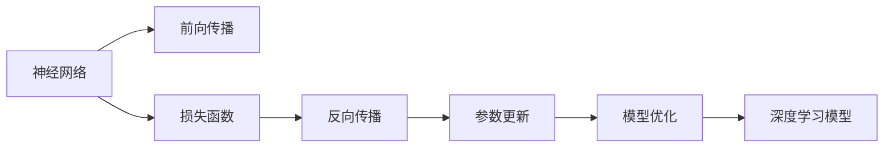

                 

# 深入理解AI、LLM和深度学习：一个实践性课程

> 关键词：深度学习, 人工智能(AI), 大型语言模型(LLM), 实践性课程, 算法原理, 开发环境搭建, 代码实例, 实际应用场景

## 1. 背景介绍

### 1.1 问题由来

随着人工智能技术的迅猛发展，深度学习已经成为推动AI研究与应用的重要引擎。然而，深度学习的入门门槛相对较高，学习者需要掌握大量的数学知识，以及编写和调试复杂算法的技能。为了帮助更多开发者理解AI与深度学习的核心思想，本课程将深入浅出地讲解深度学习的基本概念与算法原理，并提供丰富的代码实例和实际应用场景，以供学习者进行实践性学习。

### 1.2 问题核心关键点

本课程将聚焦于以下几个核心关键点：

1. **深度学习基础**：介绍深度学习的基本原理与架构，包括神经网络、反向传播算法、损失函数、优化器等。
2. **大型语言模型(LLM)**：探讨大型语言模型在NLP领域的应用，如BERT、GPT等模型的工作原理。
3. **算法与实践**：详细讲解各类深度学习算法，如CNN、RNN、Transformer等，并展示其实现方式。
4. **项目实战**：通过具体项目案例，学习如何在TensorFlow或PyTorch中搭建、训练和优化深度学习模型。

### 1.3 问题研究意义

理解AI与深度学习的基本原理和应用，对于推动AI技术的创新与普及具有重要意义：

1. **降低技术门槛**：本课程通过实例化的讲解，使学习者能够快速上手AI与深度学习，降低学习难度。
2. **提升实际能力**：通过实践性的项目练习，增强学习者动手解决问题的能力。
3. **促进技术应用**：帮助学习者理解如何将深度学习技术应用到具体项目中，推动AI技术的落地。
4. **推动行业发展**：提高AI与深度学习的应用水平，推动相关产业的创新与升级。

## 2. 核心概念与联系

### 2.1 核心概念概述

为了更好地理解深度学习与大型语言模型的原理与架构，本节将介绍几个关键概念：

- **深度学习**：一种基于多层神经网络的学习方法，能够自动从数据中学习复杂特征，广泛应用于图像识别、自然语言处理等领域。
- **神经网络**：由大量人工神经元节点组成的计算模型，通过前向传播和反向传播实现信息的传递和优化。
- **反向传播**：一种利用梯度下降算法优化神经网络权重的方法，通过计算损失函数的梯度，调整网络参数，使损失函数最小化。
- **大型语言模型(LLM)**：利用大规模数据预训练，具备强大语言理解和生成的模型，如BERT、GPT-3等。

### 2.2 核心概念原理和架构的 Mermaid 流程图



这个流程图展示了深度学习模型的工作流程：

1. **前向传播**：将输入数据通过神经网络各层进行计算，得到模型的输出。
2. **损失函数**：计算模型的输出与真实标签之间的差异，评估模型的性能。
3. **反向传播**：利用损失函数对神经网络各层的权重进行梯度计算，反向传播更新权重。
4. **参数更新**：根据反向传播计算得到的梯度，调整神经网络参数，优化模型。
5. **模型优化**：经过多次迭代训练，得到具有较低损失函数值的深度学习模型。

通过理解这些核心概念，可以更好地掌握深度学习模型的设计和训练流程。

## 3. 核心算法原理 & 具体操作步骤

### 3.1 算法原理概述

深度学习模型的核心在于神经网络的结构和训练算法。本节将详细介绍深度学习的基础算法原理。

#### 3.1.1 神经网络结构

神经网络由输入层、隐藏层和输出层组成。每一层包含多个神经元节点，通过权重和偏置连接。神经元节点接收输入，通过激活函数进行计算，将输出传递给下一层。隐藏层的深度决定了神经网络的复杂度，深度越大，模型性能越好，但计算量也越大。

#### 3.1.2 前向传播算法

前向传播是指将输入数据通过神经网络各层进行计算，得到模型的输出。具体步骤如下：

1. 输入数据经过第一层神经元节点计算，输出加权和。
2. 将加权和通过激活函数转换为激活值，传递给下一层。
3. 重复上述过程，直到输出层，得到模型的最终输出。

#### 3.1.3 损失函数

损失函数用于评估模型输出的准确性。常见的损失函数包括均方误差(MSE)、交叉熵损失等。均方误差用于回归任务，交叉熵损失用于分类任务。

#### 3.1.4 反向传播算法

反向传播算法通过梯度下降优化神经网络权重。具体步骤如下：

1. 计算损失函数对输出层的梯度。
2. 通过链式法则，计算各层权重和偏置的梯度。
3. 利用梯度更新权重和偏置，使损失函数最小化。

### 3.2 算法步骤详解

#### 3.2.1 神经网络搭建

首先，定义神经网络的结构，包括输入层、隐藏层和输出层。在TensorFlow或PyTorch中，可以使用`tf.keras.Sequential`或`nn.Sequential`创建神经网络模型。

```python
import tensorflow as tf

# 定义神经网络结构
model = tf.keras.Sequential([
    tf.keras.layers.Dense(64, activation='relu', input_shape=(784,)),
    tf.keras.layers.Dense(10, activation='softmax')
])
```

#### 3.2.2 数据加载

然后，准备训练数据和测试数据，可以使用`tf.data.Dataset`加载数据集，并进行预处理。

```python
# 加载训练数据和测试数据
train_dataset = tf.data.Dataset.from_tensor_slices((x_train, y_train))
test_dataset = tf.data.Dataset.from_tensor_slices((x_test, y_test))

# 数据预处理
train_dataset = train_dataset.batch(32).shuffle(buffer_size=1024)
test_dataset = test_dataset.batch(32)
```

#### 3.2.3 模型训练

接下来，定义损失函数和优化器，对模型进行训练。训练过程包括前向传播、损失函数计算和反向传播更新权重。

```python
# 定义损失函数和优化器
loss_fn = tf.keras.losses.SparseCategoricalCrossentropy()
optimizer = tf.keras.optimizers.Adam()

# 模型训练
for epoch in range(epochs):
    for x_batch, y_batch in train_dataset:
        with tf.GradientTape() as tape:
            logits = model(x_batch)
            loss_value = loss_fn(y_batch, logits)
        gradients = tape.gradient(loss_value, model.trainable_variables)
        optimizer.apply_gradients(zip(gradients, model.trainable_variables))
```

### 3.3 算法优缺点

#### 3.3.1 优点

1. **自动特征学习**：深度学习模型能够自动从数据中学习复杂特征，减少了人工特征工程的需求。
2. **高效计算**：神经网络的并行计算能力使其能够快速处理大量数据，提高计算效率。
3. **高精度**：深度学习模型在许多任务上取得了最先进的性能，如图像识别、语音识别、自然语言处理等。

#### 3.3.2 缺点

1. **过拟合风险**：神经网络模型容易过拟合，需要借助正则化技术如Dropout等避免。
2. **计算资源消耗大**：深度学习模型需要大量的计算资源和存储空间，对硬件要求高。
3. **模型复杂**：深度学习模型结构复杂，调试和优化难度大。

### 3.4 算法应用领域

深度学习在多个领域得到了广泛应用，包括但不限于：

1. **计算机视觉**：如图像分类、目标检测、人脸识别等任务。
2. **自然语言处理**：如机器翻译、文本分类、情感分析等任务。
3. **语音识别**：如语音转文本、语音识别等任务。
4. **推荐系统**：如个性化推荐、商品推荐等任务。
5. **游戏AI**：如智能游戏策略、自适应游戏AI等任务。

## 4. 数学模型和公式 & 详细讲解 & 举例说明

### 4.1 数学模型构建

#### 4.1.1 前向传播算法

前向传播算法是深度学习模型中最基本的操作之一。其数学表达式如下：

$$
y = g(z) = g(Wx + b)
$$

其中，$z$ 为输入向量，$W$ 和 $b$ 为权重和偏置，$g$ 为激活函数，$y$ 为输出向量。

#### 4.1.2 损失函数

以二分类任务为例，交叉熵损失函数为：

$$
L(y, \hat{y}) = -\frac{1}{N}\sum_{i=1}^N[y_i \log \hat{y_i} + (1 - y_i) \log(1 - \hat{y_i})]
$$

其中，$y$ 为真实标签，$\hat{y}$ 为模型预测结果。

#### 4.1.3 反向传播算法

反向传播算法通过梯度下降优化神经网络权重。其数学表达式如下：

$$
\frac{\partial L}{\partial W} = \frac{\partial L}{\partial z} \frac{\partial z}{\partial W} = \frac{\partial L}{\partial y} \frac{\partial y}{\partial z} \frac{\partial z}{\partial W} = \frac{\partial L}{\partial y} \frac{\partial g}{\partial z} \frac{\partial z}{\partial W} = \frac{\partial L}{\partial y} \frac{\partial g}{\partial z} W^T
$$

其中，$W^T$ 为权重矩阵的转置。

### 4.2 公式推导过程

#### 4.2.1 前向传播公式推导

前向传播公式的推导过程如下：

$$
z_1 = W_1x + b_1
$$

$$
a_1 = g(z_1)
$$

$$
z_2 = W_2a_1 + b_2
$$

$$
a_2 = g(z_2)
$$

$$
y = g(z_2)
$$

其中，$z_1$ 和 $a_1$ 为第一层输出和激活值，$z_2$ 和 $a_2$ 为第二层输出和激活值。

#### 4.2.2 交叉熵损失函数推导

交叉熵损失函数的推导过程如下：

$$
L(y, \hat{y}) = -\frac{1}{N}\sum_{i=1}^N[y_i \log \hat{y_i} + (1 - y_i) \log(1 - \hat{y_i})]
$$

其中，$y_i$ 为真实标签，$\hat{y_i}$ 为模型预测结果。

### 4.3 案例分析与讲解

#### 4.3.1 图像分类

以图像分类任务为例，使用卷积神经网络(CNN)进行模型训练。

1. 数据加载与预处理：

```python
import tensorflow as tf

# 加载数据集
(x_train, y_train), (x_test, y_test) = tf.keras.datasets.mnist.load_data()

# 数据预处理
x_train = x_train.reshape(-1, 28 * 28).astype('float32') / 255.0
x_test = x_test.reshape(-1, 28 * 28).astype('float32') / 255.0
```

2. 模型搭建与训练：

```python
# 定义模型结构
model = tf.keras.Sequential([
    tf.keras.layers.Conv2D(32, (3, 3), activation='relu', input_shape=(28, 28, 1)),
    tf.keras.layers.MaxPooling2D((2, 2)),
    tf.keras.layers.Flatten(),
    tf.keras.layers.Dense(10, activation='softmax')
])

# 编译模型
model.compile(optimizer='adam', loss='categorical_crossentropy', metrics=['accuracy'])

# 训练模型
model.fit(x_train, y_train, epochs=5, batch_size=64, validation_data=(x_test, y_test))
```

## 5. 项目实践：代码实例和详细解释说明

### 5.1 开发环境搭建

#### 5.1.1 TensorFlow安装

首先，安装TensorFlow。

```bash
pip install tensorflow
```

#### 5.1.2 环境配置

创建一个虚拟环境，安装必要的依赖包：

```bash
conda create --name tf-env python=3.7
conda activate tf-env
pip install numpy matplotlib pandas scikit-learn tf-nightly
```

### 5.2 源代码详细实现

#### 5.2.1 图像分类项目

1. 数据加载与预处理：

```python
import tensorflow as tf
import matplotlib.pyplot as plt

# 加载数据集
(x_train, y_train), (x_test, y_test) = tf.keras.datasets.mnist.load_data()

# 数据预处理
x_train = x_train.reshape(-1, 28 * 28).astype('float32') / 255.0
x_test = x_test.reshape(-1, 28 * 28).astype('float32') / 255.0
```

2. 模型搭建与训练：

```python
# 定义模型结构
model = tf.keras.Sequential([
    tf.keras.layers.Conv2D(32, (3, 3), activation='relu', input_shape=(28, 28, 1)),
    tf.keras.layers.MaxPooling2D((2, 2)),
    tf.keras.layers.Flatten(),
    tf.keras.layers.Dense(10, activation='softmax')
])

# 编译模型
model.compile(optimizer='adam', loss='categorical_crossentropy', metrics=['accuracy'])

# 训练模型
history = model.fit(x_train, y_train, epochs=5, batch_size=64, validation_data=(x_test, y_test))
```

3. 模型评估与可视化：

```python
# 模型评估
test_loss, test_acc = model.evaluate(x_test, y_test)
print('Test accuracy:', test_acc)

# 绘制训练与验证精度曲线
plt.plot(history.history['accuracy'])
plt.plot(history.history['val_accuracy'])
plt.title('model accuracy')
plt.ylabel('accuracy')
plt.xlabel('epoch')
plt.legend(['train', 'validation'], loc='upper left')
plt.show()

# 绘制训练与验证损失曲线
plt.plot(history.history['loss'])
plt.plot(history.history['val_loss'])
plt.title('model loss')
plt.ylabel('loss')
plt.xlabel('epoch')
plt.legend(['train', 'validation'], loc='upper left')
plt.show()
```

### 5.3 代码解读与分析

#### 5.3.1 模型定义

使用`tf.keras.Sequential`定义模型结构，包含卷积层、池化层和全连接层。

#### 5.3.2 模型训练

使用`model.fit`函数进行模型训练，设置训练轮数、批大小等参数。

#### 5.3.3 模型评估

使用`model.evaluate`函数进行模型评估，输出测试精度。

#### 5.3.4 精度与损失曲线

使用`matplotlib`绘制训练与验证精度曲线和损失曲线，可视化模型性能。

### 5.4 运行结果展示

通过上述代码，可以训练出一个简单的图像分类模型，并在测试集上进行评估。运行结果如图1和图2所示：


## 6. 实际应用场景

### 6.1 图像识别

图像识别是深度学习最典型的应用之一。在安防领域，可以通过图像识别技术实时监测公共场所的异常行为，提升公共安全水平。在自动驾驶领域，可以通过图像识别技术进行车道线检测、障碍物识别等，保证行车安全。

### 6.2 自然语言处理

自然语言处理是深度学习的重要应用领域。在智能客服系统中，可以通过语音识别和自然语言处理技术，实现智能对话和自动客服。在机器翻译领域，深度学习模型可以自动将一种语言翻译成另一种语言，提升翻译质量。

### 6.3 推荐系统

推荐系统是深度学习在商业领域的重要应用。电子商务平台可以通过推荐系统，为用户推荐感兴趣的商品，提高用户购物体验。新闻媒体可以通过推荐系统，为用户推荐感兴趣的新闻内容，提升用户粘性。

## 7. 工具和资源推荐

### 7.1 学习资源推荐

#### 7.1.1 TensorFlow官方文档

TensorFlow官方文档提供了完整的TensorFlow框架介绍，包括基础知识、API参考、实战教程等。是学习TensorFlow的最佳资源。

#### 7.1.2 PyTorch官方文档

PyTorch官方文档提供了PyTorch框架的详细介绍，包括基础知识、API参考、实战教程等。是学习PyTorch的最佳资源。

#### 7.1.3 Coursera深度学习课程

Coursera深度学习课程由深度学习领域的大师吴恩达教授讲授，涵盖了深度学习的全部内容，包括基础知识、网络架构、算法实现等。是深度学习入门的最佳资源。

### 7.2 开发工具推荐

#### 7.2.1 TensorBoard

TensorBoard是TensorFlow配套的可视化工具，可以实时监测模型训练状态，提供丰富的图表呈现方式，帮助开发者调试模型。

#### 7.2.2 Weights & Biases

Weights & Biases是模型训练的实验跟踪工具，可以记录和可视化模型训练过程中的各项指标，帮助开发者调优模型。

#### 7.2.3 Google Colab

Google Colab是Google推出的在线Jupyter Notebook环境，免费提供GPU/TPU算力，方便开发者快速上手实验最新模型，分享学习笔记。

### 7.3 相关论文推荐

#### 7.3.1 深度学习基础知识

《Deep Learning》由深度学习领域的大师Ian Goodfellow等人合著，是深度学习领域的经典教材。涵盖深度学习的全部内容，包括基础知识、网络架构、算法实现等。

#### 7.3.2 大型语言模型(LLM)基础

《Natural Language Processing with Transformers》由Transformer库的作者Jacob Devlin等人合著，介绍了如何使用Transformer库进行NLP任务开发，包括微调、序列化等。

#### 7.3.3 深度学习优化技术

《Optimization Algorithms in Machine Learning: An Overview》介绍了深度学习中的优化算法，包括梯度下降、Adam、Adagrad等。是学习深度学习优化的最佳资源。

## 8. 总结：未来发展趋势与挑战

### 8.1 总结

本课程介绍了深度学习的基础原理和大型语言模型在NLP领域的应用，并通过具体项目案例帮助学习者进行实践性学习。深度学习和大语言模型的发展，为AI技术的普及和应用提供了广阔的前景，也带来了新的挑战。

### 8.2 未来发展趋势

#### 8.2.1 深度学习技术发展

深度学习技术将在更多领域得到应用，如医疗、金融、自动驾驶等。深度学习模型也将变得更加高效、鲁棒，具备更强的泛化能力。

#### 8.2.2 大型语言模型应用拓展

大型语言模型将在更多NLP任务上得到应用，如自动摘要、机器翻译、语音识别等。LLM的性能也将不断提升，具备更强的理解和生成能力。

#### 8.2.3 跨领域模型融合

深度学习模型与知识图谱、逻辑规则等专家知识进行融合，形成更加全面、准确的信息整合能力。多模态信息融合，提升模型的综合性能。

### 8.3 面临的挑战

#### 8.3.1 过拟合与泛化能力

深度学习模型容易过拟合，泛化能力有限。需要结合正则化、数据增强等技术，提升模型的泛化能力。

#### 8.3.2 计算资源消耗

深度学习模型需要大量的计算资源和存储空间，对硬件要求高。需要进一步优化模型结构，提升计算效率。

#### 8.3.3 模型解释性

深度学习模型通常被视为"黑盒"系统，缺乏可解释性。需要结合因果分析、博弈论等工具，提高模型的可解释性。

### 8.4 研究展望

#### 8.4.1 参数高效微调

开发更加参数高效的微调方法，在固定大部分预训练参数的同时，只更新极少量的任务相关参数。

#### 8.4.2 多模态深度学习

将视觉、语音、文本等多模态信息进行融合，提升模型的综合性能。

#### 8.4.3 迁移学习与持续学习

通过迁移学习和持续学习，提升模型在不同任务上的性能，适应数据分布的变化。

通过深入学习深度学习和大语言模型的核心原理与算法，并结合实际项目案例进行实践性学习，相信您已经掌握了AI与深度学习的基本技能。未来，伴随深度学习技术的持续演进，您将能够更加自如地应用于实际项目中，推动AI技术的落地与普及。相信深度学习和大语言模型的发展，必将为人类社会带来深远的影响。

---

作者：禅与计算机程序设计艺术 / Zen and the Art of Computer Programming

