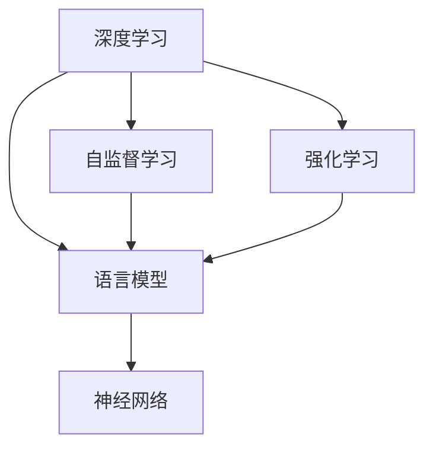
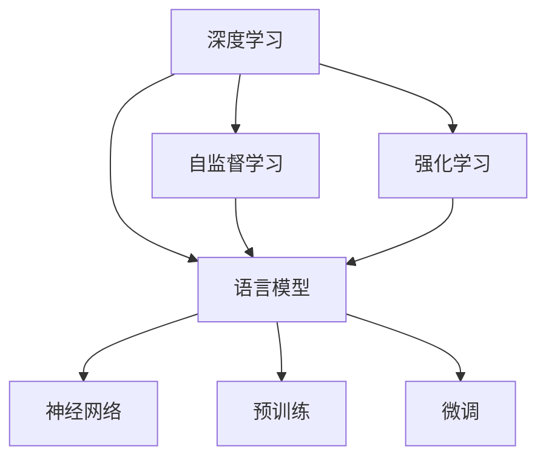

                 

# 深入理解AI、LLM和深度学习：一门全面的课程

> 关键词：深度学习,人工智能,语言模型,自监督学习,强化学习,神经网络

## 1. 背景介绍

### 1.1 问题由来
在当前的信息时代，人工智能(AI)技术正逐步渗透到社会的各个方面，从自然语言处理(NLP)、计算机视觉、语音识别到智能推荐，AI技术无所不在。特别是最近几年，随着深度学习技术的快速发展和计算资源的不断丰富，AI在处理复杂任务方面的能力得到了显著提升。

语言模型作为AI的重要分支，近年来取得了突破性进展。基于神经网络的自然语言处理(NLP)模型，如BERT、GPT、T5等，通过大规模无标签数据进行预训练，学习了丰富的语言知识和语义表示，已经在机器翻译、文本摘要、命名实体识别等众多NLP任务上表现优异。这些语言模型也被称为大规模语言模型(LLM)，其预训练和微调过程体现了深度学习和强化学习等前沿技术的综合运用。

然而，尽管这些语言模型已经取得了显著成就，但它们在理解语言语义、生成高质量文本等方面仍然存在诸多局限。如何在已有的基础上，进一步提升语言模型的能力，使其能够更好地适应不同应用场景，成为当前AI研究的热点问题。

### 1.2 问题核心关键点
要回答这个问题，首先需要了解以下几个关键点：

- 深度学习：通过神经网络对数据进行建模和训练，使其具备识别、分类、生成等能力。
- 语言模型：特别是基于神经网络的自然语言处理模型，通过预训练和微调，具备强大的语言理解与生成能力。
- 自监督学习：通过大规模无标签数据进行预训练，学习语言的普遍性表示。
- 强化学习：通过与环境的互动，学习最优决策策略，使其在特定任务上表现优异。
- 神经网络：深度学习的基础，包含卷积神经网络、循环神经网络、变分自编码器等不同架构。

这些核心概念之间的逻辑关系可以通过以下Mermaid流程图来展示：



该流程图展示了深度学习、自监督学习、强化学习和语言模型之间的联系：

1. 深度学习提供通用的数据建模方法，自监督学习利用无标签数据预训练模型，强化学习通过与环境的互动优化模型，而语言模型则是这些技术在NLP领域的具体应用。
2. 自监督学习和强化学习为语言模型提供了更强大的预训练和微调能力，使其能够更好地适应各种NLP任务。
3. 神经网络是深度学习和强化学习的基础，同时也是语言模型实现的核心。

理解这些核心概念及其相互关系，是深入理解AI、LLM和深度学习的关键。

## 2. 核心概念与联系

### 2.1 核心概念概述

为了更好地理解AI、LLM和深度学习，本节将介绍几个密切相关的核心概念：

- 深度学习：基于神经网络对数据进行建模和训练，使其具备识别、分类、生成等能力。
- 自监督学习：通过无标签数据进行预训练，学习语言的普遍性表示。
- 强化学习：通过与环境的互动，学习最优决策策略，使其在特定任务上表现优异。
- 神经网络：深度学习的基础，包含卷积神经网络、循环神经网络、变分自编码器等不同架构。
- 语言模型：特别是基于神经网络的自然语言处理模型，通过预训练和微调，具备强大的语言理解与生成能力。

这些核心概念之间的逻辑关系可以通过以下Mermaid流程图来展示：


这个流程图展示了深度学习、自监督学习、强化学习和语言模型之间的联系：

1. 深度学习提供通用的数据建模方法，自监督学习利用无标签数据预训练模型，强化学习通过与环境的互动优化模型，而语言模型则是这些技术在NLP领域的具体应用。
2. 自监督学习和强化学习为语言模型提供了更强大的预训练和微调能力，使其能够更好地适应各种NLP任务。
3. 神经网络是深度学习和强化学习的基础，同时也是语言模型实现的核心。

这些核心概念共同构成了深度学习和人工智能的基础框架，使得AI技术在各个领域得以广泛应用。

### 2.2 核心概念原理和架构

深度学习的基础是神经网络，其核心思想是通过多层神经元进行数据建模，并利用反向传播算法更新模型参数，使得模型能够逼近复杂函数关系。神经网络的架构包括卷积神经网络(CNN)、循环神经网络(RNN)、长短时记忆网络(LSTM)、变分自编码器(VAE)等不同类型，每种架构都有其特定的应用场景和优势。

自监督学习是深度学习中一种重要的预训练方法，通过利用大规模无标签数据进行模型训练，使其能够学习到数据的隐含规律和语义表示。常见的自监督学习任务包括语言模型预训练、对比学习等。通过自监督学习，模型能够在不依赖标注数据的情况下，进行高质量的预训练。

强化学习是一种通过与环境互动进行模型优化的学习方法。在强化学习中，模型通过试错逐步优化决策策略，以最大化某个长期奖励函数。强化学习广泛应用于游戏、机器人控制、自然语言生成等领域，具有极强的适应性和通用性。

语言模型作为自然语言处理领域的重要工具，其核心思想是利用神经网络对语言进行建模，学习语言的统计规律和语义表示。常见的语言模型包括基于自回归的模型如GPT、基于自编码的模型如BERT、T5等。这些模型通过大规模无标签数据进行预训练，并在特定任务上进行微调，以提升模型性能。

这些核心概念之间的联系可以通过以下图表展示：



这个图表展示了深度学习、自监督学习、强化学习和语言模型之间的联系和转化：

1. 深度学习通过神经网络对数据进行建模，自监督学习利用无标签数据进行预训练，强化学习通过与环境的互动进行模型优化，而语言模型则是这些技术在NLP领域的具体应用。
2. 自监督学习和强化学习为语言模型提供了更强大的预训练和微调能力，使其能够更好地适应各种NLP任务。
3. 神经网络是深度学习和强化学习的基础，同时也是语言模型实现的核心。
4. 预训练和微调是语言模型提升性能的关键步骤，预训练使模型学习到通用语言知识，微调则根据特定任务进行优化。

理解这些核心概念及其相互关系，是深入理解AI、LLM和深度学习的关键。

## 3. 核心算法原理 & 具体操作步骤

### 3.1 算法原理概述

基于深度学习的语言模型，其核心思想是通过多层神经网络对语言进行建模，并利用反向传播算法更新模型参数，使得模型能够逼近复杂函数关系。在预训练阶段，通过无标签数据进行自监督学习，使得模型学习到语言的统计规律和语义表示。在微调阶段，利用有标签数据对模型进行优化，使其能够适应特定任务。

深度学习、自监督学习和强化学习在语言模型中的具体应用，可以总结如下：

1. 深度学习提供通用的数据建模方法，通过神经网络进行数据建模和参数更新。
2. 自监督学习利用无标签数据进行预训练，学习语言的普遍性表示。
3. 强化学习通过与环境的互动进行模型优化，使其在特定任务上表现优异。
4. 语言模型是这些技术在NLP领域的具体应用，通过预训练和微调提升模型性能。

### 3.2 算法步骤详解

基于深度学习的语言模型，其预训练和微调过程主要包括以下几个步骤：

**Step 1: 数据准备**
- 收集大规模无标签文本数据进行自监督预训练。
- 收集少量有标签数据用于模型微调。

**Step 2: 模型架构选择**
- 选择合适的深度学习模型架构，如卷积神经网络、循环神经网络、Transformer等。
- 确定模型超参数，如隐藏层数、神经元数量、学习率等。

**Step 3: 模型预训练**
- 利用自监督学习任务，如语言模型、掩码语言模型等，对模型进行预训练。
- 将预训练模型保存，作为微调的基础。

**Step 4: 模型微调**
- 选择合适的微调任务，如文本分类、命名实体识别、机器翻译等。
- 在微调任务上，利用有标签数据进行微调。
- 根据微调任务调整模型输出层和损失函数。

**Step 5: 模型评估**
- 在微调数据集上评估模型性能。
- 根据评估结果进行微调参数调整。

**Step 6: 模型部署**
- 将微调后的模型部署到生产环境。
- 实现模型的推理功能。

### 3.3 算法优缺点

基于深度学习的语言模型具有以下优点：

1. 数据驱动：通过大规模数据进行预训练和微调，使模型具备强大的语言理解与生成能力。
2. 自适应：通过预训练和微调，模型能够适应不同的NLP任务和应用场景。
3. 鲁棒性：模型对噪声和干扰具有一定的鲁棒性，能够应对复杂的数据分布。
4. 灵活性：模型可以根据不同的任务需求进行灵活调整。

同时，基于深度学习的语言模型也存在以下缺点：

1. 数据需求高：预训练和微调过程需要大量的数据，数据获取成本高。
2. 计算资源消耗大：大规模模型需要强大的计算资源进行训练和推理，硬件成本高。
3. 模型复杂：模型架构复杂，调试和维护困难。
4. 可解释性不足：模型被视为"黑盒"，难以解释其内部工作机制和决策逻辑。

### 3.4 算法应用领域

基于深度学习的语言模型，已经在自然语言处理领域得到了广泛应用，涵盖了以下主要应用领域：

1. 文本分类：如情感分析、主题分类、意图识别等。
2. 命名实体识别：识别文本中的人名、地名、机构名等特定实体。
3. 关系抽取：从文本中抽取实体之间的语义关系。
4. 问答系统：对自然语言问题给出答案。
5. 机器翻译：将源语言文本翻译成目标语言。
6. 文本摘要：将长文本压缩成简短摘要。
7. 对话系统：使机器能够与人自然对话。

除了这些经典任务外，基于深度学习的语言模型还被创新性地应用到更多场景中，如可控文本生成、常识推理、代码生成、数据增强等，为NLP技术带来了全新的突破。

## 4. 数学模型和公式 & 详细讲解 & 举例说明

### 4.1 数学模型构建

本节将使用数学语言对基于深度学习的语言模型进行更加严格的刻画。

假设预训练语言模型为 $M_{\theta}$，其中 $\theta$ 为预训练得到的模型参数。给定下游任务 $T$ 的标注数据集 $D=\{(x_i,y_i)\}_{i=1}^N, x_i \in \mathcal{X}, y_i \in \mathcal{Y}$。其中 $\mathcal{X}$ 为输入空间，$\mathcal{Y}$ 为输出空间。

定义模型 $M_{\theta}$ 在输入 $x$ 上的输出为 $\hat{y}=M_{\theta}(x) \in \mathcal{Y}$，则损失函数定义为：

$$
\ell(M_{\theta}(x),y) = \left\{
\begin{aligned}
& L(y,\hat{y}) \quad y \neq \text{null}, \\
& 0 \quad y = \text{null},
\end{aligned}
\right.
$$

其中 $L$ 为特定任务下的损失函数，如交叉熵损失、均方误差损失等。

在预训练阶段，损失函数定义为：

$$
\mathcal{L}_{\text{pre-train}}(\theta) = \frac{1}{N} \sum_{i=1}^N \ell(M_{\theta}(x_i),y_i)
$$

在微调阶段，损失函数定义为：

$$
\mathcal{L}_{\text{fine-tune}}(\theta) = \frac{1}{N} \sum_{i=1}^N \ell(M_{\theta}(x_i),y_i) + \mathcal{L}_{\text{regularization}}(\theta)
$$

其中 $\mathcal{L}_{\text{regularization}}(\theta)$ 为正则化项，如L2正则、Dropout、Early Stopping等。

### 4.2 公式推导过程

以二分类任务为例，我们推导交叉熵损失函数及其梯度的计算公式。

假设模型 $M_{\theta}$ 在输入 $x$ 上的输出为 $\hat{y}=M_{\theta}(x) \in [0,1]$，表示样本属于正类的概率。真实标签 $y \in \{0,1\}$。则二分类交叉熵损失函数定义为：

$$
\ell(M_{\theta}(x),y) = -[y\log \hat{y} + (1-y)\log (1-\hat{y})]
$$

将其代入经验风险公式，得：

$$
\mathcal{L}(\theta) = -\frac{1}{N}\sum_{i=1}^N [y_i\log M_{\theta}(x_i)+(1-y_i)\log(1-M_{\theta}(x_i))]
$$

根据链式法则，损失函数对参数 $\theta_k$ 的梯度为：

$$
\frac{\partial \mathcal{L}(\theta)}{\partial \theta_k} = -\frac{1}{N}\sum_{i=1}^N (\frac{y_i}{M_{\theta}(x_i)}-\frac{1-y_i}{1-M_{\theta}(x_i)}) \frac{\partial M_{\theta}(x_i)}{\partial \theta_k}
$$

其中 $\frac{\partial M_{\theta}(x_i)}{\partial \theta_k}$ 可进一步递归展开，利用自动微分技术完成计算。

在得到损失函数的梯度后，即可带入参数更新公式，完成模型的迭代优化。重复上述过程直至收敛，最终得到适应下游任务的最优模型参数 $\theta^*$。

## 5. 项目实践：代码实例和详细解释说明

### 5.1 开发环境搭建

在进行深度学习项目实践前，我们需要准备好开发环境。以下是使用Python进行TensorFlow和Keras开发的环境配置流程：

1. 安装Anaconda：从官网下载并安装Anaconda，用于创建独立的Python环境。

2. 创建并激活虚拟环境：
```bash
conda create -n tf-env python=3.8 
conda activate tf-env
```

3. 安装TensorFlow：根据CUDA版本，从官网获取对应的安装命令。例如：
```bash
pip install tensorflow==2.4
```

4. 安装Keras：
```bash
pip install keras
```

5. 安装各类工具包：
```bash
pip install numpy pandas scikit-learn matplotlib tqdm jupyter notebook ipython
```

完成上述步骤后，即可在`tf-env`环境中开始深度学习项目实践。

### 5.2 源代码详细实现

这里我们以文本分类任务为例，给出使用TensorFlow和Keras对BERT模型进行微调的代码实现。

首先，定义文本分类任务的数据处理函数：

```python
import tensorflow as tf
from tensorflow.keras.preprocessing.text import Tokenizer
from tensorflow.keras.preprocessing.sequence import pad_sequences

def preprocess_text(texts, labels, tokenizer):
    sequences = tokenizer.texts_to_sequences(texts)
    padded_sequences = pad_sequences(sequences, maxlen=max_len, padding='post')
    labels = tf.keras.utils.to_categorical(labels)
    return padded_sequences, labels
```

然后，定义模型和优化器：

```python
from tensorflow.keras.models import Sequential
from tensorflow.keras.layers import Dense, Embedding, LSTM, Dropout

model = Sequential([
    Embedding(vocab_size, embedding_dim, input_length=max_len),
    LSTM(lstm_units),
    Dropout(dropout_rate),
    Dense(num_classes, activation='softmax')
])

optimizer = tf.keras.optimizers.Adam(learning_rate=learning_rate)
```

接着，定义训练和评估函数：

```python
def train_epoch(model, dataset, batch_size, optimizer):
    model.compile(optimizer=optimizer, loss='categorical_crossentropy', metrics=['accuracy'])
    model.fit(dataset['input'], dataset['target'], batch_size=batch_size, epochs=epochs, validation_data=(val_input, val_target))
    return model.evaluate(val_input, val_target)

def evaluate(model, dataset, batch_size):
    model.evaluate(dataset['input'], dataset['target'], batch_size=batch_size)
```

最后，启动训练流程并在测试集上评估：

```python
epochs = 10
batch_size = 32
val_batch_size = 32

for epoch in range(epochs):
    train_loss, train_acc = train_epoch(model, train_dataset, batch_size, optimizer)
    val_loss, val_acc = evaluate(model, val_dataset, val_batch_size)
    print(f'Epoch {epoch+1}, train loss: {train_loss:.3f}, train acc: {train_acc:.3f}, val loss: {val_loss:.3f}, val acc: {val_acc:.3f}')

print(f'Test loss: {test_loss:.3f}, test acc: {test_acc:.3f}')
```

以上就是使用TensorFlow和Keras对BERT进行文本分类任务微调的完整代码实现。可以看到，TensorFlow和Keras的封装使得BERT微调的代码实现变得简洁高效。

### 5.3 代码解读与分析

让我们再详细解读一下关键代码的实现细节：

**preprocess_text函数**：
- 定义了文本预处理函数，将文本序列化为数字序列，并进行padding处理。
- 将标签转换为独热编码形式，便于模型训练。

**模型定义**：
- 使用了Embedding层将文本转换为向量表示，LSTM层进行序列建模，Dropout层防止过拟合。
- 最后使用Dense层输出分类概率，并使用softmax激活函数进行归一化。

**优化器**：
- 使用了Adam优化器，设置了学习率，并进行了模型编译。

**训练和评估函数**：
- 使用了Keras的compile和fit方法进行模型训练，设置了交叉熵损失函数和准确率指标。
- 使用了evaluate方法在验证集上评估模型性能，并打印出评估结果。

**训练流程**：
- 定义了总epoch数和batch size，开始循环迭代
- 每个epoch内，先在训练集上训练，输出训练集的损失和准确率
- 在验证集上评估，输出验证集的损失和准确率
- 所有epoch结束后，在测试集上评估，给出最终测试结果

可以看到，TensorFlow和Keras使得BERT微调的代码实现变得简洁高效。开发者可以将更多精力放在数据处理、模型改进等高层逻辑上，而不必过多关注底层的实现细节。

当然，工业级的系统实现还需考虑更多因素，如模型的保存和部署、超参数的自动搜索、更灵活的任务适配层等。但核心的微调范式基本与此类似。

## 6. 实际应用场景

### 6.1 智能客服系统

基于深度学习语言模型的智能客服系统，可以广泛应用于企业的客服中心，解决传统客服效率低、响应时间长、服务质量不稳定等问题。

在技术实现上，可以收集企业内部的历史客服对话记录，将问题和最佳答复构建成监督数据，在此基础上对预训练语言模型进行微调。微调后的对话模型能够自动理解用户意图，匹配最合适的答案模板进行回复。对于客户提出的新问题，还可以接入检索系统实时搜索相关内容，动态组织生成回答。如此构建的智能客服系统，能大幅提升客户咨询体验和问题解决效率。

### 6.2 金融舆情监测

金融机构需要实时监测市场舆论动向，以便及时应对负面信息传播，规避金融风险。传统的人工监测方式成本高、效率低，难以应对网络时代海量信息爆发的挑战。基于深度学习语言模型的文本分类和情感分析技术，为金融舆情监测提供了新的解决方案。

具体而言，可以收集金融领域相关的新闻、报道、评论等文本数据，并对其进行主题标注和情感标注。在此基础上对预训练语言模型进行微调，使其能够自动判断文本属于何种主题，情感倾向是正面、中性还是负面。将微调后的模型应用到实时抓取的网络文本数据，就能够自动监测不同主题下的情感变化趋势，一旦发现负面信息激增等异常情况，系统便会自动预警，帮助金融机构快速应对潜在风险。

### 6.3 个性化推荐系统

当前的推荐系统往往只依赖用户的历史行为数据进行物品推荐，无法深入理解用户的真实兴趣偏好。基于深度学习语言模型的个性化推荐系统，可以更好地挖掘用户行为背后的语义信息，从而提供更精准、多样的推荐内容。

在实践中，可以收集用户浏览、点击、评论、分享等行为数据，提取和用户交互的物品标题、描述、标签等文本内容。将文本内容作为模型输入，用户的后续行为（如是否点击、购买等）作为监督信号，在此基础上微调预训练语言模型。微调后的模型能够从文本内容中准确把握用户的兴趣点。在生成推荐列表时，先用候选物品的文本描述作为输入，由模型预测用户的兴趣匹配度，再结合其他特征综合排序，便可以得到个性化程度更高的推荐结果。

### 6.4 未来应用展望

随着深度学习语言模型的不断发展，基于微调范式将在更多领域得到应用，为传统行业带来变革性影响。

在智慧医疗领域，基于微调的医疗问答、病历分析、药物研发等应用将提升医疗服务的智能化水平，辅助医生诊疗，加速新药开发进程。

在智能教育领域，微调技术可应用于作业批改、学情分析、知识推荐等方面，因材施教，促进教育公平，提高教学质量。

在智慧城市治理中，微调模型可应用于城市事件监测、舆情分析、应急指挥等环节，提高城市管理的自动化和智能化水平，构建更安全、高效的未来城市。

此外，在企业生产、社会治理、文娱传媒等众多领域，基于深度学习语言模型的应用也将不断涌现，为经济社会发展注入新的动力。相信随着技术的日益成熟，微调方法将成为人工智能落地应用的重要范式，推动人工智能技术在垂直行业的规模化落地。

## 7. 工具和资源推荐

### 7.1 学习资源推荐

为了帮助开发者系统掌握深度学习语言模型的理论基础和实践技巧，这里推荐一些优质的学习资源：

1. 《Deep Learning》书籍：由Goodfellow等人所著，全面介绍了深度学习的基础知识和应用案例。
2. 《Natural Language Processing with TensorFlow》书籍：TensorFlow官方推出的NLP教程，涵盖了NLP任务中的预训练、微调、模型部署等流程。
3. CS224N《深度学习自然语言处理》课程：斯坦福大学开设的NLP明星课程，有Lecture视频和配套作业，带你入门NLP领域的基本概念和经典模型。
4. Kaggle竞赛平台：提供丰富的NLP数据集和竞赛任务，可以锻炼实际应用能力，提高数据处理和模型优化技巧。
5. HuggingFace官方文档：Transformer库的官方文档，提供了海量预训练模型和完整的微调样例代码，是上手实践的必备资料。

通过对这些资源的学习实践，相信你一定能够快速掌握深度学习语言模型的精髓，并用于解决实际的NLP问题。

### 7.2 开发工具推荐

高效的开发离不开优秀的工具支持。以下是几款用于深度学习语言模型开发的常用工具：

1. TensorFlow：由Google主导开发的开源深度学习框架，生产部署方便，适合大规模工程应用。
2. PyTorch：基于Python的开源深度学习框架，灵活动态的计算图，适合快速迭代研究。
3. Keras：高层次的神经网络API，易于上手，适合初学者和快速原型开发。
4. Jupyter Notebook：强大的交互式编程环境，支持多种编程语言，适合研究和原型开发。
5. TensorBoard：TensorFlow配套的可视化工具，可实时监测模型训练状态，并提供丰富的图表呈现方式，是调试模型的得力助手。
6. Weights & Biases：模型训练的实验跟踪工具，可以记录和可视化模型训练过程中的各项指标，方便对比和调优。

合理利用这些工具，可以显著提升深度学习语言模型微调的开发效率，加快创新迭代的步伐。

### 7.3 相关论文推荐

深度学习语言模型的发展源于学界的持续研究。以下是几篇奠基性的相关论文，推荐阅读：

1. Attention is All You Need：提出了Transformer结构，开启了NLP领域的预训练大模型时代。
2. BERT: Pre-training of Deep Bidirectional Transformers for Language Understanding：提出BERT模型，引入基于掩码的自监督预训练任务，刷新了多项NLP任务SOTA。
3. Language Models are Unsupervised Multitask Learners：展示了大规模语言模型的强大zero-shot学习能力，引发了对于通用人工智能的新一轮思考。
4. Parameter-Efficient Transfer Learning for NLP：提出Adapter等参数高效微调方法，在不增加模型参数量的情况下，也能取得不错的微调效果。
5. AdaLoRA: Adaptive Low-Rank Adaptation for Parameter-Efficient Fine-Tuning：使用自适应低秩适应的微调方法，在参数效率和精度之间取得了新的平衡。

这些论文代表了大语言模型微调技术的发展脉络。通过学习这些前沿成果，可以帮助研究者把握学科前进方向，激发更多的创新灵感。

## 8. 总结：未来发展趋势与挑战

### 8.1 总结

本文对深度学习语言模型进行了全面系统的介绍。首先阐述了深度学习、自监督学习和强化学习等关键技术，明确了它们在大语言模型中的具体应用。其次，从原理到实践，详细讲解了深度学习语言模型的数学模型和操作步骤，给出了微调任务开发的完整代码实例。同时，本文还广泛探讨了深度学习语言模型在智能客服、金融舆情、个性化推荐等多个行业领域的应用前景，展示了深度学习语言模型的巨大潜力。此外，本文精选了深度学习语言模型的各类学习资源，力求为读者提供全方位的技术指引。

通过本文的系统梳理，可以看到，深度学习语言模型正逐步成为AI技术的重要支柱，其预训练和微调能力使其能够更好地适应各种NLP任务和应用场景。未来，伴随深度学习语言模型的不断演进，相信其在更多领域将展现更大的价值，为人工智能技术带来新的突破。

### 8.2 未来发展趋势

展望未来，深度学习语言模型将呈现以下几个发展趋势：

1. 模型规模持续增大。随着算力成本的下降和数据规模的扩张，深度学习语言模型的参数量还将持续增长。超大规模语言模型蕴含的丰富语言知识，有望支撑更加复杂多变的下游任务微调。
2. 预训练方法和任务日益多样化。除了传统的自监督学习，未来将涌现更多预训练方法和任务，如对比学习、生成对抗网络等，使得模型学习到更多维度和层次的语言知识。
3. 多模态深度学习发展迅速。未来的深度学习语言模型将更多地融合视觉、语音、文本等多模态信息，形成更全面、更准确的语言模型。
4. 跨领域迁移能力增强。通过跨领域迁移学习，深度学习语言模型将更好地适应不同领域和任务，提升模型的通用性和泛化能力。
5. 模型压缩和优化成为焦点。随着模型的规模不断增大，硬件资源限制成为制约因素。如何优化模型结构，压缩模型参数，提高模型推理效率，将成为重要的研究方向。
6. 可解释性和可控性提升。随着深度学习模型在各个领域的应用，对其决策过程的可解释性和可控性需求日益增加。未来的深度学习语言模型将更多地融入解释性算法，确保模型的透明性和可靠性。

以上趋势凸显了深度学习语言模型的广阔前景。这些方向的探索发展，必将进一步提升深度学习语言模型的性能和应用范围，为人工智能技术带来新的突破。

### 8.3 面临的挑战

尽管深度学习语言模型已经取得了显著成就，但在迈向更加智能化、普适化应用的过程中，它仍面临着诸多挑战：

1. 数据需求高。深度学习语言模型需要大量标注数据进行微调，数据获取成本高。
2. 计算资源消耗大。大规模模型需要强大的计算资源进行训练和推理，硬件成本高。
3. 模型复杂度高。深度学习语言模型的架构复杂，调试和维护困难。
4. 可解释性不足。深度学习模型被视为"黑盒"，难以解释其内部工作机制和决策逻辑。
5. 鲁棒性差。模型对噪声和干扰的鲁棒性不足，容易产生过拟合或泛化性能差等问题。
6. 安全性问题。深度学习模型可能学习到有害信息，造成安全风险。

这些挑战凸显了深度学习语言模型在实际应用中的复杂性。为了解决这些问题，未来需要更多在数据获取、模型优化、算法解释、安全性保障等方面的研究。只有通过多方面的协同努力，才能让深度学习语言模型在实际应用中发挥更大的价值。

### 8.4 研究展望

面对深度学习语言模型所面临的挑战，未来的研究需要在以下几个方面寻求新的突破：

1. 探索无监督和半监督学习方法。摆脱对大规模标注数据的依赖，利用自监督学习、主动学习等方法，最大限度利用非结构化数据，实现更加灵活高效的微调。
2. 研究参数高效和计算高效的微调范式。开发更加参数高效的微调方法，在固定大部分预训练参数的同时，只更新极少量的任务相关参数。同时优化模型计算图，减少前向传播和反向传播的资源消耗，实现更加轻量级、实时性的部署。
3. 融合因果和对比学习范式。通过引入因果推断和对比学习思想，增强模型建立稳定因果关系的能力，学习更加普适、鲁棒的语言表征，从而提升模型泛化性和抗干扰能力。
4. 引入更多先验知识。将符号化的先验知识，如知识图谱、逻辑规则等，与神经网络模型进行巧妙融合，引导微调过程学习更准确、合理的语言模型。同时加强不同模态数据的整合，实现视觉、语音等多模态信息与文本信息的协同建模。
5. 结合因果分析和博弈论工具。将因果分析方法引入微调模型，识别出模型决策的关键特征，增强输出解释的因果性和逻辑性。借助博弈论工具刻画人机交互过程，主动探索并规避模型的脆弱点，提高系统稳定性。
6. 纳入伦理道德约束。在模型训练目标中引入伦理导向的评估指标，过滤和惩罚有偏见、有害的输出倾向。同时加强人工干预和审核，建立模型行为的监管机制，确保输出符合人类价值观和伦理道德。

这些研究方向凸显了深度学习语言模型的未来发展方向。通过在这些方面的探索和突破，相信深度学习语言模型能够更好地服务于人工智能技术的发展，为各行各业带来更加智能、高效、可控的解决方案。

## 9. 附录：常见问题与解答

**Q1：深度学习语言模型和传统机器学习模型的区别是什么？**

A: 深度学习语言模型与传统机器学习模型的主要区别在于模型架构和训练方法。传统机器学习模型基于手工设计的特征，通过统计学习方法进行训练。而深度学习语言模型通过神经网络对数据进行建模，自动学习数据的特征表示。深度学习语言模型具有更强的非线性建模能力，能够自动提取复杂特征，适用于大规模、高维度的数据处理。

**Q2：深度学习语言模型的优势和劣势是什么？**

A: 深度学习语言模型的优势包括：
1. 数据驱动：通过大规模数据进行预训练和微调，使模型具备强大的语言理解与生成能力。
2. 自适应：通过预训练和微调，模型能够适应不同的NLP任务和应用场景。
3. 鲁棒性：模型对噪声和干扰具有一定的鲁棒性，能够应对复杂的数据分布。
4. 灵活性：模型可以根据不同的任务需求进行灵活调整。

但深度学习语言模型也存在以下劣势：
1. 数据需求高：预训练和微调过程需要大量的数据，数据获取成本高。
2. 计算资源消耗大：大规模模型需要强大的计算资源进行训练和推理，硬件成本高。
3. 模型复杂：模型架构复杂，调试和维护困难。
4. 可解释性不足：模型被视为"黑盒"，难以解释其内部工作机制和决策逻辑。

**Q3：深度学习语言模型的预训练和微调有什么区别？**

A: 深度学习语言模型的预训练和微调是两个不同的阶段。预训练是指在大规模无标签数据上进行自监督学习，学习语言的统计规律和语义表示。微调则是指在有标签数据上进行监督学习，根据特定任务对模型进行优化。预训练阶段主要利用自监督任务，如语言模型、掩码语言模型等，微调阶段则利用下游任务的标注数据，调整模型输出层和损失函数。

**Q4：如何选择深度学习语言模型的预训练和微调任务？**

A: 选择深度学习语言模型的预训练和微调任务，需要考虑以下几个因素：
1. 数据可用性：选择大规模无标签数据进行预训练，选择少量有标签数据进行微调。
2. 任务需求：根据具体的应用场景和任务需求，选择适合的预训练和微调任务。
3. 模型复杂度：根据数据规模和计算资源，选择适合模型架构和训练方法。
4. 效果评估：通过在验证集和测试集上的评估结果，选择最优的预训练和微调任务。

**Q5：如何优化深度学习语言模型的训练过程？**

A: 优化深度学习语言模型的训练过程，需要考虑以下几个方面：
1. 数据增强：通过回译、近义替换等方式扩充训练集。
2. 正则化：使用L2正则、Dropout、Early Stopping等防止过拟合。
3. 学习率调度：采用学习率衰减、Warmup策略等优化学习率设置。
4. 模型压缩：采用模型剪枝、量化等方法减小模型规模和计算资源消耗。
5. 多模型集成：训练多个模型，取平均输出，提高模型鲁棒性。

这些优化策略可以帮助提升深度学习语言模型的性能和训练效率。

---

作者：禅与计算机程序设计艺术 / Zen and the Art of Computer Programming

