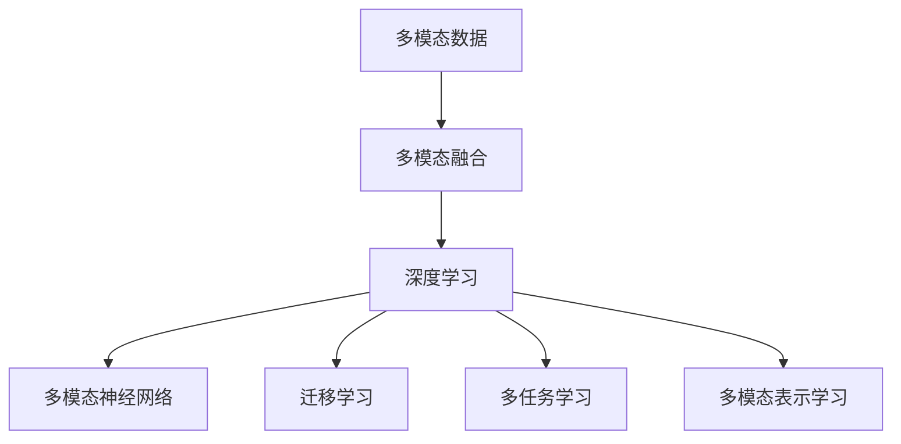

                 

# 深度学习在多模态融合中的应用

## 1. 背景介绍

### 1.1 问题由来

在当今的信息时代，数据不再局限于单一模态，如图像、文本、声音、视频等各类模态数据日益丰富。多模态融合(Multimodal Fusion)技术旨在从多种数据源中提取有效信息，并综合加以利用，以提升模型的泛化能力和决策质量。深度学习(DL)技术，特别是深度神经网络(DNN)，凭借其在非线性建模、特征表示等方面的强大能力，成为了多模态融合的主要手段。

### 1.2 问题核心关键点

多模态融合涉及的关键点包括：

- **数据融合**：如何将不同模态的数据整合并转化为模型可以处理的输入形式。
- **特征对齐**：如何在不同模态间建立特征对齐，使各模态信息相互增强。
- **融合模型**：设计怎样的融合模型，以融合不同模态的数据。
- **性能提升**：多模态融合如何能够显著提升模型在特定任务上的表现。

这些问题直接关系到多模态融合技术的实用性和有效性，需要通过深度学习技术予以解决。

### 1.3 问题研究意义

多模态融合在诸多领域具有重要应用价值，如智能医疗、自动驾驶、智能安防、人机交互等。通过对多源数据进行融合，可以显著提升模型的泛化能力和决策精度，实现对复杂场景的智能理解和应对。

- **医疗领域**：融合医学影像、电子病历、基因数据等多种数据，进行疾病诊断、治疗方案制定等。
- **自动驾驶**：结合雷达、摄像头、激光雷达等多种传感器数据，提升自动驾驶系统的安全性和准确性。
- **智能安防**：综合视频、声音、行为等数据，实现智能监控和异常检测。
- **人机交互**：融合语音、手势、面部表情等多种输入方式，提升人机交互的自然性和便捷性。

## 2. 核心概念与联系

### 2.1 核心概念概述

为更好地理解深度学习在多模态融合中的应用，本节将介绍几个密切相关的核心概念：

- **多模态数据**：包括图像、文本、声音、视频等多种形式的数据，可以捕捉更丰富的信息。
- **多模态融合**：将不同模态的数据整合并转化为模型可以处理的输入形式，并通过深度学习模型加以融合。
- **深度学习**：一类基于神经网络的机器学习技术，具有强大的特征提取和表示能力。
- **多模态神经网络**：专门用于多模态数据融合的深度神经网络，如多模态卷积神经网络(MCNN)、多模态循环神经网络(MRNN)等。
- **迁移学习**：利用已有预训练模型的知识，对特定任务进行微调，提升模型效果。
- **多任务学习**：同时训练多个相关任务，共享网络参数，提高模型泛化能力。
- **多模态表示学习**：学习如何通过多模态数据提取具有语义意义的联合表示。

这些核心概念之间的逻辑关系可以通过以下Mermaid流程图来展示：



这个流程图展示了好多模态融合的关键概念及其之间的关系：

1. 多模态数据通过多模态融合技术进行整合并转化为模型输入。
2. 多模态融合后的数据通过深度学习模型进行处理。
3. 深度学习模型可以是专门设计的多模态神经网络。
4. 深度学习模型还支持迁移学习和多任务学习等技术。
5. 最终目标是学习具有语义意义的联合表示，提升模型性能。

## 3. 核心算法原理 & 具体操作步骤

### 3.1 算法原理概述

多模态融合的核心思想是通过深度学习模型，将不同模态的数据转化为统一的表示，并进行综合融合。多模态融合算法通常包括特征提取、特征对齐和融合三个步骤。

1. **特征提取**：通过深度神经网络对不同模态的数据进行特征提取，将非结构化数据转化为结构化特征表示。
2. **特征对齐**：在不同模态特征之间建立对齐关系，使得不同模态的特征具有语义一致性。
3. **融合**：将不同模态的特征进行组合，生成统一的联合表示，提高模型的泛化能力和决策精度。

深度学习模型，特别是卷积神经网络(CNN)、循环神经网络(RNN)及其变种，在特征提取和特征对齐中具有显著优势。

### 3.2 算法步骤详解

#### 3.2.1 特征提取

特征提取是深度学习在多模态融合中的第一步。主要步骤包括：

1. **数据预处理**：对不同模态的数据进行标准化、归一化、增强等预处理操作。
2. **特征编码**：利用深度神经网络对不同模态的数据进行编码，提取其特征表示。

以图像和文本数据为例，特征提取流程如下：

1. **图像数据预处理**：将图像进行裁剪、缩放、归一化等预处理，转换为适合深度学习模型输入的尺寸。
2. **文本数据预处理**：对文本进行分词、编码、嵌入等操作，转换为向量形式。
3. **特征编码**：
    - **图像特征编码**：通过卷积神经网络对图像进行特征提取，生成高层次的特征表示。
    - **文本特征编码**：通过嵌入层将文本转换为向量形式，再通过循环神经网络对序列数据进行特征提取。

#### 3.2.2 特征对齐

特征对齐旨在在不同模态特征之间建立对齐关系，使得不同模态的特征具有语义一致性。主要步骤包括：

1. **对齐模型选择**：选择合适的对齐模型，如多模态矩阵分解、共线性约束、可迁移性约束等。
2. **特征对齐训练**：在训练过程中，通过优化对齐模型的参数，使得不同模态的特征对齐一致。

以图像和文本数据为例，特征对齐流程如下：

1. **图像特征对齐**：通过多模态矩阵分解，将图像特征与文本特征对齐。
2. **文本特征对齐**：通过共线性约束，将文本特征与图像特征对齐。

#### 3.2.3 特征融合

特征融合是将不同模态的特征进行组合，生成统一的联合表示。主要步骤包括：

1. **融合模型选择**：选择合适的融合模型，如多模态卷积神经网络(MCNN)、多模态循环神经网络(MRNN)等。
2. **融合模型训练**：在训练过程中，通过优化融合模型的参数，使得不同模态的特征得到充分融合。

以图像和文本数据为例，特征融合流程如下：

1. **图像特征融合**：通过多模态卷积神经网络，将图像特征与文本特征进行融合。
2. **文本特征融合**：通过多模态循环神经网络，将文本特征与图像特征进行融合。

### 3.3 算法优缺点

深度学习在多模态融合中具有以下优点：

1. **强大的特征提取能力**：深度神经网络能够自动学习数据中的高层次特征表示，提升模型泛化能力。
2. **端到端训练**：通过深度学习模型，可以将不同模态的数据整合并转化为统一的表示，无需手动对齐。
3. **灵活性**：深度学习模型可以灵活选择不同的网络结构，适应不同的任务需求。

同时，深度学习在多模态融合中也存在一些局限性：

1. **数据量大**：深度学习模型需要大量数据进行训练，对计算资源要求较高。
2. **模型复杂度高**：深度神经网络模型复杂度高，训练和推理速度较慢。
3. **可解释性不足**：深度学习模型通常缺乏可解释性，难以理解其内部工作机制。

## 4. 数学模型和公式 & 详细讲解

### 4.1 数学模型构建

假设多模态融合系统包含三种模态的数据：图像 $X$、文本 $Y$、语音 $Z$，且它们具有相同的维度 $D$。系统通过多模态神经网络 $F_{\theta}$ 对它们进行融合，生成联合表示 $H$。

$$
H = F_{\theta}(X, Y, Z)
$$

其中，$F_{\theta}$ 为参数可训练的多模态神经网络，$\theta$ 为网络参数。

### 4.2 公式推导过程

以图像和文本数据为例，推导多模态融合的数学模型。

1. **图像特征提取**：通过卷积神经网络提取图像特征 $X$，假设图像特征维度为 $d_x$，特征编码为 $X \in \mathbb{R}^{d_x}$。

2. **文本特征提取**：通过嵌入层将文本编码成向量形式 $Y \in \mathbb{R}^d$。

3. **特征对齐**：通过共线性约束，将图像特征 $X$ 与文本特征 $Y$ 对齐，生成对齐矩阵 $A \in \mathbb{R}^{d_x \times d}$。

4. **特征融合**：通过多模态卷积神经网络，将图像特征 $X$ 和文本特征 $Y$ 进行融合，生成联合表示 $H \in \mathbb{R}^{D}$。

$$
H = f_{\theta}(X \cdot A^T, Y)
$$

其中，$f_{\theta}$ 为多模态卷积神经网络，$\cdot$ 表示矩阵点乘，$^T$ 表示矩阵转置。

### 4.3 案例分析与讲解

以智能医疗诊断为例，分析深度学习在多模态融合中的应用：

1. **数据获取**：从医学影像、电子病历、基因数据等多种来源获取多模态数据。
2. **数据预处理**：对不同模态的数据进行标准化、归一化、增强等预处理操作。
3. **特征提取**：通过卷积神经网络对医学影像进行特征提取，通过嵌入层将电子病历转换为向量形式。
4. **特征对齐**：通过共线性约束，将医学影像特征与电子病历特征对齐。
5. **特征融合**：通过多模态卷积神经网络，将医学影像特征与电子病历特征进行融合，生成联合表示。
6. **模型训练**：在标注数据上训练多模态神经网络，进行疾病诊断和治疗方案制定。

## 5. 项目实践：代码实例和详细解释说明

### 5.1 开发环境搭建

在进行多模态融合的实践前，我们需要准备好开发环境。以下是使用Python进行TensorFlow开发的环境配置流程：

1. 安装Anaconda：从官网下载并安装Anaconda，用于创建独立的Python环境。

2. 创建并激活虚拟环境：
```bash
conda create -n tf-env python=3.8 
conda activate tf-env
```

3. 安装TensorFlow：根据CUDA版本，从官网获取对应的安装命令。例如：
```bash
pip install tensorflow-gpu==2.8.0
```

4. 安装各类工具包：
```bash
pip install numpy pandas scikit-learn matplotlib tqdm jupyter notebook ipython
```

完成上述步骤后，即可在`tf-env`环境中开始多模态融合的实践。

### 5.2 源代码详细实现

下面我们以图像-文本多模态融合为例，给出使用TensorFlow实现深度学习模型的代码实现。

首先，定义多模态融合的输入和输出：

```python
import tensorflow as tf
from tensorflow.keras import layers

class MultimodalModel(tf.keras.Model):
    def __init__(self, image_dim, text_dim, output_dim):
        super(MultimodalModel, self).__init__()
        
        # 图像特征提取
        self.image_conv = layers.Conv2D(64, (3, 3), activation='relu', input_shape=(32, 32, 3))
        self.image_pool = layers.MaxPooling2D((2, 2))
        self.image_flatten = layers.Flatten()
        
        # 文本特征提取
        self.text_embedding = layers.Embedding(text_dim, 256)
        self.text_lstm = layers.LSTM(256)
        
        # 特征对齐
        self.align = layers.Dense(image_dim)
        
        # 特征融合
        self.fuse = layers.Dense(output_dim)
        
    def call(self, inputs):
        x, y = inputs
        
        # 图像特征提取
        x = self.image_conv(x)
        x = self.image_pool(x)
        x = self.image_flatten(x)
        
        # 文本特征提取
        y = self.text_embedding(y)
        y = self.text_lstm(y)
        y = tf.squeeze(y, axis=1)
        
        # 特征对齐
        a = self.align(x)
        
        # 特征融合
        h = self.fuse(tf.concat([a, y], axis=1))
        
        return h
```

然后，定义训练和评估函数：

```python
from tensorflow.keras import optimizers

# 定义模型
model = MultimodalModel(image_dim=32, text_dim=1000, output_dim=10)

# 定义损失函数
loss_fn = tf.keras.losses.CategoricalCrossentropy(from_logits=True)

# 定义优化器
optimizer = optimizers.Adam()

# 定义训练过程
def train_epoch(model, dataset, batch_size, optimizer):
    model.train()
    epoch_loss = 0
    for batch in tqdm(dataset, desc='Training'):
        x, y = batch
        with tf.GradientTape() as tape:
            logits = model(x, y)
            loss = loss_fn(y, logits)
        gradients = tape.gradient(loss, model.trainable_variables)
        optimizer.apply_gradients(zip(gradients, model.trainable_variables))
        epoch_loss += loss.numpy()
    return epoch_loss / len(dataset)

# 定义评估过程
def evaluate(model, dataset, batch_size):
    model.eval()
    preds, labels = [], []
    with tf.no_grad():
        for batch in tqdm(dataset, desc='Evaluating'):
            x, y = batch
            logits = model(x, y)
            preds.append(logits.numpy())
            labels.append(y.numpy())
    return tf.keras.metrics.sparse_categorical_accuracy(labels, tf.argmax(preds, axis=1))
```

最后，启动训练流程并在测试集上评估：

```python
epochs = 10
batch_size = 16

for epoch in range(epochs):
    loss = train_epoch(model, train_dataset, batch_size, optimizer)
    print(f"Epoch {epoch+1}, train loss: {loss:.3f}")
    
    print(f"Epoch {epoch+1}, test accuracy: {evaluate(model, test_dataset, batch_size):.3f}")
```

以上就是使用TensorFlow对图像-文本多模态融合的深度学习模型进行训练和评估的完整代码实现。可以看到，TensorFlow提供了方便的API和高效的计算图机制，使得多模态融合的实践变得简单高效。

### 5.3 代码解读与分析

让我们再详细解读一下关键代码的实现细节：

**MultimodalModel类**：
- `__init__`方法：定义模型各层的参数，包括图像特征提取层、文本特征提取层、特征对齐层和特征融合层。
- `call`方法：定义模型的前向传播过程，将图像和文本输入转化为联合表示。

**train_epoch函数**：
- 将模型置为训练状态。
- 对数据集以批为单位进行迭代。
- 在每个批次上计算损失函数，反向传播更新模型参数，记录损失值。
- 返回该epoch的平均损失值。

**evaluate函数**：
- 将模型置为评估状态。
- 对测试集以批为单位进行迭代。
- 在每个批次上计算模型输出，记录预测结果和真实标签。
- 使用sparse_categorical_accuracy计算准确率，返回模型在测试集上的表现。

**训练流程**：
- 定义总的epoch数和batch size，开始循环迭代。
- 每个epoch内，在训练集上训练，输出平均损失值。
- 在验证集上评估，输出模型在测试集上的表现。

可以看到，TensorFlow提供了丰富的API和灵活的计算图机制，使得多模态融合的实现变得简单高效。开发者可以根据具体需求，选择不同的深度学习模型和优化器，并进行超参数调优，以获得最佳的模型效果。

当然，工业级的系统实现还需考虑更多因素，如模型的保存和部署、超参数的自动搜索、更灵活的任务适配层等。但核心的多模态融合范式基本与此类似。

## 6. 实际应用场景

### 6.1 智能医疗

多模态融合在智能医疗领域具有重要应用价值。通过融合医学影像、电子病历、基因数据等多种数据，可以提升疾病诊断和治疗方案制定的准确性。

以医学影像和电子病历为例，多模态融合可以这样实现：

1. **医学影像特征提取**：通过卷积神经网络对医学影像进行特征提取，生成高层次的特征表示。
2. **电子病历特征提取**：通过嵌入层将电子病历转换为向量形式。
3. **特征对齐**：通过共线性约束，将医学影像特征与电子病历特征对齐。
4. **特征融合**：通过多模态卷积神经网络，将医学影像特征与电子病历特征进行融合，生成联合表示。
5. **模型训练**：在标注数据上训练多模态神经网络，进行疾病诊断和治疗方案制定。

### 6.2 自动驾驶

多模态融合在自动驾驶领域同样具有重要应用价值。通过融合雷达、摄像头、激光雷达等多种传感器数据，可以提升自动驾驶系统的安全性和准确性。

以雷达和摄像头数据为例，多模态融合可以这样实现：

1. **雷达特征提取**：通过卷积神经网络对雷达数据进行特征提取，生成高层次的特征表示。
2. **摄像头特征提取**：通过卷积神经网络对摄像头数据进行特征提取，生成高层次的特征表示。
3. **特征对齐**：通过共线性约束，将雷达特征与摄像头特征对齐。
4. **特征融合**：通过多模态卷积神经网络，将雷达特征与摄像头特征进行融合，生成联合表示。
5. **模型训练**：在标注数据上训练多模态神经网络，进行自动驾驶决策和路径规划。

### 6.3 智能安防

多模态融合在智能安防领域同样具有重要应用价值。通过融合视频、声音、行为等数据，可以实现智能监控和异常检测。

以视频和声音数据为例，多模态融合可以这样实现：

1. **视频特征提取**：通过卷积神经网络对视频数据进行特征提取，生成高层次的特征表示。
2. **声音特征提取**：通过卷积神经网络对声音数据进行特征提取，生成高层次的特征表示。
3. **特征对齐**：通过共线性约束，将视频特征与声音特征对齐。
4. **特征融合**：通过多模态卷积神经网络，将视频特征与声音特征进行融合，生成联合表示。
5. **模型训练**：在标注数据上训练多模态神经网络，进行异常检测和报警。

### 6.4 未来应用展望

随着多模态融合技术的不断发展，未来的应用场景将更加广泛，涉及更多领域和更复杂任务。

在智慧医疗领域，多模态融合可以进一步扩展到基因数据、分子结构数据等多种数据源，提升疾病预测和个性化治疗的效果。

在自动驾驶领域，多模态融合可以进一步扩展到卫星数据、气象数据等多种数据源，提升自动驾驶系统的鲁棒性和安全性。

在智能安防领域，多模态融合可以进一步扩展到物联网数据、社交媒体数据等多种数据源，提升智能监控和异常检测的精度和效率。

此外，在智慧城市、智能家居、人机交互等多个领域，多模态融合技术也将不断深化应用，推动各行业数字化、智能化升级。

## 7. 工具和资源推荐

### 7.1 学习资源推荐

为了帮助开发者系统掌握深度学习在多模态融合中的应用，这里推荐一些优质的学习资源：

1. **Deep Learning Specialization（深度学习专项课程）**：由Andrew Ng教授讲授的深度学习专项课程，涵盖了深度学习的基本原理和实践技巧，适合初学者系统学习。
2. **CS231n：Convolutional Neural Networks for Visual Recognition**：斯坦福大学开设的视觉识别课程，详细讲解了卷积神经网络在图像分类、目标检测等任务中的应用。
3. **NLP Specialization**：由斯坦福大学讲授的自然语言处理专项课程，涵盖了NLP的基本原理和应用技术，适合初学者系统学习。
4. **Multimodal Machine Learning**：由Facebook AI Research讲授的多模态机器学习课程，详细讲解了多模态融合的基本原理和实践方法。
5. **Lecture Notes on Deep Learning**：深度学习领域经典教材，由Ian Goodfellow等著，涵盖深度学习的基本原理和应用方法。

通过对这些资源的学习实践，相信你一定能够快速掌握深度学习在多模态融合中的应用，并用于解决实际的NLP问题。

### 7.2 开发工具推荐

高效的开发离不开优秀的工具支持。以下是几款用于多模态融合开发的常用工具：

1. TensorFlow：由Google开发的深度学习框架，提供了丰富的API和高效的计算图机制，适合多模态融合任务的开发。
2. PyTorch：由Facebook开发的深度学习框架，提供了灵活的计算图和动态图机制，适合多模态融合任务的开发。
3. MXNet：由Apache开发的深度学习框架，支持多种编程语言和多种硬件平台，适合多模态融合任务的开发。
4. Keras：基于TensorFlow和Theano开发的深度学习框架，提供了简单易用的API，适合快速原型开发和模型训练。

合理利用这些工具，可以显著提升多模态融合任务的开发效率，加快创新迭代的步伐。

### 7.3 相关论文推荐

多模态融合在深度学习领域的研究方兴未艾，以下是几篇奠基性的相关论文，推荐阅读：

1. **ImageNet Classification with Deep Convolutional Neural Networks**：AlexNet论文，引入了卷积神经网络，开启了计算机视觉领域的新篇章。
2. **Convolutional Neural Networks for Sentence Classification**：采用卷积神经网络对文本数据进行特征提取和分类，取得了较好的效果。
3. **Learning Phrase Representations using RNN Encoder-Decoder for Statistical Machine Translation**：引入了循环神经网络对序列数据进行建模，提升了机器翻译的效果。
4. **Vision-and-Language Navigation**：将视觉和语言数据进行融合，实现了机器人在自然场景中进行导航。
5. **Multimodal Deep Reinforcement Learning**：融合视觉、语音、文字等多种模态数据，实现了智能机器人对复杂环境的理解和应对。

这些论文代表了大规模深度学习在多模态融合领域的发展脉络，通过学习这些前沿成果，可以帮助研究者把握学科前进方向，激发更多的创新灵感。

## 8. 总结：未来发展趋势与挑战

### 8.1 总结

本文对深度学习在多模态融合中的应用进行了全面系统的介绍。首先阐述了多模态融合的背景和意义，明确了多模态融合在智能医疗、自动驾驶、智能安防等多个领域的应用价值。其次，从原理到实践，详细讲解了多模态融合的数学模型和核心算法，给出了多模态融合任务的完整代码实现。同时，本文还广泛探讨了多模态融合技术在实际应用场景中的多种应用案例，展示了深度学习在多模态融合中的强大能力。

通过本文的系统梳理，可以看到，深度学习在多模态融合中已经取得了显著成效，为各领域带来了全新的解决方案。未来，随着深度学习技术的不断演进和应用实践的深入，多模态融合技术必将迎来更加广阔的应用前景。

### 8.2 未来发展趋势

展望未来，深度学习在多模态融合中将呈现以下几个发展趋势：

1. **更强大的特征提取能力**：通过更深层次的网络结构和更多样的特征表示方法，提升多模态特征的表达能力。
2. **更高性能的融合模型**：开发更加高效的融合算法，如注意力机制、多模态池化等，提升多模态融合的精度和效率。
3. **更丰富的数据源**：引入更多模态的数据源，如社交媒体数据、传感器数据等，提升多模态融合模型的泛化能力。
4. **更灵活的任务适配**：根据不同任务需求，设计更加灵活多变的多模态融合模型，提升模型的应用价值。
5. **更强的鲁棒性和可解释性**：通过引入对抗训练、可解释性模型等技术，提升多模态融合模型的鲁棒性和可解释性。

以上趋势凸显了深度学习在多模态融合中的巨大潜力，这些方向的探索发展，必将进一步提升多模态融合技术的实用性和普适性。

### 8.3 面临的挑战

尽管深度学习在多模态融合中已经取得了显著成效，但在迈向更加智能化、普适化应用的过程中，它仍面临着诸多挑战：

1. **数据量大**：深度学习模型需要大量数据进行训练，对计算资源要求较高。
2. **模型复杂度高**：深度神经网络模型复杂度高，训练和推理速度较慢。
3. **可解释性不足**：深度学习模型通常缺乏可解释性，难以理解其内部工作机制。
4. **鲁棒性不足**：多模态融合模型对输入数据的鲁棒性较低，难以应对噪声和异常情况。

这些挑战需要通过技术创新和工程优化来解决，使得深度学习在多模态融合中的应用更加实用和可靠。

### 8.4 研究展望

面对深度学习在多模态融合中所面临的挑战，未来的研究需要在以下几个方面寻求新的突破：

1. **数据增强**：通过数据增强技术，扩充训练集的多样性，提升模型的泛化能力。
2. **模型压缩**：通过模型压缩技术，减小模型大小，提高推理效率。
3. **可解释性模型**：开发具有可解释性的深度学习模型，提升模型的可解释性和可信任度。
4. **对抗训练**：通过对抗训练技术，提升模型的鲁棒性和泛化能力。
5. **多任务学习**：通过多任务学习技术，共享网络参数，提高模型的泛化能力。

这些研究方向的研究成果，必将进一步推动深度学习在多模态融合中的应用，为构建更加智能、高效、可靠的多模态融合系统提供新的技术支撑。

## 9. 附录：常见问题与解答

**Q1：多模态融合中的特征提取层是否可以相互替代？**

A: 不同模态的特征提取层不应直接替换。虽然深度神经网络可以处理多种模态数据，但每种模态的数据特征不同，需要特定的特征提取方法。例如，图像数据适合使用卷积神经网络进行特征提取，文本数据适合使用嵌入层和循环神经网络进行特征提取。

**Q2：多模态融合中的特征对齐方法有哪些？**

A: 多模态融合中的特征对齐方法包括但不限于：

1. **共线性约束**：通过矩阵分解，将不同模态的特征映射到相同的空间中。
2. **注意力机制**：通过注意力权重，将不同模态的特征进行加权融合。
3. **可迁移性约束**：通过优化共享权重，使得不同模态的特征具有相同的语义表示。

**Q3：多模态融合中常用的深度学习模型有哪些？**

A: 多模态融合中常用的深度学习模型包括但不限于：

1. **卷积神经网络（CNN）**：适合处理图像数据，具有强大的空间特征提取能力。
2. **循环神经网络（RNN）**：适合处理序列数据，具有强大的时间序列建模能力。
3. **变分自编码器（VAE）**：适合处理高维数据，具有强大的数据压缩和表示能力。
4. **多模态卷积神经网络（MCNN）**：适合处理多模态数据，具有强大的联合特征提取能力。

**Q4：多模态融合中的模型训练需要注意哪些问题？**

A: 多模态融合中的模型训练需要注意以下问题：

1. **数据平衡**：不同模态的数据样本应尽量平衡，避免某一种模态的数据样本过多或过少。
2. **损失函数设计**：应设计合理的损失函数，综合考虑不同模态的任务目标。
3. **超参数调优**：应进行超参数调优，寻找最佳的模型结构和参数设置。
4. **模型验证**：应在验证集上验证模型性能，及时发现并解决过拟合问题。

**Q5：多模态融合中的模型部署需要注意哪些问题？**

A: 多模态融合中的模型部署需要注意以下问题：

1. **模型压缩**：应使用模型压缩技术，减小模型大小，提高推理效率。
2. **模型加速**：应使用模型加速技术，如量化加速、混合精度训练等，提高推理速度。
3. **模型封装**：应使用模型封装技术，将模型封装为标准化服务接口，便于集成调用。
4. **模型监控**：应使用模型监控技术，实时采集系统指标，确保模型性能稳定。

这些模型部署问题需要通过技术创新和工程优化来解决，使得多模态融合模型能够在实际应用中发挥更大的价值。

---

作者：禅与计算机程序设计艺术 / Zen and the Art of Computer Programming

