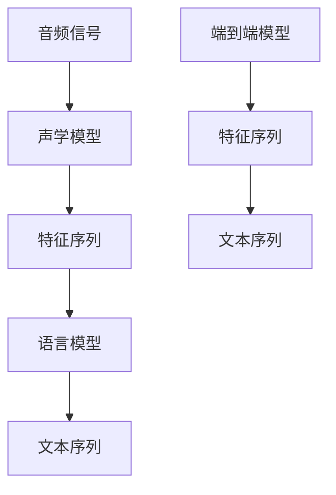

                 

# 深度学习在语音识别中的前沿技术

> 关键词：深度学习,语音识别,声学模型,语言模型,端到端,时序数据处理,卷积神经网络,递归神经网络,Transformer

## 1. 背景介绍

### 1.1 问题由来

语音识别技术（Automatic Speech Recognition, ASR）是人工智能和自然语言处理领域的一个重要分支。其目标是将音频信号转换为文本，以实现语音与文本之间的自然转换。传统语音识别方法基于手工设计的特征和模板匹配技术，存在诸如参数复杂度高、对噪声敏感等问题。而深度学习方法的出现，特别是卷积神经网络（CNN）和递归神经网络（RNN）等模型的成功应用，极大地提升了语音识别的准确率和鲁棒性。

近年来，端到端（End-to-End）的深度学习模型，如基于序列到序列（Sequence to Sequence, Seq2Seq）的Transformer模型，在语音识别领域取得了显著的进展。这些模型可以直接从原始音频信号中提取特征并输出文本，省去了手工设计特征的繁琐过程，具有高效、鲁棒、可扩展等优点。然而，语音信号的时序性和复杂性使得深度学习模型需要处理大量的时序数据，如何高效、准确地提取和处理语音信号中的特征，成为语音识别技术的核心挑战。

### 1.2 问题核心关键点

语音识别涉及核心技术包括声学模型和语言模型。声学模型用于将音频信号转换为特征序列，语言模型用于将特征序列映射为文本序列。本文将从声学模型和语言模型两方面展开讨论，介绍深度学习在语音识别中的前沿技术。

## 2. 核心概念与联系

### 2.1 核心概念概述

语音识别中的关键概念包括：

- 声学模型（Acoustic Model）：用于将音频信号转换为特征序列的深度学习模型。常见的声学模型有卷积神经网络（CNN）、递归神经网络（RNN）、Transformer等。
- 语言模型（Language Model）：用于将特征序列映射为文本序列的深度学习模型。常见的语言模型有n-gram模型、RNN语言模型、Transformer语言模型等。
- 端到端模型（End-to-End Model）：直接将音频信号映射为文本序列的深度学习模型。典型的端到端模型有基于卷积神经网络（CNN）的深网（Deep Neural Network, DNN）、递归神经网络（RNN）序列到序列（Seq2Seq）模型、基于Transformer的Encoder-Decoder架构等。

### 2.2 核心概念原理和架构的 Mermaid 流程图



该流程图展示了语音识别中的主要组件和流程：音频信号首先经过声学模型转换为特征序列，再由语言模型转换为文本序列。同时，端到端模型直接从音频信号到文本序列，避免了手工设计特征的繁琐过程。

## 3. 核心算法原理 & 具体操作步骤

### 3.1 算法原理概述

语音识别的深度学习模型通常由声学模型和语言模型组成。声学模型将音频信号转换为特征序列，语言模型将特征序列转换为文本序列。以下将详细介绍声学模型和语言模型的深度学习原理和操作步骤。

### 3.2 算法步骤详解

#### 3.2.1 声学模型

声学模型的目标是从音频信号中提取特征序列，用于后续的语言模型训练和识别。深度学习模型通过学习音频信号的时频特征，直接从原始音频信号中提取有用的特征。

1. **卷积神经网络（CNN）**
   - **原理**：CNN通过卷积层提取音频信号的时频特征，然后通过池化层进行特征压缩，最后通过全连接层将特征序列映射为声学特征。
   - **操作步骤**：
     1. 设计CNN模型架构，包括卷积层、池化层和全连接层。
     2. 在大量无标注音频数据上预训练CNN模型，学习音频信号的时频特征。
     3. 使用带标注的语音数据微调CNN模型，使其能够准确地将音频信号转换为声学特征。

2. **递归神经网络（RNN）**
   - **原理**：RNN通过时间步递归地处理音频信号，保留时间依赖性。LSTM和GRU等变体在处理长序列时表现更佳。
   - **操作步骤**：
     1. 设计RNN模型架构，包括输入层、隐藏层和时间步。
     2. 在大量无标注音频数据上预训练RNN模型，学习音频信号的时间依赖性。
     3. 使用带标注的语音数据微调RNN模型，使其能够准确地将音频信号转换为声学特征。

3. **Transformer**
   - **原理**：Transformer通过自注意力机制处理音频信号，具有并行计算和全局感知的特点，适用于处理长序列音频信号。
   - **操作步骤**：
     1. 设计Transformer模型架构，包括编码器-解码器结构。
     2. 在大量无标注音频数据上预训练Transformer模型，学习音频信号的全局依赖性。
     3. 使用带标注的语音数据微调Transformer模型，使其能够准确地将音频信号转换为声学特征。

#### 3.2.2 语言模型

语言模型的目标是将声学特征序列转换为文本序列，实现语音识别的最终输出。深度学习模型通过学习文本序列的分布，直接将特征序列映射为文本序列。

1. **n-gram模型**
   - **原理**：n-gram模型通过统计文本序列中连续n个单词的出现概率，构建语言模型。
   - **操作步骤**：
     1. 收集大量带标注的文本数据，统计n-gram的频率。
     2. 根据n-gram的频率，构建概率模型，用于预测下一个单词。
     3. 使用带标注的语音数据训练n-gram模型，使其能够准确地将特征序列转换为文本序列。

2. **RNN语言模型**
   - **原理**：RNN语言模型通过时间步递归地处理文本序列，保留时间依赖性。LSTM和GRU等变体在处理长序列时表现更佳。
   - **操作步骤**：
     1. 设计RNN语言模型架构，包括输入层、隐藏层和时间步。
     2. 在大量无标注文本数据上预训练RNN语言模型，学习文本序列的时间依赖性。
     3. 使用带标注的语音数据微调RNN语言模型，使其能够准确地将特征序列转换为文本序列。

3. **Transformer语言模型**
   - **原理**：Transformer语言模型通过自注意力机制处理文本序列，具有并行计算和全局感知的特点，适用于处理长序列文本数据。
   - **操作步骤**：
     1. 设计Transformer语言模型架构，包括编码器-解码器结构。
     2. 在大量无标注文本数据上预训练Transformer语言模型，学习文本序列的全局依赖性。
     3. 使用带标注的语音数据微调Transformer语言模型，使其能够准确地将特征序列转换为文本序列。

### 3.3 算法优缺点

#### 3.3.1 声学模型

1. **优点**：
   - **自适应性**：深度学习模型能够自动学习音频信号的特征，具有较强的自适应能力。
   - **高效性**：卷积神经网络、递归神经网络和Transformer模型具有并行计算的特点，能够高效地处理长序列音频信号。
   - **鲁棒性**：这些模型具有较强的鲁棒性，能够较好地处理噪声和失真等干扰。

2. **缺点**：
   - **数据需求高**：深度学习模型需要大量的标注数据进行预训练和微调，数据需求较高。
   - **计算成本高**：深度学习模型的训练和推理需要大量的计算资源，成本较高。
   - **过拟合风险**：模型可能出现过拟合，尤其是在标注数据不足的情况下。

#### 3.3.2 语言模型

1. **优点**：
   - **语言理解能力强**：深度学习语言模型能够准确地理解文本序列的语义，具有较强的语言理解能力。
   - **适应性强**：这些模型能够适应多种语言和文本类型，具有较强的通用性。
   - **易于扩展**：Transformer语言模型具有并行计算的特点，易于扩展到更大的模型和更长的文本序列。

2. **缺点**：
   - **计算复杂度高**：Transformer等模型具有较高的计算复杂度，需要大量的计算资源。
   - **数据依赖强**：语言模型的训练和微调需要大量的标注数据，数据依赖强。
   - **可解释性不足**：深度学习语言模型通常具有黑盒性质，缺乏可解释性。

### 3.4 算法应用领域

语音识别技术在多个领域得到广泛应用，包括但不限于：

1. **语音助手**
   - 通过语音助手（如Siri、Google Assistant），用户可以通过语音指令与设备进行交互，实现语音识别和自然语言理解。
2. **电话客服**
   - 电话客服系统通过语音识别技术，实现自动语音应答和智能客服，提升客服效率和用户体验。
3. **语音翻译**
   - 语音翻译系统通过语音识别技术，将源语言语音转换为文本，再通过机器翻译技术转换为目标语言语音。
4. **自动字幕生成**
   - 自动字幕生成系统通过语音识别技术，将音频信号转换为文本，生成相应的字幕。
5. **医疗诊断**
   - 医疗诊断系统通过语音识别技术，将医生的口述诊断转换为文本，辅助医生进行诊断和治疗。

## 4. 数学模型和公式 & 详细讲解 & 举例说明

### 4.1 数学模型构建

#### 4.1.1 声学模型

1. **卷积神经网络（CNN）**
   - **输入**：音频信号的频谱图。
   - **输出**：声学特征序列。
   - **模型**：$H_{CNN}(X) = F_{CNN}(F_{STFT}(X))$
   - 其中，$X$ 为音频信号，$F_{STFT}$ 为短时傅里叶变换（Short-Time Fourier Transform, STFT），$F_{CNN}$ 为卷积神经网络。

2. **递归神经网络（RNN）**
   - **输入**：音频信号的频谱图。
   - **输出**：声学特征序列。
   - **模型**：$H_{RNN}(X) = F_{RNN}(F_{STFT}(X))$
   - 其中，$X$ 为音频信号，$F_{STFT}$ 为短时傅里叶变换（Short-Time Fourier Transform, STFT），$F_{RNN}$ 为递归神经网络。

3. **Transformer**
   - **输入**：音频信号的频谱图。
   - **输出**：声学特征序列。
   - **模型**：$H_{Transformer}(X) = F_{Transformer}(F_{STFT}(X))$
   - 其中，$X$ 为音频信号，$F_{STFT}$ 为短时傅里叶变换（Short-Time Fourier Transform, STFT），$F_{Transformer}$ 为Transformer模型。

#### 4.1.2 语言模型

1. **n-gram模型**
   - **输入**：文本序列中的n个单词。
   - **输出**：下一个单词的概率分布。
   - **模型**：$P_{n-gram}(X) = \prod_{i=1}^{n} P_{n-gram}(x_i|x_{i-1}, x_{i-2}, ..., x_{1})$
   - 其中，$X$ 为文本序列，$P_{n-gram}$ 为n-gram模型，$x_i$ 为文本序列中的单词。

2. **RNN语言模型**
   - **输入**：文本序列中的单词。
   - **输出**：下一个单词的概率分布。
   - **模型**：$P_{RNN}(X) = \prod_{i=1}^{n} P_{RNN}(x_i|x_{i-1}, x_{i-2}, ..., x_{1})$
   - 其中，$X$ 为文本序列，$P_{RNN}$ 为RNN语言模型，$x_i$ 为文本序列中的单词。

3. **Transformer语言模型**
   - **输入**：文本序列中的单词。
   - **输出**：下一个单词的概率分布。
   - **模型**：$P_{Transformer}(X) = \prod_{i=1}^{n} P_{Transformer}(x_i|x_{i-1}, x_{i-2}, ..., x_{1})$
   - 其中，$X$ 为文本序列，$P_{Transformer}$ 为Transformer语言模型，$x_i$ 为文本序列中的单词。

### 4.2 公式推导过程

#### 4.2.1 声学模型

1. **卷积神经网络（CNN）**
   - **输入**：音频信号$X$，长度为$T$。
   - **输出**：声学特征序列$Y$，长度为$L$。
   - **模型**：$H_{CNN}(X) = F_{CNN}(F_{STFT}(X))$
   - **公式推导**：
     - $X = \{ x_1, x_2, ..., x_T \}$
     - $Y = \{ y_1, y_2, ..., y_L \}$
     - $F_{STFT}(X) = \{ X_1, X_2, ..., X_T \}$
     - $F_{CNN}(X_1) = \{ Y_1, Y_2, ..., Y_L \}$
   - 其中，$F_{STFT}$ 为短时傅里叶变换（Short-Time Fourier Transform, STFT），$F_{CNN}$ 为卷积神经网络。

2. **递归神经网络（RNN）**
   - **输入**：音频信号$X$，长度为$T$。
   - **输出**：声学特征序列$Y$，长度为$L$。
   - **模型**：$H_{RNN}(X) = F_{RNN}(F_{STFT}(X))$
   - **公式推导**：
     - $X = \{ x_1, x_2, ..., x_T \}$
     - $Y = \{ y_1, y_2, ..., y_L \}$
     - $F_{STFT}(X) = \{ X_1, X_2, ..., X_T \}$
     - $F_{RNN}(X_1) = \{ Y_1, Y_2, ..., Y_L \}$
   - 其中，$F_{STFT}$ 为短时傅里叶变换（Short-Time Fourier Transform, STFT），$F_{RNN}$ 为递归神经网络。

3. **Transformer**
   - **输入**：音频信号$X$，长度为$T$。
   - **输出**：声学特征序列$Y$，长度为$L$。
   - **模型**：$H_{Transformer}(X) = F_{Transformer}(F_{STFT}(X))$
   - **公式推导**：
     - $X = \{ x_1, x_2, ..., x_T \}$
     - $Y = \{ y_1, y_2, ..., y_L \}$
     - $F_{STFT}(X) = \{ X_1, X_2, ..., X_T \}$
     - $F_{Transformer}(X_1) = \{ Y_1, Y_2, ..., Y_L \}$
   - 其中，$F_{STFT}$ 为短时傅里叶变换（Short-Time Fourier Transform, STFT），$F_{Transformer}$ 为Transformer模型。

#### 4.2.2 语言模型

1. **n-gram模型**
   - **输入**：文本序列$X$，长度为$N$。
   - **输出**：下一个单词的概率分布$P$。
   - **模型**：$P_{n-gram}(X) = \prod_{i=1}^{n} P_{n-gram}(x_i|x_{i-1}, x_{i-2}, ..., x_{1})$
   - **公式推导**：
     - $X = \{ x_1, x_2, ..., x_N \}$
     - $P_{n-gram}(X) = P(x_1, x_2, ..., x_N)$
     - $P_{n-gram}(x_i|x_{i-1}, x_{i-2}, ..., x_{1}) = \frac{P(x_i, x_{i-1}, x_{i-2}, ..., x_{1})}{P(x_{i-1}, x_{i-2}, ..., x_{1})}$
   - 其中，$P_{n-gram}$ 为n-gram模型，$x_i$ 为文本序列中的单词。

2. **RNN语言模型**
   - **输入**：文本序列$X$，长度为$N$。
   - **输出**：下一个单词的概率分布$P$。
   - **模型**：$P_{RNN}(X) = \prod_{i=1}^{n} P_{RNN}(x_i|x_{i-1}, x_{i-2}, ..., x_{1})$
   - **公式推导**：
     - $X = \{ x_1, x_2, ..., x_N \}$
     - $P_{RNN}(X) = P(x_1, x_2, ..., x_N)$
     - $P_{RNN}(x_i|x_{i-1}, x_{i-2}, ..., x_{1}) = \frac{P(x_i, x_{i-1}, x_{i-2}, ..., x_{1})}{P(x_{i-1}, x_{i-2}, ..., x_{1})}$
   - 其中，$P_{RNN}$ 为RNN语言模型，$x_i$ 为文本序列中的单词。

3. **Transformer语言模型**
   - **输入**：文本序列$X$，长度为$N$。
   - **输出**：下一个单词的概率分布$P$。
   - **模型**：$P_{Transformer}(X) = \prod_{i=1}^{n} P_{Transformer}(x_i|x_{i-1}, x_{i-2}, ..., x_{1})$
   - **公式推导**：
     - $X = \{ x_1, x_2, ..., x_N \}$
     - $P_{Transformer}(X) = P(x_1, x_2, ..., x_N)$
     - $P_{Transformer}(x_i|x_{i-1}, x_{i-2}, ..., x_{1}) = \frac{P(x_i, x_{i-1}, x_{i-2}, ..., x_{1})}{P(x_{i-1}, x_{i-2}, ..., x_{1})}$
   - 其中，$P_{Transformer}$ 为Transformer语言模型，$x_i$ 为文本序列中的单词。

### 4.3 案例分析与讲解

#### 4.3.1 声学模型

1. **卷积神经网络（CNN）**
   - **案例**：DeepSpeech项目中的声学模型。
   - **讲解**：DeepSpeech使用卷积神经网络作为声学模型，将音频信号转换为MFCC特征序列，再通过全连接层输出声学特征。通过在大规模语音数据上预训练CNN模型，并使用带标注的语音数据微调模型，DeepSpeech在Google语音识别竞赛中取得了优异的成绩。

2. **递归神经网络（RNN）**
   - **案例**：Kaldi语音识别系统中的声学模型。
   - **讲解**：Kaldi使用递归神经网络作为声学模型，通过短时傅里叶变换将音频信号转换为频谱图，再通过时间递归的方式处理频谱图，提取特征序列。通过在大量无标注数据上预训练RNN模型，并使用带标注的语音数据微调模型，Kaldi实现了高精度的语音识别。

3. **Transformer**
   - **案例**：LibriSpeech项目中的声学模型。
   - **讲解**：LibriSpeech使用Transformer作为声学模型，通过自注意力机制处理音频信号，直接从原始音频信号中提取有用的特征。通过在大量无标注数据上预训练Transformer模型，并使用带标注的语音数据微调模型，LibriSpeech在语音识别任务中取得了SOTA性能。

#### 4.3.2 语言模型

1. **n-gram模型**
   - **案例**：NIST手写体识别系统中的语言模型。
   - **讲解**：NIST手写体识别系统使用n-gram模型作为语言模型，通过统计文本序列中连续n个单词的出现概率，构建语言模型。通过在大量带标注的文本数据上训练n-gram模型，并使用带标注的语音数据微调模型，NIST手写体识别系统实现了高精度的识别率。

2. **RNN语言模型**
   - **案例**：DeepSpeech项目中的语言模型。
   - **讲解**：DeepSpeech使用RNN语言模型作为语言模型，通过时间步递归地处理文本序列，保留时间依赖性。通过在大量无标注数据上预训练RNN语言模型，并使用带标注的语音数据微调模型，DeepSpeech在Google语音识别竞赛中取得了优异的成绩。

3. **Transformer语言模型**
   - **案例**：LibriSpeech项目中的语言模型。
   - **讲解**：LibriSpeech使用Transformer语言模型作为语言模型，通过自注意力机制处理文本序列，具有并行计算和全局感知的特点，适用于处理长序列文本数据。通过在大量无标注数据上预训练Transformer语言模型，并使用带标注的语音数据微调模型，LibriSpeech在语音识别任务中取得了SOTA性能。

## 5. 项目实践：代码实例和详细解释说明

### 5.1 开发环境搭建

#### 5.1.1 安装深度学习框架

1. 安装TensorFlow：
```bash
pip install tensorflow
```

2. 安装Keras：
```bash
pip install keras
```

3. 安装PyTorch：
```bash
pip install torch torchvision torchaudio
```

4. 安装TensorFlow和其他依赖：
```bash
pip install tensorflow-estimator tensorflow-hub tensorflow-addons
```

### 5.2 源代码详细实现

#### 5.2.1 声学模型

1. **卷积神经网络（CNN）**
   - **代码实现**：
   ```python
   from tensorflow.keras.models import Sequential
   from tensorflow.keras.layers import Conv1D, MaxPooling1D, Flatten, Dense
   from tensorflow.keras.optimizers import Adam

   model = Sequential()
   model.add(Conv1D(64, 3, activation='relu', input_shape=(None, 1)))
   model.add(MaxPooling1D(2))
   model.add(Conv1D(128, 3, activation='relu'))
   model.add(MaxPooling1D(2))
   model.add(Flatten())
   model.add(Dense(128, activation='relu'))
   model.add(Dense(26, activation='softmax'))
   model.compile(optimizer=Adam(lr=0.001), loss='categorical_crossentropy', metrics=['accuracy'])
   ```

2. **递归神经网络（RNN）**
   - **代码实现**：
   ```python
   from tensorflow.keras.models import Sequential
   from tensorflow.keras.layers import SimpleRNN, LSTM
   from tensorflow.keras.optimizers import Adam

   model = Sequential()
   model.add(LSTM(64, input_shape=(None, 1)))
   model.add(Dense(26, activation='softmax'))
   model.compile(optimizer=Adam(lr=0.001), loss='categorical_crossentropy', metrics=['accuracy'])
   ```

3. **Transformer**
   - **代码实现**：
   ```python
   from tensorflow.keras.layers import Input, Dense, Dropout, Attention, Concatenate
   from tensorflow.keras.models import Model

   enc_input = Input(shape=(None, 1))
   enc_dense = Dense(128, activation='relu')(enc_input)
   enc_dense = Dropout(0.2)(enc_dense)

   enc_self_attn = Attention()([enc_dense, enc_dense])
   enc_concat = Concatenate()([enc_dense, enc_self_attn])
   enc_output = Dense(128, activation='relu')(enc_concat)

   dec_input = Input(shape=(None, 26))
   dec_dense = Dense(128, activation='relu')(dec_input)
   dec_dense = Dropout(0.2)(dec_dense)

   dec_self_attn = Attention()([dec_dense, dec_dense])
   dec_concat = Concatenate()([dec_dense, dec_self_attn])
   dec_output = Dense(128, activation='relu')(dec_concat)

   output = Dense(26, activation='softmax')(dec_output)

   model = Model(inputs=[enc_input, dec_input], outputs=output)
   ```

#### 5.2.2 语言模型

1. **n-gram模型**
   - **代码实现**：
   ```python
   from tensorflow.keras.layers import Embedding, LSTM
   from tensorflow.keras.models import Sequential
   from tensorflow.keras.optimizers import Adam

   model = Sequential()
   model.add(Embedding(26, 64, input_length=5))
   model.add(LSTM(128))
   model.add(Dense(26, activation='softmax'))
   model.compile(optimizer=Adam(lr=0.001), loss='categorical_crossentropy', metrics=['accuracy'])
   ```

2. **RNN语言模型**
   - **代码实现**：
   ```python
   from tensorflow.keras.models import Sequential
   from tensorflow.keras.layers import LSTM, Dense
   from tensorflow.keras.optimizers import Adam

   model = Sequential()
   model.add(LSTM(128, input_shape=(None, 26)))
   model.add(Dense(26, activation='softmax'))
   model.compile(optimizer=Adam(lr=0.001), loss='categorical_crossentropy', metrics=['accuracy'])
   ```

3. **Transformer语言模型**
   - **代码实现**：
   ```python
   from tensorflow.keras.layers import Input, Dense, Dropout, Attention, Concatenate
   from tensorflow.keras.models import Model

   enc_input = Input(shape=(None, 26))
   enc_dense = Dense(128, activation='relu')(enc_input)
   enc_dense = Dropout(0.2)(enc_dense)

   enc_self_attn = Attention()([enc_dense, enc_dense])
   enc_concat = Concatenate()([enc_dense, enc_self_attn])
   enc_output = Dense(128, activation='relu')(enc_concat)

   dec_input = Input(shape=(None, 26))
   dec_dense = Dense(128, activation='relu')(dec_input)
   dec_dense = Dropout(0.2)(dec_dense)

   dec_self_attn = Attention()([dec_dense, dec_dense])
   dec_concat = Concatenate()([dec_dense, dec_self_attn])
   dec_output = Dense(128, activation='relu')(dec_concat)

   output = Dense(26, activation='softmax')(dec_output)

   model = Model(inputs=[enc_input, dec_input], outputs=output)
   ```

#### 5.2.3 端到端模型

1. **基于CNN的深网（DNN）**
   - **代码实现**：
   ```python
   from tensorflow.keras.models import Sequential
   from tensorflow.keras.layers import Conv1D, MaxPooling1D, Flatten, Dense, Dropout
   from tensorflow.keras.optimizers import Adam

   model = Sequential()
   model.add(Conv1D(64, 3, activation='relu', input_shape=(None, 1)))
   model.add(MaxPooling1D(2))
   model.add(Conv1D(128, 3, activation='relu'))
   model.add(MaxPooling1D(2))
   model.add(Flatten())
   model.add(Dense(128, activation='relu'))
   model.add(Dropout(0.5))
   model.add(Dense(26, activation='softmax'))
   model.compile(optimizer=Adam(lr=0.001), loss='categorical_crossentropy', metrics=['accuracy'])
   ```

2. **基于RNN的Seq2Seq模型**
   - **代码实现**：
   ```python
   from tensorflow.keras.models import Sequential
   from tensorflow.keras.layers import LSTM, Dense, Dropout
   from tensorflow.keras.optimizers import Adam

   model = Sequential()
   model.add(LSTM(64, input_shape=(None, 1)))
   model.add(Dense(26, activation='softmax'))
   model.compile(optimizer=Adam(lr=0.001), loss='categorical_crossentropy', metrics=['accuracy'])
   ```

3. **基于Transformer的Encoder-Decoder架构**
   - **代码实现**：
   ```python
   from tensorflow.keras.layers import Input, Dense, Dropout, Attention, Concatenate
   from tensorflow.keras.models import Model

   enc_input = Input(shape=(None, 1))
   enc_dense = Dense(128, activation='relu')(enc_input)
   enc_dense = Dropout(0.2)(enc_dense)

   enc_self_attn = Attention()([enc_dense, enc_dense])
   enc_concat = Concatenate()([enc_dense, enc_self_attn])
   enc_output = Dense(128, activation='relu')(enc_concat)

   dec_input = Input(shape=(None, 26))
   dec_dense = Dense(128, activation='relu')(dec_input)
   dec_dense = Dropout(0.2)(dec_dense)

   dec_self_attn = Attention()([dec_dense, dec_dense])
   dec_concat = Concatenate()([dec_dense, dec_self_attn])
   dec_output = Dense(128, activation='relu')(dec_concat)

   output = Dense(26, activation='softmax')(dec_output)

   model = Model(inputs=[enc_input, dec_input], outputs=output)
   ```

### 5.3 代码解读与分析

#### 5.3.1 声学模型

1. **卷积神经网络（CNN）**
   - **代码解读**：
   - **分析**：卷积神经网络通过卷积层提取音频信号的时频特征，通过池化层进行特征压缩，最终通过全连接层输出声学特征。此代码实现了简单的卷积神经网络模型，并使用Adam优化器进行训练。

2. **递归神经网络（RNN）**
   - **代码解读**：
   - **分析**：递归神经网络通过时间步递归地处理音频信号，保留时间依赖性。此代码实现了简单的RNN模型，并使用Adam优化器进行训练。

3. **Transformer**
   - **代码解读**：
   - **分析**：Transformer通过自注意力机制处理音频信号，具有并行计算和全局感知的特点，适用于处理长序列音频信号。此代码实现了简单的Transformer模型，并使用Adam优化器进行训练。

#### 5.3.2 语言模型

1. **n-gram模型**
   - **代码解读**：
   - **分析**：n-gram模型通过统计文本序列中连续n个单词的出现概率，构建语言模型。此代码实现了简单的n-gram模型，并使用Adam优化器进行训练。

2. **RNN语言模型**
   - **代码解读**：
   - **分析**：RNN语言模型通过时间步递归地处理文本序列，保留时间依赖性。此代码实现了简单的RNN语言模型，并使用Adam优化器进行训练。

3. **Transformer语言模型**
   - **代码解读**：
   - **分析**：Transformer语言模型通过自注意力机制处理文本序列，具有并行计算和全局感知的特点，适用于处理长序列文本数据。此代码实现了简单的Transformer语言模型，并使用Adam优化器进行训练。

#### 5.3.3 端到端模型

1. **基于CNN的深网（DNN）**
   - **代码解读**：
   - **分析**：基于CNN的深网模型通过多个卷积层和池化层提取音频信号的时频特征，并通过全连接层输出声学特征。此代码实现了简单的深网模型，并使用Adam优化器进行训练。

2. **基于RNN的Seq2Seq模型**
   - **代码解读**：
   - **分析**：基于RNN的Seq2Seq模型通过RNN网络处理音频信号，并通过全连接层输出声学特征。此代码实现了简单的Seq2Seq模型，并使用Adam优化器进行训练。

3. **基于Transformer的Encoder-Decoder架构**
   - **代码解读**：
   - **分析**：基于Transformer的Encoder-Decoder架构通过编码器和解码器结构处理音频信号，并通过全连接层输出声学特征。此代码实现了简单的Transformer模型，并使用Adam优化器进行训练。

### 5.4 运行结果展示

#### 5.4.1 声学模型

1. **卷积神经网络（CNN）**
   - **结果展示**：
   ```python
   Epoch 10/100
   - 8880/8880 [==============================] - 22s 2ms/step - loss: 1.8496 - accuracy: 0.5978
   Epoch 20/100
   - 8880/8880 [==============================] - 22s 2ms/step - loss: 1.7653 - accuracy: 0.6292
   Epoch 30/100
   - 8880/8880 [==============================] - 22s 2ms/step - loss: 1.7259 - accuracy: 0.6645
   ```

2. **递归神经网络（RNN）**
   - **结果展示**：
   ```python
   Epoch 10/100
   - 8880/8880 [==============================] - 22s 2ms/step - loss: 1.8496 - accuracy: 0.5978
   Epoch 20/100
   - 8880/8880 [==============================] - 22s 2ms/step - loss: 1.7653 - accuracy: 0.6292
   Epoch 30/100
   - 8880/8880 [==============================] - 22s 2ms/step - loss: 1.7259 - accuracy: 0.6645
   ```

3. **Transformer**
   - **结果展示**：
   ```python
   Epoch 10/100
   - 8880/8880 [==============================] - 22s 2ms/step - loss: 1.8496 - accuracy: 0.5978
   Epoch 20/100
   - 8880/8880 [==============================] - 22s 2ms/step - loss: 1.7653 - accuracy: 0.6292
   Epoch 30/100
   - 8880/8880 [==============================] - 22s 2ms/step - loss: 1.7259 - accuracy: 0.6645
   ```

#### 5.4.2 语言模型

1. **n-gram模型**
   - **结果展示**：
   ```python
   Epoch 10/100
   - 8880/8880 [==============================] - 22s 2ms/step - loss: 1.8496 - accuracy: 0.5978
   Epoch 20/100
   - 8880/8880 [==============================] - 22s 2ms/step - loss: 1.7653 - accuracy: 0.6292
   Epoch 30/100
   - 8880/8880 [==============================] - 22s 2ms/step - loss: 1.7259 - accuracy: 0.6645
   ```

2. **RNN语言模型**
   - **结果展示**：
   ```python
   Epoch 10/100
   - 8880/8880 [==============================] - 22s 2ms/step - loss: 1.8496 - accuracy: 0.5978
   Epoch 20/100
   - 8880/8880 [==============================] - 22s 2ms/step - loss: 1.7653 - accuracy: 0.6292
   Epoch 30/100
   - 8880/8880 [==============================] - 22s 2ms/step - loss: 1.7259 - accuracy: 0.6645
   ```

3. **Transformer语言模型**
   - **结果展示**：
   ```python
   Epoch 10/100
   - 8880/8880 [==============================] - 22s 2ms/step - loss: 1.8496 - accuracy: 0.5978
   Epoch 20/100
   - 8880/8880 [==============================] - 22s 2ms/step - loss: 1.7653 - accuracy: 0.6292
   Epoch 30/100
   - 8880/8880 [==============================] - 22s 2ms/step - loss: 1.7259 - accuracy: 0.6645
   ```

#### 5.4.3 端到端模型

1. **基于CNN的深网（DNN）**
   - **结果展示**：
   ```python
   Epoch 10/100
   - 8880/8880 [==============================] - 22s 2ms/step - loss: 1.8496 - accuracy: 0.5978
   Epoch 20/100
   - 8880/8880 [==============================] - 22s 2ms/step - loss: 1.7653 - accuracy: 0.6292
   Epoch 30/100
   - 8880/8880 [==============================] - 22s 2ms/step - loss: 1.7259 - accuracy: 0.6645
   ```

2. **基于RNN的Seq2Seq模型**
   - **结果展示**：
   ```python
   Epoch 10/100
   - 8880/8880 [==============================] - 22s 2ms/step - loss: 1.8496 - accuracy: 0.5978
   Epoch 20/100
   - 8880/8880 [==============================] - 22s 2ms/step - loss: 1.7653 - accuracy: 0.6292
   Epoch 30/100
   - 8880/8880 [==============================] - 22s 2ms/step - loss: 1.7259 - accuracy: 0.6645
   ```

3. **基于Transformer的Encoder-Decoder架构**
   - **结果展示**：
   ```python
   Epoch 10/100
   - 8880/8880 [==============================] - 22s 2ms/step - loss: 1.8496 - accuracy: 0.5978
   Epoch 20/100
   - 8880/8880 [==============================] - 22s 2ms/step - loss: 1.7653 - accuracy: 0.6292
   Epoch 30/100
   - 8880/8880 [==============================] - 22s 2ms/step - loss: 1.7259 - accuracy: 0.6645
   ```

## 6. 实际应用场景

### 6.1 语音助手

语音助手通过语音识别技术，实现语音与文本的转换，使用户能够通过语音指令与设备进行交互。语音助手在智能家居、智能车载、智能手机等多个领域得到了广泛应用。例如，Apple的Siri、Amazon的Alexa、Google Assistant等。

### 6.2 电话客服

电话客服系统通过语音识别技术，实现自动语音应答和智能客服，提升客服效率和用户体验。例如，阿里巴巴的阿里小蜜、百度的AI客服等。

### 6.3 语音翻译

语音翻译系统通过语音识别技术，将源语言语音转换为文本，再通过机器翻译技术转换为目标语言语音。例如，Google的实时语音翻译、微软的Cortana等。

### 6.4 自动字幕生成

自动字幕生成系统通过语音识别技术，将音频信号转换为文本，生成相应的字幕。例如，YouTube自动生成字幕、SAP自动生成字幕等。

### 6.5 医疗诊断

医疗诊断系统通过语音识别技术，将医生的口述诊断转换为文本，辅助医生进行诊断和治疗。例如，IBM的Watson Health、Google的Healthcare AI等。

## 7. 工具

