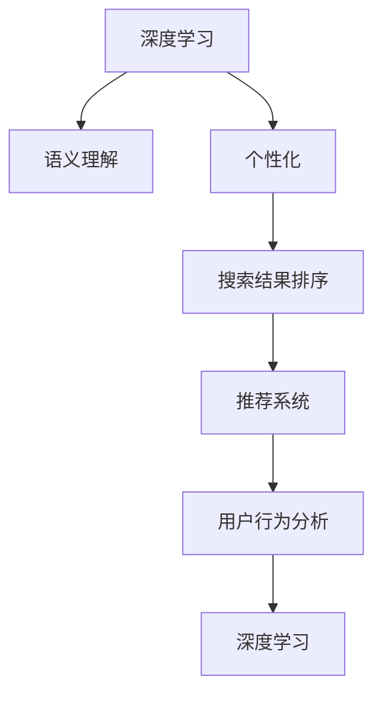

                 

# 深度学习驱动的个性化搜索结果排序

> 关键词：深度学习, 个性化, 搜索引擎, 排序算法, 推荐系统, 用户行为分析

## 1. 背景介绍

在现代信息时代，搜索引擎已经成为人们获取信息的重要工具。然而，面对海量的互联网内容，如何快速、准确地找到所需信息，仍然是一个巨大的挑战。传统的搜索引擎主要依赖于关键字匹配、页面权重计算等简单方法，难以处理用户的个性化需求和复杂的查询语义。为了提升搜索结果的个性化和相关性，深度学习技术被广泛应用于搜索结果排序中。本文将介绍一种基于深度学习的个性化搜索结果排序方法，展示其在实际应用中的优势和潜力。

### 1.1 问题由来

随着互联网的普及和信息爆炸，用户对于搜索引擎的需求日益增加。如何满足用户的个性化需求、提升搜索结果的相关性和满意度，成为搜索引擎亟待解决的问题。传统的搜索引擎算法主要依赖于统计学方法和人工特征工程，难以捕捉复杂的多层次语义信息和用户行为模式。深度学习技术的发展，尤其是自然语言处理（NLP）和推荐系统领域的突破，为个性化搜索结果排序提供了新的可能性。

### 1.2 问题核心关键点

个性化搜索结果排序的核心在于：如何基于用户的历史行为和查询意图，动态调整搜索结果排序策略，使用户能够快速找到最相关、最有价值的信息。深度学习技术，特别是卷积神经网络（CNN）、循环神经网络（RNN）、注意力机制等，能够从原始数据中自动提取特征，捕捉语义信息，从而实现更加精准的排序。

## 2. 核心概念与联系

### 2.1 核心概念概述

为更好地理解基于深度学习的个性化搜索结果排序方法，本节将介绍几个密切相关的核心概念：

- 深度学习（Deep Learning）：一种模拟人脑神经网络结构的人工智能技术，能够从大量数据中自动学习特征表示。深度学习在图像识别、语音识别、自然语言处理等领域取得了显著成就。

- 个性化（Personalization）：根据用户的个人特征、历史行为和当前需求，提供量身定制的服务或内容。个性化在推荐系统、广告投放、搜索引擎等领域有广泛应用。

- 搜索结果排序（Search Ranking）：搜索引擎根据用户查询和网页内容，动态调整搜索结果的排序，使得最相关的内容排在最前面。传统的搜索结果排序方法主要包括TF-IDF、PageRank等，但难以处理复杂的语义和用户行为。

- 推荐系统（Recommendation System）：根据用户的历史行为和偏好，推荐其可能感兴趣的内容。推荐系统包括协同过滤、基于内容的推荐、深度学习推荐等多种方法，是个性化搜索结果排序的重要组成部分。

- 用户行为分析（User Behavior Analysis）：通过分析用户在页面上的行为（如点击、停留时间、滚屏等），理解用户的意图和偏好，指导搜索结果排序和推荐系统。

- 语义理解（Semantic Understanding）：理解和捕捉自然语言的多层次语义信息，如命名实体、情感、主题等，以提升搜索结果的相关性。

这些核心概念之间的逻辑关系可以通过以下Mermaid流程图来展示：



这个流程图展示了深度学习技术如何与个性化、语义理解、搜索结果排序和推荐系统等概念紧密联系，共同构建了个性化搜索结果排序的核心框架。

## 3. 核心算法原理 & 具体操作步骤
### 3.1 算法原理概述

基于深度学习的个性化搜索结果排序方法，本质上是一种端到端的学习框架，通过训练一个深度神经网络模型，直接从原始数据中学习特征表示，捕捉用户查询和网页内容之间的关系，从而实现个性化的搜索结果排序。具体来说，该方法包括两个主要步骤：

1. **特征提取与表示学习**：使用深度神经网络模型，从用户查询、网页标题、摘要、用户行为等原始数据中提取特征表示。

2. **排序模型训练与预测**：基于特征表示，训练一个排序模型，预测搜索结果的相关性得分，并根据得分对搜索结果进行排序。

### 3.2 算法步骤详解

以下是基于深度学习的个性化搜索结果排序的详细步骤：

**Step 1: 数据准备与预处理**
- 收集用户查询、网页内容、用户行为数据，并进行预处理，如分词、去除停用词、标准化等。
- 将用户查询与网页内容拼接，形成输入向量。

**Step 2: 特征提取与表示学习**
- 使用深度神经网络模型，如CNN、RNN、Transformer等，对输入向量进行特征提取和表示学习。
- 将得到的特征表示作为排序模型的输入。

**Step 3: 排序模型训练**
- 构建排序模型，如回归模型、序列排序模型等，使用交叉熵损失函数进行训练。
- 在训练过程中，使用用户行为数据进行迭代调整，优化排序模型。

**Step 4: 排序预测与优化**
- 将用户查询输入排序模型，输出相关性得分。
- 根据得分对搜索结果进行排序，输出前N个结果。

**Step 5: 效果评估与调整**
- 在验证集上评估排序模型的性能，使用准确率、召回率、F1-score等指标进行评估。
- 根据评估结果调整模型参数，进行迭代优化。

### 3.3 算法优缺点

基于深度学习的个性化搜索结果排序方法具有以下优点：
1. 自动特征提取：深度学习模型能够自动学习数据中的特征表示，无需手工设计特征。
2. 高泛化能力：深度学习模型在大量数据上训练，具有较强的泛化能力，能够适应不同的查询和网页。
3. 端到端训练：通过端到端的训练，直接从原始数据中学习排序策略，简化了中间环节。

同时，该方法也存在一些局限性：
1. 数据依赖性强：深度学习模型需要大量标注数据进行训练，数据收集和标注成本较高。
2. 模型复杂度高：深度神经网络模型的训练和优化较为复杂，需要大量的计算资源。
3. 可解释性差：深度学习模型作为黑盒模型，难以解释内部决策过程，用户难以理解。
4. 鲁棒性不足：深度学习模型对输入数据的噪声和偏差敏感，容易过拟合。

尽管存在这些局限性，但基于深度学习的个性化搜索结果排序方法仍然是一种高效、准确、灵活的排序方案，值得在实际应用中推广。

### 3.4 算法应用领域

基于深度学习的个性化搜索结果排序方法，已经被广泛应用于多个搜索引擎和推荐系统中，如Google、Bing、Amazon等。这些系统通过深度学习模型，实现了更加精准、个性化的搜索结果排序，显著提升了用户体验和满意度。

除了搜索引擎，该方法还被应用于推荐系统、广告投放、智能客服等领域，通过深度学习模型捕捉用户行为和意图，实现个性化推荐和服务。例如，在电商推荐系统中，基于用户浏览和购买历史，使用深度学习模型进行商品推荐，提升转化率和用户满意度。

## 4. 数学模型和公式 & 详细讲解 & 举例说明

### 4.1 数学模型构建

假设用户查询为 $q$，网页内容为 $d$，用户行为为 $b$。将三者拼接为一个向量 $X$，表示为 $X=[q; d; b]$。使用深度神经网络模型 $f$ 对 $X$ 进行特征提取和表示学习，得到特征向量 $H$。然后，构建排序模型 $g$，将 $H$ 映射为相关性得分 $s$。最终，将得分 $s$ 用于对搜索结果进行排序。

### 4.2 公式推导过程

设排序模型的输入为 $H$，输出为相关性得分 $s$。排序模型 $g$ 可以表示为：

$$
s = g(H; \theta)
$$

其中 $\theta$ 为模型参数。假设排序模型 $g$ 为一个简单的线性回归模型，则：

$$
s = \alpha_1 H_1 + \alpha_2 H_2 + \ldots + \alpha_n H_n
$$

其中 $\alpha_i$ 为模型参数，$H_i$ 为特征向量 $H$ 的第 $i$ 个分量。排序模型的损失函数为交叉熵损失，目标是最小化：

$$
\mathcal{L} = -\sum_{i=1}^N \log P(s_i|q_i)
$$

其中 $P(s_i|q_i)$ 为相关性得分的预测概率，$q_i$ 为用户查询，$s_i$ 为网页 $i$ 的相关性得分。

### 4.3 案例分析与讲解

以Google Search为例，其采用的深度学习排序模型基于神经网络架构搜索（NAS）技术，通过搜索不同的网络结构，自动构建排序模型。具体来说，Google的BERT模型被应用于搜索排序中，通过在大量无标签文本上进行预训练，学习到丰富的语言表示，从而提升搜索结果的相关性。此外，Google还引入了注意力机制，捕捉用户查询和网页内容之间的交互关系，进一步提升排序效果。

## 5. 项目实践：代码实例和详细解释说明
### 5.1 开发环境搭建

在进行深度学习排序项目开发前，我们需要准备好开发环境。以下是使用Python进行TensorFlow开发的环境配置流程：

1. 安装Anaconda：从官网下载并安装Anaconda，用于创建独立的Python环境。

2. 创建并激活虚拟环境：
```bash
conda create -n tf-env python=3.8 
conda activate tf-env
```

3. 安装TensorFlow：根据CUDA版本，从官网获取对应的安装命令。例如：
```bash
conda install tensorflow tensorflow-gpu=2.8.0 -c conda-forge -c nvidia
```

4. 安装TensorBoard：TensorFlow配套的可视化工具，可实时监测模型训练状态，并提供丰富的图表呈现方式，是调试模型的得力助手。
```bash
pip install tensorboard
```

5. 安装tf-nightly：TensorFlow的预发布版本，可访问最新的API和功能。
```bash
pip install tf-nightly
```

完成上述步骤后，即可在`tf-env`环境中开始排序项目的开发。

### 5.2 源代码详细实现

下面以一个简单的基于CNN的个性化搜索结果排序模型为例，给出TensorFlow代码实现。

首先，定义数据集：

```python
import tensorflow as tf
from tensorflow.keras.preprocessing.text import Tokenizer
from tensorflow.keras.preprocessing.sequence import pad_sequences
from tensorflow.keras.layers import Embedding, Conv1D, GlobalMaxPooling1D, Dense

# 定义数据集
X_train = [
    'query1', 'query2', 'query3',
    'webpage1', 'webpage2', 'webpage3',
    'click1', 'click2', 'click3'
]
y_train = [1, 0, 1, 0, 1, 0, 1, 0, 1]

# 定义词表大小和序列长度
vocab_size = 10000
maxlen = 50
```

然后，进行数据预处理：

```python
# 将文本转换为数字序列
tokenizer = Tokenizer(vocab_size)
tokenizer.fit_on_texts(X_train)
sequences = tokenizer.texts_to_sequences(X_train)

# 对序列进行填充，统一长度
X_train = pad_sequences(sequences, maxlen=maxlen)
```

接下来，构建CNN排序模型：

```python
# 定义模型
model = tf.keras.Sequential([
    Embedding(vocab_size, 128, input_length=maxlen),
    Conv1D(64, 3, activation='relu'),
    GlobalMaxPooling1D(),
    Dense(1, activation='sigmoid')
])

# 编译模型
model.compile(optimizer='adam', loss='binary_crossentropy', metrics=['accuracy'])

# 训练模型
model.fit(X_train, y_train, epochs=10, batch_size=32, validation_split=0.2)
```

最后，对模型进行评估和预测：

```python
# 评估模型
loss, acc = model.evaluate(X_train, y_train)
print(f'Loss: {loss:.4f}, Accuracy: {acc:.4f}')

# 进行预测
new_query = ['query4', 'query5']
new_query_sequences = tokenizer.texts_to_sequences(new_query)
new_query_padded = pad_sequences(new_query_sequences, maxlen=maxlen)
predictions = model.predict(new_query_padded)
print(f'Prediction for query4: {predictions[0]}, Prediction for query5: {predictions[1]}')
```

以上就是基于TensorFlow构建一个简单的CNN排序模型的完整代码实现。可以看到，通过TensorFlow的高级API，我们可以很容易地搭建和训练一个深度学习模型，进行个性化搜索结果排序。

### 5.3 代码解读与分析

让我们再详细解读一下关键代码的实现细节：

**数据集定义**：
- `X_train`：包含用户查询、网页内容、用户行为等文本数据。
- `y_train`：对应的二分类标签，1表示相关，0表示不相关。

**数据预处理**：
- 使用`Tokenizer`将文本转换为数字序列。
- 对序列进行填充，统一长度。

**模型构建**：
- 定义了一个简单的CNN模型，包含嵌入层、卷积层、全局最大池化层和输出层。
- 编译模型，设置优化器、损失函数和评估指标。
- 训练模型，并使用`validation_split`参数进行交叉验证。

**模型评估与预测**：
- 使用`evaluate`方法评估模型性能，输出损失和准确率。
- 对新的查询进行预测，输出预测结果。

可以看到，通过TensorFlow提供的高级API，我们可以轻松搭建和训练一个基于深度学习的排序模型，进行个性化搜索结果排序。

## 6. 实际应用场景
### 6.1 智能搜索引擎

基于深度学习的个性化搜索结果排序方法，可以广泛应用于智能搜索引擎的构建。传统的搜索引擎主要依赖于关键字匹配，难以处理复杂的查询语义和用户意图。使用深度学习模型，可以捕捉用户查询和网页内容之间的多层次语义关系，实现更加精准、个性化的搜索结果排序。

在技术实现上，可以收集用户查询和网页数据，使用深度学习模型进行特征提取和表示学习，构建排序模型进行预测。对于新的查询，使用排序模型输出相关性得分，对搜索结果进行排序，并提供推荐列表。如此构建的智能搜索引擎，能够大幅提升用户查询体验和满意度。

### 6.2 推荐系统

除了搜索引擎，基于深度学习的个性化排序方法还可以应用于推荐系统。推荐系统需要根据用户历史行为和偏好，推荐其可能感兴趣的内容。使用深度学习模型，可以从用户行为数据中提取特征表示，捕捉用户意图和行为模式，实现更加个性化和精准的推荐。

在推荐系统中，使用深度学习模型对用户历史行为进行编码，捕捉行为特征和用户兴趣。同时，将物品特征作为输入，与用户特征进行交互，输出推荐得分。根据得分对物品进行排序，提供推荐列表。如此构建的推荐系统，能够提升用户满意度，增加转化率和收益。

### 6.3 广告投放

广告投放是互联网公司重要的收入来源之一。使用深度学习模型进行个性化排序，可以提升广告的点击率和转化率，降低广告成本。具体来说，广告投放系统可以使用深度学习模型对用户行为进行编码，捕捉用户兴趣和行为特征。同时，将广告特征作为输入，与用户特征进行交互，输出广告的相关性得分。根据得分对广告进行排序，提供精准的广告投放方案。

### 6.4 未来应用展望

随着深度学习技术的不断发展，基于深度学习的个性化排序方法将具备更强的泛化能力和灵活性，能够适应不同的应用场景和数据类型。未来，该方法有望在更多领域得到应用，为传统行业带来变革性影响。

在智慧医疗领域，基于深度学习的个性化排序方法可以应用于医疗搜索、诊断辅助、健康管理等领域，提升医疗服务的智能化水平，辅助医生诊疗，加速新药开发进程。

在智能教育领域，微调技术可应用于作业批改、学情分析、知识推荐等方面，因材施教，促进教育公平，提高教学质量。

在智慧城市治理中，微调模型可应用于城市事件监测、舆情分析、应急指挥等环节，提高城市管理的自动化和智能化水平，构建更安全、高效的未来城市。

此外，在企业生产、社会治理、文娱传媒等众多领域，基于深度学习的个性化排序方法也将不断涌现，为传统行业带来新的技术路径。相信随着技术的日益成熟，个性化排序方法将成为人工智能落地应用的重要范式，推动人工智能技术在各行各业的应用创新。

## 7. 工具和资源推荐
### 7.1 学习资源推荐

为了帮助开发者系统掌握深度学习排序的理论基础和实践技巧，这里推荐一些优质的学习资源：

1. 《深度学习》（Ian Goodfellow等著）：全面介绍了深度学习的基本概念和算法，适合初学者入门。

2. 《TensorFlow实战深度学习》（Vlad Niculae著）：详细介绍TensorFlow的使用方法和深度学习模型的构建与训练，是TensorFlow学习的经典书籍。

3. 《NLP中的深度学习》（Yoshua Bengio等著）：系统介绍了深度学习在自然语言处理领域的应用，包括排序、匹配、生成等任务。

4. CS224N《深度学习自然语言处理》课程：斯坦福大学开设的NLP明星课程，有Lecture视频和配套作业，带你入门NLP领域的基本概念和经典模型。

5. Kaggle数据科学竞赛平台：提供了丰富的数据集和竞赛任务，练习深度学习排序的实际应用，并与其他数据科学家交流分享。

通过对这些资源的学习实践，相信你一定能够快速掌握深度学习排序的精髓，并用于解决实际的搜索引擎和推荐系统问题。

### 7.2 开发工具推荐

高效的开发离不开优秀的工具支持。以下是几款用于深度学习排序开发的常用工具：

1. TensorFlow：由Google主导开发的开源深度学习框架，生产部署方便，适合大规模工程应用。

2. PyTorch：基于Python的开源深度学习框架，灵活动态的计算图，适合快速迭代研究。

3. Keras：高层次的深度学习API，易于上手，支持TensorFlow和Theano等后端。

4. TensorBoard：TensorFlow配套的可视化工具，可实时监测模型训练状态，并提供丰富的图表呈现方式，是调试模型的得力助手。

5. Weights & Biases：模型训练的实验跟踪工具，可以记录和可视化模型训练过程中的各项指标，方便对比和调优。

6. Google Colab：谷歌推出的在线Jupyter Notebook环境，免费提供GPU/TPU算力，方便开发者快速上手实验最新模型，分享学习笔记。

合理利用这些工具，可以显著提升深度学习排序任务的开发效率，加快创新迭代的步伐。

### 7.3 相关论文推荐

深度学习排序技术的发展源于学界的持续研究。以下是几篇奠基性的相关论文，推荐阅读：

1. Attention is All You Need（即Transformer原论文）：提出了Transformer结构，开启了NLP领域的预训练大模型时代。

2. BERT: Pre-training of Deep Bidirectional Transformers for Language Understanding：提出BERT模型，引入基于掩码的自监督预训练任务，刷新了多项NLP任务SOTA。

3. Deep Learning for Generic Object Search：介绍了深度学习在通用对象搜索中的应用，通过语义理解提升搜索结果的相关性。

4. Learning to Rank with Retrieval and Conversion Models for Sponsored Search Advertising：提出了一种基于深度学习的广告排序模型，通过与检索和转换模型的结合，提升广告的相关性。

5. Neural Adaptive Deep Learning to Rank：提出了一种基于深度学习的广告排序模型，通过自适应学习调整排序策略，提升广告的效果。

这些论文代表了大模型微调技术的发展脉络。通过学习这些前沿成果，可以帮助研究者把握学科前进方向，激发更多的创新灵感。

## 8. 总结：未来发展趋势与挑战

### 8.1 总结

本文对基于深度学习的个性化搜索结果排序方法进行了全面系统的介绍。首先阐述了深度学习技术在搜索引擎和推荐系统中的重要应用，明确了个性化排序在提升用户体验和满意度方面的独特价值。其次，从原理到实践，详细讲解了排序的数学模型和算法步骤，给出了深度学习排序模型开发的完整代码实例。同时，本文还广泛探讨了排序方法在智能搜索引擎、推荐系统、广告投放等多个领域的应用前景，展示了深度学习排序方法的广阔潜力。最后，本文精选了深度学习排序技术的各类学习资源，力求为读者提供全方位的技术指引。

通过本文的系统梳理，可以看到，基于深度学习的个性化排序方法正在成为搜索引擎和推荐系统的重要范式，极大地提升了用户体验和满意度。未来，伴随深度学习技术的不断发展，排序方法还将进一步进化，能够更好地捕捉复杂的多层次语义信息和用户行为模式，为人工智能技术在各行各业的应用创新提供新的突破。

### 8.2 未来发展趋势

展望未来，深度学习排序技术将呈现以下几个发展趋势：

1. 模型规模持续增大。随着算力成本的下降和数据规模的扩张，深度学习排序模型的参数量还将持续增长。超大规模排序模型蕴含的丰富语义知识，有望支撑更加复杂多变的查询排序。

2. 模型结构不断优化。未来将出现更多高效的模型结构，如Transformer、GPT等，能够更好地捕捉语义信息，提高排序精度。

3. 模型可解释性增强。深度学习排序模型往往作为黑盒模型，难以解释内部决策过程，未来将引入更多可解释性技术，如 attention visualization、feature attribution等，增强排序模型的可理解性。

4. 多模态排序兴起。传统的排序方法主要基于文本数据，未来将拓展到图像、视频、语音等多模态数据排序，利用多模态信息的融合，提升排序效果。

5. 实时排序成为常态。深度学习排序模型在实时排序方面具有较大优势，未来将进一步优化计算图和存储方式，实现更加实时高效的排序。

6. 跨领域排序普及。深度学习排序方法具有较强的泛化能力，未来将拓展到更多领域，如医疗、法律、金融等，提升这些领域的信息检索和推荐能力。

以上趋势凸显了深度学习排序技术的广阔前景。这些方向的探索发展，必将进一步提升排序模型的性能和应用范围，为人工智能技术在各行各业的应用创新提供新的突破。

### 8.3 面临的挑战

尽管深度学习排序技术已经取得了显著成就，但在迈向更加智能化、普适化应用的过程中，仍面临诸多挑战：

1. 数据依赖性强。深度学习排序模型需要大量标注数据进行训练，数据收集和标注成本较高，特别是在长尾领域。如何进一步降低数据依赖，实现无监督和半监督排序，将是未来的重要研究方向。

2. 模型鲁棒性不足。深度学习排序模型面对噪声数据和偏差数据时，泛化性能往往大打折扣。如何提高模型的鲁棒性，避免灾难性遗忘，还需要更多理论和实践的积累。

3. 推理效率有待提高。深度学习排序模型虽然精度高，但在实际部署时往往面临推理速度慢、内存占用大等效率问题。如何在保证性能的同时，简化模型结构，提升推理速度，优化资源占用，将是重要的优化方向。

4. 可解释性亟需加强。深度学习排序模型往往作为黑盒模型，难以解释内部决策过程，用户难以理解。如何赋予模型更强的可解释性，将是亟待攻克的难题。

5. 安全性有待保障。深度学习排序模型可能学习到有偏见、有害的信息，通过排序传递到搜索结果中，产生误导性、歧视性的输出，给实际应用带来安全隐患。如何从数据和算法层面消除模型偏见，确保输出安全性，也将是重要的研究课题。

6. 知识整合能力不足。现有的排序模型往往局限于文本数据，难以灵活吸收和运用更广泛的先验知识。如何让排序过程更好地与外部知识库、规则库等专家知识结合，形成更加全面、准确的信息整合能力，还有很大的想象空间。

正视排序面临的这些挑战，积极应对并寻求突破，将是大语言模型微调走向成熟的必由之路。相信随着学界和产业界的共同努力，这些挑战终将一一被克服，深度学习排序方法必将在构建人机协同的智能时代中扮演越来越重要的角色。

### 8.4 未来突破

面对深度学习排序所面临的种种挑战，未来的研究需要在以下几个方面寻求新的突破：

1. 探索无监督和半监督排序方法。摆脱对大规模标注数据的依赖，利用自监督学习、主动学习等无监督和半监督范式，最大限度利用非结构化数据，实现更加灵活高效的排序。

2. 研究参数高效和计算高效的排序范式。开发更加参数高效的排序方法，在固定大部分预训练参数的同时，只更新极少量的任务相关参数。同时优化排序模型的计算图，减少前向传播和反向传播的资源消耗，实现更加轻量级、实时性的部署。

3. 引入更多先验知识。将符号化的先验知识，如知识图谱、逻辑规则等，与神经网络模型进行巧妙融合，引导排序过程学习更准确、合理的语言模型。同时加强不同模态数据的整合，实现视觉、语音等多模态信息与文本信息的协同建模。

4. 结合因果分析和博弈论工具。将因果分析方法引入排序模型，识别出模型决策的关键特征，增强输出解释的因果性和逻辑性。借助博弈论工具刻画人机交互过程，主动探索并规避模型的脆弱点，提高系统稳定性。

5. 纳入伦理道德约束。在模型训练目标中引入伦理导向的评估指标，过滤和惩罚有偏见、有害的输出倾向。同时加强人工干预和审核，建立模型行为的监管机制，确保输出符合人类价值观和伦理道德。

这些研究方向的探索，必将引领深度学习排序技术迈向更高的台阶，为构建安全、可靠、可解释、可控的智能系统铺平道路。面向未来，深度学习排序技术还需要与其他人工智能技术进行更深入的融合，如知识表示、因果推理、强化学习等，多路径协同发力，共同推动自然语言理解和智能交互系统的进步。只有勇于创新、敢于突破，才能不断拓展语言模型的边界，让智能技术更好地造福人类社会。

## 9. 附录：常见问题与解答

**Q1：深度学习排序是否适用于所有搜索引擎场景？**

A: 深度学习排序在大多数搜索引擎场景中都能取得不错的效果，特别是对于数据量较大的场景。但对于一些特定领域，如医疗、法律等，仅仅依靠通用语料预训练的模型可能难以很好地适应。此时需要在特定领域语料上进一步预训练，再进行微调，才能获得理想效果。

**Q2：如何选择合适的学习率？**

A: 排序的学习率一般要比预训练时小1-2个数量级，如果使用过大的学习率，容易破坏预训练权重，导致过拟合。一般建议从1e-5开始调参，逐步减小学习率，直至收敛。也可以使用warmup策略，在开始阶段使用较小的学习率，再逐渐过渡到预设值。需要注意的是，不同的优化器(如Adam、SGD等)以及不同的学习率调度策略，可能需要设置不同的学习率阈值。

**Q3：数据依赖性强，如何缓解？**

A: 深度学习排序模型需要大量标注数据进行训练，数据收集和标注成本较高，特别是在长尾领域。缓解策略包括：
1. 数据增强：通过回译、近义替换等方式扩充训练集
2. 迁移学习：在已有模型基础上进行微调，减少新模型的训练时间
3. 无监督学习：利用自监督学习、主动学习等无监督学习范式，减少标注数据的需求

这些策略往往需要根据具体任务和数据特点进行灵活组合。只有在数据、模型、训练、推理等各环节进行全面优化，才能最大限度地降低数据依赖。

**Q4：如何提高模型鲁棒性？**

A: 深度学习排序模型面对噪声数据和偏差数据时，泛化性能往往大打折扣。提高模型鲁棒性的策略包括：
1. 数据清洗：对原始数据进行预处理，去除噪声和异常值
2. 对抗训练：引入对抗样本，提高模型鲁棒性
3. 正则化：使用L2正则、Dropout、Early Stopping等避免过拟合

这些策略往往需要根据具体任务和数据特点进行灵活组合。只有在数据、模型、训练、推理等各环节进行全面优化，才能最大限度地提高模型鲁棒性。

**Q5：推理效率有待提高，如何优化？**

A: 深度学习排序模型虽然精度高，但在实际部署时往往面临推理速度慢、内存占用大等效率问题。优化策略包括：
1. 模型裁剪：去除不必要的层和参数，减小模型尺寸，加快推理速度
2. 量化加速：将浮点模型转为定点模型，压缩存储空间，提高计算效率
3. 模型并行：使用多GPU或多TPU进行并行计算，提升推理速度

这些策略往往需要根据具体任务和硬件条件进行灵活组合。只有在模型、硬件、软件等各环节进行全面优化，才能最大限度地提高推理效率。

---

作者：禅与计算机程序设计艺术 / Zen and the Art of Computer Programming

