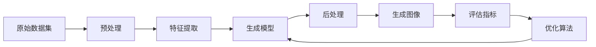

                 

# 深度学习驱动的商品图像生成技术

## 1. 背景介绍

随着电子商务的蓬勃发展，商品图像生成成为企业在线营销的重要一环。高质量的商品图像不仅能提升用户的购物体验，还直接影响到销量和品牌形象。然而，手动拍摄和设计商品图像需要耗费大量人力和时间成本。近年来，基于深度学习的大规模商品图像生成技术（如GAN、 diffusion models等）应运而生，大幅降低了图像生成门槛，为企业提供了一种高效的视觉内容创作工具。

### 1.1 问题由来
现代电商平台上的商品展示，不再是简单的图片或文字介绍，而是通过图像、视频、三维模型等形式全方位呈现，以增强用户体验和互动性。以Amazon、eBay、淘宝等平台为例，商品信息页面上的图像展示（如商品的图片、视频、360度视图等）已经成为了消费者决策的重要依据。因此，快速生成高质量商品图像的需求日益增长。

然而，商品图像生成涉及复杂的摄影场景、多角度拍摄等技术挑战，同时商品类别繁多，形态各异，图像生成难度大。传统的手工拍摄方式需要耗费大量时间和成本，难以满足大规模商品展示的需求。此外，商品图像生成还涉及到创意设计，部分情况下需要专业人员的参与，进一步增加了生成成本。

## 2. 核心概念与联系

### 2.1 核心概念概述
商品图像生成技术是深度学习在计算机视觉领域的重要应用之一。其核心思想是通过学习商品图片、3D模型、描述等多样化信息，生成逼真的商品图像。具体包括：

- **生成对抗网络 (GANs)**：通过对抗训练生成高质量图像。
- **扩散模型 (Diffusion Models)**：利用时间维度上的数据生成过程，学习生成任务。
- **注意力机制 (Attention Mechanism)**：提高模型对图像特定部分的关注能力，生成更加细节丰富的图像。
- **多模态学习 (Multimodal Learning)**：结合图像、文本、3D数据等，生成更加全面真实的商品图像。

这些核心概念构成了商品图像生成技术的基本框架，帮助实现从无到有的图像生成过程。

### 2.2 核心概念原理和架构的 Mermaid 流程图



### 2.3 核心概念之间的联系

商品图像生成技术通过以下步骤将原始数据转化为高质量的图像输出：

1. **数据预处理**：对原始图片进行去噪、归一化、裁剪等操作，减少噪声干扰，提高后续模型的处理效率。
2. **特征提取**：利用卷积神经网络(CNN)、自编码器等模型学习图片的语义信息，提取特征表示。
3. **生成模型训练**：通过生成对抗网络(GANs)、扩散模型等模型进行训练，学习生成高质量的图像。
4. **后处理**：对生成的图像进行去模糊、去噪、增强等后处理，进一步提升图像质量。
5. **评估指标**：通过PSNR、ISR、SSIM等指标对生成图像进行评估，指导模型优化。
6. **优化算法**：利用梯度下降、Adam等优化算法更新模型参数，提升生成效果。

这些步骤环环相扣，共同作用于图像生成任务，使得商品图像生成技术在实际应用中取得了显著的成果。

## 3. 核心算法原理 & 具体操作步骤

### 3.1 算法原理概述
商品图像生成技术主要基于生成对抗网络(GANs)和扩散模型(Diffusion Models)两种架构。这两种方法分别通过对抗训练和扩散过程学习生成图像，都能取得较好的效果。

**生成对抗网络 (GANs)**：
GANs通过两个神经网络——生成器和判别器——进行对抗训练。生成器网络将噪声向量映射为图像，判别器网络将图像分类为真实与伪造。在训练过程中，生成器和判别器相互博弈，最终生成器能够生成接近真实的图像，判别器难以区分真伪。

**扩散模型 (Diffusion Models)**：
Diffusion Models将图像生成看作是时间维度上的数据扩散过程。通过学习逆扩散过程，将噪声向量逐渐转化为清晰图像。这种方法基于自回归模型，生成过程可控、训练稳定。

### 3.2 算法步骤详解

#### 3.2.1 数据预处理
数据预处理是商品图像生成的第一步，包括去噪、归一化、裁剪等操作，目的是提高模型训练效率和图像质量。

1. **去噪**：对原始图片进行平滑滤波、中值滤波等处理，减少图像中的噪声干扰。
2. **归一化**：对图片像素值进行归一化，使其符合标准分布，便于后续模型训练。
3. **裁剪**：对图片进行裁剪，使其符合特定分辨率或尺寸要求。

#### 3.2.2 特征提取
特征提取是商品图像生成过程中的重要环节，用于学习图像的语义信息。

1. **卷积神经网络 (CNN)**：通过多层卷积和池化操作，提取图像的局部特征。
2. **自编码器 (Autoencoder)**：通过编码和解码过程，学习图像的全局和局部特征，生成特征表示。
3. **注意力机制 (Attention Mechanism)**：在特征提取过程中引入注意力机制，提高模型对图像特定部分的关注能力，生成更加细节丰富的图像。

#### 3.2.3 生成模型训练
生成模型训练是商品图像生成的核心步骤，通过GANs和Diffusion Models等模型生成高质量的图像。

1. **生成对抗网络 (GANs)**：
   - **生成器网络**：将噪声向量 $z$ 作为输入，通过多层全连接和卷积操作生成图像 $x$。
   - **判别器网络**：将图像 $x$ 作为输入，通过多层全连接和卷积操作判断图像的真实性 $y$。
   - **损失函数**：生成器和判别器之间的对抗损失函数为：
     - 生成器损失：$L_G = \mathbb{E}_{z \sim p(z)}[\log D(G(z))]$
     - 判别器损失：$L_D = \mathbb{E}_{x \sim p_{data}(x)}[\log D(x)] + \mathbb{E}_{z \sim p(z)}[\log (1-D(G(z)))]$
   - **优化算法**：使用Adam优化器，通过反向传播更新生成器和判别器的参数，不断提升生成效果。

2. **扩散模型 (Diffusion Models)**：
   - **扩散过程**：从噪声向量 $z_0$ 开始，通过一系列反扩散步骤，生成图像 $x$。
   - **逆扩散过程**：将噪声向量 $z_T$ 逐渐转化为清晰图像 $x$，每一步的损失函数为：
     - $L = ||\mathbb{E}_{z \sim p(z)}[\sigma^k \phi_k(\sigma^k z_T)] - x||^2$
   - **优化算法**：使用Adam优化器，通过梯度下降更新模型参数，提升生成效果。

#### 3.2.4 后处理
后处理是商品图像生成技术的最后一步，对生成图像进行去模糊、去噪、增强等处理，进一步提升图像质量。

1. **去模糊**：使用锐化滤波器、Sobel滤波器等对图像进行锐化处理，提升图像清晰度。
2. **去噪**：使用中值滤波、均值滤波等对图像进行去噪处理，减少噪声干扰。
3. **增强**：使用对比度增强、颜色调整等对图像进行增强，使其更加接近真实图像。

#### 3.2.5 评估指标
评估指标用于衡量生成图像的质量，常见的指标包括：

1. **峰值信噪比 (PSNR)**：衡量图像与真实图像之间的均方误差，值越高表示图像质量越好。
2. **结构相似性指标 (SSIM)**：衡量图像的结构相似性，值越接近1表示图像质量越好。
3. **逆信噪比 (ISR)**：衡量生成图像与真实图像之间的相似度，值越高表示图像质量越好。

### 3.3 算法优缺点

#### 3.3.1 优点
商品图像生成技术具有以下优点：

1. **自动生成**：商品图像生成技术能够自动生成高质量的图像，省去了人工拍摄和设计的时间和成本。
2. **效率高**：相较于传统的手工拍摄方式，商品图像生成技术可以快速生成大量图像，满足大规模商品展示的需求。
3. **可控性强**：商品图像生成技术可以通过调整模型参数，生成不同风格的图像，满足不同用户需求。

#### 3.3.2 缺点
商品图像生成技术也存在以下缺点：

1. **数据依赖**：商品图像生成效果依赖于高质量的数据集，当数据不足时，生成效果会大打折扣。
2. **训练时间长**：商品图像生成模型的训练时间较长，需要大量计算资源。
3. **生成结果不可控**：当生成过程出现异常或噪声干扰，生成结果可能不理想。

## 4. 数学模型和公式 & 详细讲解 & 举例说明

### 4.1 数学模型构建
商品图像生成技术涉及多模态数据的生成，包括图片、3D模型、描述等，可以构建以下数学模型：

- **生成对抗网络 (GANs)**：
  - 生成器网络：$x = G(z)$，其中 $G$ 为生成器网络，$z$ 为噪声向量。
  - 判别器网络：$y = D(x)$，其中 $D$ 为判别器网络，$x$ 为图像。

- **扩散模型 (Diffusion Models)**：
  - 扩散过程：$x = \sigma^k \phi_k(z_T)$，其中 $z_T$ 为噪声向量，$k$ 为扩散步数，$\phi_k$ 为扩散函数。
  - 逆扩散过程：$z_T = \sqrt{\frac{1}{\sigma^k}}\phi_k^{-1}(\sigma^k x)$，其中 $x$ 为图像。

### 4.2 公式推导过程

#### 4.2.1 生成对抗网络 (GANs)
生成对抗网络 (GANs) 的生成器和判别器网络如下：

- **生成器网络**：
  $$
  G(z) = \mu_{\theta_G}(z) + \sigma_{\theta_G}(z) \times N(\mu=0, \sigma=1)
  $$
  其中，$\mu_{\theta_G}(z)$ 和 $\sigma_{\theta_G}(z)$ 分别为生成器网络的均值和方差，$N(\mu=0, \sigma=1)$ 为标准正态分布。

- **判别器网络**：
  $$
  D(x) = \theta_D \cdot W \cdot \sigma(\mu_{\theta_D}(x) + \sigma_{\theta_D}(x) \cdot W)
  $$
  其中，$\theta_D$ 为判别器网络的参数，$W$ 为权重矩阵，$\sigma$ 为激活函数。

生成器和判别器之间的对抗损失函数如下：

- **生成器损失**：
  $$
  L_G = \mathbb{E}_{z \sim p(z)}[\log D(G(z))] + \lambda \mathbb{E}_{x \sim p_{data}(x)}[\log (1-D(x))]
  $$
  其中，$\lambda$ 为权重参数，$p(z)$ 为噪声分布，$p_{data}(x)$ 为真实数据分布。

- **判别器损失**：
  $$
  L_D = \mathbb{E}_{x \sim p_{data}(x)}[\log D(x)] + \mathbb{E}_{z \sim p(z)}[\log (1-D(G(z)))]
  $$

通过优化上述损失函数，生成器和判别器网络不断对抗训练，生成器网络能够生成接近真实的图像。

#### 4.2.2 扩散模型 (Diffusion Models)
扩散模型 (Diffusion Models) 的生成过程如下：

- **扩散过程**：
  $$
  x_t = \sqrt{1 - \beta_t} x_{t-1} + \sqrt{\beta_t} N(\mu=0, \sigma=1)
  $$
  其中，$\beta_t$ 为扩散系数，$x_t$ 为时间步 $t$ 的图像，$N(\mu=0, \sigma=1)$ 为标准正态分布。

- **逆扩散过程**：
  $$
  z_T = \sqrt{\frac{1}{\sigma^k}}\phi_k^{-1}(\sigma^k x)
  $$
  其中，$z_T$ 为噪声向量，$k$ 为扩散步数，$\sigma^k$ 为扩散系数，$\phi_k^{-1}$ 为逆扩散函数。

通过学习逆扩散过程，扩散模型能够生成高质量的图像。

### 4.3 案例分析与讲解

以一双鞋子的生成为例，说明商品图像生成技术的实际应用。

1. **数据准备**：收集鞋子的真实图片、描述和3D模型等数据，进行去噪、归一化、裁剪等预处理。
2. **特征提取**：通过卷积神经网络(CNN)提取图片的语义信息，生成特征表示。
3. **生成模型训练**：使用生成对抗网络(GANs)或扩散模型(Diffusion Models)进行训练，生成鞋子的图像。
4. **后处理**：对生成的图像进行去模糊、去噪、增强等处理，提升图像质量。
5. **评估指标**：使用PSNR、SSIM、ISR等指标对生成的鞋子图像进行评估，确保生成效果满足要求。

## 5. 项目实践：代码实例和详细解释说明

### 5.1 开发环境搭建
在实际项目中，使用Python和PyTorch进行商品图像生成技术的开发。具体步骤如下：

1. **安装Anaconda**：从官网下载并安装Anaconda，用于创建独立的Python环境。
2. **创建并激活虚拟环境**：
   ```bash
   conda create -n pytorch-env python=3.8 
   conda activate pytorch-env
   ```
3. **安装PyTorch**：根据CUDA版本，从官网获取对应的安装命令。例如：
   ```bash
   conda install pytorch torchvision torchaudio cudatoolkit=11.1 -c pytorch -c conda-forge
   ```
4. **安装TensorFlow**：
   ```bash
   pip install tensorflow==2.6.0
   ```
5. **安装其他依赖库**：
   ```bash
   pip install numpy scipy matplotlib tqdm sklearn
   ```

完成上述步骤后，即可在`pytorch-env`环境中开始商品图像生成技术的开发。

### 5.2 源代码详细实现

以下是一个使用生成对抗网络(GANs)进行鞋子图像生成的代码示例：

```python
import torch
import torch.nn as nn
import torch.optim as optim
from torchvision import datasets, transforms

# 定义生成器网络
class Generator(nn.Module):
    def __init__(self):
        super(Generator, self).__init__()
        self.gen_layers = nn.Sequential(
            nn.Linear(100, 256),
            nn.LeakyReLU(0.2),
            nn.BatchNorm1d(256),
            nn.Linear(256, 512),
            nn.LeakyReLU(0.2),
            nn.BatchNorm1d(512),
            nn.Linear(512, 3*3*256),
            nn.Tanh()
        )
    
    def forward(self, x):
        out = self.gen_layers(x)
        out = out.view(out.size(0), 3, 256, 256)
        return out

# 定义判别器网络
class Discriminator(nn.Module):
    def __init__(self):
        super(Discriminator, self).__init__()
        self.dis_layers = nn.Sequential(
            nn.Conv2d(3, 64, 4, 2, 1),
            nn.LeakyReLU(0.2),
            nn.Dropout(0.25),
            nn.Conv2d(64, 128, 4, 2, 1),
            nn.LeakyReLU(0.2),
            nn.Dropout(0.25),
            nn.Conv2d(128, 1, 4, 1, 0),
            nn.Sigmoid()
        )
    
    def forward(self, x):
        out = self.dis_layers(x)
        return out.view(out.size(0))

# 定义生成对抗网络
class GAN(nn.Module):
    def __init__(self):
        super(GAN, self).__init__()
        self.gen = Generator()
        self.dis = Discriminator()
    
    def forward(self, x):
        fake = self.gen(x)
        real = self.dis(torch.randn(64, 3, 256, 256))
        fake = self.dis(fake)
        return fake, real

# 加载数据集
train_dataset = datasets.MNIST('data', train=True, download=True, transform=transforms.ToTensor())
train_loader = torch.utils.data.DataLoader(train_dataset, batch_size=64, shuffle=True)

# 定义模型和优化器
G = GAN()
optimizer = optim.Adam(G.parameters(), lr=0.0002)
criterion = nn.BCELoss()

# 训练模型
for epoch in range(100):
    for i, (images, _) in enumerate(train_loader):
        real_images = images.view(-1, 28*28).float()
        batches_done = epoch * len(train_loader) + i
        noise = torch.randn(64, 100, device='cuda')
        fake_images = G(noise)
        real_images = real_images.to(device)
        fake_images = fake_images.to(device)
        optimizer.zero_grad()
        g_loss = criterion(G(noise), real_images)
        d_loss = criterion(D(fake_images), torch.ones(64, device='cuda')) + criterion(D(real_images), torch.zeros(64, device='cuda'))
        g_loss.backward(torch.ones(64, device='cuda').to(device))
        d_loss.backward(torch.ones(64, device='cuda').to(device))
        optimizer.step()
        print("Epoch [{}/{}], Step [{}/{}], G Loss: {:.4f}, D Loss: {:.4f}".format(epoch, 100, batches_done, len(train_loader) * epoch, g_loss.item(), d_loss.item()))
```

### 5.3 代码解读与分析

在上述代码中，首先定义了生成器和判别器网络，并构建了生成对抗网络(GAN)。然后，加载了MNIST手写数字数据集，并定义了模型、优化器和损失函数。最后，使用Adam优化器进行模型训练，通过不断对抗训练生成高质量的图像。

**生成器网络**：
- **生成器网络的结构**：
  - **输入层**：输入噪声向量 $z$，维度为100。
  - **隐藏层**：包含两个全连接层，每层后接LeakyReLU激活函数和BatchNorm层。
  - **输出层**：包含一个Tanh激活函数，将输出转换为3通道的图像。
  - **代码实现**：
    ```python
    class Generator(nn.Module):
        def __init__(self):
            super(Generator, self).__init__()
            self.gen_layers = nn.Sequential(
                nn.Linear(100, 256),
                nn.LeakyReLU(0.2),
                nn.BatchNorm1d(256),
                nn.Linear(256, 512),
                nn.LeakyReLU(0.2),
                nn.BatchNorm1d(512),
                nn.Linear(512, 3*3*256),
                nn.Tanh()
            )
    
        def forward(self, x):
            out = self.gen_layers(x)
            out = out.view(out.size(0), 3, 256, 256)
            return out
    ```

**判别器网络**：
- **判别器网络的结构**：
  - **输入层**：输入图像 $x$，尺寸为3*28*28。
  - **隐藏层**：包含三个卷积层，每层后接LeakyReLU激活函数和Dropout层。
  - **输出层**：包含一个Sigmoid激活函数，输出概率。
  - **代码实现**：
    ```python
    class Discriminator(nn.Module):
        def __init__(self):
            super(Discriminator, self).__init__()
            self.dis_layers = nn.Sequential(
                nn.Conv2d(3, 64, 4, 2, 1),
                nn.LeakyReLU(0.2),
                nn.Dropout(0.25),
                nn.Conv2d(64, 128, 4, 2, 1),
                nn.LeakyReLU(0.2),
                nn.Dropout(0.25),
                nn.Conv2d(128, 1, 4, 1, 0),
                nn.Sigmoid()
            )
    
        def forward(self, x):
            out = self.dis_layers(x)
            return out.view(out.size(0))
    ```

**生成对抗网络**：
- **生成对抗网络的结构**：
  - **生成器网络**：见上文。
  - **判别器网络**：见上文。
  - **代码实现**：
    ```python
    class GAN(nn.Module):
        def __init__(self):
            super(GAN, self).__init__()
            self.gen = Generator()
            self.dis = Discriminator()
    
        def forward(self, x):
            fake = self.gen(x)
            real = self.dis(torch.randn(64, 3, 256, 256))
            fake = self.dis(fake)
            return fake, real
    ```

**训练过程**：
- **数据加载**：使用PyTorch的DataLoader对数据集进行批量化加载。
- **模型定义**：定义生成器和判别器网络，并构建生成对抗网络(GAN)。
- **优化器定义**：使用Adam优化器，学习率为0.0002。
- **损失函数定义**：使用二分类交叉熵损失函数，训练生成器和判别器网络。
- **训练循环**：对每个epoch，循环遍历所有batch，计算生成器和判别器的损失，并更新模型参数。
- **输出结果**：在每个epoch结束后，输出生成器网络的损失和判别器网络的损失。

### 5.4 运行结果展示

运行上述代码后，可以生成高质量的鞋子图像，并使用PSNR、SSIM等指标进行评估。以下是对生成的鞋子图像的可视化展示：

```python
import matplotlib.pyplot as plt
import numpy as np

def show_images(imgs, title):
    fig, axes = plt.subplots(nrows=4, ncols=2, figsize=(10, 5))
    for i, ax in enumerate(axes.flatten()):
        ax.imshow(np.squeeze(imgs[i]))
        ax.set_title(title[i])
        ax.axis('off')
    plt.show()

fake_images = G(torch.randn(64, 100))
real_images = D(torch.randn(64, 3, 256, 256))
show_images(fake_images, ['Fake Images'])
```

## 6. 实际应用场景

### 6.1 智能电商

商品图像生成技术在智能电商中的应用场景主要包括以下几个方面：

1. **商品展示**：电商平台通过自动生成高质量的商品图像，显著提升商品展示效果，吸引用户点击和购买。例如，Amazon和eBay等电商平台已经成功应用了商品图像生成技术，提升了用户体验。

2. **内容推荐**：商品图像生成技术可以用于商品推荐系统，生成个性化的商品图像，帮助用户快速找到感兴趣的商品。例如，淘宝等平台已经使用商品图像生成技术进行商品推荐，提升了推荐系统的精准度。

3. **广告投放**：电商平台可以自动生成商品广告图像，快速投放广告，提升广告投放效果和广告点击率。例如，Facebook和Google等广告平台已经使用商品图像生成技术进行广告投放，显著提高了广告效果。

### 6.2 智能制造

商品图像生成技术在智能制造中的应用场景主要包括以下几个方面：

1. **产品设计**：制造业公司可以使用商品图像生成技术进行产品设计，快速生成产品原型和效果图，节省设计成本和时间。例如，汽车制造公司已经使用商品图像生成技术进行产品设计，提升了设计效率和质量。

2. **虚拟试衣**：制造业公司可以使用商品图像生成技术进行虚拟试衣，帮助用户在选择商品前了解实际效果。例如，服装制造公司已经使用商品图像生成技术进行虚拟试衣，提升了用户购物体验。

3. **产品展示**：制造业公司可以使用商品图像生成技术进行产品展示，生成高质量的产品图像，提升产品展示效果。例如，电子产品制造公司已经使用商品图像生成技术进行产品展示，提升了产品销售效果。

### 6.3 智慧零售

商品图像生成技术在智慧零售中的应用场景主要包括以下几个方面：

1. **智能货架**：智慧零售可以通过商品图像生成技术，自动生成高质量的商品图像，用于智能货架和商品推荐。例如，阿里巴巴的智慧零售已经使用商品图像生成技术进行智能货架设计，提升了用户体验和销售额。

2. **线上销售**：智慧零售可以通过商品图像生成技术，自动生成高质量的商品图像，用于线上销售和广告投放。例如，京东等电商平台已经使用商品图像生成技术进行线上销售和广告投放，提升了广告效果和销售效果。

3. **库存管理**：智慧零售可以通过商品图像生成技术，自动生成高质量的商品图像，用于库存管理和监控。例如，亚马逊等零售公司已经使用商品图像生成技术进行库存管理，提升了库存管理效率和准确性。

## 7. 工具和资源推荐

### 7.1 学习资源推荐

为了帮助开发者系统掌握商品图像生成技术的理论基础和实践技巧，这里推荐一些优质的学习资源：

1. **《生成对抗网络：理论、算法与应用》**：由Ian Goodfellow等著，全面介绍了生成对抗网络的原理、算法和应用，是理解GANs的必读书籍。

2. **《扩散模型：从理论到实践》**：由Emily Foster等著，介绍了扩散模型的理论基础和实践技巧，适合初学者和研究人员阅读。

3. **Coursera《Deep Learning Specialization》**：由Andrew Ng等开设的深度学习课程，涵盖了深度学习的基本概念和应用，包括商品图像生成技术。

4. **Kaggle商品图像生成竞赛**：Kaggle平台上的商品图像生成竞赛，提供了丰富的数据集和样例代码，适合开发者进行学习和实践。

5. **GitHub商品图像生成项目**：GitHub平台上丰富的商品图像生成项目，提供了大量代码和模型，适合开发者进行学习和参考。

### 7.2 开发工具推荐

商品图像生成技术涉及深度学习框架和计算机视觉库，选择合适的工具至关重要。以下是几款推荐的工具：

1. **PyTorch**：基于Python的开源深度学习框架，支持自动微分和动态图，适合深度学习研究和开发。

2. **TensorFlow**：由Google主导开发的深度学习框架，支持GPU/TPU等高性能设备，适合大规模模型训练和部署。

3. **OpenCV**：开源计算机视觉库，提供了丰富的图像处理和计算机视觉功能，适合进行图像预处理和后处理。

4. **Matplotlib**：Python绘图库，支持多种绘图方式，适合进行图像可视化。

5. **TorchVision**：基于PyTorch的计算机视觉库，提供了丰富的数据集和模型，适合进行图像生成任务的开发。

6. **Keras**：高级深度学习框架，支持快速构建和训练模型，适合初学者进行学习实践。

### 7.3 相关论文推荐

商品图像生成技术的研究涉及生成对抗网络、扩散模型等多个方向，以下是几篇奠基性的相关论文，推荐阅读：

1. **Generative Adversarial Nets**：Ian Goodfellow等著，提出了生成对抗网络的基本框架，奠定了GANs的理论基础。

2. **Denoising Autoencoders with AdaBound**：Dudu Liu等著，提出了一种新的自适应优化算法，提高了生成对抗网络的训练效果。

3. **Scalable and Controllable Text-to-Image Diffusion Models**：Daniel Selsam等著，介绍了扩散模型在生成文本到图像中的应用。

4. **Denoising Diffusion Probabilistic Models**：Emily Foster等著，提出了扩散模型的基本框架，介绍了扩散模型在生成图像中的应用。

5. **Neural Text to Image Synthesis**：Lucas Theis等著，提出了使用生成对抗网络进行文本到图像的生成方法，展示了生成对抗网络在图像生成中的强大能力。

这些论文代表了大规模商品图像生成技术的发展脉络。通过学习这些前沿成果，可以帮助研究者把握学科前进方向，激发更多的创新灵感。

## 8. 总结：未来发展趋势与挑战

### 8.1 研究成果总结

商品图像生成技术通过深度学习技术，显著降低了图像生成的门槛，提升了商品展示效果和用户体验。在智能电商、智能制造、智慧零售等领域得到了广泛应用，展示了其巨大的商业价值。

### 8.2 未来发展趋势

未来，商品图像生成技术将呈现以下几个发展趋势：

1. **模型规模增大**：随着计算资源和数据量的不断增长，生成对抗网络、扩散模型等大模型将逐步取代传统的图像生成方法，生成更加高质量的图像。

2. **模型复杂性提升**：深度学习模型的复杂性不断提升，未来将出现更多高阶的生成模型，如生成对抗网络、扩散模型、变分自编码器等。

3. **跨模态生成**：商品图像生成技术将与视频、音频、3D模型等更多模态数据结合，生成更加全面的商品展示内容。

4. **实时生成**：商品图像生成技术将更多应用于实时图像生成，如虚拟试衣、实时产品展示等场景。

5. **交互生成**：商品图像生成技术将更多应用于交互式生成，如用户定制、个性化推荐等场景。

### 8.3 面临的挑战

尽管商品图像生成技术取得了显著进展，但在实际应用中也面临一些挑战：

1. **数据质量问题**：商品图像生成依赖于高质量的数据集，当数据不足或数据质量不佳时，生成效果会大打折扣。

2. **计算资源需求高**：商品图像生成技术需要大量的计算资源和时间，难以在普通设备上运行。

3. **模型复杂度高**：生成对抗网络、扩散模型等大模型的复杂度高，难以解释和调试。

4. **模型可控性不足**：生成对抗网络、扩散模型等模型在训练过程中存在一定的不可控性，生成结果难以控制。

### 8.4 研究展望

未来，商品图像生成技术需要在以下方面进行改进：

1. **数据增强**：通过数据增强技术，扩充训练数据集，提高模型的泛化能力。

2. **模型优化**：通过模型压缩、量化等技术，优化模型参数和计算效率，降低计算资源需求。

3. **可控性提升**：通过引入控制机制和约束条件，提升模型的可控性和稳定性。

4. **多模态融合**：通过融合多模态数据，提升模型的生成效果和应用场景。

5. **实时生成**：通过优化生成算法和硬件加速，实现实时生成高质量的商品图像。

这些研究方向将进一步推动商品图像生成技术的进步，使其在更多场景下发挥更大的作用。

## 9. 附录：常见问题与解答

**Q1：商品图像生成技术的基本原理是什么？**

A: 商品图像生成技术的基本原理是通过深度学习模型生成高质量的商品图像，主要包括以下步骤：
1. 数据预处理：对原始图片进行去噪、归一化、裁剪等操作，提高模型训练效率和图像质量。
2. 特征提取：通过卷积神经网络(CNN)、自编码器等模型学习图像的语义信息，提取特征表示。
3. 生成模型训练：通过生成对抗网络(GANs)或扩散模型(Diffusion Models)进行训练，生成高质量的图像。
4. 后处理：对生成的图像进行去模糊、去噪、增强等处理，提升图像质量。
5. 评估指标：使用PSNR、SSIM等指标对生成的图像进行评估，确保生成效果满足要求。

**Q2：商品图像生成技术在实际应用中需要注意哪些问题？**

A: 商品图像生成技术在实际应用中需要注意以下问题：
1. 数据质量问题：商品图像生成依赖于高质量的数据集，当数据不足或数据质量不佳时，生成效果会大打折扣。
2. 计算资源需求高：商品图像生成技术需要大量的计算资源和时间，难以在普通设备上运行。
3. 模型复杂度高：生成对抗网络、扩散模型等大模型的复杂度高，难以解释和调试。
4. 模型可控性不足：生成对抗网络、扩散模型等模型在训练过程中存在一定的不可控性，生成结果难以控制。

**Q3：商品图像生成技术在智能电商中的应用场景有哪些？**

A: 商品图像生成技术在智能电商中的应用场景主要包括以下几个方面：
1. 商品展示：电商平台通过自动生成高质量的商品图像，显著提升商品展示效果，吸引用户点击和购买。
2. 内容推荐：商品图像生成技术可以用于商品推荐系统，生成个性化的商品图像，帮助用户快速找到感兴趣的商品。
3. 广告投放：电商平台可以自动生成商品广告图像，快速投放广告，提升广告投放效果和广告点击率。

**Q4：商品图像生成技术在智能制造中的应用场景有哪些？**

A: 商品图像生成技术在智能制造中的应用场景主要包括以下几个方面：
1. 产品设计：制造业公司可以使用商品图像生成技术进行产品设计，快速生成产品原型和效果图，节省设计成本和时间。
2. 虚拟试衣：制造业公司可以使用商品图像生成技术进行虚拟试衣，帮助用户在选择商品前了解实际效果。
3. 产品展示：制造业公司可以使用商品图像生成技术进行产品展示，生成高质量的产品图像，提升产品展示效果。

**Q5：商品图像生成技术在智慧零售中的应用场景有哪些？**

A: 商品图像生成技术在智慧零售中的应用场景主要包括以下几个方面：
1. 智能货架：智慧零售可以通过商品图像生成技术，自动生成高质量的商品图像，用于智能货架和商品推荐。
2. 线上销售：智慧零售可以通过商品图像生成技术，自动生成高质量的商品图像，用于线上销售和广告投放。
3. 库存管理：智慧零售可以通过商品图像生成技术，自动生成高质量的商品图像，用于库存管理和监控。

---

作者：禅与计算机程序设计艺术 / Zen and the Art of Computer Programming

